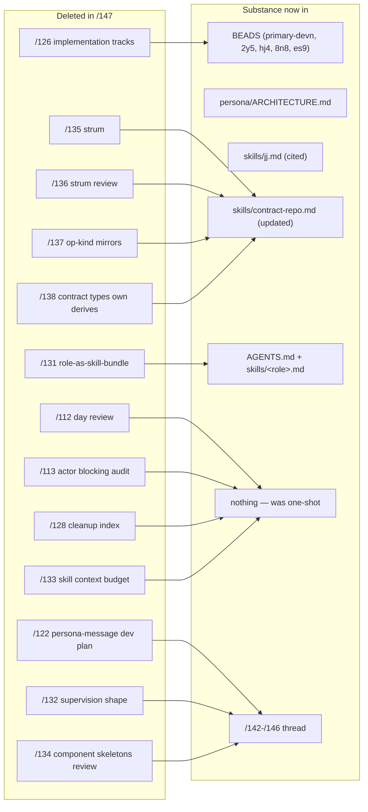

# 147 — Designer-side report and bead cleanup

*Designer cleanup pass, 2026-05-13. Deletes 13 superseded
designer reports; updates cross-references in the surviving
15; closes 4 beads and flags 1 stale in_progress bead for
user decision; surfaces open questions in §6.*

---

## 0 · TL;DR

The designer-report subdirectory had 28 files against a soft
cap of 12 (per `~/primary/skills/reporting.md` §"Hygiene").
The bead list had 50 open items against the audit threshold of
~15 (per `~/primary/skills/beads.md` §"Periodic audit"). Both
surfaces were past the trigger; this pass cleans the
designer surface and surfaces — but does not unilaterally
close — the parts that belong to the user.

| What | Before | After | Δ |
|---|---|---|---|
| Designer reports | 28 | 15 | −13 |
| Open beads | 50 | 46 | −4 (+1 flagged) |
| Stale cross-references in surviving designer reports | several | none in deleted-`/126`-range | swept |

The surviving 15 designer reports are dense and current — the
six recent-week reports (/141-/146) plus nine
foundational/active records.

---

## 1 · Designer reports deleted (13)

The deletions follow `~/primary/skills/reporting.md`'s four-way
classification (Keep / Forward / Migrate / Remove). All 13 are
**Remove** — their substance has either landed in code/skills/
ARCH, been superseded by a fresher report, or was a one-shot
analysis whose value has been absorbed.

Detail:

| # | Title | Reason for removal | Substance now in |
|---|---|---|---|
| /112 | day-review-2026-05-10 | one-shot activity log; no ongoing substance | git history |
| /113 | actor-blocking-audit | one violation in `persona-wezterm` (retired per `~/primary/protocols/active-repositories.md` §"Retired"); one borderline in persona-mind StoreSupervisor on_start, never escalated to a bead | persona-wezterm retirement + skills/actor-systems.md §"No blocking" |
| /122 | persona-message-development-plan | framed `persona-message` as a stateless NOTA proxy; reversed by /142 + /145 (it IS a supervised daemon; the `-daemon` suffix is binary-only) | /142 §3-§4, /145 |
| /126 | implementation-tracks-operator-handoff | T1-T7 + T9 implementation tracks are all now BEADS items; design rationale stays in /125 + /127 | primary-2y5, primary-hj4, primary-8n8, primary-es9, primary-devn |
| /128 | designer-report-status-after-127 | cleanup index up through /127; /147 supersedes it as the live cleanup record | /147 (this report) |
| /131 | role-as-skill-bundle | role-IS-the-bundle discipline now lives in `~/primary/AGENTS.md` §"Required reading, in order" step 4 and each `skills/<role>.md`'s Required reading section | AGENTS.md + skills/<role>.md |
| /132 | persona-engine-supervision-shape | supervision shape now defined in /142 (supervision relation + no-message-proxy correction) + /143 (process state, reducers, channel kinds) | /142, /143 |
| /133 | skill-set-context-budget | one-shot measurement of designer's required-reading burden; compressions landed; no recurring substance | git history |
| /134 | component-skeletons-and-engine-event-log-review | review of DA/24; substance absorbed into /142+/143 (typed Unimplemented variants, ComponentProcessState, channel kinds) | /142, /143 |
| /135 | strum-enum-discriminants | proposal for one-source-of-truth kind enums; shipped (signal-persona has the derives, persona/schema.rs re-exports contract types) | code + skills/contract-repo.md |
| /136 | strum-review | review of /135; thread closed at /138 (broader policy decision) | /138 → skills/contract-repo.md |
| /137 | operation-kind-mirrors | Pattern A vs Pattern B; reversed by /138 (Pattern A is not load-bearing) | skills/contract-repo.md |
| /138 | contract-types-own-wire-and-text-derives | policy decision: contract crates derive both wire (`rkyv`) and text (`NotaEnum`/`NotaRecord`); landed (signal-persona has the derives; skill updated) | skills/contract-repo.md §"Front-end stability" + code |

The `/135-/138` thread is a tight closed back-and-forth: a
mechanical proposal (`/135`), its review (`/136`), a broader
follow-up (`/137`), and a policy reversal/codification
(`/138`). The "why" is now in
`~/primary/skills/contract-repo.md` lines 49-62, which states
the new policy explicitly. The reports are no longer
load-bearing on top of that skill text.

---

## 2 · Surviving designer reports (15)

| # | Title | Role |
|---|---|---|
| /110 | cluster-trust-runtime-placement | Foundational scope decision: cluster-trust is a separate Criome-sibling component (not in persona, not in criome). Cited by /139. |
| /114 | persona-vision-as-of-2026-05-11 | Panoramic Persona federation vision. Baseline for new readers. |
| /115 | persona-engine-manager-architecture | Engine-manager framing (privileged-user, multi-engine, ConnectionClass). Foundation for /125 + /127. |
| /119 | persona-system-development-plan | Explicitly **deferred** record. Kept for when persona-system unpauses. |
| /125 | channel-choreography-and-trust-model | Trust model + channel choreography + ConnectionClass + router-as-authorized-state-owner. Foundation. |
| /127 | decisions-resolved-2026-05-11 | Seven foundational decisions (D1-D7). Decision record. |
| /129 | sandboxed-persona-engine-test | Sandbox topology + credential modes + model-per-harness + display sharing. Active spec. |
| /139 | wifi-pki-migration-designer-response | Designer response to /system-specialist/117. Active guidance. |
| /140 | jj-discipline-after-orphan-incident | Historical incident record. Cited from `~/primary/skills/jj.md` (two places). |
| /141 | minimal-criome-bls-auth-substrate | Criome design (BLS12-381 from day one). |
| /142 | supervision-in-signal-persona-no-message-proxy-daemon | Six-component first-stack, supervision relation in signal-persona, two reducers, MessageIngressSubmission. |
| /143 | prototype-readiness-gap-audit | SpawnEnvelope, ComponentProcessState, typed Unimplemented, reducer tables, message landing, Nix witness. |
| /144 | prototype-architecture-final-cleanup-after-da36 | DA/36 absorption: two-relation framing, SpawnEnvelope vs ResolvedComponentLaunch, ComponentName disambiguation. |
| /145 | component-vs-binary-naming-correction | `-daemon` suffix is binary-level only; component names stay bare. |
| /146 | introspection-component-and-contract-layer | persona-introspect (planned); three-layer contract placement. |

15 vs 12 soft cap is close. The current-week thread (/141-/146)
is dense and all load-bearing for active implementation; the
foundations (/110, /114, /115, /125, /127) capture decisions
whose rationale isn't fully recoverable from current code.

---

## 3 · Cross-references updated

`~/primary/skills/reporting.md` §"Hygiene" requires updating
surviving cross-references in the same commit that deletes
the older reports. Two kinds of update landed:

- **Inline body references** in /125 §6 (impact-list) and /127
  §2.6 (operator handoff): replaced the deleted-`/126` pointer
  with the active BEADS track set (`primary-2y5`, `primary-hj4`,
  `primary-8n8`, `primary-es9`, `primary-devn`) plus a one-line
  inline summary of what those beads carry.
- **See Also entries** in /114 (deleted /112, /113), /125
  (deleted /126; also a /128-era broken `/116-/123` range
  reference from the prior cleanup), /127 (deleted /126; also
  prior-cleanup broken `/120`, `/121`, /123 references), /129
  (deleted /126), /143 (deleted /126): removed.

Designer reports outside designer's lane (DA/operator/system-*)
still reference some of the deleted reports. Per
`~/primary/skills/beads.md` §"Stale internal references in
bead descriptions" (which generalises to reports' time-of-write
references), those are timestamps of what was true when filed,
not an ongoing accuracy contract. Not edited.

---

## 4 · Beads closed (4)

| Bead | Title | Close reason |
|---|---|---|
| `primary-2y5.4` | persona daemon: engine manager catalog design report | Substance distributed in /142 (supervision relation + ManagerEvent shape via SupervisionRequest/Reply) and /143 (§4.4 ComponentProcessState; §4.5 reducer tables; §4.8 message landing). No single dedicated 'manager catalog' report was filed because the design naturally distributed across the supervision relation, the two reducers, and the SpawnEnvelope record. Operator may proceed. |
| `primary-2y5.6` | first-stack components: runnable daemon skeletons | Superseded by `primary-devn`. In-flight skeleton work (persona-harness `62f433b9`; persona-system `feb91a84` + signal-persona-system `fe4a8320` per 2026-05-12 comments) is now tracked under `primary-devn`'s six-component first-stack supervision witness scope. The work is not lost; the umbrella moved. |
| `primary-tlu` | Persona* prefix sweep | Done for the live workspace. Remaining `PersonaSema` and `PersonaRole` hits per the 2026-05-09 comment are in retired repos (`persona-sema` retired per `~/primary/protocols/active-repositories.md`; `persona-orchestrate` retired per reports/designer-assistant/17 §3). The rule lives in `~/primary/skills/naming.md`; applies forward, no batched sweep needed. |
| `primary-0ty` | Sweep remaining free-fn examples | Discipline statement (anti-pattern A per `~/primary/skills/beads.md`). The rule lives in `~/primary/skills/skill-editor.md` §"Examples never show free functions (only main)" with the audit grep inline. Future agents apply on-touch (per the same skill's §"Auditing existing skills"). |

## 5 · Bead flagged but not closed (1)

`primary-9iv` — *Implement persona-mind Rust component against
signal-persona-mind contract* — status `in_progress`. Last
updated 2026-05-10.

Its premise is **stale**:

- Source report `~/primary/reports/designer/93-persona-orchestrate-rust-rewrite-and-activity-log.md` was deleted in the pre-today cleanup per reports/designer-assistant/17 §8 manifest.
- Target `persona-orchestrate` is retired per reports/designer-assistant/17 §3 ("persona-orchestrate as a separate work graph daemon" — retired).
- Dep `persona-sema` is retired per `~/primary/protocols/active-repositories.md` §"Retired / Cleanup Targets".

The current persona-mind shape is `/114` §0 (mind as central
state component) + active slices `primary-hj4` (channel
choreography) + `primary-nurz` (Config actor cleanup). The
bead's "persona-orchestrate-as-daemon" framing isn't the
architecture anymore.

A comment was added flagging the staleness for user decision.
Not closed unilaterally because it carries `in_progress`
status; user may have context the cleanup pass doesn't.

---

## 6 · Open questions (for the user)

### Q1 — Close `primary-9iv` as superseded?

The bead names "implement persona-mind" but its tracks
(`RoleClaim`/`Release`/`Handoff` handlers; `OrchestrateState`
opening `orchestrate.redb` through `persona-sema`; bash
`tools/orchestrate` becoming a 5-line shim) are
persona-orchestrate-shaped — and persona-orchestrate is
retired. The current persona-mind work is `primary-hj4`
(channel choreography, subscriptions, third-party suggestions)
and `primary-nurz` (dead Config actor). Close `primary-9iv`
with a forwarding note pointing at those two, or reformulate it
as a different unit of work?

### Q2 — Absorb /114 + /115 + /125 + /127 into `persona/ARCHITECTURE.md`?

The four foundational reports carry decision rationale that's
partly in code (ConnectionClass type, signal-persona structure,
router authorized-channel state) and partly nowhere durable
(why filesystem ACL trust over crypto; why router holds the
authorized state; why mind owns choreography). A pass to lift
the durable rationale into `persona/ARCHITECTURE.md` would
let the four reports retire and bring designer-reports closer
to the 12-cap. Worth doing now, or wait until prototype-one
acceptance fires?

### Q3 — Are the Ractor → Kameo migration beads still active or shipped?

Three beads filed 2026-05-11:

- `primary-915` — criome migrate public ZST Ractor actors to Kameo
- `primary-92n` — nexus migrate daemon actors from Ractor to Kameo
- `primary-q3y` — lojix-cli migrate Ractor/ZST to Kameo discipline

All P2, all 2 days old, all properly scoped to one repo each.
The "vision sweep" mentioned in their descriptions was the
2026-05-11 pass. If these have shipped since (operator may have
done the criome migration alongside `primary-5rq`'s BLS work,
etc.), they should close. Are they active or done?

### Q4 — Old design-question beads (`primary-uea`, `primary-tpd`, `primary-oba`)

Three P3 beads, 4-6 days old, no role tag, look like
"figure out X" framings (anti-pattern B per
`~/primary/skills/beads.md`):

- `primary-uea` — Design signal-network for cross-machine signaling (P3, 6 days, no role)
- `primary-tpd` — Review headscale and Yggdrasil roles in CriomOS (P2, 2 days, system-specialist)
- `primary-oba` — Integration + docs after tasks 2/3 land (P3, 5 days, no role; depends on `primary-obm` open)

Should these be reformulated as "land report on X" beads
(so they have a definition of done), or closed as
discipline-statements, or kept as design-question parking lots
the user wants to keep visible?

### Q5 — Cap discipline going forward

The designer subdir is at 15 vs the 12 soft cap. The
current-week thread (/141-/146) is six reports — a single
implementation push that's all load-bearing. Two options:

- (a) Keep the soft cap soft and let the current-week thread
  ride; expect the next cleanup pass (post-prototype-one) to
  absorb /141-/146 into `persona/ARCHITECTURE.md` once the
  implementation lands.
- (b) Tighten now — fold /143 + /144 + /145 into a single
  consolidated prototype-readiness report, retire /128's-style
  cleanup-index reports as a category, and aim for ≤ 12.

Which approach? The cleanup precedent (DA/17 in May 11) used
(a) — let the cleanup happen post-substantive-work, not during.

---

## 7 · What this report does not change

- The substance in /141-/146 (current implementation surface).
- Any non-designer report subdirectory.
- BEADS that touch other roles' implementation work in
  progress (only closed beads with clear shipped/superseded/
  discipline-statement evidence).
- `persona/ARCHITECTURE.md` or any component repo's ARCH.
- Skills files (no skill edits in this pass; one cross-ref
  cleanup at most).

The cleanup follows
`~/primary/skills/reporting.md` §"Hygiene" exactly:
supersession deletes the older report; cross-references updated
in the same commit; periodic-review classification recorded
here so future readers can verify the call.

---

## See also

- `~/primary/skills/reporting.md` §"Hygiene — soft cap, supersession, periodic review" — the discipline this pass implements.
- `~/primary/skills/beads.md` §"Periodic audit" + §"Anti-pattern A: durable-backlog beads" — the bead-side discipline.
- `~/primary/reports/designer-assistant/17-pre-today-report-cleanup-agglomeration.md` — the 2026-05-11 cross-role cleanup precedent (95 pre-today reports retired; substance archived).
- `~/primary/reports/operator-assistant/109-report-and-beads-cleanup-after-designer-146.md` — operator-assistant's parallel small cleanup after /146; closed primary-3ro, normalised primary-aww title.
- `~/primary/reports/designer/146-introspection-component-and-contract-layer.md` — the prior designer report; numbered immediately before this one.
