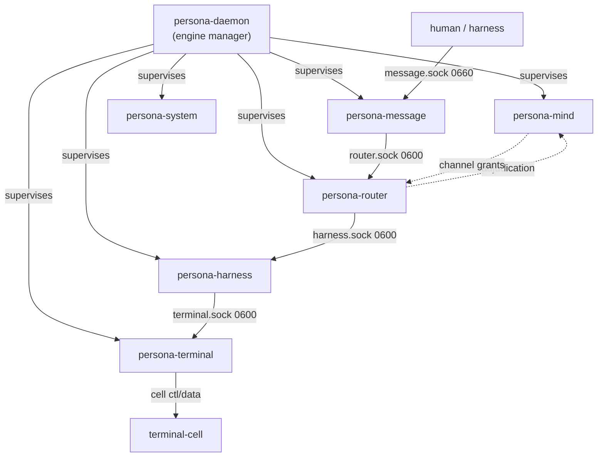

# 148 — Persona prototype-one: current state (consolidating /141-/146)

*Designer report, 2026-05-13. Consolidates the May-13 thread
(/141 Criome BLS substrate; /142 supervision-in-signal-persona;
/143 prototype-readiness gap audit; /144 final cleanup after
DA/36; /145 component-vs-binary naming correction; /146
introspection component) into one current-state report. The
six source reports are deleted in the same commit; the
architectural substance has landed in `persona/ARCHITECTURE.md`
(§0.5-§0.7, §1.5-§1.6, §5, §7, §8) and `criome/ARCHITECTURE.md`;
this report captures what's not in ARCH yet — the
prototype-one implementation roadmap, the acceptance witnesses,
and the few design details that belong in a report instead of
ARCH.*

---

## 0 · TL;DR

Prototype-one is the **six-component supervised first stack
that delivers a fixture message end-to-end**. Six daemons
(`persona-mind`, `persona-router`, `persona-message`,
`persona-system`, `persona-harness`, `persona-terminal`), each
supervised by `persona-daemon`, each speaking
`signal-persona`'s supervision relation plus its own domain
contract. Two witnesses gate acceptance: **supervision +
sockets** and **fixture delivery**.

Active tracks live in `primary-devn` (17 sub-tracks). Active
peer beads: `primary-2y5` daemon scaffold, `primary-hj4` mind
choreography, `primary-8n8` terminal supervisor + gate,
`primary-es9` harness, `primary-5rq` criome BLS, `primary-a18`
sandbox credentials.



---

## 1 · What landed in ARCH (rationale-bearing substance)

The six-report thread's load-bearing substance now lives in
two ARCH files:

| Substance | Home |
|---|---|
| Six-component first stack; engine-manager supervision; per-engine paths | `persona/ARCHITECTURE.md` §1.5 |
| Filesystem-ACL trust model + socket-mode table | `persona/ARCHITECTURE.md` §1.6.1 |
| `ConnectionClass` / `MessageOrigin` types (`signal-persona-auth`) | `persona/ARCHITECTURE.md` §1.6.2 |
| Channel choreography (router holds, mind decides) + structural-channels pre-install | `persona/ARCHITECTURE.md` §1.6.3 |
| Cross-engine routes as channels; multi-engine upgrade substrate | `persona/ARCHITECTURE.md` §1.6.4 + §1.6.5 |
| Per-component boundary behaviors (`HarnessKind` closed; `MessageBody` grows by `MessageKind` variants; mind owns adjudication) | `persona/ARCHITECTURE.md` §5 |
| Terminal lock-and-cache injection mechanism | `persona/ARCHITECTURE.md` §5.1 |
| Transcript fanout (typed observations, not raw bytes) | `persona/ARCHITECTURE.md` §5.2 |
| terminal-cell control-plane (Signal) vs data-plane (raw bytes) split | `persona/ARCHITECTURE.md` §5.3 |
| Persona-introspect (planned high-privilege component) | `persona/ARCHITECTURE.md` §0.6 |
| persona-system: paused (FocusTracker real, plan deferred) | `persona/ARCHITECTURE.md` §0.7 |
| Cluster-trust runtime placement (sibling component, not criome, not persona) | `persona/ARCHITECTURE.md` §7 |
| Criome Spartan BLS auth substrate (one Kameo daemon, identity registry, attestations, BLS12-381 from day one) | `criome/ARCHITECTURE.md` §0-§N |
| `Sema` values are Signal-compatible archived records | `~/primary/skills/rust/storage-and-wire.md` |
| Contract crates may own typed introspection record shapes | `~/primary/skills/contract-repo.md` |

What's NOT in ARCH and lives here instead:

- The supervision-relation typed-record shape (§2 below).
- The `SpawnEnvelope` field layout (§3).
- `ComponentProcessState` lifecycle (§4).
- The two reducer projections (engine-lifecycle, engine-status) (§5).
- Typed `Unimplemented` reply conventions (§6).
- The naming discipline: `-daemon` suffix is binary-only (§7).
- Two-witness acceptance criteria (§8).
- The bead trail (§9).

These are implementation-roadmap details. They retire with
prototype-one (when the witnesses fire green and the substance
moves into code).

---

## 2 · The supervision relation

`signal-persona` carries the **supervision relation** as its
own `signal_channel!` root family, separate from
`EngineRequest`/`EngineReply` (the engine-manager catalog
operations). The supervision relation is what every supervised
daemon speaks to its parent `persona-daemon`; every domain
contract (`signal-persona-mind`, etc.) is a peer relation that
the component additionally speaks on its own socket.

```
signal_channel! {
    Supervision {
        SupervisionRequest {
            ComponentHello { component_kind, started_at, env_protocol_version },
            ComponentReadinessQuery,
            ComponentHealthQuery,
            GracefulStopRequest { deadline },
        }
        SupervisionReply {
            ComponentHelloAck { observed_at, manager_protocol_version },
            ComponentReadinessReport { state: ComponentProcessState, observations },
            ComponentHealthReport { health: ComponentHealth },
            GracefulStopAck { will_complete_by },
            SupervisionUnimplemented(NotInPrototypeScope) // skeleton-honesty: see §6
        }
    }
}
```

Timestamp authority: `observed_at` is **manager-minted** at
the moment the reply arrives. `started_at` and `started_at`
field on `ComponentHello` are diagnostic, never authoritative.

---

## 3 · `SpawnEnvelope` — manager mints, child reads

`SpawnEnvelope` is a closed typed record in `signal-persona`
that the manager writes to each child component at spawn
time. Each child reads it on startup and binds the named
socket at the named mode.

```
SpawnEnvelope {
    engine_id:                    EngineId,
    component_kind:               ComponentKind,
    component_name:               ComponentName,   // e.g. "persona-mind"
    state_dir:                    PathBuf,          // empty for stateless components
    socket_path:                  PathBuf,
    socket_mode:                  u32,              // 0o600 or 0o660
    peer_sockets:                 BTreeMap<ComponentKind, PathBuf>,
    manager_socket:               PathBuf,
    supervision_protocol_version: u32,
}
```

Manager-internal composite `ResolvedComponentLaunch` carries
`SpawnEnvelope` plus the manager-private parts (executable
path, argv, env, restart state) — never serialized to a
child.

Path: `PERSONA_SPAWN_ENVELOPE` env var points at a
per-component file written by `DirectProcessLauncher` before
exec.

---

## 4 · `ComponentProcessState` — the lifecycle

```
ComponentProcessState (closed enum):
    Unspawned
  | Launched     { pid, started_at }
  | SocketBound  { pid, socket_path, bound_at }
  | Ready        { pid, hello_observed_at }
  | Stopping     { pid, requested_at }
  | Exited       { exit_code, exited_at }
```

The transitions are observed by the manager and emitted as
typed `EngineEvent` records into `manager.redb`. Each
transition is a witness seed.

---

## 5 · Two reducers in `manager.redb`

The manager maintains two snapshot tables alongside the
event log:

| Snapshot table | Reducer over event log | CLI reads? |
|---|---|---|
| `engine-lifecycle-snapshot` | `ComponentProcessState` per component per engine | No (internal) |
| `engine-status-snapshot` | `EngineStatus` (Starting / Running / Degraded / Stopped / Failed) per engine | **Yes** — `persona status` reads this only |

The CLI never reads the raw event log or `engine-lifecycle-snapshot`.

---

## 6 · Skeleton-honesty: typed `Unimplemented` variants

Valid unfinished operations return typed `Unimplemented`
replies instead of hanging, crashing, or printing untyped
errors. Each domain contract carries its own variant:

| Contract | Variant |
|---|---|
| `signal-persona` | `SupervisionReply::SupervisionUnimplemented` |
| `signal-persona-mind` | `MindReply::MindRequestUnimplemented` (incl. `ChoreographyUnimplemented` reason) |
| `signal-persona-message` | `MessageReply::MessageRequestUnimplemented` |
| `signal-persona-terminal` | `TerminalEvent::TerminalRequestUnimplemented` |

**Constraint**: not for the four core supervision ops
(`ComponentHello`, `ComponentReadinessQuery`,
`ComponentHealthQuery`, `GracefulStopRequest`) — those must
succeed in the prototype. Skeleton honesty applies to
**domain** ops that haven't been implemented yet, not to
supervision basics.

---

## 7 · Naming discipline: `-daemon` is binary-only

Component names stay symmetric — `persona-mind`,
`persona-router`, `persona-message`, `persona-system`,
`persona-harness`, `persona-terminal`. No component is called
`persona-X-daemon`.

The `-daemon` suffix appears **only at the binary-file level**:
`persona-message-daemon` is the binary file that runs the
`persona-message` component's daemon. Same for any other
component that ships a separate daemon binary (today only
`persona-message`).

```
component name:                persona-message
daemon binary file (when shipped): persona-message-daemon
```

Per `~/primary/lore/AGENTS.md`. ARCH docs and diagrams use
the component name. Operator code that references the binary
file uses the binary name.

---

## 8 · Two-witness acceptance for prototype-one

The prototype is accepted when **both** witnesses fire green
through Nix-chained writer/reader derivations:

### Witness 1 — Supervision and sockets

`persona-daemon-spawns-first-stack-skeletons`:

1. `persona-daemon` starts with a launch plan that names six
   components.
2. `DirectProcessLauncher` spawns six processes, writing
   per-component `SpawnEnvelope` files.
3. Each child binds the named socket at the named mode.
4. Each child sends `ComponentHello` over the supervision
   relation; manager records `ComponentReady` events.
5. The reader derivation opens `manager.redb` and asserts:
   - six `ComponentSpawned` events
   - six `ComponentReady` events
   - both reducer snapshots show `Running` / `Ready` states
   - domain-`Unimplemented` probes return typed
     `Unimplemented(NotInPrototypeScope)` for unbuilt ops

### Witness 2 — Fixture message delivery

`persona-daemon-delivers-fixture-message`:

1. CLI submits a message via `message.sock` (0660).
2. `persona-message-daemon` stamps `MessageOrigin::External`
   via `SO_PEERCRED` and forwards to `router.sock` (0600).
3. Router checks the structural channel (`External(Owner) →
   Internal(Router)`), accepts.
4. Router delivers through the
   `Internal(Router) → Internal(Harness)` channel to
   `persona-harness`.
5. Harness writes to `persona-terminal` via the
   `Internal(Harness) → Internal(Terminal)` channel.
6. Terminal acquires the input gate on the fixture cell,
   injects the bytes, releases the gate.
7. The reader derivation reads the fixture cell's PTY
   transcript and asserts the message bytes ("hello")
   landed in expected order.

Both witnesses run real processes and real sockets. Neither
mocks the actor mailbox boundaries.

---

## 9 · Bead trail (current implementation tracks)

| Bead | Scope | Status |
|---|---|---|
| `primary-devn` | Umbrella: 17 sub-tracks combining /142 + /143 + /144 corrections | open, in flight |
| `primary-2y5` | persona-daemon EngineId socket setup + manager.redb + spawn envelope | open |
| `primary-2y5.7` | Full-topology supervision witness (Witness 1 above) | open |
| `primary-hj4` | persona-mind channel choreography, subscriptions, third-party suggestions | open |
| `primary-8n8` | persona-terminal supervisor + gate-and-cache delivery | open |
| `primary-es9` | persona-harness daemon, closed HarnessKind, transcript pointers | open |
| `primary-5rq` | criome Spartan BLS auth substrate | open |
| `primary-a18` | persona-engine-sandbox credential root + provider auth smoke | open |
| `primary-9os` | persona-router replace ActorId channel projection with typed endpoint/kind keys | open |
| `primary-y4o` | Production engine: persona system user + Linux capabilities | open |
| `primary-nurz` | persona-mind remove dead Config actor | open |
| `primary-aww` | signal vs signal-core kernel extraction | open |

Closed companions: `primary-2y5.4` (engine manager catalog
design — absorbed into ARCH); `primary-2y5.6` (first-stack
skeletons — superseded by `primary-devn`).

---

## 10 · What's deferred past prototype-one

- `persona-introspect` daemon implementation. Spec is in
  `persona/ARCHITECTURE.md` §0.6 + `~/primary/skills/contract-repo.md`
  introspection carve-out. First slice is terminal
  introspection records in `signal-persona-terminal`.
- Cross-engine RPCs. Path-scoping is baked in (per-engine
  resources keyed by engine id); ops deferred until a second
  engine demonstrates aliveness.
- persona-system unpause. Plan substance frozen at
  `FocusTracker` (real, tested); contract substance frozen
  at current `signal-persona-system` shape; no privileged
  actions defined until a real consumer surfaces.
- Persona-mind work graph BEADS replacement. BEADS is
  transitional per `~/primary/AGENTS.md`. The native typed
  work graph is in `signal-persona-mind` design space; not
  on prototype-one's critical path.
- Engine v2 upgrade. The substrate (per-engine paths,
  typed migration over channels) is named in
  `persona/ARCHITECTURE.md` §1.6.5; the implementation
  doesn't land until v1 is real.

---

## See also

- `/git/github.com/LiGoldragon/persona/ARCHITECTURE.md` — design rationale (§0.5-§0.7, §1.5-§1.6, §5, §7, §8).
- `/git/github.com/LiGoldragon/signal-persona/ARCHITECTURE.md` — supervision relation, SpawnEnvelope record, ComponentProcessState.
- `/git/github.com/LiGoldragon/signal-persona-message/ARCHITECTURE.md` — two-relation framing (CLI → daemon, daemon → router).
- `/git/github.com/LiGoldragon/persona-message/ARCHITECTURE.md` — `persona-message-daemon` topology (five-actor).
- `/git/github.com/LiGoldragon/criome/ARCHITECTURE.md` — Spartan BLS auth substrate.
- `~/primary/protocols/active-repositories.md` — active repo map (planned `persona-introspect` + `signal-persona-introspect`).
- `~/primary/reports/designer/129-sandboxed-persona-engine-test.md` — sandbox topology for full-engine testing.
- `~/primary/reports/designer/139-wifi-pki-migration-designer-response.md` — adjacent system-specialist cross-role guidance (cluster-trust runtime placement).
- `~/primary/reports/designer/140-jj-discipline-after-orphan-incident.md` — historical incident record cited from `~/primary/skills/jj.md`.
- BEADS: `primary-devn`, `primary-2y5`, `primary-2y5.7`, `primary-hj4`, `primary-8n8`, `primary-es9`, `primary-5rq`, `primary-a18`.
