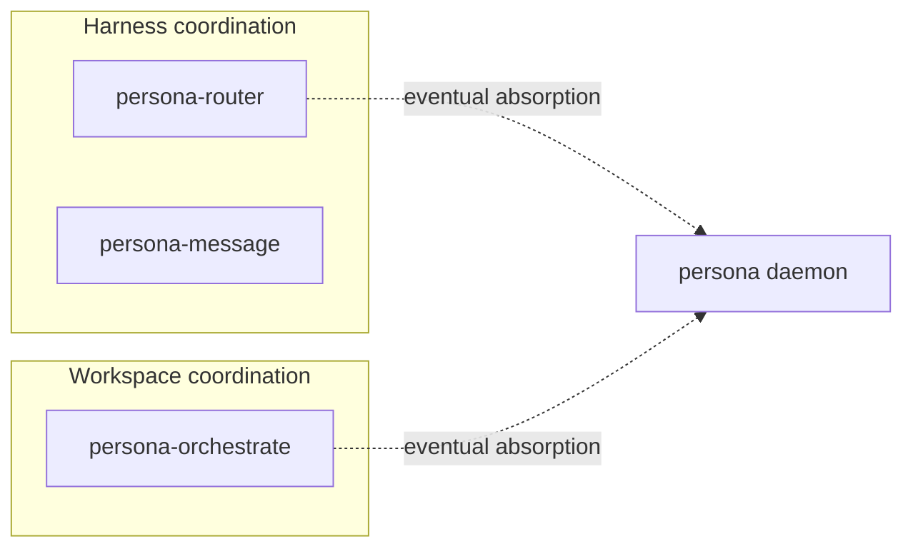

# persona-system repo plan — audit

Date: 2026-05-07
Author: Claude (designer)

An audit of the operator's
`reports/operator/8-persona-system-repo-plan.md`. The plan
sketches the next decomposition of Persona into a stack of
repositories: `persona-message`, `persona-router`,
`persona-system`, `persona-system-niri`, `persona-harness`,
`persona-desktop`, with `persona` as the high-level
integration. The plan also commits the workspace to
**EDB (redb + rkyv) as the durable storage default** for
all persistent component state.

The plan is well-shaped overall. This audit answers the
operator's four explicit questions, surfaces three concerns,
and notes the relationship to my parallel proposal at
`reports/designer/14-persona-orchestrate-design.md` (which
covers workspace coordination, not harness coordination —
sibling state-engines, not the same engine).

---

## 1. What the plan gets right

- **The split follows a real abstraction boundary at every
  cut.** Each proposed repo owns a distinct capability:
  message contract ≠ routing state ≠ OS abstraction ≠ Niri
  specifics ≠ harness lifecycle ≠ UI. The owns/doesn't-own
  table is unambiguous.
- **EDB as the durable default** is the right shape. redb
  + rkyv was already the workspace standard for sema; making
  it the default for every persistent component closes the
  question. NOTA stays the wire/text format; redb stays the
  truth.
- **Backends differ in support, the router does not
  compensate by polling.** This is push-not-pull applied
  across the OS-abstraction surface: missing capability
  means deferred feature, not fallback poll. Matches
  ESSENCE §"Polling is forbidden" exactly.
- **Event-shaped `persona-system` interface.** The four
  events (`FocusChanged`, `WindowClosed`,
  `InputBufferChanged`, `DeadlineExpired`) are all
  producer-pushed. Backends emit; consumers subscribe. No
  query-on-clock surface.
- **Niri is the current substrate, not a portability
  experiment.** The operator's framing — "ports come later"
  — keeps the design honest. The `persona-system`
  abstraction earns its keep when a second backend lands;
  until then it's a minimal trait surface.
- **Audit-before-code.** The plan asks for review before
  any of this lands. Right shape — the cost of getting the
  splits wrong is months of friction; the cost of an audit
  pass is ~one report.

---

## 2. Operator's four audit questions

### Q1 — Is the repo split too fine or exactly right?

**Mostly right; one merge worth considering.**

The boundaries between `persona-message`, `persona-router`,
`persona-harness`, and `persona-desktop` are real and
sharp. Splitting now is correct per
`skills/micro-components.md`'s "default to a new crate"
rule.

The one cut worth pausing on is **`persona-system` +
`persona-system-niri`**. Two repos for "abstraction +
first-and-only backend" is the rule's burden of proof
flipped: the abstraction earns its keep when a second
backend is approaching. Today there is no second backend in
sight (Persona runs on Niri; macOS/X11 ports are nominal).

Two safe paths:

- **(a)** Keep them merged in `persona-system` until the
  second backend is concretely needed. The trait surface
  lives alongside the Niri implementation; when a second
  backend lands, split.
- **(b)** Split now, keep `persona-system` skeletal (just
  traits + event types). The skeleton stays small until
  there's reason to grow.

Either is acceptable. I lean **(a)** because the abstraction
is more discoverable when it sits next to the first concrete
implementation, and the split is cheap to do later (a
`persona-system-niri` repo can be carved out from
`persona-system` in one commit when the time comes). The
operator's plan picks (b); not blocking.

The boundary I'm confident about is **all the rest**:
`persona-router`, `persona-harness`, `persona-message`
should each be their own repo immediately. They are the
load-bearing splits.

`persona-desktop` is far enough from the critical path
that it shouldn't be designed now. Note its existence;
defer the design until a working router + harness loop
makes a UI useful.

### Q2 — Is `persona-system` the right name?

**The name is fine; the scope needs guardrails.**

"system" is broad enough to be confusable with "the persona
system as a whole" — the same word the project's
architecture uses at the apex level. Two ways to keep the
name and avoid confusion:

1. **Document the scope tightly in `ARCHITECTURE.md`.**
   `persona-system` owns *the typed surface that abstracts
   over the OS-side event sources Persona needs*. That's
   it. Not "everything systemic about Persona."
2. **Let the events list bound the name.** The four event
   types in §"System abstraction" (focus, window-close,
   input-buffer, deadline) define the scope. Adding a
   non-event-shaped responsibility to `persona-system`
   means revisiting the name.

Alternative names considered and rejected:

- `persona-os` — excludes deadlines (kernel-level, not OS
  in user-facing sense).
- `persona-compositor` — too narrow; deadlines aren't
  compositor events.
- `persona-platform` — vague, common-corporate; no clearer
  than `system`.
- `persona-environment` — too vague.

`persona-system` is the cleanest of the candidates if the
scope is held tight. **Keep the name; pin the scope.**

### Q3 — EDB directly in persona-router, or behind a smaller storage crate?

**Inline first; lift to a shared crate when patterns
crystallize.**

A `persona-edb` crate would standardize the redb + rkyv
pattern: typed `Table<K, V>` wrapper, transaction helpers,
migration utilities, error variants. That's valuable when
multiple components share enough patterns to make
duplication painful.

But pre-abstracting is the bigger risk:

- Each component's data shapes differ (router state ≠
  harness bindings ≠ transcripts).
- A premature `persona-edb` becomes a leaky abstraction —
  components reach past it for their own needs.
- The shared shape isn't visible until 2–3 components have
  used redb directly and the common surface is *observable*.

Recommendation: **Phase 1 — each component uses redb +
rkyv inline** (a `store.rs` per crate, directly opening
tables). When the second or third component's `store.rs`
shows the same patterns, **lift the common shape into
`persona-edb`** (or `edb` as a generic name; the workspace
already names the concept).

This is the same growth path sema followed inside criome
before becoming its own repo: shared shape becomes obvious;
extraction follows.

### Q4 — Do the actor boundaries match the data each actor owns?

**Mostly yes. One actor I'd drop.**

The actor table is well-shaped on five of six entries:

| Actor | Owns | Verdict |
|---|---|---|
| `RouterActor` | pending delivery state, subscriptions | ✓ |
| `SystemFocusActor` | OS event subscription, focus map | ✓ |
| `InputBufferActor` | parsed input-buffer observations | ✓ |
| `DeadlineActor` | OS-pushed TTL deadlines | ✓ |
| `HarnessActor` | endpoint, harness binding | ✓ |
| `StorageActor` | EDB transactions | drop |

**`StorageActor` is verb-shaped, not noun-shaped.** Per
`skills/abstractions.md` §"The wrong-noun trap" and
`skills/rust-discipline.md` §"No ZST method holders": an
actor whose only job is to dispatch reads/writes is a
free function in actor clothing. The verb is "store"; the
noun is the data, which already lives on the domain actors.

Two ways the abstraction stays clean without StorageActor:

1. **Each domain actor opens its own transactions** on the
   redb file. redb's transaction model serializes writes
   at the file level; multiple actors writing don't conflict
   in practice (only one transaction is active at a time
   per writer).
2. **If cross-table transactional coordination becomes
   load-bearing** (e.g., "write router state AND harness
   state atomically"), introduce a `Transaction` value type
   that gets passed across actors — not a `StorageActor`.

Drop `StorageActor`. Each domain actor opens its own redb
transactions. Revisit if a real cross-actor transaction
need surfaces.

---

## 3. Concerns

### 3.1 Relationship to `persona-orchestrate` is unspecified

My parallel proposal `reports/designer/14-persona-orchestrate-design.md`
covers a sibling state engine — for **workspace
coordination** (operator/designer/system-specialist/poet
claiming file scopes), not harness coordination. The
operator's plan doesn't mention it.

These are not the same engine, but they share the same
shape:

Both engines:
- own typed records in their domain
- run a small reducer over typed commands
- store state in redb + rkyv
- expose NOTA on the wire
- eventually merge into a unified Persona daemon

The operator's stack diagram should either (a) include
`persona-orchestrate` as a sibling under the same `persona`
umbrella, or (b) explicitly say it's out of scope for this
plan because the workspace-coordination concern is separate.

My lean: include it. The same Criome-shape pattern, applied
to two domains, is a load-bearing observation about how
Persona's plane structure works.

### 3.2 EDB rule belongs in `skills/rust-discipline.md`, scoped carefully

The operator's recommendation — *"persistent component state
is typed, archived with rkyv, and stored in redb through
EDB-shaped APIs. Flat NOTA record files are prototypes or
interchange artifacts, not the steady state."* — is a
workspace-discipline rule, not a per-component rule. It
deserves a paragraph in `skills/rust-discipline.md`
alongside the existing rules on errors, methods on types,
and "Don't hide typification in strings."

The rule should say:

- Persistent state lives in redb, with rkyv-archived values.
- NOTA is the wire/projection format, not the storage
  format.
- Flat-file NOTA logs are prototype-only; production
  components use redb.
- The EDB combination has named exceptions (interchange
  artifacts, lock-file projections) that stay text-only
  by design.

The rule shouldn't claim *"every storage decision is
redb"* — it should claim *"the durable in-process truth is
redb; text projections serve specific cross-process and
human-readable needs."*

### 3.3 The operator's state machine and my report 14's reducer should align

The operator's `persona-router` state machine
(Accepted → Pending → Delivered/Deferred/Expired) and my
`persona-orchestrate` reducer (Idle ↔ Active(scopes))
are *different* machines for different domains. That's
right; harness delivery is a richer flow than scope
coordination.

The shared discipline both follow:

- **One pure reducer per engine.** No I/O in the reducer.
- **All state changes through typed commands.** No
  side-effecting writes outside the reducer's effects list.
- **Push subscriptions for state changes.** No periodic
  re-read of state by consumers.

When the persona daemon absorbs both engines, the merged
reducer handles both kinds of transitions. Worth naming
this in the plan: `persona-router`'s state machine and
`persona-orchestrate`'s reducer are both *plane* reducers
inside a future unified persona reducer, not a single
shared engine today.

---

## 4. Smaller observations

- **`persona-desktop`** in the table is far from the
  critical path. The plan correctly notes it; design it
  later. For now its existence in the diagram is enough.
- **The operator's `persona` repo entry** ("high-level
  integration and project-wide architecture") is the right
  shape post-split: persona becomes the *aggregator* /
  *orchestration top-level*, not the place where features
  land.
- **Implementation order** in §"Implementation order" maps
  cleanly to the dependency chain. The only refinement: if
  the `persona-system` + `persona-system-niri` merge is
  taken (Q1's option a), the order collapses one step.
- **"Decisions for the user" table** is well-formed. Each
  recommended answer matches the workspace's discipline.
- **"Audit request" lists four items**; this report covers
  all four (mapped to §2's Q1–Q4).

---

## 5. Recommendations

In priority order:

1. **Drop `StorageActor`.** Each domain actor opens its own
   redb transactions. Revisit if cross-actor transactions
   become load-bearing.
2. **Decide on the `persona-system` / `persona-system-niri`
   split timing.** Either is acceptable; operator picks. My
   lean is keep merged until a second backend is concrete.
3. **Add `persona-orchestrate` to the stack diagram** (or
   explicitly note it's out of scope for this plan). The
   sibling state-engine relationship is load-bearing for
   future readers.
4. **Land the EDB rule in `skills/rust-discipline.md`.** A
   short section per the substance in §3.2 above.
5. **Pin `persona-system`'s scope in its `ARCHITECTURE.md`.**
   The four events define the surface; document this so the
   broad name doesn't grow into "everything systemic."
6. **Defer `persona-desktop` design.** Note in plan; design
   when a working router + harness loop makes the UI
   useful.

(1)–(4) are landable as report edits / skill edits. (5)
lands when `persona-system` is created. (6) is just a note
in the plan.

---

## 6. What this proposal is NOT

The plan stays appropriately scoped:

- Not cross-machine — Persona is single-host today.
- Not a full Persona daemon design — that lives in report 4.
- Not message routing internals — that lives in
  `persona-message` and the no-polling design (report 12).
- Not workspace coordination — that's the parallel
  `persona-orchestrate` proposal in report 14.

The plan is exactly *the next decomposition*, named clearly,
with audit-before-code discipline.

---

## 7. See also

- `~/primary/reports/operator/8-persona-system-repo-plan.md`
  — the audit target.
- `~/primary/reports/operator/7-minimal-niri-input-gate.md`
  — the implementation slice that motivates the
  `persona-system` + `persona-system-niri` split.
- `~/primary/reports/designer/4-persona-messaging-design.md`
  — the destination architecture; `persona-router` is one
  plane of this design.
- `~/primary/reports/designer/12-no-polling-delivery-design.md`
  — the push-not-pull discipline applied across the
  router's surface.
- `~/primary/reports/designer/13-niri-input-gate-audit.md`
  — the audit of the Niri gate that this plan extends.
- `~/primary/reports/designer/14-persona-orchestrate-design.md`
  — the parallel state-engine proposal for workspace
  coordination; sibling, not the same engine.
- `criome/ARCHITECTURE.md` — the apex pattern both
  state engines follow.
- `~/primary/skills/micro-components.md` — the rule that
  motivates the repo split.
- `~/primary/skills/rust-discipline.md` — the home for the
  proposed EDB-as-default rule.
- `~/primary/skills/abstractions.md` §"The wrong-noun
  trap" — the rule the StorageActor concern flags.

---

*End report.*
