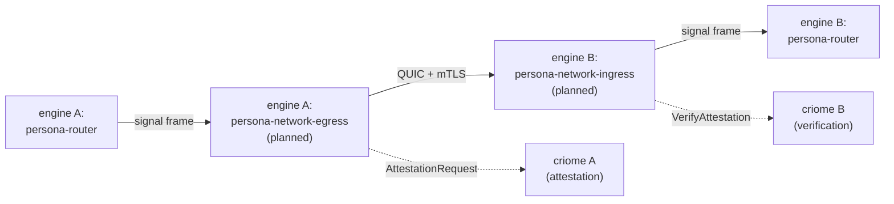

# 150 — Signal-network design draft

*Designer draft, 2026-05-13. Replaces `primary-uea` ("Design
signal-network for cross-machine signaling"). This is a
**first sketch**, not a final spec — the goal is to put
shape on the design surface and surface the load-bearing
decisions for the next round.*

---

## 0 · TL;DR

Today's Signal is local-only IPC: length-prefixed rkyv frames
over Unix sockets, trust by filesystem ACL, peer-cred origin
stamping. Cross-machine signaling needs the same wire
semantics over a different transport with different trust
machinery. The natural shape:

| Concern | Local Signal (today) | Network Signal (this draft) |
|---|---|---|
| Wire frame | length-prefixed rkyv | **same** length-prefixed rkyv |
| Transport | Unix socket (`SOCK_STREAM`) | **QUIC** (mTLS, multiplexed streams) |
| Trust | Filesystem ACL + `SO_PEERCRED` | **mTLS handshake + BLS-signed attestation** via criome |
| Origin minting | `SO_PEERCRED` → `ConnectionClass` | **cert subject → `ConnectionClass::OtherPersona { engine_id, host }`** |
| Back-pressure | OS socket buffer | **QUIC stream credits + per-channel flow control** |
| Schema/version drift | crashes loudly | **negotiated at handshake**; mismatched versions refuse connection |
| AuthProof variants (in `signal-persona-auth`) | `MessageOrigin::External(...)` | **`MessageOrigin::External(ConnectionClass::OtherPersona{...})`** — already typed, today |

The cross-engine `External(OtherPersona { engine_id, host })`
channel-endpoint case from `persona/ARCHITECTURE.md` §1.6.4
is what this design serves: engine A's mind grants a channel
to engine B's traffic; engine A's router accepts the channel;
network-signal is the wire over which that traffic flows.



---

## 1 · Use case (the shape this design serves)

The only confirmed use case is **cross-engine Persona
signaling** — engine A's federation needs to talk to engine
B's federation across a network boundary. Per
`persona/ARCHITECTURE.md` §1.6.4-1.6.5:

- Cross-engine routes collapse into the same `Channel` model
  as local channels; the source endpoint is
  `External(OtherPersona { engine_id, host })`.
- Engine-level upgrade uses cross-engine signaling to migrate
  state from v1 to v2 — even when v1 and v2 are on the same
  host, the cross-engine path is the migration substrate.

Other potential use cases (out of scope for first cut):

- Cross-host work-graph queries (mind ↔ mind).
- Cluster-trust runtime distributing certs (currently
  proposed via `signal-clavifaber` + criome verification,
  not via signal-network).
- Headless agent → remote terminal session (would compose
  signal-network with `persona-terminal`'s gate mechanism).

This design assumes **engine-to-engine traffic only** for
now. Adding human-to-engine cross-host (a remote `mind` CLI)
would change the trust shape and is left for a follow-up.

---

## 2 · Transport choice — QUIC

**Decision: QUIC.** Not TCP+TLS, not plain UDP, not WebSocket.

Why QUIC over TCP+TLS:

- **Head-of-line blocking.** Cross-engine signaling carries
  many independent channels per connection (per
  ARCHITECTURE.md §1.6.3 structural channels alone are 8).
  TCP+TLS multiplexes them onto one byte stream; one slow
  stream blocks every channel behind it. QUIC's
  per-stream-independent ordering matches Signal's
  per-channel semantics.
- **0-RTT resumption.** Cross-engine reconnects after a
  network hiccup are likely; QUIC's 0-RTT path lets the
  reconnect skip an extra round-trip.
- **mTLS is native.** QUIC requires TLS 1.3, so mTLS is
  always available; we don't have to bolt on a TLS layer.
- **Established Rust ecosystem.** `quinn` is production-grade
  and used widely.

Why not WebSocket: it's framed but still single-stream;
back-pressure semantics are weaker; not designed for
peer-to-peer.

**Counter-argument acknowledged:** QUIC is harder to debug
than plain TCP. Workspace discipline mitigates this:
mandatory typed observation events at every Signal boundary
(per push-not-pull); tools/orchestrate can mint synthetic
traces.

**Library proposal:** `quinn` for the QUIC transport;
`rustls` for the TLS plumbing (already a `quinn` dep). The
existing rkyv-frame logic in `signal-core` runs unchanged
on top.

---

## 3 · Trust — mTLS + criome-issued BLS attestation

The local Signal trust model (filesystem ACL +
`SO_PEERCRED`) doesn't translate. The network replacement
has two layers:

### 3.1 · mTLS at the QUIC layer

Both ends present X.509 certificates. The cert subject
encodes the engine identity (`engine_id` + `host`). The CA
that issues both engines' certs is the cluster-trust runtime
(per `persona/ARCHITECTURE.md` §7 + ClaviFaber's
publication chain). A connection where either side's cert
doesn't chain to the cluster CA is dropped before any
Signal frame flows.

This pins the **machine identity**: "this connection comes
from a host that the cluster trusts."

### 3.2 · BLS-signed attestation at the Signal-handshake layer

After the mTLS handshake completes, the first Signal frames
exchanged are a **handshake pair**:

```
NetworkHandshakeRequest {
    local_engine_id:      EngineId,
    local_host:            HostId,
    signal_core_version:   u32,
    advertised_contracts:  Vec<ContractCrateVersion>,
    attestation:           BLS signature over (local_engine_id, peer_cert_fingerprint, timestamp),
}

NetworkHandshakeReply {
    peer_engine_id:        EngineId,
    peer_host:              HostId,
    accepted:               bool,
    rejection_reason:       Option<NetworkRejectionReason>,
    signal_core_version:    u32,
    accepted_contracts:     Vec<ContractCrateVersion>,
    attestation:            BLS signature over (peer_engine_id, sender_cert_fingerprint, timestamp),
}
```

The BLS signature binds the **engine identity** to the
**TLS-layer machine identity** to **fresh time**, signed by
criome. This prevents:
- A compromised host certificate from impersonating an
  engine without the corresponding criome key.
- Replay across time (the timestamp + a short freshness
  window).
- Cross-host spoofing (the cert fingerprint binds the
  attestation to *this* TLS session).

Criome verifies the peer's attestation against its identity
registry. If the engine_id is unknown or the signature
doesn't verify, the handshake fails with a typed reason.

### 3.3 · Origin minting on accepted connections

Once the handshake succeeds, every Signal frame received on
the connection is stamped with:

```
MessageOrigin::External(ConnectionClass::OtherPersona {
    engine_id: <peer's verified engine_id>,
    host:      <peer's verified host>,
})
```

The same `ConnectionClass` type from
`signal-persona-auth` (today carries the local cases) gains
a runtime path for the network case. **No new variant
needed** — the variant already exists in the closed enum.

---

## 4 · Back-pressure and flow control

Two layers:

### 4.1 · QUIC's native flow control

QUIC provides per-stream and per-connection flow control out
of the box. A slow consumer stops sending stream credits;
the producer blocks at the QUIC layer. This handles the
common case (one engine sending faster than the other
processes).

### 4.2 · Per-channel application-level credits

For long-lived push channels (subscription deltas from mind
to a peer engine; transcript fanout to a peer's
introspection daemon), an additional per-channel credit
system layered on top:

```
ChannelFlowCredit {
    channel_id:    ChannelId,
    credits_added: u32,
}
```

The consumer issues credits; the producer can send up to N
unacknowledged messages. This prevents one slow channel
from filling the connection-wide QUIC buffer and blocking
unrelated channels.

**Open question:** is QUIC's stream-level flow control
sufficient, or do we need application-level credits on top?
Probably depends on whether a single QUIC connection
multiplexes many Signal channels (likely yes, for handshake
amortization) — in which case per-channel credits are useful
to prevent cross-channel head-of-line blocking inside the
QUIC connection.

---

## 5 · Versioning and drift detection

Local Signal handles version drift with a `schema_version`
preamble; mismatched versions crash loudly. Network needs
something more graceful — partial migrations may want to
operate during version transitions.

Proposal:

```
ContractCrateVersion {
    crate_name:    ContractCrate,
    semver:         u32,           // monotonic; bumps on wire-format change
}

ContractCrate (closed enum):
    SignalCore | SignalPersona | SignalPersonaAuth
  | SignalPersonaMind | SignalPersonaMessage | SignalPersonaSystem
  | SignalPersonaHarness | SignalPersonaTerminal | SignalPersonaIntrospect
  | SignalCriome
```

Each end advertises its supported versions in the handshake.
The negotiated set is the intersection — any frame on the
established connection must use a version in that set.
Frames carrying a non-negotiated version's record type are
rejected with `MessageOrigin::ExternalUnsupportedContractVersion`.

When versions diverge enough that no intersection exists,
the handshake fails with `NetworkRejectionReason::NoCommonContract`.

---

## 6 · Where this code lives

Two new components, both planned:

- **`persona-network`** — runtime daemon component, planned
  sibling of the first-stack components. Owns QUIC
  listener/dialer, mTLS state, handshake state, Signal
  frame forwarding to/from `persona-router`. Probably one
  component per engine; routes its own engine's outbound
  cross-engine traffic and demuxes inbound traffic into
  per-channel deliveries to `persona-router`.
- **`signal-network`** — contract crate, planned
  workspace-level. Owns the handshake records, the
  `ContractCrateVersion` enum, the
  `NetworkHandshakeRequest`/`Reply` types, the
  `ChannelFlowCredit` records. Does **not** own the BLS
  attestation records — those live in `signal-criome`
  (already exists). `signal-network` references
  `signal-criome::AttestationProof` by reference.

```
signal-network (NEW)
  ├── depends on: signal-core, signal-persona-auth, signal-criome
  └── owns:        NetworkHandshakeRequest/Reply, ChannelFlowCredit,
                    ContractCrateVersion enum, network-side AuthProof variants

persona-network (NEW)
  ├── depends on: signal-network, signal-persona, signal-persona-auth,
  │                signal-criome, signal-persona-router (or similar)
  ├── runtime:     Kameo actors over quinn
  └── role:        engine boundary on the network side
```

Adding `persona-network` to the first-stack would change
prototype-one's six-component shape; this draft
**deliberately keeps it deferred** — prototype-one is
single-engine; signal-network is engine-level upgrade and
multi-engine work, both deferred past prototype-one.

---

## 7 · Open questions for the next round

| Q | The question | Recommendation |
|---|---|---|
| 1 | One QUIC connection per peer engine, or one per (peer engine, channel-class)? | One per peer engine; multiplex channels onto QUIC streams. Saves handshake amortization. |
| 2 | Does `signal-network` own AuthProof variants, or does `signal-persona-auth` grow? | Probably `signal-network` owns network-specific AuthProof (e.g., `BlsAttestationProof`); `signal-persona-auth`'s `ConnectionClass::OtherPersona` is already enough for origin minting. |
| 3 | Where does the cluster CA / cluster-trust runtime live concretely? | Per `persona/ARCHITECTURE.md` §7, it's a planned sibling component to ClaviFaber. Name TBD by system-specialist. Cross-references: `~/primary/reports/designer/139-wifi-pki-migration-designer-response.md` §2 (the trust-runtime restored). |
| 4 | Should signal-network support sub-handshake auth refresh (re-attest after N minutes)? | Yes, but deferred — first cut times out at attestation expiry and forces reconnect; refresh path lands when the first cut is real. |
| 5 | Cross-engine BEADS — does the native work graph (per `~/primary/reports/designer-assistant/17` §2.2) want signal-network as its substrate? | Probably yes, but persona-mind's work-graph work is upstream of this. Let mind land first, then evaluate. |
| 6 | What about non-Persona consumers (e.g., a future remote ops UI)? | Out of scope for first cut. The `ConnectionClass::Network(NetworkSource)` enum variant is reserved for that case — signal-network's `OtherPersona` is the one trust path for now. |
| 7 | Latency budget — is QUIC's overhead acceptable for cross-engine work-graph subscriptions? | Cross-engine traffic is not in the critical path for human keystroke latency (that's data-plane terminal-cell, never cross-engine). Subscriptions are tolerant; ok. |

---

## 8 · What this draft does NOT decide

- The exact BLS payload format (just "signature over identity + cert fingerprint + timestamp"); details belong in `signal-criome`'s spec.
- The wire encoding of `ChannelFlowCredit` (likely a separate QUIC stream, not a regular Signal frame, but TBD).
- The retry/backoff strategy after a failed handshake.
- The audit log shape for cross-engine traffic (probably criome attestations cover it; mind decides what additional records to keep).
- The DNS/discovery mechanism (how does engine A find engine B's address?). Probably leverages cluster-trust runtime + horizon-rs node records. Out of scope here.

---

## 9 · Next concrete moves

1. **Validate the use case scope.** Cross-engine Persona signaling is the only confirmed user. If the user has additional concrete use cases (remote ops UI, cross-cluster federation, etc.), they reshape the design.
2. **System-specialist sign-off on the cluster-trust runtime placement.** Today's design depends on a runtime that doesn't exist yet (per `persona/ARCHITECTURE.md` §7 + /139).
3. **Operator review of `quinn` + `rustls` fit.** Especially their build-graph impact across the workspace.
4. **Designer round 2** — refine handshake records, AuthProof variants, version negotiation. Probably a separate report once these are pinned.

---

## See also

- `/git/github.com/LiGoldragon/persona/ARCHITECTURE.md` §1.6.2 (`ConnectionClass`/`MessageOrigin`), §1.6.4 (cross-engine routes), §1.6.5 (multi-engine upgrade), §7 (cluster-trust placement).
- `/git/github.com/LiGoldragon/criome/ARCHITECTURE.md` — Spartan BLS auth substrate; the attestation source for signal-network's handshake.
- `/git/github.com/LiGoldragon/signal-criome` — existing contract crate; signal-network references its attestation records.
- `~/primary/reports/designer/139-wifi-pki-migration-designer-response.md` §2 — cluster-trust runtime placement.
- `~/primary/reports/designer/148-persona-prototype-one-current-state.md` §10 — confirms cross-engine work is deferred past prototype-one.
- `~/primary/skills/rust/storage-and-wire.md` — Signal/Nexus/Sema split.
- `~/primary/protocols/active-repositories.md` — active repo map; planned `persona-network` + `signal-network` go here when the design is firm.
