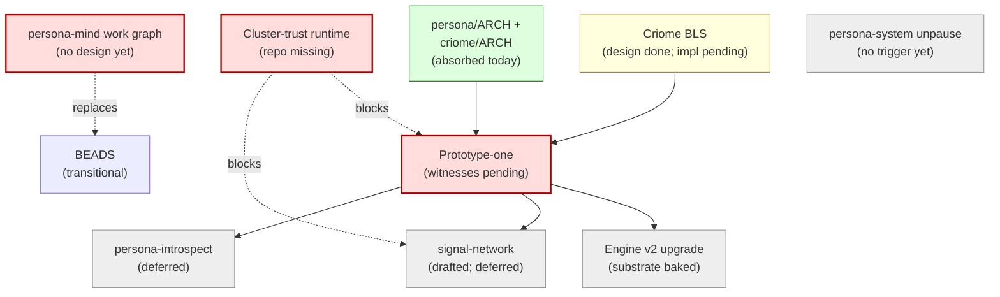

# 151 — Synthesis 2026-05-13: where we are, what to address, where the gaps are

*Designer synthesis after a major cleanup pass. Sees the
workspace from the designer-side context built across today's
work: cleaned reports, absorbed `persona/ARCHITECTURE.md` and
`criome/ARCHITECTURE.md` substance, refreshed BEADS surface,
and the surviving 6 designer reports. Names the load-bearing
claims, the critical path, the architectural gaps, and the
questions the user should answer next.*

---

## 0 · TL;DR

**Persona prototype-one is the critical path.** Everything else
is either supporting it, adjacent to it, or deliberately
deferred past it. The federation has six supervised
components; the design is done; the wire contracts are
mostly typed; the witnesses haven't fired yet.

| Layer | State |
|---|---|
| **Architecture rationale** | In `persona/ARCHITECTURE.md` and `criome/ARCHITECTURE.md`. Foundation reports retired. |
| **Wire contracts** | `signal-persona-{auth, message, mind, system, harness, terminal}` + `signal-core` + `signal-criome`. All exist; NotaEnum/NotaRecord policy applied. |
| **Component runtimes** | Six daemons in active development under `primary-devn`. Persona-harness + persona-system have skeleton daemons running. |
| **Prototype-one acceptance** | Two witnesses pending — no green yet. |
| **Criome BLS substrate** | Designed (criome/ARCH). Implementation `primary-5rq` pending. |
| **Persona-introspect** | Designed (`persona/ARCH §0.6` + skills). Implementation deferred. |
| **Signal-network** | Drafted (/150). Implementation deferred. |
| **Cluster-trust runtime** | Boundary decided. **Doesn't exist as a repo yet** — blocking Wi-Fi PKI and signal-network. |
| **Persona-mind work graph** | BEADS replacement. **No design report yet.** |
| **Surrounding stack (CriomOS, horizon-rs, clavifaber)** | Active system-specialist work; cluster-data leaks audit in flight. |



---

## 1 · Where we are (the load-bearing snapshot)

### 1.1 · Architecture truth lives in ARCH, not reports

The biggest design move today: **report substance migrated to
`<repo>/ARCHITECTURE.md` files**. This is the workspace's
discipline working as intended — reports capture decisions
while live; ARCH captures the decided shape.

`persona/ARCHITECTURE.md` now has:

- §0.5 — Persona is the durable agent (the criterion for what
  belongs in the ecosystem).
- §0.6 — Persona-introspect (planned).
- §0.7 — persona-system paused (FocusTracker is real, plan
  deferred).
- §1.5 — Engine manager model + per-engine resource layout.
- §1.6.1 — Filesystem-ACL trust + socket-mode table.
- §1.6.2 — `ConnectionClass`/`MessageOrigin` types
  (`signal-persona-auth`).
- §1.6.3 — Channel choreography (router holds, mind decides)
  + structural-channels table.
- §1.6.4 — Cross-engine routes collapse into channels.
- §1.6.5 — Multi-engine as upgrade substrate.
- §5 — Mind/router/harness/system/terminal boundaries.
- §5.1 — Lock-and-cache injection mechanism.
- §5.2 — Transcript fanout (typed observations).
- §5.3 — terminal-cell control plane (Signal) vs data plane
  (raw bytes).
- §7 — Cluster-trust placement (separate sibling component).
- §8 — Invariants.

`criome/ARCHITECTURE.md` carries the Spartan BLS auth
substrate (operative principle "Criome verifies; Persona
decides"; BLS12-381 from day one; six runtime actors; out-of-
band attestations; cluster-trust runtime functionality folded
in).

### 1.2 · Six surviving designer reports

```
129 — sandboxed-persona-engine-test     (sandbox spec; no migration target yet)
139 — wifi-pki-migration-designer-resp  (active cross-role guidance)
140 — jj-discipline-after-orphan-incident (incident record, cited from skills/jj.md)
148 — persona-prototype-one-current-state (consolidated /141-/146; acceptance roadmap)
149 — cleanup-ledger-2026-05-13          (today's cleanup record)
150 — signal-network-design-draft        (cross-machine signaling draft; deferred impl)
151 (this) — synthesis 2026-05-13
```

### 1.3 · BEADS state

42 open after today's pass. Critical-path beads:

| Bead | Lane | Critical for |
|---|---|---|
| `primary-devn` | operator | Prototype-one umbrella (17 sub-tracks) |
| `primary-2y5` | operator | Daemon scaffold (parent of supervision-witness chain) |
| `primary-2y5.7` | operator | Witness 1 — supervision + sockets |
| `primary-hj4` | operator | Mind choreography (needed for non-structural channels) |
| `primary-8n8` | operator | Terminal supervisor + gate (needed for Witness 2) |
| `primary-es9` | operator | Harness daemon |
| `primary-5rq` | operator | Criome BLS implementation |
| `primary-a18` | operator | Sandbox credential root (full-engine test runner) |

Adjacent active beads:

| Bead | Lane | Concern |
|---|---|---|
| `primary-aww` | operator | signal vs signal-core kernel extraction |
| `primary-ddx` | operator | sema → sema-db rename |
| `primary-9os` | operator | persona-router typed endpoint/kind keys |
| `primary-nurz` | operator | persona-mind dead Config actor |
| `primary-y4o` | system-specialist | Production engine: persona system user + Linux caps |
| `primary-iqbh` / `primary-54ll` / `primary-9lun` / `primary-3te3` | operator/system-spec | Ractor → Kameo residue (nexus, hexis, lojix-archive, forge) |
| `primary-obm` | system-specialist | Lore review + Nix-content migration to skills |
| `primary-a70`, `primary-7zz`, `primary-9wi`, `primary-5u9`, `primary-hpx`, `primary-sff`, etc. | system-specialist | CriomOS/horizon-rs slices (Publication, container-host, lojix split) |

### 1.4 · Skills + protocols stable

- `~/primary/skills/contract-repo.md` updated with NotaEnum policy + introspection record carve-out.
- `~/primary/skills/jj.md` updated post-orphan-incident (descriptionless-commit ban, end-of-session check, `jj restore` warning).
- `~/primary/skills/rust/storage-and-wire.md` clarified Sema/Signal/NOTA split.
- `~/primary/protocols/active-repositories.md` reflects current attention map + planned `persona-introspect`/`signal-persona-introspect`.

### 1.5 · Adjacent stack (system-specialist lane)

Peer system-assistant has landed substantial work this week:

- `horizon-rs` placement slices 1, 2a, 2b, 2c (typed `Cluster.tld`, `Node.placement`, `Metal`/`Contained` variant rename, containment validation rules).
- `skills/typed-records-over-flags.md` (new workspace skill).
- `skills/actor-systems.md` ZST-actor anti-pattern section added.
- Multiple system-assistant reports (06-09) audit CriomOS purity, cluster-data leaks, current state.

I haven't read every system-spec report; ground truth there belongs to system-specialist.

---

## 2 · The critical path — prototype-one acceptance

Two witnesses gate acceptance (per /148 §8):

### Witness 1 — `persona-daemon-spawns-first-stack-skeletons`

`persona-daemon` starts six children; each binds its socket
at the right mode; each speaks the supervision relation;
manager records six `ComponentSpawned` + six `ComponentReady`
events; reducer snapshots show `Running`/`Ready`.

**Currently blocked by:**
- `primary-2y5` — daemon scaffold not complete.
- Per-component supervision-relation implementation in each
  of the six daemons.
- `SpawnEnvelope` typed record + `DirectProcessLauncher` mint
  flow (`primary-devn` track 13).
- The two reducers (`primary-devn` track 14).

### Witness 2 — `persona-daemon-delivers-fixture-message`

End-to-end: CLI → `persona-message-daemon` → router → harness
→ terminal → fixture cell PTY contains "hello".

**Currently blocked by:**
- `persona-message-daemon` binary doesn't exist yet
  (`primary-devn` track 5).
- Router structural-channel installation
  (`primary-devn` track 16).
- `primary-8n8` — terminal supervisor + gate-and-cache.
- `primary-es9` — harness daemon (drives terminal injection).

### Witness gating risk

Both witnesses require **real processes and real sockets**,
not in-process fakes. The Nix-chained writer/reader pattern
(`primary-devn` track 17) is the right shape but hasn't been
implemented. If operator implementation goes the in-process
fake route by mistake, the witness fires green but the
architecture isn't proven.

---

## 3 · The four most important architectural gaps

In priority order.

### Gap 1 — Cluster-trust runtime doesn't exist as a repo yet

**Cited by:** /139 §2 (Wi-Fi migration depends on it); /150
§3 (signal-network handshake depends on its CA); criome/ARCH
("ClaviFaber feeds the registry").

**Decided:** /110 boundary placement — a NEW sibling
component to ClaviFaber and criome. Name TBD by
system-specialist. Not inside ClaviFaber (stays narrow).
Not inside criome's Spartan BLS daemon (different scope).

**Missing:** the repo, the skeleton, the responsibility
table (who issues certs vs who distributes them vs who
verifies them).

**Impact:** blocks Wi-Fi EAP-TLS deployment; blocks
signal-network implementation; blocks /150 §3 handshake;
blocks cross-engine work.

### Gap 2 — Persona-mind native work graph has no design report

**Cited by:** `~/primary/AGENTS.md` ("Persona's native typed
work graph"); `~/primary/skills/beads.md` ("destination is
Persona's typed messaging fabric"); `reports/designer-assistant/17`
§2.2 (preserves the native-work-graph trajectory).

**Decided:** BEADS is transitional. The native graph lives
inside `persona-mind`. Import old BEADS IDs as aliases once;
no dual-write bridge.

**Missing:** the typed record vocabulary (work item,
dependency, claim, observation, projection), the storage
shape (which mind.redb tables), the wire surface (which
`signal-persona-mind` operations), the migration path (when
does BEADS retire?).

**Impact:** every "BEADS goes away eventually" mention in
workspace docs is unbacked. Prototype-one acceptance can
ship without it, but the move past BEADS is a major design
piece still missing.

### Gap 3 — `persona-engine-sandbox` is a spec without a home

**Cited by:** /129 (sandbox spec); `primary-a18` (sandbox
credential root + provider auth smoke).

**Missing:** the repo. /129's substance specifies how the
sandbox tool should work but there's no
`persona-engine-sandbox` repo to put the implementation in.
Today the sandbox script lives in `persona` itself (the meta
repo) as Nix-owned scripts; /129 imagines a stronger split.

**Impact:** moderate. The current `persona-dev-stack` pattern
(Nix scripts in `persona`) works for integration tests. The
question is whether the sandbox grows enough to deserve its
own repo — and if so, when.

### Gap 4 — terminal-cell control vs data socket shape undecided

**Cited by:** `persona/ARCH §5.3` ("one socket per cell with
mode-shift vs two sockets (`control.sock` + `data.sock`);
resolution at refactor time").

**Decided:** the planes split (Signal frames for control;
raw bytes for data; non-mailboxed data plane invariant).

**Missing:** the concrete socket layout. Operator implementing
terminal-cell signal integration (`primary-devn` track relevant
to cell side) needs to pick one shape.

**Impact:** lower than the first three. Both shapes can work;
the choice affects implementation simplicity but not the
architectural invariant.

---

## 4 · Active cross-cutting work (not Persona-core)

These streams run in parallel and surface to designer when
shape decisions need synthesis.

### 4.1 · Wi-Fi PKI migration

**Active:** system-specialist /117 + designer /139.

**Concrete pending items from /139 §6 (in order):**
1. ClaviFaber typed `CertificateProfile` record (SAN/EKU/KeyUsage) — hard precondition.
2. Cluster-trust runtime named + skeletoned (Gap 1 above).
3. ClaviFaber X.509 builder set EKU + SAN.
4. NixOS `hostapd` wired with EAP-TLS via cluster-trust runtime.
5. Per-router `NodeProposal.wifi` typed (horizon-rs).
6. `WifiAuthentication::MigrationWindow` typed variant (deferred typed sum).
7. `eap_user_file` rendering (operator-side; missed by /117).
8. Outer-identity leak fix (operator-side; missed by /117).
9. NetworkManager `domain-suffix-match` (operator-side; missed by /117).

### 4.2 · CriomOS purity + cluster-data leaks

**Active:** system-specialist /117, /118, system-assistant /06-09.

**Principle (from system-assistant /09):** CriomOS reads
`horizon.*`, `constants.*`, `inputs.*` — never holds cluster
data (SSIDs, passwords, node lists, TLDs). Cluster-specific
facts come through Horizon projections.

**Status (per system-assistant /09):** several node-name
gates already removed; in-flight cleanup of remaining
cluster-data references in nix modules.

### 4.3 · horizon-rs typed placement

**Active:** primary-a70 + system-assistant slices.

**Status (per system-assistant /08):** P1 slices 1, 2a, 2b,
2c landed (typed `Cluster.tld`, `Node.placement`, containment
validation). Wire derives in slice 2b mean horizon-rs is
NOTA-encodable end-to-end.

### 4.4 · Ractor → Kameo residue

**Active:** primary-iqbh (nexus), primary-54ll (hexis),
primary-9lun (lojix-archive), primary-3te3 (forge).

**Status:** newly filed today with concrete file pointers
after the Ractor verification sweep. Operator/system-specialist
priority TBD.

### 4.5 · sema → sema-db rename

**Active:** `primary-ddx` (open 3 days).

**Status:** workspace-wide rename. Scope clear; impact
wide (every state-bearing crate). Hasn't been started.

### 4.6 · signal vs signal-core kernel extraction

**Active:** `primary-aww` (open since 2026-05-10).

**Status:** transitional duplicate kernel modules remain in
`signal`; treat `signal-core` as authority. Concrete steps
listed in bead. Hasn't been started.

---

## 5 · Deferred-but-named (with dependencies)

These are designed (or partly designed) and explicitly
deferred. Tracking them keeps them visible.

| Component | Design state | Implementation state | Depends on |
|---|---|---|---|
| `persona-introspect` daemon | Designed (`persona/ARCH §0.6` + /146 placement) | Repo registered (planned); no skeleton | Prototype-one acceptance; at least 2 introspection slices in `signal-persona-<X>` |
| `signal-persona-introspect` contract | Designed (envelope vocabulary) | Crate planned; no code | Prototype-one acceptance |
| `signal-network` contract | Drafted (/150); 7 open questions | Crate doesn't exist | Cluster-trust runtime (Gap 1) |
| `persona-network` daemon | Sketched (/150 §6) | Repo doesn't exist | `signal-network`; QUIC library validation |
| persona-system unpause | `FocusTracker` real (in code) | Plan substance frozen; waits for real consumer | Window-aware notifications use case or multi-engine UI use case |
| Engine v2 upgrade | Substrate baked (per-engine paths, typed migration over channels) | No code yet | v1 must exist first (= prototype-one acceptance) |
| Persona-mind native work graph | **No design report yet** (Gap 2) | n/a | Designer authorization to start |
| Transcript inspection agent | Mentioned (`persona/ARCH §5.2`) — "future move" | n/a | Persona-mind work graph; introspection layer |
| Cross-engine BEADS / native graph cross-engine | Mentioned (/150 §7 Q5) | n/a | persona-mind work graph; signal-network |

---

## 6 · The most important questions

In priority order. Each carries the substance inline so the
user doesn't have to chase files.

### Q1 — Pace for prototype-one acceptance

Operator's active sweep on `primary-devn` covers the 17
sub-tracks needed for both witnesses. The longest pole is
`primary-devn` track 17 (the Nix-chained writer/reader Nix
witness) which needs every other track green first. Two
options for sequencing:

(a) **Push hard until both witnesses fire green** — designer
sits on adjacent work until then, surfaces blockers as they
appear, doesn't open new design fronts.

(b) **Parallelize design while operator implements** — start
persona-mind work graph design now (Gap 2); review Wi-Fi PKI
operator side; review CriomOS cluster-data audit.

Recommendation: **(b)**. Prototype-one is the critical path
but operator owns the implementation; designer's marginal
contribution while operator implements is small. Better to
unblock the next thing.

### Q2 — Cluster-trust runtime: who and when

The runtime is blocking Wi-Fi (/139), signal-network (/150),
and any cross-engine work. /110 decided it's a NEW sibling
component (not inside ClaviFaber, not inside criome). System-
specialist owns the repo creation + name + initial scope.

Options:
(a) **System-specialist drives the runtime design + scaffold.** Designer reviews.
(b) **Designer drafts a design report (similar to /150 signal-network draft) to give system-specialist a starting shape.**
(c) **Wait for a concrete use case (Wi-Fi go-live or signal-network impl start) before standing up the runtime.**

Recommendation: **(b)**. The draft gives system-specialist
substance to push back on; (c) keeps blocking three streams.

### Q3 — Persona-mind native work graph: start designing?

BEADS is transitional. The native work graph is mentioned as
the destination in AGENTS.md, beads.md, DA/17. No designer
report yet. Without it, the "BEADS goes away" claim is
unbacked.

Options:
(a) **Start the design now** — designer report covering typed work-item vocabulary, mind.redb tables, signal-persona-mind operations, BEADS migration path.
(b) **Wait until persona-mind has the channel choreography work landed (`primary-hj4`)** — adding work-graph work before adjudication works risks more rework.
(c) **Punt indefinitely; BEADS is acceptable long-term.**

Recommendation: **(a)**, but in draft shape like /150. The
shape clarifies the BEADS-replacement story; the
implementation slot waits for `primary-hj4`.

### Q4 — /139 Wi-Fi PKI specific items (eap_user_file, outer-identity, domain-suffix-match)

These are concrete operator-side gaps /139 named but didn't
specify in design. They're blocked by ClaviFaber X.509
profile work landing first. Who picks them up?

Options:
(a) **System-specialist picks them up alongside the cluster-trust runtime work.**
(b) **Operator picks them up as a separate Wi-Fi-implementation pass.**
(c) **Designer drafts a follow-up report shaping them concretely.**

Recommendation: **(a)** — they belong with the cluster-trust
runtime work; system-specialist is the natural lane.

### Q5 — Ractor cleanup priority

Four new beads from today's verification sweep:
- `primary-iqbh` nexus (4 files) — operator
- `primary-54ll` hexis (3 files) — operator
- `primary-9lun` lojix-archive (8 files) — system-specialist
- `primary-3te3` forge orphaned dep — operator

None of these block prototype-one. The risk is each one's
absence of a recent ARCH/skills.md means a future agent
might re-introduce Ractor when adding features.

Options:
(a) **Do them now in a single operator sweep.**
(b) **Defer until each repo is touched for other work.**
(c) **Close the beads with a "discipline applies on touch" pointer at `skills/actor-systems.md`'s ZST-actor anti-pattern section.**

Recommendation: **(b)**. The migration is mechanical and not
load-bearing; piggyback on next-touch.

### Q6 — Designer report cap going forward

Subdir is at 7 (after /151). The 12 soft cap holds. The
question is what shape future designer work takes:

- Architecture decisions → directly into `<repo>/ARCHITECTURE.md` (the discipline that worked today).
- Implementation roadmaps for in-flight work → designer reports while in flight, retired when shipped (the /148 pattern).
- Incident records → designer reports, kept if cited from skills (the /140 pattern).
- Cross-role responses → designer reports during active back-and-forth, retired when absorbed (the /139 pattern).

Recommendation: **codify this pattern in `~/primary/skills/reporting.md`**? Or leave it as established practice?

---

## 7 · Recommendations (what to do next)

1. **Start the persona-mind work graph design report.** Draft shape (like /150). Unblocks the BEADS-replacement story.
2. **Hand the cluster-trust runtime to system-specialist with a designer draft.** Unblocks Wi-Fi PKI, signal-network, cross-engine.
3. **Let operator stay focused on `primary-devn`.** Two witnesses gate prototype-one; that's where the implementation marginal-value is highest.
4. **Let system-specialist continue CriomOS purity audit + horizon-rs slices.** Adjacent to Persona; doesn't block prototype-one.
5. **Hold on Ractor cleanups** — apply discipline on next-touch per `skills/actor-systems.md`.
6. **After prototype-one acceptance**: revisit /148, /150, this report. Many things deferred today open up — persona-introspect implementation, signal-network skeleton, persona-system unpause discussion.

---

## See also

- `/git/github.com/LiGoldragon/persona/ARCHITECTURE.md` — current architecture truth.
- `/git/github.com/LiGoldragon/criome/ARCHITECTURE.md` — Spartan BLS substrate.
- `~/primary/reports/designer/148-persona-prototype-one-current-state.md` — prototype-one acceptance roadmap.
- `~/primary/reports/designer/149-cleanup-ledger-2026-05-13.md` — today's cleanup record.
- `~/primary/reports/designer/150-signal-network-design-draft.md` — cross-machine signaling draft.
- `~/primary/reports/designer/139-wifi-pki-migration-designer-response.md` — Wi-Fi PKI shape decisions.
- `~/primary/reports/designer/129-sandboxed-persona-engine-test.md` — sandbox spec.
- `~/primary/reports/designer/140-jj-discipline-after-orphan-incident.md` — incident record.
- `~/primary/protocols/active-repositories.md` — workspace attention map.
- `~/primary/ESSENCE.md` — workspace intent.
