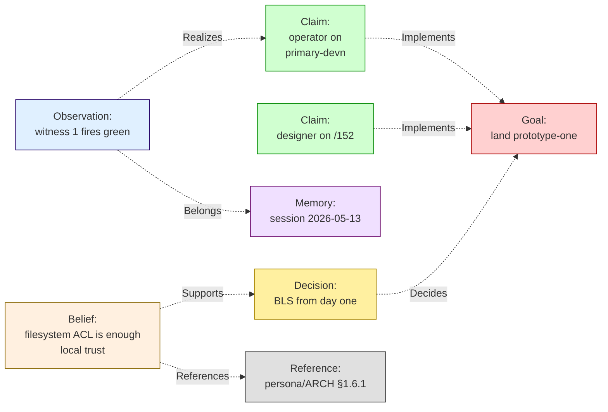

# 152 — The mind graph: persona-mind's typed memory substrate

*Designer report, 2026-05-13. A practical first-version
specification for the typed mind graph that lives inside
`persona-mind`. Built to encompass today's work-graph use
case (role claims, activity, decisions, dependencies) and
to extend cleanly as documentation, reports, beliefs,
memories, and observations migrate from the filesystem into
the mind. The destination per `~/primary/AGENTS.md`: BEADS
retires; reports and ARCH start to project from mind
records rather than the other way around. This report is
the minimal viable shape.*

---

## 0 · TL;DR

**The mind graph is a typed property graph with seven
closed record kinds (Thoughts) and eleven closed relation
kinds, content-hash-identified, immutable, append-only,
and projected over redb.**

```
Thoughts (closed kinds, the nodes):
  Observation | Memory | Belief | Goal | Claim | Decision | Reference

Relations (closed kinds, the edges):
  Implements | Realizes | Requires | Supports | Refutes
  Supersedes | Authored | References | Decides | Considered | Belongs
```

A Thought carries its kind, a typed body, and a content-hash
identity (`RecordId = hash(kind, body)`). Author and commit
time are NOT inside the Thought — author surfaces as an
`Authored` Relation, commit time as a storage-row field
(§5). A Relation is a typed temporal event: it carries
kind, source, target, author, occurred_at, and an optional
note; all of these participate in the Relation's hash. Two
agents asserting the same Thought content produce one Thought
row + two `Authored` Relations.

Updates are NEW thoughts pointing at older ones via
`Supersedes`. Nothing is ever mutated in place.

The query surface is push-subscribe (per
`~/primary/skills/push-not-pull.md`): subscribe by
filter; receive initial snapshot then deltas. **Initial-
snapshot subscription is live** — `SubscribeThoughts` /
`SubscribeRelations` register the filter, persist it, and
return `SubscriptionAccepted { initial_snapshot, … }`
(`persona-mind/src/graph.rs:58`). **Commit-time push delivery
is still missing** — `StoreKernel` does not yet emit
`SubscriptionEvent { delta }` to registered subscribers on
new commits. v1 acceptance fires when commit-time push lands;
operator track `primary-hj4.1.1` carries that work. The CLI
surface stays one NOTA record in, one NOTA reply out (per
`persona-mind/ARCHITECTURE.md` §0).



This is the **minimal complete shape**. v1 covers:

- Today's work graph (Goal + Claim + Observation + Decision).
- Today's activity log (Observations ordered by time).
- Today's role coordination (Claims with Identity authors).
- Today's BEADS substance (Goals + dependency Relations).
- Tomorrow's reports (Memory).
- Tomorrow's architecture docs (Belief with References to code).
- Tomorrow's decision records (Decision with Considered alternatives).
- Tomorrow's identity registry (References to Identity).

What's deferred past v1: full-text search; semantic embeddings;
cross-engine replication; named-graph isolation; mutable
property bags. v1 stays minimal so that everything that lands
in the graph lands typed.

---

## 1 · What the mind graph IS (and isn't)

**Is**: persona-mind's typed durable memory. The substrate
that holds every claim, every observation, every decision,
every belief, every reference an agent makes inside an
engine. The graph is content-addressed (IDs are hashes), so
two agents producing the same thought produce the same
record. Append-only — corrections write new thoughts that
`Supersede` older ones.

**Is not**: a generic graph database. The schema is closed
(seven thought kinds, eleven relation kinds) and small on
purpose. Generality goes into the **body types** of each
record kind, which can grow with new variants — not into the
shape of the graph itself.

**Is not**: a workflow engine, a planner, or an inference
engine. The mind graph stores typed records and their typed
relations. Reasoning, planning, and inference are downstream
consumers — they read from the graph, write back as new
Thoughts (Beliefs, Decisions, Observations).

**Is not**: a chat history or transcript. Transcripts stay
in `persona-terminal` (per `persona/ARCHITECTURE.md` §5).
The mind graph holds typed **summaries**, **decisions**, and
**observations** distilled from a transcript — never raw
streams of bytes.

**Eventual scope** (per user direction 2026-05-13): the mind
graph becomes the source of truth for documentation,
reports, beliefs, decisions, intentions. The filesystem
projections (`reports/`, `ARCHITECTURE.md`, `skills/`)
become rendered views — not authorities. v1 doesn't replace
the filesystem yet; v1 establishes the substrate that can.

---

## 2 · How the mind has been categorized — a brief survey

The seven record kinds aren't invented; they're a synthesis
of what philosophers and cognitive scientists have settled
on across traditions. Brief tour, one paragraph each, with
the load-bearing claim and how it informs the design.

### 2.1 · Aristotle — categories of being

Aristotle's *Categories* opens with ten predicates by which
things can be said: substance, quantity, quality, relation,
place, time, position, state, action, and passion. The
load-bearing move for the mind graph is **relation** as one
of the categories — not derivable from the others. The
relation kind is part of the world, not metadata bolted on.
This justifies typed relations with closed kinds rather than
a generic "edge" type.

### 2.2 · Buddhist Abhidharma — skandhas and mind-moments

The five **skandhas** (form, feeling, perception, mental
formations, consciousness) decompose subjective experience
into discrete aggregates. Abhidharma takes this further:
each **dharma** is a discrete mental event, atomic in time,
typed by its quality. The mind is a stream of typed atomic
events. This is the **atomicity + immutability** posture:
a Thought is a discrete event, not a mutable record.

### 2.3 · Caraka-Samhita — *manas* in Ayurveda

*Manas* (mind) in Caraka has four faculties: *buddhi*
(intellect / decision), *ahaṃkāra* (sense of self / identity
agency), *citta* (consciousness / awareness), *smṛti*
(memory / recall). The first three faculties produce
records (decisions, identity attributions, observations);
the fourth faculty is recall — which in a typed graph is
**query**. The mind has two halves: it writes, and it reads
its own writings.

### 2.4 · Endel Tulving — memory taxonomy

Tulving's 1972 split of long-term memory into **episodic**
(events located in time) and **semantic** (facts about the
world) — later extended with **procedural** (how-to skills) —
is the modern cognitive-science map. The mind graph adopts
it directly: `Observation` is the atomic episodic event;
`Memory` is a compound episodic narrative; `Belief` is
semantic; procedural knowledge surfaces as `Reference` to
external skill/code descriptions.

### 2.5 · John Sowa — conceptual graphs

Sowa's conceptual graphs (1984) pair concept nodes with
relation nodes in a bipartite structure. The relation IS a
typed entity, not just an arrow. The mind graph follows the
same instinct: `Relation` is first-class, content-hashed,
authored — not just a join.

### 2.6 · Niklas Luhmann — Zettelkasten

Luhmann's slip-box discipline: atomic notes, each addressable
by a stable ID, each linked to its neighbors via typed
references, no central index. The slip-box becomes a thinking
partner because the discipline of writing one idea per note
forces the structure to emerge. The mind graph adopts: one
Thought per record, content-hash ID, typed relations between.

### 2.7 · Gottlob Frege — sense and reference

Frege's distinction between *Sinn* (sense — how a thing is
presented) and *Bedeutung* (reference — the thing itself)
matters for the `Reference` kind: a Reference is a Thought
that points at something outside the graph (a code file, a
URL, an entity). Two References with different sense but the
same target are still two distinct Thoughts. Identity is by
content, not by referent.

### 2.8 · Nyāya — *pramāṇa* and the sources of knowledge

The Nyāya school enumerates four *pramāṇas* (means of valid
knowledge): perception (*pratyakṣa*), inference (*anumāna*),
comparison (*upamāna*), testimony (*śabda*). Each Belief in
the mind graph carries provenance — *how was this known?* —
which in v1 lives as Relations: `Supports` (perception /
inference), `References` (testimony / source citation),
`Considered` (comparison / alternatives weighed).

### Synthesis

Across traditions, the same load-bearing distinctions
repeat: **events** (observations) vs **claims about the
world** (beliefs) vs **intentions** (goals) vs **choices**
(decisions); typed **relations** between them; **provenance**
(who/when/why); **immutability of the trace** even when the
view changes. The mind graph adopts these without inventing
new categories. The seven Thought kinds and eleven Relation
kinds below are the workspace's minimal practical realization.

---

## 3 · The seven Thought kinds

Each kind has a closed body type. The bodies grow by adding
variants over time (per `~/primary/skills/contract-repo.md`
NotaEnum policy: typed wire + text on the same records).

### 3.1 · Observation — *something happened*

An atomic event in time. The smallest unit of episodic
record. Produced by every component that wants to durably
note that it observed something.

```rust
struct ObservationBody {
    summary:   ObservationSummary,   // closed enum: what happened
    detail:    Option<NotaRecord>,    // typed detail, may carry payload
    location:  Option<Reference>,     // pointer to where (file, socket, etc.)
}

enum ObservationSummary {
    ComponentSpawned { component_kind, engine_id },
    ComponentReady   { component_kind, engine_id },
    ComponentExited  { component_kind, engine_id, exit_code },
    MessageReceived  { channel_id, origin },
    MessageDelivered { channel_id, recipient },
    ChannelGranted   { channel_id, by_decision },
    ChannelRetracted { channel_id, by_decision },
    ClaimStarted     { claim_id, role },
    ClaimReleased    { claim_id, role },
    SessionEnded     { session_id },
    // … grows by variant addition
}
```

Today's `signal-persona-mind::Activity` is a subset of this
shape. Migration: existing Activity rows become Observations
of the appropriate summary variant.

### 3.2 · Memory — *a sequence of events bound together*

A compound record — a story, a session, a thread. A Memory
references an ordered set of Observations via `Belongs`
relations, plus a narrative summary.

```rust
struct MemoryBody {
    kind:         MemoryKind,           // Session | Thread | IncidentRecord | Report | Other
    title:        Title,
    summary:      NotaRecord,            // typed prose
    boundary:     Option<TimeRange>,     // start/end
    role:         Option<Reference>,     // which role authored, if relevant
}

enum MemoryKind {
    Session      { harness, engine_id },
    Thread       { topic },
    IncidentRecord { incident_name },
    Report       { report_role, report_number },
    Other        { kind: NotaIdent },
}
```

A session report (e.g. *"reports/operator/108"*) becomes a
Memory of kind `Report` whose `Belongs` relations link to
the Observations made during that session — plus
`References` to any Claims, Decisions, or Beliefs the report
named. The filesystem path stays as a `References` target;
when the report is fully ingested, the path can retire.

### 3.3 · Belief — *a claim about the world*

A semantic record. Independent of when it was learned;
re-asserted by reference. Carries provenance via
`Supports`/`Refutes`/`References` relations and an explicit
confidence + revision marker.

```rust
struct BeliefBody {
    claim:        NotaRecord,            // the typed assertion
    confidence:   Confidence,
    status:       BeliefStatus,
}

enum Confidence {
    Asserted,       // I claim this; haven't sourced
    Cited,          // sourced; see References relations
    Tested,         // a Witness/Observation Supports this
    Disputed,       // active Refutes relations exist
}

enum BeliefStatus {
    Current,
    Superseded,     // a newer Belief Supersedes this
    Retracted { reason: NotaRecord },
}
```

Architecture statements like *"the persona daemon supervises
six components"* become Beliefs of high Confidence with
`References` to `persona/ARCHITECTURE.md` §1.5. When ARCH
edits, the editor writes a new Belief that `Supersedes` the
old one. The filesystem ARCH can render from the
non-superseded Belief set.

### 3.4 · Goal — *something to achieve*

The intention. May be hierarchical (sub-goal `Requires`
parent goal). May be `Realized` (by Claim + Observation
chain), `Decided away from` (by Decision), or
`Abandoned` (Memory documenting the abandonment).

```rust
struct GoalBody {
    description:  NotaRecord,
    scope:        GoalScope,
}

enum GoalScope {
    Workspace      { workspace_name },
    Project        { project_name },
    Repo           { repo_name },
    Personal       { actor: Reference },
    Crosscutting   { description },
}
```

BEADS issues become Goals of the appropriate `GoalScope`.
`GoalBody` carries no `status` field. The named states a
goal can be in — *Open*, *Active*, *Achieved*, *Abandoned* —
are **query results derived from Relations**, not stored on
the Thought:

- *Open*: a Goal with no `Implements` Relation from any Claim.
- *Active*: a Goal with one or more `Implements` Relations from
  Claims whose `ClaimActivity` is `Active` (no later
  `Realizes`-Observation closing them).
- *Achieved*: a Goal whose Claims have `Realizes` Observations
  marking completion.
- *Abandoned*: a Goal with an Observation `Belongs`-related to
  it whose summary names abandonment.

Storing the state on the Thought would conflict with content-
hash identity (§5.1) and immutability (§5.2). The matching
current shape in `signal-persona-mind/src/graph.rs:397` already
omits the field; v1 keeps it that way.

### 3.5 · Claim — *committed work toward a Goal*

The actor-agreement. A Claim binds an Identity to a Goal:
*"I commit to working on this."* Claims are pickup-able by
agents; held by lock-files today; held in the mind graph
under v1.

```rust
struct ClaimBody {
    claimed_by:   Reference,         // Identity reference
    scope:        ClaimScope,         // path-set, task-set
    role:         RoleName,
    activity:     ClaimActivity,      // started, paused, releasing
}

enum ClaimScope {
    Paths        { paths: Vec<WirePath> },
    Tasks        { task_tokens: Vec<TaskToken> },
    Combined     { paths, task_tokens },
}

enum ClaimActivity {
    Active   { started_at: TimestampNanos },
    Paused   { paused_at, reason },
    Releasing { releasing_at, completion: Option<RecordId> },
}
```

Today's `RoleClaim` + `RoleRelease` records become Claims
(write) + Observation summaries (release events). A Claim
`Implements` a Goal; an Observation of `ClaimReleased`
`Realizes` the Claim. The lock-file rendering for current
`tools/orchestrate` consumers stays an **external workspace
shim** — not persona-mind behavior. Per
`persona-mind/ARCHITECTURE.md` §"Lock-file projections", the
mind does not write filesystem lock files. The shim
subscribes to Claims with `ClaimActivity::Active` and
renders the `<role>.lock` files on commit; persona-mind is
the source-of-truth substrate, not the renderer.

### 3.6 · Decision — *a chosen path*

A choice among alternatives, with criteria and rationale.
Records the *why* of a non-trivial commitment.

```rust
struct DecisionBody {
    question:     NotaRecord,        // what was being decided
    alternatives: Vec<Alternative>,  // typed list (closed in shape)
    chosen:       AlternativeId,
    criteria:     Vec<NotaRecord>,
    rationale:    NotaRecord,
}

struct Alternative {
    id:           AlternativeId,
    description:  NotaRecord,
    pros:         Vec<NotaRecord>,
    cons:         Vec<NotaRecord>,
}
```

Today's designer reports often record decisions inline. With
the mind graph, each meaningful decision becomes a Decision
Thought. Relations: `Decides` (Decision → Goal that prompted
it), `Considered` (Decision → alternative Belief / Goal that
wasn't chosen), `Supersedes` (newer Decision retracting an
older one).

### 3.7 · Reference — *a typed pointer to something else*

The escape hatch into the world outside the graph. A code
file, a URL, a person, a role, a system socket. References
are distinct from the thing they reference; multiple
References can point at the same target with different
*sense* (a file referenced for two different reasons).

```rust
struct ReferenceBody {
    target:  ReferenceTarget,         // closed enum: what kind of pointer
    sense:   Option<NotaRecord>,      // the *why* — disambiguates two
                                       // references to the same target
}

enum ReferenceTarget {
    File         { workspace_path: WirePath },
    CodeSymbol   { file: WirePath, symbol: Ident },
    Url          { url: NormalizedUrl },
    Identity     { identity: IdentityRef },  // person / role / agent
    Document     { document: ExternalDocumentRef },
    BeadId       { bead_id: NotaIdent },     // BEADS migration
    Other        { kind: NotaIdent, body: NotaRecord },
}

enum IdentityRef {
    User         { uid: Uid },
    Role         { role: RoleName },
    Component    { engine_id, component_name },
    Harness      { harness_kind, harness_id },
    Engine       { engine_id, host },
}
```

`IdentityRef` here mirrors `signal-persona-auth`'s
`ConnectionClass` without depending on it (the mind graph
talks about identity; the auth contract talks about
authority — they're related but separate).

---

## 4 · The eleven Relation kinds

A Relation is a typed temporal assertion: at time T, author
A claims that source thought S stands in relation R to
target thought T. The eleven kinds, with strict typed
**domain / range** constraints:

| Relation | Domain → Range | Meaning |
|---|---|---|
| `Implements` | Claim → Goal | "this Claim commits work toward this Goal." |
| `Realizes` | Observation → Claim | "this observed event completes (or progresses) this Claim." |
| `Requires` | Goal → Goal \| Claim → Claim | dependency. The required side must land first. |
| `Supports` | Observation → Belief \| Belief → Belief | evidence in favor. |
| `Refutes` | Observation → Belief \| Belief → Belief | evidence against. |
| `Supersedes` | newer → older (same kind) | "this replaces that." The graph's mutation primitive. |
| `Authored` | Reference (Identity) → any | provenance. Who wrote this. |
| `References` | any → Reference | "this thought points at that external thing." |
| `Decides` | Decision → Goal | "this Decision was made in service of this Goal." |
| `Considered` | Decision → alternative Goal \| alternative Belief | "this option was weighed and not chosen." |
| `Belongs` | any → Memory \| any → Goal | scoping: this thought is part of that session / project. |

The table is the **contract**: relation-kind dispatch
validates source/target thought kinds at commit time. A
commit attempting `Implements` from a non-Claim source —
or to a non-Goal target — is rejected with typed
`RelationKindMismatch { expected_source_kinds,
expected_target_kinds, got_source_kind, got_target_kind }`.

> *Current code* (`persona-mind/src/tables.rs:206`)
> `append_relation` checks only that source and target
> Thoughts exist; it does not validate their kinds against
> the relation's domain/range. v1 acceptance requires a
> relation-kind validator (§12 witness
> `relation_kind_rejects_wrong_domain`). The validator's
> rule table is the §4 table above; it lives in
> `signal-persona-mind`'s contract crate so both producers
> and consumers share it.

Each Relation has its own body too:

```rust
struct Relation {
    id:        RelationId,           // content hash over the whole record
    kind:      RelationKind,
    source:    RecordId,
    target:    RecordId,
    author:    Reference,            // Identity — part of hash (relations are events)
    occurred_at: TimestampNanos,     // manager-minted; part of hash
    note:      Option<NotaRecord>,   // small qualifier; part of hash
}
```

Future Relations can be added by variant extension (the
NotaEnum + closed-sum policy keeps them disciplined). New
variants must specify their domain/range and land
validator + witness entries.

---

## 5 · Identity, immutability, supersession

### 5.1 · Content-hash IDs — different rule for Thoughts vs Relations

Thoughts and Relations follow **different identity rules**
because they encode different kinds of substance.

**Thought identity.** `RecordId = BLAKE3(canonical rkyv encoding of (kind, body))`.
The hash is over **the semantic content only** — not over the
author and not over the commit time. Two agents committing the
same Thought content produce the same `RecordId`; the storage
table stores the record once. Author and time live OUTSIDE
the Thought: author surfaces as an `Authored` Relation
(§4); commit time is a storage-row field carried by the table
row (`commit_at`), not by the Thought value itself.

**Relation identity.** `RelationId = BLAKE3(canonical rkyv
encoding of (kind, source, target, author, occurred_at, note))`.
Relations ARE events — temporal assertions by a specific
author at a specific time — so their hash includes the
who+when. Two agents asserting the "same" relation at
different times produce distinct Relations, preserving the
multi-author trail.

This split is load-bearing: it lets multi-author
deduplication of Thoughts work (one Thought row, many
`Authored` Relations) while still recording the full
provenance of every assertion.

**Display IDs** (Crockford base32 short prefix, extending on
collision per `~/primary/reports/designer-assistant/17`
§2.2) project both `RecordId` and `RelationId` to human-
readable form for CLI/UI.

> *Current code* (`signal-persona-mind/src/graph.rs:173`) has
> `author` and `occurred_at` embedded inside the `Thought` type
> and persona-mind mints sequential compact IDs
> (`persona-mind/src/tables.rs:189`). Both are pre-content-hash
> shapes that this report supersedes. Operator's migration: move
> author/time out of `Thought`; switch `RecordId` minting to
> content-hash. The `Authored` Relation captures author; the
> storage row captures `commit_at`.

### 5.2 · Immutability

Records are never mutated in place. Three consequences:

- **Corrections** write a new Thought + a `Supersedes`
  Relation pointing back.
- **Status changes** (Goal moves from Open → Achieved) are
  derived from Relations and not stored in the Thought.
- **Append-only storage** means the full history of any
  thought is always recoverable.

### 5.3 · Time

Every Thought commit produces a storage row whose
`commit_at` field is **manager-minted** at commit time (per
`persona/ARCHITECTURE.md` §1.5 — infrastructure mints
identity, time, and sender; agents supply content). The
Thought value itself doesn't carry a timestamp — only the
storage row does.

Relations are different: `occurred_at` is part of the
Relation's identity (see §5.1), so it's embedded in the
Relation value. The commit-time and `occurred_at` of a
Relation are the same thing (manager-minted).
Author-supplied timestamps are diagnostic on the Thought
side, never authoritative.

### 5.4 · Authoring

The mind graph is multi-author by construction: any
authorized actor can append. Authorship is recorded by
**`Authored` Relations**, not by an `author` field inside
the Thought (per §5.1). Every Thought commit emits both:

1. the Thought row (if new content) or no-op (if the
   content hash matches an existing row); and
2. an `Authored` Relation from the committer's Identity
   Reference to the Thought's `RecordId`.

When two agents commit the same Thought content, the Thought
row exists once; two `Authored` Relations exist. Querying
"who said this?" returns the set of `Authored` Relation
authors. This is the multi-author preservation witness in
§12.

---

## 6 · Storage shape — `mind.redb` tables

Per workspace discipline (`~/primary/skills/rust/storage-and-wire.md`):
redb owns ACID; rkyv owns value encoding; each component owns
its redb file.

```
mind.redb tables (v1):

  thoughts:        RecordId   → StoredThought   (record + commit_at)
  relations:       RelationId → Relation         (the edge table)

  -- Where StoredThought is --
  StoredThought {
      kind:      ThoughtKind,
      body:      ThoughtBody,
      commit_at: TimestampNanos,    // manager-minted; NOT in hash
  }
  (RecordId = hash(kind, body); commit_at is row metadata.)

  -- Secondary indices --
  -- Author is not on Thought; query by author via relations_by_source
  -- (filtered on Authored kind).

  thoughts_by_kind:        (ThoughtKind, RecordId)  → ()
  thoughts_by_commit_time: (TimestampNanos, RecordId) → ()

  relations_by_kind:       (RelationKind, RelationId) → ()
  relations_by_source:     (RecordId,    RelationId) → ()
  relations_by_target:     (RecordId,    RelationId) → ()

  -- Subscriptions --
  subscriptions:           SubscriptionId → SubscriptionFilter

  -- Schema version (required per skills/rust/storage-and-wire.md) --
  schema_version:          ()         → MindGraphSchemaVersion
```

All writes go through a single `StoreKernel` Kameo actor
(the existing `MindRoot` extended) on a dedicated OS thread
(per `~/primary/reports/designer/113` template, now in
`skills/actor-systems.md`) — redb single-writer constraint.

Commit-then-emit: the `StoreKernel` durably commits, then
emits `MindUpdate` events to subscriber actors. No emission
inside a transaction.

---

## 7 · Wire surface — `signal-persona-mind` operations

The contract grows from today's role/activity/work-graph
surface to the typed graph surface. Existing operations are
preserved as projections (back-compat); new operations land
the typed substrate.

```rust
enum MindRequest {
    // v1 — new typed substrate
    SubmitThought   { kind: ThoughtKind, body: ThoughtBody },
    SubmitRelation  { kind: RelationKind, source: RecordId, target: RecordId, note: Option<NotaRecord> },
    QueryThoughts   { filter: ThoughtFilter, limit: u32 },
    QueryRelations  { filter: RelationFilter, limit: u32 },
    SubscribeThoughts { filter: ThoughtFilter },
    SubscribeRelations { filter: RelationFilter },

    // existing — projections over the new substrate
    RoleClaim       { … },     // writes Claim + Identity-Reference + Implements
    RoleRelease     { … },     // writes Observation + Realizes
    RoleHandoff     { … },     // writes (Observation, new Claim, Supersedes)
    ActivitySubmission { … },  // writes Observation
    ActivityQuery   { … },     // reads Observations by filter (specialised)
    WorkGraphSnapshot { … },   // derived view over Goals + Claims
}

enum MindReply {
    ThoughtCommitted   { record_id: RecordId, display_id: DisplayId, occurred_at: TimestampNanos },
    RelationCommitted  { relation_id: RelationId, occurred_at: TimestampNanos },
    ThoughtList        { thoughts: Vec<Thought>, has_more: bool },
    RelationList       { relations: Vec<Relation>, has_more: bool },
    SubscriptionAccepted { subscription_id: SubscriptionId, initial_snapshot: Vec<Thought | Relation> },
    SubscriptionEvent    { subscription_id, delta: MindDelta },

    // existing projections
    ClaimAcceptance    { … },
    RoleSnapshot       { … },
    ActivityList       { … },
    MindRequestUnimplemented { reason: NotInPrototypeScope },
}
```

The filter enums are small + closed:

```rust
enum ThoughtFilter {
    ByKind        { kinds: Vec<ThoughtKind> },
    ByAuthor      { author: AuthorRef },
    ByTimeRange   { start: TimestampNanos, end: Option<TimestampNanos> },
    InGoal        { goal_id: RecordId },        // transitively Belongs / Implements / Realizes
    InMemory      { memory_id: RecordId },
    Composite     { all_of: Vec<Box<ThoughtFilter>> },
}

enum RelationFilter {
    ByKind        { kinds: Vec<RelationKind> },
    BySource      { source: RecordId },
    ByTarget      { target: RecordId },
    Composite     { all_of: Vec<Box<RelationFilter>> },
}
```

---

## 8 · Subscription / projection model

Per `~/primary/skills/push-not-pull.md`: subscribers register
a filter, receive the initial snapshot matching the filter,
then receive deltas (new Thoughts, new Relations, new
`Supersedes` events) as they commit.

```
Subscribe → ack with initial snapshot → push deltas forever
```

Projections — the things that look like "views" — are
simply subscribers that aggregate. All projections live
**outside persona-mind**: the daemon emits typed commit
events; consumers (CLI tools, dashboards, the `tools/orchestrate`
lock-file shim) subscribe and render. The mind doesn't write
files, doesn't render markdown, doesn't keep a lock-file
table. Examples:

- **Lock-file shim** (external) subscribes to Claims with
  `ClaimActivity::Active`, groups by role, writes
  `<role>.lock` from outside persona-mind. Per
  `persona-mind/ARCHITECTURE.md` §"Lock-file projections":
  the mind is the substrate, not the renderer.
- **Work-graph view** subscribes to Goals + Claims +
  Realizing Observations and renders ready/blocked.
- **Activity feed** subscribes to recent Observations.

No subscription polls. No reducer runs on a timer. Reducers
fire on commits (the StoreKernel emits after durable
commit). 

> **Current code status**: `SubscribeThoughts` and
> `SubscribeRelations` (`persona-mind/src/graph.rs:58`) now
> register the subscription filter in the
> `thought_subscriptions` / `relation_subscriptions` redb
> tables and reply with `SubscriptionAccepted { initial_snapshot, … }`
> containing the records matching the filter at subscribe time.
> **Commit-time push delivery is still missing**: `StoreKernel`
> does not yet emit `SubscriptionEvent { subscription, delta }`
> to the live subscriber set when new Thoughts / Relations
> commit. Operator track `primary-hj4.1.1` ("implement typed
> graph subscription delivery") carries that work. **Push
> delivery is required for v1 acceptance** (§12 witness);
> initial-snapshot subscription on its own does not satisfy
> the witness.

---

## 9 · Migration path — what flows into the mind graph

The migration is per-shape, not big-bang. Each shape moves
independently when the substrate is real.

### 9.1 · BEADS → Goals + Relations

Today: bead is an SQLite row with status / dependencies /
labels.

Migration:

| BEADS field | Mind graph |
|---|---|
| Issue id | `Goal` Thought + a `Reference` of `target: BeadId{...}` for the old id |
| Title | Goal body `description` |
| Description | Goal body extension OR a `Belief` referenced from the Goal |
| Labels | Belief Thoughts referenced from the Goal (e.g. `role:operator`) |
| Status | derived from `Implements`/`Realizes`/`Supersedes` Relations |
| Dependencies | `Requires` Relations |
| Comments | Observations with `Belongs` → Goal |
| Closed-with-reason | Observation { summary: ClaimReleased or GoalAbandoned, detail: reason } |

Importing one-time: each bead becomes a Goal. Old bead IDs
remain in `BeadId` References. After import, BEADS retires;
the helpers continue working (Rust shim per
`persona-mind/ARCHITECTURE.md`).

### 9.2 · Reports → Memory + Relations

Each report becomes a Memory of `MemoryKind::Report`. The
report's prose becomes the `summary` (NotaRecord). The
report's decisions become Decision Thoughts that
`Belongs` → Memory. Its observations become Observation
Thoughts. Its references become Reference Thoughts.

The filesystem `reports/<role>/<N>.md` stays as a
*rendering* of the Memory — generated, not authored. v1
doesn't force this migration; v2 starts when the rendering
tooling is real.

### 9.3 · ARCH docs → Beliefs + Relations

Each major ARCH section becomes a Belief of high
Confidence (`Cited` if it references code, `Tested` if a
witness fires against it). The ARCH file becomes a
rendering of the current non-superseded Beliefs in the
"persona/ARCH" Memory scope.

This is the longest-pole migration. v1 doesn't attempt it.
v2 follows once Beliefs + projections are real.

### 9.4 · Skills → Beliefs (procedural) + References

Each skill becomes a Belief of `BeliefKind::Procedural`
with References to canonical worked examples. The
filesystem `skills/<name>.md` renders from the Belief set.
Defer to v3.

### 9.5 · Lock-files → external shim subscribes to mind

Lock-file rendering stays **outside** persona-mind per
`persona-mind/ARCHITECTURE.md` §"Lock-file projections".
The `tools/orchestrate` Rust binary (or equivalent shim)
subscribes to Claim commits and writes the
`<role>.lock` files. v1 ensures the substrate emits enough
to support that shim; v1 does not put the rendering inside
persona-mind.

---

## 10 · Worked examples

### 10.1 · BEADS task → Goal + Claim + Observation chain

User runs: `mind goal-open "land prototype-one acceptance"`

The CLI parses one NOTA record, sends to daemon. Daemon
writes:

```
Thought (Goal): record_id = hash(GoalKind, body)
                body = GoalBody {
                    description: "land prototype-one acceptance",
                    scope: Project{name="persona"},
                }
                storage row: commit_at = T0
                # named state (Open / Active / Achieved / Abandoned) is
                # a query result derived from Relations, not a field

Relation (Authored):
  id = hash(Authored, source=Reference(Identity(user)), target=Goal.record_id, T0, ...)
  occurred_at = T0
  source → target: Identity(user) → Goal.record_id
```

Designer agent claims: `mind claim-start <goal-display-id> --role designer`

Daemon writes:

```
Thought (Claim): record_id = hash(ClaimKind, body)
                  body = ClaimBody {
                      claimed_by: Reference(Identity(role=designer)),
                      scope: Paths{...},
                      role: designer,
                      activity: Active{started_at=T1},
                  }
                  storage row: commit_at = T1

Relation (Implements): Claim.record_id → Goal.record_id at T1
Relation (Authored):   Identity(designer) → Claim.record_id at T1
```

Designer ships work and releases: `mind claim-release <claim-display-id>`

Daemon writes:

```
Thought (Observation): record_id = hash(ObservationKind, body)
                        body = ObservationBody {
                            summary: ClaimReleased{claim_id, role=designer},
                            detail: None,
                            location: None,
                        }
                        storage row: commit_at = T2

Relation (Realizes):   Observation.record_id → Claim.record_id at T2
Relation (Authored):   Identity(designer) → Observation.record_id at T2
```

An **external lock-file shim** (e.g. `tools/orchestrate`'s
Rust binary; per `persona-mind/ARCHITECTURE.md`
§"Lock-file projections", NOT inside persona-mind) subscribes
to Claims with `ClaimActivity::Active`. On the
`ClaimReleased` Observation, the shim sees the Claim drop
from the active set and rewrites `designer.lock`.

### 10.2 · A decision recorded with rationale

A designer makes a choice between two approaches:

```
Thought (Decision):
  question: "Should signal-network use QUIC or TCP+TLS?"
  alternatives: [
    Alternative(id=a1, description="QUIC + mTLS", pros=["per-stream independence", "0-RTT resume"], cons=["harder to debug"]),
    Alternative(id=a2, description="TCP + TLS",   pros=["simpler to debug"],                          cons=["head-of-line blocking"]),
  ]
  chosen: a1
  criteria: ["per-channel head-of-line independence is load-bearing"]
  rationale: "QUIC's stream model matches Signal's per-channel semantics; mTLS is native."

Relation (Decides):     Decision → Goal("design signal-network")
Relation (Considered):  Decision → (a Belief representing a2's claim, optionally)
Relation (References):  Decision → Reference(report=/150)
Relation (Authored):    Identity(designer) → Decision
```

### 10.3 · A report becomes a Memory

A session report becomes:

```
Thought (Memory):
  kind: Report{report_role=designer, report_number=152}
  title: "the mind graph"
  summary: <the NotaRecord rendering of this prose>
  boundary: TimeRange(T_start, T_end)
  role: Identity(role=designer)

Relations:
  Belongs:     <each Observation of this session> → Memory
  Belongs:     <each Decision made in this session> → Memory
  Belongs:     <each Belief stated in this session> → Memory
  Belongs:     <each Reference cited> → Memory
  Authored:    Identity(designer) → Memory
  References:  Memory → Reference(path="reports/designer/152-...")
```

The filesystem report file is one rendering of the Memory.
Rendering tooling (deferred past v1) reads the
non-superseded Memory and produces markdown.

---

## 11 · Open questions

| Q | Question | Recommendation |
|---|---|---|
| 1 | Should the Belief.confidence enum be the v1 shape, or grow later? | v1 ship with 4 variants (Asserted/Cited/Tested/Disputed); add `Withdrawn` if needed; don't over-engineer. |
| 2 | Is `Reference` the right name, or should we use `Pointer` / `Citation`? | `Reference` is precise in the Frege sense and matches Sowa. Keep. |
| 3 | Should sub-Claims (a Claim that depends on another Claim) be allowed, or do we only support Goal-Claim-Observation chains? | Allow via `Requires` Relations. Sub-Claims fall out naturally. |
| 4 | Where does derivable state live (Goal status, Active claims, etc.)? In tables, or only in queries? | Only in queries. v1 doesn't pre-materialize. Subscriptions push the relevant deltas; consumers do their own caching. v2 can add materialized views if needed. |
| 5 | Does cross-engine signaling (when it lands per /150) replicate the mind graph? | Out of v1 scope. The local mind graph is single-engine. Cross-engine memory sharing is a follow-up design — likely via signed Belief replication, not raw Thought replication. |
| 6 | Should the CLI surface gain a `mind think "..."` shorthand to write Observations? | Yes — natural ergonomic surface. Maps to `SubmitThought { kind: Observation, body: ObservationBody { summary: NoteToSelf{text}, ... } }`. Add the `NoteToSelf` variant to `ObservationSummary`. |
| 7 | Spaced repetition / Anki-style review of stored Beliefs? | Out of v1. Could be a v3 layer over the substrate; not graph-shape concern. |
| 8 | Embeddings / vector search? | Out of v1. The substrate supports any number of secondary indexes added later; semantic search can be one. |
| 9 | Garbage collection of superseded Thoughts? | Never. Append-only is the discipline; superseded Thoughts are still queryable for history. Storage cost is manageable for v1; revisit at v3 if scale demands. |
| 10 | What happens if two agents commit the same Thought concurrently? | `RecordId = hash(kind, body)` deduplicates content. Both `Authored` Relations land (preserving who-said-it). The Thought row is idempotent on re-write. |
| 11 | When does TextBody get upgraded to a typed `NexusBody`/`StructuredBody`? | v2 candidate. Today's `TextBody` (used widely in `signal-persona-mind/src/graph.rs:220`) is the pragmatic shape for narrative prose where the structure isn't named yet. Type the structure where it surfaces: cited claims → typed `Citation` records; embedded thought refs → typed `EmbeddedReference`. Don't try to type all prose at once. |
| 12 | Does the relation-kind validator's table live in the contract crate or the runtime crate? | Contract crate (`signal-persona-mind`). Producers and consumers should share the same validator; runtime crates compose against it. |

---

## 12 · Witnesses (acceptance for v1)

Per `~/primary/skills/architectural-truth-tests.md`, every
new substrate gets witnesses. v1 acceptance fires when:

- **Round-trip**: every record kind round-trips through rkyv wire form. Test name pattern: `thought_<kind>_round_trip`, `relation_<kind>_round_trip`.
- **Content-hash identity (Thought)**: two encodings of the same Thought (kind + body) produce the same `RecordId` regardless of which author / when. Test name: `record_id_stable_under_re_encode`, `record_id_independent_of_author`.
- **Relation identity (event)**: two Relations with the same source/target/kind but different author or different `occurred_at` produce **distinct** `RelationId`s. Test name: `relation_id_includes_author_and_time`.
- **Append-only**: writing a Thought with the same `RecordId` is a no-op (idempotent), never replaces. Test name: `thought_write_is_idempotent`.
- **Relation-kind domain/range validation**: a commit attempting `Implements` from non-Claim source rejects with typed `RelationKindMismatch`. Test name: `relation_kind_rejects_wrong_domain` (one parametrized witness covers all eleven kinds + their domains/ranges). This witness directly addresses the gap in current `persona-mind/src/tables.rs:206`.
- **Supersession chain**: writing a `Supersedes` relation lets queries filter out superseded records. Test name: `superseded_thought_excluded_from_current_query`.
- **Push-not-pull**: a subscriber sees a new commit as a push event in under N ms; no polling exists in the path. Test name: `subscription_delivers_commit_without_polling`. **Initial-snapshot subscription is live** (`persona-mind/src/graph.rs:58` returns `SubscriptionAccepted` with `initial_snapshot`); **commit-time push delivery is still missing** — `StoreKernel` does not yet emit `SubscriptionEvent` to live subscribers on new commits. Operator track `primary-hj4.1.1` is shipping the push leg that this witness gates.
- **Multi-author preservation**: two agents committing the same Thought content produce one Thought row + two distinct `Authored` Relations. Test name: `multi_author_relations_persist`.
- **External lock-file shim round-trip**: the shim's subscription on Active Claims renders `<role>.lock` correctly on Claim commit and on release. Test name lives in the shim's repo, not in persona-mind (per `persona-mind/ARCHITECTURE.md` §"Lock-file projections": persona-mind doesn't render).
- **BEADS migration round-trip**: importing N beads produces N Goals with `BeadId` References; querying by bead ID returns the right Goal. Test name: `bead_import_recovers_by_old_id`.

---

## 13 · What v1 deliberately doesn't do

- **No mutable property bags.** All knowledge is typed records + typed relations.
- **No raw `String` body fields.** Every text field is at least a named newtype carrying its semantic role (e.g. `Rationale(String)`, `Summary(String)`, `Description(String)`); structure is extracted into typed sums and sub-records wherever it surfaces (closed-kind enums for what-kind-of-thing, sub-records for composite structure, `Reference` Thoughts for citations). **Genuine prose remains a string leaf in NOTA today** — the current `TextBody` shape in `signal-persona-mind/src/graph.rs:220` is the pragmatic v1 container. **Eventual Sema** (per `~/primary/ESSENCE.md` §"Today and eventually") is the typed-all-the-way-down destination; v1 doesn't claim that today. v2 candidate: typed `NexusBody`/`StructuredBody` shape for prose with internal structure (paragraphs, embedded citations, embedded thought refs).
- **No full-text search.** Filter by kind / time / belonging / source / target relations only.
- **No semantic embeddings.** Add as a secondary index layer when needed; not v1.
- **No cross-engine sync.** Single-engine mind graph in v1.
- **No automatic inference.** New Beliefs come from authored Thoughts, not from rule firing. (Inference can land as a downstream component that subscribes, computes, submits new Beliefs.)
- **No special "agent" mind layer.** Every agent submits typed records; agency emerges from the patterns of submissions, not from a dedicated agent shape.
- **No lock-file rendering inside persona-mind.** Per `persona-mind/ARCHITECTURE.md` §"Lock-file projections": the mind is the substrate; lock files render in an external shim that subscribes to Claim commits.

These are kept out so that what does land lands typed.

---

## 14 · Landing order

v1 implementation tracks (suggested for operator bead
filing):

1. Extend `signal-persona-mind` with the new `MindRequest`/`MindReply` variants for `SubmitThought`/`SubmitRelation`/`QueryThoughts`/`QueryRelations`/`SubscribeThoughts`/`SubscribeRelations`. NotaEnum/NotaRecord derives per workspace policy.
2. Implement the seven `ThoughtBody` variants and eleven `RelationKind` variants as typed records inside the contract crate. Round-trip tests per variant.
3. Land the relation-kind validator (domain/range table from §4) in the contract crate so producers and consumers share it. Witness: `relation_kind_rejects_wrong_domain`.
4. Migrate `persona-mind`'s ID minting from sequential compact IDs to `RecordId = hash(kind, body)` (Thoughts) / `RelationId = hash(kind, source, target, author, occurred_at, note)` (Relations). Move author + occurred_at OUT of the `Thought` type per §5.1. Witnesses: `record_id_independent_of_author`, `thought_write_is_idempotent`.
5. Extend `persona-mind/StoreKernel` to write to the new `thoughts`/`relations` tables with the `commit_at` row metadata. Single-writer discipline preserved.
6. Implement the secondary indices (`by_kind`, `by_commit_time`, `by_source`, `by_target`).
7. Complete the subscription system: commit-then-emit push delivery from `StoreKernel` to live subscribers. Initial-snapshot subscription is live (`persona-mind/src/graph.rs:58` returns `SubscriptionAccepted` with the matching records at subscribe time); the missing leg is the post-commit `SubscriptionEvent { subscription, delta }` emission to every registered filter that accepts the new record. This is the work under operator bead `primary-hj4.1.1`.
8. Implement filter evaluation (in-process; v1 has small data sets).
9. BEADS import path (one-time): read all open beads, write Goals + `BeadId` References. Don't dual-write.
10. External lock-file shim (in `tools/orchestrate` or equivalent — NOT in persona-mind) subscribes to Active Claims and renders `<role>.lock`.
11. Re-implement today's `RoleClaim`/`RoleRelease`/`ActivitySubmission` as thin projections over `SubmitThought`/`SubmitRelation`.
12. Designer + user start writing Decision Thoughts for non-trivial choices, growing the discipline organically.

After v1 is real, v2 stages: report rendering; ARCH rendering;
skill rendering. These follow the same pattern — projections
over mind state, not authored independently.

---

## See also

- `~/primary/AGENTS.md` §"BEADS is transitional" — the destination is Persona's typed work graph.
- `~/primary/skills/beads.md` §"BEADS is not ownership" — the substrate replaces tracking, not coordination.
- `~/primary/skills/contract-repo.md` — wire contract discipline; the seven Thought kinds + eleven Relation kinds follow this discipline.
- `~/primary/skills/rust/storage-and-wire.md` — Sema/redb/rkyv shape.
- `~/primary/skills/push-not-pull.md` — subscription semantics.
- `~/primary/skills/architectural-truth-tests.md` — witness discipline.
- `~/primary/skills/abstractions.md` §"Verb belongs to noun" — Relations are first-class, not metadata.
- `/git/github.com/LiGoldragon/persona-mind/ARCHITECTURE.md` — current persona-mind shape; v1 extends, doesn't replace.
- `/git/github.com/LiGoldragon/signal-persona-mind/src/lib.rs` — existing contract crate; v1 grows the surface.
- `~/primary/reports/designer/148-persona-prototype-one-current-state.md` — prototype-one current state; mind-graph v1 follows acceptance.
- `~/primary/reports/designer/150-signal-network-design-draft.md` — cross-engine substrate; future memory replication consumer.
- `~/primary/reports/designer/151-synthesis-2026-05-13.md` §3 Gap 2 — the architectural gap this report closes.
- `/git/github.com/LiGoldragon/library/` — primary-source library; the philosophers cited in §2 are here.
