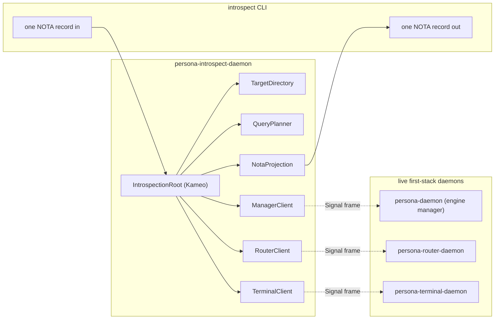
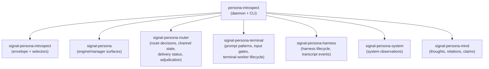
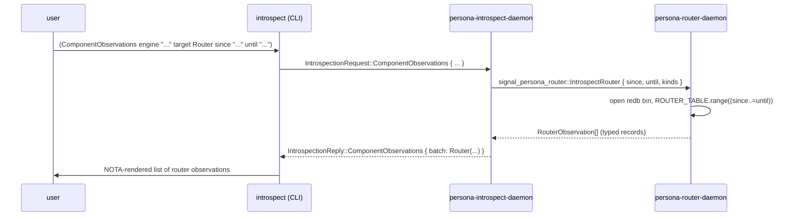

# 153 — Persona-introspect: shape, dependencies, CLI, and what SEMA actually gives us

*Designer research draft, 2026-05-13. Three threads braided: (a) what
does persona-introspect need to depend on to be useful, (b) what is the
first user interface, (c) what is SEMA today and what does it make its
users capable of. Plus a field survey of how distributed micro-component
systems handle "introspect this component on a time window." Retires
when a final design lands turning the gaps below into a witnessed
implementation.*

---

## 0 · TL;DR

The user's three intuitions are right, with one refinement each:

| Intuition | Verdict |
|---|---|
| persona-introspect needs more than its own envelope contract — it needs the per-component signal contracts so it can route typed queries and wrap typed observations. | **Yes, and the workspace has already specified this.** `persona/ARCHITECTURE.md` §0.6 + `signal-persona-introspect/ARCHITECTURE.md` §1-2 say component-specific observation records live in the component's own signal contract; `signal-persona-introspect` is **envelope + selectors only**. Today's code follows that: the introspect envelope uses `signal-persona-auth::EngineId` and component-target enums, not router/terminal row shapes. The work isn't a missing dependency layer — it's wiring per-component observation queries that don't exist yet. |
| The first UI is a CLI; persona-harness probably should have one too but doesn't, which means we haven't been testing it. | **The `introspect` CLI exists and is the right shape** (`persona-introspect/src/command.rs:33` — one NOTA record in, one NOTA reply out). But it's tiny: it handles `PrototypeWitness` only; every other request goes nowhere. **`persona-harness` has no CLI today** — only `persona-harness-daemon`. The user's inference is correct: that absence reads as "we haven't been exercising harness as a standalone surface." |
| All components should grow a uniform `introspect` action that takes a filter + time window and returns matching records, mirroring whatever SEMA gives them. | **The pattern is right; SEMA gives less than the user might be assuming.** SEMA is a *raw* typed-database kernel: `Sema::open`, `Table<K, V>`, `read(\|txn\|...)`, `write(\|txn\|...)`, `iter`, `range`. **No reducer. No subscription. No event-emit primitive.** Subscriptions and reducers live in the **consuming daemon's actor**, not in SEMA. Today only `persona-mind` has subscription + time-window plumbing built; every other component would build the same shape itself. |

The gap is concrete and small: **each first-stack component needs an
`Introspect` request variant on its own signal contract** that takes a
filter (kinds, time range) and returns the matching typed observation
records; `signal-persona-introspect` orchestrates by fanning out and
correlating across components. SEMA's `Table::range` is already enough
for the storage side once each component declares a time-indexed
secondary table (per the pattern `persona-mind` already uses).

The rest of this report walks the surfaces, the field, and the
implementation slope.

---

## 1 · What persona-introspect already is



`persona-introspect/src/runtime.rs:62` defines `IntrospectionRoot` with
six child actors — `TargetDirectory`, `QueryPlanner`, `ManagerClient`,
`RouterClient`, `TerminalClient`, `NotaProjection`. **Five of those six
are empty scaffolds today** — they hold a socket path or a counter; none
of them actually opens a connection or executes a Signal frame round
trip. `IntrospectionRoot.handle_request`
(`persona-introspect/src/runtime.rs:113`) is the truth: every reply
field is `ComponentReadiness::Unknown` or `DeliveryTraceStatus::Unknown`.

`signal-persona-introspect/src/lib.rs:160` declares the request /
reply envelope through the `signal_channel!` macro:

| Request | Reply | What it asks |
|---|---|---|
| `EngineSnapshot { engine }` | `EngineSnapshot { engine, observed_components: Vec<IntrospectionTarget> }` | "What components is this engine running?" |
| `ComponentSnapshot { engine, target }` | `ComponentSnapshot { engine, target, readiness }` | "Is this one component ready?" |
| `DeliveryTrace { engine, correlation }` | `DeliveryTrace { engine, correlation, status }` | "What happened to this correlated message?" |
| `PrototypeWitness { engine }` | `PrototypeWitness { engine, manager_seen, router_seen, terminal_seen, delivery_status }` | "Did the first-stack prototype actually fire end-to-end?" |

This is the *envelope* contract: the four scopes name what kinds of
questions cross the introspect boundary; the targets are
named-component enums; readiness is a tri-state (`Ready` / `NotReady`
/ `Unknown`). **It carries no component-specific row vocabulary** —
which is exactly what `signal-persona-introspect/ARCHITECTURE.md` §1–2
says it must not become.

---

## 2 · The dependency question — what introspect must know about

The user asked whether persona-introspect needs to depend on the
regular signal contracts, not just its own envelope. The answer is
**yes, by design and already in the active-repository map**. Per the
relevant lines of `protocols/active-repositories.md` §"Current Core
Stack":

> `signal-persona-introspect` — Central introspection envelope
> contract: introspection query/reply selectors, correlation,
> projection wrappers, and prototype witness records. It asks and
> wraps; **component-specific observations stay in the owning component
> contracts**.

> `signal-persona-router` — Router-owned observation contract for
> accepted messages, route decisions, channel state, delivery status,
> and adjudication status. **Used by `persona-introspect`** without
> turning `signal-persona-introspect` into a shared schema bucket.

The shape:



`persona-introspect`'s `Cargo.toml` should depend on **every
component-side signal contract whose state it wants to surface**.
This is not "the central introspect contract is a bag of every
component's rows" — that anti-pattern is what
`signal-persona-introspect`'s ARCH §2 rejects. It's the **introspect
daemon** (the runtime, not the contract) consuming each component's
typed observation vocabulary and wrapping it in an envelope reply for
the CLI's NOTA projection.

What that buys: when the router rejects a delivery, the router's
*own* `RouteDecision { … }` record (defined in `signal-persona-router`)
is what flows through the introspect daemon, gets wrapped into a
typed introspect reply, and renders as a NOTA record at the CLI edge.
No translation layer; no string-flattened messages; no centralised
record vocabulary that grows every time a component adds an
observation.

**Refinement.** The envelope today carries scope coarseness
(`ComponentReadiness::Ready | NotReady | Unknown`). For "give me
records in this time window," the envelope needs at least one
**record-carrying reply variant** — `ComponentObservations { engine,
target, snapshot, records: ComponentObservationBatch }` where
`ComponentObservationBatch` is itself a closed enum over the
per-component observation vocabularies. The closed enum is what keeps
this from becoming a shared schema bucket: each variant wraps **one
component's own** observation vocab from **that component's own**
signal contract.

```text
sketch (not implementation):
  enum ComponentObservationBatch {
      Router(Vec<signal_persona_router::RouterObservation>),
      Terminal(Vec<signal_persona_terminal::TerminalObservation>),
      Harness(Vec<signal_persona_harness::HarnessObservation>),
      System(Vec<signal_persona_system::SystemObservation>),
      Mind(Vec<signal_persona_mind::MindObservation>),
      Manager(Vec<signal_persona::ManagerObservation>),
  }
```

The wrapped types are **already** the typed records the owning
component publishes through its own signal contract — no new
vocabulary minted in the central crate.

**Three corrections from the field survey (§7.11) are load-bearing
for v1**:

- **Carry a `SnapshotId` on every reply.** redb read transactions
  are MVCC snapshots; expose their identity (or a monotonic
  component-local sequence) on every reply, accept it on every
  request. Without this, two consecutive snapshots can't be proven
  distinct on the wire and witness tests can't reproduce queries.
  Datomic's `(d/tx-range log t-start t-end)` is the precedent. The
  sketch above includes the `snapshot` field for this reason.
- **Add a `Schema` request variant.** `IntrospectionRequest::ListRecordKinds
  { target }` → `IntrospectionReply::RecordKinds(Vec<RecordKindDescriptor>)`
  where `RecordKindDescriptor` is itself a NotaRecord-derived
  introspection record. Self-hosting per GraphQL `__schema`; the
  CLI / agent can discover what each component publishes without
  hardcoding variants. Cheap to add now; would be expensive to
  retrofit later when third-party introspect consumers exist.
- **Provide a per-component `format_status` projection hook.**
  Operators see the projection the component chooses, not its
  literal redb buffer. OTP's `sys:get_status` calls into the
  user-overridable `format_status/2`. For Persona this is each
  component's choice of which fields of its observation record
  surface in `ComponentSnapshot` — protecting operator UIs from
  refactors of internal record shapes.

**Carrier shape**: per the OTP system-message-bypass lesson (§7.1),
`IntrospectionRequest` is a **sibling Signal frame variant** at each
component daemon's framing layer — peeled off before the operational
reducer sees it, dispatched to a generic introspector that talks to
the same redb the operational reducer reads. The operational handler
never knows introspection exists. Today's Persona stack is already
shaped this way structurally (per `persona-introspect/src/runtime.rs:62`
— `IntrospectionRoot` and per-component clients are siblings of
operational actors); the field confirms it's the right shape.

---

## 3 · The CLI — what exists and what's missing

`persona-introspect/src/command.rs:33` runs the `introspect` CLI. Today:

```text
introspect                              → PrototypeWitness query (default)
introspect '(PrototypeWitness engine "..." )'   → same query, explicit
introspect '<other NOTA record>'        → currently unreachable; only
                                          PrototypeWitness is registered
                                          in surface.rs Input enum
```

`persona-introspect/src/surface.rs:24` defines the CLI's `Input` enum:

```text
enum Input {
    PrototypeWitness(PrototypeWitness),    // only variant today
}
```

That's the gap on the CLI side: **one of four scope variants is
plumbed through.** The CLI ergonomics need three more variants
(`EngineSnapshot`, `ComponentSnapshot`, `DeliveryTrace`), each
matching its `IntrospectionRequest` peer. Beyond that, the user's
deeper proposal — *introspect a component on a time window* — calls
for a fifth (and likely sixth) request scope, where the reply carries
typed records, not a readiness tri-state.

**Recommended shape**, restated in NOTA at the CLI:

```text
# Existing scopes — readiness + correlation only:
(EngineSnapshot                                                 )
(ComponentSnapshot      engine "<eid>" target Router            )
(DeliveryTrace          engine "<eid>" correlation "<corr-id>"  )
(PrototypeWitness       engine "<eid>"                          )

# New scope — records on a time window:
(ComponentObservations  engine "<eid>" target Router
                        since "2026-05-13T17:00:00Z"
                        until "2026-05-13T17:10:00Z"
                        kinds (Router RouteDecision DeliveryStatus))

# New scope — push subscription (per push-not-pull skill):
(SubscribeComponent     engine "<eid>" target Router
                        kinds (Router RouteDecision))
```

The push-subscription variant is the same primitive `persona-mind`
already implements at the initial-snapshot level (per `~/primary/reports/designer/152-persona-mind-graph-design.md` §8 — initial snapshot
live; commit-time push delivery still missing). It's the right shape
for an introspect tool too: subscribe once, see new observations as
they fire.

### Why persona-harness doesn't have a CLI

The user's observation: every other first-stack component has both a
daemon and a CLI; `persona-harness` has `persona-harness-daemon` only.
Code map (`persona-harness/Cargo.toml`):

```text
[[bin]]
name = "persona-harness-daemon"
# no other [[bin]] entries
```

The reading is correct: in practice, harness has been exercised
through router-driven delivery, not as a standalone surface. A
`harness` CLI would shape the same way as `mind` and `introspect`
— one NOTA request record in, one NOTA reply out, against
`signal-persona-harness` channel — and would make harness state /
transcript queryable without spinning the whole stack. **This is a
separate gap from introspect's** but the user is right that the
two are related: without a CLI, harness state is exclusively visible
**through** introspect, which is the long-way-around.

The cleanest path: harness gains a thin `harness` CLI on the same
shape as `mind` (per `protocols/orchestration.md` §"Command-line mind
target"); introspect's RouterClient / ManagerClient / TerminalClient /
HarnessClient delegate to the corresponding component CLIs only at
test time, and to direct Signal frames in production.

---

## 4 · What SEMA actually gives us

Reading `sema/src/lib.rs` end-to-end, SEMA today is:

| Layer | What it owns |
|---|---|
| Lifecycle | `Sema::open(path)`, `Sema::open_with_schema(path, &Schema)` — opens redb, ensures parent dir, registers a `DatabaseHeader` (rkyv format guard) and a `SchemaVersion` (consumer-declared, kernel-checked on every open, hard-fail on mismatch). |
| Txn model | Closure-scoped `sema.read(\|txn\| ...)` and `sema.write(\|txn\| ...)` so callers can't leak redb transaction lifetimes across actor mailboxes. |
| Table API | `Table<K, V: Archive>` typed wrapper: `ensure(txn)`, `get(txn, key)`, `insert(txn, key, &value)`, `remove(txn, key)`, `iter(txn) -> Vec<(K::Owned, V)>`, `range(txn, RangeBounds) -> Vec<(K::Owned, V)>`. Rkyv encode/decode hidden at the boundary. Tables are lazily materialised by first use (per redb's model). |
| Slots | `Slot(u64)` newtype, monotone slot counter + `iter()` snapshot — for append-only stores. Legacy slot store (`store(&[u8]) → Slot`, `get(Slot) → Option<Vec<u8>>`) coexists with the typed kernel; used by older criome code. |
| Errors | Typed `Error` enum: 5 redb variants (`Database`, `Storage`, `Transaction`, `Table`, `Commit`) + `Io` + `Rkyv` + `RkyvEncode`/`RkyvDecode` per-table + `DatabaseFormatMismatch` + `SchemaVersionMismatch` + `LegacyFileLacksSchema` + `MissingSlotCounter`. |

What SEMA explicitly **does not own** (per its ARCH §"Boundaries"):

- Record Rust types (those live in `signal-<consumer>` contract
  crates).
- Per-ecosystem table layouts (those live in the state-owning
  component's typed SEMA layer, e.g. `persona-mind/src/tables.rs`).
- **Runtime write ordering or actor mailboxes** (the consumer
  daemon's actor owns these).
- **Subscription events** (the consumer daemon's actor emits these
  "after durable state changes").
- The validator pipeline (criome, persona-router, etc.).

The interesting line for the user's question is the subscription
boundary: **SEMA has no subscribe primitive.** Per the ARCH:

> Each consumer's runtime actor owns:
> - The mailbox into the database.
> - Transaction sequencing.
> - Commit-before-effect ordering.
> - Subscription events emitted after durable state changes.

So the answer to *"is SEMA a raw interface or does it have a reducer?"* is **raw — by design**. The reducer / subscriber pattern lives one layer up, inside each component daemon. And we already have one
working example.

### The persona-mind pattern (the only one fully built today)

`persona-mind` is the workspace's reference implementation for "typed
store with time-window queries and push subscriptions over the same
SEMA kernel":

| Capability | Where it lives in `persona-mind` |
|---|---|
| Typed records over redb | `persona-mind/src/tables.rs` — Table constants + StoredThought, StoredRelation, StoredSubscription declarations. |
| Time-window filter | `signal-persona-mind/src/graph.rs:ByThoughtTimeRange` and `persona-mind/src/graph.rs:221 accepts_time_range` — filter takes `start: TimestampNanos, end: Option<TimestampNanos>`, the daemon iterates the relevant typed table, evaluates `accepts_time_range`, returns matching records. |
| Subscription registration | `persona-mind/src/tables.rs:24-26` — `THOUGHT_SUBSCRIPTIONS` and `RELATION_SUBSCRIPTIONS` redb tables; the filter is **persisted** so subscriber survival across restarts is possible. |
| Initial snapshot | `persona-mind/src/graph.rs:136 open_thought_subscription` — registers the filter, then returns the records that match *at subscribe time* as the `initial_snapshot` payload of `SubscriptionAccepted`. **Live today.** |
| Commit-time push delivery | **Not yet wired** (per `~/primary/reports/designer/152-persona-mind-graph-design.md` §8 — "initial-snapshot subscription is live; commit-time push delivery is still missing"). Operator track `primary-hj4.1.1` is implementing it. |

This is the canonical pattern every other state-bearing component
would replicate. **None of these capabilities live in SEMA.** They
all live in `persona-mind`'s consumer daemon — using SEMA's
`Table::range`, `Table::iter`, `Table::insert` as the underlying
storage verbs. SEMA gave persona-mind the materials; persona-mind
built the protocol.

---

## 5 · The user's proposed pattern, sharpened

Restated from the user's prompt:

> All the components would have a introspection action `introspect`
> with a certain time window, and it would get from its state all of
> the objects that match the time window and return them.

The right way to land this:

1. **Each component's signal contract** (signal-persona-router,
   signal-persona-terminal, signal-persona-harness, signal-persona-
   system, signal-persona-message, signal-persona-mind, signal-persona)
   grows an `Introspect` request variant that takes `(filter, time
   range)` and a reply variant that carries `Vec<ThatComponent's-
   Observation>`. Each component owns its own observation enum.
2. **Each component's daemon** implements the handler against its
   own redb tables. The pattern is *exactly* persona-mind's:
   register a time-indexed secondary table; filter by time range
   on read; commit-then-emit on write for push subscriptions. SEMA's
   `Table::range` is the storage verb.
3. **`signal-persona-introspect`** carries a `ComponentObservations`
   request scope (alongside today's four scopes) that names *which
   component* to target plus a forwarded filter. The reply wraps
   that component's observation batch in a closed `ComponentObservationBatch`
   enum (§2 sketch).
4. **`persona-introspect`'s daemon** routes the typed request to the
   right component's daemon over its Signal socket, receives the
   typed observation batch, wraps it, and replies. For cross-cutting
   scopes (DeliveryTrace) it fans out to multiple components and
   correlates the results before replying. For push subscriptions
   (`SubscribeComponent`), it relays each component's
   `SubscriptionEvent` to the CLI's long-lived connection.
5. **`introspect` CLI** decodes one NOTA `IntrospectInput` record,
   maps it to one `IntrospectionRequest`, hands to the daemon,
   prints the NOTA-rendered reply.

The "fancy database" the user is right to reject is anything more
than this. **No central record store. No central typed query
language. No central reducer.** Each component owns its own state
and its own introspection handler; introspect daemon orchestrates
typed RPC; CLI projects to NOTA.

### Where this lands the time-window primitive



Two transactions, two typed RPCs, no shared store. The same shape
as `mind` querying `persona-mind` via `signal-persona-mind`. The
introspect daemon is **always thin** — it never opens a peer's redb
(per `persona-introspect/ARCHITECTURE.md` §2 constraint).

---

## 6 · What blocks landing this today

| Block | Where | What's missing |
|---|---|---|
| Component observation records not defined | `signal-persona-router`, `signal-persona-terminal`, `signal-persona-harness`, `signal-persona-system`, `signal-persona-message`, `signal-persona` | Each component contract needs an `Observation` enum (or closed sum) and the matching `Introspect*Query` / `Introspect*Reply` channel. The router contract has *some* (route decisions, channel state) per its active-repo description, but they're not currently shaped as an introspect-targeted reply. |
| Component daemons don't expose introspect handler | `persona-router`, `persona-terminal`, `persona-harness`, `persona-system`, `persona-message`, `persona-daemon` (engine manager) | Each daemon needs an actor that takes the time-window filter and serves matching records from its redb. The pattern is `persona-mind`'s ByThoughtTimeRange. |
| Introspect daemon clients are scaffolds | `persona-introspect/src/runtime.rs:257-335` | `ManagerClient`, `RouterClient`, `TerminalClient` are empty structs holding a `socket: Option<PathBuf>` and no Message handler. None actually connects, sends a Signal frame, or returns data. |
| Introspect envelope carries no record-payload variant | `signal-persona-introspect/src/lib.rs` | Today's `IntrospectionReply` has `EngineSnapshot`, `ComponentSnapshot`, `DeliveryTrace`, `PrototypeWitness`, `Unimplemented`, `Denied`. None carries a `ComponentObservationBatch`. |
| Introspect CLI input enum has one variant | `persona-introspect/src/surface.rs:24` | `Input::PrototypeWitness` only. Needs the other three existing scopes plus the proposed `ComponentObservations` and `SubscribeComponent`. |
| `persona-harness` has no CLI | `persona-harness/Cargo.toml` | Only `persona-harness-daemon` exists. The `harness` CLI would shape like `mind` — one NOTA record in, one out, over `signal-persona-harness`. |
| Push delivery primitive not landed (workspace-wide) | `persona-mind` (the reference; per /152 §8), copies missing in all other daemons | Even persona-mind's commit-then-emit is incomplete (operator `primary-hj4.1.1`). Until that lands, every component's `SubscribeComponent` returns initial snapshot only. |

None of these requires new architecture. The patterns are all
specified — they need implementation passes per component.

---

## 7 · Field research — how other systems do this

Ten patterns surveyed; the load-bearing finds, with code where the
shape is worth showing. Where a pattern contradicts the workspace's
current direction, that's flagged explicitly.

### 7.1 · Erlang/OTP `sys` — the system-message bypass

**Load-bearing idea**: introspection is a *uniform system-message
protocol* every well-formed actor honours; the call is decoupled from
the actor's own message vocabulary. `sys:get_state/1`, `sys:get_status/1`,
`sys:get_log/1`, `sys:replace_state/2,3`, `sys:suspend/1`, `sys:resume/1`,
`sys:trace/2` — every gen_server gets all of them for free without
ever declaring them.

The mechanism: `sys:get_state` routes through `gen:call(Name, system,
Request)`, which sends a tagged tuple `{system, From, Request}`. Any
compliant special process pattern-matches that prefix and dispatches
to `sys:handle_system_msg/6`. The user's callback module never sees
these messages unless it overrides `format_status/2`.

```erlang
%% stdlib/src/sys.erl (paraphrased)
get_state(Name) ->
  case send_system_msg(Name, get_state) of
    {error, Reason} -> error(Reason);
    {ok, State}     -> State
  end.

send_system_msg(Name, Request) ->
  try gen:call(Name, system, Request) of
    {ok, Res} -> Res
  catch
    exit:Reason -> exit({Reason, mfa(Name, Request)})
  end.
```

Two design lessons that directly affect the Persona shape:

- **The introspection envelope should sit beside the operational
  frame channel, not inside it.** In Erlang the carrier is the
  `{system, ...}` tagged tuple; in Persona's typed-Signal world the
  equivalent is a sibling Signal frame variant that the daemon's
  framing layer peels off and routes to a generic introspector
  before the operational reducer sees it. The reducer never needs
  to know introspection exists.
- **Provide a `format_status` hook per component.** Operators see
  the projection the component chooses, not its literal redb
  buffer. Without this, every refactor of an internal record
  shape leaks into every operator UI. OTP made this hook
  user-overridable for a reason.

Sources: [Erlang sys docs](https://www.erlang.org/doc/apps/stdlib/sys.html),
[OTP sys.erl source](https://github.com/erlang/otp/blob/master/lib/stdlib/src/sys.erl).

### 7.2 · gRPC server reflection — schema-as-data

**Load-bearing idea**: the schema itself is queryable at runtime over
the same transport. From `tonic-reflection/src/server/v1.rs`:

```rust
let resp_msg = match req.message_request.clone() {
    Some(MessageRequest::FileByFilename(s)) =>
        state.file_by_filename(&s).map(|fd|
            MessageResponse::FileDescriptorResponse(
                FileDescriptorResponse { file_descriptor_proto: vec![fd] })),
    Some(MessageRequest::FileContainingSymbol(s)) =>
        state.symbol_by_name(&s).map(|fd|
            MessageResponse::FileDescriptorResponse(
                FileDescriptorResponse { file_descriptor_proto: vec![fd] })),
    Some(MessageRequest::ListServices(_)) =>
        Ok(MessageResponse::ListServicesResponse(ListServiceResponse {
            service: state.list_services().iter()
                .map(|s| ServiceResponse { name: s.clone() }).collect(),
        })),
    ...
};
```

The pattern ports cleanly. For Persona, the analogue is to **bake the
rkyv `CheckedArchive` schema fingerprint + crate-name registry into
the binary**, and let the introspect daemon ask any component "what
record shapes do you speak?". This sharpens the proposed envelope:
**add a `Schema` request variant** to `signal-persona-introspect`
beside the four existing scopes. (Detailed corollary in §8.)

Source: [tonic-reflection v1 source](https://github.com/hyperium/tonic/blob/master/tonic-reflection/src/server/v1.rs),
[tonic-reflection docs](https://docs.rs/tonic-reflection).

### 7.3 · GraphQL `__schema` / `__type` — introspection is self-hosting

**Load-bearing idea**: the meta-schema is expressed in the same type
system. There is no second query language for introspection.

`__Schema`, `__Type`, `__Field`, `__InputValue`, `__EnumValue`, and
`__Directive` are ordinary GraphQL types under the rule that names
beginning with `__` are reserved.

**Direct lesson for Persona**: don't invent a second wire format for
introspection replies. `signal-persona-introspect` should carry typed
rkyv records identical in style to operational records — `ComponentSnapshot`
is a struct, not a JSON dictionary serialised through a side channel.
The NOTA projection happens at the edge, and the typed `__schema`-
equivalent record is itself a Signal frame variant:

```text
IntrospectionRequest::ListRecordKinds { target: IntrospectionTarget }
  → IntrospectionReply::RecordKinds(Vec<RecordKindDescriptor>)

# where RecordKindDescriptor is itself an introspection record
# (NotaRecord-derived, rkyv-archived, self-describing).
```

This avoids the trap that gRPC reflection narrowly avoids — there,
the descriptor is still protobuf, so the meta lives in a second
schema. In Persona, both the meta and the data are rkyv records
through the same NotaRecord derive path.

Source: [GraphQL Spec §4 — Introspection](https://github.com/graphql/graphql-spec/blob/main/spec/Section%204%20--%20Introspection.md).

### 7.4 · OpenTelemetry W3C trace context — push-not-pull, contrasted

**Load-bearing idea**: propagate a small typed context (`traceparent`
+ `tracestate` + `baggage`), record per-component, ship spans to a
separate aggregator. **No component owns the trace.**

The trace is reconstructed from spans submitted independently by each
service, joined by trace-id at the collector.

For Persona this is **a clarifying contrast** with `DeliveryTrace`.
The current proposal asks `persona-introspect` to compose the delivery
trace by querying components — **pull-based snapshot assembly**.
OpenTelemetry is **push-based, per-span emission**. Both are valid;
the difference is who owns reassembly:

- If you keep pull (the current envelope shape supports this): each
  component must keep enough history (a small bounded ring of recent
  records keyed by envelope id) so `DeliveryTrace` can be assembled
  deterministically. Thread the `CorrelationId` (already on the
  Signal frame at `signal-persona-introspect/src/lib.rs:41`)
  through every component's observation record.
- If you flip to push: each component publishes typed observation
  events to `persona-introspect` as they happen; introspect
  reassembles. This is push-not-pull (§`skills/push-not-pull.md`)
  applied to trace reassembly — and aligns with the subscription
  path the workspace is already building for `persona-mind`.

**Either is sound**; the pull-shape is what the current envelope
implies. Worth pinning the decision in §8 / open Q.

Sources: [OpenTelemetry context propagation](https://opentelemetry.io/docs/concepts/context-propagation/),
[W3C TraceContext (Uptrace)](https://uptrace.dev/opentelemetry/context-propagation).

### 7.5 · Envoy / Linkerd admin — typed vs textual, pull vs stream

**Load-bearing idea**: two surfaces per daemon, mostly pull, one
stream for push.

Envoy exposes `/clusters`, `/config_dump`, `/stats`,
`/stats?format=json`, `/stats/prometheus`, `/listeners`,
`/server_info`, `/runtime`, `/ready` — named, idempotent, JSON-proto
or text. Linkerd's `Tap` is a streaming gRPC over a single proto:

```protobuf
service Tap {
  rpc Observe(ObserveRequest) returns (stream TapEvent) {}
}
message ObserveRequest {
  uint32  limit  = 1;
  Match   match  = 2;
  Extract extract = 3;
}
message TapEvent {
  net.TcpAddress source = 1;
  ...
  oneof event { Http http = 3; }
}
```

**Direct mapping to Persona**: Envoy's `/config_dump` is the parent
of `EngineSnapshot`. The pattern of "specific named projections,
JSON-proto over HTTP" maps almost 1-1 to "specific named projections,
rkyv enums over Unix socket." The split between cheap-repeated-pull
(`/stats`, `ComponentSnapshot`) and bounded-streaming (`tap`,
`DeliveryTrace`) is **exactly the right split** — and it's already
present in the envelope. Keep both shapes.

Sources: [Envoy admin docs](https://www.envoyproxy.io/docs/envoy/latest/operations/admin),
[Linkerd tap.proto](https://github.com/linkerd/linkerd2-proxy-api/blob/main/proto/tap.proto).

### 7.6 · Kameo / Ractor / Akka — registries, but no `get_state`

**Load-bearing idea**: actor frameworks ship registries and lifecycle
hooks, but introspection of *user state* rides on conventions, not
framework features.

Kameo and Ractor both ship registries (`ActorRef::register`,
`ractor::registry::where_is`) and lifecycle hooks (`on_start`,
`on_panic`, `on_stop`). **Neither has a built-in `get_state`** like
OTP. Akka management exposes `/cluster/members`, `/cluster/shards`,
`/ready`, `/alive` HTTP routes, but the actor-state surface itself is
still in user code.

**Direct verdict for Persona**: Kameo has no built-in introspect
path. The workspace will not inherit `sys:get_state` semantics for
free. The right move is to do what OTP did manually — add an
`Introspect` system-message branch at the daemon's frame demultiplexer
that lifts requests off the operational channel and serves them from
the component's own consistent view. The Kameo actor never needs to
know it exists; the redb reader can be a separate Tokio task with a
snapshot transaction.

This matches the design already in
`persona-introspect/src/runtime.rs:62` — `IntrospectionRoot` is the
demultiplexer; the per-component clients are siblings of the
operational actors, not children.

Sources: [Kameo distributed-actor registry](https://docs.page/tqwewe/kameo/distributed-actors/registering-looking-up-actors),
[Ractor registry docs](https://docs.rs/ractor/latest/ractor/registry/index.html),
[Akka cluster HTTP management](https://doc.akka.io/docs/akka-management/current/cluster-http-management.html).

### 7.7 · Datomic / Datalog — the log is the database

**Load-bearing idea**: queries close over `(db, log, t-range)`;
history is a first-class value.

`(d/tx-range log t-start t-end)` returns datoms in transaction order;
`db.asOf(t)` returns a database value as of transaction `t`;
`db.history()` returns one that contains all assertions and
retractions.

**Direct precedent for Persona**: **carry a snapshot/tx id, not a
wall-clock time, on every snapshot reply**. redb has read
transactions that are MVCC snapshots; expose the snapshot id (or a
monotonic component-local sequence) on every reply and accept it on
every request. The introspect CLI becomes a Datalog-lite client:
"give me records of kind K, in tx range W, matching filter F."

This is the sharpest correction the survey produced: today's
`ComponentSnapshot { engine, target, readiness }` doesn't carry a
snapshot identity, which means two consecutive snapshots can't be
proven distinct on the wire. Adding the snapshot/tx id is cheap and
unlocks reproducible queries (per `~/primary/skills/architectural-truth-tests.md`'s
witness discipline).

What Datomic does **not** give: per-component isolation. Datomic's
log is global to the database. In Persona each component owns its
own log; `persona-introspect` is the fan-in. That's a legitimate
variant — call it "federated Datomic" — and the cost is that
cross-component queries (delivery trace, prototype witness) must do
the join at the introspect layer, which is the same job as the
OpenTelemetry collector.

Sources: [Datomic log reference](https://docs.datomic.com/reference/log.html),
[Datomic history docs](https://docs.datomic.com/client-tutorial/history.html).

### 7.8 · eBPF / uprobes — narrow but useful complement

**Load-bearing idea**: observability without modifying the program.

uprobes and USDT let you trace userspace functions without source
changes. Applicability to Persona is narrow but real for production
"why did this component get slow" sweeps. It is **not a substitute**
for typed introspection — uprobes give you function-entry events
with raw register contents, not domain records like "which envelope
did the router commit."

Verdict: keep eBPF on the table as a complement for post-mortem
latency forensics; don't conflate it with the operator's
"what's in component X's state" question.

Sources: [Brendan Gregg eBPF tools](https://www.brendangregg.com/ebpf.html),
[bpftime userspace eBPF runtime](https://github.com/eunomia-bpf/bpftime).

### 7.9 · tokio-console — gRPC `Instrument` service

**Load-bearing idea**: per-task instrumentation emits structured
events; a separate consumer aggregates and renders. The wire surface
is a gRPC service ([console-api proto](https://github.com/tokio-rs/console/blob/main/console-api/proto/instrument.proto)):

```protobuf
service Instrument {
  rpc WatchUpdates(InstrumentRequest)    returns (stream Update);
  rpc WatchTaskDetails(TaskDetailsRequest) returns (stream tasks.TaskDetails);
  rpc WatchState(StateRequest)            returns (stream State);
  rpc Pause(PauseRequest)                 returns (PauseResponse);
  rpc Resume(ResumeRequest)               returns (ResumeResponse);
}
```

The instrumentation side is a `tracing-subscriber::Layer` that
consumes runtime tracing events, aggregates by task/resource id, and
exposes them over the gRPC server. **Pause/Resume freeze the
aggregator at a wall-clock point so the view is consistent.**

Two moves worth stealing:

- A `tracing` layer per component emitting a typed introspection-
  record stream into a per-component aggregator is a **cheap
  implementation path** for `ComponentSnapshot`. Persona already
  uses `tracing`; the layer can write directly into a redb ring.
- `WatchTaskDetails`'s streaming RPC is the model for an eventual
  `IntrospectionSubscription`. Until commit-then-emit lands in
  every component (currently only persona-mind, per /152 §8), this
  is the v2 path.

The Pause/Resume affordance is interesting: a `Pause` Signal request
that freezes every first-stack component at the same redb snapshot
gives the introspect CLI a consistent multi-component view. Worth
considering for v2 — out of v1 scope.

Sources: [tokio-console announcement](https://tokio.rs/blog/2021-12-announcing-tokio-console),
[console-subscriber crate](https://crates.io/crates/console-subscriber).

### 7.10 · The proposed pattern — is it known?

What you'd find named "per-component time-window typed-record query"
**exactly** as the user proposes is essentially unprecedented in
off-the-shelf catalogues. The closest hits:

| Pattern | What it does | What's missing |
|---|---|---|
| Datomic's log API | Uniform across one DB | Not federated across components |
| OpenTelemetry collectors | Federated and uniform | Push-shaped; wire vocabulary is spans, not your domain records |
| Envoy admin | Uniform across one daemon | Menu of endpoints is hard-coded, not a discriminated query |
| gRPC reflection | Uniform across services | Describes schema only, not state |

The closest **design pattern** is in **CQRS read-model APIs**: each
bounded context exposes a read endpoint over its projection store,
with filter+window arguments, and the client composes results. That
is well-known; the gap is that the field rarely makes it **a single
typed-wire envelope shared across all components**. People rebuild
it per service. Akka management routes are an example — the route
*shape* is conventional, but every consumer of a route still
hand-builds its JSON.

**Verdict**: what the user proposes is **not an anti-pattern, and
it is not common**. It is the natural application of the OTP `sys`
pattern to a typed-wire Rust workspace, with a Datomic-shaped query
envelope and a tonic-reflection-shaped schema query. That combination
is good design; the cost is the discipline to keep each component's
record vocabulary contract-owned and to avoid letting
`signal-persona-introspect` accumulate every component's records.

### 7.11 · Field's verdict on the current envelope

The current `IntrospectionRequest { EngineSnapshot | ComponentSnapshot
| DeliveryTrace | PrototypeWitness }` is **on the right track**.
Three corrections the survey makes load-bearing for v1:

1. **Carry a snapshot/tx id, not wall-clock, on every snapshot
   reply** (Datomic confirms). redb's MVCC snapshots already give us
   the right primitive; expose its identity on the wire.
2. **Add a `Schema` request variant** (gRPC reflection confirms).
   Each component should be able to answer "what record kinds do you
   publish, and what does each look like?" — keyed by the same
   contract-crate name the operational handler uses. Self-hosting,
   per GraphQL.
3. **Add a per-component `format_status` hook** (OTP confirms).
   Operators see the projection the component chooses; refactors
   of internal record shapes don't leak into operator UIs.

The split between **`ComponentSnapshot`** (cheap, pull, repeated)
and **`DeliveryTrace`** (windowed, possibly streamed) is **exactly
Envoy's stats-vs-tap split**. Keep it.

**The one watch-out** the field repeats: the temptation to make
`persona-introspect` itself a second owner of every component's
redb. OTP, Datomic, and Envoy all agree — introspection serves
projections; the owner serves truth. Keep `persona-introspect` as a
fan-in and projection layer, not a reader of foreign redb files.
This constraint is already in `persona-introspect/ARCHITECTURE.md`
§2 ("The daemon does not open peer redb files") and in `~/primary/reports/designer-assistant/37-signal-nexus-and-introspection-survey.md` —
the field survey confirms the constraint is the right one, not
local pedantry.

---

## 8 · Recommended next moves (designer perspective)

1. **Land the envelope extension first, with the three field-confirmed
   corrections folded in.** Add
   `IntrospectionRequest::ComponentObservations { engine, target,
   since_snapshot: Option<SnapshotId>, filter: ObservationFilter }`
   and `IntrospectionReply::ComponentObservations { batch:
   ComponentObservationBatch, snapshot: SnapshotId }` to
   `signal-persona-introspect`. The `ObservationFilter` is small:
   `{ kinds: Vec<ObservationKind>, time_range: ObservationTimeRange }`.
   The batch is the closed sum over per-component observation
   vocabularies (each variant importing its types from the owning
   contract crate). Add `ListRecordKinds { target }` /
   `RecordKinds(Vec<RecordKindDescriptor>)` at the same time —
   self-hosting schema introspection costs nothing to add now and
   unlocks any future agent that needs to discover variants. Round-
   trip tests per variant.
2. **Pick the first component to wire end-to-end.** The
   `signal-persona-introspect` ARCH §4 already named *terminal* as
   the first slice (from the retired /146 thread). Terminal works
   well as the lighthouse because terminal state is unambiguous
   (input gates, prompt patterns, write injection acks) and the
   transcript table already exists. Wire: terminal's signal contract
   gains the observation enum; persona-terminal-daemon gains the
   handler; persona-introspect's TerminalClient gains the round
   trip; the CLI gains the `ComponentObservations target Terminal`
   path.
3. **Replicate per remaining component.** Router → harness → system
   → message → mind → manager. Each repeat is mechanical once the
   first slice ships.
4. **Land push subscriptions on top of step 1.** The shape mirrors
   `persona-mind`'s `SubscribeThoughts`/`SubscribeRelations`. Wait
   for commit-then-emit to land in persona-mind first (operator
   `primary-hj4.1.1`), then copy the discipline.
5. **Add `harness` CLI.** Single thin binary, same pattern as
   `mind` and `introspect`. One NOTA record → one
   `signal-persona-harness` request → one NOTA reply. Independent of
   introspect work.
6. **Open question: SEMA-level convenience for time-indexed
   tables?** Today every component that wants "records by time"
   declares its own secondary index manually. The workspace could
   add a `TimeIndexedTable<K, V>` wrapper to SEMA that bundles the
   primary table + a `(TimestampNanos, K)` secondary index +
   `range_by_time` helper. **Don't pre-build it.** Wait until two
   components have hand-rolled it; extract the kernel when the
   pattern is real (per `skills/contract-repo.md`'s extraction
   trigger).

---

## 9 · Open questions for the user

| Q | Question | Why it matters |
|---|---|---|
| 1 | Should the `IntrospectionRequest::ComponentObservations` variant land alongside today's four scopes, or should the existing four be reorganised under a more unified shape? | Today's four scopes (`EngineSnapshot`, `ComponentSnapshot`, `DeliveryTrace`, `PrototypeWitness`) are semantically distinct from "give me records in this time window." Mixing them under one variant family loses the distinction; keeping them parallel adds variants. Recommendation: keep parallel; the four current scopes are aggregations/correlations; `ComponentObservations` is the underlying primitive. |
| 2 | First-slice component: terminal (as /146 named), router (where most observation richness already exists), or harness (where state introspection is currently invisible)? | Different return on landing first. /146 named terminal; the actual choice is yours. |
| 3 | Does `harness` CLI come before or after the introspect widening? | Both are useful; the introspect widening unblocks every component's observation surface, while `harness` CLI gives a quick way to test harness directly. The user's framing ("haven't been testing it") suggests `harness` CLI is the more pressing tactical move. |
| 4 | Push subscriptions in introspect daemon: synchronous-only v1 (initial snapshot) or wait for commit-then-emit in every component? | Following `persona-mind`'s sequence keeps the discipline consistent. If introspect ships before commit-then-emit lands everywhere, every `SubscribeComponent` returns initial-only — which is honest but limited. |
| 5 | Should SEMA grow a `TimeIndexedTable` wrapper now, or wait for two consumers to hand-roll it first? | Per kernel-extraction discipline, wait. Persona-mind has one; second consumer (likely persona-router) will surface the right shape. Don't over-design. |
| 6 | `DeliveryTrace` reassembly: pull-shaped (introspect daemon queries each component for its slice keyed by `CorrelationId`) or push-shaped (each component emits trace events into a per-engine collector)? | Per §7.4 field survey: both are sound. Pull keeps each component the owner of its own log (federated-Datomic posture, matching §7.7); push aligns with the push-not-pull discipline already used for persona-mind subscriptions. Pull is simpler to land now; push compounds with the subscription work currently underway. Recommendation: pull v1 (the envelope already supports it via `CorrelationId`), revisit when commit-then-emit is universal. |
| 7 | Per-component `format_status` hook (§7.1 OTP precedent): is it a separate request variant or a side configuration each component owns? | Cheapest version is a side configuration the component owns: each component's observation handler picks which fields project. A more discoverable shape is a request variant that asks "what does your default `ComponentSnapshot` projection look like, and is it the full record?" Recommendation: side configuration v1; add a request variant in v2 if operators ask. |
| 8 | tokio-console-style `Pause` / `Resume` (§7.9) for cross-component consistent multi-component snapshot views: include in v1 or defer? | Defer. The use case (consistent view across components at a single wall-clock point) is real but rare; the implementation cost is non-trivial because every component must agree to pause its commit pipeline. Worth filing for v2 once introspect has more daily traction. |

---

## 10 · What this report retires when

This is a research draft per `~/primary/skills/reporting.md` §"Kinds
of reports". It retires when a final design report lands that:

- Names the chosen first-slice component and walks through the
  end-to-end implementation (envelope variant + component contract
  variant + component-daemon handler + introspect-daemon client +
  CLI input variant) with worked NOTA examples for each round-trip.
- Lists the witnesses (acceptance tests) that gate v1: at minimum
  `introspect_component_observations_round_trip`,
  `time_range_filter_returns_matching_records`,
  `introspect_daemon_does_not_open_peer_redb`,
  `subscribe_component_delivers_initial_snapshot`,
  `snapshot_id_distinct_between_consecutive_replies` (per §7.7
  Datomic precedent — proves redb's MVCC sequence is exposed on the
  wire),
  `list_record_kinds_describes_observation_vocab` (per §7.2-7.3
  gRPC-reflection / GraphQL-`__schema` precedent — proves schema
  introspection works end-to-end),
  `introspection_frame_bypasses_operational_reducer` (per §7.1 OTP
  precedent — proves the system-message branch is a sibling of
  the operational reducer, not a child).
- Either commits to landing `TimeIndexedTable` in SEMA or
  explicitly defers it with the trigger condition named.

Until that lands, this report carries the framing.

---

## See also

- `~/primary/protocols/active-repositories.md` §"Current Core Stack"
  — describes the persona-introspect / signal-persona-introspect /
  signal-persona-router relationship; the dependency map for §2 was
  derived directly from this.
- `~/primary/reports/designer-assistant/37-signal-nexus-and-introspection-survey.md`
  — prior workspace-level survey: every durable / externally-inspectable
  state record gets a contract-owned typed home, even when no
  operational peer consumes it yet. The field survey here (§7)
  confirms its direction.
- `~/primary/reports/operator/114-persona-introspect-prototype-impact-survey.md`
  — original operator-side impact survey that named persona-introspect
  as prototype-included.
- `~/primary/reports/designer/152-persona-mind-graph-design.md` §8
  (subscription / projection model) — the canonical pattern this
  report says every other component should follow.
- `~/primary/skills/push-not-pull.md` — the discipline that requires
  push subscriptions, not poll loops; mirrors what introspect needs.
- `~/primary/skills/contract-repo.md` §"Kernel extraction trigger"
  — when to extract `TimeIndexedTable` into SEMA (Q5 above).
- `~/primary/skills/architectural-truth-tests.md` — what acceptance
  witnesses must shape like (§10 above).
- `/git/github.com/LiGoldragon/persona-introspect/ARCHITECTURE.md` —
  current scaffold state; §5 ("Prototype status") confirms
  observation-relation wiring is intentionally scaffolded today.
- `/git/github.com/LiGoldragon/signal-persona-introspect/ARCHITECTURE.md`
  — the envelope contract's owned-and-not-owned boundaries; §2 says
  per-component observation records belong in the owning crate.
- `/git/github.com/LiGoldragon/sema/ARCHITECTURE.md` — SEMA's
  boundaries; the "Each consumer's runtime actor owns" line names
  where subscriptions actually live.
- `/git/github.com/LiGoldragon/persona-mind/src/graph.rs:136` —
  reference implementation of the subscription registration + initial
  snapshot pattern; copy target for every other state-bearing
  component.
