# 154 — sema-db query engine: research brief

*Designer research brief, 2026-05-13. A scoping document for the
research pass that decides whether — and how — today's `sema`
(pending rename → `sema-db`) should grow from a raw typed-KV kernel
into a database engine that handles the repeated query plumbing
every state-bearing engine component is about to rebuild. This
report does NOT decide the answer. It frames the question, names
the live constraints, lists what must be surveyed, and specifies the
expected output of the research. Retires when a final design
report lands.*

---

## 0 · Why this research, why now

Three observations forced the question:

1. **`persona-mind` has hand-rolled secondary indexes, time-window
   filters, snapshot cursor minting, and persistent subscription
   registration over sema's raw `Table::insert` / `range` / `iter`.**
   The code is at `persona-mind/src/tables.rs:24-26` (subscription
   tables), `persona-mind/src/graph.rs:221 accepts_time_range`
   (predicate filter), and `signal-persona-mind/src/graph.rs`
   `ByThoughtTimeRange` (filter shape).
2. **DA's `/41 §1.2` specifies the same pattern for `persona-terminal`**
   — explicit secondary `_by_time` tables keyed by
   `(TimestampNanos, ObservationSequence)`, with the discipline that
   both the primary record and the index row must be written in the
   same Sema write transaction.
3. **The introspect-widening work in `/153 §6` requires every
   first-stack component daemon to grow the same loop** —
   `persona-router`, `persona-terminal`, `persona-harness`,
   `persona-system`, `persona-message`, plus the manager. Six
   consumers will independently reinvent the time-window query path,
   the sequence cursor, the index discipline, and the
   commit-then-emit subscription delivery.

Per `~/primary/skills/contract-repo.md` §"Kernel extraction trigger"
(extract when ≥2 domain consumers exist), the extraction trigger is
forming. The research's job is to decide what to extract, what to
leave with consumers, and what the resulting sema-db looks like.

```mermaid
flowchart LR
    subgraph today["sema today (raw KV kernel)"]
        get["get(txn, key)"]
        range["range(txn, RangeBounds)"]
        iter["iter(txn)"]
        ins["insert/remove"]
        rw["read/write txn closures"]
        guard["schema + format guards"]
    end
    subgraph repeated["What every consumer rebuilds today"]
        idx["secondary index discipline"]
        seq["monotonic sequence minting"]
        twin["time-window filter loop"]
        cur["snapshot cursor on every reply"]
        sub["commit-then-emit subscription"]
        pred["predicate filter over V"]
        page["limit / paginate / sort"]
    end

    today -. each consumer rebuilds .-> repeated
```



The research decides which of the rebuilt boxes move left (into
sema), which stay right (in consumer daemons), and what the kernel-
vs-engine boundary looks like once it shifts.

---

## 1 · Sema today — precise inventory

The whole query surface, current:

| Method | Shape |
|---|---|
| `Sema::open / open_with_schema` | path + schema-version + DatabaseHeader guards |
| `Sema::read(\|txn\| body)` | closure-scoped read transaction |
| `Sema::write(\|txn\| body)` | closure-scoped write transaction, commit on `Ok` |
| `Table::get(txn, key)` | one row by exact key |
| `Table::range(txn, RangeBounds)` | contiguous slice by key range, eagerly collected `Vec` |
| `Table::iter(txn)` | every row in key order, eagerly collected `Vec` |
| `Table::insert(txn, key, &value)` | write/overwrite |
| `Table::remove(txn, key)` | remove by exact key |
| `Table::ensure(txn)` | materialise table without writing |
| `Sema::store / get / iter` (legacy slot store) | append-only bytes, slot identity |

What sema explicitly does NOT do (every item the consumer builds):

- Filter by non-key field (predicate over V)
- Secondary indexes
- Joins / aggregations / GROUP BY
- Sort other than key order
- Limit / skip / pagination
- Streaming iterators / cursors (results are eagerly `Vec`-collected)
- Conditional writes / compare-and-swap
- Subscriptions / change feeds / commit events
- Schema introspection ("list tables")
- Multi-key batch read
- Snapshot identity as a value-typed cursor
- Tuple keys beyond the `impl_copy_owned_table_key!` list

File: `/git/github.com/LiGoldragon/sema/src/lib.rs` (737 lines, single
file). ARCH: `/git/github.com/LiGoldragon/sema/ARCHITECTURE.md`.

---

## 2 · The repetition forming across consumers

| Pattern | Hand-rolled in | Will repeat in |
|---|---|---|
| Secondary index over `(time, primary_key)` | not yet (mind iterates+filters); DA `/41 §1.2` for terminal | every event-log component (router, terminal, harness, system, message) |
| Monotonic write sequence | `persona-mind/src/tables.rs:281 next_subscription_slot` (slot pattern) | every consumer minting `ObservationSequence` etc. |
| Time-window filter loop | `persona-mind/src/graph.rs:221 accepts_time_range` | every introspection query handler |
| Snapshot cursor on every reply | not yet in any consumer; DA `/41 D4` specifies for terminal | every introspection reply |
| Commit-then-emit subscription delivery | partially in mind (operator track `primary-hj4.1.1`); /152 §8 | every component publishing observations |
| Persistent subscription registration | `persona-mind/src/tables.rs:24-26 THOUGHT_SUBSCRIPTIONS / RELATION_SUBSCRIPTIONS` | every component supporting `SubscribeComponent` |
| Filter-by-kind-enum over a closed sum | `persona-mind/src/graph.rs:198 ThoughtFilter` | every component's observation filter |
| Eager `Vec` materialisation at read | every `iter()` and `range()` call | every read path; memory ceiling pressure as logs grow |

The research must inventory these with line citations and identify
which are **kernel-shaped** (no consumer-specific semantics needed,
clean wrapper API) vs **consumer-shaped** (the meaning of an event,
the commit ordering, the auth context — must stay with the consumer
actor).

---

## 3 · Constraints any answer must respect

These are non-negotiable for the research output. A proposal that
violates one of them is wrong-shaped.

| Constraint | Source |
|---|---|
| **Today vs eventually distinction.** This research shapes `sema-db` (today). The eventual `Sema` (universal medium for meaning, self-hosting computational substrate) is a different concept; do not conflate. | `ESSENCE.md` §"Today and eventually — different things, different names" |
| **Consumer's actor owns transaction sequencing, mailbox, commit-before-effect, subscription emission.** Whatever sema-db grows, the per-component daemon stays the owner of *when* writes commit, *what* gets emitted, and *who* receives. | `sema/ARCHITECTURE.md` §"Each consumer's runtime actor owns" |
| **Record types live in `signal-<consumer>` contract crates.** Sema-db does not absorb record types. The wire types and the storage types are the same. | `sema/ARCHITECTURE.md` §"Sema does not own ... Record Rust types" |
| **One file, one context window.** Sema is currently one 737-line `src/lib.rs`. Growth budget is bounded: if the result wouldn't fit comfortably in a single LLM context (per `~/primary/skills/micro-components.md`), it's the wrong shape — either smaller surface, or split. | `~/primary/skills/micro-components.md` |
| **Typed boundaries everywhere.** No untyped fallback path; no `Vec<u8>` as the canonical wire; no string-tagged dispatch. Every method has typed in, typed out. | `ESSENCE.md` §"Perfect specificity at boundaries" |
| **Closure-scoped transactions.** Callers cannot leak redb transaction lifetimes across actor mailboxes. Whatever new affordance lands, the txn-lifetime discipline must hold. | `sema/ARCHITECTURE.md` §"Closure-scoped txn helpers" |
| **Errors as typed `Error` enum.** No `anyhow`, `eyre`, or `Box<dyn Error>`. Any new error condition gets a typed variant. | `ESSENCE.md` §"Errors are typed enums per crate" |
| **Push-not-pull.** If sema-db hosts a subscription primitive, it pushes deltas; it does not expose a "what changed since cursor N" poll loop. | `~/primary/skills/push-not-pull.md` |
| **Beauty is the criterion.** Each new affordance should make consumer code *smaller* and *more obviously correct*; if it makes consumer code more cluttered or more conditional, the shape is wrong. | `ESSENCE.md` §"Beauty is the criterion" |
| **Verb belongs to noun.** No free functions. Each new capability hangs off a typed noun (`Table<K,V>`, `Sema`, `SecondaryIndex<K1, K2>`, `Subscription<F>`, etc.). | `~/primary/skills/abstractions.md` |

---

## 4 · Research questions (the brief)

The research returns answers to these. Each question is independent;
the researcher need not pre-commit to a unified architecture.

### Q1 · Inventory the repetition

Walk every state-bearing repo (`persona-mind`, `persona-router`,
`persona-terminal`, `persona-harness`, `persona-system`,
`persona-message`, plus any other consumer of sema). Pull out every
hand-rolled query shape that would be repeated. List with file:line
citations. Group by **kernel-shaped** (no consumer-specific
semantics) vs **consumer-shaped** (sequencing, auth, meaning of
records).

### Q2 · Where on the spectrum should sema-db sit?

Four candidate positions:

```text
A. Status quo — sema stays raw (today)
B. Pattern library — typed wrappers (SecondaryIndex, TimeIndexedTable,
   MonotonicSequence) compose on top of Table; consumer picks what it needs
C. Engine semantics — sema gains predicate filters, batch reads,
   value-typed snapshot cursors, subscribe-then-deltas as kernel primitives
D. Query DSL — sema gains a typed query language (Datalog-shaped,
   s-expr, or relational) that compiles down to redb ops
```

For each, name: **what consumer code looks like** (1-2 lines of the
typical use site at that level), **what the kernel takes on**, **what
moves off the consumer**, and **whether it violates §3 constraints.**
Don't commit to one yet; show the four options side by side.

### Q3 · Secondary index discipline — kernel or consumer?

`persona-terminal` per `/41` writes `(TimestampNanos, Sequence) → ()`
as a secondary index, alongside the primary observation table, in
the same write transaction. The discipline (write-both-or-rollback)
is what makes the index trustworthy. Can sema host this as a typed
`SecondaryIndex<PrimaryKey, IndexKey>` wrapper that *forces* the
two-write atomicity at the type system?  If yes, sketch the API. If
not, what's the cleanest pattern for consumers to enforce it?

### Q4 · Snapshot cursor — sema-minted value, or consumer-minted?

DA `/41 D4` chose **component-minted** sequences because redb's
internal MVCC transaction id is not exposed as a value. Is that the
right call long-term, or should sema-db expose a `SnapshotId(u64)`
value type minted on every successful `Sema::write`? Trade-off:
sema-minted gives every reply a stable cursor for free; consumer-
minted lets each component embed semantically meaningful sequence
identity (e.g., `TerminalObservationSequence` carries domain
meaning, not just commit order).

### Q5 · Streaming reads — replace eager `Vec` with cursors?

`Table::iter` and `Table::range` today eagerly collect into `Vec<(K::Owned, V)>`. This is a memory ceiling — large tables fully materialise on every read. redb supports lazy iteration; sema doesn't expose it. **Should it?** Trade-off: lazy iteration gives the caller back the transaction-lifetime problem the closure-scoped pattern was designed to prevent (§3 constraint). What's the right reconciliation?

### Q6 · Subscriptions / commit-then-emit — sema primitive or consumer-only?

`persona-mind` registers subscriptions in its own redb tables
(`THOUGHT_SUBSCRIPTIONS`, `RELATION_SUBSCRIPTIONS`) and the
commit-then-emit dispatch lives in the consumer actor. **Can sema
host a `Subscription<Filter>` primitive** that registers, persists
the filter, and offers a callback hook fired after `Sema::write`
commits successfully? Or does this inherently belong to the
consumer's actor because the filter semantics are consumer-typed?

### Q7 · Predicate filters — kernel or consumer?

`accepts_time_range` and `ThoughtFilter` filter records by non-key
fields after `Table::iter` / `range`. The consumer iterates Rust-
side because sema doesn't filter over V. **Should sema accept a
typed `Predicate<V>` and apply it during iteration?** The
alternative is each consumer pulls everything, filters in Rust.

### Q8 · Compound keys — how far does sema's `OwnedTableKey` impl set extend?

DA `/41 §1.2` notes that `(TimestampNanos, u64)` keys are awkward in
current sema because the `impl_copy_owned_table_key!` list covers
only `bool`, integers, `&str`, `String`, `[u8]`, `&[u8; N]`. The
workaround is a packed `TerminalObservationTimeKey::new(timestamp,
sequence)` per consumer. **Should sema gain tuple-key support
(`impl OwnedTableKey for (K1, K2)` etc.) as part of this research?**
What's the cost of doing so vs leaving consumers to pack?

### Q9 · How does the field do it?

Survey:

- **redb** itself — what does redb's roadmap explicitly include/exclude? Where does it draw the kernel/engine line?
- **sled, heed, fjall** — Rust embedded KV stores. Their query surface; what they choose to expose; what they leave to consumers.
- **Datomic** — typed records over Cassandra/DDB, `EAVT`/`AEVT`/`AVET`/`VAET` indexes, query engine separate from storage. Especially: how is "subscription / change feed" handled in Datomic? (Hint: `tx-report-queue`.)
- **FoundationDB layers** — ordered KV below, semantic layers above. The "layered architecture" philosophy.
- **DuckDB** — embedded analytical engine; what fits in one process; the storage/query split.
- **Honeycomb's retriever / event-store internals** — typed time-series at API level; columnar tradeoffs.
- **LMDB / RocksDB** — broader API patterns from established KV stores.
- **EdgeDB / FaunaDB** — typed query languages; what they buy over raw KV.

For each, name the **load-bearing idea** and whether it applies to
Persona's typed-Rust embedded-component posture. Don't summarise the
docs; cite the bits that matter and skip the rest.

### Q10 · The eventual Sema connection

How does today's `sema-db` growth interact with eventual `Sema` (the
universal medium for meaning)? Two non-trivial questions:

- Does anything we'd add to `sema-db` make the eventual transition
  harder? (Lock-in.)
- Does anything we'd add hint at the eventual shape and thus serve
  as a bridge? (Continuity.)

Treat this lightly; eventual `Sema` is deferred per
`ESSENCE.md` and shouldn't drive the answer. But the research should
notice the connection.

---

## 5 · Output shape (what the research returns)

A designer-side report at `reports/designer/<N>-sema-db-query-engine-design.md`
(numbered after `/154` plus whatever the role's count is at the time)
containing:

1. **Inventory of repeated patterns** (Q1) — table with file:line
   citations, kernel-shaped vs consumer-shaped grouping.
2. **Spectrum analysis** (Q2) — four candidate positions A-D, each with
   sketch use site, kernel responsibility, consumer responsibility,
   constraint compliance. Mermaid diagram comparing the four.
3. **Targeted answers** (Q3-Q8) — concrete recommendations on each
   specific affordance, with rationale grounded in the inventory.
4. **Field survey** (Q9) — ten patterns, code snippets where
   load-bearing (per `~/primary/skills/reporting.md` §"prose +
   visuals"), explicit verdict on applicability.
5. **Eventual-Sema notice** (Q10) — short.
6. **Recommended position** — name the chosen point on the spectrum
   with reasoning that engages the §3 constraints directly. Show
   what consumer code looks like at that position with one worked
   example (persona-terminal's terminal-observations time-window
   query, since DA `/41` has already spec'd the consumer side).
7. **Open questions for the user** — what decisions the research
   surfaces that aren't yours to make (rename timing, growth
   budget, eventual-Sema timing).

Acceptance witnesses the research's recommendation must name:

- **`sema_kernel_one_file_budget_witness`** — proves the proposed
  surface fits the single-file / single-context budget.
- **`consumer_code_size_decreases`** — proves the proposal makes
  consumer code measurably smaller, not larger.
- **`txn_lifetime_does_not_leak`** — proves the closure-scoped txn
  discipline holds for every new affordance.

---

## 6 · What this brief is NOT

- **Not a design.** The answer is not pre-decided. The researcher
  may conclude "stay at A; do not grow sema-db" if the §3 constraints
  rule out everything else. That's a valid output.
- **Not a roadmap.** No implementation order, no operator package
  decomposition. That comes after the design lands.
- **Not a critique of `/41` or `/153`.** DA `/41`'s component-minted
  sequence + per-component time-index pattern is the correct call
  *given today's sema*. This research asks whether today's sema is
  the right shape now that we know it will be repeated six times.

---

## 7 · Timing and dispatch

The introspect-widening work (`/153 / /41` + operator-assistant
`/111`) **does not block on this research**. Operator can implement
terminal-first per `/41` against current sema; the patterns they
hand-roll are the second consumer that confirms the extraction
trigger. The research can run in parallel and surface its
recommendation by the time router (Package D in `/41 §3`) lands —
that's the natural retrofit window if any kernel changes happen.

The researcher should be a designer-assistant pass or an
Explore/general-purpose agent with the brief above as its prompt.
The output is a designer-side report (not designer-assistant) since
the recommendation is a structural decision about workspace
infrastructure.

---

## See also

- `~/primary/reports/designer/153-persona-introspect-shape-and-sema-capabilities.md`
  §4 (what SEMA actually gives) + Q5 (TimeIndexedTable extraction
  question) — the partial answer this research completes.
- `~/primary/reports/designer-assistant/41-persona-introspect-implementation-ready-design.md`
  §1.2 (terminal Sema tables + time-index pattern) — the second
  consumer that surfaces the repetition.
- `~/primary/reports/designer/152-persona-mind-graph-design.md` §6
  (storage shape) + §8 (subscription model) — the first consumer,
  already hand-rolling the pattern.
- `/git/github.com/LiGoldragon/sema/ARCHITECTURE.md` §"Each consumer's
  runtime actor owns" — the constraint that fences which parts of
  the loop must stay with the consumer.
- `/git/github.com/LiGoldragon/sema/src/lib.rs` — the 737-line single
  file the research's recommendation must fit in (or commit to
  splitting).
- `~/primary/ESSENCE.md` §"Today and eventually — different things,
  different names" — the discipline that keeps `sema-db` and
  eventual `Sema` distinct.
- `~/primary/skills/contract-repo.md` §"Kernel extraction trigger"
  — the workspace rule (extract when ≥2 consumers exist) that this
  research operationalises.
- `~/primary/skills/micro-components.md` — the one-component-one-context
  budget the research's recommendation must respect.
- `~/primary/skills/push-not-pull.md` — the subscription discipline
  the research must honor.
