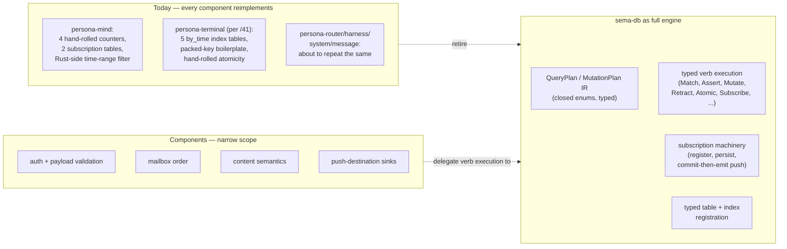

# 157 — sema-db as the full database engine: distance from intent, and what changes

*Designer design report, 2026-05-14. Replaces
`reports/designer/155-sema-db-pattern-library.md` (the prior
conservative pattern-library convergence). Records the user-
articulated architectural commitment 2026-05-14: Signal is the
workspace's typed binary database-operation language; sema-db is
its full execution engine; components do not reimplement the
engine in their daemons. Measures the distance between that intent
and current implementation. Specifies what sema-db must grow to
become the engine. Replaces the "consumer-owns-policy, sema-owns-
mechanism" boundary that /155 (and DA `/43 §3-§4`) drew too narrowly.*

**Supersedes `reports/designer/155-sema-db-pattern-library.md`** —
the four-affordance pattern library named there is a *subset* of
what this design names; the conservative framing ("not a query
engine") is wrong direction. /155 retires in the commit that
lands this report.

**Responds to:** the user's articulation 2026-05-14 ("Signal is a
database language used to communicate so everything should be
wrapped in verbs when it's in transit"; "I want a full engine");
`reports/designer-assistant/43-nexus-query-language-and-sema-engine-arc.md`'s
recovery of the verb spine;
`reports/designer-assistant/44-signal-sema-full-engine-implementation-gap.md`'s
implementation-distance audit (DA's specific evidence of where
current code differs from intent — folded into §2.3-§2.5, §4.6,
§5.1, §6 Package 1.5 below); the redirect away from
`reports/designer/154-sema-db-query-engine-research-brief.md`'s
Option B convergence.

**Retires when:** sema-db ships the QueryPlan/MutationPlan/Subscription
IR (§4), at least one consumer migrates off its hand-rolled query
path (§7), and `sema/ARCHITECTURE.md` absorbs the new boundary
(§5). The witnesses in §8 become the durable record of the
constraints; this report deletes; the ARCH carries the substance.

---

## 0 · TL;DR

The intent: **sema-db is the workspace's typed database engine.**
Every Signal verb (Assert, Match, Mutate, Retract, Atomic,
Subscribe, Project, Aggregate — the twelve listed in
`signal-core/src/request.rs:6-19`) has its execution semantics
hosted in sema-db. Component daemons declare their tables,
indexes, and typed records; sema-db executes the verbs against
them. Consumers do not hand-roll secondary indexes, monotone
counters, time-range filter loops, subscription registration
tables, snapshot bookkeeping, or commit-then-emit dispatch.

The gap, in one paragraph: sema-db today is a 737-line raw KV
kernel (`Table::get/insert/iter/range`, `read|write` closures,
typed values via rkyv). Every state-bearing component (mind
today; terminal/router/harness/system/message specified or
in-flight) hand-rolls the same patterns on top: secondary
index discipline, monotone counters, time-range filters,
subscription tables, commit-then-emit, snapshot identity. The
Signal verb spine (`SemaVerb`) is present but unenforced; most
contracts don't yet declare which verb each request variant
instantiates. The result: every component reimplements the
engine, with drift between implementations the witness layer
can't catch yet.

What sema-db must become, in one paragraph: a typed query/
mutation engine with a closed-enum **Query Plan IR**
(`QueryPlan<Record>` covering `Match`, `Project`, `Aggregate`,
`Constrain`, `Limit`, `Order`); a closed-enum **Mutation Plan IR**
(`MutationPlan<Record>` covering `Assert`, `Mutate`, `Retract`,
plus closure-scoped `Atomic`); a **Subscription primitive**
that registers plans, persists them, and pushes deltas
post-commit via consumer-provided sinks; a **Validate** dry-run
wrapper; and **typed table/index declarations** as data (not
constants) so plans can name them. Components shrink to:
auth, payload validation, mailbox order, content semantics,
push-destination wiring. The verb-spine discipline lands in
`~/primary/skills/contract-repo.md` so every cross-component
request declares its verb at the type layer.



The four affordances `/155` named (IndexedTable, MonotoneSequence,
Table::scan_range, define_packed_key!) are **artifacts under the
engine, not the engine itself**. They become internal
implementation details of how `QueryPlan::ByIndex`,
`MutationPlan::Assert`-with-time-index, and the typed-table
materialisation work. The public API is the verb-shaped IR, not
those low-level types.

This is **Option C** on `/154 §4`'s spectrum (engine semantics),
sharpened by the verb spine the workspace already named. **Not
Option D** (a query DSL) — there is no second text syntax;
Nexus/NOTA projects directly to the typed IR.

---

## 1 · The intent — what we just established

The architectural commitment, in five clauses (user-articulated
2026-05-14 + `/43`'s recovery):

1. **Signal is the workspace's typed binary database-operation
   language used to communicate.** `signal-core/src/request.rs:6-19`
   names the closed set of operations as `SemaVerb`. Every
   cross-component request is a typed operation in this language.
2. **Everything in transit is wrapped in a verb.** A request's
   verb is part of the contract, not a label applied after the
   fact. A payload that doesn't fit any verb is a design event:
   the payload is mis-modeled, or the verb set is incomplete.
3. **Nexus/NOTA is the text projection of the same language.**
   Per `nexus/spec/grammar.md`, every top-level Nexus request is
   a verb record. Nexus does not have a syntax of its own; it
   uses NOTA.
4. **Sema-db is the engine, not just the storage kernel.** The
   verbs Signal carries are operations sema-db executes against
   the typed tables consumers declare. Components do not
   reimplement the engine — they declare relations, validate
   requests, and delegate execution.
5. **The boundary moves.** What used to live in the consumer
   daemon's typed Sema layer (secondary index discipline, time-
   range filter loops, subscription tables, commit-then-emit
   dispatch, snapshot bookkeeping) moves into sema-db as typed
   verb execution. The consumer daemon retains: auth, payload
   validation, mailbox order, content semantics, push-destination
   wiring.

Per `~/primary/ESSENCE.md` §"Today and eventually" — this
shapes today's `sema-db` (Rust-on-redb storage kernel growing
into a typed engine). Eventual `Sema` (universal medium for
meaning, self-hosting computational substrate) is a separate
concept and remains deferred. The naming distinction holds.

---

## 2 · Where the implementation is today

Three precise inventories: sema-db itself, the verb spine in
contracts, the hand-rolled patterns in components.

### 2.1 · sema-db today

737 lines, `src/lib.rs`, single file. Owned surface:

| Surface | Status |
|---|---|
| `Sema::open` / `open_with_schema` | Lifecycle + schema/header guards. Present. |
| `Sema::read(\|txn\| ...)` / `write(\|txn\| ...)` | Closure-scoped transactions. Present. |
| `Table<K, V>` typed wrapper | rkyv-encoded values, typed keys. Present. |
| `Table::get` / `insert` / `remove` | Single-row CRUD. Present. |
| `Table::iter` / `range` | Eager `Vec<(K::Owned, V)>` collection. Present. |
| `Slot(u64)` + legacy append-only store | Utility for criome-shape stores. Present. |
| Typed `Error` enum (12 variants) | Present. |
| Secondary indexes | **Absent.** Consumers hand-roll. |
| Monotone counters | **Absent.** Consumers hand-roll as `Table<&str, u64>`. |
| Closure-scoped scan with predicate / early break | **Absent.** Consumers do eager + Rust filter. |
| Compound key support beyond `impl_copy_owned_table_key!` list | **Absent.** Consumers hand-roll packing. |
| Query plan IR | **Absent.** No typed plan; consumers compose ops directly. |
| Mutation plan IR (beyond raw insert/remove) | **Absent.** |
| Subscription primitive | **Absent.** Consumers hand-roll. |
| Schema introspection | **Absent.** |
| Snapshot identity / cursor value | **Absent.** redb MVCC snapshots exist but their id isn't exposed. |
| Dry-run / validate wrapper | **Absent.** |
| Verb-aware execution | **Absent.** No mapping from `SemaVerb` to storage operation. |

Sema-db today implements **`Table::get` ≈ `Match`-by-key,
`Table::range` ≈ `Match`-by-range, `Table::insert` ≈ `Assert`-or-
`Mutate`, `Table::remove` ≈ `Retract`**. Everything else from the
verb spine is consumer-territory.

### 2.2 · The verb spine in contracts

`SemaVerb` lives in `/git/github.com/LiGoldragon/signal-core/src/request.rs:6-19`.
The closed set: `Assert, Subscribe, Constrain, Mutate, Match,
Infer, Retract, Aggregate, Project, Atomic, Validate, Recurse`.

`Request<Payload>` is the envelope at `signal-core/src/request.rs:21-90`:

```rust
pub enum Request<Payload> {
    Handshake(HandshakeRequest),
    Operation { verb: SemaVerb, payload: Payload },
}

impl<Payload> Request<Payload> {
    pub fn assert(payload: Payload) -> Self { ... }
    pub fn match_records(payload: Payload) -> Self { ... }
    // ... constructors for all 12 verbs ...
}
```

**The gap:** the envelope carries a verb, but **no `signal-persona-*`
contract enforces a mapping from request variant to verb.** A
caller can wrap any payload in any constructor:
`Request::assert(SomeQueryPayload)` typechecks. Per `/43 §2`,
`signal-persona-message` already drifts here — `InboxQuery`
(read-shaped) is constructed via `Request::assert(...)`. The
witness layer doesn't catch it.

What landed: `SemaVerb` enum + `Request::Operation { verb,
payload }` envelope + per-verb constructors.

What didn't land: contract-level mapping from `signal-<consumer>::Request`
variants to `SemaVerb`; round-trip tests asserting verb
alongside payload; Nexus-example/Signal-frame verb agreement
tests.

### 2.3 · Hand-rolled patterns across components

Inventory by component, with file:line citations. Each row is a
pattern that the full engine absorbs.

**`persona-mind` (the working consumer):**

| Pattern | Where | Line count |
|---|---|---|
| Monotone counters as `Table<&str, u64>` with one key | `persona-mind/src/tables.rs:18,22,23,28` | 4 declarations |
| `next_*_slot` methods reading + writing the counter inside daemon code | `persona-mind/src/tables.rs:321-361` | ~40 lines × 4 = ~160 lines |
| `after_records` initialisation paths recovering from missing counter | same | ~30 lines |
| Subscription registration tables (`THOUGHT_SUBSCRIPTIONS`, `RELATION_SUBSCRIPTIONS`) | `persona-mind/src/tables.rs:24-28` | 2 tables + filter persistence |
| `accepts_time_range` Rust-side filter after eager `iter()` collect | `persona-mind/src/graph.rs:221` | ~15 lines |
| `ThoughtFilter::ByKind / ByAuthor / ByTimeRange` closed enum dispatch | `signal-persona-mind/src/graph.rs` (per /153) | per-component |
| Sequence-keyed event-log tables (`THOUGHTS`, `RELATIONS`, `ACTIVITIES`) | `persona-mind/src/tables.rs:17,20,21` | 3 tables |
| Compact graph ID derivation from slot value | `persona-mind/src/tables.rs:412-438` (`CompactGraphId`) | ~25 lines |
| Initial-snapshot subscription delivery | `persona-mind/src/graph.rs:open_thought_subscription` (per /153) | working |
| Commit-then-emit subscription push | **operator track `primary-hj4.1.1` in flight** | not yet wired |

Total in mind: roughly **250 lines of code** implementing patterns
that should be sema-db verb execution.

**`persona-terminal` (specified in `/41`, not yet implemented):**

| Pattern | Per /41 §1.2 |
|---|---|
| 5 primary event-log tables (sequence-keyed) | `delivery_attempts`, `terminal_events`, `viewer_attachments`, `session_health_changes`, `session_archive_commits` |
| 5 parallel `_by_time` secondary index tables | each keyed by `TerminalObservationTimeKey -> TerminalObservationTimeIndexEntry` |
| Packed key newtype with hand-rolled `redb::Key` impl | `TerminalObservationTimeKey(timestamp, sequence)` |
| Monotone counter for `TerminalObservationSequence` | another `Table<&str, u64>` |
| `TerminalObservationQuery` closed-enum filter | per-component |
| Atomic dual-write discipline (primary + index in same txn) | hand-rolled per call site |
| Time-range / sequence-range filter loops | hand-rolled |
| Initial-snapshot + commit-then-emit subscription delivery | once Subscribe wire variant lands |

Specified: ~200-300 lines of expected hand-rolled code. None
implemented yet — meaning the work can target the engine directly
if the engine lands first.

**`persona-router` (the third concrete consumer):** per DA
`/44 §3.7`, already hand-rolls a secondary index pattern.
`persona-router/src/tables.rs` declares both `CHANNELS` and
`CHANNELS_BY_TRIPLE`, written in the same transaction. The
discipline is correct; the boilerplate is what the full engine
absorbs.

**`persona-harness`, `persona-system`, `persona-message`, plus
the manager:** each will repeat the same pattern set. Five
more components × ~200 lines hand-rolled each = **~1000
additional lines of duplicated engine** if the full engine
doesn't land. With mind (~250 lines) + terminal (~200-300
lines specified) + router (already in progress) + the
remaining five components = roughly **~1700-2000 lines of
duplicated engine** across the first stack.

### 2.4 · Implementation drift across all signal-persona-* contracts

DA `/44 §3.4` audited every `signal-persona-*` contract's
round-trip test and found a uniform pattern: most contracts
default to `Request::assert(...)` for every payload, regardless
of whether the payload is read- or write-shaped. The full
inventory:

| Contract | File:line | What's wrapped under `Request::assert` |
|---|---|---|
| `signal-persona-message` | `tests/round_trip.rs:70` | `InboxQuery` (read-shaped — should be `Match`) |
| `signal-persona-introspect` | `tests/round_trip.rs:14` | `EngineSnapshotQuery` (read-shaped — should be `Match`) |
| `signal-persona-router` | `tests/round_trip.rs:15` | `RouterSummaryQuery` (read-shaped — should be `Match`) |
| `signal-persona-system` | `tests/round_trip.rs:22` | all `SystemRequest` values |
| `signal-persona-harness` | `tests/round_trip.rs:19` | all `HarnessRequest` values |
| `signal-persona-terminal` | `tests/round_trip.rs:34` | all `TerminalRequest` values |
| `signal-persona-mind` | `tests/round_trip.rs:17` | all `MindRequest` values |

Only `signal-persona` itself proves the intended shape (per
`/44 §3.4`): `tests/engine_manager.rs:53` wraps
`EngineStatusQuery` as `Request::match_records`,
`tests/engine_manager.rs:329` wraps `ComponentStartup` as
`Request::mutate`, supervision hello/readiness/health uses
`Match` (line 405), and graceful-stop uses `Mutate` (line 412).

Several contracts ship `operation_kind()` methods (e.g.,
`MessageOperationKind`, `TerminalOperationKind`) that return
contract-local variant names — useful for unimplemented-reply
labelling, but they do not map to `SemaVerb` and do not enforce
database-operation semantics.

The pattern is uniform: the envelope allows verb declaration,
nothing forces it, and the default test constructor encodes
`Assert` regardless of payload shape.

### 2.5 · The older `signal` crate and Nexus parser are pre-rebase

Two pieces of code haven't yet been rebased onto the
`signal-core` verb envelope; both block end-to-end verb
correctness once sema-db's executor lands.

**The `signal` crate (sema-ecosystem's wire layer) still has
its own legacy `Request` enum.** At
`/git/github.com/LiGoldragon/signal/src/request.rs:24`:

```rust
pub enum Request {
    Handshake(HandshakeRequest),
    Assert(AssertOperation),
    Mutate(MutateOperation),
    Retract(RetractOperation),
    AtomicBatch(AtomicBatch),
    Query(QueryOperation),
    Subscribe(QueryOperation),
    Validate(ValidateOperation),
}
```

This diverges from the verb-spine intent in two ways: (a) it
duplicates the operation envelope rather than re-using
`signal_core::Request { verb, payload }`; (b) it keeps `Query`
as a variant even though current Nexus says `Query` is not a
verb (read operations are `Match`, `Project`, `Aggregate`, or
`Constrain`). Per `/44 §3.2`, this is the oldest piece in the
sema-ecosystem path and the largest single migration step.

`/git/github.com/LiGoldragon/signal/src/query.rs:17` has only
`QueryOperation::{Node, Edge, Graph}` — a useful M0 match
surface, but not the full query language.

**The Nexus parser is a compatibility adapter that only decodes
the old assert surface.** At
`/git/github.com/LiGoldragon/nexus/src/parser.rs:38`:

```rust
Some(Token::LParen) => {
    let operation = AssertOperation::decode(&mut self.decoder)?;
    Ok(Some(Request::Assert(operation)))
}
```

The Nexus spec is correct (per `nexus/ARCHITECTURE.md:164`
documenting the verb-record renovation); the parser hasn't
caught up — every `(` becomes an Assert until `signal` is
rebased. Per `/44 §3.3`, documentation leads code here.

These two are blockers for end-to-end verb-correctness. The
contracts can carry verb mappings (Package 1) without these,
but the binary frames sema-db ultimately executes must come
through the `signal-core::Request { verb, payload }` envelope.
Both pieces need to land before sema-db's verb executor (§4.1)
fires against real wire traffic.

---

## 3 · The gap — measured distance from intent

The intent has five clauses (§1); the implementation status of
each:

| Intent clause | Status today | Distance |
|---|---|---|
| Signal is the typed database-operation language | `SemaVerb` enum present in `signal-core/src/request.rs` | **80% there.** Enum exists; envelope exists; constructors exist. |
| Every cross-component request declares its verb | No per-contract `sema_verb()` mapping; constructor abuse possible | **30% there.** Envelope can carry a verb; nothing enforces. |
| Nexus/NOTA projects to the verb spine | `nexus/spec/grammar.md` says "every top-level request is a verb record"; no end-to-end witness yet | **60% there.** The grammar is written; the round-trip lacking. |
| Sema-db is the full execution engine | sema-db is a raw KV kernel; only `Table::get/insert/range/remove` map to verbs (`Match`-by-key, `Assert`/`Mutate`, `Retract`) | **15% there.** Four of twelve verbs partially expressible; eight (`Subscribe`, `Atomic` proper, `Constrain`, `Project`, `Aggregate`, `Validate`, `Infer`, `Recurse`) absent. |
| Components don't reimplement the engine | mind has ~250 lines of hand-rolled engine; terminal specified to add ~200-300; router/harness/system/message ~1200 more if pattern continues | **5% there.** Every state-bearing component is on track to reimplement. |

**The aggregate distance is large.** The verb spine names the
language; almost none of it lands in sema-db; consumers
reimplement the engine.

The cost of staying in this state: **every new component
duplicates the engine, drifts from its peers, and accumulates
divergent witness coverage.** /154 §0 named this — six consumers
about to repeat the same hand-rolled loop. /155's conservative
pattern-library convergence reduces *some* repetition but leaves
the bulk (subscription delivery, query planning, snapshot
identity, schema introspection, dry-run) untouched.

The cost of closing the gap: **sema-db grows from ~750 lines to
plausibly ~3000-4000 lines** (still within `~/primary/skills/micro-components.md`'s
"≈3k–10k lines" single-component budget; split into modules
inside one repo). The plumbing work is substantial, but the
plumbing is *bounded* — twelve verbs, a closed IR, a
subscription primitive, a registration API. The consumer-side
savings are six components × ~200 lines = **~1200 lines that
never get written**, plus the divergent-witness problem
disappearing.

The right move is to close the gap. The rest of this report
specifies how.

---

## 4 · What sema-db must grow

Sema-db grows in five named additions. Each is verb-aligned;
each is bounded; each can land independently with witnesses.

### 4.1 · QueryPlan<R> — the typed read IR

A closed enum of typed read operations. The component constructs
a `QueryPlan<R>` from its domain-typed query record
(`TerminalObservationQuery`, `ThoughtFilter`); sema-db executes
the plan against the relevant tables.

**Shape anchor:**

```rust
pub enum QueryPlan<R: Record> {
    AllRows { table: TableRef<R> },
    ByKey { table: TableRef<R>, key: R::Key },
    ByKeyRange { table: TableRef<R>, range: KeyRange<R::Key> },
    ByIndex { index: IndexRef<R>, range: KeyRange<R::IndexKey> },
    Filter { source: Box<Self>, predicate: Predicate<R> },
    Project { source: Box<Self>, fields: FieldSelection<R> },
    Limit { source: Box<Self>, count: usize },
    Order { source: Box<Self>, by: OrderBy<R> },
}
```

The `Predicate<R>` type: a typed `fn(&R) -> bool` (component-
supplied; sema-db evaluates inside the scan closure, no
lifetime escape). The `FieldSelection<R>` is a typed lens
(component-derived; sema-db applies the projection during scan
or after collect, depending on size).

`R: Record` is the trait every consumer-declared record type
implements; it carries the typed key type `R::Key`, optional
index types `R::IndexKey`, and the rkyv archive bounds.

**Verb mapping:**

| Verb | QueryPlan shape |
|---|---|
| `Match` | Any QueryPlan; the verb's payload IS a QueryPlan in IR form. |
| `Project` | `QueryPlan::Project` wrapper applied to any read. |
| `Aggregate` | A separate `AggregatePlan<R>` (extension of QueryPlan with reducer). |
| `Constrain` | A separate `ConstrainPlan` joining two QueryPlans through a shared `Bind`. |

**Execution shape:**

```rust
impl Sema {
    pub fn match_query<R: Record>(&self, plan: &QueryPlan<R>) -> Result<Vec<R>>;
    pub fn aggregate<R, A>(&self, plan: &AggregatePlan<R, A>) -> Result<A>;
    pub fn constrain<R1, R2>(&self, plan: &ConstrainPlan<R1, R2>) -> Result<Vec<(R1, R2)>>;
}
```

Each runs in a fresh read transaction (closure-scoped internally;
the result owns the data).

### 4.2 · MutationPlan<R> — the typed write IR

A closed enum of typed write operations.

**Shape anchor:**

```rust
pub enum MutationPlan<R: Record> {
    Assert { table: TableRef<R>, value: R },
    Mutate { table: TableRef<R>, key: R::Key, value: R },
    Retract { table: TableRef<R>, key: R::Key },
}
```

Single-table operations; same `R: Record` constraint as
QueryPlan.

For **atomic multi-operation transactions** (the `Atomic` verb),
the closure-scoped pattern matches sema's existing
`Sema::write(|txn| ...)`:

```rust
impl Sema {
    pub fn assert<R: Record>(&self, table: TableRef<R>, value: R) -> Result<R::Key>;
    pub fn mutate<R: Record>(&self, table: TableRef<R>, key: R::Key, value: R) -> Result<()>;
    pub fn retract<R: Record>(&self, table: TableRef<R>, key: R::Key) -> Result<bool>;
    
    pub fn atomic<T>(&self, body: impl FnOnce(&AtomicScope) -> Result<T>) -> Result<T>;
}

pub struct AtomicScope<'a> { /* holds a redb WriteTransaction */ }

impl AtomicScope<'_> {
    pub fn assert<R: Record>(&self, table: TableRef<R>, value: R) -> Result<R::Key>;
    pub fn mutate<R: Record>(&self, table: TableRef<R>, key: R::Key, value: R) -> Result<()>;
    pub fn retract<R: Record>(&self, table: TableRef<R>, key: R::Key) -> Result<bool>;
}
```

Heterogeneous record types compose inside the closure; the redb
write transaction commits when the closure returns Ok.

**Secondary-index discipline.** When a `TableRef<R>` carries
attached `IndexRef<R>` declarations, `Assert`/`Mutate`/`Retract`
update the index rows in the same transaction by computing
`(IndexKey, IndexValue)` from the record via the consumer-
provided projection. The consumer declares the projection
when registering the index (§4.4); sema-db enforces atomicity.

### 4.3 · Subscription — the Subscribe verb's primitive

**Shape anchor:**

```rust
pub trait SubscriptionSink<R: Record>: Send + Sync {
    fn deliver(&self, event: SubscriptionEvent<R>);
}

pub enum SubscriptionEvent<R> {
    InitialSnapshot { rows: Vec<R>, snapshot: SnapshotId },
    Delta { kind: DeltaKind, row: R, snapshot: SnapshotId },
}

pub enum DeltaKind { Asserted, Mutated, Retracted }

pub struct SubscriptionHandle { /* opaque; drop = unsubscribe */ }

impl Sema {
    pub fn subscribe<R: Record>(
        &self,
        plan: QueryPlan<R>,
        sink: Arc<dyn SubscriptionSink<R>>,
    ) -> Result<SubscriptionHandle>;
}
```

What sema-db owns:

- **Persisting the subscription** (the plan + the sink-identity
  in an internal table) so subscribers survive process restart.
- **Delivering the initial snapshot** at subscribe time
  (executing the plan once, delivering through the sink).
- **Commit-then-emit dispatch:** after every successful write
  transaction, sema-db inspects which subscriptions' plans
  match the modified records (cheap: index-keyed lookup over
  registered subscriptions), and pushes `SubscriptionEvent::Delta`
  through the matching sinks. The push happens *after* commit,
  inside sema-db's machinery — no consumer code involved in the
  dispatch.

What the consumer owns:

- **Implementing `SubscriptionSink<R>`** — bridging sema-db's
  delivery to the consumer's actor (Kameo `ActorRef::tell`,
  Unix socket write, etc.). Sema-db doesn't depend on Kameo;
  the consumer wires the bridge.
- **Push destinations.** Where deltas go (which socket, which
  actor, which subscriber id). The sink encodes that.

This collapses the persona-mind subscription machinery
(`THOUGHT_SUBSCRIPTIONS` table + `next_subscription_slot` +
the in-flight commit-then-emit work at operator track
`primary-hj4.1.1`) into one `Sema::subscribe(plan, sink)` call.
Every other component that needs Subscribe gets it for free.

### 4.4 · Typed table + index registration

For sema-db to know which tables and indexes exist, components
register them. Today's `const TABLE: Table<K, V> = Table::new("name")`
becomes a richer declaration:

**Shape anchor:**

```rust
pub struct TableDescriptor<R: Record> {
    name: &'static str,
    schema_version: SchemaVersion,
    indexes: Vec<IndexDescriptor<R>>,
}

pub struct IndexDescriptor<R: Record> {
    name: &'static str,
    key_type: TypeId,
    project: fn(&R, &R::Key) -> Option<(<R as Indexable>::IndexKey, <R as Indexable>::IndexValue)>,
}

impl Sema {
    pub fn register_table<R: Record>(&mut self, descriptor: TableDescriptor<R>) -> Result<TableRef<R>>;
    pub fn register_index<R: Record + Indexable>(&mut self, table: &TableRef<R>, descriptor: IndexDescriptor<R>) -> Result<IndexRef<R>>;
}
```

The component, at daemon start, registers each table + its
indexes. Sema-db stores the descriptors internally and uses
them to (a) ensure tables exist, (b) atomically update indexes
on Assert/Mutate/Retract, (c) execute QueryPlan::ByIndex against
the right index.

**Why dynamic registration, not constants:** the projection
function (`fn(&R, &R::Key) -> Option<(IK, IV)>`) is consumer
code; it can't be `const`. Sema-db needs runtime access to it
during commit-then-emit and during ByIndex execution. The
registration step is one call per table at daemon start —
bounded, explicit, witnessed.

**Schema introspection comes free.** Once tables are registered,
sema-db can answer "what tables/indexes exist in this database?"
— supporting the `ListRecordKinds` introspection variant from
`/153 §7.11` and `/41 D7`.

### 4.5 · Validate — dry-run wrapper

**Shape anchor:**

```rust
impl Sema {
    pub fn validate<R, T>(&self, body: impl FnOnce(&ValidateScope) -> Result<T>) -> Result<ValidationResult<T>>;
}

pub struct ValidationResult<T> {
    pub outcome: Result<T>,
    pub would_have_committed: bool,
}
```

The closure runs inside a write transaction that **never commits**.
The consumer can run any sequence of Assert/Mutate/Retract,
observe what the result would be, and roll back. Maps to the
`Validate` verb directly.

This is bounded — same machinery as `Sema::write`, just with
the commit step replaced by drop.

### 4.6 · Operation log + commit sequence

Per DA `/44 §4.4`: the full engine needs a durable transition
log. Tables are current state; the log is the history of
operations that produced it. The log is what makes `Assert`,
`Mutate`, `Retract`, and `Atomic` auditably real database
operations rather than just table writes.

**Shape anchor:**

```rust
pub struct OperationLogEntry {
    pub commit_sequence: SnapshotId,
    pub commit_timestamp: TimestampNanos,
    pub verb: SemaVerb,
    pub record_family: TableId,
    pub affected_key: PrimaryKeyBytes,
    pub origin: Origin,
    pub result: OperationResult,
    pub diagnostics: Vec<ValidationDiagnostic>,
}

impl Sema {
    pub fn operation_log_range(&self, range: SequenceRange) -> Result<Vec<OperationLogEntry>>;
    pub fn operation_log_subscribe(&self, sink: Arc<dyn SubscriptionSink<OperationLogEntry>>) -> Result<SubscriptionHandle>;
}
```

The log is an internal sema-db table; consumers don't write to
it directly. Every committed mutation appends one entry; the
`commit_sequence` is sema-db's authoritative snapshot identity
(the cursor value §4.3's `SnapshotId` carries on every reply).

The log enables, in one place:

- **Audit.** What operations modified this record family,
  when, by which origin?
- **Subscription dispatch.** The delta machinery in §4.3 walks
  the log entries that landed inside the just-committed
  transaction, matches each against persisted subscription
  plans, and pushes deltas through the sinks.
- **Schema-level introspection.** `persona-introspect` queries
  the log via `Sema::operation_log_range` to render typed
  operation history.
- **Snapshot identity as a value.** The `commit_sequence`
  carries Datomic's `(d/tx-range log t-start t-end)` semantics
  (per `/153 §7.7`) — reproducible queries against a stable
  point in time.

The log is **not** Nexus text and **not** wire bytes — it's
typed binary state internal to sema-db. Nexus rendering happens
at the introspection edge.

---

## 5 · The new boundary

The boundary between sema-db, the component daemon, the
`signal-<consumer>` contract, and the consumer's typed Sema
layer, under the full engine:

| Concern | Owner |
|---|---|
| Verb closed-set (`SemaVerb`) + envelope (`Request { verb, payload }`) | `signal-core` |
| Pattern markers (`PatternField<T> = Wildcard \| Bind \| Match(T)`) | `signal-core` |
| Per-variant verb mapping (`Request::sema_verb()`) + Nexus example agreement | `signal-<consumer>` contract crate |
| Typed payload vocabulary (`TerminalObservationQuery`, `MessageSubmission`, ...) | `signal-<consumer>` contract crate |
| Compilation of typed payload → `QueryPlan<R>` / `MutationPlan<R>` | Consumer's typed Sema layer (in the daemon's repo, but a thin lowering) |
| Auth: who can request which verb on which relation | Component daemon |
| Payload validation: is the typed request well-formed for the relation | Component daemon |
| Mailbox order: which request goes first | Component daemon |
| Push-destination wiring: `SubscriptionSink<R>` implementations | Component daemon |
| Content semantics: what each typed record means in the domain | Consumer's domain code |
| **QueryPlan execution** | **Sema-db** |
| **MutationPlan execution** | **Sema-db** |
| **Atomic transaction scope** | **Sema-db** |
| **Operation log + commit sequence durability** | **Sema-db** |
| **Subscription registration + persistence + initial-snapshot delivery + commit-then-emit dispatch** | **Sema-db** |
| **Secondary index atomicity** | **Sema-db** |
| **Snapshot identity / cursor value on every reply** | **Sema-db** |
| **Validate dry-run** | **Sema-db** |
| **Schema introspection (ListRecordKinds answers)** | **Sema-db** |
| **Counter / monotone sequence allocation** | **Sema-db** (registered keys per table) |

What moves out of consumers, by component:

- **persona-mind:** the four `_NEXT_SLOT` tables + `next_*_slot`
  methods + the `THOUGHT_SUBSCRIPTIONS`/`RELATION_SUBSCRIPTIONS`
  registration + `accepts_time_range` Rust-side filter loop.
- **persona-terminal** (specified, not yet built): the five
  `_by_time` index tables + `TerminalObservationTimeKey` packed
  key + the atomic-dual-write discipline + the time-range filter
  loops. All become QueryPlan::ByIndex / MutationPlan::Assert
  with registered indexes.
- **persona-router, persona-harness, persona-system,
  persona-message, manager:** never write the hand-rolled
  engine; declare relations + register with sema-db at startup;
  validate + auth + delegate.

What stays in consumers: the policy. The engine is sema-db's.

### 5.1 · Reply and pushed-event framing

Per DA `/44 §3.5`: `Reply<Payload>` is fine for request/response.
But several contracts use reply enums as event streams
(`signal-persona-terminal::TerminalEvent` carries transcript
deltas, worker lifecycle, exit events; `signal-persona-harness`
similarly; `signal-persona-system` documents focus observations
pushed to router). Under the full-engine framing,
"everything in transit is wrapped in a verb" must hold for
event-shaped traffic too. The rule:

- If a pushed event is a **subscription delta**, it is causally
  tied to a prior `Subscribe` request. Carry the subscription
  identity and commit sequence; route through the
  `SubscriptionSink<R>` machinery from §4.3.
- If a pushed event is an **independent observation** (no prior
  subscription bound to it), it travels as
  `Request { verb: Assert, payload: Observation }` in the
  reverse direction. Not as an unverb'd reply.

Otherwise the verb-spine commitment is partial. The cleanup is
per-contract: audit which `Reply` variants are subscription
deltas vs independent observations; reshape the latter as
reverse-Assert requests. Lands as part of Package 1 (verb
mappings catch event vocabularies too).

---

## 6 · The migration path

Five packages, ordered by dependency. Each lands with witnesses
(§8); operator implements against the design here + the witnesses
as falsifiable specs.

### Package 1: verb-mapping witnesses per contract

Designer + operator (or designer-assistant audit, then operator
implementation). For every `signal-persona-*` crate:

- Add `impl <Consumer>Request { pub fn sema_verb(&self) -> SemaVerb }`.
- Add round-trip tests asserting verb-and-payload together.
- Add Nexus-example-matches-Signal-verb agreement tests.
- Correct drifts (`InboxQuery` → `Match` per `/43 §2`).
- Land the verb-spine discipline in
  `~/primary/skills/contract-repo.md` (this turn).

**Independent of sema-db growth.** Lands now; catches drift
early. Should be macro-generated where possible — DA `/44 §4.2`
proposes extending `signal_channel!` so the macro accepts:

```rust
signal_channel! {
    request MessageRequest {
        Assert MessageSubmission(MessageSubmission),
        Assert StampedMessageSubmission(StampedMessageSubmission),
        Match  InboxQuery(InboxQuery),
    }
    reply MessageReply { ... }
}
```

and emits `sema_verb()`, a contract-owned constructor, and
compile-time checks that every variant declares a verb. The
hand-written `impl Request { fn sema_verb() }` is acceptable
v1 if the macro is too disruptive; the generated form is the
right destination.

### Package 1.5: Rebase older `signal` crate + Nexus parser onto signal-core

Designer specs the migration; operator implements.

- Replace `signal::Request::{Assert, Query, Subscribe, Validate,
  Mutate, Retract, AtomicBatch}` (at
  `/git/github.com/LiGoldragon/signal/src/request.rs:24`) with a
  domain payload enum under `signal_core::Request<SignalRequest>`.
- Rename old `QueryOperation` usage into `Match` payloads where
  read-shaped (the existing `QueryOperation::{Node, Edge, Graph}`
  at `/git/github.com/LiGoldragon/signal/src/query.rs:17` becomes
  a `Match` payload variant set, not a top-level Request
  variant).
- Add placeholder typed payloads for `Project`, `Aggregate`,
  `Constrain`, `Infer`, `Recurse` with `Unimplemented`
  diagnostics — reserved slots, not faked behavior (per DA
  `/44 §4.8`).
- Update Nexus parser at `/git/github.com/LiGoldragon/nexus/src/parser.rs:38`
  from "decode `AssertOperation` on any `(`" to explicit
  verb-record dispatch.

**Blocks Package 3+.** sema-db's verb executor can only fire
against real wire traffic once `signal-core::Request { verb,
payload }` is what crosses the wire. Until then, the executor
runs against in-process typed requests only.

### Package 2: sema-db Record trait + table/index registration + operation log

Operator implements; designer specifies the trait shape and
registration API per §4.4 + §4.6.

- `pub trait Record: Archive + Serialize + Deserialize + ...`
  with associated `type Key`, optional `type IndexKey` /
  `type IndexValue`.
- `Sema::register_table` / `register_index` runtime API.
- **Operation log table** per §4.6 — internal sema-db table
  storing `OperationLogEntry` records (commit_sequence, verb,
  record_family, affected_key, origin, result, diagnostics).
- **Commit sequence as authoritative SnapshotId** — every
  successful write transaction appends to the log; the
  sequence is sema-db's snapshot identity.
- **Record-family catalog** — `TableDescriptor` + `IndexDescriptor`
  declarations persist; `Sema::list_tables()` introspection
  becomes free.
- Migration: persona-mind's table constants become
  `MindTables::register(&sema)?` at daemon start.

**Backward-compatible.** Plain `Table<K, V>` stays available
for criome-shape stores (legacy slot store + simple typed
tables) until Package 3+ have shipped.

### Package 3: QueryPlan / MutationPlan IR + execution

Operator implements; designer specifies the IR per §4.1 + §4.2.

- `QueryPlan<R>` closed enum + executor.
- `MutationPlan<R>` closed enum + single-op API.
- `Sema::atomic(|scope| ...)` closure-scoped multi-op API.
- Secondary index atomicity via registered IndexDescriptor.

**Consumer migration:** mind's `append_thought`, `append_relation`,
`append_thought_subscription` rewrite to `sema.assert(THOUGHTS,
thought)?` etc. (each ~3 lines of consumer code instead of
~10-15). The hand-rolled `next_*_slot` methods retire — counter
allocation becomes part of `Sema::assert` for tables with a
registered monotone-key declaration.

### Package 4: Subscribe primitive

Operator implements; designer specifies the API per §4.3.

- `Sema::subscribe(plan, sink)` API.
- Internal subscription table (sema-db owns).
- Commit-then-emit dispatch in the write transaction's commit
  path: after commit succeeds, sema-db walks subscriptions and
  pushes deltas.
- `SubscriptionSink<R>` trait for consumers to implement.

**Coordinates with operator track `primary-hj4.1.1`:** that
track is currently implementing commit-then-emit *in
persona-mind*. With Package 4, the same machinery lands once
in sema-db and persona-mind just provides a sink. The
in-flight mind work either (a) retires once Package 4 lands
and mind migrates, or (b) ships first (gets the immediate
mind unblocked), then mind migrates later. Either is fine;
the decision is operator's based on `primary-hj4.1.1`
progress.

### Package 5: Validate, ListRecordKinds, snapshot identity

Operator implements; designer specifies the APIs per §4.5 +
§4.4 (introspection) + §4.3 (snapshot id on every event).

- `Sema::validate(|scope| ...)` dry-run wrapper.
- `Sema::list_tables()` / `list_indexes()` schema introspection.
- `SnapshotId(u64)` carried on every reply (per `/153 §7.7`
  Datomic precedent).

**Smaller packages but completes the verb spine.** Aggregate,
Project, Constrain extensions land here too if straightforward;
defer Constrain (multi-table join) and Infer / Recurse to V2.

### What lands in this designer turn

This report (`/157`) is the design. The verb-spine discipline
section landing in `~/primary/skills/contract-repo.md` happens
in this turn. The skeleton code (per ESSENCE §"Skeleton-as-design")
lands in the sema repo as the next designer turn or operator
turn — depending on the user's call on §9 Q1.

---

## 7 · Worked example — persona-terminal under the full engine

Compares "what /41 §1.2 specifies" against "what /41 §1.2 becomes
under the full engine." The component-side code shrinks; the
sema-db side absorbs the engine.

### Before (per `/41 §1.2`)

```text
storage declarations:
  delivery_attempts: u64 -> TerminalDeliveryAttemptObservation
  delivery_attempts_by_time: TerminalObservationTimeKey -> TerminalObservationTimeIndexEntry
  terminal_events: u64 -> TerminalEventObservation
  terminal_events_by_time: TerminalObservationTimeKey -> TerminalObservationTimeIndexEntry
  ... (3 more pairs) ...
  terminal_event_next_sequence: &str -> u64

hand-rolled:
  TerminalObservationTimeKey::new() + redb::Key impl + OwnedTableKey impl
  next_terminal_event_sequence() -> reads counter, bumps, writes back
  put_terminal_event(obs) -> opens txn, allocates sequence, packs time-key,
                              writes primary + writes index + writes counter
                              all in one txn
  query_terminal_events(since, through) -> opens read txn, computes time-key
                              range, ranges index, for each entry fetches primary
                              from primary table, collects, returns

~250 lines across persona-terminal/src/tables.rs + observation handler
```

### After (full engine)

```text
component declarations (component-owned):
  TerminalEventObservation: rkyv record (in signal-persona-terminal)
  TerminalObservationTimeKey: packed key newtype (in signal-persona-terminal)
  TerminalObservationQuery: typed query record (in signal-persona-terminal)
  TerminalObservationKind: closed enum (in signal-persona-terminal)
  
component compilation (in persona-terminal):
  impl TerminalObservationQuery {
      pub fn to_plan(self) -> QueryPlan<TerminalEventObservation> {
          QueryPlan::ByIndex { 
              index: TERMINAL_EVENTS_BY_TIME,
              range: self.time_range.into_key_range(),
          }
          .filter_by_kinds(self.kinds)
          .limit(self.limit)
      }
  }

daemon registration (at startup):
  sema.register_table(TerminalEventObservation::descriptor())?;
  sema.register_index::<TerminalEventObservation>(
      &TERMINAL_EVENTS,
      IndexDescriptor::new("terminal_events_by_time", |obs, seq| {
          Some((TerminalObservationTimeKey::new(obs.observed_at, *seq),
                TerminalObservationTimeIndexEntry { sequence: *seq }))
      }),
  )?;

write path:
  sema.assert(TERMINAL_EVENTS, observation)?  // returns allocated sequence
  // index update happens inside; counter bump happens inside; atomicity by sema

read path (Match verb):
  let plan = query.to_plan();
  sema.match_query(&plan)?

subscribe path:
  let plan = query.to_plan();
  sema.subscribe(plan, Arc::new(MyKameoSink::for_subscriber(...)))?
  // initial snapshot delivered by sema; deltas pushed by sema post-commit
```

~30-50 lines in persona-terminal. The 200+ lines of /41 §1.2 plus
the in-flight commit-then-emit machinery from `primary-hj4.1.1`
collapse into the component compilation step + registration +
trivial verb dispatch.

The shape: **what crossed the wire as a `Request { verb: Match,
payload: TerminalObservationQuery }` is what sema-db executes.**
The component daemon's job is auth + validation + plan
construction + sink wiring; nothing more.

---

## 8 · Witnesses — falsifiable specs gating each package

Per `~/primary/skills/architectural-truth-tests.md`: the witness
proves the typed path is used, not just that the output looks
right.

### Package 1 witnesses

- `signal_persona_message_request_declares_sema_verb` — source-
  scan that `MessageRequest::sema_verb()` exists; round-trip
  test asserts verb-payload pairs.
- `signal_persona_message_inbox_query_uses_match_verb` — the
  specific drift fix per `/43 §2`.
- `nexus_example_verb_matches_signal_verb` — for every Nexus
  example file shipped alongside a signal-persona-* crate, the
  top-level NOTA record's head ident equals
  `<Request>::sema_verb()`.
- `signal_persona_message_inbox_query_uses_match_verb` — the
  specific drift fix per `/43 §2` and `/44 §3.4`. Test
  constructs the `InboxQuery` round-trip via `Request::match_records`,
  not `Request::assert`.
- `every_persona_contract_declares_sema_verb` — source-scan
  across all `signal-persona-*` crates that each ships an
  `impl <Consumer>Request { pub fn sema_verb(&self) -> SemaVerb }`
  method (or generated equivalent via `signal_channel!`).

### Package 1.5 witnesses (signal-rebase)

- `signal_request_uses_signal_core_envelope` — source-scan
  that `signal::Request` is `signal_core::Request<SignalRequest>`,
  not a parallel custom enum.
- `signal_payload_drops_query_variant` — source-scan that the
  domain payload under `signal_core::Request` does NOT have a
  top-level `Query` variant; read operations land as `Match`-
  carried payloads.
- `nexus_parser_dispatches_on_verb_head` — round-trip test
  encoding `(Match (NodeQuery ...))` through the Nexus parser
  returns a `Request { verb: Match, payload: ... }`, not a
  `Request::Assert`.
- `nexus_parser_rejects_bare_assert_on_query_payload` —
  parsing `(Assert (NodeQuery ...))` returns a typed error
  (the payload is read-shaped under a write verb), not a
  successful assert.

### Package 2 witnesses

- `sema_register_table_persists_descriptor` — register, close,
  reopen; `list_tables()` returns the descriptor.
- `sema_register_index_runs_projection_on_insert` — register a
  table + an index with a projection that maps `(record, key)`
  to `(index_key, index_value)`; insert one row; assert both
  the primary and the index row are present, and the index
  values match the projection.
- `operation_log_appends_on_assert` — register a table; call
  `sema.assert(table, value)?`; assert one new `OperationLogEntry`
  is appended with `verb: SemaVerb::Assert`, the affected key,
  origin, and the new `commit_sequence`.
- `operation_log_commit_sequence_monotonic` — three successive
  asserts; assert log entries have strictly increasing
  `commit_sequence` values.
- `operation_log_range_returns_entries_in_sequence_order` —
  append 10 entries; call `Sema::operation_log_range(0..=10)`;
  assert order is by commit sequence.
- `list_tables_returns_registered_descriptors` — register three
  tables with descriptors; close sema; reopen; `Sema::list_tables()`
  returns the three descriptors.

### Package 3 witnesses

- `query_plan_by_index_returns_in_index_order` — register a
  time-index; insert three rows out of insertion order; execute
  `QueryPlan::ByIndex` over the full range; assert order is by
  index key.
- `query_plan_filter_runs_predicate_in_closure` — insert 1000
  rows; execute a filter-plan whose predicate accepts the third
  row; assert exactly one row returned, predicate invoked at
  most until the third row.
- `mutation_plan_atomic_rolls_back_on_inner_failure` —
  `sema.atomic(|scope| { scope.assert(...)?; Err(...) })` rolls
  back the assert.
- `mutation_plan_assert_advances_monotone_sequence` — assert a
  row to a table with a registered monotone-key declaration;
  assert the second assert receives sequence+1.

### Package 4 witnesses

- `subscribe_delivers_initial_snapshot` — register two rows;
  subscribe with `QueryPlan::AllRows`; assert the sink receives
  `SubscriptionEvent::InitialSnapshot` with both rows.
- `subscribe_pushes_delta_after_commit` — subscribe; in a
  separate write transaction, assert a new row; assert the sink
  receives `SubscriptionEvent::Delta { kind: Asserted, row, ... }`
  *after* the commit returned (not before).
- `subscribe_no_delta_for_non_matching_record` — subscribe with
  a filter-plan that rejects the new row; assert no delta.
- `subscribe_survives_process_restart` — subscribe with a sink
  identity; close sema; reopen; assert the subscription is
  available (sink rebinding is consumer's responsibility but
  the registration persists).

### Package 5 witnesses

- `validate_does_not_commit` — `sema.validate(|scope| {
  scope.assert(...)?; Ok(()) })` returns `would_have_committed:
  true`; assert the row is NOT present after the validate.
- `list_record_kinds_describes_registered_tables` — after
  registration of three tables, `Sema::list_tables()` returns
  three descriptors with the right names + schema versions.
- `every_reply_carries_snapshot_id` — every read/write/subscribe
  reply variant includes `SnapshotId(u64)`; consecutive write
  transactions have strictly increasing snapshot ids.

### Cross-cutting witnesses

- `sema_db_one_repo_one_context_budget` — sema-db's source
  remains within one context window per
  `~/primary/skills/micro-components.md` (~3k-10k lines). Split
  into modules within one repo (no second crate yet) — the
  micro-components rule is one *capability*, one repo, not one
  *file*.
- `consumer_code_size_decreases_substantially` — line-count diff
  on persona-mind/src/tables.rs and persona-mind/src/graph.rs
  before vs after Package 3 migration: net negative by **>100
  lines**. (If migrating shrinks consumer code by less than
  100 lines, the engine API shape is wrong.)
- `consumer_does_not_open_raw_table` — source-scan that
  persona-mind, persona-terminal etc. do not import
  `sema::Table` directly after Package 3 lands; they go through
  `TableRef<R>` + sema-db verb APIs.

---

## 9 · Open questions for the user

Three open questions. Each carries the evidence needed to decide.

### Q1 — Where does sema-db's source live?

**Background.** Today: `sema/src/lib.rs`, 737 lines, single file.
Under the full engine: ~3000-4000 lines, requiring module split.

**Options.**

(a) **Single repo, multiple modules.** `sema/src/{lib,plan,
mutation,subscribe,registry,error}.rs`. Stays one crate; one
context window of context. Consumer dependencies don't change.

(b) **Split kernel from engine.** `sema-kernel` (today's Table +
read/write closures) + `sema-engine` (QueryPlan / MutationPlan /
Subscribe / registry). Two crates; cleaner boundary; more
ceremony.

(c) **Single repo, rename.** Take the `sema-db` rename
(`primary-ddx`) alongside the module split; the result is one
crate `sema-db` with internal modules.

**Recommendation.** (c). The rename pressure exists; the module
split fits one repo. Two-crate split is premature — the engine
hosts the verbs; the kernel hosts redb access; they're tightly
coupled at runtime. Wait for two-crate signal before extracting.

### Q2 — How does the typed payload compile to QueryPlan?

**Background.** Today: each component daemon receives a typed
payload (`TerminalObservationQuery`, `ThoughtFilter`) and writes
its own filter loop. Under the full engine: the typed payload
compiles to `QueryPlan<R>`; sema-db executes the plan.

**Options.**

(a) **Trait on the typed payload type.**
```
impl ToQueryPlan<TerminalEventObservation> for TerminalObservationQuery {
    fn to_plan(self) -> QueryPlan<TerminalEventObservation>;
}
```
Component owns the lowering; sema-db sees only QueryPlan.

(b) **Generated lowering via macro.** `define_query_payload!`
macro generates the `ToQueryPlan` impl from a declarative
description of the payload's fields.

(c) **Component-side runtime compiler.** A `compile_query(payload:
&Payload, table: &TableRef) -> QueryPlan` function in the
daemon's code.

**Recommendation.** (a). The lowering is consumer-domain logic
(which fields filter what); making it a trait on the typed
payload type makes the relationship explicit and testable per
contract. Macros add ceremony before two consumers prove the
pattern is repeating. (c) is acceptable for a first slice but
should converge on (a) once the shape is stable.

### Q3 — Is `primary-hj4.1.1` (in-flight commit-then-emit for
persona-mind) reframed around sema-db Subscribe, or does it ship
first as a mind-local implementation?

**Background.** Operator track `primary-hj4.1.1` is implementing
commit-then-emit subscription delivery *in persona-mind*. Under
the full engine, that machinery lands once in sema-db. If
`primary-hj4.1.1` ships first as mind-local, mind has hand-rolled
subscription delivery that has to retire once Package 4 lands.
If it waits for Package 4, mind's subscription delivery is
unblocked by sema-db arriving.

**Options.**

(a) **Ship `primary-hj4.1.1` mind-local first; migrate later.**
Mind gets working subscription delivery now; refactors to use
`Sema::subscribe` once Package 4 lands.

(b) **Reframe `primary-hj4.1.1` as Package 4.** The work that
was mind-local becomes sema-db's; mind is the first consumer
of Package 4.

(c) **Implement both in parallel.** Mind-local for the in-flight
operator track; sema-db Subscribe as the design; converge later
under a third pass.

**Recommendation.** (b). The work fits Package 4 directly;
landing it once in sema-db is cleaner than mind-local + later
migration. The operator should coordinate via the
`primary-hj4.1.1` task — change its scope to "implement Package 4
in sema-db; persona-mind is first consumer." If the operator's
work is too far in to redirect, (a) is acceptable but commits
to a migration round.

---

## 10 · What this report retires when

This is an architecture-decision report per
`~/primary/skills/reporting.md` §"Kinds of reports". Destination
for the substance: `sema/ARCHITECTURE.md` absorbs the new
boundary (§5) once Packages 2-4 ship; `~/primary/skills/contract-repo.md`
absorbs the verb-spine discipline (in this turn).

Concrete retirement criteria:

- Packages 1-5 from §6 all ship; witnesses from §8 all green.
- `sema/ARCHITECTURE.md` updates to describe sema-db as the
  engine (not the kernel), naming the verb-execution surface.
- At least one consumer (persona-mind or persona-terminal)
  migrates fully off hand-rolled engine code.

When those fire, this report deletes; ARCH carries the
substance; witnesses carry the constraints.

---

## See also

- `reports/designer-assistant/43-nexus-query-language-and-sema-engine-arc.md`
  — the recovery synthesis. Names the twelve verbs, the
  lineage from `nexus-spec-archive`, and a 4-package growth
  path. **This report differs from /43** by adopting the full-
  engine direction (per user 2026-05-14); /43 §3-§7 land as
  the *subset* of full-engine work (verb-mapping witnesses are
  Package 1; pattern-library extraction in /43 §7 Package 2 is
  what Packages 2-3 in §6 above subsume). /43's "conservative
  pattern-library" framing is superseded by the user's "I want
  a full engine" articulation.
- `reports/designer-assistant/44-signal-sema-full-engine-implementation-gap.md`
  — DA's implementation-distance audit. Provides the concrete
  file:line evidence folded into §2.3 (router has hand-rolled
  `CHANNELS`/`CHANNELS_BY_TRIPLE`), §2.4 (full per-contract
  drift inventory), §2.5 (older `signal` crate and Nexus
  parser pre-rebase), §4.6 (operation log as engine concern),
  §5.1 (reply/pushed-event framing rule), §6 Package 1.5 (the
  signal-rebase migration step). Use /44 as the implementation
  migration checklist; use /157 (this report) as the design
  target.
- `reports/designer/152-persona-mind-graph-design.md` §6 (mind's
  storage shape) + §8 (initial-snapshot subscription live;
  commit-then-emit pending per operator `primary-hj4.1.1`) —
  the reference implementation that retires under full engine.
- `reports/designer-assistant/41-persona-introspect-implementation-ready-design.md`
  §1.2 (terminal Sema tables specifying the hand-rolled engine
  to be) — Package 3's first consumer-side migration target.
- `/git/github.com/LiGoldragon/signal-core/src/request.rs` — the
  `SemaVerb` enum + envelope. The contract that the full engine
  executes.
- `/git/github.com/LiGoldragon/signal-core/src/pattern.rs` — the
  `PatternField<T> = Wildcard | Bind | Match(T)` pattern markers.
- `/git/github.com/LiGoldragon/sema/src/lib.rs` — the 737-line
  kernel the engine grows on top of.
- `/git/github.com/LiGoldragon/sema/ARCHITECTURE.md` — the
  current boundary description; updates to describe the engine
  surface once Packages 2-4 ship.
- `/git/github.com/LiGoldragon/persona-mind/src/tables.rs` — the
  hand-rolled engine that Package 3 dissolves.
- `~/primary/skills/contract-repo.md` — gains the verb-spine
  discipline section in this turn.
- `~/primary/ESSENCE.md` §"Today and eventually" — the
  distinction between today's `sema-db` (this design) and
  eventual `Sema` (deferred).
- `~/primary/ESSENCE.md` §"Skeleton-as-design" — the next move
  after this design: compiled skeleton code in the sema repo.
