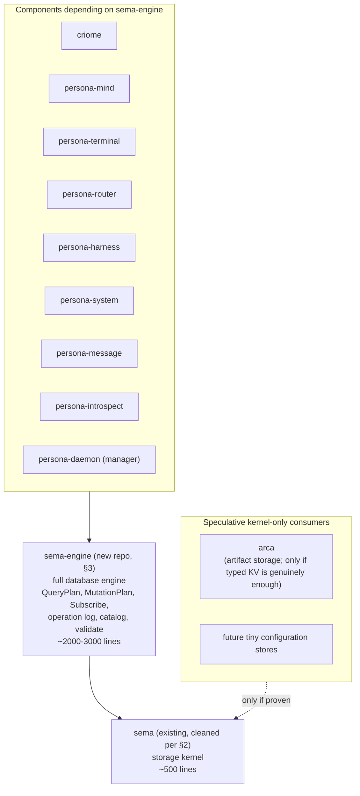

# 158 — Two interfaces: `sema` (kernel) + `sema-engine` (full engine)

*Designer design report, 2026-05-14. Refines
`reports/designer/157-sema-db-full-engine-direction.md` by
splitting the engine into two micro-components per the workspace's
"every functional capability lives in its own independent
repository" rule. Records the user-articulated architecture
2026-05-14: keep today's `sema` interface (the storage kernel) and
create a new `sema-engine` repository for the full database-engine
implementation that hosts the Signal verbs. Operationalizes
`~/primary/ESSENCE.md`'s new principle "Backward compatibility is
not a constraint" by recommending what to break in today's `sema`
(the criome-specific carryovers) without transitional shape.*

Builds on `reports/designer/157-sema-db-full-engine-direction.md`
(WHAT the engine becomes). This report specifies WHERE it lives
and what changes in today's sema. /157 stands; the §4-§6 packages
there now land in the new `sema-engine` repo per §3 below, not in
`sema`.

**Retires when:** `sema-engine` repo exists with the §3 surface;
`sema` is cleaned per §2; per-repo `ARCHITECTURE.md` of both
repos absorbs the boundary in §4; this report deletes; the
witnesses in §7 carry the constraints forward.

---

## 0 · TL;DR

Two micro-components in two repositories:

- **`sema`** (existing repo): typed storage kernel.
  `Sema::open_with_schema`, `Table<K, V>`, closure-scoped `read|write`
  transactions, rkyv encode/decode at the table boundary, schema
  and database-header guards. After §2's cleanup: ~500 lines.
  Speculative kernel-only consumers (arca-if-simple, future
  tiny config stores) may depend on `sema` directly; the split
  is justified by capability cleanliness regardless of whether
  any non-engine consumer materialises (per §1.2).
- **`sema-engine`** (new repo): full database engine carrying
  the engine surface from `/157 §4` (QueryPlan, MutationPlan,
  Subscribe, table/index registration, operation log, validate
  — what `/157` calls the engine surface; the four affordances
  from the retired `/155` pattern-library design become
  *internal* building materials of this engine, not the public
  API). `Engine::open`, `register_table`, `register_index`,
  `match_query`, `assert`, `mutate`, `retract`, `atomic`,
  `subscribe`, `validate`, `list_tables`,
  `operation_log_range`, plus typed `QueryPlan<R>` /
  `MutationPlan<R>` / `OperationLogEntry` /
  `SubscriptionSink<R>`. ~2000-3000 lines initially (within
  the single-context micro-component budget per
  `~/primary/skills/micro-components.md`).

`sema-engine` depends on `sema` for the storage primitives.
`sema` does not know `sema-engine` exists. Cross-repo
dependency happens via published version pin, never via
`path = "../sibling"` (per `~/primary/ESSENCE.md`
§"Micro-components").



This refinement is enabled by — and exemplifies — the new ESSENCE
principle (added in this same session per the user's directive
2026-05-14): **backward compatibility is not a constraint.**
Today's `sema` carries criome-specific code (`Slot` newtype +
legacy slot store + `reader_count`) that was explicitly marked
"deprecated location" in source comments. Under the new rule,
those move out cleanly without transitional shims; criome
absorbs its own concerns; `sema` shrinks to a pure kernel.

The full /157 design lands unchanged in WHAT it specifies; only
the WHERE moves.

---

## 1 · Why two interfaces

Three reasons converge.

### 1.1 · Micro-component rule

Per `~/primary/ESSENCE.md` §"Micro-components":

> "Every functional capability lives in its own independent
> repository with its own build descriptor and its own test
> suite ... **Adding a feature defaults to a new crate, not
> editing an existing one.** The burden of proof is on the
> contributor (human or agent) who wants to grow a crate. They
> must justify why the new behavior is part of the *same
> capability* — not a new one."

The engine is a different capability from storage. Storage
provides typed bytes with transaction semantics. The engine
provides typed verb execution: query plans, atomic mutations,
subscriptions, operation log, schema catalog. These are
distinct capabilities, even if the engine builds on storage.

The default answer per the rule is "new crate, new repo." The
burden of proof for keeping them in one crate would be a
demonstration that they are the *same* capability. They aren't.

### 1.2 · Capability cleanliness

Storage and database-operation execution are different
capabilities even if every current consumer uses both. A
storage kernel hides redb + rkyv behind typed transactions and
schemas. A database-operation engine executes typed verbs
(Assert, Mutate, Retract, Match, Subscribe, ...) against
registered record families. These have different vocabularies,
different invariants, different tests, different consumers in
principle.

Per ESSENCE §"Micro-components": *new capability defaults to
new crate; the burden of proof is on the contributor who wants
to grow a crate.* Storage and engine are distinct capabilities;
forcing them into one crate would require the proof that they
are the *same* capability. They aren't.

Speculative kernel-only consumers (arca-if-simple, future tiny
configuration stores) may or may not materialise. The split
does not depend on them. If every state-bearing component ends
up depending on `sema-engine`, the split is still right — the
boundary between storage primitives and engine execution stays
clean, tests stay focused, and the engine's evolution doesn't
ripple into the kernel.

Most current state-bearing components — criome included, per
the user's correction 2026-05-14 — are engine consumers.
Criome's records get verb execution (Assert/Match/Mutate/
Retract, eventually Subscribe); criome depends on
`sema-engine`. See §5.

### 1.3 · Clean break enabled by the new ESSENCE rule

Per `~/primary/ESSENCE.md` §"Backward compatibility is not a
constraint" (added this session):

> "Break the system if it makes it more beautiful. That is the
> motto."
>
> "A *transitional shape* compromises both the old and the new
> to avoid breaking either. It is the wrong shape for both, and
> the wrong shape, period."

Today's `sema` carries criome-specific code marked "deprecated
location" in its own source comments (`sema/src/lib.rs:519-520`
and lines 716-736). Under prior framing those would have
required transitional shims to migrate criome carefully. Under
the new rule, those move out cleanly; criome absorbs its own
slot-store implementation; `sema` shrinks to its right shape.

The split is the right shape *now*, not something to phase in.

---

## 2 · What `sema` becomes (post-cleanup storage kernel)

Today's `sema` (`/git/github.com/LiGoldragon/sema/src/lib.rs`,
737 lines) is mostly the right shape with two known
criome-specific carryovers.

### 2.1 · What stays — the storage kernel

| Surface | Lines | Why it stays |
|---|---|---|
| `Sema` struct + `open_with_schema(path, schema)` | ~140 | Lifecycle + schema guards. **Schema-less `Sema::open(path)` is deleted alongside the legacy slot store.** `open_with_schema` remains the public durable-state path because the name preserves the invariant: durable component state opens through explicit schema discipline. If a header-only kernel open is ever needed, it gets a specific name and a witness proving component durable state cannot use it accidentally. |
| `Sema::read(\|txn\| ...)` / `write(\|txn\| ...)` | ~25 | Closure-scoped transactions — the discipline every higher layer depends on |
| `Table<K, V>` + `OwnedTableKey` trait + impls | ~250 | The typed table abstraction |
| `Table::get` / `insert` / `remove` / `iter` / `range` / `ensure` | (in above) | The primitive read/write surface |
| `DatabaseHeader` + `RkyvEndian` + `RkyvPointerWidth` | ~55 | rkyv format guard |
| `Schema` + `SchemaVersion` | ~50 | Schema version negotiation |
| `Error` enum (minus slot-specific variants) | ~50 | Typed errors per crate |

Total kept: ~570 lines. Some trim possible (deduplicate, tighten
docs) → realistic target ~500 lines.

### 2.2 · What gets deleted from sema

Three pieces leave `sema`. None of them re-emerges as a "moved"
implementation in another crate — they retire. Criome migrates
to `sema-engine` for typed verb execution and so does not need
sema's old append-only-bytes path at all.

**`Slot(u64)` newtype** (`sema/src/lib.rs:50-72`). The slot
identity for criome's legacy append-only records. **Deleted
from sema.** Criome's new path (`sema-engine`) mints typed
record identity through `Engine::assert`'s return value;
criome's domain may keep a typed identity newtype of its own
(`criome::NodeSlot` / `criome::EdgeSlot` if needed), but that's
criome's domain choice, not a relocation of sema's `Slot`.

**Legacy slot store** (`sema/src/lib.rs:662-709`).
`Sema::store(&[u8]) -> Slot`, `Sema::get(Slot) -> Option<Vec<u8>>`,
`Sema::iter() -> Vec<(Slot, Vec<u8>)>`. **Deleted from sema.**
The raw-bytes-at-u64 path was always the wrong shape — its own
doc comment (line 17-20) calls it the "legacy slot store" and
warns "do not use for new typed component state." Criome moves
to typed `Engine::assert(table, value)`; the byte-at-slot
abstraction is not preserved anywhere.

**Reader-count config** (`sema/src/lib.rs:511-519,716-736`).
`DEFAULT_READER_COUNT`, `Sema::reader_count`,
`Sema::set_reader_count`. **Deleted from sema.** Criome's
actor-pool configuration is criome's concern; criome's daemon
gains its own typed config record for the read-pool size,
without sema being a partial home for it. Per source comments
at line 519-520, this was always marked deprecated location.

Plus the matching error variant `Error::MissingSlotCounter`
(line 130) and the internal `RECORDS` / `NEXT_SLOT_KEY` /
`READER_COUNT_KEY` table constants (lines 502-507) — also
deleted.

Total removed: ~150 lines. `sema` shrinks from 737 → ~500-590
lines.

### 2.3 · What happens in criome

Criome depends on `sema-engine`, not on `sema` directly. The
migration story:

- Criome's records (Node, Edge, Graph, etc.) become typed
  `Record` implementations under sema-engine's `register_table`.
- Criome's old "store bytes at allocated slot" pattern retires:
  validated records flow through `Engine::assert`, which mints
  typed identity, persists the typed value, and updates indexes
  atomically.
- Criome's actor-pool configuration (formerly
  `Sema::reader_count`) becomes a criome-domain typed config
  record. Its persistence path goes through `sema-engine`'s
  catalog like any other criome record.
- Per ESSENCE §"Backward compatibility is not a constraint":
  the old raw-bytes path is **not** preserved as an escape
  hatch. Criome does not retain a `path = "..."` shim to raw
  `redb` for performance. If raw byte access ever becomes a
  proven requirement, it earns its own design report and
  witnesses (per DA `/46 §1`); it does not appear as a casual
  carve-out in this migration.

### 2.4 · The cleanup is the right shape *now*

Per ESSENCE §"Backward compatibility is not a constraint": no
transitional shim versions of `Sema::store`/`get`/`iter` that
re-export from a new crate. They disappear from `sema`. Their
callers (currently in criome) migrate to typed
`Engine::assert` / `match_query`. Old `sema` releases are
preserved at their git revisions; new releases ship the cleaned
kernel.

---

## 3 · What `sema-engine` is

A new repository: `/git/github.com/LiGoldragon/sema-engine`.
Carries the engine surface specified in `/157 §4`: typed table/index
registration, query plans, mutation plans, subscriptions, operation
logs, validation, and the verb execution layer. The older four
affordances named in `/155` are internal construction material, not the
public API boundary.

### 3.1 · The surface

The `Engine` struct is the entrypoint:

```rust
pub struct Engine {
    sema: sema::Sema,
    catalog: Catalog,
    subscriptions: Subscriptions,
}

impl Engine {
    pub fn open(path: &Path, schema: &EngineSchema) -> Result<Self>;

    pub fn register_table<R: Record>(&mut self, descriptor: TableDescriptor<R>) -> Result<TableRef<R>>;
    pub fn register_index<R: Record + Indexable>(&mut self, table: &TableRef<R>, descriptor: IndexDescriptor<R>) -> Result<IndexRef<R>>;

    pub fn match_query<R: Record>(&self, plan: &QueryPlan<R>) -> Result<Vec<R>>;
    pub fn aggregate<R: Record, A>(&self, plan: &AggregatePlan<R, A>) -> Result<A>;
    pub fn constrain<R1, R2>(&self, plan: &ConstrainPlan<R1, R2>) -> Result<Vec<(R1, R2)>>;

    pub fn assert<R: Record>(&self, table: TableRef<R>, value: R) -> Result<R::Key>;
    pub fn mutate<R: Record>(&self, table: TableRef<R>, key: R::Key, value: R) -> Result<()>;
    pub fn retract<R: Record>(&self, table: TableRef<R>, key: R::Key) -> Result<bool>;
    pub fn atomic<T>(&self, body: impl FnOnce(&AtomicScope) -> Result<T>) -> Result<T>;

    pub fn subscribe<R: Record>(&self, plan: QueryPlan<R>, sink: Arc<dyn SubscriptionSink<R>>) -> Result<SubscriptionHandle>;

    pub fn validate<T>(&self, body: impl FnOnce(&ValidateScope) -> Result<T>) -> Result<ValidationResult<T>>;

    pub fn list_tables(&self) -> Result<Vec<TableDescriptorAny>>;
    pub fn operation_log_range(&self, range: SequenceRange) -> Result<Vec<OperationLogEntry>>;
}
```

Plus the data types (each in its own module inside `sema-engine`):

- **`record.rs`** — `Record` trait, `TableRef<R>`, `IndexRef<R>`,
  `TableDescriptor<R>`, `IndexDescriptor<R>`.
- **`query.rs`** — `QueryPlan<R>` (closed enum: AllRows, ByKey,
  ByKeyRange, ByIndex, Filter, Project, Limit, Order),
  `Predicate<R>`, `FieldSelection<R>`, `OrderBy<R>`,
  `AggregatePlan<R, A>`, `ConstrainPlan<R1, R2>`.
- **`mutation.rs`** — `MutationPlan<R>`, `AtomicScope`,
  `ValidateScope`.
- **`subscribe.rs`** — `SubscriptionSink<R>` trait,
  `SubscriptionEvent<R>`, `DeltaKind`, `SubscriptionHandle`.
- **`log.rs`** — `OperationLogEntry`, `SnapshotId`,
  `SequenceRange`, `TableId`, `Origin`, `OperationResult`.
- **`engine.rs`** — `Engine` struct + impl.
- **`catalog.rs`** — internal: persisted table+index+subscription
  catalog.
- **`error.rs`** — `Error` enum (typed, per crate).

Roughly ~2000-3000 lines initially. Splits cleanly into the
modules above (each fits one context for focused work). Within
`~/primary/skills/micro-components.md`'s "≈3k-10k lines" budget
for a single repo.

### 3.2 · Dependencies

`sema-engine/Cargo.toml`:

```toml
[dependencies]
sema = { git = "https://github.com/LiGoldragon/sema.git", rev = "<commit-sha>" }
signal-core = { git = "https://github.com/LiGoldragon/signal-core.git", rev = "<commit-sha>" }
rkyv = "0.8"
thiserror = "..."
```

Two discipline rules:

- **Never `path = "../sema"`.** Per `~/primary/ESSENCE.md`
  §"Micro-components" — "Never cross-crate `path = "../sibling"`
  in a manifest — that assumes a layout a fresh clone won't
  reproduce."
- **Pin by commit revision, not by tag.** Per DA `/46 §3`: a
  tag is a release label, not the immutable build identity.
  Tags can be moved unless the hosting policy explicitly
  forbids it; `https://` URLs are more portable in Nix and CI
  contexts than `ssh://`. `Cargo.lock` records the resolved
  revision and is what the build actually depends on; the
  manifest names the revision explicitly so the spec and the
  lock agree without a tag-to-revision indirection.

The version pin is the bridge. Each `sema-engine` release pins
a specific `sema` revision. Bumping `sema` requires a
coordinated release (new `sema` commit + new `sema-engine`
revision pin + new release tags on both for traceability).

### 3.3 · What `sema-engine` does NOT depend on

- **No actor framework.** No Kameo, no tokio (except as transient
  through other deps). The engine is synchronous; consumer
  actors drive it. `SubscriptionSink<R>` is the boundary to
  consumer-side async.
- **No `signal-<consumer>` payload crates.** The engine receives
  typed plans, not Signal frames. The compilation from
  `signal-<consumer>::Request` to `Engine::match_query(&plan)`
  happens in the consumer daemon, per `/157 §9 Q2`.
- **No NOTA codec.** Nexus parsing/rendering lives at the
  edge (consumer daemons + CLIs). The engine speaks typed
  Rust, not text.
- **No Persona-specific anything.** The engine is workspace-wide
  infrastructure; Persona is one consumer.

### 3.4 · `sema-engine` is a library, NOT a daemon

`sema-engine` ships as a Rust library only. There is **no**
`sema-engine-daemon`. Each consumer's daemon (persona-mind-daemon,
persona-terminal-daemon, etc.) holds its own `Engine` handle
against its own redb file, owns its own actor mailbox, and runs
verb execution inside its own process.

Per DA `/45 §3` ("Important: `sema-engine` should start as a
Rust library, not a `sema-engine-daemon`"): a central engine
daemon would blur state ownership across components and recreate
the "shared Persona database" antipattern. Each component
remains the durable-state owner for its own concerns; the
engine is the *machinery* each component uses inside its own
boundary.

**No separate `sema-engine` protocol crate in v1.** The plan
IR is an implementation API inside `sema-engine`. Split a
protocol crate only when (a) a second engine implementation
appears, or (b) plans must cross a process boundary. `signal-core`
already owns the universal verb words (`SemaVerb` + `Request {
verb, payload }`); a parallel `signal-sema-engine` or
`sema-engine-contract` crate before either condition holds
would be ceremony, not a useful boundary. Per DA `/45 §3` +
DA `/46 §4` and `~/primary/skills/contract-repo.md`
§"Kernel extraction trigger" — wait for the second
implementation or the cross-process need.

### 3.5 · Subscription delivery contract

The `Subscribe` verb is the riskiest piece of the engine
because naive implementations couple write-path latency to
sink health. The contract below pins the prototype rule;
implementations land against it.

**Commit-then-emit ordering.**

1. `Engine` opens the write transaction, applies the mutation
   plan, appends the operation-log entry, and commits.
2. Only **after** the commit returns successfully does
   `Engine` evaluate which registered subscriptions' plans
   match the just-committed records.
3. For each matching subscription, `Engine` enqueues a typed
   `SubscriptionEvent::Delta` for delivery through the
   `SubscriptionSink<R>`.

A subscriber that registers at snapshot `Sn` and disconnects
during snapshot `Sn+k` cannot delay snapshot `Sn+k`'s commit by
any amount — its delivery is downstream of the commit.

**`SubscriptionSink<R>::deliver` is enqueue-only.**

The trait method must not block on network IO, an actor
mailbox at capacity, terminal IO, or any disk operation that
could fail or stall. Conforming sinks push the event into a
bounded in-memory queue (or equivalent) and return
synchronously. The consumer daemon's actor drains the queue at
its own rate.

The engine treats any sink that violates this rule as a
correctness bug, not a performance issue. A blocking sink can
freeze every consumer of the same engine instance.

**Sink failure is typed; it never rolls back the commit.**

If `deliver` returns a typed `SinkError`, `Engine` logs the
error (via the consumer-installed logger), increments a typed
counter on the subscription record, and continues with the
next subscription. The write transaction is already committed
and cannot be retroactively un-applied.

If a subscriber needs at-least-once delivery across process
restart, the consumer wires its sink to a durable outbox; the
engine does **not** mandate durable delivery in v1. The
prototype rule is "best-effort live notification, plus durable
operation log for catch-up by sequence id" — consumers that
miss a delta can replay from `Engine::operation_log_range`
using the last seen `SnapshotId`.

**Backpressure and reconnect are consumer-daemon concerns.**

The engine does not throttle writes when subscribers fall
behind. If a subscriber's bounded queue is full, the sink
returns `SinkError::QueueFull` (or equivalent); the consumer
daemon decides whether to drop, batch, summarise, or pause
its own actor that drains the queue. Rebinding a sink after a
subscriber reconnects is also the consumer daemon's
responsibility — the subscription record persists across
restart so the engine can resume delivery once the consumer
provides a fresh sink.

Per DA `/46 §2`: this contract is what makes the `Subscribe`
verb implementation-ready. Without it, Package 4 in §6.1 is
under-specified.

---

## 4 · The boundary

| Concern | Owner |
|---|---|
| redb file lifecycle (open, create, parent mkdir) | `sema` |
| Closure-scoped read/write transactions (`Sema::read`, `Sema::write`) | `sema` |
| Typed `Table<K, V>` with rkyv encode/decode at boundary | `sema` |
| `OwnedTableKey` trait for owned-key iteration | `sema` |
| `Table::get` / `insert` / `remove` / `iter` / `range` / `ensure` primitives | `sema` |
| `DatabaseHeader` + `Schema` + `SchemaVersion` guards | `sema` |
| Typed `Error` (storage errors per crate) | `sema` |
| `Engine` struct (the verb-execution entrypoint) | `sema-engine` |
| `Record` trait + `TableRef<R>` + `IndexRef<R>` | `sema-engine` |
| `TableDescriptor<R>` / `IndexDescriptor<R>` + registration | `sema-engine` |
| Catalog (persisted table + index + subscription metadata) | `sema-engine` |
| `QueryPlan<R>` closed-enum read IR + executor | `sema-engine` |
| `MutationPlan<R>` closed-enum write IR + executor | `sema-engine` |
| `AtomicScope` (closure-scoped multi-op transactions) | `sema-engine` |
| `Subscribe` primitive (register + persist + initial-snapshot + commit-then-emit) | `sema-engine` |
| `OperationLogEntry` + commit-sequence durability | `sema-engine` |
| `SnapshotId` as value-typed cursor on every reply | `sema-engine` |
| `ValidateScope` (dry-run wrapper) | `sema-engine` |
| `list_tables()` / `list_indexes()` schema introspection | `sema-engine` |
| Compilation of `signal-<consumer>::Request` → `QueryPlan` / `MutationPlan` | Consumer daemon (per `/157 §9 Q2`) |
| Auth, payload validation, mailbox order, push-destination wiring | Consumer daemon |
| Content semantics (what each record means) | Consumer's domain code |

The `sema` ↔ `sema-engine` boundary: every `sema-engine` operation
ultimately invokes one or more `sema::Table` calls inside a
`sema::Sema::read|write` closure. `sema` doesn't know plans
exist; it sees typed table CRUD.

The `sema-engine` ↔ consumer-daemon boundary: every consumer
verb (per `/157 §6`) corresponds to one `Engine::*` call. The
daemon translates the wire payload to a plan and back.

---

## 5 · Component dependency landscape

| Component | Depends on | Reason |
|---|---|---|
| `criome` (sema-ecosystem records validator) | `sema-engine` | Records (Node, Edge, Graph) need typed verb execution: Assert (validated submission), Match (lookup), Mutate (state transition), Retract (removal), eventually Subscribe (change feed). Per the user's correction 2026-05-14, criome is an engine consumer, not a kernel-only consumer. |
| `arca` (artifact storage, if/when it lands) | `sema` (possibly) | Maps content hashes to bytes. If arca's surface is genuinely just `lookup hash → bytes` with no verb semantics, kernel suffices. If arca grows Subscribe ("notify on new artifact"), it joins the engine consumers. Treat as speculative until arca ships. |
| Future tiny config stores | `sema` (possibly) | A single typed config table accessed by a known key may not earn the engine surface. Treat as speculative; if any such consumer materialises, evaluate at that point. |
| `persona-mind` | `sema-engine` | Verb execution (Match for graph queries, Assert for thoughts/relations, Subscribe for graph subscriptions). |
| `persona-terminal` | `sema-engine` | Per `/41 §1.2`: time-indexed observations need Assert+Match+atomic dual-write + (eventually) Subscribe. |
| `persona-router` | `sema-engine` | Channel state + delivery decisions + route observations + Subscribe for live introspection. |
| `persona-harness` | `sema-engine` | Transcript events + lifecycle observations + Subscribe. |
| `persona-system` | `sema-engine` | Focus observations + Subscribe. |
| `persona-message` | `sema-engine` | Message submission (Assert) + InboxQuery (Match). |
| `persona-introspect` | `sema-engine` | Owns its own introspection database through `sema-engine` for observation state, indexes, catalogs, and audit/projection cache. Peer inspection still crosses daemon sockets and component contracts; `persona-introspect` does not open peer databases. |
| `persona-daemon` (manager) | `sema-engine` | Engine status (Match) + component lifecycle (Mutate). |

**`sema-engine` becomes the canonical database-operation layer**
for state-bearing components, backed by `sema` as the storage
layer (per DA `/46 §5` wording correction). The kernel
consumer base is speculative; the split's justification is
capability cleanliness (§1.2), not consumer count.

---

## 6 · Migration

The migration is reorganization, not feature work. No
transitional shapes per ESSENCE §"Backward compatibility is not
a constraint" — each step lands cleanly and the next step starts
from the new shape.

### 6.1 · Sequence

1. **`sema` cleanup.** Delete `Slot` + legacy slot store +
   `reader_count` from `sema`. Release new `sema` revision
   with the cleaned surface (~500 lines). This is independent
   of criome's migration — sema can release as soon as the
   deletion is done; criome catches up against `sema-engine`.

2. **`sema-engine` repo created.** Empty repository + initial
   skeleton (`record.rs`, `query.rs`, `mutation.rs`,
   `subscribe.rs`, `log.rs`, `engine.rs`, `catalog.rs`,
   `error.rs`) per §3.1. Per ESSENCE §"Skeleton-as-design": type
   definitions, trait signatures, `todo!()` bodies, plus the
   witness tests from §7. Operator implements the bodies.

3. **Package order** (per `/157 §6`, restated against two-repo
   split):
   - Package 1: verb-mapping witnesses per `signal-persona-*`
     contract — lands in each contract crate. Independent of
     either sema or sema-engine.
   - Package 1.5: rebase older `signal` crate + Nexus parser onto
     signal-core verb spine. Independent of sema/sema-engine.
   - Package 2: `Record` trait + `register_table` /
     `register_index` API + operation log + catalog. Lands in
     `sema-engine`.
   - Package 3: `QueryPlan` / `MutationPlan` IR + execution.
     Lands in `sema-engine`.
   - Package 4: `Subscribe` primitive per the delivery
     contract in §3.5. Lands in `sema-engine`.
     **Operator track `primary-hj4.1.1` is reframed as Package 4**
     (user-decided 2026-05-14). The commit-then-emit machinery
     lands once in sema-engine; persona-mind becomes the first
     `Subscribe` consumer, providing a `SubscriptionSink<R>`
     rather than the dispatch logic. No mind-local subscription
     dispatch ships and later retires.
   - Package 5: `Validate` dry-run + `list_tables` introspection
     + snapshot identity. Lands in `sema-engine`.

4. **Component migrations.** Each state-bearing component
   migrates from current sema use (where it exists) to
   `sema-engine` typed verbs. Per ESSENCE rule: migrate in one
   step per component; no half-migrated states.

   Migration ordering (user-decided 2026-05-14):
   - **persona-mind and criome migrate in parallel as the
     first consumers.** Both exercise the engine API
     simultaneously: persona-mind brings graph Assert/Match
     + Subscribe pressure (its hand-rolled facsimile is the
     most complete in the current stack); criome brings
     Mutate (identity transitions), Retract (revocation),
     and Atomic (revocation+identity-status together) — verbs
     persona-mind doesn't exercise. The parallel pressure
     surfaces engine API gaps across the verb spine faster
     than a sequential migration would. Coordination cost is
     accepted as the price of broader surface validation.
   - **persona-introspect** lands once the engine surface
     exists: its local state uses `sema-engine`; peer state
     remains behind peer daemon sockets and contracts.
   - **Then the remaining persona-* components** (terminal,
     router, harness, system, message, manager) — each lands
     as the engine surface stabilises through the first
     consumers.

### 6.2 · No transitional shape

Specifically rejected migration patterns:

- **No re-export shim in `sema`** for the moved criome pieces
  (`Slot`, `Sema::store`, etc.). Once they move, they're gone
  from `sema`. Criome's import paths change.
- **No "sema-db with both kernel and engine" intermediate
  crate.** The split is two repos from the start.
- **No "sema-engine reuses sema's `Sema` struct directly"
  shortcut.** `sema-engine::Engine` wraps `sema::Sema` (composition,
  not inheritance); the two structs are different concerns.
- **No `path = "../sema"` while the version is being stabilized.**
  Even pre-release `sema-engine` depends on `sema` through HTTPS git
  with an explicit revision recorded in `Cargo.lock`. Tags are release
  trace, not the precision mechanism for local development.

The migration is bounded: roughly four coordinated repo bumps
(`sema` cleanup, `sema-engine` creation, then per-consumer
migrations). No phased "carrying both shapes" period.

### 6.3 · Production preservation

Per ESSENCE §"Backward compatibility is not a constraint":

> "When something must keep running while a redesign lands, the
> running copy stays at a pinned branch or a separate repo."

Today the Persona engine is not in production (per the user's
2026-05-14 note). Criome's deployments (if any) pin specific
`sema` git tags, so they remain on the pre-cleanup `sema` until
they migrate. New work targets the cleaned `sema` + `sema-engine`
from the start. No deployment is broken by this reorganization.

---

## 7 · Witnesses

### 7.1 · Cross-repo dependency witnesses

- `sema_does_not_depend_on_sema_engine` — source-scan of
  `sema/Cargo.toml`: no `sema-engine` dependency. The kernel is
  oblivious to the engine.
- `sema_does_not_depend_on_signal_core` — source-scan of
  `sema/Cargo.toml`: no `signal-core` dependency. The kernel does
  not know about `SemaVerb`, patterns, or any wire vocabulary
  (per DA `/45 §2.2`).
- `sema_does_not_depend_on_persona` — source-scan: no
  `signal-persona*` dependency. The kernel is workspace-wide
  infrastructure, not Persona-coupled.
- `sema_engine_depends_on_sema_via_revision_pin` — source-scan
  of `sema-engine/Cargo.toml`: `sema = { git = "https://...",
  rev = "<commit-sha>" }` with an explicit revision (not a
  tag), never `path = "../sema"`. Per DA `/46 §3`: tags are
  release labels, not immutable build identity; `Cargo.lock`
  records the resolved revision.
- `sema_engine_cargo_lock_pins_sema_revision` — the committed
  `Cargo.lock` includes the resolved revision for `sema` and
  the resolved revision for `signal-core`. Build proof is the
  lock, not the manifest tag.
- `sema_engine_uses_https_git_not_ssh` — source-scan: git
  dependency URLs are `https://`, not `ssh://`. HTTPS is more
  portable across Nix/CI contexts.
- `sema_engine_depends_on_signal_core` — `sema-engine` does
  consume the verb spine from `signal-core`; that's the
  legitimate dependency direction (signal-core ← sema-engine).
- `sema_engine_does_not_path_dep_on_signal_consumer` —
  source-scan: `sema-engine` doesn't depend on any
  `signal-persona-*` crate. The engine receives typed plans, not
  Signal frames; the wire layer compiles plans, not the engine.
- `sema_engine_ships_no_daemon_binary` — source-scan of
  `sema-engine/Cargo.toml`: no `[[bin]]` entry named
  `sema-engine-daemon` (or any daemon-shaped binary). The crate
  is library-only per §3.4.

### 7.2 · `sema` cleanup witnesses

Structural witnesses (load-bearing — these define the cleaned
kernel boundary):

- `sema_does_not_export_slot` — source-scan: `pub use Slot` or
  `pub struct Slot` does not appear in `sema/src/lib.rs`.
- `sema_does_not_export_legacy_slot_store` — source-scan:
  `Sema::store`, `Sema::get(Slot)`, `Sema::iter()` (legacy
  slot-store accessors) do not appear in `sema/src/lib.rs`.
- `sema_does_not_export_reader_count` — source-scan:
  `Sema::reader_count`, `Sema::set_reader_count`,
  `DEFAULT_READER_COUNT` do not appear in `sema/src/lib.rs`.
- `sema_kernel_fits_one_context_review` — the `sema` source
  reviews as one capability in one context window per
  `~/primary/skills/micro-components.md`. This is a structural
  check, not a line count.

Advisory witness (per DA `/46 §6`: line-count is gameable —
keep advisory):

- `sema_kernel_size_advisory_under_600_lines` — `sema/src/lib.rs`
  is around ≤ 600 lines after the cleanup, down from 737.
  Realistic target ~500. If exceeded by a small margin while
  the structural witnesses hold, that's fine; if exceeded
  substantially, audit whether engine concepts have leaked in.

### 7.3 · `sema-engine` shape witnesses

- `sema_engine_engine_struct_wraps_sema` — source-scan: the
  `Engine` struct holds a `sema::Sema` as composition, not
  inheritance.
- `sema_engine_register_table_persists_descriptor_via_sema_table` —
  integration: register a table; close `sema-engine`; reopen;
  `list_tables()` returns the descriptor. The persistence path
  goes through `sema::Table`.
- `engine_atomic_uses_sema_write_closure` — source-scan:
  `Engine::atomic` invokes `sema::Sema::write(|txn| ...)`
  internally; the atomic scope cannot leak the redb transaction
  lifetime past the closure.

### 7.4 · Subscription delivery contract witnesses (per §3.5)

- `subscribe_initial_snapshot_uses_post_commit_read_txn` —
  registers two rows; subscribes; asserts the sink receives
  `SubscriptionEvent::InitialSnapshot` with both rows AND the
  snapshot id matches the most-recent commit at subscription
  time.
- `subscribe_delta_fires_after_commit_returns` — subscribes;
  asserts a row in a separate write; instrument the engine
  to verify the sink's `deliver` is called *after*
  `Sema::write` returns Ok, not inside the closure.
- `subscribe_sink_failure_does_not_roll_back_commit` —
  subscribes with a sink whose `deliver` returns
  `SinkError::QueueFull`; asserts a row; assert the row is
  durably committed (visible after process restart) despite
  the sink failure.
- `subscribe_blocking_sink_does_not_freeze_writes` —
  subscribes with two sinks: one slow (sleeps 5s in
  `deliver`), one fast. Asserts a row. Assert the second
  (fast) sink receives its delta within bounded time AND
  the next write transaction commits within bounded time.
  If this fails the engine has violated the enqueue-only
  rule.
- `subscribe_survives_process_restart` — subscribes; close
  engine; reopen; the persisted subscription record is
  available for re-binding through a fresh sink.

### 7.5 · Per-component migration witnesses

- `persona_mind_depends_on_sema_engine_not_sema` —
  source-scan: `persona-mind/Cargo.toml` has `sema-engine`,
  not `sema` (after migration).
- `persona_mind_uses_engine_assert_not_table_insert` —
  source-scan: persona-mind's write paths call
  `engine.assert(...)` / `engine.mutate(...)` rather than
  `THOUGHTS.insert(...)` style.
- `criome_depends_on_sema_engine` — source-scan of
  `criome/Cargo.toml`: depends on `sema-engine`, not on
  `sema` directly. (Per user correction 2026-05-14: criome
  is an engine consumer.)
- `criome_uses_engine_assert_for_validated_records` —
  source-scan: criome's validator path calls
  `engine.assert(criome_table, validated_record)` rather
  than raw `Sema::store(bytes)`.
- `criome_does_not_use_raw_redb` — source-scan: `criome/src`
  imports no `redb::` types directly. Storage flows through
  `sema-engine` → `sema` → redb; no escape hatch (per DA
  `/46 §1`).

---

## 8 · Closed and open questions

### Q1 — Slot and legacy slot store disposition is closed

The `Slot(u64)` newtype + legacy slot store are deleted from `sema`
and are not moved to Criome or to a new `sema-slots` crate. Current
Criome no longer uses that legacy byte-slot surface, so preserving it
would be compatibility tribute to dead architecture.

If an append-only sequence allocator or slot-shaped table becomes a
real requirement later, it should land as a typed `sema-engine`
primitive with its own records and witnesses, not as resurrected raw
slot storage.

### Q2 — `sema-db` rename: does it still happen?

**Background.** `primary-ddx` tracked renaming `sema` → `sema-db`
to distinguish today's storage kernel from eventual `Sema` (the
universal medium for meaning, per ESSENCE §"Today and
eventually"). Under the two-interface split, the question
becomes: rename `sema` → `sema-db`, or leave it as `sema`?

**Options.**

(a) **Rename `sema` → `sema-db`.** Today's kernel becomes
`sema-db`. The new engine is `sema-db-engine`. Clear; everything
under the "today" framing. Cost: every consumer's `Cargo.toml`
updates.

(b) **Keep `sema` as is.** Today's kernel keeps the bare name
`sema`. The new engine is `sema-engine`. Less rename churn;
saves the rename pressure for when eventual `Sema` actually
ships.

**Recommendation.** (b). The user explicitly mentioned "we just
probably keep the same name" for the kernel. Saves cross-repo
churn. The eventual `Sema` rename can happen when eventual
`Sema` lands (years away per ESSENCE).

### Q3 — `persona-mind` migration order is closed

The first real `sema-engine` consumer is `persona-mind`. It pressure
tests Match, Assert, relation validation, and Subscribe against the
graph domain that already exists. Criome follows as an early consumer
for identity, revocation, attestation, audit, lookup, and subscription
state.

Synthetic consumers may exist as witnesses, but they do not replace
the `persona-mind` migration as the first real design proof.

---

## 9 · See also

- `reports/designer/157-sema-db-full-engine-direction.md` — the
  parent design specifying WHAT the engine is. /158 refines
  WHERE it lives (two repos). /157's §4 affordances all land in
  `sema-engine` per §3 of this report; /157's §6 packages still
  apply with the §6.1 sequence adjustment.
- `reports/designer-assistant/43-nexus-query-language-and-sema-engine-arc.md`
  — the recovery of Signal as the database-operation language;
  the basis for the verb spine `sema-engine` executes.
- `reports/designer-assistant/44-signal-sema-full-engine-implementation-gap.md`
  — DA's implementation gap audit. The drifts /44 found
  (`Request::assert` defaulting, older `signal` crate pre-rebase,
  Nexus parser as compatibility adapter) remain blockers for
  `sema-engine` firing against real wire traffic; addressed in
  /157 §6 Packages 1 and 1.5.
- `reports/designer-assistant/45-sema-and-sema-engine-interface-split.md`
  — DA's parallel investigation arriving at the same two-repo
  conclusion. Converges with this report on: kernel + engine
  split, criome-specific cleanup of `sema`, library-only
  `sema-engine`, no engine-protocol crate yet, persona-mind as
  the first engine consumer. /45 also names the principle
  applied to legacy slot store ("Do not preserve it as kernel
  API just because it exists") — same conclusion as §2.4 here.
- `reports/designer-assistant/46-review-designer-158-sema-two-interfaces.md`
  — DA's review of the first /158 draft. Five findings folded
  into this revision: §1 (raw redb escape hatch removed, §2.3),
  §2 (subscription delivery contract specified, §3.5),
  §3 (HTTPS git + revision pinning, §3.2 + §7.1),
  §4 (no engine-protocol crate guard, §3.4),
  §5 ("canonical database-operation layer" wording, §5),
  §6 (line-count witness softened to advisory, §7.2). The
  remaining /46 findings (the "four affordances" cross-reference
  to /157 §4) are corrected in §0 above. After these
  corrections /158 should be implementation-ready per /46's
  acceptance criteria.
- `reports/designer/63-sema-as-workspace-database-library.md`
  (referenced from `sema/ARCHITECTURE.md`) — the original
  design for sema-as-kernel; the source of the "deprecated
  location" comments on the criome-specific pieces.
- `/git/github.com/LiGoldragon/sema/src/lib.rs` — the 737-line
  current file. §2.1 lists what stays (~500-590 lines after
  cleanup); §2.2 names what moves out (~150 lines, criome-
  specific).
- `/git/github.com/LiGoldragon/sema/ARCHITECTURE.md` — updates
  in the cleanup commit to reflect the cleaner kernel surface
  (no Slot, no legacy slot store, no reader_count). The
  "Deprecated" footnotes on those entries delete; the kernel
  description sharpens.
- `~/primary/ESSENCE.md` §"Micro-components" — the rule the
  two-repo split operationalizes ("Every functional capability
  lives in its own independent repository ... Adding a feature
  defaults to a new crate, not editing an existing one").
- `~/primary/ESSENCE.md` §"Backward compatibility is not a
  constraint" — the principle that frees the sema cleanup
  from transitional shape concerns. Added this session; the
  enabling rule for §2.4.
- `~/primary/ESSENCE.md` §"Skeleton-as-design" — the next move
  after this design: compiled skeleton code in the new
  `sema-engine` repo.
- `~/primary/skills/micro-components.md` — the rule applied in
  §1.1.
- `~/primary/skills/contract-repo.md` §"Signal is the database
  language — every request declares a verb" — the verb spine
  `sema-engine` executes. Added this session.
