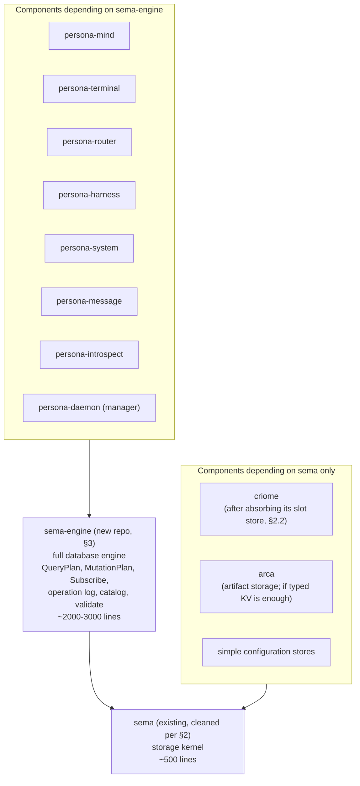

# 158 — Two interfaces: `sema` (kernel) + `sema-engine` (full engine)

*Designer design report, 2026-05-14. Refines
`reports/designer/157-sema-db-full-engine-direction.md` by
splitting the engine into two micro-components per the workspace's
"every functional capability lives in its own independent
repository" rule. Records the user-articulated architecture
2026-05-14: keep today's `sema` interface (the storage kernel) and
create a new `sema-engine` repository for the full database-engine
implementation that hosts the Signal verbs. Operationalizes
`~/primary/ESSENCE.md`'s new principle "Backward compatibility is
not a constraint" by recommending what to break in today's `sema`
(the criome-specific carryovers) without transitional shape.*

Builds on `reports/designer/157-sema-db-full-engine-direction.md`
(WHAT the engine becomes). This report specifies WHERE it lives
and what changes in today's sema. /157 stands; the §4-§6 packages
there now land in the new `sema-engine` repo per §3 below, not in
`sema`.

**Retires when:** `sema-engine` repo exists with the §3 surface;
`sema` is cleaned per §2; per-repo `ARCHITECTURE.md` of both
repos absorbs the boundary in §4; this report deletes; the
witnesses in §7 carry the constraints forward.

---

## 0 · TL;DR

Two micro-components in two repositories:

- **`sema`** (existing repo): typed storage kernel.
  `Sema::open`, `Table<K, V>`, closure-scoped `read|write`
  transactions, rkyv encode/decode at the table boundary, schema
  and database-header guards. After §2's cleanup: ~500 lines.
  Components that only need typed KV storage depend on `sema`
  directly.
- **`sema-engine`** (new repo): full database engine implementing
  the Signal verb spine from `/157 §4`. `Engine::open`,
  `register_table`, `register_index`, `match_query`, `assert`,
  `mutate`, `retract`, `atomic`, `subscribe`, `validate`,
  `list_tables`, `operation_log_range`, plus typed
  `QueryPlan<R>` / `MutationPlan<R>` / `OperationLogEntry` /
  `SubscriptionSink<R>`. ~2000-3000 lines initially (within
  the single-context micro-component budget per
  `~/primary/skills/micro-components.md`).

`sema-engine` depends on `sema` for the storage primitives.
`sema` does not know `sema-engine` exists. Cross-repo
dependency happens via published version pin, never via
`path = "../sibling"` (per `~/primary/ESSENCE.md`
§"Micro-components").



This refinement is enabled by — and exemplifies — the new ESSENCE
principle (added in this same session per the user's directive
2026-05-14): **backward compatibility is not a constraint.**
Today's `sema` carries criome-specific code (`Slot` newtype +
legacy slot store + `reader_count`) that was explicitly marked
"deprecated location" in source comments. Under the new rule,
those move out cleanly without transitional shims; criome
absorbs its own concerns; `sema` shrinks to a pure kernel.

The full /157 design lands unchanged in WHAT it specifies; only
the WHERE moves.

---

## 1 · Why two interfaces

Three reasons converge.

### 1.1 · Micro-component rule

Per `~/primary/ESSENCE.md` §"Micro-components":

> "Every functional capability lives in its own independent
> repository with its own build descriptor and its own test
> suite ... **Adding a feature defaults to a new crate, not
> editing an existing one.** The burden of proof is on the
> contributor (human or agent) who wants to grow a crate. They
> must justify why the new behavior is part of the *same
> capability* — not a new one."

The engine is a different capability from storage. Storage
provides typed bytes with transaction semantics. The engine
provides typed verb execution: query plans, atomic mutations,
subscriptions, operation log, schema catalog. These are
distinct capabilities, even if the engine builds on storage.

The default answer per the rule is "new crate, new repo." The
burden of proof for keeping them in one crate would be a
demonstration that they are the *same* capability. They aren't.

### 1.2 · Not all components need the engine

Some workspace components need typed KV storage and nothing
more — the legacy criome slot path (today an internal sema
utility) is the canonical example. Arca (artifact storage) is
another candidate: an arca that maps content hashes to byte
sequences may not need verb execution. Configuration stores in
future infra components likely don't either.

Forcing every storage consumer to depend on the engine crate
(with its query-plan execution, subscription machinery,
operation log, catalog) is a budget penalty those consumers
don't earn. The micro-component split lets each consumer pick
the layer it needs.

### 1.3 · Clean break enabled by the new ESSENCE rule

Per `~/primary/ESSENCE.md` §"Backward compatibility is not a
constraint" (added this session):

> "Break the system if it makes it more beautiful. That is the
> motto."
>
> "A *transitional shape* compromises both the old and the new
> to avoid breaking either. It is the wrong shape for both, and
> the wrong shape, period."

Today's `sema` carries criome-specific code marked "deprecated
location" in its own source comments (`sema/src/lib.rs:519-520`
and lines 716-736). Under prior framing those would have
required transitional shims to migrate criome carefully. Under
the new rule, those move out cleanly; criome absorbs its own
slot-store implementation; `sema` shrinks to its right shape.

The split is the right shape *now*, not something to phase in.

---

## 2 · What `sema` becomes (post-cleanup storage kernel)

Today's `sema` (`/git/github.com/LiGoldragon/sema/src/lib.rs`,
737 lines) is mostly the right shape with two known
criome-specific carryovers.

### 2.1 · What stays — the storage kernel

| Surface | Lines | Why it stays |
|---|---|---|
| `Sema` struct + `open` / `open_with_schema` | ~140 | Lifecycle, schema guards |
| `Sema::read(\|txn\| ...)` / `write(\|txn\| ...)` | ~25 | Closure-scoped transactions — the discipline every higher layer depends on |
| `Table<K, V>` + `OwnedTableKey` trait + impls | ~250 | The typed table abstraction |
| `Table::get` / `insert` / `remove` / `iter` / `range` / `ensure` | (in above) | The primitive read/write surface |
| `DatabaseHeader` + `RkyvEndian` + `RkyvPointerWidth` | ~55 | rkyv format guard |
| `Schema` + `SchemaVersion` | ~50 | Schema version negotiation |
| `Error` enum (minus slot-specific variants) | ~50 | Typed errors per crate |

Total kept: ~570 lines. Some trim possible (deduplicate, tighten
docs) → realistic target ~500 lines.

### 2.2 · What moves out — criome-specific carryovers

Three pieces. Each was already marked for relocation in source
comments; the new ESSENCE rule says: relocate them.

**`Slot(u64)` newtype** (`sema/src/lib.rs:50-72`). The slot
identity for criome's append-only records. Criome-specific.
Moves to criome. The newtype was originally placed in sema
because the legacy slot store needed it; once the slot store
moves, the newtype follows.

**Legacy slot store** (`sema/src/lib.rs:662-709`).
`Sema::store(&[u8]) -> Slot`, `Sema::get(Slot) -> Option<Vec<u8>>`,
`Sema::iter() -> Vec<(Slot, Vec<u8>)>` — criome's M0 query
substrate. The doc comment at line 17-20 calls it the "legacy
slot store" and explicitly says: "do not use for new typed
component state". Moves to criome.

**Reader-count config** (`sema/src/lib.rs:511-519,716-736`).
`DEFAULT_READER_COUNT`, `Sema::reader_count`,
`Sema::set_reader_count`. Source comments at line 519-520:
"**Deprecated location.** This constant + the
`reader_count`/`set_reader_count` accessors are criome-specific
and should move to criome." Moves to criome.

Plus the matching error variant `Error::MissingSlotCounter`
(line 130) and the internal `RECORDS` / `NEXT_SLOT_KEY` /
`READER_COUNT_KEY` table constants (lines 502-507).

Total removed: ~150 lines. `sema` shrinks from 737 → ~500-590
lines.

### 2.3 · What criome absorbs

Criome gains its own `criome::Slot` newtype, its own slot-store
module, its own `reader_count` config. The implementation
moves into criome's source; criome continues using `sema`'s
typed `Table` API for slot/byte storage (the legacy store can
be reimplemented as a typed table internally, or kept as raw
redb access for performance — criome's call).

This is the cleanest break: criome owns its slot identity and
its reader-pool configuration. `sema` is no longer a partial
home for criome's internals.

### 2.4 · The cleanup is the right shape *now*

Per ESSENCE backward-compat rule: no transitional shim
versions of `Sema::store`/`get`/`iter` that re-export from a
new crate. They disappear from `sema`; they appear in criome.
Criome's existing call sites change. Old `sema` releases are
preserved at their git tags; new releases ship the cleaned
kernel.

---

## 3 · What `sema-engine` is

A new repository: `/git/github.com/LiGoldragon/sema-engine`.
Carries everything specified in `/157 §4` (the four affordances)
plus the verb execution layer.

### 3.1 · The surface

The `Engine` struct is the entrypoint:

```rust
pub struct Engine {
    sema: sema::Sema,
    catalog: Catalog,
    subscriptions: Subscriptions,
}

impl Engine {
    pub fn open(path: &Path, schema: &EngineSchema) -> Result<Self>;

    pub fn register_table<R: Record>(&mut self, descriptor: TableDescriptor<R>) -> Result<TableRef<R>>;
    pub fn register_index<R: Record + Indexable>(&mut self, table: &TableRef<R>, descriptor: IndexDescriptor<R>) -> Result<IndexRef<R>>;

    pub fn match_query<R: Record>(&self, plan: &QueryPlan<R>) -> Result<Vec<R>>;
    pub fn aggregate<R: Record, A>(&self, plan: &AggregatePlan<R, A>) -> Result<A>;
    pub fn constrain<R1, R2>(&self, plan: &ConstrainPlan<R1, R2>) -> Result<Vec<(R1, R2)>>;

    pub fn assert<R: Record>(&self, table: TableRef<R>, value: R) -> Result<R::Key>;
    pub fn mutate<R: Record>(&self, table: TableRef<R>, key: R::Key, value: R) -> Result<()>;
    pub fn retract<R: Record>(&self, table: TableRef<R>, key: R::Key) -> Result<bool>;
    pub fn atomic<T>(&self, body: impl FnOnce(&AtomicScope) -> Result<T>) -> Result<T>;

    pub fn subscribe<R: Record>(&self, plan: QueryPlan<R>, sink: Arc<dyn SubscriptionSink<R>>) -> Result<SubscriptionHandle>;

    pub fn validate<T>(&self, body: impl FnOnce(&ValidateScope) -> Result<T>) -> Result<ValidationResult<T>>;

    pub fn list_tables(&self) -> Result<Vec<TableDescriptorAny>>;
    pub fn operation_log_range(&self, range: SequenceRange) -> Result<Vec<OperationLogEntry>>;
}
```

Plus the data types (each in its own module inside `sema-engine`):

- **`record.rs`** — `Record` trait, `TableRef<R>`, `IndexRef<R>`,
  `TableDescriptor<R>`, `IndexDescriptor<R>`.
- **`query.rs`** — `QueryPlan<R>` (closed enum: AllRows, ByKey,
  ByKeyRange, ByIndex, Filter, Project, Limit, Order),
  `Predicate<R>`, `FieldSelection<R>`, `OrderBy<R>`,
  `AggregatePlan<R, A>`, `ConstrainPlan<R1, R2>`.
- **`mutation.rs`** — `MutationPlan<R>`, `AtomicScope`,
  `ValidateScope`.
- **`subscribe.rs`** — `SubscriptionSink<R>` trait,
  `SubscriptionEvent<R>`, `DeltaKind`, `SubscriptionHandle`.
- **`log.rs`** — `OperationLogEntry`, `SnapshotId`,
  `SequenceRange`, `TableId`, `Origin`, `OperationResult`.
- **`engine.rs`** — `Engine` struct + impl.
- **`catalog.rs`** — internal: persisted table+index+subscription
  catalog.
- **`error.rs`** — `Error` enum (typed, per crate).

Roughly ~2000-3000 lines initially. Splits cleanly into the
modules above (each fits one context for focused work). Within
`~/primary/skills/micro-components.md`'s "≈3k-10k lines" budget
for a single repo.

### 3.2 · Dependencies

`sema-engine/Cargo.toml`:

```toml
[dependencies]
sema = { git = "ssh://git@github.com/LiGoldragon/sema", tag = "..." }
signal-core = { git = "...", tag = "..." }
rkyv = "0.8"
thiserror = "..."
```

Critical: **never `path = "../sema"`.** Per `~/primary/ESSENCE.md`
§"Micro-components" — "Never cross-crate `path = "../sibling"`
in a manifest — that assumes a layout a fresh clone won't
reproduce."

The version pin is the bridge. Each `sema-engine` release pins
a specific `sema` version. Bumping `sema` requires a coordinated
release.

### 3.3 · What `sema-engine` does NOT depend on

- **No actor framework.** No Kameo, no tokio (except as transient
  through other deps). The engine is synchronous; consumer
  actors drive it. `SubscriptionSink<R>` is the boundary to
  consumer-side async.
- **No `signal-<consumer>` payload crates.** The engine receives
  typed plans, not Signal frames. The compilation from
  `signal-<consumer>::Request` to `Engine::match_query(&plan)`
  happens in the consumer daemon, per `/157 §9 Q2`.
- **No NOTA codec.** Nexus parsing/rendering lives at the
  edge (consumer daemons + CLIs). The engine speaks typed
  Rust, not text.
- **No Persona-specific anything.** The engine is workspace-wide
  infrastructure; Persona is one consumer.

### 3.4 · `sema-engine` is a library, NOT a daemon

`sema-engine` ships as a Rust library only. There is **no**
`sema-engine-daemon`. Each consumer's daemon (persona-mind-daemon,
persona-terminal-daemon, etc.) holds its own `Engine` handle
against its own redb file, owns its own actor mailbox, and runs
verb execution inside its own process.

Per DA `/45 §3` ("Important: `sema-engine` should start as a
Rust library, not a `sema-engine-daemon`"): a central engine
daemon would blur state ownership across components and recreate
the "shared Persona database" antipattern. Each component
remains the durable-state owner for its own concerns; the
engine is the *machinery* each component uses inside its own
boundary.

A second consequence: there is no `signal-sema-engine` or
`engine-protocol` contract crate **yet**. `signal-core` already
owns the universal verb words (`SemaVerb` + `Request { verb,
payload }`). The engine is the first (and currently only)
implementation of how to execute those verbs against typed
records. A separate engine-protocol crate earns its place only
if (a) a second engine implementation appears, or (b) plan IR
must cross a process boundary — neither holds yet. Per DA
`/45 §3` and `~/primary/skills/contract-repo.md` §"Kernel
extraction trigger" — wait for the second consumer.

---

## 4 · The boundary

| Concern | Owner |
|---|---|
| redb file lifecycle (open, create, parent mkdir) | `sema` |
| Closure-scoped read/write transactions (`Sema::read`, `Sema::write`) | `sema` |
| Typed `Table<K, V>` with rkyv encode/decode at boundary | `sema` |
| `OwnedTableKey` trait for owned-key iteration | `sema` |
| `Table::get` / `insert` / `remove` / `iter` / `range` / `ensure` primitives | `sema` |
| `DatabaseHeader` + `Schema` + `SchemaVersion` guards | `sema` |
| Typed `Error` (storage errors per crate) | `sema` |
| `Engine` struct (the verb-execution entrypoint) | `sema-engine` |
| `Record` trait + `TableRef<R>` + `IndexRef<R>` | `sema-engine` |
| `TableDescriptor<R>` / `IndexDescriptor<R>` + registration | `sema-engine` |
| Catalog (persisted table + index + subscription metadata) | `sema-engine` |
| `QueryPlan<R>` closed-enum read IR + executor | `sema-engine` |
| `MutationPlan<R>` closed-enum write IR + executor | `sema-engine` |
| `AtomicScope` (closure-scoped multi-op transactions) | `sema-engine` |
| `Subscribe` primitive (register + persist + initial-snapshot + commit-then-emit) | `sema-engine` |
| `OperationLogEntry` + commit-sequence durability | `sema-engine` |
| `SnapshotId` as value-typed cursor on every reply | `sema-engine` |
| `ValidateScope` (dry-run wrapper) | `sema-engine` |
| `list_tables()` / `list_indexes()` schema introspection | `sema-engine` |
| Compilation of `signal-<consumer>::Request` → `QueryPlan` / `MutationPlan` | Consumer daemon (per `/157 §9 Q2`) |
| Auth, payload validation, mailbox order, push-destination wiring | Consumer daemon |
| Content semantics (what each record means) | Consumer's domain code |

The `sema` ↔ `sema-engine` boundary: every `sema-engine` operation
ultimately invokes one or more `sema::Table` calls inside a
`sema::Sema::read|write` closure. `sema` doesn't know plans
exist; it sees typed table CRUD.

The `sema-engine` ↔ consumer-daemon boundary: every consumer
verb (per `/157 §6`) corresponds to one `Engine::*` call. The
daemon translates the wire payload to a plan and back.

---

## 5 · Component dependency landscape

| Component | Depends on | Reason |
|---|---|---|
| `criome` (current sema-ecosystem records validator) | `sema` | After §2.2's absorption: criome carries its own slot store + reader_count; its dependency on `sema` is just the typed `Table` API for record storage. |
| `arca` (artifact storage, if it exists / when it lands) | `sema` (likely) | Maps content hashes to bytes. Typed KV is enough; no verb execution needed for hash → bytes lookup. |
| `persona-mind` | `sema-engine` | Verb execution (Match for graph queries, Assert for thoughts/relations, Subscribe for graph subscriptions). |
| `persona-terminal` | `sema-engine` | Per `/41 §1.2`: time-indexed observations need Assert+Match+atomic dual-write + (eventually) Subscribe. |
| `persona-router` | `sema-engine` | Channel state + delivery decisions + route observations + Subscribe for live introspection. |
| `persona-harness` | `sema-engine` | Transcript events + lifecycle observations + Subscribe. |
| `persona-system` | `sema-engine` | Focus observations + Subscribe. |
| `persona-message` | `sema-engine` | Message submission (Assert) + InboxQuery (Match). |
| `persona-introspect` | `sema-engine` | Query+Subscribe across the engine's introspection surface. |
| `persona-daemon` (manager) | `sema-engine` | Engine status (Match) + component lifecycle (Mutate). |

`sema` keeps a small consumer base (criome + future simple
stores). `sema-engine` becomes the canonical storage layer for
state-bearing engine components.

---

## 6 · Migration

The migration is reorganization, not feature work. No
transitional shapes per ESSENCE §"Backward compatibility is not
a constraint" — each step lands cleanly and the next step starts
from the new shape.

### 6.1 · Sequence

1. **`sema` cleanup.** Move `Slot` + legacy slot store +
   `reader_count` out to `criome`. `sema` releases new version
   with cleaned surface. Criome simultaneously releases version
   that absorbs the moved pieces. This is one coordinated
   migration step.

2. **`sema-engine` repo created.** Empty repository + initial
   skeleton (`record.rs`, `query.rs`, `mutation.rs`,
   `subscribe.rs`, `log.rs`, `engine.rs`, `catalog.rs`,
   `error.rs`) per §3.1. Per ESSENCE §"Skeleton-as-design": type
   definitions, trait signatures, `todo!()` bodies, plus the
   witness tests from §7. Operator implements the bodies.

3. **Package order** (per `/157 §6`, restated against two-repo
   split):
   - Package 1: verb-mapping witnesses per `signal-persona-*`
     contract — lands in each contract crate. Independent of
     either sema or sema-engine.
   - Package 1.5: rebase older `signal` crate + Nexus parser onto
     signal-core verb spine. Independent of sema/sema-engine.
   - Package 2: `Record` trait + `register_table` /
     `register_index` API + operation log + catalog. Lands in
     `sema-engine`.
   - Package 3: `QueryPlan` / `MutationPlan` IR + execution.
     Lands in `sema-engine`.
   - Package 4: `Subscribe` primitive. Lands in `sema-engine`.
     **Coordinates with operator track `primary-hj4.1.1`** —
     per /157 §9 Q3 the recommendation is to reframe that
     track as Package 4 + first consumer migration.
   - Package 5: `Validate` dry-run + `list_tables` introspection
     + snapshot identity. Lands in `sema-engine`.

4. **Component migrations.** Each consumer (persona-mind,
   persona-terminal, etc.) migrates from raw `sema` table-and-
   hand-roll to `sema-engine` typed verbs. Per ESSENCE rule:
   migrate in one step per component; no half-migrated states.

### 6.2 · No transitional shape

Specifically rejected migration patterns:

- **No re-export shim in `sema`** for the moved criome pieces
  (`Slot`, `Sema::store`, etc.). Once they move, they're gone
  from `sema`. Criome's import paths change.
- **No "sema-db with both kernel and engine" intermediate
  crate.** The split is two repos from the start.
- **No "sema-engine reuses sema's `Sema` struct directly"
  shortcut.** `sema-engine::Engine` wraps `sema::Sema` (composition,
  not inheritance); the two structs are different concerns.
- **No `path = "../sema"` while the version is being stabilized.**
  Even pre-release `sema-engine` depends via git+tag, per
  ESSENCE §"Micro-components."

The migration is bounded: roughly four coordinated repo bumps
(`sema` cleanup, `sema-engine` creation, then per-consumer
migrations). No phased "carrying both shapes" period.

### 6.3 · Production preservation

Per ESSENCE §"Backward compatibility is not a constraint":

> "When something must keep running while a redesign lands, the
> running copy stays at a pinned branch or a separate repo."

Today the Persona engine is not in production (per the user's
2026-05-14 note). Criome's deployments (if any) pin specific
`sema` git tags, so they remain on the pre-cleanup `sema` until
they migrate. New work targets the cleaned `sema` + `sema-engine`
from the start. No deployment is broken by this reorganization.

---

## 7 · Witnesses

### 7.1 · Cross-repo dependency witnesses

- `sema_does_not_depend_on_sema_engine` — source-scan of
  `sema/Cargo.toml`: no `sema-engine` dependency. The kernel is
  oblivious to the engine.
- `sema_does_not_depend_on_signal_core` — source-scan of
  `sema/Cargo.toml`: no `signal-core` dependency. The kernel does
  not know about `SemaVerb`, patterns, or any wire vocabulary
  (per DA `/45 §2.2`).
- `sema_does_not_depend_on_persona` — source-scan: no
  `signal-persona*` dependency. The kernel is workspace-wide
  infrastructure, not Persona-coupled.
- `sema_engine_depends_on_sema_via_version_pin` — source-scan of
  `sema-engine/Cargo.toml`: `sema = { git = "...", tag = "..." }`
  with explicit tag/version, never `path = "../sema"`.
- `sema_engine_depends_on_signal_core` — `sema-engine` does
  consume the verb spine from `signal-core`; that's the
  legitimate dependency direction (signal-core ← sema-engine).
- `sema_engine_does_not_path_dep_on_signal_consumer` —
  source-scan: `sema-engine` doesn't depend on any
  `signal-persona-*` crate. The engine receives typed plans, not
  Signal frames; the wire layer compiles plans, not the engine.
- `sema_engine_ships_no_daemon_binary` — source-scan of
  `sema-engine/Cargo.toml`: no `[[bin]]` entry named
  `sema-engine-daemon` (or any daemon-shaped binary). The crate
  is library-only per §3.4.

### 7.2 · `sema` cleanup witnesses

- `sema_kernel_size_below_six_hundred_lines` — `sema/src/lib.rs`
  is ≤ 600 lines after the cleanup, down from 737. (Realistic
  target: ~500.)
- `sema_does_not_export_slot` — source-scan: `pub use Slot` or
  `pub struct Slot` does not appear in `sema/src/lib.rs`.
- `sema_does_not_export_legacy_slot_store` — source-scan:
  `Sema::store`, `Sema::get(Slot)`, `Sema::iter()` (legacy
  slot-store accessors) do not appear in `sema/src/lib.rs`.
- `sema_does_not_export_reader_count` — source-scan:
  `Sema::reader_count`, `Sema::set_reader_count`,
  `DEFAULT_READER_COUNT` do not appear in `sema/src/lib.rs`.
- `criome_absorbs_its_own_slot_store` — source-scan in `criome`:
  `criome::Slot` or equivalent newtype exists; criome's own
  slot-store module exists; `criome` does not import slot-store
  surface from `sema`.

### 7.3 · `sema-engine` shape witnesses

- `sema_engine_engine_struct_wraps_sema` — source-scan: the
  `Engine` struct holds a `sema::Sema` as composition, not
  inheritance.
- `sema_engine_register_table_persists_descriptor_via_sema_table` —
  integration: register a table; close `sema-engine`; reopen;
  `list_tables()` returns the descriptor. The persistence path
  goes through `sema::Table`.
- `engine_atomic_uses_sema_write_closure` — source-scan:
  `Engine::atomic` invokes `sema::Sema::write(|txn| ...)`
  internally; the atomic scope cannot leak the redb transaction
  lifetime past the closure.

### 7.4 · Per-component migration witnesses

- `persona_mind_depends_on_sema_engine_not_sema` —
  source-scan: `persona-mind/Cargo.toml` has `sema-engine`,
  not `sema` (after migration).
- `persona_mind_uses_engine_assert_not_table_insert` —
  source-scan: persona-mind's write paths call
  `engine.assert(...)` / `engine.mutate(...)` rather than
  `THOUGHTS.insert(...)` style.
- `criome_depends_on_sema_only` — source-scan: `criome/Cargo.toml`
  has `sema`, not `sema-engine`. Criome remains a sema-only
  consumer.

---

## 8 · Open questions

### Q1 — Where does `Slot` live: criome or a new `sema-slots` crate?

**Background.** The `Slot(u64)` newtype + legacy slot store
were originally placed in `sema` because criome needed them.
Moving them out: two options.

**Options.**

(a) **Move to criome.** Criome owns `criome::Slot` and its
slot-store module. Simplest; one less repo to maintain. Other
future consumers that want "append-only typed slot store" would
either depend on criome or re-implement.

(b) **New `sema-slots` crate.** A small dedicated repo carrying
`Slot` + slot-store implementation. Sema-shaped consumers that
want slot semantics depend on `sema-slots`; criome migrates to
depend on `sema-slots`.

**Recommendation.** (a). The pattern is criome-shaped today; no
second consumer is asking for it. Per `~/primary/skills/contract-repo.md`
§"Kernel extraction trigger" — extract when ≥2 consumers exist.
One consumer = keep it in that consumer. If a second consumer
later wants the slot pattern, extract `sema-slots` then.

### Q2 — `sema-db` rename: does it still happen?

**Background.** `primary-ddx` tracked renaming `sema` → `sema-db`
to distinguish today's storage kernel from eventual `Sema` (the
universal medium for meaning, per ESSENCE §"Today and
eventually"). Under the two-interface split, the question
becomes: rename `sema` → `sema-db`, or leave it as `sema`?

**Options.**

(a) **Rename `sema` → `sema-db`.** Today's kernel becomes
`sema-db`. The new engine is `sema-db-engine`. Clear; everything
under the "today" framing. Cost: every consumer's `Cargo.toml`
updates.

(b) **Keep `sema` as is.** Today's kernel keeps the bare name
`sema`. The new engine is `sema-engine`. Less rename churn;
saves the rename pressure for when eventual `Sema` actually
ships.

**Recommendation.** (b). The user explicitly mentioned "we just
probably keep the same name" for the kernel. Saves cross-repo
churn. The eventual `Sema` rename can happen when eventual
`Sema` lands (years away per ESSENCE).

### Q3 — `persona-mind` migration: order of operations?

**Background.** Persona-mind currently uses `sema` directly for
typed tables. Under the two-repo split, it should depend on
`sema-engine` (since it needs Match, Assert, Subscribe). The
question is timing.

**Options.**

(a) **Migrate persona-mind to `sema-engine` as the first
consumer**, in lockstep with sema-engine's Package 2-4 landing.
This proves the engine API against a real consumer.

(b) **Land `sema-engine` first with synthetic test consumers**;
migrate persona-mind in a separate pass once the engine is
stable.

**Recommendation.** (a). Per the kernel-extraction principle, the
engine API shape needs concrete-consumer validation. Persona-
mind is the most exercised existing consumer. Migration
pressure surfaces real API gaps; synthetic tests miss those.

---

## 9 · See also

- `reports/designer/157-sema-db-full-engine-direction.md` — the
  parent design specifying WHAT the engine is. /158 refines
  WHERE it lives (two repos). /157's §4 affordances all land in
  `sema-engine` per §3 of this report; /157's §6 packages still
  apply with the §6.1 sequence adjustment.
- `reports/designer-assistant/43-nexus-query-language-and-sema-engine-arc.md`
  — the recovery of Signal as the database-operation language;
  the basis for the verb spine `sema-engine` executes.
- `reports/designer-assistant/44-signal-sema-full-engine-implementation-gap.md`
  — DA's implementation gap audit. The drifts /44 found
  (`Request::assert` defaulting, older `signal` crate pre-rebase,
  Nexus parser as compatibility adapter) remain blockers for
  `sema-engine` firing against real wire traffic; addressed in
  /157 §6 Packages 1 and 1.5.
- `reports/designer-assistant/45-sema-and-sema-engine-interface-split.md`
  — DA's parallel investigation arriving at the same two-repo
  conclusion. Converges with this report on: kernel + engine
  split, criome-specific cleanup of `sema`, library-only
  `sema-engine`, no engine-protocol crate yet, persona-mind as
  the first engine consumer. /45 also names the principle
  applied to legacy slot store ("Do not preserve it as kernel
  API just because it exists") — same conclusion as §2.4 here.
  The two reports cross-confirm each other; either is sufficient
  as the architectural decision record.
- `reports/designer/63-sema-as-workspace-database-library.md`
  (referenced from `sema/ARCHITECTURE.md`) — the original
  design for sema-as-kernel; the source of the "deprecated
  location" comments on the criome-specific pieces.
- `/git/github.com/LiGoldragon/sema/src/lib.rs` — the 737-line
  current file. §2.1 lists what stays (~500-590 lines after
  cleanup); §2.2 names what moves out (~150 lines, criome-
  specific).
- `/git/github.com/LiGoldragon/sema/ARCHITECTURE.md` — updates
  in the cleanup commit to reflect the cleaner kernel surface
  (no Slot, no legacy slot store, no reader_count). The
  "Deprecated" footnotes on those entries delete; the kernel
  description sharpens.
- `~/primary/ESSENCE.md` §"Micro-components" — the rule the
  two-repo split operationalizes ("Every functional capability
  lives in its own independent repository ... Adding a feature
  defaults to a new crate, not editing an existing one").
- `~/primary/ESSENCE.md` §"Backward compatibility is not a
  constraint" — the principle that frees the sema cleanup
  from transitional shape concerns. Added this session; the
  enabling rule for §2.4.
- `~/primary/ESSENCE.md` §"Skeleton-as-design" — the next move
  after this design: compiled skeleton code in the new
  `sema-engine` repo.
- `~/primary/skills/micro-components.md` — the rule applied in
  §1.1.
- `~/primary/skills/contract-repo.md` §"Signal is the database
  language — every request declares a verb" — the verb spine
  `sema-engine` executes. Added this session.
