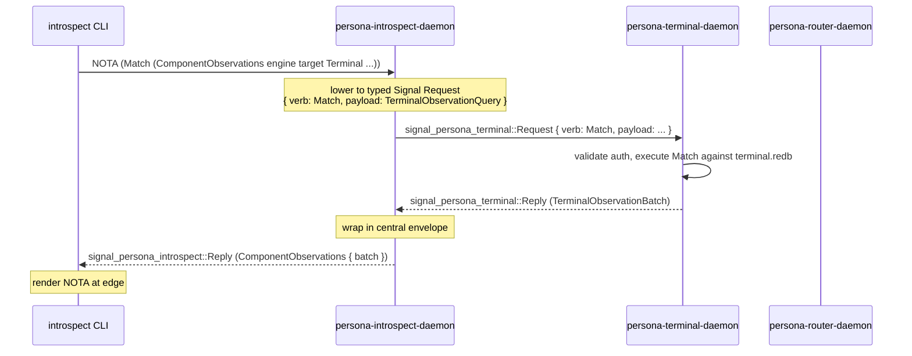

# 160 — Persona-introspect: implementation-ready brief for operator-assistant

*Designer brief, 2026-05-14. Re-frames persona-introspect in
light of the recent architectural arc — Signal as the
database-operation language, sema split into `sema` (kernel) +
`sema-engine` (full engine), the verb-spine discipline in
`~/primary/skills/contract-repo.md`, and the user's settled
decisions on `/158` + `/159`. Names what's implementation-ready
*now* and what waits, in a form operator-assistant can dispatch
without another designer round-trip. Surfaces six open questions
to the user that are required to pin the first work package
fully.*

**Retires when:** operator-assistant's first persona-introspect
slice ships green; designer absorbs any shape surprises that
surfaced into `/158`/`/41`/`signal-persona-introspect`'s
ARCH.

**Builds on:**
- `reports/designer/153-persona-introspect-shape-and-sema-capabilities.md`
  (the shape & dependency analysis that named the gap).
- `reports/designer-assistant/40-persona-introspect-after-111-and-153.md`
  (DA's sharpenings: wrapper-not-schema-hub; target-specific
  selectors; component-minted sequences; read-only inspection
  plane; modest schema introspection).
- `reports/designer-assistant/41-persona-introspect-implementation-ready-design.md`
  (DA's terminal-first implementation-ready spec).
- `reports/designer/157-sema-db-full-engine-direction.md` +
  `reports/designer/158-sema-kernel-and-sema-engine-two-interfaces.md`
  (sema/sema-engine architectural commitments).
- `reports/designer/159-reply-to-operator-115-sema-engine-split.md`
  (user decisions 2026-05-14: persona-mind first, then criome;
  Package 4 absorbs `primary-hj4.1.1`; schema-less `Sema::open`
  deleted, name kept).

---

## 0 · TL;DR

**Persona-introspect is the engine's inspection plane.** Today
it's a scaffold: `IntrospectionRoot` + five empty child actors
that return `Unknown` for every request except a stubbed
`PrototypeWitness`. Under the new architecture three things
become clear:

1. **Persona-introspect is primarily a fan-out coordinator over
   Signal**, not a state-bearing component. Its day job is:
   receive a typed `Match`-shaped Signal frame at
   `introspect.sock`; validate + lower to peer-specific typed
   queries; send those to peer daemons (terminal.sock, router.sock,
   etc.); wrap the typed replies in `signal-persona-introspect`'s
   envelope; reply. **No central Persona database; no peer redb
   opens; no shared observation store.**

2. **The first work slice is sema-agnostic.** The fan-out path
   doesn't need `sema-engine`. Verb-mapping witnesses can land
   now (Package 1 from `/158 §6.1`); the `/41 §1.2`
   terminal-first slice can land against current code; the
   CLI extension is contract-shaped.

3. **What waits for `sema-engine`** is anything requiring
   *local persistent state* in persona-introspect itself —
   primarily push subscriptions across restart, and (if it
   gets one) any local correlation cache for `DeliveryTrace`.
   The user's six questions in §7 determine whether
   persona-introspect needs local state at all, and if so,
   how much.

The operator-assistant's first dispatchable work is the
terminal-first slice from `/41` plus the verb-mapping witness
for `signal-persona-introspect`, both runnable against
current code without waiting for `sema-engine`'s skeleton to
land.

---

## 1 · The new view: persona-introspect under the verb spine

### 1.1 · Inspection plane, not delivery path

Per `/git/github.com/LiGoldragon/persona-introspect/ARCHITECTURE.md`
§0: persona-introspect "is supervised alongside the operational
first stack and gives the engine a way to explain itself
through typed component observations. It is not in the message
delivery path. It proves the delivery path after the fact."

That positions it as the engine's **read-side observability
plane.** Every operational write happens elsewhere (mind,
terminal, router, harness, system, message); persona-introspect
*queries* the result, *correlates* across components, and
*projects* typed replies to humans and agents at the NOTA edge.

### 1.2 · Every request is a Match (today's four envelope variants)

`signal-persona-introspect/src/lib.rs` currently declares four
request variants:

```text
EngineSnapshot { engine }                     → all "what components run here?"
ComponentSnapshot { engine, target }          → "is this component ready?"
DeliveryTrace { engine, correlation }         → "what happened to this correlated message?"
PrototypeWitness { engine }                   → "did the first-stack prototype fire end-to-end?"
```

All four are **read-shaped**. Under the verb-spine discipline
(per `~/primary/skills/contract-repo.md` §"Signal is the
database language — every request declares a verb"), each
maps to `SemaVerb::Match`:

| Request | Verb | Why |
|---|---|---|
| `EngineSnapshot` | `Match` | Reads engine-level observation: which targets are alive. |
| `ComponentSnapshot` | `Match` | Reads one component's readiness — pattern match on `IntrospectionTarget`. |
| `DeliveryTrace` | `Match` | Reads correlated facts across components — pattern match on `CorrelationId`. |
| `PrototypeWitness` | `Match` | Reads aggregate engine-fire-end-to-end fact. |

Future record-carrying additions also map to `Match`:

| Request | Verb | Why |
|---|---|---|
| `ComponentObservations` (per `/41 D3`) | `Match` | Reads typed batches of one component's observation records. |
| `ListRecordKinds` (per `/41 D7`) | `Match` | Reads the catalog of record kinds each target publishes. |

The future push variant per `/153 §3`:

| Request | Verb | Why |
|---|---|---|
| `SubscribeComponent` | `Subscribe` | Initial snapshot + commit-then-emit deltas. |

**No write verbs.** `signal-persona-introspect` is a read-only
inspection plane (per DA `/40` and the existing ARCH
constraint). It does not Assert/Mutate/Retract anything in the
operational components it observes.

### 1.3 · The daemon is a fan-out coordinator

Today's `persona-introspect/src/runtime.rs:62` has
`IntrospectionRoot` plus six child actors. Five are empty
scaffolds (`TargetDirectory`, `QueryPlanner`, `ManagerClient`,
`RouterClient`, `TerminalClient`, `NotaProjection`). Under the
new framing they have a precise shape:



Key properties under the new architecture:

- **The introspect daemon doesn't compile queries against any
  redb directly.** It compiles the central envelope payload
  to a peer's typed Signal request, then forwards.
- **Each peer daemon is the owner of its own data.** persona-
  terminal compiles `TerminalObservationQuery` to a sema-engine
  plan (once sema-engine lands; today against direct sema
  tables); persona-introspect never sees the table.
- **`signal-persona-introspect` is the wrapper, not the schema
  hub** (per DA `/40`). The reply variants carry typed records
  from the *owning component's* contract crate:
  `ComponentObservationResult::TerminalObservations(signal_persona_terminal::TerminalObservationBatch)`.

This is the "federated Datomic" shape from `/153 §7.7` — each
component owns its own log; the introspect daemon is the
fan-in coordinator.

### 1.4 · Local persistent state — open question

The architectural constraint (`persona-introspect/ARCHITECTURE.md`
§2) says the daemon does NOT open peer redb files. It does not
forbid the daemon from having its OWN redb file. The question
is: **does it need one?**

For the four current variants + `/41`'s `ComponentObservations`
+ `ListRecordKinds`: **no.** Every request is satisfied by
fan-out + reply-wrapping. No persistent state needed.

For future `SubscribeComponent`: **probably yes**, because
persistent subscription records survive restart, and the
introspect daemon would need to know which callers subscribed
to which peer streams. But this is post-`sema-engine` work.

For `DeliveryTrace` push-shaped reassembly: **yes**, if push.
Each peer would emit correlated-fact events to a local
introspect store, and the daemon would assemble traces from
its own data. **No**, if pull (the introspect daemon queries
peers on demand for the correlation id). Recommendation in
§7 Q3.

Designer recommendation: **defer all local-state work until
`sema-engine` lands.** The terminal-first slice from `/41`
needs no local state. Operator-assistant can implement the
fan-out paths today, against current code. The subscription
+ correlation work waits for `sema-engine` Package 4 + the
specific `SubscriptionSink<R>` contract from `/158 §3.5`.

---

## 2 · What's implementation-ready now vs gated

### 2.1 · Ready now (sema-agnostic)

| Work | Why ready | Lands in |
|---|---|---|
| Verb-mapping witness for `signal-persona-introspect` | All four current variants are read-shaped → `Match`; pattern from `~/primary/skills/contract-repo.md` applies cleanly. | `signal-persona-introspect/src/lib.rs` + tests. |
| Envelope extension per `/41 D2/D3/D7` | Adds `ComponentObservations` + `ListRecordKinds` request/reply variants; wraps component-owned types. Pure contract-crate work. | `signal-persona-introspect`. |
| Terminal observation contract per `/41 §1.1` | `TerminalObservationQuery`, `TerminalObservationBatch`, etc.; component-owned in `signal-persona-terminal`. | `signal-persona-terminal`. |
| Terminal observation handler per `/41 §1.2` | Reads existing terminal redb tables (sequence-keyed delivery/event/viewer + string-keyed session/health/archive); adds packed-key time indexes. Lands against **current sema** today; migrates to `sema-engine` later. | `persona-terminal/src/tables.rs` + supervisor handler. |
| `persona-introspect::TerminalClient` per `/41 §1.4` | Socket-aware actor; sends typed Signal frame; decodes typed reply; reports `PeerSocketMissing` / `PeerSocketUnreachable` cleanly. | `persona-introspect/src/runtime.rs`. |
| CLI `Input` extension per `/41 §2` | Currently only `PrototypeWitness`; adds `ComponentObservations` and the three existing envelope variants. | `persona-introspect/src/surface.rs`. |
| Nix end-to-end witness per `/41 §4 prototype` | `persona-engine-introspect-terminal-observations` derivation. | `persona/` flake. |

### 2.2 · Gated on `sema-engine`

| Work | Gated by | Note |
|---|---|---|
| `SubscribeComponent` variant + push delivery in introspect | `sema-engine` Package 4 (`Subscribe` primitive + `SubscriptionSink<R>` per `/158 §3.5`) + commit-then-emit in each peer component. | Per `/41 D6`: explicitly out of v1. Wait for sema-engine. |
| Any local persistent state in persona-introspect | `sema-engine` (persona-introspect would be a sema-engine consumer for its own state). | Designer recommendation: defer; see §7 Q1. |
| Schema introspection beyond modest `ListRecordKinds` | Sema-engine catalog introspection (`list_tables` from `/158 §3.1`). | The modest version (capability flags per `/41 D7`) lands now without sema-engine. |

### 2.3 · Gated on commit-then-emit in peer components

Push delivery from peers (deltas after their writes) needs
each peer's commit-then-emit machinery, which currently exists
only in `persona-mind` (per operator track `primary-hj4.1.1`,
now reframed as `sema-engine` Package 4 per `/159 §3.4`).

The terminal-first slice doesn't need this — it's pull-shaped
(introspect queries terminal on demand). Push variants land
once each peer is a sema-engine `Subscribe` consumer.

---

## 3 · The work for operator-assistant

Six packages, ordered by dependency. Each is sized for
operator-assistant dispatch with witnesses that prove the
typed path is used.

### Package OA-1 — signal-persona-introspect verb-mapping witness

**Repos:** `signal-persona-introspect`.

**Work:**
- Add `impl IntrospectionRequest { pub fn sema_verb(&self) -> SemaVerb }`
  mapping every variant to `SemaVerb::Match` (plus
  `SemaVerb::Subscribe` for the `SubscribeComponent` variant
  if/when it's added).
- Round-trip tests asserting the verb-payload pair, not just
  the payload.

**Witnesses:**
- `introspect_request_variants_have_match_verb` — sourcescan
  + round-trip.
- `introspect_round_trip_preserves_verb_and_payload`.

**Independence:** Lands without any sema-engine or
persona-introspect runtime changes. Can land first or in
parallel with OA-2/OA-3.

### Package OA-2 — Envelope extension per `/41 D2/D3/D7`

**Repos:** `signal-persona-introspect`.

**Work** (per `/41 §1.3`):
- Add `ComponentObservationQuery` (closed enum of
  target-specific queries).
- Add `ComponentObservationsQuery { engine, query }`.
- Add `ComponentObservationResult` (closed enum wrapping the
  *owning component's* observation batch types — must NOT
  redefine component row structs in the central crate).
- Add `ComponentObservations { engine, result }`.
- Add `ListRecordKindsQuery` + `RecordKinds(Vec<RecordKindDescriptor>)`.
- Extend `IntrospectionRequest` + `IntrospectionReply` with
  these new variants.
- Add `PeerSocketMissing` + `PeerSocketUnreachable` to
  `IntrospectionUnimplementedReason`.

**Witnesses:**
- `component_observations_wrap_terminal_batch` (will fail
  until OA-3 lands the terminal-side types).
- `component_observations_wrap_terminal_session_snapshot`.
- `list_record_kinds_round_trips`.
- `central_contract_does_not_define_terminal_rows` —
  source-scan in `signal-persona-introspect` that no
  `TerminalObservation*` struct is *defined* in this crate
  (it must only re-export from `signal-persona-terminal`).
- `peer_socket_failure_reasons_round_trip`.

**Depends on:** OA-3 declaring the terminal-side types
first, or both land in lockstep.

### Package OA-3 — Terminal observation contract + handler (`/41 §1.1, §1.2`)

**Repos:** `signal-persona-terminal`, `persona-terminal`.

This is the work `/41` already specifies. Operator-assistant
implements `/41`'s Package A end-to-end.

**Contract work** (per `/41 §1.1`):
- Add `TerminalObservationKind` closed enum,
  `TerminalObservationTimeRange`, `TerminalObservationSequenceRange`,
  `TerminalObservationQuery`, `TerminalObservation` (closed
  sum), `TerminalObservationBatch`,
  `TerminalSessionSnapshotQuery`, `TerminalSessionSnapshot`,
  `TerminalObservationUnimplemented` + reason variants,
  `TerminalObservationRequest` + `TerminalObservationReply`.
- Add `sequence` + `observed_at` fields to the event-like
  records that don't already have them
  (`TerminalSessionHealthObservation`,
  `TerminalSessionArchiveObservation`).
- Plan retirement of `TerminalIntrospectionSnapshot` once
  event-log + session-snapshot relations land (don't keep
  two parallel snapshot models long term).

**Storage work** (per `/41 §1.2`):
- Add the five `_by_time` secondary index tables using
  packed key `TerminalObservationTimeKey(observed_at,
  sequence)` and data-carrying entry
  `TerminalObservationTimeIndexEntry { sequence }`. **No
  `Table<Key, ()>`** per `/158 §2`.
- Add typed observation handler in the terminal supervisor
  path that compiles a `TerminalObservationQuery` to a
  read against the appropriate primary/index tables.
- Atomic dual-write discipline: every production write
  method (e.g. `put_terminal_event`) writes primary + index
  in the same `sema.write` closure.

**Critical:** this lands against **current sema** today, not
against sema-engine. The packed key + `_by_time` tables are
exactly the patterns sema-engine eventually absorbs (per
`/158 §3.1`'s `IndexedTable` / `register_index` API); the
work doesn't wait. When persona-terminal migrates to
sema-engine later (per `/158 §6.1`), this is one of the
mechanical rewrites.

**Witnesses** (per `/41 §4`):
- `terminal_observations_read_existing_production_tables`.
- `terminal_observations_filter_by_sequence_range`.
- `terminal_observations_filter_by_time_range`.
- `terminal_observation_time_index_written_with_primary_record`
  — calls production write methods (e.g.,
  `put_terminal_event`), not test-only table writes.
- `terminal_observation_time_index_value_carries_sequence`
  — no zero-sized index values per `/158 §2`.

### Package OA-4 — persona-introspect `TerminalClient` (`/41 §1.4`)

**Repos:** `persona-introspect`.

**Work:**
- Add `signal-persona-terminal` dependency (only after OA-3 +
  OA-2 are landed).
- Replace today's empty `TerminalClient` scaffold with a
  real Kameo actor holding terminal socket state, the
  component codec, and typed failure handling.
- Route `ComponentObservationQuery::Terminal*` through
  `QueryPlanner` to `TerminalClient`.
- Wire the typed reply through `NotaProjection`.
- Stop returning `Unknown` for the terminal path — return
  typed `PeerSocketMissing` / `PeerSocketUnreachable` /
  `ComponentObservationMissing` when appropriate.

**Witnesses** (per `/41 §4`):
- `component_observations_uses_terminal_socket`.
- `component_observations_does_not_open_terminal_redb` —
  source-scan + actor trace.
- `terminal_client_decodes_terminal_observation_batch`.
- `terminal_client_reports_peer_socket_missing`.
- `terminal_client_reports_peer_socket_unreachable`.

### Package OA-5 — CLI extension (`/41 §2`)

**Repos:** `persona-introspect`.

**Work:**
- Extend `Input` enum to include `EngineSnapshot`,
  `ComponentSnapshot`, `DeliveryTrace`, `ComponentObservations`
  variants (today only `PrototypeWitness` is plumbed).
- NOTA round-trip from CLI argv/stdin through to typed
  request.
- NOTA projection at reply edge.

**Witnesses:**
- `introspect_cli_decodes_each_input_variant`.
- `introspect_cli_projects_component_observations_to_nota`
  (per `/41 §4`).

### Package OA-6 — End-to-end Nix witness (`/41 §4 prototype`)

**Repos:** `persona`.

**Work:**
- Add `persona-engine-introspect-terminal-observations`
  derivation that:
  1. Starts the prototype with `persona-introspect` and
     persona-terminal in the running stack;
  2. Writes at least one production terminal observation
     record;
  3. Invokes `introspect` CLI with a `ComponentObservations
     target Terminal` query;
  4. Asserts the returned NOTA includes the terminal-owned
     observation record.

**Witnesses:**
- The derivation itself green = the end-to-end path works.

---

## 4 · Coordination with operator's sema-engine track

Operator currently holds `[primary-6nr]` for sema cleanup
(`/git/.../sema`); the sema-engine repo + skeleton lands next
(Package B per `/115 §7`). Operator-assistant's persona-introspect
work runs in parallel with that track because:

- **No package above depends on sema-engine being ready.**
  Every storage operation in OA-1 through OA-6 goes through
  current sema's `Table` API. The patterns (packed time-key,
  atomic dual-write, monotone sequence) are the patterns
  sema-engine will eventually absorb, but operator-assistant
  hand-rolls them now for terminal exactly as `/41 §1.2`
  specified.

- **The verb-mapping witness (OA-1) is independent of either
  sema or sema-engine.** It's contract-crate work; operator-
  assistant can ship it first as the cheapest first deliverable.

- **persona-mind migration to sema-engine (the first
  sema-engine consumer per `/158 §6.1`) is operator's lane.**
  Operator-assistant does not need to coordinate package-by-
  package with that work.

When persona-terminal migrates to sema-engine later (per
`/158 §6.1`'s remaining persona-* components after persona-mind +
criome), the hand-rolled `_by_time` tables become
`Engine::register_index` calls, the time-range filter loops
become `QueryPlan::ByIndex`, and the witnesses adjust to use
the engine API. That's mechanical rewrite work that operator
or operator-assistant can pick up at that point — not
something to anticipate now.

---

## 5 · What stays out of scope for this slice

Stating the boundary explicitly so operator-assistant doesn't
drift into adjacent work:

- **No `SubscribeComponent` wire variant.** Per `/41 D6`:
  "do not add a `SubscribeComponent` wire variant in this
  slice. A variant that only returns `Unimplemented` gives
  every consumer contract debt with no working feature."
  Waits for sema-engine Package 4 + commit-then-emit in
  each peer.
- **No local persistent state in persona-introspect.** No
  subscription tables, no correlation cache, no operation
  log. Per §1.4 + §7 Q1, defer to post-sema-engine.
- **No reading of peer redb files.** Per
  `persona-introspect/ARCHITECTURE.md` §2 constraint:
  "the daemon does not open peer redb files." All state
  access goes through the peer's Signal socket.
- **No `DeliveryTrace` push reassembly.** The current pull
  shape stays; the push alternative (each peer emits
  correlated-fact events to an introspect-local store) is
  out of scope. See §7 Q3.
- **No persona-harness CLI.** The gap `/153 §3` named is
  real (harness has only `persona-harness-daemon`, no
  `harness` CLI), but it's a separate slice. See §7 Q5.
- **No field-level schema introspection.** `ListRecordKinds`
  returns capability flags + record-kind names + contract
  crate identifiers (per `/41 D7`), not field schemas.
  Field-level reflection waits for nota-derive's descriptor
  generation.
- **No `signal-persona-introspect-*` sibling crate.** All
  envelope additions land in the central crate (per
  `signal-persona-introspect/ARCHITECTURE.md`); the
  wrapper-not-schema-hub constraint per DA `/40` keeps
  the central crate from absorbing component row vocab.

---

## 6 · Witnesses summary

All witnesses are named in §3 inline with each package. The
load-bearing ones, restated as the gate:

**Contract layer (signal-persona-introspect, signal-persona-terminal):**
- Verb-mapping per request variant (OA-1).
- Round-trip per record kind (OA-2, OA-3 contract work).
- Source-scan: central crate never defines terminal-owned
  record structs (OA-2).
- No `Table<Key, ()>` index pattern (OA-3 storage work).

**Runtime layer (persona-introspect, persona-terminal):**
- Sema-backed time-range filter (OA-3).
- Atomic primary + index write through production write
  methods (OA-3).
- `TerminalClient` uses socket, not peer redb (OA-4).
- Typed peer-socket failure reasons (OA-4).
- CLI NOTA projection round-trip (OA-5).

**Architectural truth tests:**
- `component_observations_does_not_open_terminal_redb` —
  enforces the per-repo ARCH constraint at runtime.
- `central_contract_does_not_define_terminal_rows` —
  enforces wrapper-not-schema-hub.

**End-to-end:**
- `persona-engine-introspect-terminal-observations` Nix
  derivation (OA-6).

When all green, the terminal-first introspect slice is real:
operator-assistant ships; designer absorbs any shape surprises.

---

## 7 · Open questions for the user

Six questions surface the ambiguities in the work below.
Each carries the substance for the user to answer without
opening files (per `~/primary/skills/reporting.md` §"Questions
to the user — paste the evidence, not a pointer"). Recommendations
are the designer's call; the user's settled answers pin the
work.

### Q1 — Does persona-introspect have its own persistent state?

**The question.** Today the daemon binds `introspect.sock` and
serves Signal frames through a Kameo actor root. The
ARCHITECTURE says it does NOT open peer redb files. It does
not say whether it has its own redb file.

**Three positions:**

- (a) **Stateless** for the foreseeable future. Every
  request triggers fresh fan-out; nothing persists. Simplest
  shape; no sema-engine dependency.
- (b) **Stateful for Subscribe only.** When
  `SubscribeComponent` lands (post-sema-engine), persona-
  introspect persists subscription registrations (caller_id →
  forwarded subscriptions to peers) so subscribers survive
  process restart. Other paths remain stateless.
- (c) **Stateful for Subscribe + DeliveryTrace.** Adds a
  local correlation cache for `DeliveryTrace` queries: each
  peer emits `CorrelationId`-tagged observation events to
  persona-introspect, which assembles traces from its own
  store. Lets `DeliveryTrace` return historical traces past
  the peers' bounded retention.

**Designer recommendation: (b).** The Subscribe case has a
clear need (durability across restart). DeliveryTrace stays
pull-shaped (per §7 Q3 below) for v1, so no correlation cache.
The introspect's local state is small and bounded: one typed
subscription record per active subscriber × per peer it
forwards to.

**Why this matters for OA's work:** all OA-1 to OA-6 packages
above are sema-agnostic regardless of the answer. But the
answer pins whether persona-introspect becomes a sema-engine
consumer (yes if b or c, no if a), which affects the eventual
migration story.

### Q2 — First slice scope: the four current envelope variants, or `/41`'s `ComponentObservations` extension?

**The question.** Today only `PrototypeWitness` returns
anything other than `Unknown`. Two scoping options for OA's
first deliverable:

- (a) **Status-fill first.** Make the four existing variants
  (`EngineSnapshot`, `ComponentSnapshot`, `DeliveryTrace`,
  `PrototypeWitness`) return real `Ready`/`NotReady` /
  delivery-trace facts instead of `Unknown`. Smaller scope;
  proves the fan-out + reply-wrap path on the minimum
  surface.
- (b) **`/41` terminal-first slice.** Implement the entire
  `/41` Package A through Package D for terminal: contract
  extension + terminal handler + introspect TerminalClient
  + CLI + Nix witness. Larger scope; produces a real
  record-carrying observation path end-to-end.
- (c) **Both, sequenced.** (a) first, (b) next.

**Designer recommendation: (b).** The status-fill work is
cheaper but less load-bearing — `Ready/NotReady/Unknown` is
already a working tri-state envelope; making it actually
report readiness doesn't require any structural change. `/41`
is what proves the architecture (typed records crossing
component boundaries, time-indexed reads, NOTA projection at
the edge). If OA can ship one slice, ship the one that
validates the shape.

**Counter-argument for (a):** if operator-assistant has less
context for `/41`'s detail, status-fill is the gentler first
deliverable.

### Q3 — `DeliveryTrace` reassembly: pull or push?

**The question** (open since `/153 §7.4`). `DeliveryTrace`
asks "what happened to this correlated message?" Two
reassembly patterns:

- (a) **Pull.** persona-introspect daemon queries each peer
  (router, terminal, harness) for observations tagged with
  the given `CorrelationId`. Each peer needs to keep a small
  bounded ring of recent records keyed by correlation id.
  Assembly happens at query time. Simpler. Bounded peer
  memory.
- (b) **Push.** Each peer publishes `CorrelationId`-tagged
  events to persona-introspect as they happen; persona-
  introspect assembles into its local store. Lets traces
  return facts past the peers' bounded retention; requires
  local introspect state (Q1 c).

**Designer recommendation: (a) for v1.** Aligns with the
current pull-shaped envelope; doesn't introduce push delivery
into persona-introspect's machinery before sema-engine's
Subscribe is ready; bounded retention is the right shape for
trace-level diagnostics anyway (recent traces matter; historical
trace archaeology is a separate concern). If push reassembly
becomes load-bearing later, it lands as a Subscribe-based v2
on top of sema-engine.

### Q4 — Persona-harness CLI: in scope or separate?

**The question** (open since `/153 §3`). Every other first-stack
component has a daemon AND a CLI; persona-harness has only
`persona-harness-daemon`. That means harness state is
queryable only *through* introspect, which is a longer path
than necessary. Should adding a `harness` CLI (one NOTA in,
one NOTA out, over `signal-persona-harness`) be part of OA's
introspect work or a separate slice?

**Designer recommendation: separate slice.** The introspect
work is bounded; adding harness CLI doubles the scope
without contributing to the introspect path itself. Filing
a sibling bead for `harness` CLI is the cleaner shape. Could
even be operator-assistant's *next* slice after the
introspect terminal slice.

### Q5 — Operator-assistant lane boundary: does OA do `/41` Package A (terminal-side), or only the introspect-side?

**The question.** `/41` has four packages: A (terminal), B
(central contract), C (introspect runtime + CLI), D (router
follow-up). Package A is terminal-side — it lives in
`persona-terminal` + `signal-persona-terminal`. Operator
currently holds the sema cleanup on `[primary-6nr]`; nothing
prevents operator-assistant from working in
`persona-terminal`, but the user may prefer scoping OA to
introspect-side only.

**Three positions:**

- (a) **OA does everything (A + B + C; D later).** Full
  terminal-first slice end-to-end.
- (b) **OA does only B + C** (signal-persona-introspect
  envelope extension + persona-introspect runtime + CLI).
  Terminal-side (A) waits for operator or another assistant.
- (c) **OA does A + B + C in coordination with operator.**
  Operator-assistant takes terminal-side; operator stays on
  sema-engine track.

**Designer recommendation: (c).** Operator's sema-engine
work is the bottleneck for the broader migration; offloading
terminal-side observation work to operator-assistant lets
both tracks progress. The terminal observation handler is
operator-shaped (Rust + sema + Kameo actor in
persona-terminal), well within operator-assistant's scope
per `~/primary/skills/operator-assistant.md`.

### Q6 — Should persona-introspect be among the first sema-engine consumers (alongside persona-mind, then criome)?

**The question.** Per `/158 §6.1` user-decided 2026-05-14:
persona-mind migrates first, criome second, "then the
remaining persona-* components (terminal, router, harness,
system, message, manager) — each lands as the engine surface
stabilises." persona-introspect was not named explicitly.
With Q1's recommendation = (b) (introspect has local state
for subscriptions when SubscribeComponent lands), the
question becomes: when does persona-introspect migrate?

**Three positions:**

- (a) **Late in the sequence.** persona-introspect waits
  until after most persona-* components have migrated;
  its local state is small enough that the migration is
  trivial.
- (b) **Alongside the second wave (after mind + criome).**
  Specifically: persona-introspect's `SubscribeComponent`
  implementation arrives only when sema-engine Package 4
  is real, which is after mind's migration is proven.
- (c) **Stateless v1; sema-engine consumer only when
  Subscribe lands.** Until SubscribeComponent is implemented,
  persona-introspect has no local state and is not a
  sema-engine consumer at all. When Subscribe lands, it
  becomes a consumer at the same time as it implements the
  variant.

**Designer recommendation: (c).** Aligns with §1.4 and Q1(b).
Keeps persona-introspect's dependency surface minimal until
real state appears.

---

## 8 · See also

- `reports/designer/153-persona-introspect-shape-and-sema-capabilities.md`
  — the shape & dependency analysis that named the gap.
  §6 lists the concrete blocks (six items); this report
  picks up where `/153` left off, after the verb-spine
  framing landed.
- `reports/designer-assistant/40-persona-introspect-after-111-and-153.md`
  — DA's sharpenings (wrapper-not-schema-hub; target-specific
  selectors; component-minted ObservationSequence; read-only
  inspection plane; modest schema introspection).
  All folded into §1 + §2 above.
- `reports/designer-assistant/41-persona-introspect-implementation-ready-design.md`
  — DA's terminal-first implementation-ready spec. The
  load-bearing input for the OA-3 + OA-4 packages.
- `reports/designer/158-sema-kernel-and-sema-engine-two-interfaces.md`
  — the storage architecture. §3.5's `SubscriptionSink<R>`
  contract is what `SubscribeComponent` would land against
  once sema-engine Package 4 ships.
- `reports/designer/159-reply-to-operator-115-sema-engine-split.md`
  — the user decisions 2026-05-14 driving the open questions
  in §7 (specifically Q6 follows from `/159 §3.3`'s
  persona-mind-first, criome-second sequence).
- `reports/operator/115-sema-engine-split-implementation-investigation.md`
  — operator's implementation investigation. §7's 10-step
  order applies; OA's persona-introspect work happens in
  parallel with operator's sema-engine track.
- `~/primary/skills/contract-repo.md` §"Signal is the
  database language — every request declares a verb" — the
  rule OA-1's verb-mapping witness enforces.
- `~/primary/skills/operator-assistant.md` — OA's role
  contract; the work below stays within OA's discipline
  (Rust + sema-shaped storage + Kameo actors + typed Signal
  frames; no design authority over the central architecture).
- `~/primary/skills/architectural-truth-tests.md` — the
  shape every witness in §6 must satisfy.
- `/git/github.com/LiGoldragon/persona-introspect/ARCHITECTURE.md`
  — the constraints that gate this slice (especially: daemon
  does not open peer redb files; CLI renders NOTA only at
  edge; central contract wraps component-owned records).
- `/git/github.com/LiGoldragon/signal-persona-introspect/ARCHITECTURE.md`
  — the wrapper-not-schema-hub commitment that OA-2 must
  preserve.
