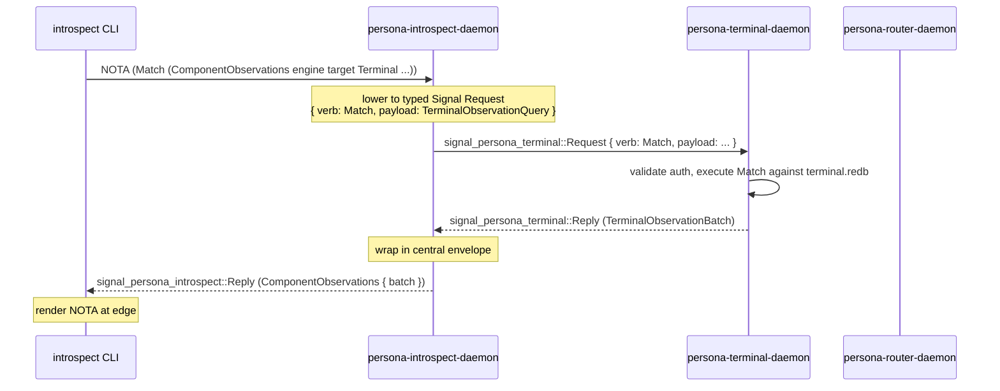

# 160 — Persona-introspect: implementation-ready brief for operator-assistant

*Designer brief, 2026-05-14. Re-frames persona-introspect in
light of the recent architectural arc — Signal as the
database-operation language, sema split into `sema` (kernel) +
`sema-engine` (full engine), the verb-spine discipline in
`~/primary/skills/contract-repo.md`, and the user's settled
decisions on `/158` + `/159`. Names what's implementation-ready
*now* and what waits, in a form operator-assistant can dispatch
without another designer round-trip. Surfaces six open questions
to the user that are required to pin the first work package
fully.*

**Retires when:** operator-assistant's first persona-introspect
slice ships green; designer absorbs any shape surprises that
surfaced into `/158`/`/41`/`signal-persona-introspect`'s
ARCH.

**Builds on:**
- `reports/designer/153-persona-introspect-shape-and-sema-capabilities.md`
  (the shape & dependency analysis that named the gap).
- `reports/designer-assistant/40-persona-introspect-after-111-and-153.md`
  (DA's sharpenings: wrapper-not-schema-hub; target-specific
  selectors; component-minted sequences; read-only inspection
  plane; modest schema introspection).
- `reports/designer-assistant/41-persona-introspect-implementation-ready-design.md`
  (DA's terminal-first implementation-ready spec).
- `reports/designer/157-sema-db-full-engine-direction.md` +
  `reports/designer/158-sema-kernel-and-sema-engine-two-interfaces.md`
  (sema/sema-engine architectural commitments).
- `reports/designer/159-reply-to-operator-115-sema-engine-split.md`
  (user decisions 2026-05-14: persona-mind first, then criome;
  Package 4 absorbs `primary-hj4.1.1`; schema-less `Sema::open`
  deleted, name kept).

---

## 0 · TL;DR

**Persona-introspect is the engine's inspection plane.** Today
it's a scaffold: `IntrospectionRoot` + five empty child actors
that return `Unknown` for every request except a stubbed
`PrototypeWitness`. Under the new architecture and the user's
directive 2026-05-14 ("nothing ships that doesn't use sema-engine;
the old hand-roll-then-migrate approach is off"):

1. **Persona-introspect is primarily a fan-out coordinator over
   Signal.** Receives a typed `Match`-shaped Signal frame at
   `introspect.sock`; lowers to peer-specific typed queries;
   sends those to peer daemons (terminal.sock, router.sock,
   etc.); wraps the typed replies in `signal-persona-introspect`'s
   envelope; replies. **No central Persona database; no peer
   redb opens; no shared observation store.**

2. **Per the user's 2026-05-14 decisions (§7 Q1 + the
   sema-engine-only directive), persona-introspect carries
   local persistent state through `sema-engine`** — subscription
   registrations + correlation cache populated by Subscribe
   deltas from each peer.

3. **All storage-shaped work goes through `sema-engine` only.**
   Per the user's directive: no more hand-rolled patterns
   against current `sema`'s typed `Table` API as a
   transitional step. Where `sema-engine` doesn't yet expose
   the needed surface (`register_index`, range/index query
   plans, `Subscribe`), the dependent slice **waits** for
   `sema-engine` to grow that surface. Operator is actively
   widening `sema-engine` per DA `/49`'s finish path.

4. **The work splits into three slices** per §3:
   - **Slice 1 (immediate, mostly sema-agnostic):** verb-mapping
     witness + real `EngineSnapshot` / `ComponentSnapshot` /
     `PrototypeWitness` replies via Signal fan-out (no
     storage) + central contract extension + introspect
     **skeleton actor + record family type definitions +
     architecture witnesses** (per DA `/49 §4` option 2 —
     persistence wires up only when the skeleton is reviewed
     and operator's next surface lands). `DeliveryTrace`
     returns `AwaitingCorrelationCache` until Slice 3.
     Optional Slice 1.5 wires the first `Engine::assert`
     calls for an audit-trail record family using current
     sema-engine surface.
   - **Slice 2 (`/41` terminal + router end-to-end; gated on
     sema-engine widening):** terminal + router observation
     contracts + handlers + introspect clients + CLI + Nix
     witness. Handler-side storage uses
     `Engine::register_index` + `QueryPlan::ByIndex` /
     `QueryPlan::ByKeyRange` — meaning persona-terminal and
     persona-router **migrate to sema-engine as part of this
     slice**, alongside operator's persona-mind migration.
     Waits for operator step 5 in DA `/49 §5` finish path
     (QueryPlan widening with key range + index lookup).
   - **Slice 3 (Subscribe + DeliveryTrace cache; gated on
     sema-engine Package 4 + per-peer commit-then-emit):**
     `SubscribeComponent` wire variant + forwarded peer
     subscriptions + cache-backed `DeliveryTrace`. Waits
     for operator step 8 (Subscribe primitive) and each
     peer becoming a Subscribe producer.

OA dispatches Slice 1 first as the immediate sema-agnostic
deliverable. Slice 2 dispatches when operator's `sema-engine`
QueryPlan widening lands. Slice 3 dispatches when operator's
`Subscribe` primitive lands and peers have commit-then-emit
wired.

---

## 1 · The new view: persona-introspect under the verb spine

### 1.1 · Inspection plane, not delivery path

Per `/git/github.com/LiGoldragon/persona-introspect/ARCHITECTURE.md`
§0: persona-introspect "is supervised alongside the operational
first stack and gives the engine a way to explain itself
through typed component observations. It is not in the message
delivery path. It proves the delivery path after the fact."

That positions it as the engine's **read-side observability
plane.** Every operational write happens elsewhere (mind,
terminal, router, harness, system, message); persona-introspect
*queries* the result, *correlates* across components, and
*projects* typed replies to humans and agents at the NOTA edge.

### 1.2 · Every request is a Match (today's four envelope variants)

`signal-persona-introspect/src/lib.rs` currently declares four
request variants:

```text
EngineSnapshot { engine }                     → all "what components run here?"
ComponentSnapshot { engine, target }          → "is this component ready?"
DeliveryTrace { engine, correlation }         → "what happened to this correlated message?"
PrototypeWitness { engine }                   → "did the first-stack prototype fire end-to-end?"
```

All four are **read-shaped**. Under the verb-spine discipline
(per `~/primary/skills/contract-repo.md` §"Signal is the
database language — every request declares a verb"), each
maps to `SemaVerb::Match`:

| Request | Verb | Why |
|---|---|---|
| `EngineSnapshot` | `Match` | Reads engine-level observation: which targets are alive. |
| `ComponentSnapshot` | `Match` | Reads one component's readiness — pattern match on `IntrospectionTarget`. |
| `DeliveryTrace` | `Match` | Reads correlated facts across components — pattern match on `CorrelationId`. |
| `PrototypeWitness` | `Match` | Reads aggregate engine-fire-end-to-end fact. |

Future record-carrying additions also map to `Match`:

| Request | Verb | Why |
|---|---|---|
| `ComponentObservations` (per `/41 D3`) | `Match` | Reads typed batches of one component's observation records. |
| `ListRecordKinds` (per `/41 D7`) | `Match` | Reads the catalog of record kinds each target publishes. |

The future push variant per `/153 §3`:

| Request | Verb | Why |
|---|---|---|
| `SubscribeComponent` | `Subscribe` | Initial snapshot + commit-then-emit deltas. |

**No write verbs.** `signal-persona-introspect` is a read-only
inspection plane (per DA `/40` and the existing ARCH
constraint). It does not Assert/Mutate/Retract anything in the
operational components it observes.

### 1.3 · The daemon is a fan-out coordinator

Today's `persona-introspect/src/runtime.rs:62` has
`IntrospectionRoot` plus six child actors. Five are empty
scaffolds (`TargetDirectory`, `QueryPlanner`, `ManagerClient`,
`RouterClient`, `TerminalClient`, `NotaProjection`). Under the
new framing they have a precise shape:



Key properties under the new architecture:

- **The introspect daemon doesn't compile queries against any
  redb directly.** It compiles the central envelope payload
  to a peer's typed Signal request, then forwards.
- **Each peer daemon is the owner of its own data.** persona-
  terminal compiles `TerminalObservationQuery` to a sema-engine
  plan (once sema-engine lands; today against direct sema
  tables); persona-introspect never sees the table.
- **`signal-persona-introspect` is the wrapper, not the schema
  hub** (per DA `/40`). The reply variants carry typed records
  from the *owning component's* contract crate:
  `ComponentObservationResult::TerminalObservations(signal_persona_terminal::TerminalObservationBatch)`.

This is the "federated Datomic" shape from `/153 §7.7` — each
component owns its own log; the introspect daemon is the
fan-in coordinator.

### 1.4 · Local persistent state — open question

The architectural constraint (`persona-introspect/ARCHITECTURE.md`
§2) says the daemon does NOT open peer redb files. It does not
forbid the daemon from having its OWN redb file. The question
is: **does it need one?**

For the four current variants + `/41`'s `ComponentObservations`
+ `ListRecordKinds`: **no.** Every request is satisfied by
fan-out + reply-wrapping. No persistent state needed.

For future `SubscribeComponent`: **probably yes**, because
persistent subscription records survive restart, and the
introspect daemon would need to know which callers subscribed
to which peer streams. But this is post-`sema-engine` work.

For `DeliveryTrace` push-shaped reassembly: **yes**, if push.
Each peer would emit correlated-fact events to a local
introspect store, and the daemon would assemble traces from
its own data. **No**, if pull (the introspect daemon queries
peers on demand for the correlation id). Recommendation in
§7 Q3.

Designer recommendation: **defer all local-state work until
`sema-engine` lands.** The terminal-first slice from `/41`
needs no local state. Operator-assistant can implement the
fan-out paths today, against current code. The subscription
+ correlation work waits for `sema-engine` Package 4 + the
specific `SubscriptionSink<R>` contract from `/158 §3.5`.

---

## 2 · What's implementation-ready now vs gated

### 2.1 · Ready now (sema-agnostic)

| Work | Why ready | Lands in |
|---|---|---|
| Verb-mapping witness for `signal-persona-introspect` | All four current variants are read-shaped → `Match`; pattern from `~/primary/skills/contract-repo.md` applies cleanly. | `signal-persona-introspect/src/lib.rs` + tests. |
| Envelope extension per `/41 D2/D3/D7` | Adds `ComponentObservations` + `ListRecordKinds` request/reply variants; wraps component-owned types. Pure contract-crate work. | `signal-persona-introspect`. |
| Terminal observation contract per `/41 §1.1` | `TerminalObservationQuery`, `TerminalObservationBatch`, etc.; component-owned in `signal-persona-terminal`. | `signal-persona-terminal`. |
| Terminal observation handler per `/41 §1.2` | Reads existing terminal redb tables (sequence-keyed delivery/event/viewer + string-keyed session/health/archive); adds packed-key time indexes. Lands against **current sema** today; migrates to `sema-engine` later. | `persona-terminal/src/tables.rs` + supervisor handler. |
| `persona-introspect::TerminalClient` per `/41 §1.4` | Socket-aware actor; sends typed Signal frame; decodes typed reply; reports `PeerSocketMissing` / `PeerSocketUnreachable` cleanly. | `persona-introspect/src/runtime.rs`. |
| CLI `Input` extension per `/41 §2` | Currently only `PrototypeWitness`; adds `ComponentObservations` and the three existing envelope variants. | `persona-introspect/src/surface.rs`. |
| Nix end-to-end witness per `/41 §4 prototype` | `persona-engine-introspect-terminal-observations` derivation. | `persona/` flake. |

### 2.2 · Gated on `sema-engine`

| Work | Gated by | Note |
|---|---|---|
| `SubscribeComponent` variant + push delivery in introspect | `sema-engine` Package 4 (`Subscribe` primitive + `SubscriptionSink<R>` per `/158 §3.5`) + commit-then-emit in each peer component. | Per `/41 D6`: explicitly out of v1. Wait for sema-engine. |
| Any local persistent state in persona-introspect | `sema-engine` (persona-introspect would be a sema-engine consumer for its own state). | Designer recommendation: defer; see §7 Q1. |
| Schema introspection beyond modest `ListRecordKinds` | Sema-engine catalog introspection (`list_tables` from `/158 §3.1`). | The modest version (capability flags per `/41 D7`) lands now without sema-engine. |

### 2.3 · Gated on commit-then-emit in peer components

Push delivery from peers (deltas after their writes) needs
each peer's commit-then-emit machinery, which currently exists
only in `persona-mind` (per operator track `primary-hj4.1.1`,
now reframed as `sema-engine` Package 4 per `/159 §3.4`).

The terminal-first slice doesn't need this — it's pull-shaped
(introspect queries terminal on demand). Push variants land
once each peer is a sema-engine `Subscribe` consumer.

---

## 3 · The work for operator-assistant

Per user decisions 2026-05-14 (see §7): three slices, each
with its own coordination bead.

### 3.0 · Slice structure

Per the user's 2026-05-14 directive — nothing ships that
doesn't use `sema-engine`; the old hand-roll-then-migrate path
is off — slices are now gated on which `sema-engine` surfaces
are live. DA `/49`'s read of the current state: `Engine::assert`
+ `Engine::match_records` (All / Key) + `SnapshotId` +
operation log + catalog exist; `register_index`, range/index
QueryPlan variants, `MutationPlan`, `atomic`, `Subscribe`,
`validate`, `list_tables()`, `operation_log_range()` are still
to land. Operator is working through DA `/49 §5` finish path
on the persona-mind first-consumer migration track
`[primary-5ir2]`.

```text
Slice 1 — Immediate, sema-agnostic + current-sema-engine
  Contract work (sema-agnostic):
    OA-1   verb-mapping witness in signal-persona-introspect
    OA-2   signal-persona-introspect envelope extension
           (ComponentObservations, ListRecordKinds,
           AwaitingCorrelationCache reason variant)
    OA-3c  signal-persona-terminal observation contract types
    OA-Dc  signal-persona-router observation contract types

  Wire fan-out (sema-agnostic):
    OA-A   real EngineSnapshot reply via manager fan-out
    OA-B   real ComponentSnapshot reply via per-target fan-out
    OA-C   real PrototypeWitness composed from OA-B facts
    OA-4s  persona-introspect TerminalClient skeleton actor
           (Signal frames out, typed PeerSocket* errors back —
           returns ComponentObservationMissing until Slice 2
           handler lands)
    OA-Ds  persona-introspect RouterClient skeleton (same)
    OA-5   CLI Input enum extension (no storage)

  Introspect skeleton (architecture + types only — per DA /49 §4
  option 2; persistence waits for richer sema-engine surfaces):
    OA-S   persona-introspect skeleton —
           - IntrospectionStore Kameo actor as a real
             state-carrying actor plane (not yet wired to
             persistence);
           - introspect.redb path declared as owned local
             state in ARCH (no peer redb opens — permanent
             architectural constraint);
           - record family TYPES defined in Rust:
             ObservedTarget, IntrospectionQueryRecord,
             IntrospectionReplyRecord, IntrospectionErrorRecord
             (per /49 §4); these are typed Rust definitions,
             not yet persisted;
           - architecture/witness tests proving NOTA is
             edge-only (no nota-codec usage in introspect
             daemon's runtime path) and peer state is
             reached through daemon sockets (no
             peer-redb opens);
           - sema-engine dependency line in Cargo.toml +
             Engine::open call wired (proves the
             dependency direction) but no Engine::assert
             on these record families until Slice 1.5.

  Slice 1.5 (optional, parallel with operator step 3 — list_tables):
    OA-S+  IntrospectionStore wires its first Engine::assert
           calls for a minimal audit trail of query/reply/error
           records, using current Engine::assert +
           Engine::match_records (All / Key). Lands as soon
           as the skeleton (OA-S) is reviewed; doesn't gate
           Slice 2.

Slice 2 — /41 terminal + router handlers (gated on sema-engine widening)
  Waits for operator step 5 in DA /49 §5: QueryPlan widening
  with key range + index-backed lookup; register_index API.
  Lands as part of persona-terminal + persona-router migrations
  to sema-engine.
    OA-3h  persona-terminal observation handler using
           Engine::register_index + QueryPlan::ByIndex /
           QueryPlan::ByKeyRange (NO hand-rolled _by_time
           tables; everything via sema-engine API)
    OA-Dh  persona-router observation handler (same)
    OA-6   Nix end-to-end witness (lights up once handlers
           are real)

Slice 3 — Subscribe + DeliveryTrace cache (gated on sema-engine Package 4 + per-peer commit-then-emit)
  Waits for operator step 8 in DA /49 §5: Subscribe primitive.
  Also requires each peer (router, terminal, harness) to be
  a sema-engine Subscribe producer with commit-then-emit
  wired for CorrelationId-tagged observation deltas.
    OA-7   SubscribeComponent wire variant
    OA-8   persona-introspect subscribes to peer streams via
           Engine::subscribe + populates local correlation
           cache
    OA-9   DeliveryTrace upgrades from AwaitingCorrelationCache
           to real cache-backed reply
    OA-10  introspect.redb's subscription registration + cache
           tables (via sema-engine — already a consumer per
           Slice 1 OA-S)
```

Slice 1 is the immediate dispatch: all contract additions,
fan-out for the three readiness-shaped variants, introspect
skeleton actor + audit-trail records via current sema-engine.
Slice 2 lands when operator's QueryPlan widening + register_index
arrive; persona-terminal and persona-router migrate to
sema-engine as part of this slice. Slice 3 lands when
operator's Subscribe primitive + per-peer commit-then-emit
are real.

### Slice 1 packages — Status-fill

### Package OA-1 — signal-persona-introspect verb-mapping witness

**Repos:** `signal-persona-introspect`.

**Work:**
- Add `impl IntrospectionRequest { pub fn sema_verb(&self) -> SemaVerb }`
  mapping every variant to `SemaVerb::Match` (plus
  `SemaVerb::Subscribe` for the `SubscribeComponent` variant
  if/when it's added).
- Round-trip tests asserting the verb-payload pair, not just
  the payload.

**Witnesses:**
- `introspect_request_variants_have_match_verb` — sourcescan
  + round-trip.
- `introspect_round_trip_preserves_verb_and_payload`.

**Independence:** Lands without any sema-engine or
persona-introspect runtime changes. Can land first or in
parallel with the rest of Slice 1 / Slice 2.

### Package OA-A — `EngineSnapshot` real reply

**Repos:** `persona-introspect`.

**Work:**
- Replace the `IntrospectionRoot.handle_request` Unknown
  return for `EngineSnapshot` with a real fan-out: query
  the manager (per `signal-persona`'s engine status surface)
  for the list of `IntrospectionTarget` values currently
  alive in this engine.
- Wrap the result in `EngineSnapshot { engine, observed_components }`.
- Real `Ready` / `NotReady` per target based on the manager's
  current readiness facts.

**Witnesses:**
- `engine_snapshot_returns_alive_targets` — integration test
  that starts a prototype engine and asserts the snapshot
  lists the running components.
- `engine_snapshot_uses_manager_socket` — source-scan +
  actor trace.

### Package OA-B — `ComponentSnapshot` real reply

**Repos:** `persona-introspect`.

**Work:**
- Replace the Unknown return for `ComponentSnapshot { engine,
  target }` with a fan-out to the named target's daemon
  (terminal.sock / router.sock / mind.sock / harness.sock /
  system.sock / message.sock / introspect.sock).
- Query each peer's supervision/readiness surface (per
  `signal-persona`'s hello/readiness/health relations).
- Return `Ready` / `NotReady` based on the peer's actual
  reply.

**Witnesses:**
- `component_snapshot_uses_target_socket` (per target).
- `component_snapshot_reports_peer_socket_missing` for
  unreachable peers.

### Package OA-C — `PrototypeWitness` real reply

**Repos:** `persona-introspect`.

**Work:**
- Replace the current stub with a real composition of the
  prototype's end-to-end fire facts: manager seen + router
  seen + terminal seen + delivery status. Each "seen" fact
  is a real `ComponentSnapshot::Ready` reply from §OA-B.
- The `delivery_status` field reports whether the prototype
  fixture's expected delivery happened (uses the existing
  router observation surface if available; otherwise
  `Unknown`).

**Witnesses:**
- `prototype_witness_composes_real_component_snapshots` —
  asserts the prototype witness reply uses real
  `ComponentSnapshot` facts, not stubs.
- `prototype_witness_unknown_when_router_observation_missing` —
  if router observation isn't yet wired, the field reports
  `Unknown` cleanly.

**Note on `DeliveryTrace`.** Per Q1's "stateful with cache"
decision, `DeliveryTrace` waits for Slice 3 (the local
correlation cache populated via Subscribe). In Slice 1,
`DeliveryTrace` returns
`IntrospectionUnimplementedReason::AwaitingCorrelationCache`
(typed variant — add to the envelope).

### Slice 2 packages — `/41` terminal + router end-to-end

### Package OA-2 — Envelope extension per `/41 D2/D3/D7`

**Repos:** `signal-persona-introspect`.

**Work** (per `/41 §1.3`):
- Add `ComponentObservationQuery` (closed enum of
  target-specific queries).
- Add `ComponentObservationsQuery { engine, query }`.
- Add `ComponentObservationResult` (closed enum wrapping the
  *owning component's* observation batch types — must NOT
  redefine component row structs in the central crate).
- Add `ComponentObservations { engine, result }`.
- Add `ListRecordKindsQuery` + `RecordKinds(Vec<RecordKindDescriptor>)`.
- Extend `IntrospectionRequest` + `IntrospectionReply` with
  these new variants.
- Add `PeerSocketMissing` + `PeerSocketUnreachable` to
  `IntrospectionUnimplementedReason`.

**Witnesses:**
- `component_observations_wrap_terminal_batch` (will fail
  until OA-3 lands the terminal-side types).
- `component_observations_wrap_terminal_session_snapshot`.
- `list_record_kinds_round_trips`.
- `central_contract_does_not_define_terminal_rows` —
  source-scan in `signal-persona-introspect` that no
  `TerminalObservation*` struct is *defined* in this crate
  (it must only re-export from `signal-persona-terminal`).
- `peer_socket_failure_reasons_round_trip`.

**Depends on:** OA-3 declaring the terminal-side types
first, or both land in lockstep.

### Package OA-3 — Terminal observation contract + handler (`/41 §1.1, §1.2`)

**Repos:** `signal-persona-terminal`, `persona-terminal`.

This is the work `/41` already specifies. Operator-assistant
implements `/41`'s Package A end-to-end.

**Contract work** (per `/41 §1.1`):
- Add `TerminalObservationKind` closed enum,
  `TerminalObservationTimeRange`, `TerminalObservationSequenceRange`,
  `TerminalObservationQuery`, `TerminalObservation` (closed
  sum), `TerminalObservationBatch`,
  `TerminalSessionSnapshotQuery`, `TerminalSessionSnapshot`,
  `TerminalObservationUnimplemented` + reason variants,
  `TerminalObservationRequest` + `TerminalObservationReply`.
- Add `sequence` + `observed_at` fields to the event-like
  records that don't already have them
  (`TerminalSessionHealthObservation`,
  `TerminalSessionArchiveObservation`).
- Plan retirement of `TerminalIntrospectionSnapshot` once
  event-log + session-snapshot relations land (don't keep
  two parallel snapshot models long term).

**Storage work (Slice 2 — gated on sema-engine widening):**

Per the user's 2026-05-14 directive (nothing ships without
sema-engine), the terminal observation handler uses
`sema-engine`'s typed API, **not** hand-rolled `_by_time` tables
against current sema:

- Register the primary observation tables and time-indexed
  secondary indexes through `Engine::register_table` +
  `Engine::register_index` (per `/158 §4`). Packed key type
  `TerminalObservationTimeKey(observed_at, sequence)` and
  data-carrying entry
  `TerminalObservationTimeIndexEntry { sequence }` stay as
  the typed contract shape; the *atomicity discipline*
  (primary + index in one write) is owned by sema-engine,
  not by the consumer's `sema.write` closure.
- Write via `Engine::assert(table_ref, record)` (or a
  per-table helper). Index updates happen inside
  sema-engine per the registration.
- Read via `Engine::match_records(QueryPlan::ByIndex {
  index: terminal_by_time, range: ... })` for time-window
  queries; `QueryPlan::ByKeyRange` for sequence-range
  queries.

**This work is gated on:** operator landing `register_index` +
`QueryPlan::ByIndex` / `ByKeyRange` in `sema-engine` (DA `/49
§5` step 5 in the operator finish path). Until those land,
the contract types (Slice 1 OA-3c) ship but the handler
(Slice 2 OA-3h) is parked.

**persona-terminal migrates to sema-engine as part of this
work** — there is no separate later "migrate persona-terminal"
step. The observation handler is the migration trigger.

**Witnesses** (per `/41 §4`):
- `terminal_observations_read_existing_production_tables`.
- `terminal_observations_filter_by_sequence_range`.
- `terminal_observations_filter_by_time_range`.
- `terminal_observation_time_index_written_with_primary_record`
  — calls production write methods (e.g.,
  `put_terminal_event`), not test-only table writes.
- `terminal_observation_time_index_value_carries_sequence`
  — no zero-sized index values per `/158 §2`.

### Package OA-4 — persona-introspect `TerminalClient` (`/41 §1.4`)

**Repos:** `persona-introspect`.

**Work:**
- Add `signal-persona-terminal` dependency (only after OA-3 +
  OA-2 are landed).
- Replace today's empty `TerminalClient` scaffold with a
  real Kameo actor holding terminal socket state, the
  component codec, and typed failure handling.
- Route `ComponentObservationQuery::Terminal*` through
  `QueryPlanner` to `TerminalClient`.
- Wire the typed reply through `NotaProjection`.
- Stop returning `Unknown` for the terminal path — return
  typed `PeerSocketMissing` / `PeerSocketUnreachable` /
  `ComponentObservationMissing` when appropriate.

**Witnesses** (per `/41 §4`):
- `component_observations_uses_terminal_socket`.
- `component_observations_does_not_open_terminal_redb` —
  source-scan + actor trace.
- `terminal_client_decodes_terminal_observation_batch`.
- `terminal_client_reports_peer_socket_missing`.
- `terminal_client_reports_peer_socket_unreachable`.

### Package OA-D — Router observation contract + handler + RouterClient (`/41 Package D`)

Per Q5's "OA does A + B + C + D" decision, router follow-up is
in Slice 2 alongside terminal. Same shape as the terminal work,
applied to the router's observation surface.

**Repos:** `signal-persona-router`, `persona-router`,
`signal-persona-introspect`, `persona-introspect`.

**Work** (per `/41 §3 Package D`):

In `signal-persona-router`:
- Convert the existing router summary/message-trace/channel-
  state surface into typed `RouterObservationQuery` +
  `RouterObservationBatch` matching the terminal pattern.
- Add `RouterObservation` closed sum (`RouteDecision`,
  `DeliveryStatus`, `ChannelStateChange`, `AdjudicationOutcome`).
- Add sequence + time range types if not already present.

In `persona-router` (Slice 2 — gated on sema-engine widening,
same gate as terminal Slice 2 §OA-3 storage work):
- Register primary observation tables + time-index secondary
  indexes through `Engine::register_table` +
  `Engine::register_index`. **No hand-rolled `_by_time`
  tables** — sema-engine API only, per user directive
  2026-05-14.
- Write via `Engine::assert`; atomic primary + index dual
  write happens inside sema-engine.
- Read via `Engine::match_records(QueryPlan::ByIndex { ... })`
  for time-window; `QueryPlan::ByKeyRange` for sequence
  ranges.
- **persona-router migrates to sema-engine as part of this
  work** — there is no separate later "migrate persona-router"
  step.

In `signal-persona-introspect`:
- Extend `ComponentObservationQuery` + `ComponentObservationResult`
  with `RouterObservations(...)` variants wrapping
  `signal-persona-router`'s router-owned types.

In `persona-introspect`:
- Replace `RouterClient` scaffold with a real Kameo actor
  matching the terminal pattern.
- Route `ComponentObservationQuery::RouterObservations`
  through `QueryPlanner` to `RouterClient`.
- Upgrade `DeliveryTrace` reply: with router observations
  flowing through introspect, the prototype-witness path
  can return real router-seen facts. (Full DeliveryTrace
  correlation cache still waits for Slice 3.)

**Witnesses:**
- Mirror the terminal witnesses (router_observations_read_*,
  router_observation_time_index_written_with_primary_record,
  component_observations_uses_router_socket, etc.).

### Package OA-5 — CLI extension (`/41 §2`)

**Repos:** `persona-introspect`.

**Work:**
- Extend `Input` enum to include `EngineSnapshot`,
  `ComponentSnapshot`, `DeliveryTrace`, `ComponentObservations`
  variants (today only `PrototypeWitness` is plumbed).
- NOTA round-trip from CLI argv/stdin through to typed
  request.
- NOTA projection at reply edge.

**Witnesses:**
- `introspect_cli_decodes_each_input_variant`.
- `introspect_cli_projects_component_observations_to_nota`
  (per `/41 §4`).

### Package OA-6 — End-to-end Nix witness (`/41 §4 prototype`)

**Repos:** `persona`.

**Work:**
- Add `persona-engine-introspect-terminal-observations`
  derivation that:
  1. Starts the prototype with `persona-introspect` and
     persona-terminal in the running stack;
  2. Writes at least one production terminal observation
     record;
  3. Invokes `introspect` CLI with a `ComponentObservations
     target Terminal` query;
  4. Asserts the returned NOTA includes the terminal-owned
     observation record.

**Witnesses:**
- The derivation itself green = the end-to-end path works.

### Slice 3 packages — Subscribe + DeliveryTrace cache (post-sema-engine)

Slice 3 is **forward work** that lands when sema-engine
Package 4 ships (the `Subscribe` primitive + `SubscriptionSink<R>`
contract per `/158 §3.5`) and when each peer component
(router, terminal, harness, system, message) has commit-then-
emit machinery wired through its own sema-engine integration.

The shape, per Q1's stateful-with-cache decision:

- **persona-introspect becomes a sema-engine consumer.** Its
  own redb stores: (a) subscription registrations (caller_id
  → forwarded peer subscriptions) for `SubscribeComponent`
  forwarding; (b) a typed correlation cache keyed by
  `CorrelationId`, populated by subscription deltas from
  each peer's observation stream.
- **`SubscribeComponent` wire variant lands** in
  `signal-persona-introspect`. Verb mapping = `Subscribe`.
  Forwarding mechanism: persona-introspect subscribes to
  the relevant peer's observation stream via sema-engine's
  `Subscribe` primitive, then forwards deltas to the
  caller's `SubscriptionSink<R>` through introspect's
  socket.
- **`DeliveryTrace` upgrades from `AwaitingCorrelationCache`
  to real cache-backed replies.** Same Subscribe mechanism:
  persona-introspect subscribes to each peer's observation
  stream filtered by `CorrelationId` presence; deltas
  populate the cache; trace queries serve from local state.
- **persona-introspect/ARCHITECTURE.md** updates: the
  central no-peer-redb constraint stays; the new local
  redb (sema-engine-backed) is named explicitly; the
  Subscribe forwarding pattern is described.

Slice 3 dispatch waits for:
- sema-engine Package 4 (Subscribe primitive) is green;
- persona-mind's first-consumer migration is stable (per
  `/158 §6.1`);
- each peer that participates in `DeliveryTrace` has
  commit-then-emit wired through its sema-engine
  integration.

This is multiple coordination passes downstream. Slice 3's
package structure lands in a separate designer brief when
the gates clear.

---

## 4 · Coordination with operator's sema-engine track

Current state (per DA `/49`):

- `sema-engine` repo exists with `Engine::open`,
  `register_table`, `assert`, `match_records` (All / Key),
  `SnapshotId`, operation log, catalog. Missing:
  `register_index`, range/index QueryPlan variants,
  `MutationPlan` + `mutate` + `retract`, `atomic`,
  `Subscribe`, `validate`, `list_tables()`,
  `operation_log_range()`.
- `sema` is cleaned (commit `57ad38c`); structural witnesses
  (no `Slot`, no legacy slot store, no `reader_count`, no
  signal-core dep, no sema-engine dep) exist.
- Operator currently holds
  `[primary-5ir2] persona-mind first sema-engine consumer
  migration` (`/git/.../persona-mind`).

Operator's continuing finish path (per DA `/49 §5`): step 3
`list_tables()` → step 4 `operation_log_range()` → step 5
QueryPlan widening (key range + index) → step 6 `MutationPlan`
+ `mutate` + `retract` → step 7 `atomic` → step 8 `Subscribe`
→ step 9 persona-mind migration → step 10 hand OA the
introspect store.

Per the user's directive 2026-05-14 ("nothing ships without
sema-engine; the old hand-roll-then-migrate approach is off"),
OA's slice-2 storage work waits for operator step 5 (QueryPlan
widening). OA's slice-3 work waits for operator step 8
(Subscribe) plus per-peer commit-then-emit.

**Slice 1 is OA's immediate dispatch.** It uses `sema-engine`'s
existing `Engine::assert` + `Engine::match_records` surface
(per DA `/49 §4` option 2) for `introspect.redb`'s audit-trail
records. No package in Slice 1 is gated on operator's later
sema-engine widening.

**Slice 2 starts when operator's step 5 lands** (`register_index`
+ `QueryPlan::ByIndex` / `ByKeyRange`). At that point
persona-terminal + persona-router migrate to `sema-engine` as
part of the observation-handler work — they are the second
and third sema-engine consumers, alongside (or just after)
persona-mind's first-consumer landing.

**Slice 3 starts when operator's step 8 lands** (`Subscribe`
primitive) and each peer (router, terminal, harness, system,
message) has commit-then-emit wired through its own
sema-engine integration. At that point persona-introspect
adds its forwarded-subscription + correlation-cache machinery.

Operator-assistant does not hand-roll any pattern that
`sema-engine` will later absorb. The contract types
(observation queries, batch types, packed key newtypes)
land now; their storage-bearing handlers wait for the right
sema-engine surface.

---

## 5 · What stays out of scope for Slices 1 + 2

Stating the boundary explicitly so operator-assistant doesn't
drift into adjacent work *within* the first two slices.
Items marked "→ Slice 3" land later, not never; items marked
"separate" are entirely outside this brief.

- **No `SubscribeComponent` wire variant in Slices 1 + 2.**
  Per `/41 D6`: "do not add a `SubscribeComponent` wire
  variant in this slice. A variant that only returns
  `Unimplemented` gives every consumer contract debt with
  no working feature." → Slice 3.
- **No local persistent state in persona-introspect during
  Slices 1 + 2.** No subscription tables, no correlation
  cache, no operation log. → Slice 3, when sema-engine is
  available.
- **No reading of peer redb files (ever).** Per
  `persona-introspect/ARCHITECTURE.md` §2 constraint:
  "the daemon does not open peer redb files." All state
  access goes through the peer's Signal socket. **Permanent
  architectural constraint**, not a slice boundary.
- **`DeliveryTrace` in Slice 1 returns
  `AwaitingCorrelationCache`** (typed unimplemented reason
  to add to the envelope). Real DeliveryTrace cache-backed
  replies → Slice 3 once peers can emit `CorrelationId`-tagged
  observation deltas via Subscribe.
- **No persona-harness CLI** in this dispatch. The gap
  `/153 §3` named is real (harness has only
  `persona-harness-daemon`, no `harness` CLI), but it's a
  **separate** slice per Q4. Different operator-assistant
  bead.
- **No field-level schema introspection.** `ListRecordKinds`
  returns capability flags + record-kind names + contract
  crate identifiers (per `/41 D7`), not field schemas.
  Field-level reflection waits for nota-derive's descriptor
  generation. **Separate** future work.
- **No `signal-persona-introspect-*` sibling crate.** All
  envelope additions land in the central crate (per
  `signal-persona-introspect/ARCHITECTURE.md`); the
  wrapper-not-schema-hub constraint per DA `/40` keeps
  the central crate from absorbing component row vocab.
  **Permanent architectural constraint.**

---

## 6 · Witnesses summary

All witnesses are named in §3 inline with each package. The
load-bearing ones, restated as the gate:

**Contract layer (signal-persona-introspect, signal-persona-terminal):**
- Verb-mapping per request variant (OA-1).
- Round-trip per record kind (OA-2, OA-3 contract work).
- Source-scan: central crate never defines terminal-owned
  record structs (OA-2).
- No `Table<Key, ()>` index pattern (OA-3 storage work).

**Runtime layer (persona-introspect, persona-terminal):**
- Sema-backed time-range filter (OA-3).
- Atomic primary + index write through production write
  methods (OA-3).
- `TerminalClient` uses socket, not peer redb (OA-4).
- Typed peer-socket failure reasons (OA-4).
- CLI NOTA projection round-trip (OA-5).

**Architectural truth tests:**
- `component_observations_does_not_open_terminal_redb` —
  enforces the per-repo ARCH constraint at runtime.
- `central_contract_does_not_define_terminal_rows` —
  enforces wrapper-not-schema-hub.

**End-to-end:**
- `persona-engine-introspect-terminal-observations` Nix
  derivation (OA-6).

When all green, the terminal-first introspect slice is real:
operator-assistant ships; designer absorbs any shape surprises.

---

## 7 · Decisions from the user (2026-05-14)

Six questions surfaced; three answered by the user 2026-05-14
(Q1, Q2, Q5); three still open or deferred (Q3, Q4, Q6).
Designer recommendations preserved as historical record below;
the user's settled answer pins the work.

### Q1 — Does persona-introspect have its own persistent state? — **STATEFUL (Subscribe + DeliveryTrace cache)**

**The question.** Today the daemon binds `introspect.sock` and
serves Signal frames through a Kameo actor root. The
ARCHITECTURE says it does NOT open peer redb files. It does
not say whether it has its own redb file.

**Three positions:**

- (a) **Stateless** for the foreseeable future. Every
  request triggers fresh fan-out; nothing persists. Simplest
  shape; no sema-engine dependency.
- (b) **Stateful for Subscribe only.** When
  `SubscribeComponent` lands (post-sema-engine), persona-
  introspect persists subscription registrations (caller_id →
  forwarded subscriptions to peers) so subscribers survive
  process restart. Other paths remain stateless.
- (c) **Stateful for Subscribe + DeliveryTrace.** Adds a
  local correlation cache for `DeliveryTrace` queries: each
  peer emits `CorrelationId`-tagged observation events to
  persona-introspect, which assembles traces from its own
  store. Lets `DeliveryTrace` return historical traces past
  the peers' bounded retention.

**Designer recommendation: (b).** The Subscribe case has a
clear need (durability across restart). DeliveryTrace stays
pull-shaped (per §7 Q3 below) for v1, so no correlation cache.

**User decision (c) — overrides recommendation.** persona-
introspect carries persistent subscriptions AND a local
correlation cache for `DeliveryTrace`. The mechanism: each
peer becomes a `Subscribe` producer (commit-then-emit
observation deltas tagged with `CorrelationId` when present);
persona-introspect subscribes to each peer's observation
stream via the same `Subscribe` primitive that powers
`SubscribeComponent` for outside callers. Subscription deltas
populate persona-introspect's local correlation cache (keyed
by `CorrelationId`). `DeliveryTrace` queries serve from that
local cache.

**Implications:**

- **persona-introspect becomes a sema-engine consumer.** Its
  local state (subscription registrations + correlation cache)
  lives in persona-introspect's own redb via sema-engine. See
  `/158 §5` update landing alongside this report.
- **Each peer that participates in `DeliveryTrace` must be
  a sema-engine Subscribe producer first.** persona-introspect
  cannot populate its correlation cache until peers can emit
  commit-then-emit deltas through `sema-engine` Package 4.
  That gates the cache, not slice 1 status-fill.
- **DeliveryTrace pull-vs-push (Q3) is implicitly resolved:**
  push from peers via Subscribe, pull from persona-introspect's
  local cache. The hybrid is a single mechanism, not two.
- **The slice-3 work (post-sema-engine) is non-trivial.** It's
  not just SubscribeComponent forwarding; it's persona-introspect
  as an active subscriber to its own peers, plus a cache lookup
  path for DeliveryTrace queries.

### Q2 — First slice scope: the four current envelope variants, or `/41`'s `ComponentObservations` extension? — **BOTH, SEQUENCED**

**The question.** Today only `PrototypeWitness` returns
anything other than `Unknown`. Two scoping options for OA's
first deliverable:

- (a) **Status-fill first.** Make the four existing variants
  (`EngineSnapshot`, `ComponentSnapshot`, `DeliveryTrace`,
  `PrototypeWitness`) return real `Ready`/`NotReady` /
  delivery-trace facts instead of `Unknown`. Smaller scope;
  proves the fan-out + reply-wrap path on the minimum
  surface.
- (b) **`/41` terminal-first slice.** Implement the entire
  `/41` Package A through Package D for terminal: contract
  extension + terminal handler + introspect TerminalClient
  + CLI + Nix witness. Larger scope; produces a real
  record-carrying observation path end-to-end.
- (c) **Both, sequenced.** (a) first, (b) next.

**Designer recommendation: (b).** The status-fill work is
cheaper but less load-bearing — `Ready/NotReady/Unknown` is
already a working tri-state envelope; making it actually
report readiness doesn't require any structural change.

**User decision (c) — sequenced.** Status-fill first (Slice 1
in §3 below), then `/41` terminal-first (Slice 2). The
sequencing has structural value: Slice 1 lets OA ship a
working introspect-CLI experience early (real `Ready/NotReady`
on the four current variants); Slice 2 then layers the
record-carrying observation path on top of a daemon that's
already serving real responses.

**Implication.** §3 below restructures the work into three
slices: Slice 1 (status-fill), Slice 2 (`/41` end-to-end),
Slice 3 (Subscribe + DeliveryTrace cache, post-sema-engine).

### Q3 — `DeliveryTrace` reassembly: pull or push?

**The question** (open since `/153 §7.4`). `DeliveryTrace`
asks "what happened to this correlated message?" Two
reassembly patterns:

- (a) **Pull.** persona-introspect daemon queries each peer
  (router, terminal, harness) for observations tagged with
  the given `CorrelationId`. Each peer needs to keep a small
  bounded ring of recent records keyed by correlation id.
  Assembly happens at query time. Simpler. Bounded peer
  memory.
- (b) **Push.** Each peer publishes `CorrelationId`-tagged
  events to persona-introspect as they happen; persona-
  introspect assembles into its local store. Lets traces
  return facts past the peers' bounded retention; requires
  local introspect state (Q1 c).

**Designer recommendation: (a) for v1.** Aligns with the
current pull-shaped envelope; doesn't introduce push delivery
into persona-introspect's machinery before sema-engine's
Subscribe is ready; bounded retention is the right shape for
trace-level diagnostics anyway (recent traces matter; historical
trace archaeology is a separate concern). If push reassembly
becomes load-bearing later, it lands as a Subscribe-based v2
on top of sema-engine.

### Q4 — Persona-harness CLI: in scope or separate?

**The question** (open since `/153 §3`). Every other first-stack
component has a daemon AND a CLI; persona-harness has only
`persona-harness-daemon`. That means harness state is
queryable only *through* introspect, which is a longer path
than necessary. Should adding a `harness` CLI (one NOTA in,
one NOTA out, over `signal-persona-harness`) be part of OA's
introspect work or a separate slice?

**Designer recommendation: separate slice.** The introspect
work is bounded; adding harness CLI doubles the scope
without contributing to the introspect path itself. Filing
a sibling bead for `harness` CLI is the cleaner shape. Could
even be operator-assistant's *next* slice after the
introspect terminal slice.

### Q5 — Operator-assistant lane boundary: does OA do `/41` Package A (terminal-side), or only the introspect-side? — **OA DOES A + B + C + D (EVERYTHING)**

**The question.** `/41` has four packages: A (terminal), B
(central contract), C (introspect runtime + CLI), D (router
follow-up). Package A is terminal-side — it lives in
`persona-terminal` + `signal-persona-terminal`. Operator
currently holds the sema cleanup on `[primary-6nr]`; nothing
prevents operator-assistant from working in
`persona-terminal`, but the user may prefer scoping OA to
introspect-side only.

**Three positions:**

- (a) **OA does everything (A + B + C; D later).** Full
  terminal-first slice end-to-end.
- (b) **OA does only B + C** (signal-persona-introspect
  envelope extension + persona-introspect runtime + CLI).
  Terminal-side (A) waits for operator or another assistant.
- (c) **OA does A + B + C in coordination with operator.**
  Operator-assistant takes terminal-side; operator stays on
  sema-engine track.

**Designer recommendation: (c).** Operator's sema-engine
work is the bottleneck for the broader migration; offloading
terminal-side observation work to operator-assistant lets
both tracks progress.

**User decision (d) — OA does A + B + C + D end-to-end.**
The full `/41` is OA's lane: terminal (Package A), central
contract (Package B), introspect runtime + CLI (Package C),
*and* router follow-up (Package D). Operator stays on
sema-engine track on `[primary-5ir2]` (persona-mind first
sema-engine consumer migration).

**Implication.** §3 Slice 2 below is the whole `/41`: terminal
+ router observation contracts + handlers + introspect-side
clients for both + CLI + Nix witness. Slice 2 is genuinely
sized; OA may want to dispatch it as four sub-beads (one per
`/41` package) within the slice.

### Q6 — Should persona-introspect be among the first sema-engine consumers (alongside persona-mind, then criome)?

**The question.** Per `/158 §6.1` user-decided 2026-05-14:
persona-mind migrates first, criome second, "then the
remaining persona-* components (terminal, router, harness,
system, message, manager) — each lands as the engine surface
stabilises." persona-introspect was not named explicitly.
With Q1's recommendation = (b) (introspect has local state
for subscriptions when SubscribeComponent lands), the
question becomes: when does persona-introspect migrate?

**Three positions:**

- (a) **Late in the sequence.** persona-introspect waits
  until after most persona-* components have migrated;
  its local state is small enough that the migration is
  trivial.
- (b) **Alongside the second wave (after mind + criome).**
  Specifically: persona-introspect's `SubscribeComponent`
  implementation arrives only when sema-engine Package 4
  is real, which is after mind's migration is proven.
- (c) **Stateless v1; sema-engine consumer only when
  Subscribe lands.** Until SubscribeComponent is implemented,
  persona-introspect has no local state and is not a
  sema-engine consumer at all. When Subscribe lands, it
  becomes a consumer at the same time as it implements the
  variant.

**Designer recommendation: (c).** Aligns with §1.4 and Q1(b).
Keeps persona-introspect's dependency surface minimal until
real state appears.

**Status (open).** With Q1's actual answer = (c) stateful for
Subscribe + DeliveryTrace cache, persona-introspect is
definitely a sema-engine consumer. The remaining question is
*ordering*: after persona-mind (the first consumer, currently
in flight on `[primary-5ir2]`), after criome (the planned
second consumer), or as part of a third wave alongside the
other persona-* migrations? Designer recommendation: **after
mind + criome stabilise** — persona-introspect's local state
is bounded but exercises Subscribe heavily, so it benefits
from a stable Subscribe API rather than being a co-driver of
its design. The user can pin a different ordering if the
correlation cache becomes urgent before the planned schedule.

---

## 8 · See also

- `reports/designer/153-persona-introspect-shape-and-sema-capabilities.md`
  — the shape & dependency analysis that named the gap.
  §6 lists the concrete blocks (six items); this report
  picks up where `/153` left off, after the verb-spine
  framing landed.
- `reports/designer-assistant/40-persona-introspect-after-111-and-153.md`
  — DA's sharpenings (wrapper-not-schema-hub; target-specific
  selectors; component-minted ObservationSequence; read-only
  inspection plane; modest schema introspection).
  All folded into §1 + §2 above.
- `reports/designer-assistant/41-persona-introspect-implementation-ready-design.md`
  — DA's terminal-first implementation-ready spec. The
  load-bearing input for the OA-3 + OA-4 packages.
- `reports/designer-assistant/48-persona-introspect-start-shape-and-questions.md`
  — DA's start-shape investigation. Folded into the Slice 1
  OA-S package structure.
- `reports/designer-assistant/49-sema-engine-state-and-readiness.md`
  — DA's survey of the current `sema-engine` implementation
  state. The gating reads in §4 above (which slice waits for
  which operator step) come from `/49 §5`'s finish path.
  Critical for understanding which OA packages can start now
  vs which wait.
- `reports/designer/158-sema-kernel-and-sema-engine-two-interfaces.md`
  — the storage architecture. §3.5's `SubscriptionSink<R>`
  contract is what `SubscribeComponent` would land against
  once sema-engine Package 4 ships.
- `reports/designer/159-reply-to-operator-115-sema-engine-split.md`
  — the user decisions 2026-05-14 driving the open questions
  in §7 (specifically Q6 follows from `/159 §3.3`'s
  persona-mind-first, criome-second sequence).
- `reports/operator/115-sema-engine-split-implementation-investigation.md`
  — operator's implementation investigation. §7's 10-step
  order applies; OA's persona-introspect work happens in
  parallel with operator's sema-engine track.
- `~/primary/skills/contract-repo.md` §"Signal is the
  database language — every request declares a verb" — the
  rule OA-1's verb-mapping witness enforces.
- `~/primary/skills/operator-assistant.md` — OA's role
  contract; the work below stays within OA's discipline
  (Rust + sema-shaped storage + Kameo actors + typed Signal
  frames; no design authority over the central architecture).
- `~/primary/skills/architectural-truth-tests.md` — the
  shape every witness in §6 must satisfy.
- `/git/github.com/LiGoldragon/persona-introspect/ARCHITECTURE.md`
  — the constraints that gate this slice (especially: daemon
  does not open peer redb files; CLI renders NOTA only at
  edge; central contract wraps component-owned records).
- `/git/github.com/LiGoldragon/signal-persona-introspect/ARCHITECTURE.md`
  — the wrapper-not-schema-hub commitment that OA-2 must
  preserve.
