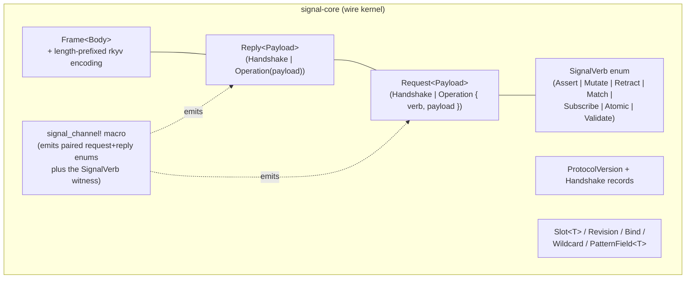
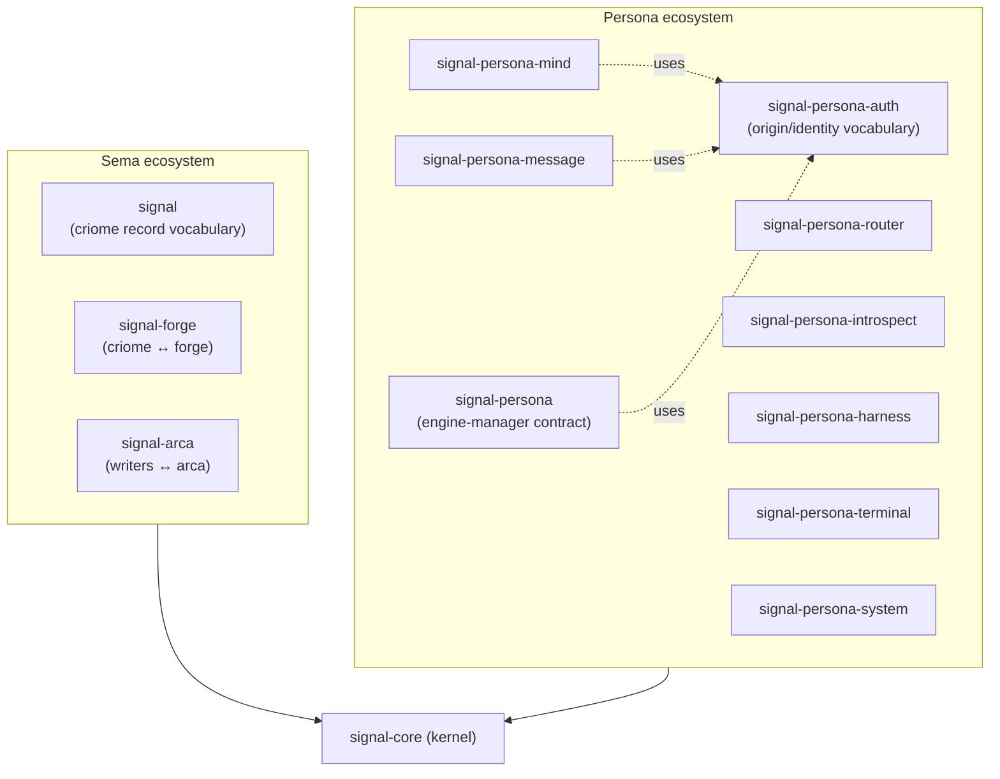

# 164 — Signal-Core vs Signal, and the CLI-as-verb-wrapper intent

*Designer research-and-audit report, 2026-05-14. Names the kernel-vs-vocabulary
layering of `signal-core` and the `signal-*` family; restates the user's CLI
intent (every component's CLI is a thin wrapper that puts argv into exactly
one of the seven Signal verbs); audits how much of that intent the current
implementation reflects, what deviates, and what's missing. Operative
finding: the verb-as-grammar discipline is **structurally encoded** —
the `signal_channel!` macro auto-emits the per-variant `SignalVerb`
witness, and all eight `signal-persona-*` contracts use it. The CLIs
for `persona`, `mind`, `message`, `introspect`, and `system` already
match the thin-wrapper shape. Three gaps remain: (a) no
"engine-spawn" Assert on the engine-manager contract; (b)
`persona-router` and `persona-harness` have no CLI surface at all; (c)
`persona-terminal` ships nine command-shaped binaries instead of one
NOTA-record-in CLI.*

**Retires when:** the three gaps in §5 are closed (or each gap fires its
own dedicated design report). At that point this report's substance has
either migrated to the relevant `ARCHITECTURE.md` files or no longer
applies.

---

## 0 · TL;DR

The user's intent — *every component has its own CLI; every CLI is a thin
wrapper that constructs exactly one Signal frame carrying one of the seven
verbs; every cross-component message is one of those seven verbs* — is
**not aspirational**. It is the workspace's adopted direction, encoded in
multiple places:

| Surface | Where the intent lives | Status |
|---|---|---|
| Verb spine | `signal-core/src/request.rs` — seven-variant `SignalVerb` enum | Landed (commit `aa7a0d93`) |
| Verb-per-variant witness | `signal-core::signal_channel!` macro auto-emits `RequestPayload::signal_verb()` | Landed; used by every `signal-persona-*` contract |
| Domain-free wire kernel | `signal-core/ARCHITECTURE.md` §1 | Landed |
| Domain vocabularies layered on top | `signal-persona`, `signal-persona-mind`, `-message`, `-router`, `-harness`, `-terminal`, `-system`, `-introspect`, `-auth` | Landed |
| CLI as thin daemon client | `persona/ARCHITECTURE.md` §0 TL;DR ("the persona CLI is a thin daemon client … one NOTA request record in, one NOTA reply record out"); §2 "Command-line Mind" | Pattern declared; partially implemented |
| Seven-verb grammar (universality) | `reports/designer/162` (seven planets bijection); `reports/designer/163` (schema-as-data containment) | Landed as canonical decision |

**Signal vs Signal-Core** is the **kernel-vs-vocabulary** split. `signal-core`
owns the wire kernel: `Frame`, handshake, `SignalVerb` enum, generic
`Request<Payload>` / `Reply<Payload>` envelopes, `Slot<T>` / `Revision`
identity records, `PatternField<T>` markers, and the `signal_channel!`
macro that ties them together. Every domain `signal-*` crate depends on
`signal-core` and supplies one channel's request/reply *payloads*; the
kernel is domain-free.

**Implementation reflects the intent strongly on the contract side, partially
on the CLI side**:

- **Contract side (excellent).** All eight `signal-persona-*` channels
  invoke `signal_channel!` with the new compile-checked syntax
  `request Foo { Assert Variant(Payload), Match Other(Q), … }`. The
  macro emits the per-variant `SignalVerb` mapping. No contract can
  decline to declare its verbs without failing to compile.
- **CLI side (mixed).** Five of eight components ship a thin-verb-wrapper
  CLI matching the intent (`persona`, `mind`, `message`, `introspect`,
  `system`). Two components ship daemon-only and have no CLI for
  debugging/testing (`persona-router`, `persona-harness`). One
  component ships **nine specialised command-shaped binaries** that
  predate this discipline (`persona-terminal`: `-capture`, `-send`,
  `-type`, `-view`, `-sessions`, `-resolve`, `-signal`, `-supervisor`,
  plus the daemon).
- **Engine-manager gap.** `signal-persona` (the management contract for
  the top-level `persona` engine) carries only four operations: two
  `Match` queries (engine status, component status) and two `Mutate`
  operations (component startup, component shutdown). There is **no
  `Assert` verb for spawning a new engine instance and adding it to the
  manager's catalog.** The user's intent ("if we want to create a new
  engine, we have to send an Assert verb of a certain kind") names a
  real architectural hole.

The verb discipline is operating as intended in the contract layer; the
CLI layer is partially converted; the engine-manager contract has one
genuinely missing operation.

---

## 1 · Signal vs Signal-Core — the kernel-vs-vocabulary split

### 1.1 · What `signal-core` owns

`signal-core` is the **wire kernel** — domain-free, every consumer
depends on it.



The kernel knows nothing about messages, terminals, routers, mind state,
or any other domain. It owns:

- **The verb closed set** — seven variants, ordered, doc-commented.
- **The generic envelope** — `Request<Payload>` and `Reply<Payload>` are
  parameterised over the domain's payload enum.
- **The frame mechanics** — `Frame<Body>` with `encode_length_prefixed`
  and `decode_length_prefixed` (4-byte big-endian payload-length prefix,
  bytecheck-validated decode).
- **Handshake** — `HandshakeRequest`, `HandshakeReply`,
  `ProtocolVersion`, `SIGNAL_CORE_PROTOCOL_VERSION`,
  `HandshakeRejectionReason`.
- **Typed wire identity** — `Slot<T>`, `Revision`.
- **Pattern markers** — `Bind`, `Wildcard`, `PatternField<T>` for
  query/pattern values.
- **`signal_channel!` macro** — the boilerplate-emitting macro that
  takes per-channel request/reply enum declarations annotated with
  verbs, and emits both enums plus the per-variant `SignalVerb`
  mapping, plus `Frame` / `FrameBody` type aliases, plus the NOTA
  text codec, plus `From<Payload>` conversion impls.

### 1.2 · What `signal-*` crates own

Every `signal-*` crate is one domain's channel — a paired
request/reply vocabulary over `signal-core`'s envelope.



A repository named **`signal`** (without prefix) is the *base contract for
the sema ecosystem* — record kinds for the criome flow-graph (`Node`,
`Edge`, `Graph`, `RelationKind`, `Records`). A repository named
**`signal-<consumer>`** is a *layered contract for one consumer* — its
own per-verb payloads (e.g. `signal-forge`, `signal-arca`,
`signal-persona-mind`).

The distinction the user is asking about — **Signal vs Signal-Core** — is
the *kernel* split that emerged when `signal` (the sema ecosystem
contract) became home to records that didn't belong to a second domain
(`signal-persona`). Per `skills/contract-repo.md` §"Kernel extraction
trigger" (when two or more domains share the kernel, extract the kernel
into its own crate), the wire kernel moved into `signal-core`; `signal`
stayed as the sema-ecosystem vocabulary.

### 1.3 · How the layering reads

| Crate | Layer | Owns |
|---|---|---|
| `signal-core` | **Kernel** | `Frame`, `SignalVerb`, generic `Request<P>`/`Reply<P>`, handshake, `signal_channel!` macro, wire identity primitives. Domain-free. |
| `signal` | Vocabulary | Sema-ecosystem record kinds (`Node`, `Edge`, `Graph`, `AssertOperation`, `MutateOperation`, etc.). |
| `signal-persona` | Vocabulary | Engine-manager contract (`EngineRequest`/`EngineReply`, `SpawnEnvelope`, `EngineStatus`). Plus the supervision contract (`SupervisionRequest`/`SupervisionReply`) in a submodule. |
| `signal-persona-auth` | Vocabulary (sub-kernel) | Cross-component origin/identity primitives (`ComponentName`, `EngineId`, `ChannelId`, `ConnectionClass`, `MessageOrigin`). Every other `signal-persona-*` contract depends on it. |
| `signal-persona-<X>` | Vocabulary | One Persona channel (mind, message, router, harness, terminal, system, introspect). |

The **kernel** is what `signal-core` is. The **vocabularies** are what
"Signal" is in the broader sense — Sema's, Persona's, Forge's, Arca's.
Every wire path in the workspace is one channel from one vocabulary
crate, over the kernel.

---

## 2 · The seven-verb spine as universal grammar

The verb spine in `signal-core` is the **closed root-operation set** for
every channel in every vocabulary. The seven roots, per
`signal-core/src/request.rs`:

| Verb | One-line meaning | Boundary behaviour kind |
|---|---|---|
| `Assert` | Permanently mark a new fact or record | durable write |
| `Mutate` | Change an existing fact at stable identity | durable write |
| `Retract` | Remove a fact while preserving history | durable write |
| `Match` | Return a finite reflection of stored state | base read |
| `Subscribe` | Register interest in future reflections of stored state | streaming lifecycle |
| `Atomic` | Execute a group of operations under one commit boundary | transaction boundary |
| `Validate` | Check a candidate operation against a declared rule set | execution mode (dry-run) |

The closure is exhaustive per the four research streams synthesized in
`reports/designer/162` (database / linguistics / astrology / workspace
archeology — all four converged on the same seven). The bijection with
the seven classical planets (Mars/Sun/Saturn/Moon/Mercury/Jupiter/Venus)
is documented there as the universality check the user asked for.

`reports/designer/163` closed the falsifiable eighth-verb question — DDL
operations fit cleanly inside the seven via the schema-as-data
containment rule (the catalog is a typed table; `CREATE TABLE` is an
`Assert` on the catalog).

The five demoted names (`Constrain`, `Project`, `Aggregate`, `Infer`,
`Recurse`) live in `sema-engine`'s `ReadPlan<R>` as **operators inside**
`Match` / `Subscribe` / `Validate` payloads — query algebra, not
boundary roots. `signal-core` does not see them.

### 2.1 · The wire grammar

Every operation frame on every Signal wire has this exact shape:

```text
Frame {
  body: FrameBody::Request(
    Request::Operation {
      verb: SignalVerb,        // one of the seven
      payload: DomainPayload,  // one variant of a domain channel's request enum
    }
  )
}
```

Or `Frame::Handshake(...)` at connection open. Nothing else.

The verb says **what kind of boundary act this is**. The payload says
**what the act is being applied to**. The seven cover every boundary
act; the payload enum covers every domain-specific noun.

---

## 3 · The CLI-as-thin-verb-wrapper intent

### 3.1 · The user's framing (restated)

The user named the intent in this session:

1. **Every component has its own CLI** for debugging and testing.
2. **Each CLI is a thin wrapper** — it constructs exactly one
   `Request<Payload>` and prints exactly one `Reply<Payload>`.
3. **Each request the CLI sends is one of the seven Signal verbs** —
   the CLI's job is to translate argv into one verb-tagged frame.
4. **Each component daemon owns its own sub-vocabulary** of `Assert`
   variants, `Match` variants, etc. — what a `mind`-side `Assert`
   actually carries is mind-specific.
5. **The `persona` engine manager itself has a CLI** with verbs for
   creating engines, listing them, supervising them.

This is the operational implication of the seven-verb spine: if Signal
is the workspace's universal verb-grammar for inter-component
communication, then every entry point into Signal — including the
command-line surface humans and harnesses use — should speak the same
grammar.

### 3.2 · The pattern is already canonical

The intent is **already declared** in `persona/ARCHITECTURE.md` (the
apex Persona architecture):

> *"The `persona` CLI is a thin daemon client. It decodes one NOTA
> request record, sends one length-prefixed `signal-persona` frame to
> `persona-daemon`, waits for one typed reply frame, renders one NOTA
> reply record, and exits. `persona-daemon` owns the live Kameo
> `EngineManager` actor for the daemon lifetime."*

And again for `mind` in §2:

> *"The first foundational implementation target is the command-line
> mind backed by a long-lived `persona-mind` daemon. The target
> surface: `mind '<one NOTA request record>'`. Output: `<one NOTA
> reply record>`."*

And the rejection list in §0.5 §"Persona — the durable agent" names the
exact failure mode the pattern rejects:

> *"**One-shot agent CLIs with no persistent state** → Long-lived
> daemons. CLIs are thin clients to the daemons."*

So the user is asking whether the implementation actually matches the
declared intent. The answer below is: **mostly yes for contracts;
partially for CLIs; one genuine gap on engine spawning.**

### 3.3 · The pattern's shape

```mermaid
flowchart LR
    argv["argv / stdin"] --> cli["component CLI binary"]
    cli --> decode["NOTA decode<br/>(or argv → struct)"]
    decode --> typed["typed Request&lt;DomainPayload&gt;<br/>verb attached via signal_channel!"]
    typed --> rkyv["rkyv encode (length-prefixed)"]
    rkyv --> sock["component daemon socket<br/>(Unix domain, 0600 / 0660)"]
    sock --> daemon["component daemon<br/>(Kameo actor root)"]
    daemon --> reply["typed Reply&lt;DomainPayload&gt;"]
    reply --> rkyv2["rkyv decode (length-prefixed)"]
    rkyv2 --> nota["NOTA encode"]
    nota --> stdout["stdout (one record)"]
```



Every CLI is the left-half of this diagram. Every daemon is the
right-half. The CLI never holds state; the daemon never holds the human
input parser.

---

## 4 · Implementation audit — contracts, CLIs, engine manager

### 4.1 · Contract verb-mapping audit

**Every `signal-persona-*` contract uses `signal_channel!` and declares
its verb for every request variant.** This is the strongest part of the
implementation.

| Contract crate | `signal_channel!` used? | Request variants | Verb distribution |
|---|---|---|---|
| `signal-persona` (engine manager) | Yes (`EngineRequest` + `SupervisionRequest`) | 4 + 4 = 8 | Engine: 2 Match, 2 Mutate. Supervision: 3 Match, 1 Mutate. |
| `signal-persona-mind` | Yes | 24 | 13 Assert, 3 Mutate, 2 Retract, 4 Match, 2 Subscribe |
| `signal-persona-message` | Yes | 3 | 2 Assert, 1 Match |
| `signal-persona-router` | Yes | 3 | 3 Match |
| `signal-persona-introspect` | Yes | 4 | 4 Match |
| `signal-persona-harness` | Yes | 4 | 2 Assert, 1 Retract, 1 Match |
| `signal-persona-terminal` | Yes | 12 | 5 Assert, 1 Mutate, 3 Retract, 2 Match, 1 Subscribe |
| `signal-persona-system` | Yes | 4 | 1 Subscribe, 1 Retract, 2 Match |
| **Total** | **8 of 8** | **62** | 22 Assert · 6 Mutate · 7 Retract · 21 Match · 4 Subscribe · 0 Atomic · 0 Validate |

The macro's compile-checked syntax — `request MindRequest { Assert
SubmitThought(SubmitThought), Match QueryThoughts(QueryThoughts), … }`
— makes verb declaration **structurally unavoidable**. A contract author
who omits the verb gets a parse error from the macro; a contract author
who picks the wrong verb produces a witness test that fails. The
operator-task on `SemaVerb → SignalVerb` rename from the prior session
has fully landed — no remaining `SemaVerb` references in any contract
crate (verified by grep across all eight).

`Atomic` and `Validate` are unused by current contracts; both are
load-bearing for the eventual schema-migration and dry-run flows but
have no consumers today. Their seats are reserved per
`reports/designer/163`.

### 4.2 · CLI surface audit

Five of eight Persona components ship a thin-wrapper CLI today; two
ship daemon-only; one ships an inherited multi-binary CLI surface.

| Component | CLI binary | Shape | Notes |
|---|---|---|---|
| `persona` (engine manager) | `persona` | **Canonical thin wrapper.** `src/main.rs` reads argv → `CommandLine::decode_request()` → `request.into_engine_request()` → submits via `PersonaClient` → prints typed reply as NOTA. | 4 NOTA record kinds (`EngineStatusQuery`, `ComponentStatusQuery`, `ComponentStartup`, `ComponentShutdown`) — same as the contract. |
| `persona-mind` | `mind` | **Thin wrapper.** Argv is either `daemon …` (start the daemon) OR a NOTA `MindRequest` record. The text-decode goes through `MindTextRequest` for human ergonomics, then `into_request()` to typed `MindRequest`, then `MindClient::submit()`. | The `daemon` subcommand is a mix-of-modes — the CLI also acts as launcher for its own daemon. Minor smell; documented as cutover glue per `protocols/orchestration.md`. |
| `persona-message` | `message` | **Thin wrapper.** `Input` enum (`Send` / `Inbox`) with `into_message_request()` per variant → `SignalMessageSocket::client().submit()` → `Output` printed as NOTA. | Two NOTA record kinds: `Send` (→ `Assert MessageSubmission`) and `Inbox` (→ `Match InboxQuery`). |
| `persona-introspect` | `introspect` | **Thin wrapper.** Argv is empty (default `PrototypeWitness` query) or one NOTA record. → `IntrospectionRequest` → `IntrospectionSocket::client().submit()`. | Currently only one variant exercised; Slice 2 expands to the four-variant contract. |
| `persona-system` | `system` | **Thin wrapper.** `system` CLI binary alongside `persona-system-daemon`. | Skeleton mode per `reports/active-repositories.md`; backend deferred. |
| `persona-router` | *(none)* | **Daemon-only.** Only `persona-router-daemon`. | The router doesn't expose itself for direct CLI access today; clients reach the router via `message` or `mind` adjudication. Debugging requires going through a peer. |
| `persona-harness` | *(none)* | **Daemon-only.** Only `persona-harness-daemon`. | Same shape: no CLI for `harness` testing without going through router/terminal. |
| `persona-terminal` | *(9 binaries)* | **Command-shaped, not verb-shaped.** Nine separate binaries: `persona-terminal-capture`, `-send`, `-type`, `-view`, `-sessions`, `-resolve`, `-signal`, `-supervisor`, plus `-daemon`. Each binary is one command. | This is the **largest deviation** from the thin-wrapper pattern. The contract has 12 verb-tagged request variants; the CLI surface fragments them across nine bespoke binaries instead of one `terminal '<one NOTA record>'` CLI. |

The user's intent ("every component should have its own CLI for
debugging and testing") is **realised cleanly** for five of eight
components, **absent** for two, and **deviating** for one.

### 4.3 · Engine-manager verb-mapping — and the gap

The `signal-persona::EngineRequest` channel is the contract for talking
to the top-level `persona` engine manager. It has exactly four
variants:

```text
EngineRequest:
  Match  EngineStatusQuery       — read whole-engine status
  Match  ComponentStatusQuery    — read one component's status
  Mutate ComponentStartup        — start a component within an engine
  Mutate ComponentShutdown       — stop a component within an engine
```

Compared to the user's stated intent — *"if we want to create a new
engine, we have to send an Assert verb of a certain kind. And the main
Persona component is going to have its own types of action in the
assert subcategory to create a new engine, to run a new one and add it
to its index of engines that it is currently running and aware of and
managing and supervising"* — the gap is concrete:

| User-intent operation | Wire verb | Today's contract |
|---|---|---|
| Create / spawn a new engine | `Assert EngineLaunch(…)` (or `EngineAdoption`) | **Missing.** |
| List engines in catalog | `Match EngineList(…)` | **Missing.** (`EngineStatusQuery` returns whole-engine status but only for *the* engine the query targets; there's no catalog listing.) |
| Retire / shutdown an engine | `Retract EngineRetirement(…)` | **Missing.** |
| Start a component within an engine | `Mutate ComponentStartup` | Present. |
| Stop a component within an engine | `Mutate ComponentShutdown` | Present. |
| Read engine status | `Match EngineStatusQuery` | Present. |
| Read one component's status | `Match ComponentStatusQuery` | Present. |

The manager's redb (`/var/lib/persona/manager.redb`) already names
"engine catalog: engine identities, owners, component desired state,
lifecycle observations, and inter-engine route declarations" (per
`persona/ARCHITECTURE.md` §1.5). The catalog exists on the storage
side; the wire side has no `Assert`/`Match`/`Retract` for catalog rows.

The discipline the user articulated is **exactly** the schema-as-data
containment rule of `reports/designer/163`: the engine catalog is just
another table; spawning an engine is an `Assert` on the catalog;
retiring an engine is a `Retract`. The missing operations would land as
new variants on `EngineRequest`:

```text
EngineRequest (proposed additions):
  Assert  EngineLaunch(EngineLaunchProposal)     — spawn + register a new engine
  Match   EngineCatalog(EngineCatalogQuery)      — list known engines
  Retract EngineRetirement(EngineRetirement)     — retire an engine
```

The verb mapping is mechanical; the work is naming the typed payload
shapes and the manager-side reducer.

---

## 5 · Gaps and recommendations

### 5.1 · No engine-spawn / catalog / retirement verbs on `signal-persona`

**Status**: Real architectural hole. The contract carries
component-within-engine operations but no engine-level operations.

**Recommendation**: Add three variants to `signal-persona::EngineRequest`
per §4.3, with corresponding reply variants. The payload shapes need
naming (e.g. `EngineLaunchProposal { owner: Uid, label: EngineLabel,
launch_spec: EngineLaunchSpec }`). This is a designer-shaped task; the
shapes should land in a follow-up report or via operator review against
a draft.

**Witness for the new constraint** (per
`skills/architectural-truth-tests.md`): a test that opens a fresh
`manager.redb`, sends `Assert EngineLaunch(…)` through the wire, and
asserts (a) the engine appears in the catalog table; (b) the engine's
component supervisors all reach `Ready`; (c) the spawn-envelope file
exists at the expected per-engine path.

### 5.2 · `persona-router` and `persona-harness` have no CLI

**Status**: Two components diverge from the user's "every component has
its own CLI" intent. Today the only way to talk to either is through a
peer (router via `message` CLI; harness via router-side adjudication).

**Recommendation**: Add `router` and `harness` CLI binaries, each a thin
wrapper around the corresponding contract. Specifically:

| Proposed CLI | Wraps | Sample invocations |
|---|---|---|
| `router` | `RouterRequest` (3 variants today, all `Match`) | `router '(RouterSummaryQuery (engine engineId))'`, `router '(RouterMessageTraceQuery …)'`, `router '(RouterChannelStateQuery …)'` |
| `harness` | `HarnessRequest` (4 variants: 2 Assert, 1 Retract, 1 Match) | `harness '(HarnessStatusQuery (harness harnessName))'`, `harness '(MessageDelivery …)'` for test injection, etc. |

These are small additions; the contracts already exist. The pattern is
exactly the `introspect` CLI's shape: `src/main.rs` calls
`<Cli>CommandLine::from_env().run(stdout)`; the command module decodes
argv to a `Request` variant, submits via the daemon socket, prints the
reply.

**Witness**: round-trip test per CLI — argv → NOTA → typed
`<X>Request` → frame → daemon → typed `<X>Reply` → NOTA → stdout. This
is the same test shape every other CLI has.

### 5.3 · `persona-terminal` — converge 9 binaries onto one `terminal` CLI

**Status**: Largest deviation from the pattern. The terminal contract
already names 12 verb-tagged variants; the CLI surface fragments them
across nine bespoke command-shaped binaries (`persona-terminal-capture`,
`-send`, `-type`, `-view`, etc.). Each binary is one command; none of
them lower the user's argv into a typed `TerminalRequest` variant in
the way `message` lowers argv into `MessageRequest`.

**Recommendation**: Land one `terminal` CLI binary that takes one NOTA
record (or argv-sugared shorthand) and lowers to one
`TerminalRequest` frame. The nine existing binaries either deprecate
or wrap the new shape during cutover.

This is the same shape change `mind` already underwent (per
`reports/designer/162 §9` — the rename + thin-wrapper conversion).

**Witness**: round-trip test against each of the 12 terminal request
variants.

### 5.4 · `mind` CLI's `daemon` subcommand mix

**Status**: Minor smell. The `mind` CLI accepts either `mind daemon
[options]` (start the long-lived daemon) or `mind '<NOTA record>'`
(thin client mode). The branching at `into_action()` checks whether
the first argument is `daemon` and routes accordingly.

**Recommendation**: This is documented cutover glue (per
`protocols/orchestration.md` §"Command-line mind target"). The
`tools/orchestrate` shell helper currently launches the daemon; once
that helper retires, the daemon will start under systemd and the
`mind` CLI will be pure client. The current shape is intentional; no
action needed.

---

## 6 · Falsifiability

The seven-verb intent is falsified if any of the following becomes true.
Each names a concrete observation that, if it landed in the codebase,
would force a redesign:

| Falsifier | Implication |
|---|---|
| A contract crate emits a request variant **without** declaring its `SignalVerb` (the macro is bypassed). | The structural enforcement has failed; either the macro is missing a case or a consumer is reaching past it. Investigate. |
| A CLI sends a request frame that resolves to **two different `SignalVerb`s** depending on runtime data (the verb is not statically determined by the variant). | The verb-per-variant invariant has broken; verbs would have to be runtime-tagged separately. |
| A request payload exists that **honestly fits none of the seven verbs and none of the resolutions in `/163 §5`** (proposal-and-recompile, multi-version+translators, `ReadPlan` decomposition). | The eighth-verb question reopens; `reports/designer/163` is superseded. |
| The `persona` engine manager grows engine-level operations **outside** the seven-verb spine (e.g. a separate "spawn" channel with its own non-`SignalVerb` enum). | The verb-as-universal-grammar intent has broken at the apex. |
| A component daemon accepts traffic that bypasses Signal frames entirely (raw text, JSON, ad-hoc bytes). | The single-wire-grammar invariant has broken. |

None of these are present today. The first four are watch-list items;
the fifth is rejected by every contract's `signal_channel!` use.

---

## 7 · The relationship to the user's planetary universality framing

`reports/designer/162 §2` records the bijective mapping between the
seven Signal verbs and the seven classical planets (Mars→Assert,
Sun→Mutate, Saturn→Retract, Moon→Match, Mercury→Subscribe,
Jupiter→Atomic, Venus→Validate) — the universality check the user
requested in the prior session.

Two readings of that mapping:

- **The verbs work.** A two-thousand-year-old typology (the seven
  classical planets) maps cleanly onto the seven boundary operations a
  modern database engine needs. The convergence is independent
  corroboration that the engineering decision found a natural
  cardinality.
- **The mapping is observable, not generative.** The verbs were chosen
  on database-operation grounds (per `/162 §1`); the planetary
  correspondence is an after-the-fact universality check, not the
  source. `/162 §3` notes two planet-suggested name refinements
  (`Atomic→Bind`, `Validate→Assay`) and defers them — CS convention
  has weight.

The CLI-as-verb-wrapper intent makes the universality concrete at the
human surface: every CLI command the user or a harness types lowers
into one of seven boundary acts. The grammar is the same at the wire
and at the hand.

---

## 8 · See also

Permanent surfaces (the substance lives here; this report is the audit
synthesis):

- `/git/github.com/LiGoldragon/signal-core/ARCHITECTURE.md` — the wire
  kernel; what `signal-core` owns and does not own.
- `/git/github.com/LiGoldragon/signal-core/src/request.rs` — the
  seven-variant `SignalVerb` enum, `Request<Payload>`,
  `RequestPayload` trait, and the deliberately-named
  `unchecked_operation` escape hatch.
- `/git/github.com/LiGoldragon/signal-core/src/channel.rs` — the
  `signal_channel!` macro; the compile-checked
  `request Foo { Assert Variant(Payload), … }` syntax that emits the
  per-variant verb witness.
- `/git/github.com/LiGoldragon/signal/ARCHITECTURE.md` — the
  sema-ecosystem record vocabulary layered atop `signal-core`.
- `/git/github.com/LiGoldragon/persona/ARCHITECTURE.md` §0 TL;DR, §1.5
  "Engine Manager Model", §2 "Command-line Mind", §3 "Wire Vocabulary"
  — the apex Persona architecture that names the thin-wrapper CLI
  pattern and the engine-manager contract surface.
- `/git/github.com/LiGoldragon/persona-mind/ARCHITECTURE.md` — the
  central mind component (which carries the largest contract surface,
  24 request variants).
- `~/primary/skills/contract-repo.md` §"Signal is the database language
  — every request declares a verb" — the discipline this audit
  verifies; §"Kernel extraction trigger" — the architectural move that
  produced `signal-core`.
- `~/primary/protocols/active-repositories.md` — the workspace's
  active-repo map; the current-truth pins on Signal and Sema.
- `~/primary/reports/designer/162` — the verb-spine synthesis (seven
  roots, planetary bijection, naming refinements).
- `~/primary/reports/designer/163` — the seven-only adoption (schema
  as data, no `Structure` eighth verb), with the proposal-and-recompile
  and multi-version+translator resolutions for the falsifiability
  conditions.
