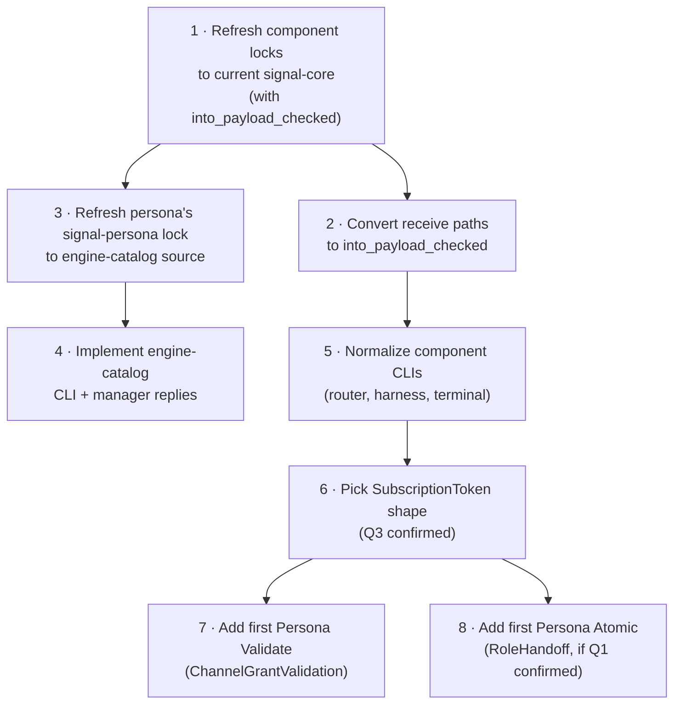

# 165 — Verb coverage across every Persona component

*Designer research-and-proposal report, 2026-05-14. Continues `/164`'s
audit by working through every component's external Signal surface,
mapping the implemented variants and the imagined-but-missing operations
each component will need as it matures, and naming the verb each
operation fits. Surfaces open questions where the user's intent is
load-bearing for the answer.*

**This report has been corrected against designer-assistant's parallel
audit `~/primary/reports/designer-assistant/54-verb-coverage-implementation-and-design-audit.md`**
(an explicit recount of active source, plus cross-domain awareness of
`sema-engine` and `signal-criome`). The original draft missed three
load-bearing facts: the engine-catalog verbs are already landed on
`signal-persona` active source; `Atomic` and `Validate` are unused
*only in `signal-persona-*` contracts* — `sema-engine` has the
reference library implementation, `signal-criome` has the first
contract consumer; and the workspace-wide correctness gap is on the
*receiver side* — most components destructure `Request::Operation
{ payload, .. }` and discard the verb, bypassing
`Request::into_payload_checked`. The headline-question list narrows
to **two** after these corrections.

**Retires when**: the two narrowed open questions in §4 are resolved,
and the receiver-validation discipline lands across every component
transport. At that point this report has been absorbed into the ARCH
layer and the contract crates.

---

## 0 · TL;DR

The seven-verb spine (`Assert`, `Mutate`, `Retract`, `Match`,
`Subscribe`, `Atomic`, `Validate`) covers every cross-component
operation Persona has today and every operation it plausibly needs.
**No new verb is needed**; the gaps are missing *payload variants*
inside the existing verbs, not missing root verbs.

Current count across all eight `signal-persona-*` contracts in active
source (per designer-assistant `/54 §1`) is **65 request variants**:

| Verb | Count | Use |
|---|---|---|
| `Assert` | 21 | New facts: messages, role claims, work items, prompts, terminal input, channel grants, engine launches. |
| `Mutate` | 7 | State transitions at stable identity: handoffs, status changes, channel extensions, component lifecycle. |
| `Retract` | 8 | Withdrawals: role releases, channel retractions, gate releases, engine retirements, focus unsubscribe. |
| `Match` | 25 | One-shot reads: status queries, inbox queries, observation queries, snapshots, engine catalog. |
| `Subscribe` | 4 | Live streams: thoughts, relations, focus, terminal worker lifecycle. |
| `Atomic` | 0 in `signal-persona-*`; **reference impl in `sema-engine::AtomicBatch`** | Library-layer engine-side implementation lands; no Persona-domain contract consumer yet. |
| `Validate` | 0 in `signal-persona-*`; **`sema-engine::Engine::validate` lands; `signal-criome::Validate VerifyAttestation` is the first contract use** | Two existing footholds outside Persona; no Persona-domain contract consumer yet. |
| **Total** | **65** | |

The **engine-catalog gap from `/164`'s recommendation has closed in
active source** — `signal-persona`'s `EngineRequest` now declares
`Assert EngineLaunchProposal`, `Match EngineCatalogQuery`,
`Retract EngineRetirement`. Operator-assistant is implementing the
manager-side consumers; the `persona` runtime still locks to a
pre-engine-catalog commit and needs a lock refresh.

Proposed additions (mostly `Subscribe` variants replacing poll-shaped
`Match`, plus a few `Atomic` / `Validate` candidates) total roughly
**30 new variants** across the eight components.

**The narrowed user-attention questions** (also in the chat reply):

1. **First Persona-domain `Atomic`** — designer-assistant proposes
   `signal-persona-mind::RoleHandoff` as atomically `Retract` old claim
   + `Assert` new claim under one snapshot, replacing today's opaque
   single `Mutate`. The question is whether `RoleHandoff` is honestly
   two-facts-under-one-snapshot, or one transition. Concur with
   designer-assistant pending your read of the domain.
2. **Subscribe-lifecycle pattern** — three patterns coexist;
   designer-assistant proposes pattern B (one contract-local
   `Retract SubscriptionRetraction(SubscriptionToken)` per contract,
   addressing by token). Requires a `SubscriptionToken` primitive that
   subscription replies return. Concur, pending confirmation.

Four other questions (`Validate`'s first use, engine adoption-vs-creation,
ReadPlan at the CLI, `persona-terminal`'s nine binaries) have
designer-assistant answers in `/54 §5` that I concur with — not
blocking, but documented in §4 below so you can object if a
recommendation feels wrong.

Three second-tier questions (Q7–Q10) defer until concrete-consumer
pressure surfaces them.

---

## 1 · The exhaustive-coverage discipline

The verb-as-grammar discipline is structural: **every cross-component
operation in Persona is one of seven verbs**. The seven cover boundary
behavior comprehensively (per `reports/designer/162` and `/163` — the
synthesis + containment-rule decision). Specialised signals don't
escape into a different verb shape; they become typed payloads inside
the seven.

What "specialised" means in practice — operations that *feel* domain-
specific (a terminal-cell PTY resize, a Wi-Fi profile rotation, a
quorum-signature attestation, a cross-engine handshake) are all
specialised *payloads*. The boundary behavior is always one of seven
kinds:

- *Durable write a new thing* → `Assert`
- *Change an existing thing at stable identity* → `Mutate`
- *Retract / remove a thing* → `Retract`
- *Read what's stored* → `Match`
- *Watch for changes over time* → `Subscribe`
- *Bundle several operations under one commit* → `Atomic`
- *Dry-run, check against rules, don't commit* → `Validate`

The discipline applies to every component the workspace has and every
component it will have. New components join by declaring a
`signal-persona-<X>` contract with `signal_channel!` and tagging each
variant with its verb. The macro enforces the discipline at compile
time.

The exhaustive-coverage test: walk every operation a component
performs across its boundary. Every one fits into exactly one verb.
If one doesn't fit, the seven-verb closure is falsified and a designer
report names the missing verb. None has surfaced yet (per `/163 §5`'s
resolved falsifiability conditions).

The rest of this report applies that test to every existing component
and proposes the verb each unimplemented operation should fit into.

---

## 2 · Per-component analysis

Each subsection has:
- **Implemented variants** — what the contract declares today, with
  verb tags.
- **Missing or proposed variants** — operations the component will
  need as it matures, with the verb each fits into.
- **Open questions** — uncertainties surfaced by walking the surface.

### 2.1 · `signal-persona` (engine manager)

Owns the apex contract — the `persona` daemon's boundary. Two channels:
`EngineRequest` (client → manager) and `SupervisionRequest` (manager →
supervised child). **Active source has the engine-catalog verbs
landed** (the gap from `/164 §4.3` is closed in source); the `persona`
runtime is locked to a pre-catalog commit and needs to advance to
consume them (per `/54 §4.1`).

**Implemented today in active source** (7 + 4 = 11):

| Channel | Verb | Variant | Boundary use |
|---|---|---|---|
| Engine | `Assert` | `EngineLaunchProposal` | Spawn + register a fresh engine in the manager's catalog. |
| Engine | `Match` | `EngineCatalogQuery` | List engines known to this manager. |
| Engine | `Retract` | `EngineRetirement` | Retire an engine. |
| Engine | `Match` | `EngineStatusQuery` | Read whole-engine status. |
| Engine | `Match` | `ComponentStatusQuery` | Read one component's status. |
| Engine | `Mutate` | `ComponentStartup` | Transition a component's desired state to Running. |
| Engine | `Mutate` | `ComponentShutdown` | Transition a component's desired state to Stopped. |
| Supervision | `Match` | `ComponentHello` | Component announces identity to manager. |
| Supervision | `Match` | `ComponentReadinessQuery` | Manager probes child readiness. |
| Supervision | `Match` | `ComponentHealthQuery` | Manager probes child health. |
| Supervision | `Mutate` | `GracefulStopRequest` | Manager asks child to drain and stop. |

**Missing / proposed**:

| Verb | Proposed variant | Rationale |
|---|---|---|
| `Assert` | `EngineAdoptionProposal` | Adoption is structurally separate from launch (different provenance, different failure modes). Per `/54 §5 Q4` and §4 Q4 below: two distinct `Assert` variants, not one union payload. |
| `Atomic` | `EngineUpgrade(EngineUpgradePlan)` | Multi-step commit: spawn engine v2 → migrate state via channels → retire engine v1. Per persona ARCH §1.6.5. Designer-assistant `/54 §4.2` flags this as a *better long-term* `Atomic` but **not** the right first implementation — depends on multi-engine federation. Concur. |
| `Subscribe` | `EngineHealthStream(EngineHealthFilter)` | Push-not-pull replacement for status polling. |
| `Subscribe` | `ComponentHealthStream(ComponentHealthFilter)` | Per-component health stream. |
| `Assert` | `EngineRoute(EngineRouteProposal)` | Cross-engine routing (per ARCH §1.6.4). |
| `Retract` | `EngineRouteRetraction(EngineRouteRetraction)` | Withdraw a route. |

On the supervision channel:

| Verb | Proposed variant | Rationale |
|---|---|---|
| `Subscribe` | `ComponentLifecycle(ComponentLifecycleFilter)` | Manager subscribes to lifecycle events from each child rather than polling readiness/health. |
| `Atomic` | `CoordinatedShutdown(CoordinatedShutdownPlan)` | All-components-stop-in-order, as one commit (avoid half-drained state on engine retirement). |

**Open questions surfaced**:

- Q4 (designer-assistant answered): adoption-vs-creation — two distinct
  `Assert` variants. Concur.
- Q1 (chat-surfaced): `EngineUpgrade` is deferred — not the right first
  `Atomic`. See §3.1.

### 2.2 · `signal-persona-mind`

The largest contract surface in Persona — 24 variants — because mind is
the central state component (per persona ARCH §0: "the center of agent
state is `persona-mind`").

**Implemented today** (24): see `/164 §4.1` for the table. Distribution:
11 Assert, 3 Mutate, 2 Retract, 6 Match, 2 Subscribe.

Domains covered: thoughts/relations (sema-graph substrate), role
coordination (claim/release/handoff), activity log, work memory
(opening/note/link/status/alias/query), channel choreography
(grant/extend/retract/list, adjudication request/deny).

**Missing / proposed**:

| Verb | Proposed variant | Rationale |
|---|---|---|
| `Atomic` | `ClaimHandoff(...)` | Currently `RoleHandoff` is one `Mutate`; if the handoff atomically *retracts* role A's claim and *asserts* role B's claim (cleaner audit trail), this becomes an `Atomic` over `Retract` + `Assert` instead of an opaque `Mutate`. See §4 Q1 — possible first `Atomic` use. |
| `Retract` | `SubscriptionRetraction(SubscriptionToken)` or paired per-Subscribe `Retract` variants | Today `SubscribeThoughts` and `SubscribeRelations` have no explicit unsubscribe (closes implicitly on connection drop). Compare to `signal-persona-system`'s `Retract FocusUnsubscription`. See §4 Q3. |
| `Validate` | `ChannelGrantValidation(ChannelGrantProposal)` | Dry-run a channel grant: does it conflict with existing channels? Useful when mind's adjudicator wants to test a grant before committing. See §4 Q2. |
| `Validate` | `TypeProposalValidation(TypeProposal)` | Dry-run a `TypeProposal` (per `/163 §5.1` — proposal-and-recompile flow). When the flow lands, `Validate` is its natural first contract use. See §4 Q2. |
| `Match` | `ChannelEventLog(ChannelEventLogQuery)` | Read the channel event history (today only `ChannelList` exposes current channels; no historical access). |
| `Subscribe` | `RoleObservationStream(RoleObservationFilter)` | Push-not-pull replacement for the periodic `RoleObservation` poll. |
| `Subscribe` | `ActivityStream(ActivityFilter)` | Same — replace periodic activity-log polling. |

**Open questions surfaced**:

- Q1, Q2, Q3 (chat-surfaced) above.

### 2.3 · `signal-persona-message`

The sparsest contract — three variants:

**Implemented today** (3):

| Verb | Variant | Boundary use |
|---|---|---|
| `Assert` | `MessageSubmission` | A user submits a message to a recipient. |
| `Assert` | `StampedMessageSubmission` | Same, post-stamping by message-daemon. |
| `Match` | `InboxQuery` | One-shot inbox read. |

**Missing / proposed**:

| Verb | Proposed variant | Rationale |
|---|---|---|
| `Subscribe` | `InboxStream(InboxFilter)` | Push-delivery of new messages. Today the CLI is one-shot. A long-running harness wants live delivery, not poll. |
| `Mutate` | `MessageMarkRead(MessageSlot)` | Update read-state on a message. |
| `Retract` | `MessageDeletion(MessageSlot)` | Delete a message from the inbox. |
| `Atomic` | `BatchSubmission(Vec<MessageSubmission>)` | Submit many messages atomically (e.g. a batched harness output). |
| `Validate` | `MessageSubmissionValidation(MessageSubmission)` | Dry-run: would this message pass the recipient's filters / channel policy? |

**Open questions surfaced**: none specific; the gaps are standard
push-not-pull and CRUD-completion patterns.

### 2.4 · `signal-persona-router`

Intentionally observation-only — per persona ARCH §1.6.3 "**Mind
decides; router enforces.**" Operational writes (channel grants etc.)
live in `signal-persona-mind`, not here.

**Implemented today** (3):

| Verb | Variant | Boundary use |
|---|---|---|
| `Match` | `RouterSummaryQuery` | Read router summary stats. |
| `Match` | `RouterMessageTraceQuery` | Read one message's delivery trace. |
| `Match` | `RouterChannelStateQuery` | Read one channel's current state. |

**Missing / proposed**:

| Verb | Proposed variant | Rationale |
|---|---|---|
| `Subscribe` | `RouterEvents(RouterEventFilter)` | Push delivery / routing event stream for live observation (replaces any consumer polling RouterSummaryQuery). |
| `Match` | `RouteList(RouteListQuery)` | List active cross-engine routes (when federation lands). |

**Open questions surfaced**:

- (second-tier, §4 Q9) The router is intentionally pure-observation
  externally. Is that the long-term shape — i.e., **the router never
  has Assert/Mutate/Retract on its external surface**, with channel
  operations always going through mind? Confirming this keeps the
  router's contract well-bounded.

### 2.5 · `signal-persona-harness`

Bidirectional channel between router and harness. Router pushes
deliveries; harness pushes lifecycle/resolution events.

**Implemented today** (4):

| Verb | Variant | Direction | Boundary use |
|---|---|---|---|
| `Assert` | `MessageDelivery` | router → harness | Deliver a message through the harness's terminal. |
| `Assert` | `InteractionPrompt` | router → harness | Show a typed prompt and await a resolution. |
| `Retract` | `DeliveryCancellation` | router → harness | Cancel a pending delivery. |
| `Match` | `HarnessStatusQuery` | router → harness | Probe harness readiness. |

Note: the *reply* side carries `HarnessStarted`, `HarnessStopped`,
`HarnessCrashed` as events on the same channel — not yet a typed
Subscribe.

**Missing / proposed**:

| Verb | Proposed variant | Rationale |
|---|---|---|
| `Subscribe` | `HarnessLifecycle(HarnessLifecycleFilter)` | Make the lifecycle stream a first-class subscription rather than reply-events on a bidirectional channel. |
| `Atomic` | `DeliveryBatch(Vec<MessageDelivery>)` | Atomic batch of deliveries to a harness (preserves ordering on multi-message scenarios). |
| `Validate` | `DeliveryValidation(MessageDelivery)` | Dry-run a delivery: can the harness accept *now* (gate, prompt state)? Useful for the router's pre-flight before binding the input gate. |

**Open questions surfaced**: none specific.

### 2.6 · `signal-persona-terminal`

12 variants — the second-largest contract surface after mind.

**Implemented today** (12):

| Verb | Count | Variants |
|---|---|---|
| `Assert` | 5 | `TerminalConnection`, `TerminalInput`, `RegisterPromptPattern`, `AcquireInputGate`, `WriteInjection` |
| `Mutate` | 1 | `TerminalResize` |
| `Retract` | 3 | `TerminalDetachment`, `UnregisterPromptPattern`, `ReleaseInputGate` |
| `Match` | 2 | `TerminalCapture`, `ListPromptPatterns` |
| `Subscribe` | 1 | `SubscribeTerminalWorkerLifecycle` |

**Missing / proposed**:

| Verb | Proposed variant | Rationale |
|---|---|---|
| `Atomic` | `TerminalSetupBundle(...)` | Atomic: register prompt pattern + acquire gate + connect, on first session bring-up. Avoids race between connect and gate-arrival. |
| `Validate` | `WriteInjectionValidation(WriteInjection)` | Dry-run that an injection wouldn't conflict with human input *right now* without committing. |

**Open questions surfaced**:

- Q6 (chat-surfaced): the CLI surface for terminal — nine specialized
  binaries vs one `terminal` CLI. Wrap, replace, or keep alongside?

### 2.7 · `signal-persona-system`

OS-fact observation contract. Skeleton today; backend is Niri-only.

**Implemented today** (4):

| Verb | Variant | Boundary use |
|---|---|---|
| `Subscribe` | `FocusSubscription` | Start watching focus state. |
| `Retract` | `FocusUnsubscription` | Stop watching. |
| `Match` | `FocusSnapshot` | One-shot focus read. |
| `Match` | `SystemStatusQuery` | Read system daemon's backend status. |

**Missing / proposed**:

| Verb | Proposed variant | Rationale |
|---|---|---|
| `Subscribe` | `SystemBackendLifecycle(...)` | Push: backend started / stopped / degraded. |
| `Atomic` | `BackendTransition(BackendTransitionPlan)` | Coordinated switch between backends (e.g., Niri → Hyprland). One-shot, multi-step. |

Note: `signal-persona-system` **is the canonical example** of paired
Subscribe + Retract — `FocusSubscription` and `FocusUnsubscription` are
explicit. Other contracts should follow this pattern (see §3.3).

**Open questions surfaced**: none beyond the workspace-wide ones.

### 2.8 · `signal-persona-introspect`

Inspection-plane component. Today four `Match` variants; Slice 3 adds
Subscribe.

**Implemented today** (4):

| Verb | Variant | Boundary use |
|---|---|---|
| `Match` | `EngineSnapshot` | Whole-engine snapshot. |
| `Match` | `ComponentSnapshot` | One component's snapshot. |
| `Match` | `DeliveryTrace` | Trace one message's path. |
| `Match` | `PrototypeWitness` | Confirm prototype witness facts. |

**Missing / proposed**:

| Verb | Proposed variant | Rationale |
|---|---|---|
| `Subscribe` | `SubscribeComponent(ComponentSubscriptionFilter)` | Named in persona-introspect ARCH constraints as the Slice 3 addition. |
| `Subscribe` | `SubscribeEngineEvents(EngineEventFilter)` | Push: engine-level event stream. |
| `Subscribe` | `SubscribeDeliveryTrace(DeliveryTraceFilter)` | Push: live delivery trace stream. |
| `Retract` | `IntrospectionSubscriptionRetraction(SubscriptionToken)` | Paired with the new Subscribes. |

**Open questions surfaced**: none beyond the subscribe-lifecycle one.

---

## 3 · Cross-cutting verb-usage analysis

### 3.1 · `Atomic`'s first Persona-domain use

`Atomic` is the only multi-operation verb. **`sema-engine` already
implements it at the library layer** (per `/54 §4.2`):
`AtomicBatch<RecordValue>` with `Assert` / `Mutate` / `Retract`
sub-operations, preflight rejection (empty batch, duplicate keys,
missing targets), one operation-log entry tagged
`SignalVerb::Atomic`, one committed snapshot, post-commit subscription
deltas sharing the snapshot. This is the reference implementation for
`Atomic` semantics — Persona should not invent a different meaning.

The question is narrowed to **what's the first Persona-domain contract
payload that exposes an atomic operation across a Signal boundary?**
Candidates:

| Candidate | Component | Implementation cost | Load-bearing | Designer-assistant `/54` |
|---|---|---|---|---|
| `RoleHandoff` (atomic `Retract` old claim + `Assert` new claim) | persona-mind | Low | Cleaner audit trail; semantically honest | **Recommended first use** |
| `EngineUpgrade` | persona | High (multi-engine federation first) | Critical long-term, but premature first use | Defer |
| `SchemaMigration` over the engine catalog | persona-mind / sema-engine | High (proposal-and-recompile flow needs to land) | Critical for sema-version evolution | Defer |
| `BatchSubmission` | persona-message | Low | Optimization, not correctness | **Rejected** — makes `Atomic` look like batching, not correctness boundary |
| `TerminalSetupBundle` | persona-terminal | Low | Avoids first-bring-up races | Not surfaced |
| `CoordinatedShutdown` | persona (supervision) | Medium | Needed for clean engine retirement | Not surfaced |

Designer-assistant's reasoning is sound: choosing message batching as
the reference implementation would frame `Atomic` as an optimization
rather than a correctness boundary. `RoleHandoff` is the cheapest path
to "Atomic as semantically honest two-facts-under-one-snapshot."

**Concur — pending user confirmation that `RoleHandoff` is honestly
two-facts (the historic claim is retracted, a new claim is asserted)
rather than one transition.** See §4 Q1.

### 3.2 · `Validate`'s first Persona-domain use

`Validate` is **not unused globally** (per `/54 §4.3`):

- `sema-engine` has `Engine::validate(QueryPlan<_>)` returning a
  `ValidationReceipt` with `SignalVerb::Validate` (library-layer
  reference implementation).
- `signal-criome` already declares
  `Validate VerifyAttestation(VerifyRequest)` (the first contract
  consumer of `Validate` workspace-wide).

The question is narrowed to **what's the first Persona-domain contract
validation?**

| Candidate | Component | Use | Designer-assistant `/54` |
|---|---|---|---|
| `ChannelGrantValidation` | persona-mind | Dry-run that a proposed channel grant doesn't conflict with existing channels. | **Recommended first use** |
| `TypeProposalValidation` | persona-mind | Dry-run a `TypeProposal` before commit (per `/163 §5.1`). | Deferred (proposal flow not landed). |
| `SchemaCheck` (in `sema-engine`'s domain) | sema-engine | Pre-flight constraint check before migration. | Reserved for migration work. |
| `WriteInjectionValidation` | persona-terminal | Dry-run before injecting into a terminal. | "Useful but local." |
| `DeliveryValidation` | persona-harness | Dry-run a delivery. | "Belongs after delivery is wired enough that 'can accept now' has real data." |

Designer-assistant's reasoning: mind owns policy; router enforces. A
validation request lets an operator, agent, or future policy actor ask
mind what *would* happen before committing. Load-bearing for the
trust/channel model. **Concur** — `ChannelGrantValidation` is the
right first Persona-domain `Validate`.

### 3.3 · `Subscribe`-lifecycle inconsistency

Three patterns coexist today for "stop subscribing":

| Contract | Subscribe variant | Unsubscribe variant |
|---|---|---|
| `signal-persona-system` | `Subscribe FocusSubscription` | `Retract FocusUnsubscription` (explicit, paired) |
| `signal-persona-terminal` | `Subscribe SubscribeTerminalWorkerLifecycle` | (none — implicit on connection close) |
| `signal-persona-mind` | `Subscribe SubscribeThoughts` / `SubscribeRelations` | (none) |

Three patterns is two patterns too many. Either:

- **(A)** Every Subscribe variant has a paired `Retract` variant
  (mirrors `signal-persona-system`'s explicit shape).
- **(B)** Every contract crate has a *single* `Retract SubscriptionRetraction(SubscriptionToken)` variant covering all that contract's subscriptions.
- **(C)** Subscribes close implicitly on connection drop only (the
  current `mind` and `terminal` shape); no Retract variants.

Pattern (A) is the loudest at the contract level — every subscribe
declares its lifecycle explicitly. Pattern (B) keeps the contract
smaller. Pattern (C) is the simplest but coarsest. **Pick one** — see
§4 Q3.

### 3.4 · Read-plan algebra surfacing at the CLI

The five demoted operators (`Constrain`, `Project`, `Aggregate`,
`Infer`, `Recurse`) live in `sema-engine::ReadPlan<R>`, *inside*
`Match` / `Subscribe` / `Validate` payloads — not as root verbs.

**Question**: when a CLI user types a `Match` request, do they ever
construct a ReadPlan directly?

```text
# Simple shape (what every CLI does today):
mind '(Match (Query (kind ByStatus) (limit 100)))'

# Read-plan-bearing shape (hypothetical):
mind '(Match (ReadPlan (Project (fields title body)) (Constrain (Query (kind ByStatus)) (Query (kind RecentEvents)))))'
```

The simple shape is what `mind`, `message`, `introspect` use today. The
read-plan shape would surface query algebra to the CLI grammar.
**Whether to surface it determines the CLI's expressive ceiling.**

### 3.5 · Receiver-side verb validation — the real correctness gap

Per `/54 §2` and `/54 §4.4`: active `signal-core` source now has
`Request::into_payload_checked()` (verb-checked unwrapping that returns
`SignalVerbMismatch` on a frame whose verb doesn't match the payload's
declared verb). But most component transports still use the old
destructure-and-discard pattern at receive:

```rust
FrameBody::Request(Request::Operation { payload, .. }) => Ok(payload)
```

That throws away the frame verb. The seven-root discipline is
**structurally enforced on the sender side** (the
`signal_channel!` macro emits the per-variant verb witness) but
**not enforced on the receiver side** until receivers call
`into_payload_checked()` and reject mismatches.

This is the workspace's biggest *correctness* gap in the verb
discipline. Sender-side enforcement says "the frame I encoded is
verb-tagged honestly." Receiver-side enforcement says "the frame I
decoded passed verb-vs-payload alignment." Without the second, a
malicious or buggy producer that sends `Request::unchecked_operation(
SignalVerb::Match, AssertPayload(...))` reaches the daemon unchallenged.

**This is operator-shaped work**, not designer-shaped. The fix:

1. Refresh every component's `signal-core` lock to the commit that
   carries `into_payload_checked` + `SignalVerbMismatch`.
2. Replace receive-path destructuring with the checked helper.
3. Add a negative test per receive path using
   `Request::unchecked_operation` with a deliberately mismatched
   verb — the test asserts the daemon rejects the frame.

### 3.6 · 60+ `Match` vs only 4 `Subscribe` — push-not-pull pressure

The verb distribution is heavily Match-skewed: 24 Match, 4 Subscribe.
Per `ESSENCE.md` §"Polling is forbidden", consumers that want live
updates should be on Subscribe, not poll-Match. Today's contracts
expose far more one-shot reads than streams.

Many of the proposed Subscribe additions in §2 are exactly this
correction: `RoleObservationStream`, `ActivityStream`,
`InboxStream`, `RouterEvents`, `HarnessLifecycle`,
`EngineHealthStream`, `ComponentHealthStream`,
`SubscribeEngineEvents`, etc.

This is not a verb-design issue — it's a **contract-side completeness
gap**. The Match variants stay (they cover legitimate one-shot uses);
the Subscribe variants need to be added alongside.

---

## 4 · Open questions

Designer-assistant `/54 §5` answered seven of the original questions
with concrete recommendations. **Two remain needing user input** —
those are also in the chat reply per
`~/primary/skills/reporting.md` §"What goes in chat when a report
exists". Five questions have answers I concur with (documented for
your visibility, not blocking). Three second-tier defer.

### Q1 — First Persona-domain `Atomic`: `RoleHandoff`? (chat-surfaced)

Designer-assistant `/54 §5 Q1` proposes
`signal-persona-mind::RoleHandoff` as atomic `Retract` old claim +
`Assert` new claim under one snapshot, replacing today's opaque single
`Mutate`. Reasoning: "central, low-cost, semantically honest. Do not
use message batching as the reference implementation; it makes
`Atomic` look like an optimization rather than a correctness
boundary."

**Concur, pending your read of the domain.** The question is whether
`RoleHandoff` is honestly two-facts-under-one-snapshot — does role A's
claim retract and role B's claim assert as separate facts in the audit
log, or does the handoff read as a single state transition? If the
former, `Atomic` is the honest verb and `RoleHandoff` becomes
Persona's first Atomic. If the latter, it stays `Mutate` and we look
elsewhere for the first Persona-domain Atomic consumer.

Decision needed.

### Q3 — Subscribe-lifecycle pattern: B (token-addressed retraction)? (chat-surfaced)

§3.3 names three coexisting patterns. Designer-assistant `/54 §5 Q3`
picks **pattern B**: one contract-local
`Retract SubscriptionRetraction(SubscriptionToken)` per contract,
addressing by token. Reasoning: "explicit, data-carrying, scales
better than one retract variant per subscribe variant. Pattern A is
acceptable for one-stream contracts like `signal-persona-system`
today, but it grows repetitive. Pattern C, implicit close-on-connection-drop
only, is too vague for durable subscriptions and reconnect semantics."

**Concur with a caveat**: pattern B requires a `SubscriptionToken`
primitive that subscription replies return. Today's
`signal-persona-system` uses paired records keyed by `target`
(effectively pattern A with `target` as the de-facto token).
Adopting pattern B workspace-wide means subscription acceptance
replies gain a `SubscriptionToken` newtype, and unsubscribe variants
address by token rather than by domain record.

Decision needed.

### Q2 — First Persona-domain `Validate`: `ChannelGrantValidation`? (answered, concur)

Designer-assistant `/54 §5 Q2` recommends
`ChannelGrantValidation` in `signal-persona-mind` as the first
Persona-domain `Validate` consumer (§3.2 above). Concur — mind owns
policy; this is the load-bearing first use. Not blocking; surfaced in
case you want a different first use.

### Q4 — Engine adoption vs creation: two distinct `Assert` variants (answered, concur)

Designer-assistant `/54 §5 Q4` recommends two distinct `Assert`
variants:
`Assert EngineLaunchProposal` (spawn from spec) and
`Assert EngineAdoptionProposal` (verify and catalog an already-running
peer). Reasoning: different provenance, different failure modes, both
deserve their own names. Concur — `EngineLaunchProposal` is already
landed in active source; `EngineAdoptionProposal` lands when
federation does.

### Q5 — ReadPlan at the CLI: "full, but typed" (answered, concur)

Designer-assistant `/54 §5 Q5` recommends "full, but typed" — every
CLI accepts the canonical typed NOTA record for its contract;
contracts that expose query algebra carry a typed `ReadPlan` (or
domain-specific wrapper) inside `Match` / `Subscribe` / `Validate`
payloads; ergonomic shorthand desugars to the full typed record.
Concur — the truth is the typed record; the CLI grammar follows.

### Q6 — `persona-terminal`'s nine command-shaped binaries: replace (answered, concur)

Designer-assistant `/54 §5 Q6` invokes ESSENCE.md §"Backward
compatibility is not a constraint" and recommends one canonical
`terminal` CLI, dropping the nine. The few helpers that genuinely
make the terminal-cell/terminal split easier to test stay as named
witnesses; the rest go. Concur.

### Q7 — Router observation-first (answered, concur)

Designer-assistant `/54 §5 Q7` confirms `signal-persona-router`
stays observation-first. Router enforces; mind decides. If router
ever needs a writable control relation, it lands as a separate
named relation, not as an expansion of the introspection surface.
Concur.

### Q8 — Cross-engine federation contract shape (second-tier, deferred)

When engine A's mind talks to engine B's mind, is the wire
`signal-persona-mind` over a network socket, or a new
`signal-persona-federation` contract? Deferred until post-second-engine
work surfaces concrete consumer pressure.

### Q9 — Auth handshakes when network components arrive (second-tier, deferred)

Today auth is filesystem-ACL + SO_PEERCRED (per persona ARCH §1.6).
When `Network(NetworkSource)` connections arrive, do they grow an
in-band `Assert Challenge` flow, or live below the Signal layer
(TLS-shaped pre-frame handshake)? Deferred until network components
arrive.

### Q10 — Sub-component contracts inside terminal-cell (second-tier, deferred)

Does `terminal-cell` have its own `signal-terminal-cell` contract for
its PTY workers, or are its internal signals not crossing a Signal
boundary? Deferred until terminal-cell evolves further.

---

## 5 · Operator order

Per `/54 §7` (designer-assistant's operator-order recommendation,
which I concur with) — the right ordering is to first make the
current Signal discipline real in the running component graph, then
widen contracts:



**Do not start by adding more proposed variants everywhere.** First
land the receiver-side discipline (§3.5), refresh the lagging locks,
and consume the engine-catalog verbs that are already in source. Only
then widen.

The proposed `Subscribe` additions (§3.6 push-not-pull pressure) and
the per-component proposed variants in §2 land after the discipline
catches up — most of them are non-blocking add-ons.

Second-tier questions (Q8–Q10) defer until concrete-consumer pressure
surfaces them. The second-engine demonstration is the trigger for
Q8/Q9; `terminal-cell`'s own component evolution is the trigger for
Q10.

---

## 6 · See also

- `~/primary/reports/designer-assistant/54-verb-coverage-implementation-and-design-audit.md`
  — the parallel audit that corrected this report's stale counts,
  flagged the Atomic/Validate footholds in `sema-engine` and
  `signal-criome`, surfaced the receiver-validation gap, and proposed
  the operator order in §5. Companion canonical reference for the
  decisions in §4.
- `~/primary/reports/designer/164-signal-core-vs-signal-and-cli-verb-wrapping.md`
  — the prior audit (per-contract verb mapping, CLI shape, the
  engine-catalog gap that's now closed in `signal-persona` active
  source).
- `~/primary/reports/designer/162-signal-verb-roots-synthesis.md` —
  the seven-verb spine, the planet bijection.
- `~/primary/reports/designer/163-seven-verbs-no-structure-eighth.md`
  — schema-as-data containment; Atomic and Validate's canonical use
  cases at §2.4 / §2.6.
- `/git/github.com/LiGoldragon/signal-core/ARCHITECTURE.md` — the
  seven-verb kernel.
- `/git/github.com/LiGoldragon/persona/ARCHITECTURE.md` — the apex
  Persona architecture: §1.5 engine-manager model, §1.6 local
  boundary, §1.6.5 multi-engine upgrade substrate (the natural
  `Atomic EngineUpgrade` use case).
- `~/primary/skills/contract-repo.md` §"Signal is the database
  language — every request declares a verb" — the discipline.
- `~/primary/skills/reporting.md` §"What goes in chat when a report
  exists" — the rule this report's chat-companion follows.
