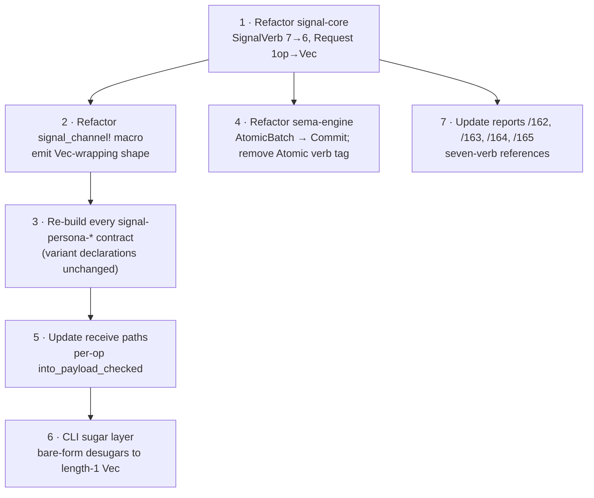

# 166 — `Atomic` collapses into the frame shape; six elementary verbs

*Designer decision proposal, 2026-05-14. Responds to a user observation:
if every Signal frame is structurally a `Vec` of verb-tagged operations,
then `Atomic` is not a peer verb — it is the structural property of the
Vec itself. A single-op frame is just a length-1 Vec; an "atomic" frame
is a length-N Vec. Recommends collapsing the seven-verb spine to **six
elementary verbs**, with the bundling relation moved out of the verb
enum and into the frame shape.*

**Retires when**: the user confirms the move (or rejects it), and the
workspace either lands the `signal-core` refactor or the seven-verb
shape is reaffirmed.

---

## 0 · TL;DR

The user's observation: *"if every signal is a Vec of verbs, then every
signal is an atomic, with the single-member being the 'non-atomic'
verb."* This reads the current seven-verb spine the right way. **`Atomic`
is not a peer verb of the other six — it is the wire's commit-boundary
structure named as a verb.** When the structure is honest, the verb
disappears.

The collapse:

- **Verb spine: 7 → 6.** Drop `Atomic` from `SignalVerb`. The six
  remaining (`Assert`, `Mutate`, `Retract`, `Match`, `Subscribe`,
  `Validate`) each name a single boundary act on a single payload.
- **Frame shape changes.** Today's `Request<P>` carries one
  `{verb, payload}`. The new shape carries a `Vec<{verb, payload}>` —
  one or more operations committed together. The frame *is* the
  commit boundary.
- **Single-op is just length-1.** No special case. Today's
  `mind '(Assert (SubmitThought ...))'` becomes structurally
  `mind '[(Assert (SubmitThought ...))]'` at the wire — though CLI
  sugar can keep the bare `(Assert ...)` shape ergonomic for human
  callers (desugars to a Vec of one).
- **`sema-engine`'s reference implementation barely changes.**
  `AtomicBatch<RecordValue>` becomes the *normal* batch shape — every
  commit IS an `AtomicBatch`, just sometimes a singleton. The
  operation-log entries stay verb-tagged per-op; the batch tag
  ("Atomic") goes away because every commit is a batch.
- **The seven-planet bijection refines, not breaks.** Jupiter
  ("gather-many-into-one — Zeus the all-father, binder of cosmos")
  was already metaphysically *structural* — the binding relation that
  holds the other six together. Moving it out of the peer-verb set
  into the frame shape is actually more honest to the classical
  reading.

**This is a workspace-wide breaking change in `signal-core` and every
`signal-persona-*` contract's `signal_channel!` invocation**. But
backward compatibility is not a workspace design constraint per
`ESSENCE.md` §"Backward compatibility is not a constraint" — and the
new shape is structurally cleaner.

**The decision the user owns**: collapse, or keep seven? My
recommendation is **collapse**.

---

## 1 · The observation, restated

The current seven-verb spine has an asymmetry hidden inside it. Six
verbs (`Assert`, `Mutate`, `Retract`, `Match`, `Subscribe`,
`Validate`) each carry a single domain payload. The seventh
(`Atomic`) is *higher-order*: its payload is a sequence of
*other-verb-tagged operations* that commit together. Structurally:

```text
Six elementary verbs:        Atomic (today's seventh):
  { verb: Assert,              { verb: Atomic,
    payload: <one record> }      payload: Vec<{verb, payload}> }
```

This is the only verb in the enum whose payload "looks like" a
sequence of operations of the others. The other six are first-order;
`Atomic` is second-order.

When the user asks *"what's the point of atomic if every signal is a
Vec of verbs?"* — they're noticing that the cleaner shape is to push
the Vec *up*, into the frame itself:

```text
Today:                       Proposed:
  Frame {                      Frame {
    body: Request {              body: Request {
      verb: SignalVerb,            ops: Vec<Op>,
      payload: P,                }
    },                         }
  }
                               where Op = { verb: SignalVerb, payload: P }
                               and SignalVerb has six variants
```

Every frame carries a sequence. Length 1 is what we'd call "non-atomic"
today; length N is what we'd call "atomic" today. The distinction
becomes structural rather than verb-tagged.

This is the standard transaction shape across most database systems:

- **Datomic**: a transaction is a vector of datoms. There is no
  "atomic" datom kind. `[[:db/add ...] [:db/retract ...]]` IS the
  transaction.
- **SQL**: `BEGIN; ... ; COMMIT` brackets a sequence of statements.
  There is no `ATOMIC` statement.
- **redb**: `WriteTransaction` is the commit boundary; you write
  multiple records inside it. The transaction IS the atomicity.
- **Reactive Streams** (per `/162 §1`): four signals
  (`onSubscribe`, `onNext`, `onError`, `onComplete`). No "atomic"
  signal — atomicity is implicit in the subscription's lifetime.

The current seven-verb spine is unusual in treating `Atomic` as a peer
of the elementary verbs. The well-precedented shape is six elementary
verbs plus a Vec-shaped commit envelope.

---

## 2 · What changes

### 2.1 · `signal-core` — the verb enum and the request envelope

```text
Before:                        After:
  enum SignalVerb {              enum SignalVerb {
    Assert,                        Assert,
    Mutate,                        Mutate,
    Retract,                       Retract,
    Match,                         Match,
    Subscribe,                     Subscribe,
    Atomic,        ← drop          Validate,
    Validate,                    }
  }
                                 struct Op<P> {
  enum Request<P> {                verb: SignalVerb,
    Handshake(HandshakeRequest),   payload: P,
    Operation {                  }
      verb: SignalVerb,
      payload: P,                enum Request<P> {
    },                             Handshake(HandshakeRequest),
  }                                Operations(Vec<Op<P>>),
                                 }
```

`Request::into_payload_checked()` (per `/54 §2`) becomes
`Request::into_ops_checked()` — walks each `Op` in the Vec, verifies
verb/payload alignment per-op, returns either `Vec<P>` (with per-op
verb context preserved separately) or `SignalVerbMismatch`.

### 2.2 · `signal_channel!` — variant declarations unchanged; emit shape changes

The compile-checked variant syntax stays identical:

```rust
signal_channel! {
    request MindRequest {
        Assert SubmitThought(SubmitThought),
        Match QueryThoughts(QueryThoughts),
        Subscribe SubscribeThoughts(SubscribeThoughts),
        // ...
    }
    reply MindReply { ... }
}
```

What changes is what the macro *emits*. Instead of emitting a
single-op `MindRequest::signal_verb() -> SignalVerb`, it emits
per-variant verb info plus a constructor that wraps the variant in a
length-1 `Vec<Op>` for the common case. Multi-op construction uses an
explicit batch builder.

### 2.3 · Contracts — no per-variant changes

Every `signal-persona-*` contract's `signal_channel!` invocation
stays the same at source level. The variants are unchanged; their
verb tags are unchanged. Only the *envelope* the macro emits below
the variants changes. Operator-side work per contract is small: a
re-codegen, possibly a constructor-helper update.

### 2.4 · `sema-engine` — `AtomicBatch` becomes the normal commit shape

Today: `AtomicBatch<RecordValue>` is the type for "multi-op atomic
commit." Single-op commits go through a different path.

After: every commit is an `AtomicBatch` (possibly singleton). The
type's name probably renames to `Commit<RecordValue>` or
`Batch<RecordValue>` since "atomic" stops carrying information
(every commit is atomic).

The operation-log entries today are tagged
`signal_core::SignalVerb::Atomic` for multi-op commits and the
per-op verb for single-op commits. After: every commit log entry
references the Vec of per-op verbs. The `SignalVerb::Atomic` tag
goes away because it was redundant — atomicity is the commit
boundary, not a verb.

`Engine::validate(QueryPlan)` is unchanged — it operates per-op,
not per-batch.

### 2.5 · CLI sugar — keep the short form

CLIs use NOTA syntax. The current ergonomic form:

```sh
mind '(Assert (SubmitThought (title "x") (body "y")))'
```

The post-collapse wire shape is `Vec<Op>` — but the CLI parser can
desugar a bare `(Verb (Record ...))` into a length-1 Vec at the
boundary. The user-facing surface stays unchanged for single-op
calls. Multi-op calls gain an explicit syntax:

```sh
mind '[(Assert (SubmitThought ...)) (Assert (Link ...))]'
mind '[(Retract (RoleClaim ...)) (Assert (RoleClaim ...))]'
```

The bracketed form is the wire shape; the bare form is one-line sugar
over a length-1 batch.

### 2.6 · NOTA / Nexus — record vocabulary unchanged

Per `skills/language-design.md` §0 "NOTA is the only text syntax,"
new wire shapes don't introduce new text formats. The Vec shape uses
existing NOTA sequence delimiters `[ ... ]`. No new sigils, no new
keywords.

---

## 3 · What's gained

1. **Structural honesty.** The verb enum names six *kinds of
   boundary act*. The frame names *what's committed together*. These
   are different concerns; the current shape conflates them.

2. **The "first Persona-domain `Atomic`" question dissolves.** `/165
   §4 Q1` asked which contract gets the first `Atomic` variant —
   `RoleHandoff`, `EngineUpgrade`, schema-migration, etc. After
   collapse, this question doesn't exist. The first multi-op frame
   is whoever sends one; no contract has to declare an `Atomic`
   variant. `RoleHandoff` simply becomes `[Retract OldClaim, Assert
   NewClaim]` at the wire — two ops in one frame, with no special
   contract type.

3. **`sema-engine`'s commit path unifies.** Today there's an
   `AtomicBatch` path and an implied single-op path. After collapse,
   every commit goes through the same Vec-of-ops path. One path,
   one set of tests.

4. **Compositional clarity.** Composing operations becomes "put them
   in a Vec." Today the composition is "wrap in an `Atomic` verb,"
   which is more ceremony.

5. **The receiver-validation discipline (`/54 §4.4`) generalizes.**
   `Request::into_payload_checked()` becomes a per-op check across
   the whole Vec. The discipline applies uniformly; no special case
   for the `Atomic` payload.

## 4 · What's lost

1. **`signal-core` is a workspace-wide breaking change.** Every
   contract crate recompiles. Every component that consumes
   `Request<P>` updates its receive path.

2. **One specific narrative beat in `/162` adjusts.** The bijection
   to seven planets becomes six-plus-binding-relation. Per §5 below,
   this actually improves the metaphysics — Jupiter's classical role
   *is* the cosmic binding relation, not a peer of the other six.

3. **The CLI's single-op sugar must stay for ergonomics.** Otherwise
   every call gains a `[ ... ]` wrapper for no human gain. This is
   surface-level and doesn't change the wire.

4. **A small bit of "atomic" naming in `sema-engine`** (the
   `AtomicBatch` type, the `EmptyAtomicBatch` error, the
   `AtomicOperation` enum) renames or generalizes. Probably to
   `Commit` / `EmptyCommit` / `CommitOperation`, since every commit
   is now a batch.

Nothing structural is lost.

## 5 · The planetary bijection refines

Per `/162 §2`, the seven verbs map to the seven classical planets:
Mars → Assert, Sun → Mutate, Saturn → Retract, Moon → Match, Mercury
→ Subscribe, Jupiter → Atomic, Venus → Validate.

After collapse, Jupiter no longer maps to a peer verb. It maps to the
*frame shape* — the act of binding operations under one commit. The
classical reading actually supports this better:

- **Mars, Sun, Saturn, Moon, Mercury, Venus** are *acts* (martial,
  vital, restrictive, reflective, communicative, evaluative).
  Elementary acts.
- **Jupiter** is the *cosmic binder* — Zeus the all-father, the
  principle of gathering and integration. *Not* an act peer to the
  other six; the *relation* that holds them together.

The bijection becomes: **six elementary acts (six planets) + the
binding relation (Jupiter's role).** The seventh isn't gone; it's
recognized as a different kind of thing.

This is more honest to the source tradition. Classical astrology
treats Jupiter as the *king-of-gods* — the integrating principle, not
just one of seven peers. The original mapping flattened that
hierarchy to make the bijection work; the refined mapping restores
it.

## 6 · Migration plan

The refactor is workspace-wide but mechanical. Order:



The hardest step is **5** (every component's receive path), but this
is already pressing per `/54 §4.4`'s receiver-validation gap.
Collapsing in the same pass is cheaper than doing them sequentially.

The cheapest step is **3** (variant declarations are unchanged); the
macro change does the work.

Estimated workspace scope: one operator-day for the `signal-core` +
macro refactor, then per-component lock refreshes and receive-path
updates. The receive-path work is operator-task already named in
`/54 §7` operator order.

## 7 · Open question — confirm the move?

This is the only question:

**Do you want to collapse `SignalVerb` from seven to six and move the
Vec into the frame shape?**

The case for yes:
- Cleaner structurally; eliminates higher-order verb complexity.
- Aligns with every standard database transaction shape (Datomic,
  SQL, redb, Reactive Streams).
- Removes the "first Persona-domain `Atomic`" question (`/165 §4 Q1`)
  by dissolving the category.
- Improves the planetary bijection rather than damaging it.

The case for no:
- Workspace-wide breaking change; many crates rebuild.
- The current seven-verb shape just shipped (`aa7a0d93` landed
  recently).
- The classical bijection's narrative weight: "seven peers" sounds
  right.

My recommendation: **yes, collapse**. The shape is more beautiful,
and per `ESSENCE.md` §"Break the system if it makes it more
beautiful," that's the operative test. Backward compatibility isn't a
constraint. The longer the seven-verb shape is in place, the more
contracts depend on it, and the more expensive the eventual collapse
becomes.

If you confirm, the next step is a designer-operator handoff to plan
the refactor sequence (`signal-core` first, then the macro, then the
contracts and consumers).

## 8 · See also

- `~/primary/reports/designer/162-signal-verb-roots-synthesis.md` —
  the seven-verb synthesis. The collapse refines its conclusion; the
  six-acts-plus-binding-relation reading is more honest to the source
  tradition.
- `~/primary/reports/designer/163-seven-verbs-no-structure-eighth.md`
  — the schema-as-data containment rule. After collapse, the
  schema-migration worked example in `/163 §2.4` becomes
  `[Mutate ..., Mutate ..., Mutate ...]` at the frame — no longer
  wrapped in an `Atomic` verb. The containment rule is unchanged;
  only the syntax shifts.
- `~/primary/reports/designer/165-verb-coverage-across-persona-components.md`
  — the verb-coverage audit. Q1 ("first Persona-domain `Atomic`")
  dissolves after collapse.
- `~/primary/reports/designer-assistant/54-verb-coverage-implementation-and-design-audit.md`
  — the parallel audit. Its operator-order recommendation
  intersects with this collapse at the receiver-validation step.
- `/git/github.com/LiGoldragon/signal-core/src/request.rs` — the
  current `SignalVerb` enum and `Request<P>` shape. The
  collapse-target.
- `/git/github.com/LiGoldragon/sema-engine/src/mutation.rs` — the
  current `AtomicBatch<RecordValue>` definition. Becomes the normal
  commit shape after collapse.
