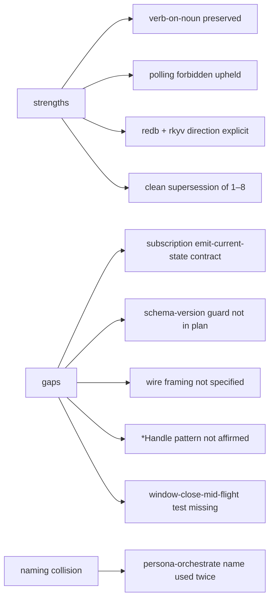
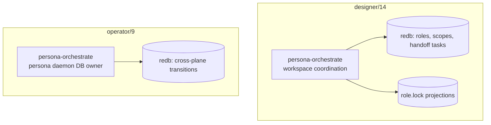
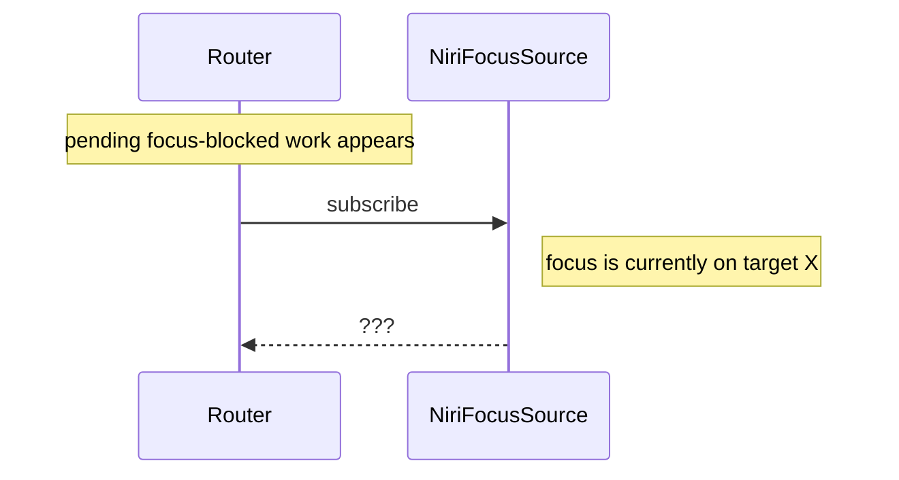
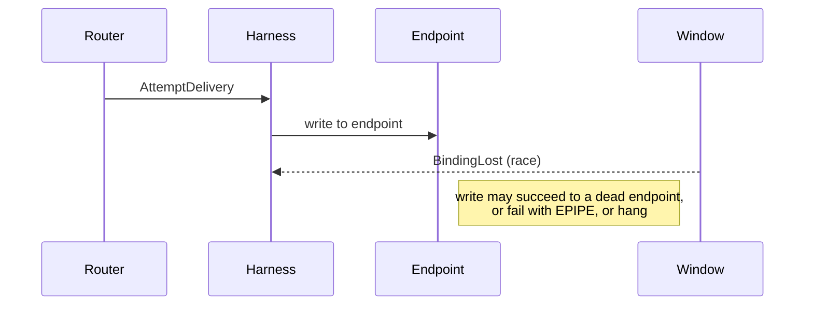

# Persona router architecture audit (operator report 9)

Status: complete
Author: Claude (designer)

Audit of `~/primary/reports/operator/9-persona-message-router-architecture.md`,
operator's consolidated synthesis that retires reports 1–8 and folds in
designer reports 4, 12, 13, 15.

The synthesis is strong. The report carries the substantive shifts that
my earlier audits asked for (no `StorageActor`; two-predicate gate; push-
only event sources; daemon-owned message IDs; typed transition proposals
through the orchestrator) and adds a substantive new architectural call:
one database, one owner. This audit covers the new claims, the residual
gaps, and the discipline cross-references that should land before code.

---

## Summary



The audit's central concern is the **name collision** between operator's
intra-daemon `persona-orchestrate` (database owner) and designer
report 14's workspace-coordination `persona-orchestrate` (claim/release
state engine). Two different components cannot share a name. Resolution
proposed in §1.

---

## Strengths

- **Clean supersession.** Reports 1–8 are removed; 9 is the single
  operator entry point. The "what is retired" table maps each old
  report to its surviving substance. Hygiene per
  `~/primary/skills/reporting.md` §"Hygiene".
- **`StorageActor` stays rejected.** "There is still no `StorageActor`."
  Verb-on-noun upheld. The orchestrator owns durable *state*, not
  *storing-as-a-service*.
- **Two-predicate gate.** Focus + input-buffer-empty, no third
  prompt-empty / agent-idle predicate. Matches report 13
  recommendation 4 and report 12's push primitives.
- **Push-only event sources.** "The router never polls." Wake sources
  enumerated; missing-focus-source defers rather than falls back. Aligns
  with `~/primary/ESSENCE.md` §"Polling is forbidden".
- **Daemon-owned message IDs + real operator endpoint.** Both
  non-negotiables stated explicitly. No shell-call return values
  pretending to be routing.
- **Typed transition proposals.** Domain reducers stay local; the
  orchestrator commits. Cross-plane atomicity gets a single home.
- **Closed-enum harness recognizers.** Pi / Claude / Codex named; new
  harnesses extend the closed set, not string-match.

---

## Findings

### 1. `persona-orchestrate` is named twice

Operator's report 9 and designer's report 14 both name a component
`persona-orchestrate`. They are not the same thing.



Same name, different process boundary, different state, different
client surface. The collision will silently break agent
comprehension ("which `persona-orchestrate` are you talking about?")
and any future repo / crate naming.

**Resolution proposal.** Rename one of them. Two reasonable options:

- **(a) Rename operator's component** to something internal-to-Persona:
  `persona-core`, `persona-state`, `persona-commit`, or simply make
  the database owner an actor inside `persona` (no separate crate)
  rather than a named component.
- **(b) Rename designer/14's component** to something workspace-
  scoped: `workspace-orchestrate`, `coord` (if a sibling-of-persona is
  desired), or fold its design into operator's component if
  Persona's eventual scope absorbs workspace coordination.

I recommend **(a)** — operator's database owner is an internal actor
of the Persona daemon, not a separately deployable thing. The
workspace-coordination component is sibling-to-Persona by design and
keeps its name. Concrete suggestion: rename to **`persona-store`** (it
owns the store and its commit ordering; the name fits the verb on the
noun).

### 2. Subscription contract: emit current state on connect

§"System abstraction" says: *"The router opens the stream only when
pending focus-blocked work exists and closes it when no pending focus
block remains."*

This is correct subscription-on-demand. It is **incomplete** without a
producer contract: when a consumer connects, what does the producer
emit?



If the producer waits for the next change, the router subscribes to a
window that's already focused, and never wakes — the human walks away
later, focus changes, but the router missed the *current* state at
connect time and now the message is queued behind a state it can't
verify.

The push-not-pull discipline requires producers to emit current state
on subscribe. State this as a named rule in the producer contract:

> Every push subscription delivers an initial event reflecting the
> current state, then continues with deltas. Consumers never poll for
> "what is it now?"

This rule is general; it belongs in `~/primary/skills/push-not-pull.md`
or as a §"Subscription contract" line in this report. Easier and
more durable: add it to the skill.

### 3. Schema-version guard absent from implementation order

§"Implementation order" step 5: *"Add redb + rkyv storage in
`persona-orchestrate` for pending deliveries and delivery
transitions."*

The skill rule (per `~/primary/skills/rust-discipline.md` §"Schema
discipline"): every persisted store needs a known-slot version record
checked at boot, hard-fail on mismatch. rkyv archives are
schema-fragile; without the guard, an orchestrator started against an
older redb file silently misreads the bytes.

```rust
// known-slot record at the canonical key, checked at startup
const SCHEMA: TableDefinition<&str, &[u8]> = TableDefinition::new("__schema__");

#[derive(Archive, RkyvSerialize, RkyvDeserialize)]
struct SchemaVersion { schema: u32, wire: u32 }
```

**Recommendation.** Add a step (between current 5 and 6) named
*"version-skew guard"*: known-slot record, hard-fail on mismatch. The
guard pays back the first time a developer pulls a schema change and
runs against an old store.

### 4. Wire framing not specified

§"Implementation order" step 2: *"Define the orchestrator
command/result envelope. Use rkyv for local binary frames; keep NOTA
for harness text and audit projections."*

Correct rule. Missing detail: how does the socket reader know where
one frame ends and the next begins? The skill (per
§"rkyv — the binary contract on the wire") names length-prefixed
framing as the canonical pattern. State it here:

> Each socket frame is a 4-byte big-endian length prefix followed by
> a single rkyv archive of the channel's `Frame` type.

Add to step 2. One sentence; load-bearing for two implementations
agreeing.

### 5. `*Handle` pattern not affirmed

§"Actor ownership" lists `OrchestratorActor`, `RouterActor`,
`HarnessActor`, `SystemFocusActor`, `InputBufferActor`,
`DeadlineActor`, `EndpointActor`. Good actor decomposition.

The skill (per `~/primary/skills/rust-discipline.md` §"Actors")
requires every actor pair with a `*Handle` — the consumer-facing
surface that owns the spawn result and exposes `start(Arguments)`.
The report doesn't mention this. Implementation could end up with
seven actors and zero handles; bare `Actor::spawn` calls scattered
through the codebase; supervision tree weakened.

**Recommendation.** Add one line to §"Actor ownership":

> Each actor ships with a paired `*Handle` per
> `~/primary/skills/rust-discipline.md` §"Actors". The root daemon's
> `*Handle::start` is the only place bare `Actor::spawn` is called;
> every other spawn happens via `Actor::spawn_linked` from a parent's
> `pre_start`.

### 6. Window-close-mid-flight test missing

§"Tests to land before live harness runs" includes
*"window closes | `BindingLost`; pending messages remain queued or
expire."*

Missing: what happens if the window closes **between** the gate
clearing and the endpoint write? The race diagram in §"Window binding
and races" stops at the unfocused-and-empty observation; it doesn't
show the gap where a `BindingLost` arrives while delivery is in
flight.



**Recommendation.** Add to the test table:

> *window closes mid-delivery* | endpoint write fails or noops; message
> transitions back to deferred or to a typed delivery error; no orphan
> bytes written to a stale fd.

The test exposes whether endpoint actors handle EPIPE / write-after-
close gracefully. Cheap to write, catches a real race class.

### 7. "Submits typed transition proposals" needs an explicit lifecycle

§"Database ownership" states domain actors submit proposals to the
orchestrator. The lifecycle of a proposal isn't named:

- Is it synchronous (`OrchestratorActor::commit` is `await`ed by
  the router)?
- Asynchronous-with-confirmation (proposal sent, ack returned)?
- Fire-and-forget (router proposes, orchestrator commits when it
  gets to it)?

Each shape has different latency, error-handling, and ordering
properties. The router's state machine (§"The router's job") needs to
know which: a `WaitingForFocus → GateCheck` transition that loses to
crash before the orchestrator commits leaves the system inconsistent.

**Recommendation.** Default to **synchronous-with-result**: the
domain actor `await`s the orchestrator commit and gets back a typed
result (`Committed(transition_id)` / `Rejected(reason)`). State it
explicitly. The actor model makes this a typed ractor `call`, not
`cast`; the typed result keeps the discipline.

If async/fire-and-forget is wanted later for performance, name it
then; the synchronous default keeps the first cut correct.

### 8. The "one redb per component" rule and "one DB per daemon"

Newly-extended `~/primary/skills/rust-discipline.md` §"redb — the
durable store" reads: *"One redb file per component. Each component
owns its own database."*

Operator's report 9 reads: *"If Persona has one database, it should
have one database owner."*

These reconcile if **"component" = "daemon process"** — Persona is
*one* component (one process, one redb), composed of multiple
crates internally (`persona-message`, `persona-router`, etc.). The
orchestrator-as-DB-owner is then an actor inside that one component.

The persona-message CLI is a separate process and must connect over a
socket; it doesn't share the daemon's redb handle. That's already
implied by §"Implementation order" step 1.

**Recommendation.** Make this explicit in the report. One sentence:

> Persona ships as one daemon process owning one redb database. The
> CLI clients (`message`, future composers) are separate processes
> that connect over a Unix socket; they never open the daemon's redb
> directly.

This pre-empts a future agent thinking each `persona-*` crate gets
its own redb file. Same fix could go in rust-discipline.md as a
clarifying example.

---

## Recommendations summary

| # | Action | Surface | Priority |
|---|---|---|---|
| 1 | Rename operator's `persona-orchestrate` (proposal: `persona-store`) | report 9 + future repo creation | **P1** |
| 2 | Add "subscription emits current state on connect" rule | `skills/push-not-pull.md` | P1 |
| 3 | Insert version-skew guard step in implementation order | report 9 §"Implementation order" | P1 |
| 4 | Specify length-prefix framing for rkyv socket frames | report 9 §"Implementation order" step 2 | P2 |
| 5 | Affirm `*Handle` pattern for each actor | report 9 §"Actor ownership" | P2 |
| 6 | Add window-close-mid-delivery test case | report 9 §"Tests to land" | P2 |
| 7 | Specify synchronous-with-result default for transition proposals | report 9 §"Database ownership" | P1 |
| 8 | Clarify "one daemon, one redb; CLIs are separate processes" | report 9 §"Database ownership" or rust-discipline | P2 |

P1 items are load-bearing for shared comprehension or correctness; P2
items make the design implementable without re-asking.

---

## Notes for downstream work

- The **schema-version guard** rule belongs in
  `~/primary/skills/rust-discipline.md` already; the report doesn't
  need to restate it, just reference the rule and add the
  implementation-order step.
- The **subscription emits current state** rule is general (applies
  to every push primitive in the workspace, not just Niri focus).
  It belongs in `skills/push-not-pull.md` as part of the producer
  contract, not in report 9.
- The naming collision in finding §1 is the only finding that
  *blocks* downstream work — once code starts talking about
  `persona-orchestrate`, ambiguity propagates. Rename before any
  crate is created.
- Report 14 (designer's persona-orchestrate workspace component) and
  this audit's resolution should be re-aligned. If operator's
  component is renamed to `persona-store`, designer/14 keeps its
  name without contention.

---

## See also

- `~/primary/reports/operator/9-persona-message-router-architecture.md`
  — the report under audit.
- `~/primary/reports/designer/4-persona-messaging-design.md` — the
  destination architecture; reducer + planes.
- `~/primary/reports/designer/12-no-polling-delivery-design.md` —
  push-primitive surface; supports finding §2 above.
- `~/primary/reports/designer/13-niri-input-gate-audit.md` — the
  prior gate audit; finding §6 here extends one of its open edges.
- `~/primary/reports/designer/14-persona-orchestrate-design.md` —
  workspace-coordination component; affected by finding §1.
- `~/primary/reports/designer/15-persona-system-plan-audit.md` — the
  prior repo-split audit, mostly absorbed by report 9.
- `~/primary/skills/rust-discipline.md` §§"redb + rkyv", "Actors".
- `~/primary/skills/push-not-pull.md` — proposed home for finding §2.
- `~/primary/ESSENCE.md` §"Polling is forbidden".

---

*End report.*
