# 178 — Persona engine: visual architecture reference

*Designer report, 2026-05-15. Comprehensive visual map of the
Persona engine as it currently stands. No new design — the
canonical specs remain `/176` (macro) + `/177` (typed-request) +
per-repo `ARCHITECTURE.md` files. This is one place to see how
the pieces fit.*

**Scope.** The "engine" is the Persona engine and its substrate.
That covers the wire kernel (`signal-core`), the storage kernel
and database engine (`sema` + `sema-engine`), the contract crates
(`signal-persona-*` family + `signal`), the eight Persona daemons
plus the per-terminal cell, the text translator (`nexus` +
`nexus-cli`), and the auth/cluster boundary (`criome`). The deploy
stack (`lojix` family, `goldragon`, `CriomOS`) sits adjacent and
is sketched only at the boundary.

---

## 0 · Reader's map

```text
§1   The whole at a glance       — one diagram, every daemon + every channel
§2   The layered shape           — kernel / contracts / daemons
§3   Kernel libraries            — signal-core, sema, sema-engine, nota family
§4   Contract crates             — typed wire vocabularies
§5   Daemon components           — what each owns, types, constraints
§6   Adjacent surfaces           — nexus, criome, deploy stack
§7   The whole engine, again     — integrated view with flows
§8   Cross-cutting invariants    — what holds across the stack
```

Each component section has the same shape: **what it is** ·
**owns / doesn't own** · **key types** · **constraints** ·
**diagram**.

**Intent, not implementation.** Every diagram and constraint
below describes the system's *intended* shape. The current
implementation has drift in several places — the contract-family
proc-macro migration is mid-wave; several daemons are
"async-framed" (using synthetic one-shot exchanges) rather than
"async-runtime" (with long-lived connection-owned lane state).
Status is tracked elsewhere; see DA/67 for the operator-side
audit.

**Companion reports.** Two designer-assistant reports cover
material this one is light on and should be read alongside it:

- **DA/68** (`persona-engine-component-visual-atlas`) — per-daemon
  internal actor structure (named actors: `RouterRoot`,
  `ChannelAuthority`, `MindAdjudicationOutbox`, `HarnessRegistry`,
  etc.), aspect tables (repo / process / CLI / contract / state),
  concrete socket modes (`0600` for internal, `0660` for
  user-writable boundaries). Deeper detail per component than §5
  here.
- **DA/69** (`persona-engine-whole-topology`) — sequence diagrams
  for the supervision / delivery / introspection flows (the
  timing of channel-authorization fork is much clearer there); a
  "what each component sees / should not see" matrix; the
  prototype success shape (minimum outcomes for a working
  end-to-end demonstration); the 18-point high-level constraints
  list.

The three reports compose: /178 carries the whole-engine
narrative, kernel internals, and pulled-out invariants in one
place; DA/68 carries component detail; DA/69 carries flows and
boundary matrices.

---

## 1 · The whole at a glance

Every active Persona daemon, every Signal channel between them,
and the principal request/event flows in one picture. Lane direction
is request-initiation (the arrow's tail is the connector / requester,
its head is the acceptor / responder). Subscription events flow
back along the same connection in the opposite direction on the
acceptor's outbound lane.

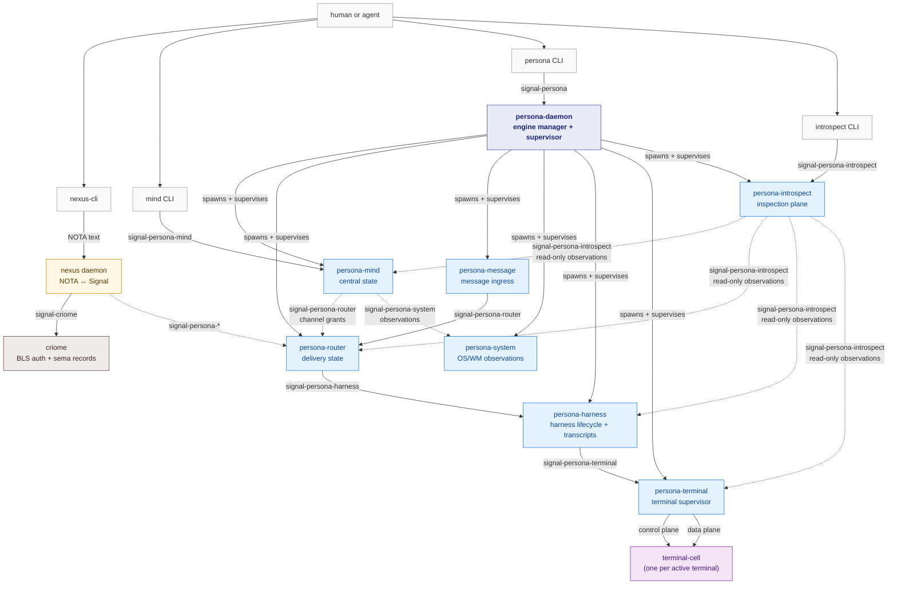

**How to read this.** Solid arrows are the primary request lane.
Dashed arrows are channel-grant or observation-shaped lanes (often
streaming via `Subscribe`). Every labeled edge corresponds to a
contract crate listed in §4. Every node corresponds to a daemon
listed in §5 (or an adjacent component in §6).

---

## 2 · The layered shape

The engine is three layers of typed surface — kernel, contract,
daemon — plus a fourth text-projection layer (Nexus/NOTA) that
exists only at human-facing boundaries.

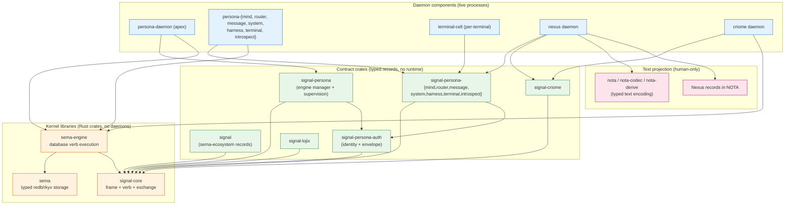

**Direction of dependency.** Always upward in the diagram: daemons
depend on contract crates, contract crates depend on the kernel.
The kernel depends on nothing in this stack. NOTA text is a
projection at human-facing surfaces only; daemons never speak
text to each other.

**Why this stack.** The kernel ships the typed wire and storage
mechanics. Contract crates ship the typed vocabularies that
specific channels speak. Daemons ship the runtime — actors,
storage, supervision, policy. A change to one daemon's policy
doesn't touch the wire vocabulary; a change to one channel's
vocabulary doesn't touch the kernel.

---

## 3 · Kernel libraries

### 3.1 · `signal-core` — the wire kernel

**What it is.** The shared Rust crate that defines the typed wire
shape every Persona component (and every sema-ecosystem component)
speaks. Owns frame envelope, six-root `SignalVerb` spine, async
request/reply exchange identification, subscription event identity,
and the proc-macro `signal_channel!` that compiles typed channel
declarations into request/reply/event vocabularies.

**Owns.**
- `ExchangeFrame<R,P>` / `ExchangeFrameBody<R,P>` (non-streaming).
- `StreamingFrame<R,P,E>` / `StreamingFrameBody<R,P,E>` (streaming
  with `SubscriptionEvent` variant).
- `SignalVerb` (closed six-root: Assert, Mutate, Retract, Match,
  Subscribe, Validate).
- `Operation<Payload>`, `NonEmpty<T>`, `Request<Payload>`.
- `Reply<R>` typed sum (`Accepted { outcome, per_operation }` vs
  `Rejected { reason }`); `SubReply` typed sum (`Ok` /
  `Invalidated` / `Failed` / `Skipped`).
- `ExchangeIdentifier` (request/reply pair identity);
  `StreamEventIdentifier` (subscription event identity);
  `LaneSequence` per-lane monotonic counter; `SessionEpoch`.
- `SubscriptionTokenInner(u64)` wire-side subscription routing key.
- `RequestBuilder<P>` multi-op constructor; `RequestPayload` trait;
  `check()` / `into_checked()` universal-rule enforcement.
- Verb-wrapping NOTA codec for `Operation<P>` and `Request<P>`:
  `(Assert (Payload …))` and bracketed-sequence forms.
- `Slot<T>`, `Revision` typed identity values; `PatternField<T>` +
  `Bind` / `Wildcard` pattern markers.
- `signal_channel!` proc-macro (re-exported from sibling
  `signal-core-macros` crate; `proc-macro = true`).

**Doesn't own.** Domain records, daemon code (no actors, no tokio,
no kameo), authentication, slot allocation, NOTA *parsing* surface,
schema growth logic.

**Key constraints.**
- Six verb roots, atomicity is structural via `NonEmpty<Operation>`.
- Two `FrameBody` types — exchange-only channels never carry a
  `SubscriptionEvent` variant.
- Async request/reply matching uses frame-layer `ExchangeIdentifier`
  (session epoch + lane + lane sequence); payloads never carry
  transport identifiers.
- `Reply` is a typed sum: pre-execution rejection has no per-op
  results; accepted replies always do.
- The proc-macro validates channel declarations as a typed
  relationship graph — every `opens`/`belongs` reference must
  resolve to a declared `stream` block.

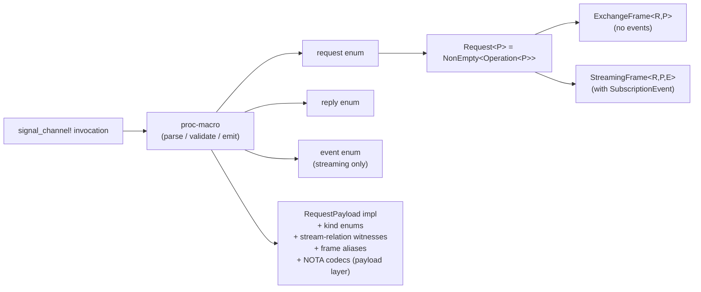

### 3.2 · `sema` — the storage kernel

**What it is.** Typed redb + rkyv storage primitives. Opens redb
files with schema validation, reads and writes typed rkyv tables.
The minimal kernel beneath `sema-engine`.

**Owns.**
- `Sema::open_with_schema` (opens a redb file with a typed schema
  version check).
- Typed read/write transactions over registered tables.
- Schema validation at open.
- The bytecheck-on-read discipline for rkyv archives.

**Doesn't own.** Database verbs, query algebra, subscription
mechanics, operation logs. Those live in `sema-engine`. Also
doesn't own runtime concerns: no actors, no async, no daemon.

**Constraints.**
- No schema-less open.
- No legacy raw-byte slot store; no `reader_count`; no `Slot`
  (those moved to `signal-core`).
- Format/schema mismatch fails at `open`, before any reads or
  writes succeed.

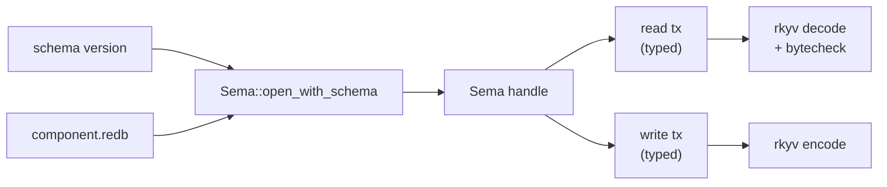

### 3.3 · `sema-engine` — the database engine

**What it is.** The database-operation execution engine. Sits
between `sema` and component daemons. Executes Signal verbs
(`Assert`, `Mutate`, `Retract`, `Match`, `Subscribe`, `Validate`)
over registered record families. Owns the commit log, snapshot
identity, subscription registration, and the `ReadPlan` query
algebra.

**Owns.**
- `Engine::open(EngineOpen { ... })` — opens via `sema::Sema`.
- `Engine::register_table(TableDescriptor)`.
- `Engine::assert` / `mutate` / `retract` — single-op writes.
- `Engine::commit(Request<P>)` — multi-op atomic commits via
  `NonEmpty<Operation>` (atomicity is structural; no separate
  `Atomic` verb).
- `Engine::match_records` / `validate` — Match + dry-run reads.
- `Engine::subscribe(QueryPlan, sink)` — durable subscription
  registration; returns initial snapshot + post-commit deltas.
- `CommitLogEntry { snapshot, operations: NonEmpty<…> }` per
  committed write transaction; `commit_log_range` bounded replay.
- `ReadPlan<R>` query algebra: `Pattern` (base), `Constrain`,
  `Project`, `Aggregate`, `Infer`, `Recurse`.
- `CommitReceipt`, `MutationReceipt`, `QuerySnapshot`,
  `ValidationReceipt` — typed receipts carrying snapshot identity.

**Doesn't own.** Domain validation (lives in the daemon), socket
code, actor supervision, authentication, NOTA parsing. Read-algebra
operators (`Constrain` etc.) are *not* `SignalVerb` roots — they
live inside `Match`/`Subscribe`/`Validate` payloads.

**Constraints.**
- `SignalVerb` spine is six roots; no `Atomic`.
- Write verbs (`Assert`/`Mutate`/`Retract`) write one
  `CommitLogOperation` entry per operation in the same committed
  write transaction as the domain record.
- Multi-op commits write one `CommitLogEntry` with
  `NonEmpty<CommitLogOperation>`.
- `Subscribe` emits deltas only after the mutation commit
  succeeds; sink delivery is downstream of commit and cannot
  roll back the mutation.
- Component domain validation happens before calling `Engine`.

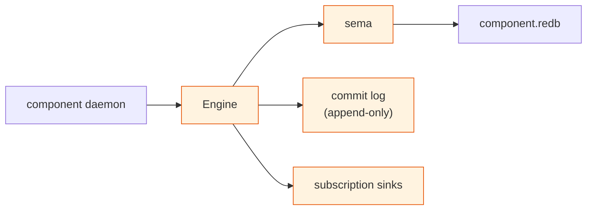

### 3.4 · `nota` / `nota-codec` / `nota-derive` — text encoding

**What they are.** The typed-text encoding family. NOTA is the
project's only text syntax. Records render as `(Head field0 field1 ...)`;
sequences as `[a b c]`; binds as `(Bind)`; wildcards as `(Wildcard)`.

- `nota` — language spec, lexer, parser core, grammar.
- `nota-codec` — encode/decode traits (`NotaEncode`, `NotaDecode`,
  `NotaRecord`, `NotaEnum`, `NotaTransparent`, `NotaSum`) +
  primitive impls.
- `nota-derive` — derive macros for the codec traits.

**Owns.** Lexer + parser, codec traits, derive macros for typed
records.

**Doesn't own.** Domain records; surface decisions (which CLI
prints NOTA, which daemon endpoint accepts it). Those live in
boundary components.

**Constraint.** NOTA is **not** the inter-component wire.
Component-to-component traffic uses rkyv frames; NOTA renders at
human-facing surfaces only (CLI input/output, audit logs,
pre-harness projection).

---

## 4 · Contract crates

Typed record vocabularies, one per named relation. Each contract
crate declares its `signal_channel!` invocation, owns the typed
records that travel on that channel, exposes derives for both rkyv
and NOTA encoding, and ships round-trip tests. None of them
contain runtime code.

### 4.1 · The contract family

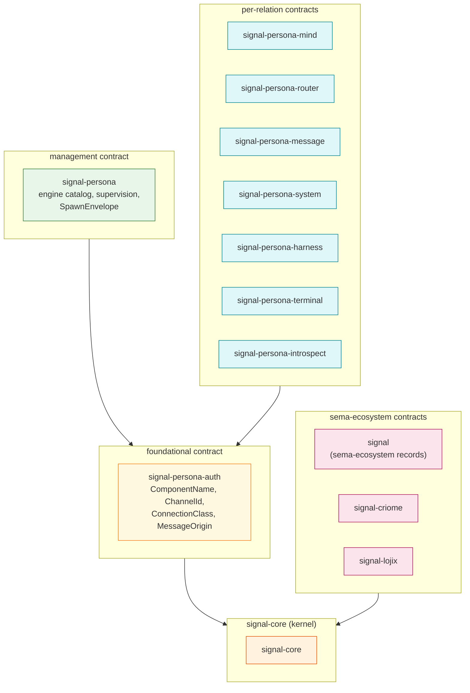

### 4.2 · Per-contract sketch

**`signal-persona-auth`** — Foundational typed identity layer.
Owns `ComponentName` (closed enum of supervised component
principals, intended split: `ComponentPrincipal`), `ChannelId`,
`ConnectionClass`, `MessageOrigin`. Used by every other
`signal-persona-*` crate for origin context.

**`signal-persona`** — Engine-manager + supervision contract.
Owns `SpawnEnvelope` (the typed envelope a parent supervisor mints
for a child component), engine catalog request/reply records,
supervision request/reply records, the four prototype variants
(`ComponentHello`, `ComponentReadinessQuery`, `ComponentHealthQuery`,
`GracefulStopRequest`) every supervised process answers. Frame
shape: exchange-only.

**`signal-persona-mind`** — Mind state contract. Carries
role-claim flow (Claim/Release/Handoff), activity submission and
query, work-graph submissions, typed Thought/Relation records,
adjudication, channel grants. Streaming (Subscribe variants for
thoughts and relations).

**`signal-persona-router`** — Routing decision contract. Carries
delivery decisions, channel state, recipient observation streams.
Streaming.

**`signal-persona-message`** — Message ingress contract. Carries
message submissions across the engine boundary, optional
authorization metadata, accepted/rejected outcomes. Frame shape:
exchange-only (today's slice).

**`signal-persona-system`** — OS/window-manager observation
contract. Carries focus observations, window events, snapshots,
subscription acceptance. Streaming.

**`signal-persona-harness`** — Harness lifecycle contract.
Carries `MessageDelivery`, `DeliveryCancellation`,
`InteractionPrompt`, `HarnessStatusQuery`, lifecycle replies
(`HarnessStarted`/`Stopped`/`Crashed`). Streaming (planned).

**`signal-persona-terminal`** — Terminal supervisor contract.
Carries terminal connection, input, resize, detachment, capture,
worker-lifecycle subscription. Streaming.

**`signal-persona-introspect`** — Read-only inspection plane
contract. Read-only: every request maps to `Match`. Carries
component observations, record-kind enumeration, delivery-trace
queries. Frame shape: exchange-only (read-only).

**`signal-criome`** — Criome channel contract. Carries
attestation requests, BLS verification, sema-record vocabulary
that crosses the criome boundary.

**`signal-lojix`** — Lojix deploy channel contract. Carries
deploy proposals, attestation requests, node-projection queries.

**`signal`** — Sema-ecosystem record vocabulary. Carries typed
domain records (`Node`, `Edge`, `Graph`, paired query types,
`RelationKind`, `Diagnostic`, `Hash`) plus the typed assert /
mutate / retract / query / `Records` payload enums. Used by
`criome` and the `criome ↔ forge` / `writers ↔ arca` legs.

---

## 5 · Daemon components

### 5.1 · `persona-daemon` — engine manager + supervisor

**What it is.** The host-level engine manager. One privileged
`persona` daemon (run by the dedicated `persona` system user)
supervises multiple engine instances, allocates per-engine sockets
and state directories, owns the engine catalog, handles component
lifecycle, records origin context for audit, and gives operators
one place to ask whether the total system is up.

**Owns.**
- Engine-catalog state (which engines exist, their socket/state paths).
- Component desired state and lifecycle observations.
- The Kameo `EngineManager` actor for the daemon lifetime.
- Manager-level redb (engine catalog, supervision history).
- Spawn-envelope minting (typed `SpawnEnvelope` per supervised
  component spawn).
- Inter-engine routes for federation.

**Doesn't own.** Component policy (router decisions, mind state,
harness transcripts, terminal sessions — those live in component
daemons). Application data inside components.

**Constraints.**
- Each component daemon answers the four prototype variants
  (`ComponentHello`, `ComponentReadinessQuery`, `ComponentHealthQuery`,
  `GracefulStopRequest`) — these define "is a Persona component."
- The manager mints socket paths and state directories; children
  don't invent them.
- `SpawnEnvelope.component_name` is typed as the closed
  `signal-persona-auth::ComponentName` enum (intended split:
  `ComponentPrincipal`); the open instance identifier is a
  separate type (intended: `ComponentInstanceName`).
- Manager state lives in manager-owned tables; no shared
  cross-component database.

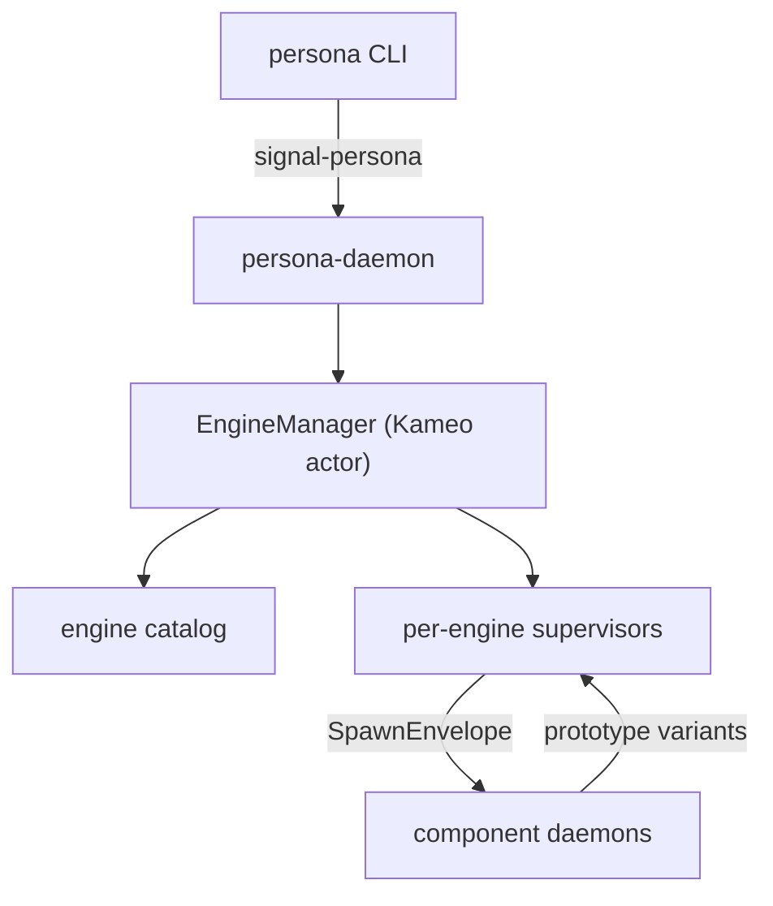

### 5.2 · `persona-mind` — central mind state

**What it is.** The daemon-backed state component for Persona
coordination: role coordination (claim/release/handoff flow),
activity records, work-graph events (items, notes, edges,
aliases, status), typed Thought/Relation records, decisions,
adjudication, channel grants. Center of agent state.

**Owns.**
- `mind.redb` (mind-local typed Sema tables: roles, activity,
  thoughts, relations, notes, links, aliases, channels,
  adjudications).
- The Kameo actor tree implementing the role/claim state machine,
  thought-graph reducers, and channel-grant choreography.
- Subscription delivery for thought/relation streams.

**Doesn't own.** Routing decisions (router does), harness state
(harness does), system observations (system does), terminal
state (terminal/cell does). Sema/sema-engine internals.

**Constraints.**
- The `mind` CLI sends exactly one Signal frame; one reply frame
  comes back.
- Identity (timestamps, slots, revisions) is store-minted, never
  agent-supplied.
- All Subscribe-bearing requests open a tail-contiguous suffix of
  the operation sequence per `signal-core` rule.

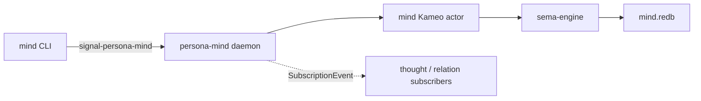

### 5.3 · `persona-router` — delivery routing + channel state

**What it is.** Owner of typed delivery state and authorized
channel state. Decides where messages go, commits a message
before delivery (so failure can re-deliver), tracks channel grants
authored by mind, observes recipient state.

**Owns.**
- `router.redb` (pending deliveries, authorized channels,
  recipient observations).
- Routing-decision logic.
- Delivery-cancellation handling.

**Doesn't own.** Message authoring (message daemon owns ingress),
harness lifecycle (harness owns), terminal allocation (terminal
owns). Mind's grant choreography is upstream.

**Constraints.**
- A message is committed before it's delivered.
- Channel grants come from mind; router enforces them but doesn't
  author them.
- Subscription deliveries are post-commit; failed delivery
  doesn't undo the commit.

```mermaid
flowchart LR
    msg["persona-message"] -->|signal-persona-router| router["persona-router"]
    mind["persona-mind"] -.->|signal-persona-router<br/>(channel grants)| router
    router -->|signal-persona-harness| harness["persona-harness"]
    router --> engine["sema-engine"]
    engine --> redb["router.redb"]
```

### 5.4 · `persona-message` — message ingress

**What it is.** The engine's message-ingress daemon and text
boundary. Accepts message submissions from external clients (or
the nexus daemon), authenticates the sender via `SO_PEERCRED`,
mints `MessageOrigin`, and forwards typed `MessageSubmission`
records to the router.

**Owns.**
- The local message-ingress socket.
- `MessageOrigin` minting from peer credentials.
- Forwarding submissions to the router.
- Status replies (`SubmissionAccepted` / `SubmissionRejected`).

**Doesn't own.** Routing decisions, channel state, delivery
outcomes — all the router's. Persistent ledger — none today
(stateless component).

**Constraints.**
- Provenance is minted from `SO_PEERCRED`; clients never claim
  their own origin.
- Stateless: opens no redb file until durable state is needed.
- Frame shape: exchange-only (no subscription events).

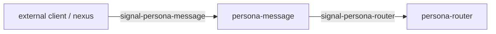

### 5.5 · `persona-system` — OS / WM / focus observations

**What it is.** Portable OS, window-manager, and focus-observation
boundary. Surfaces typed observations about the host system to
other components.

**Owns.**
- `FocusTracker` (live focus state) — the implemented slice.
- Focus snapshots and subscription delivery.
- Window-event projection.

**Doesn't own.** Process scheduling, terminal multiplexing,
display server internals. Future broader system-info surface is
deferred (per `persona/ARCHITECTURE.md` §0.7 — system is paused
beyond focus tracking).

**Constraints.**
- Stateless skeleton today; opens no redb file until durable
  state is needed.

```mermaid
flowchart LR
    mind["persona-mind"] -->|signal-persona-system<br/>(observation subscribe)| sys["persona-system"]
    sys --> focus["FocusTracker"]
    focus -.->|SubscriptionEvent| mind
```

### 5.6 · `persona-harness` — harness lifecycle + transcripts

**What it is.** Harness identity, lifecycle, transcript, and
adapter contracts. A "harness" is a long-running interactive
session — the boundary between a persistent agent (Persona) and
an interactive AI surface (e.g. a terminal-attached LLM session).

**Owns.**
- `harness.redb` (harness lifecycle state, transcript event
  counts, identity-view projections).
- The Kameo actor that owns one live harness binding's lifecycle
  and transcript event count.
- `HarnessIdentityView` (read-path projections: `Full`,
  `Redacted`, `Hidden`).
- Closed `HarnessKind`.

**Doesn't own.** Terminal session bytes (terminal/cell owns).
Identity-as-authorization (this is a view selector, not a gate).
Permissions live in filesystem ACLs + router channel state
choreographed by mind.

**Constraints.**
- Identity views are read-path projections, not authorization
  gates.
- Raw transcript access is behind explicit later range queries.
- Durable harness history is harness-owned redb; no shared
  cross-component database.

```mermaid
flowchart LR
    router["persona-router"] -->|signal-persona-harness<br/>(MessageDelivery)| harness["persona-harness"]
    harness --> actor["harness actor"]
    actor --> redb["harness.redb"]
    actor -->|signal-persona-terminal| terminal["persona-terminal"]
```

### 5.7 · `persona-terminal` — terminal supervisor

**What it is.** Persona-facing terminal session owner. Builds
around `terminal-cell` for the PTY substrate; supervises one or
more terminal cells per engine, owns the control plane that wires
harness interactions to the underlying cell.

**Owns.**
- The control-plane socket for terminal cells (Signal frames).
- Terminal-cell lifecycle (start, stop, attach, detach).
- Worker-lifecycle subscription delivery.

**Doesn't own.** Raw PTY bytes (cell owns), harness transcripts
(harness owns). Data plane goes directly to cell.

**Constraints.**
- **Two sockets per cell:** `control.sock` (Signal frames,
  privileged, latency-tolerant) and `data.sock` (raw viewer
  bytes, latency-sensitive). Control and data planes never mix.
- Worker-lifecycle is streaming via `signal-persona-terminal`'s
  Subscribe variants.

```mermaid
flowchart LR
    harness["persona-harness"] -->|signal-persona-terminal| terminal["persona-terminal"]
    terminal -->|control.sock<br/>(Signal frames)| cell["terminal-cell"]
    terminal -.->|data.sock<br/>(raw bytes)| cell
```

### 5.8 · `persona-introspect` — read-only inspection plane

**What it is.** Read-only inspection daemon. Surfaces typed
observations about every other component in the engine for the
`introspect` CLI to read. Decoupled from the delivery path; never
mutates anything.

**Owns.**
- `introspect.redb` (delivery-trace cache keyed by
  `DeliveryTraceKey`, observation cache, record-kind catalog).
- Read-only adapters to every other component's observation surface.
- The `introspect` CLI client logic.

**Doesn't own.** Any write or mutation surface. Every contract
variant is `Match`. Not in the delivery path; can fail without
affecting message flow.

**Constraints.**
- All requests are `Match`.
- No write-shaped payloads.
- Inspection-plane is a supervised component but not in the
  message delivery path.
- `DeliveryTraceKey` is a typed identifier specific to this
  domain — not `CorrelationId` (which was retired from the
  Signal transport layer).

```mermaid
flowchart LR
    cli["introspect CLI"] -->|signal-persona-introspect| introspect["persona-introspect"]
    introspect -.->|signal-persona-mind (Match)| mind
    introspect -.->|signal-persona-router (Match)| router
    introspect -.->|signal-persona-harness (Match)| harness
    introspect -.->|signal-persona-terminal (Match)| terminal
    introspect --> redb["introspect.redb"]
```

### 5.9 · `terminal-cell` — durable terminal session experiments

**What it is.** The PTY + viewer substrate. One process per active
terminal. Hosts the long-lived PTY, owns the byte ring for the
live viewer, surfaces a control socket the terminal supervisor
talks to via Signal frames.

**Owns.**
- The live PTY process group.
- The viewer byte ring (data plane).
- Connection/detachment lifecycle for one cell.
- The cell's two sockets (`control.sock`, `data.sock`).

**Doesn't own.** Cross-cell coordination (terminal supervisor),
harness state, persistent transcripts. Routing decisions.

**Constraints.**
- Production control plane is Signal frames; direct
  `signal-persona-terminal` handling exists as transitional
  witness code.
- Data plane is raw bytes, not framed.

```mermaid
flowchart LR
    sup["persona-terminal"] -->|control.sock<br/>(Signal frames)| cell["terminal-cell"]
    sup -.->|data.sock<br/>(raw bytes)| cell
    cell --> pty["PTY process group"]
    cell --> ring["viewer byte ring"]
```

---

## 6 · Adjacent surfaces

### 6.1 · `nexus` — text translator daemon

**What it is.** The NOTA-text-to-Signal translator. The *only*
non-Signal request surface in the sema-ecosystem. Accepts
human-typed Nexus records in NOTA syntax on a local socket;
parses them into typed Signal records; forwards to criome
(historic) or other Signal endpoints; renders typed replies back
to NOTA text.

**Owns.**
- The client-facing text socket.
- Parser (NOTA → typed Signal records).
- Renderer (typed reply → NOTA text).
- Per-connection state (negotiated protocol version, open
  subscriptions).

**Doesn't own.** Domain state (lives in the daemon nexus talks
to). Persistent state — none.

**Constraints.**
- The six top-level verb heads are `Assert` / `Mutate` / `Retract`
  / `Match` / `Subscribe` / `Validate`. Multi-operation requests
  are a top-level NonEmpty sequence of verb records: `[(Assert
  …) (Match …)]`.
- No state survives a request: per-connection state dies with the
  connection.
- No domain correlation IDs in payloads; request/reply matching
  is frame-layer `ExchangeIdentifier` on the Signal leg.
- The client-facing text leg is single-flight FIFO per
  connection; the Signal leg is async.

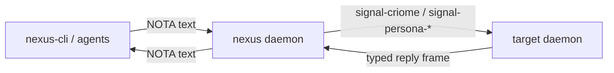

### 6.2 · `nexus-cli` — text CLI

**What it is.** Thin CLI client for the nexus daemon. Shuttles
NOTA text bytes over a Unix socket; doesn't parse them itself.

**Owns.** argv/stdin → socket → stdout. That's it.

**Doesn't own.** Any record vocabulary, any state, any decoding.

### 6.3 · `criome` — Spartan BLS auth + sema records

**What it is.** Today's `criome` is a minimal Spartan BLS-signature
auth daemon plus the sema-ecosystem records validator. Connects
the Persona engine boundary to the cluster-trust runtime.

**Owns.**
- BLS signature attestation + verification.
- The sema-ecosystem record vocabulary (Node/Edge/Graph,
  diagnostic types, the typed assert/mutate/retract/query payloads
  defined in `signal`).
- Criome's own redb tables for typed records.

**Doesn't own.** Persona-internal state, harness lifecycle,
terminal supervision. Cluster topology (lives in `horizon-rs` /
`goldragon`).

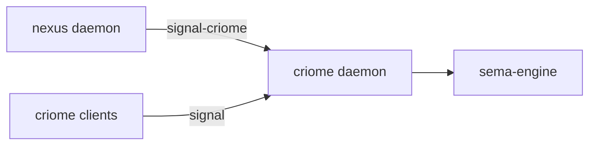

### 6.4 · Deploy stack (sketch)

The deploy stack sits adjacent to the Persona engine; it describes
*where* Persona runs, not *what* Persona is.

- **`goldragon`** — declarative cluster proposal data (NOTA records
  describing nodes, services, secrets references). Consumed by
  Horizon projection.
- **`horizon-rs`** — Horizon record types and projection. Reads
  goldragon data; produces typed `NodeProposal` / `RouterInterfaces`
  / `WifiPolicy` records.
- **`CriomOS`** / **`CriomOS-home`** — base OS module sets and
  home-deploy module sets. Consume Horizon projections to provision
  hosts.
- **`lojix-cli`** (transitional) and **`lojix`** (replacement) —
  deploy CLI / daemon. Shared contract is `signal-lojix`.

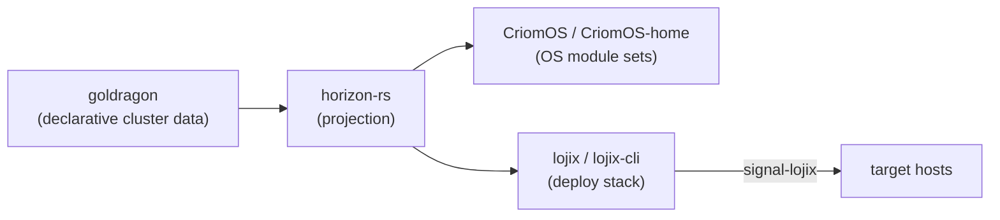

---

## 7 · The whole engine, integrated

This is the same picture as §1 but with the typed-channel labels
spelled out and the request/event flow directions explicit. It is
the **canonical visual** of what one engine instance looks like
running.

```mermaid
flowchart TB
    %% Humans + CLIs
    human(["human or agent"])
    persona_cli["persona CLI"]
    mind_cli["mind CLI"]
    nexus_cli["nexus-cli"]
    introspect_cli["introspect CLI"]

    %% Translator
    nexus_d["nexus-daemon<br/>(NOTA ↔ Signal)"]

    %% Apex
    persona_d["persona-daemon<br/>EngineManager + supervisor"]

    %% Engine components (one engine instance shown)
    mind_d["persona-mind"]
    router_d["persona-router"]
    msg_d["persona-message"]
    sys_d["persona-system"]
    harness_d["persona-harness"]
    term_d["persona-terminal"]
    intro_d["persona-introspect"]
    cell["terminal-cell<br/>(per active session)"]

    %% Auth / cluster identity
    criome_d["criome<br/>(BLS auth + sema records)"]

    %% Storage (per daemon)
    mind_redb[("mind.redb")]
    router_redb[("router.redb")]
    harness_redb[("harness.redb")]
    persona_redb[("persona-manager.redb")]
    introspect_redb[("introspect.redb")]

    %% Human entry points
    human --> persona_cli
    human --> mind_cli
    human --> nexus_cli
    human --> introspect_cli

    %% Engine-manager surface
    persona_cli -->|signal-persona| persona_d
    persona_d --> persona_redb

    %% Mind surface
    mind_cli -->|signal-persona-mind| mind_d
    mind_d --> mind_redb

    %% Inspection surface
    introspect_cli -->|signal-persona-introspect| intro_d
    intro_d --> introspect_redb

    %% Text surface
    nexus_cli -->|NOTA text| nexus_d
    nexus_d -.->|signal-persona-mind| mind_d
    nexus_d -.->|signal-persona-message| msg_d
    nexus_d -->|signal-criome| criome_d

    %% Manager spawns supervised children
    persona_d -.->|SpawnEnvelope| mind_d
    persona_d -.->|SpawnEnvelope| router_d
    persona_d -.->|SpawnEnvelope| msg_d
    persona_d -.->|SpawnEnvelope| sys_d
    persona_d -.->|SpawnEnvelope| harness_d
    persona_d -.->|SpawnEnvelope| term_d
    persona_d -.->|SpawnEnvelope| intro_d

    %% Delivery path
    msg_d -->|signal-persona-router<br/>MessageSubmission| router_d
    router_d --> router_redb
    router_d -->|signal-persona-harness<br/>MessageDelivery| harness_d
    harness_d --> harness_redb
    harness_d -->|signal-persona-terminal| term_d
    term_d -->|control.sock| cell
    term_d -.->|data.sock| cell

    %% Mind choreography (channel grants + observations)
    mind_d -.->|signal-persona-router<br/>ChannelGrant| router_d
    mind_d -.->|signal-persona-system<br/>(focus subscribe)| sys_d
    sys_d -.->|SubscriptionEvent| mind_d

    %% Introspection (read-only Match)
    intro_d -.->|signal-persona-mind (Match)| mind_d
    intro_d -.->|signal-persona-router (Match)| router_d
    intro_d -.->|signal-persona-harness (Match)| harness_d
    intro_d -.->|signal-persona-terminal (Match)| term_d
    intro_d -.->|signal-persona-system (Match)| sys_d

    classDef human fill:#fff,stroke:#999
    classDef cli fill:#f5f5f5,stroke:#666
    classDef translator fill:#fff7e6,stroke:#cc8800
    classDef apex fill:#e8eaf6,stroke:#3949ab,font-weight:bold
    classDef engine fill:#e3f2fd,stroke:#1976d2
    classDef cell fill:#f3e5f5,stroke:#7b1fa2
    classDef adjacent fill:#efebe9,stroke:#5d4037
    classDef storage fill:#f1f8e9,stroke:#558b2f

    class human human
    class persona_cli,mind_cli,nexus_cli,introspect_cli cli
    class nexus_d translator
    class persona_d apex
    class mind_d,router_d,msg_d,sys_d,harness_d,term_d,intro_d engine
    class cell cell
    class criome_d adjacent
    class mind_redb,router_redb,harness_redb,persona_redb,introspect_redb storage
```

**Reading the diagram.**

- **Apex.** `persona-daemon` is the engine manager. It spawns
  every other Persona component, mints their `SpawnEnvelope`,
  allocates their sockets and state directories, owns the engine
  catalog. The dashed `SpawnEnvelope` arrows mean "supervisor
  → child"; they're authoritative but not in the message delivery
  path.

- **Message delivery path.** A message enters via
  `persona-message` (after `SO_PEERCRED` minting of provenance),
  flows to `persona-router` (which commits it to `router.redb`
  before delivery), is dispatched to `persona-harness` per the
  recipient resolution, and lands at `persona-terminal` for live
  presentation via `terminal-cell`. Each hop crosses a typed
  Signal boundary (`signal-persona-router`,
  `signal-persona-harness`, `signal-persona-terminal`).

- **Mind choreography.** `persona-mind` is upstream of routing
  decisions: it grants channels (typed `ChannelGrant` records on
  `signal-persona-router`), subscribes to system observations,
  authors the work graph. The router enforces grants but doesn't
  author them.

- **Text translation.** `nexus-daemon` is the only place where
  human NOTA text crosses into the engine. The CLI shuttles bytes;
  the daemon parses, dispatches, and renders.

- **Inspection plane.** `persona-introspect` is read-only:
  every contract variant is `Match`. It can fail without affecting
  message delivery; introspect-down is observability-down, not
  production-down.

- **Per-daemon redb.** Each daemon owns its own `*.redb` file
  through `sema-engine`. No shared cross-component database. State
  movement is via typed Signal channels, not by reading another
  component's file.

---

## 8 · Cross-cutting invariants

The shape above is held together by a small set of invariants
that show up at every layer.

**Identity is store-minted.** Timestamps, slots, revisions, and
sender fields are never agent-supplied. Every component that
mints identity does so through `sema-engine` (or `signal-core`
for transport-level identifiers like `ExchangeIdentifier`). See
ESSENCE.md §"Infrastructure mints identity, time, and sender".

**Every cross-component request declares a verb.** Six closed
roots: `Assert`, `Mutate`, `Retract`, `Match`, `Subscribe`,
`Validate`. Atomicity is structural via `NonEmpty<Operation>`;
no separate `Atomic` verb. Read-algebra operators (`Constrain`,
`Project`, `Aggregate`, `Infer`, `Recurse`) live in `sema-engine`'s
`ReadPlan`, *inside* `Match`/`Subscribe`/`Validate` payloads.

**Async request/reply is the wire shape.** Request/reply matching
uses frame-layer `ExchangeIdentifier` (session epoch + lane +
lane sequence). Payloads never carry transport identifiers like
correlation IDs. Subscription events ride on the acceptor's
outbound lane with their own `StreamEventIdentifier`.

**Reply is a typed sum.** `Reply::Accepted { outcome,
per_operation }` vs `Reply::Rejected { reason }`. Illegal states
unrepresentable: pre-execution rejection has no per-op results;
accepted replies always do.

**Two FrameBody types, not one.** Non-streaming channels use
`ExchangeFrameBody` (4 variants); streaming channels use
`StreamingFrameBody` (5 variants, including `SubscriptionEvent`).
The proc-macro emits the appropriate frame aliases per channel.

**State is per-component.** Each daemon owns its own redb file
through `sema-engine`. No shared database. Cross-component
observation goes through typed Signal channels (Subscribe), not
through direct file access.

**Contract crates contain no runtime.** Typed records, rkyv +
NOTA derives, round-trip tests, the `signal_channel!` invocation.
No actors, no sockets, no tokio.

**Daemons are micro-components.** Each component is its own
repository. Persona ecosystem has one repo per daemon
(`persona-mind`, `persona-router`, …) plus one contract repo per
boundary (`signal-persona-mind`, …). The Cargo dependency graph
follows the architectural one.

**NOTA is text projection at human surfaces only.** Component-to-
component traffic is rkyv frames. NOTA renders at CLI input,
audit logs, and the pre-harness projection. No daemon-to-daemon
NOTA traffic.

**The verb belongs to the noun.** A read-shaped payload uses
`Match` or `Subscribe`. A write-shaped payload uses `Assert`,
`Mutate`, or `Retract`. A dry-run uses `Validate`. The macro
verb annotation enforces this at the contract level; the kernel
verifies at receive time.

---

## 9 · Pointers

Canonical specs the diagrams reference:

- `/176` — `signal_channel!` proc-macro spec.
- `/177` — typed `Request<Payload>` and execution semantics.
- `~/primary/skills/contract-repo.md` — workspace contract-repo
  discipline.
- `~/primary/skills/architecture-editor.md` — the shape this
  report (and every per-repo `ARCHITECTURE.md`) follows.

Designer-assistant companions (see §0):

- `reports/designer-assistant/68-persona-engine-component-visual-atlas.md`
  — per-component detail with internal actor names and socket modes.
- `reports/designer-assistant/69-persona-engine-whole-topology.md`
  — sequence diagrams + what-each-sees matrix + prototype success
  shape.
- `reports/designer-assistant/67-operator-work-audit-2026-05-15.md`
  — current implementation status against intent.

Per-repo architecture for any deeper read:

- `signal-core/ARCHITECTURE.md` — kernel.
- `sema/ARCHITECTURE.md`, `sema-engine/ARCHITECTURE.md` — storage
  and database engine.
- `persona/ARCHITECTURE.md` — apex.
- Each `persona-*` and `signal-persona-*` repo's own
  `ARCHITECTURE.md` for component or contract specifics.

Active repository map: `~/primary/protocols/active-repositories.md`.
