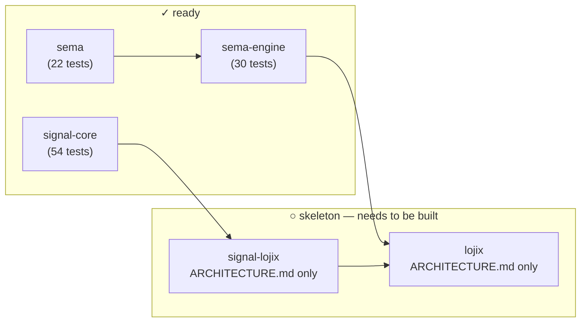
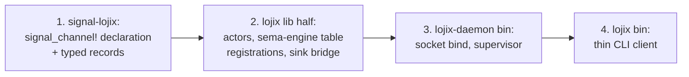

# 179 — signal-core + sema-engine readiness for the lojix rewrite

*Audit of the kernel stack underneath the planned lojix daemon.*

> **Status (2026-05-15):** Audit complete. Two kernel crates
> (`signal-core`, `sema-engine`) are migrated to the /176 + /177
> shape and green on their test suites. The lojix-specific stack
> (`signal-lojix`, `lojix`) is at architecture-only skeleton state.
> Two architecture files were edited in this pass:
> `signal-lojix/ARCHITECTURE.md` (wholesale refresh) and
> `lojix/ARCHITECTURE.md` (added Constraints; named the channel
> shape; named the SubscriptionSink bridge).

## 0 · TL;DR

`signal-core` is fully migrated to the six-root spine, structural
atomicity, and two FrameBody types — proc-macro engine in
`macros/`, 54 tests green. `sema-engine` is the typed verb engine
library; `Engine` exposes `assert` / `mutate` / `retract` / `commit`
/ `match_records` / `validate` / `subscribe` over registered record
families, with 30 runtime tests green.

The kernels are **mostly ready, with two correctness bugs that
must land first** (per designer-assistant/71, which audited the
same surface in parallel and caught what this pass missed): (a)
`Engine::assert` silently overwrites existing keys, violating
Assert-means-fresh semantics; (b) `nix flake check` is red on
fmt. Both are small, both block lojix consumption.

The bigger blocker is structural: **`signal-lojix` is a skeleton
with no `Cargo.toml` and no `src/`**, and `lojix` itself is also
documentation-only. Building lojix means building those two repos
from scratch on top of the kernels. The kernels are nearly ready;
the contract isn't drafted; the daemon doesn't exist.



## 1 · signal-core — migration status

### Shape on disk

| Surface | Status |
|---|---|
| Six-root `SignalVerb` (`Assert Mutate Retract Match Subscribe Validate`) | ✓ `src/verb.rs` |
| `Operation<Payload> { verb, payload }` + NOTA codec | ✓ `src/operation.rs` |
| `NonEmpty<T>` + `Request<Payload>` with `NonEmpty<Operation>` | ✓ `src/non_empty.rs`, `src/request.rs` |
| Kernel-layer NOTA codec on `Request` (single-op + bracketed sequence) | ✓ `src/request.rs` |
| `Request::check()` / `into_checked()` — verb/payload alignment + Subscribe-tail | ✓ `src/request.rs` |
| `RequestBuilder<Payload>` (multi-op constructor; `RequestBuilderError::EmptyRequest`) | ✓ |
| `Reply` typed sum (`Accepted { outcome, per_operation }` vs `Rejected { reason }`) | ✓ `src/reply.rs` |
| `AcceptedOutcome` (`Completed` vs `Aborted { failed_at, reason }`) | ✓ |
| `SubReply` (`Ok` / `Invalidated` / `Failed` / `Skipped`) — `Invalidated` per Q1 | ✓ |
| `RequestRejectionReason` (`VerbPayloadMismatch` / `SubscribeOutOfPosition` / `Internal`) | ✓ |
| Two FrameBody types: `ExchangeFrameBody` (4 variants) + `StreamingFrameBody` (5 variants) | ✓ `src/frame.rs` |
| `ExchangeIdentifier` vs `StreamEventIdentifier` (distinct types, shared `LaneSequence`) | ✓ `src/exchange.rs` |
| `ExchangeMode::LaneSequence { session_epoch }` (per /177 Q3) | ✓ |
| `SubscriptionTokenInner` (per-channel newtype wrap) | ✓ |
| `signal_channel!` proc-macro re-exported from sibling `macros/` crate | ✓ `src/lib.rs:45` |

The wire kernel is wholly on the new shape; `Atomic`, `BatchBuilder`, and `(Batch ...)` are gone.

### Proc-macro engine

`signal-core/macros/` is a real proc-macro crate (1,007 lines):

| Stage | File | Lines |
|---|---|---|
| Entry | `src/lib.rs` | 26 |
| `syn` parser → `ChannelSpec` | `src/parse.rs` | 218 |
| Typed AST model | `src/model.rs` | 69 |
| Semantic validation | `src/validate.rs` | 270 |
| `quote!` emission | `src/emit.rs` | 424 |

The macro recognises `channel <Name> { request {...} reply {...} event {...} stream <S> {...} }`, emits typed request/reply/event enums, `RequestPayload` impl, request/reply/event kind enums, frame aliases (`<Name>Frame` resolving to `ExchangeFrame` or `StreamingFrame`), stream-relation witnesses (`opened_stream()`, `closed_stream()`, `stream_kind()`), and NOTA codec impls.

### Tests

```text
tests/channel_macro.rs  12 tests  proc-macro emit + signal_verb witness + builder
tests/frame.rs          25 tests  rkyv round-trip, six-root spine, atomicity,
                                  bytecheck, length-prefix, multi-op, validation
tests/pattern.rs        17 tests  Bind / Wildcard / PatternField round trip
                                                              ─────
                                                          54 tests, 0 failing
```

`cargo check --tests` clean; `cargo test` clean.

### Validation gaps (versus /176 §4)

The macro `validate.rs` implements most of /176 §4 — verb-keyword
recognition, duplicate variant names, duplicate Rust-typed
payloads, Subscribe needs stream, stream needs Subscribe, stream
needs event, `opens`/`belongs` forward resolution, stream's
`opened`/`event`/`close` resolve to declared variants, close
variant is `Retract`, close-token type matches stream's token.

Four diagnostics from /176 §4 are **not yet implemented**:

| # | Diagnostic | Current behavior |
|---|---|---|
| 1 | Record-head uniqueness (within a block, by **NOTA head identifier** — not the Rust type string) | Code checks `quote!(#payload).to_string()` — Rust-path strings, not heads. `domain_a::Status` and `domain_b::Status` slip through. |
| 2 | `opens <StreamName>` on a non-`Subscribe` variant rejected | Parser allows `opens` on any variant; validator only requires `opens` on `Subscribe`. A `Mutate Foo(...) opens X` annotation silently ignored. |
| 3 | Reverse cross-reference: event's `belongs <S>` must point at a stream whose `event <V>` annotation points back at *this* variant | Only forward (`belongs` resolves to a declared stream) is checked. |
| 4 | Orphan stream (no `Subscribe` variant `opens` it) rejected | Validates "has streams ⇒ has subscribes"; does not pair each stream to a Subscribe. Two streams with one `opens` accepts silently. |

Plus: no `signal-core/macros/tests/` directory — none of the existing
diagnostics has a `trybuild`/`compile_fail` witness.

These are *correctness* gaps, not consumer-blockers. The macro is
usable today; the gaps allow malformed channel decls to pass
through without span-pointed compile errors.

## 2 · sema-engine — readiness for first external consumer

### Engine surface

| Method | Purpose | Tested |
|---|---|---|
| `Engine::open(EngineOpen)` | Open the redb file through `sema::Sema::open_with_schema`; rehydrate the catalog | ✓ |
| `register_table::<R>(TableDescriptor<R>)` | Materialise a record family in the catalog (idempotent) | ✓ |
| `assert::<R>(Assertion<R>)` | Insert at a fresh key; commit log entry + post-commit delta | ✓ |
| `mutate::<R>(Mutation<R>)` | Replace at an existing key (missing → typed error) | ✓ |
| `retract::<R>(Retraction<R>)` | Remove at an existing key (missing → typed error) | ✓ |
| `commit::<R>(CommitRequest<R>)` | Multi-op write transaction; one `CommitLogEntry` with `NonEmpty<CommitLogOperation>` | ✓ |
| `match_records::<R>(QueryPlan<R>)` | Execute `AllRows` / `ByKey` / `ByKeyRange`; other operators → `UnsupportedReadPlan` | ✓ |
| `validate::<R>(QueryPlan<R>)` | Dry-run a read plan; no commit-log write | ✓ |
| `subscribe::<R>(QueryPlan<R>, Arc<dyn SubscriptionSink<R>>)` | Durable registration; initial snapshot; post-commit deltas; detached/inline modes | ✓ |
| `commit_log()` / `commit_log_range(SequenceRange)` | Replay typed commit log | ✓ |
| `latest_snapshot()` / `list_tables()` / `catalog()` / `storage_kernel()` | Introspection | ✓ |

### Tests

```text
tests/dependency_boundary.rs    5 tests
tests/engine.rs                14 tests
tests/operation_log.rs          2 tests
tests/subscriptions.rs          9 tests
                              ────
                              30 tests, 0 failing
```

### What's executable vs typed-only

`ReadPlanNode` is a typed surface for the query algebra; only three
nodes are executed today:

| Node | Status |
|---|---|
| `AllRows` | ✓ executes |
| `ByKey(RecordKey)` | ✓ executes |
| `ByKeyRange(KeyRange)` | ✓ executes |
| `Constrain` (join/unify) | typed; returns `Error::UnsupportedReadPlan` |
| `Project` (field selection) | typed; returns `Error::UnsupportedReadPlan` |
| `Aggregate` (count/reduce) | typed; returns `Error::UnsupportedReadPlan` |
| `Infer` (derived facts) | typed; returns `Error::UnsupportedReadPlan` |
| `Recurse` (fixpoint) | typed; returns `Error::UnsupportedReadPlan` |

For lojix's surface (live-set queries by composite key range; event
log replay by snapshot range; per-subscription delta delivery),
`AllRows` + `ByKey` + `ByKeyRange` cover the needed operations.
Cross-table joins and aggregations are not on the lojix-rewrite
critical path.

### Bridge gap: signal-core `Request<P>` ↔ engine `CommitRequest<R>`

`Engine::commit` takes the engine-native `CommitRequest<RecordValue>`,
**not** `signal_core::Request<Payload>`. The example in
`sema-engine/ARCHITECTURE.md` §"Current Surface" uses
`RequestBuilder::new().with(MindRequest::...).build()` and feeds
that to `engine.commit(request)` — but the build target there is
`signal_core::Request<MindRequest>`, while `commit` expects
`CommitRequest<MindRecord>` (a different shape).

In practice, each daemon writes its own dispatcher:

```text
Request<LojixRequest>  →  match variant  →  Assertion / Mutation /
                                            Retraction / CommitRequest
                          →  Engine call  →  Reply<LojixReply>
```

This is **the consumer's responsibility, not a kernel gap**, but the
ARCH example is misleading. The fix is either:

- update the ARCH example to show the real bridge shape; or
- add an `Engine::commit_from_request<P, R>` convenience helper
  taking `signal_core::Request<P>` plus a payload-to-write-op
  mapper.

Either is a small designer-lane edit; both have low blast radius.

### sema kernel beneath

`sema` is the typed redb+rkyv storage kernel (22 tests green). Its
public surface is `Sema::open_with_schema(path, &Schema)`,
closure-scoped `read` / `write`, and `Table<K, V>` typed wrappers.
`sema-engine` is its first real external consumer; `lojix-daemon`
will reach `sema-engine` directly, not `sema`.

## 3 · lojix and signal-lojix — skeleton state

| Repo | What exists |
|---|---|
| `lojix` | `AGENTS.md`, `ARCHITECTURE.md` (updated this pass), `CLAUDE.md`, `README.md`, `skills.md`. **No `Cargo.toml`. No `src/`. No `flake.nix`.** |
| `signal-lojix` | `AGENTS.md`, `ARCHITECTURE.md` (updated this pass), `CLAUDE.md`, `README.md`, `skills.md`. **No `Cargo.toml`. No `src/`. No `flake.nix`.** |

Both are pure documentation today. The active feature arc
`primary-vhb6` ("horizon re-engineering: input/output split +
cluster-policy extraction + new lojix daemon") names this as
in-flight system-specialist work on the `horizon-re-engineering`
branch.

### Implementation order implied by the architecture



The contract has to land first because the daemon's wire surface
**is** the contract macro's emit output. Once the contract compiles
clean, the daemon body can register tables, wire actors, and
forward subscription events through `sema-engine`'s
`SubscriptionSink` trait to `signal-lojix`'s observation event
records.

### Architecture edits in this pass

`signal-lojix/ARCHITECTURE.md`:

- Refreshed status date to 2026-05-15.
- Replaced `sema-db` (which doesn't exist as a workspace name) with
  `sema-engine` throughout.
- Replaced repo reference `github:LiGoldragon/lojix-daemon` with
  `github:LiGoldragon/lojix` (the repo was renamed 2026-05-14; the
  daemon binary keeps the `lojix-daemon` name per AGENTS.md §"Binary
  naming").
- Removed stale "today's `lojix-cli` … grows into a thin client
  over this contract once the daemon ships" — per
  `protocols/active-repositories.md`, `lojix-cli` retires after
  CriomOS migrates; the new `lojix` binary is the thin client, not
  a migrated `lojix-cli`.
- Added §2 "Channel shape" naming the single streaming
  `signal_channel!` shape: six SignalVerbs across the request
  variants (Assert/Mutate/Retract/Match/Subscribe×2), two streams
  (`DeploymentEventStream`, `CacheRetentionEventStream`), and the
  table mapping variant → verb → purpose.
- Tightened §4 "Constraints" to enumerate testable obligations on
  the macro's compile-time checks and on the contract's typed-error
  discipline.

`lojix/ARCHITECTURE.md`:

- Refreshed status date to 2026-05-15.
- Added explicit `subscriptions.rs` module to §3 "Code map (planned)"
  to name the `SubscriptionSink` bridge from `sema-engine` deltas
  to `signal-lojix` observation events.
- Split §5 into "Constraints" (testable obligations: socket mode,
  one-NOTA-in-one-out, sema-engine open path, subscription bridge
  is post-commit, etc.) and §6 "Invariants" (broader truths: push
  not poll, operator intent is sovereign, cluster-operator-owned).
- Named `sema-engine` and `sema` boundary explicitly in §2 "Not
  owned" so the daemon's storage seam is unambiguous.
- Stated that the channel uses `StreamingFrame` /
  `StreamingFrameBody` because it carries events.

## 4 · What's needed before lojix can compile

In rough order:

1. **`signal-lojix` Cargo.toml + flake.nix.** Standard contract-crate
   shape per the `signal-persona-*` precedent.
2. **One `signal_channel!` declaration in `signal-lojix/src/lib.rs`.**
   The channel name, six request variants with their verbs, six reply
   variants, two event variants with `belongs`, two stream blocks
   with token/opened/event/close. The macro will emit the typed
   enums, frame aliases, and NOTA codecs.
3. **Round-trip tests for every record kind** (rkyv + NOTA, per
   `~/primary/skills/contract-repo.md` §"Examples-first round-trip
   discipline"). Each record kind ships with a canonical NOTA text
   example.
4. **`lojix` Cargo.toml + flake.nix.** Workspace-style with the two
   `[[bin]]` entries plus the `[lib]` half.
5. **Engine bootstrap in `lojix-daemon`.** Open the redb file
   through `Engine::open(EngineOpen::new(path, SchemaVersion))`;
   `engine.register_table` for live set, GC roots, event log,
   container lifecycle.
6. **Actor tree.** Kameo supervisor; live set / GC roots / events /
   container actors; socket accept loop.
7. **Subscription bridge.** A `SubscriptionSink<R>` implementation
   per observation stream that converts `SubscriptionEvent::Delta`
   into `signal-lojix` event payloads and emits them as
   `StreamingFrameBody::SubscriptionEvent` frames.
8. **Thin CLI.** `lojix` bin reads one NOTA request, opens the
   socket, sends the frame, prints the reply (or streams events
   until the stream closes).

None of these need new kernel work. The whole list is consumer
implementation, which is operator's lane.

## 5 · Correctness gaps caught by DA/71 (verified in this pass)

Designer-assistant audited the same surface in parallel
(`~/primary/reports/designer-assistant/71-signal-core-and-sema-engine-lojix-readiness-audit.md`)
and surfaced two correctness gaps this pass missed on first read.
Both verified:

### Bug A — `Engine::assert` overwrites existing keys

`src/engine.rs:93` calls `assertion.table().sema_table().insert(...)`
with no prior existence check. `sema::Table::insert` overwrites any
value at the same key. Signal semantics say `Assert` means "insert
at a fresh key" — overwrite is `Mutate`'s job. The commit log
records `SignalVerb::Assert` even when the row actually replaced an
existing value. The same gap exists inside multi-op
`commit`: `WriteOperation::Assert` only de-duplicates within the
commit's own operation list (`effect_keys: HashSet<RecordKey>`), not
against the table's prior state.

Fix: add a pre-write existence check and return a typed
`DuplicateAssertKey { table, key }` error. Mutate/Retract already
have the symmetric missing-record check; Assert should have its
freshness check.

**This is the most consequential correctness bug for lojix.** The
live-set table must not silently replace a `(cluster, node, kind)`
entry under the wrong verb — that's how a deploy disappears from
the typed event log.

### Bug B — `nix flake check -L` red on fmt

`sema-engine`'s flake check fails the `fmt` derivation. The
runtime tests pass (`nix run .#test` is green), but the release
gate is red. The diff shows formatting drift in `tests/engine.rs`
and `tests/subscriptions.rs`. Fix is `cargo fmt`.

### Other findings worth carrying forward

DA/71 also surfaces these, listed here for visibility:

- **README staleness** — `sema-engine/README.md` still mentions
  `Atomic`, "seven `SignalVerb` roots", and `AtomicBatch`. The
  README is the first thing a new implementer reads, so the drift
  costs more than the same drift in ARCH would.
- **Snapshot allocation isn't actor-safe** — `next_snapshot()` is
  computed before the write transaction opens; concurrent callers
  on the same `Engine` could mint the same snapshot. Lojix's
  intended single-actor ownership rule sidesteps this, but the
  contract is currently implicit. Either serialize internally or
  state the single-owner rule as an explicit constraint.
- **Prevalidation outside the write transaction** —
  `Engine::commit`'s missing-record checks for Mutate/Retract run
  in separate read txns before the write txn. Same root cause as
  snapshot allocation; same lojix-friendly workaround (single-actor
  ownership).
- **Multi-table commit not exposed** — `CommitRequest<RecordValue>`
  is per-table. The current API can't commit live-set + event-log
  in one transaction. Lojix may want this later; not on the
  critical path for first slice.

## 6 · User-attention questions

### Q1 — sema-engine ARCH example accuracy

The `sema-engine/ARCHITECTURE.md` §"Current Surface" example
implies `engine.commit(request)` accepts
`signal_core::Request<Payload>` directly. It does not — `commit`
takes `CommitRequest<RecordValue>`, an engine-native type. Two
clean fixes:

- (a) **Edit the example** to show the per-variant dispatch the
  consumer actually writes.
- (b) **Add `Engine::commit_from_request<P, R>(Request<P>, mapper)`**
  to make the bridge a kernel-owned single line. This pushes the
  per-consumer boilerplate from "write a match" to "supply a
  closure," at the cost of one more public method.

Recommend (a) for now and revisit (b) once two or three consumers
exist. Today the only real consumer is `persona-mind`; designing
the helper before it has two clients is premature.

### Q2 — proc-macro §4 validation completeness

The four missing diagnostics (record-head uniqueness, opens-on-
non-Subscribe, reverse belongs cross-reference, orphan stream)
are correctness gaps in the macro engine. They don't block first
consumer use, but they're the kind of silent error that bites
later when a contract author drifts into the cracks.

Should this slip into a bead for operator / designer-assistant
follow-up, or wait until the first contract author actually hits
one of these? Recommend opening a bead with `role:designer` so
the gap is tracked, then closing it when the diagnostics land —
the existing channel_macro tests would extend cleanly to cover
them.

### Q3 — should sema-engine's "Rename Map" section retire now?

`sema-engine/ARCHITECTURE.md` carries a "Rename Map (from the
seven-root spine, pre-2026-05-15)" section. Per
`skills/architecture-editor.md` §"What an `ARCHITECTURE.md` does
NOT contain" (decision history → reports, not ARCH), this content
belongs in commit history or a one-shot migration report.

Recommend leaving it for now — the rename landed yesterday
(2026-05-14, when the rename pass happened) and consumers haven't
finished migrating. Retire the section once the in-flight
consumers (persona-mind first, criome second) are off the old
names. If kept much longer, migrate it to a one-shot report and
delete from the ARCH.

## 7 · See also

- `~/primary/reports/designer-assistant/71-signal-core-and-sema-engine-lojix-readiness-audit.md`
  — DA's parallel audit; catches the Assert-overwrite bug, the fmt
  failure, the README staleness, and a tighter ownership-model
  argument than this report. Read both.
- `~/primary/reports/designer/176-signal-channel-macro-redesign.md`
  — the macro spec (engine in `macros/` is the implementation).
- `~/primary/reports/designer/177-typed-request-shape-and-execution-semantics.md`
  — Q1–Q16 settled spec for `Request<Payload>`, FrameBody split,
  exchange identifier model.
- `~/primary/reports/designer/178-engine-visual-reference.md` —
  whole-engine visual reference.
- `~/primary/reports/designer-assistant/68-persona-engine-component-visual-atlas.md`
  — per-component visual detail with internal actors.
- `~/primary/reports/designer-assistant/69-persona-engine-whole-topology.md`
  — boundary matrices and sequence diagrams.
- `signal-core/ARCHITECTURE.md` — wire kernel current shape.
- `sema-engine/ARCHITECTURE.md` — typed verb engine current shape.
- `sema/ARCHITECTURE.md` — storage kernel current shape.
- `lojix/ARCHITECTURE.md` (updated this pass) — daemon's
  destination shape.
- `signal-lojix/ARCHITECTURE.md` (updated this pass) — contract's
  destination shape.
