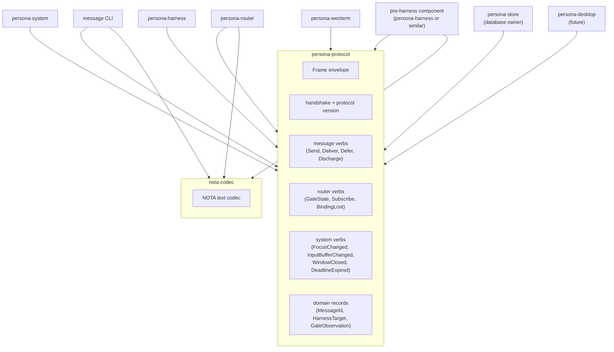
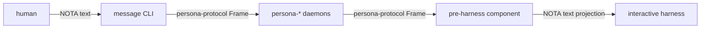
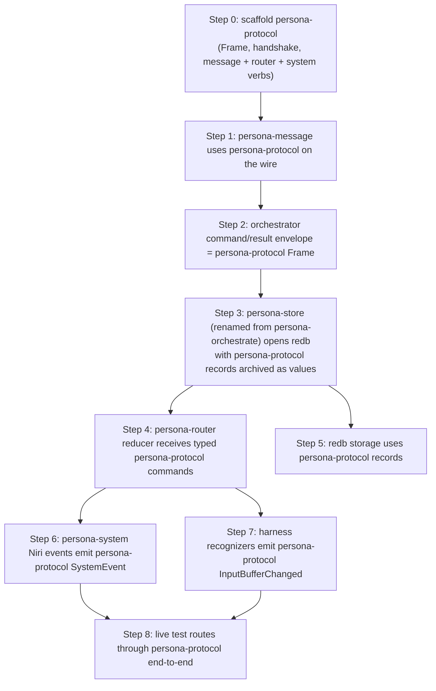

# Persona contract repo — design

Status: proposal
Author: Claude (designer)

The Persona ecosystem is becoming a multi-component fabric:
`persona-message`, `persona-router`, `persona-system`, `persona-harness`,
`persona-wezterm`, an internal database-owner actor (currently named
`persona-orchestrate` — see audit 17 §1 for the rename), and eventually
a `persona-desktop`. Several of these components talk to each other
across process boundaries.

This report proposes the **contract repo** for the Persona ecosystem —
the crate that owns the wire types every Persona daemon speaks. It
sits on top of the workspace skill `~/primary/skills/contract-repo.md`,
which states the general pattern; this report applies the pattern to
Persona specifically. It complements operator report 9
(`~/primary/reports/operator/9-persona-message-router-architecture.md`),
which doesn't yet name a contract crate.

The canonical workspace reference is **signal**
(`~/primary/repos/signal`). Persona's contract is shaped the same way
— typed `Frame` envelope, length-prefix framing, closed enums of
per-verb payloads, layered effect crates for narrow-audience verbs.

---

## The shape



The split:

- **Every component depends on `persona-protocol`.** Wire bytes
  between any two components are rkyv archives of types from this
  crate.
- **Only three components depend on `nota-codec`** (the human-
  facing text codec): `message` CLI (parses human input), the
  router (renders audit projections), and the component just
  before harness delivery (renders typed records into the bytes
  that hit the harness's input region).

Everywhere else, components hold typed records in memory and
exchange rkyv archives on the wire. Text is a boundary projection,
never the inter-component currency.

---

## What `persona-protocol` owns

```
persona-protocol/
├── src/
│   ├── lib.rs        — module entry + re-exports
│   ├── frame.rs      — Frame envelope, encode/decode, FrameDecodeError
│   ├── handshake.rs  — ProtocolVersion + handshake exchange
│   ├── auth.rs       — auth-proof types (capability tokens for harness writes)
│   ├── request.rs    — Request enum (closed; Send, Deliver, Subscribe, ...)
│   ├── reply.rs      — Reply enum (closed; matches request kinds)
│   ├── message.rs    — Message kind, MessageId, payload
│   ├── delivery.rs   — DeliveryDecision, BlockReason (closed enum)
│   ├── system.rs     — SystemEvent (FocusChanged, WindowClosed, ...)
│   ├── harness.rs    — HarnessTarget, HarnessBinding, BindingLost
│   ├── gate.rs       — GateObservation, InputBufferState
│   ├── deadline.rs   — DeadlineId, DeadlineExpired
│   ├── version.rs    — schema-version known-slot record
│   └── error.rs      — crate Error enum (thiserror)
├── tests/            — round-trip per record kind, per verb
├── Cargo.toml        — pinned rkyv feature set, no runtime deps
└── ARCHITECTURE.md   — what's owned, what's not, schema discipline
```

It carries:

- **`Frame { auth, body }`.** Per the signal reference; no
  correlation IDs (replies pair to requests by position on the
  connection). Length-prefixed (4-byte big-endian) per archive.
- **`ProtocolVersion`** + handshake exchange + compatibility rule.
  `PERSONA_PROTOCOL_VERSION` constant pinned in this crate.
- **`Body { Request, Reply }`** with closed per-verb enums.
- **Message verbs.** `Send`, `Deliver`, `Defer`, `Discharge`,
  `Expire` — the routing verbs every daemon component sees.
- **Router verbs.** `GateState`, `Subscribe`, `Unsubscribe`,
  `BindingLost` — the verbs the router sends to/receives from
  the system and harness components.
- **System events.** `FocusChanged`, `WindowClosed`,
  `InputBufferChanged`, `DeadlineExpired` — the closed event
  surface from `persona-system`.
- **Domain records.** `MessageId`, `HarnessTarget`,
  `HarnessBinding`, `GateObservation`, `InputBufferState`,
  `DeliveryTransition` — the typed records that travel and
  archive.
- **`AuthProof`** types — capability tokens authorising a write
  to a harness endpoint. Same shape pattern as signal's auth.
- **Schema-version known-slot record** — `(schema_version,
  wire_version)` for the version-skew guard
  (per `~/primary/skills/rust-discipline.md` §"Schema
  discipline" + §"redb — the durable store").

It does not carry:

- Daemon code, actors, runtime. No `tokio`, no `ractor`. The
  contract crate is types and codec only.
- Routing logic, gate decisions, input-buffer recognizers.
  Those stay in `persona-router`, `persona-harness`,
  `persona-system` respectively.
- Configuration, deployment, repo-management.
- NOTA text rendering — that lives in `nota-codec`. Contract
  types may have inherent methods that *project* to NOTA via
  `nota-codec`, but the codec crate is the dependency.

---

## NOTA boundary — explicit



NOTA appears at exactly two boundary points:

1. **CLI input** — `message '(Send target=pi body=...)'`. The CLI
   parses the NOTA record into a typed `Send` request. The wire
   bytes are then `persona-protocol::Frame`.
2. **Harness terminal** — the pre-harness component projects the
   typed `Deliver` payload into NOTA bytes that get written to the
   harness's input region. The harness sees NOTA on its terminal;
   the daemon never sees NOTA on the wire.

Everything in between is binary. The router doesn't parse NOTA;
`persona-system` doesn't emit NOTA; `persona-store` doesn't archive
NOTA bytes. Audit-log projections rendered for human eyes are
also NOTA, but they're a *projection* — the source is the typed
record, not a re-parse.

---

## The naming question

Three reasonable names for the contract crate:

| Name | Pros | Cons |
|---|---|---|
| `persona-protocol` | Direct; names what the crate is | Generic; doesn't reuse signal's vocabulary |
| `persona-signal` | Reuses the workspace's "signal" naming convention; eases later integration with criome's signal | Implies the crate is a layered effect crate atop signal — which it isn't, today |
| `persona-wire` | Focused on the bytes | Less semantic; "wire" hints transport, not contract |

**Recommendation: `persona-protocol`.** The Persona domain is its
own protocol; the crate names what it is. If the eventual
Persona/Criome convergence (named in operator report 9 + designer
report 4) leads to Persona riding atop signal, the layered
crates can be named `signal-persona` or `persona-protocol-signal`
at that time. Pre-naming for a future convergence makes the
present-day crate confusing; rename once convergence is real.

---

## Layered effect crates — when

Two candidate layered crates show up in the Persona stack today.
Neither is required at the start; both become the right answer if
the layered-pattern indicators trigger.

### `persona-protocol-niri` (or `persona-system-niri`)

**Audience:** `persona-system`'s Niri backend (sender of typed
events) + `persona-router` (receiver). Narrow.

**Verbs:** Niri-specific event payloads — workspace IDs, layout
changes, output identity — that the cross-platform system
abstraction doesn't model.

**When to split:** Add when a second `persona-system` backend
(macOS, X11, Wayland-compositor) exists and the cross-platform
event surface needs to stay stable while Niri-specific verbs keep
landing. Per operator report 9 §"System abstraction": *"first Niri
backend lives here"* — keep it inline until the second backend is
real.

### `persona-protocol-harness-<adapter>` (e.g. -wezterm)

**Audience:** `persona-wezterm` (sender of harness-adapter-specific
events) + `persona-harness` (receiver).

**Verbs:** PTY-specific events that the cross-adapter harness
surface doesn't model. Currently no second harness adapter exists,
so the verbs stay inline in `persona-wezterm`. Same trigger as
above: split on second adapter.

---

## Cargo.toml shape

```toml
[package]
name         = "persona-protocol"
version      = "0.1.0"
edition      = "2024"
license      = "MIT OR Apache-2.0"
repository   = "https://github.com/LiGoldragon/persona-protocol"
description  = "Persona binary contract: Frame envelope, handshake, per-verb typed payloads."

[dependencies]
rkyv = { version = "0.8", default-features = false, features = [
    "std",
    "bytecheck",
    "little_endian",
    "pointer_width_32",
    "unaligned",
] }
thiserror = "2"
# nota-codec only if record kinds carry NotaTransparent newtype derives;
# otherwise contract crate stays NOTA-free and consumers depend on
# nota-codec separately at the boundary points.
```

The pinned rkyv feature set is character-for-character the same as
signal's per `~/primary/repos/lore/rust/rkyv.md`. Drift breaks
archive compatibility silently.

---

## Versioning

`PERSONA_PROTOCOL_VERSION = 0.1.0`. Pre-stable: any change is a
coordinated upgrade of every consumer; no minor-forward
compatibility assumed yet. Once the wire surface stabilises, switch
to major-exact / minor-forward (per signal's rule).

The schema-version known-slot record at the canonical key:

```rust
#[derive(Archive, RkyvSerialize, RkyvDeserialize)]
pub struct SchemaVersion {
    pub schema:    u32,    // record-shape version
    pub wire:      u32,    // protocol version (encoded form of PERSONA_PROTOCOL_VERSION)
}
```

Stored at table `__schema__` key `version` in every component's
redb. Hard-fail at boot on mismatch. Per `~/primary/skills/rust-
discipline.md` §"Schema discipline".

---

## Implementation order — relative to operator report 9

Operator report 9's §"Implementation order" lists 8 numbered steps.
The contract repo lands as a precondition; insert it as **step 0**:



Without step 0, every later step has to invent the wire types
inline and risk drift. With step 0, every later step depends on
the same crate; the wire format becomes a single edit per change.

---

## Tests `persona-protocol` ships with

Per `~/primary/skills/rust-discipline.md` §"Tests live in separate
files" — every record kind gets a round-trip test in `tests/`:

| Test | Coverage |
|---|---|
| `frame.rs` round-trip | encode + decode of `Frame` for every `Body` variant |
| `handshake.rs` | `HandshakeRequest` / `HandshakeReply` round-trip; rejection variants |
| `message.rs` | `Send`, `Deliver`, `Defer`, `Discharge`, `Expire` payloads |
| `router.rs` | `GateState`, `Subscribe`, `BindingLost` payloads |
| `system.rs` | `FocusChanged`, `WindowClosed`, `InputBufferChanged`, `DeadlineExpired` |
| `harness.rs` | `HarnessTarget`, `HarnessBinding` |
| `version.rs` | `SchemaVersion` round-trip + version-skew guard logic |
| `bytecheck.rs` | malformed bytes return typed error, not panic |

All tests run in pure Rust against rkyv archives — no daemon, no
network, no harness.

---

## Decisions for the user

| Decision | Recommendation |
|---|---|
| Crate name | `persona-protocol` |
| Layered crate for Niri events now? | No — keep inline in `persona-system` until a second backend exists |
| Layered crate for wezterm events now? | No — keep inline in `persona-wezterm` until a second adapter exists |
| Does `persona-protocol` depend on `nota-codec`? | Only if record kinds use `NotaTransparent` derives; otherwise NOTA-free. Default: NOTA-free; consumers pull `nota-codec` separately at the boundary points. |
| Versioning rule pre-stable | Any change is coordinated upgrade; switch to major-exact / minor-forward when the surface stabilises |
| When to introduce `persona-protocol-signal` (layered atop signal) | When the Criome ↔ Persona convergence makes the integration concrete, not before |

---

## See also

- `~/primary/skills/contract-repo.md` — the workspace pattern this
  report applies.
- `~/primary/repos/signal/ARCHITECTURE.md` — the canonical worked
  example.
- `~/primary/repos/signal-forge/ARCHITECTURE.md` — the canonical
  layered effect crate.
- `~/primary/skills/rust-discipline.md` §"redb + rkyv" — the rules
  the contract crate enforces.
- `~/primary/reports/operator/9-persona-message-router-architecture.md`
  — operator's stack design; the contract repo is the missing
  step 0.
- `~/primary/reports/designer/17-persona-router-architecture-audit.md`
  — audit of report 9; finding §1 (rename `persona-orchestrate` →
  `persona-store`) is referenced here.
- `~/primary/reports/designer/4-persona-messaging-design.md` — the
  destination architecture; reducer + planes; this report's
  contract crate is what carries the wire bytes between planes.
- `~/primary/repos/lore/rust/rkyv.md` — the tool reference.

---

*End report.*
