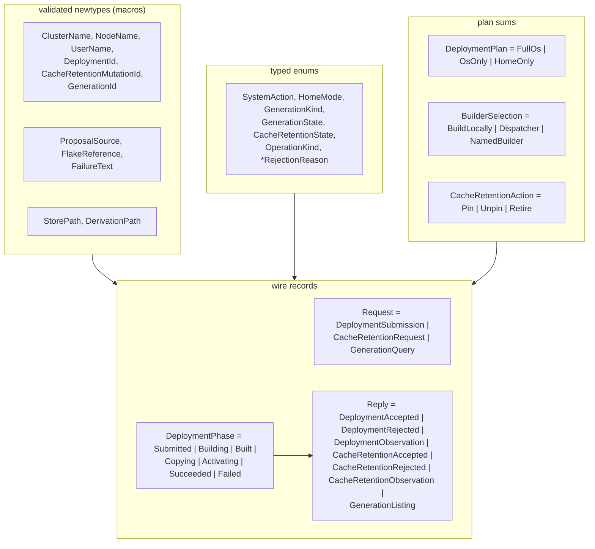
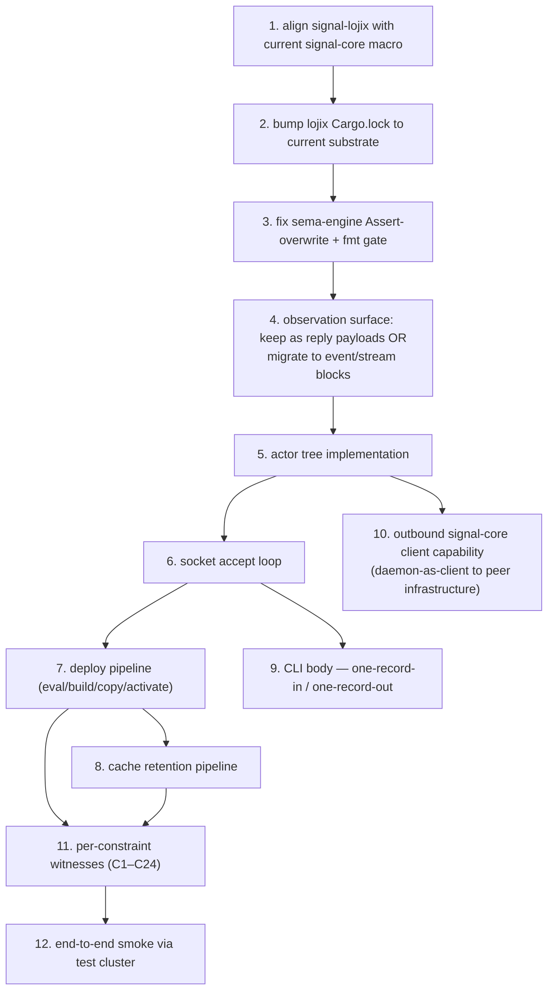

# 180 — Lojix daemon + CLI: implementation research

*Research on completing the new lojix stack on the
`horizon-re-engineering` worktree. Supersedes /179 §3 — the
worktree carries real implementation, not skeletons.*

> **Status (2026-05-15):** Research pass. No code edits in this
> pass; the report names the gap shape and a recommended landing
> sequence. The actor implementation, socket loop, deploy
> pipeline, and CLI body are operator/system-specialist lanes.

## 0 · Correction to /179

`reports/designer/179-...md` §3 reported that `signal-lojix` and
`lojix` were "skeletons with no `Cargo.toml` and no `src/`." That
finding was based on the canonical ghq checkouts at
`/git/github.com/LiGoldragon/{signal-lojix,lojix}/` — which sit on
`main`. On `main`, those repos genuinely *are* docs-only.

The active implementation lives on the
**`horizon-re-engineering`** branch in worktrees at
`~/wt/github.com/LiGoldragon/{signal-lojix,lojix}/horizon-re-engineering/`,
where both crates have real code. The earlier audit missed the
worktree path. This report works from the worktree state.

## 1 · Where the work lives — worktree layout

Per the workspace's `skills/feature-development.md` (now elevated
into every role's required-reading list, this pass), feature
arcs that touch production code happen on a branch in a
**parallel worktree**:

```
~/wt/github.com/LiGoldragon/<repo>/<branch-name>/
```

For the lojix arc on the `horizon-re-engineering` branch, the
relevant worktrees are:

| Worktree | Status |
|---|---|
| `~/wt/.../signal-lojix/horizon-re-engineering/` | Real contract crate. 544-line `src/lib.rs`. Compiles. |
| `~/wt/.../lojix/horizon-re-engineering/` | Library + two binary scaffolds. Smoke tests pass. Daemon body and CLI body are stubs. |
| `~/wt/.../lojix-cli/horizon-re-engineering/` | Legacy stack. Tracks the same branch for cross-arc consistency. Retires after CriomOS migrates. |
| `~/wt/.../horizon-rs/horizon-re-engineering/` | Cluster proposal projection; the new daemon reads it per request. |
| `~/wt/.../goldragon/horizon-re-engineering/` | Cluster proposal source. |
| `~/wt/.../CriomOS/horizon-re-engineering/` | OS layer; will eventually consume the new daemon. |
| `~/wt/.../CriomOS-home/horizon-re-engineering/` | Home Manager surface. |

The same branch name across every repo lets a single
`jj edit horizon-re-engineering` land the agent on the right
working surface in any of these crates. The canonical
`/git/.../` checkouts keep `main` available to peer agents at all
times.

## 2 · What's already built on the branch

### `signal-lojix/src/lib.rs`



The shape is rich and consistent: validated newtypes at every
identifier and free-form-text edge; typed enums for every
discrete choice; nested sums (`DeploymentPlan`,
`BuilderSelection`, `CacheRetentionAction`, `DeploymentPhase`)
for the small closed alphabets. Round-trip discipline applies
(rkyv + NOTA derive on every record).

### `lojix/`

| File | Status |
|---|---|
| `Cargo.toml` | Pinned deps: `signal-core`, `signal-lojix` (horizon-re-engineering branch), `sema-engine`, `nota-codec`, `rkyv`, `thiserror`, `kameo 0.20`, `tokio 1`. |
| `src/lib.rs` | Re-exports `signal_lojix` as `lojix::wire`. No daemon code yet. |
| `src/bin/lojix-daemon.rs` | Tokio entry point. Prints scaffold message; exits. |
| `src/bin/lojix.rs` | Tokio entry point. Prints scaffold message; exits. |
| `tests/smoke.rs` | Five tests: crate-name, wire re-export reachable, signal-core/sema-engine on dep path, `DeploymentSubmission` constructs through the wire vocabulary. All green. |

### `lojix/ARCHITECTURE.md` — 24 constraints (C1–C24)

The architecture names the destination shape, then lists 24
testable constraints organised by topic:

| Block | Constraints | Coverage |
|---|---|---|
| Crate shape | C1–C3 | binaries named correctly, wire re-export, single substrate per concern |
| Wire boundary | C4–C7 | socket path/mode/group, frame envelope, one-record-in/out, decode failures |
| Actor topology | C8–C12 | RuntimeRoot non-ZST, named state per actor, restart policy, no `Arc<Mutex>` cross-actor, no detached `tokio::spawn` |
| Durable state | C13–C15 | live-set as sema-engine table, event log via Assert+Subscribe, GC roots on filesystem |
| Deploy pipeline | C16–C18 | submission triggers eval→build→copy→activate, phase events emitted, rollback on activation failure |
| Cache retention | C19 | Pin/Unpin/Retire transitions via sema-engine `Atomic` (now `commit`) |
| Generation queries | C20 | filtered live-set read via `Match` |
| Test discipline | C21–C22 | each constraint has a test; end-to-end smoke through test cluster |
| Cutover | C23–C24 | production-shape smoke via `goldragon`'s `datom.nota`; `lojix-cli` retired |

Each constraint is a test seed. The ARCH says "ready to replace
the old stack" iff every constraint is green *and* the test
cluster runs a real deploy through the new daemon.

## 3 · Implementation gap map



### Gap A — `signal-lojix` macro invocation lags signal-core

The branch is pinned to signal-core revision `aa7a0d93` (pre-
proc-macro, 2026-05-14). At that pin signal-core's `signal_channel!`
was a `macro_rules!` accepting bare `request { ... } reply { ... }`
blocks. The current signal-core (commit `25212c0`) is a proc-macro
that requires the `channel <ChannelName> { ... }` outer wrap and
will reject the current shape.

The signal-lojix macro invocation today (worked example, current
shape):

```text
signal_channel! {
    request Request {
        Assert DeploymentSubmission(DeploymentSubmission),
        Mutate CacheRetentionRequest(CacheRetentionRequest),
        Match  GenerationQuery(GenerationQuery),
    }
    reply Reply {
        DeploymentAccepted(DeploymentAccepted),
        ... [7 variants total]
    }
}
```

Required shape per the new proc-macro grammar:

```text
signal_channel! {
    channel Lojix {
        request Request { ... }
        reply Reply { ... }
        // event + stream blocks if observations migrate to streaming
    }
}
```

The body of the `channel` block is otherwise identical. This is a
mechanical update once the lockfile bumps.

### Gap B — Cargo.lock pins are stale

`lojix/Cargo.lock` pins:

| Crate | Pinned to | Current main |
|---|---|---|
| `signal-core` | `aa7a0d93` (2026-05-14, pre-proc-macro) | `25212c0` |
| `signal-lojix` | `40def9b5` (horizon-re-engineering tip) | same branch, may have moved |
| `sema-engine` | `78872cee` | likely behind |
| `sema` | `4ea561bc` | likely behind |

`cargo update` will bump them. After the bump, signal-lojix's
macro call needs the channel wrap (Gap A). Also: signal-core's
hardened validation (commit `25212c0`) may surface diagnostics
that the older codebase silently passed.

### Gap C — sema-engine correctness bugs block daemon use

Per /179 §5 and DA/71, `sema-engine` has two bugs that need
landing before lojix builds on it:

- **`Engine::assert` silently overwrites existing keys**
  (`src/engine.rs:93` — no pre-write existence check). For
  lojix specifically, this means a duplicate `DeploymentSubmission`
  at the same `DeploymentId` would silently replace the prior fact
  while the commit log records `Assert`. The live-set integrity
  guarantee breaks under that shape.
- **`nix flake check -L` is red on fmt.** Mechanical fix.

The Mutate / Retract / SubscriptionSink paths look correct; the
sema-engine surface is otherwise lojix-ready. Lojix can start
its actor tree against the current sema-engine surface today, but
the Assert bug should land before any deploy-pipeline test goes
live.

### Gap D — Observations are reply variants, not streamed events

Today's `signal-lojix::Reply` carries `DeploymentObservation` and
`CacheRetentionObservation` as plain variants. That makes them
one-shot reply payloads tied to the requesting client's exchange
identifier — not push-events that arbitrary subscribers receive
as state evolves.

`lojix/ARCHITECTURE.md` C14 + invariant §5 say "Push, never poll.
Subscribers register; the daemon pushes DeploymentObservation and
CacheRetentionObservation as events occur." For that to be true,
the contract needs the streaming-channel grammar:

```text
signal_channel! {
    channel Lojix {
        request Request {
            Assert    DeploymentSubmission(DeploymentSubmission),
            Mutate    CacheRetentionRequest(CacheRetentionRequest),
            Match     GenerationQuery(GenerationQuery),
            Subscribe DeploymentObservation(DeploymentObservationFilter)
                      opens DeploymentEvents,
            Subscribe CacheRetentionObservation(CacheRetentionObservationFilter)
                      opens CacheRetentionEvents,
            Retract   StreamClose(StreamToken),
        }
        reply Reply {
            DeploymentAccepted(DeploymentAccepted),
            DeploymentRejected(DeploymentRejected),
            CacheRetentionAccepted(CacheRetentionAccepted),
            CacheRetentionRejected(CacheRetentionRejected),
            GenerationListing(GenerationListing),
            StreamOpened(StreamOpenedAck),
        }
        event Event {
            DeploymentPhaseEvent(DeploymentPhase)
                belongs DeploymentEvents,
            CacheRetentionTransition(CacheRetentionObservation)
                belongs CacheRetentionEvents,
        }
        stream DeploymentEvents {
            token StreamToken;
            opened StreamOpened;
            event DeploymentPhaseEvent;
            close StreamClose;
        }
        stream CacheRetentionEvents {
            token StreamToken;
            opened StreamOpened;
            event CacheRetentionTransition;
            close StreamClose;
        }
    }
}
```

The Subscribe variants open the streams; the daemon emits events
into the streams via `sema-engine`'s `SubscriptionSink`; the
client side gets `StreamingFrameBody::SubscriptionEvent` frames
on the acceptor lane. This is the C14/invariant-3 destination.

Either land the streaming shape now or accept that the
push-not-poll invariant is aspirational until it does. Recommend
landing it now, because the daemon's `SubscriptionSink` bridge
(the module already named `daemon/subscriptions.rs` in the
planned code map) is the natural place to introduce the
sema-engine ↔ wire-event translation, and that's the same code
path used at scale by `persona-mind`. Two patterns, one place.

### Gap E — Daemon-as-client capability is unnamed

The user's instruction names a piece the current architecture
doesn't surface: "create the possibility for this daemon to then
talk to the rest of our infrastructure directly with signal."

Today `lojix-daemon` is named as a **server** — it binds a
socket and accepts incoming `signal-lojix` frames. The
architecture says nothing about the daemon being a **client** to
peer infrastructure.

Two shapes this could take:

1. **Generic client capability.** Add a `daemon/client.rs`
   module that opens outbound Unix-socket connections to peer
   daemons, performs the `signal-core` handshake, and dispatches
   `signal-<peer>` requests. The daemon becomes a peer in the
   workspace's signaling fabric, not just a server. Use case:
   query `persona-mind` for tracked deploy items, push deploy
   observations to `persona-introspect`, ask `clavifaber` for
   per-host SSH material.
2. **Per-relation client modules.** Each outbound relation gets
   its own typed client (e.g. `daemon/mind_client.rs`,
   `daemon/introspect_client.rs`) backed by the appropriate
   `signal-<peer>` contract crate. This is more typed but
   multiplies module count.

Both have value. The natural first move is (1) — a thin generic
`SignalClient` over a `tokio::net::UnixStream` that any actor
can hold. (2) lands later when concrete relations have stabilised
typed contracts.

The architecture currently states the daemon is "cluster-
operator-owned, not per-host" (invariant §5). Becoming a client
of `persona-mind` and `persona-introspect` is consistent with
that ownership model — the daemon is a peer in the operator-side
fabric, not a per-host agent.

### Gap F — `ARCHITECTURE.md §6` collision

`lojix/ARCHITECTURE.md` carries two `## 6 ·` headers: the
Invariants section (line 112) and the Constraints section (line
127). The Cross-cutting context section at line 227 is also
numbered `## 6 ·`. Renumber to `§6 Invariants`, `§7 Constraints`,
`§8 Cross-cutting context` — small editorial fix.

## 4 · Recommended landing sequence

A minimal sequence to ship the daemon + CLI under the existing
24-constraint frame:

### Wave 1 — Substrate alignment

1. Land the sema-engine Assert-freshness + fmt fixes (operator
   lane; ~1 commit each per /179).
2. Bump `lojix/Cargo.lock` and `signal-lojix/Cargo.lock` to
   current `signal-core`, `sema-engine`, `sema`. Verify both
   crates `cargo check` clean against current main.
3. Update `signal-lojix/src/lib.rs`'s `signal_channel!`
   invocation to add `channel Lojix { ... }` wrap.
4. Decide observation shape (Gap D). If migrating to streaming
   now, restructure the macro invocation to add `event` and
   `stream` blocks, plus `Subscribe DeploymentObservation` /
   `Subscribe CacheRetentionObservation` request variants and
   the matching `StreamingFrame` alias.

### Wave 2 — Daemon runtime skeleton

5. `daemon/supervisor.rs` — `RuntimeRoot` Kameo actor carrying
   `ActorRef`s to children. Per C8: state must be non-ZST.
6. `daemon/live_set.rs` — `LiveSetActor` opens the sema-engine
   `Engine`, registers the `Generation` table, exposes
   `assert`/`mutate`/`retract`/`match` handlers.
7. `daemon/events.rs` — `EventLogActor` for the typed deploy
   event log (append-only via sema-engine `Assert`).
8. `daemon/subscriptions.rs` — `SubscriptionSink` impls that
   bridge sema-engine deltas to wire events
   (`StreamingFrameBody::SubscriptionEvent` frames). The
   `SubscriptionTokenInner` wrap into typed
   `signal_lojix::StreamToken`.
9. `daemon/socket.rs` — accept loop on
   `/run/lojix/daemon.sock`. Per-connection `tokio` task
   performs the handshake, decodes incoming frames into
   `signal_lojix::Request`, dispatches to the actor tree,
   encodes the reply.

### Wave 3 — Deploy pipeline

10. `daemon/deploy/eval.rs` — read `horizon-rs` in-process, project
    the requested cluster/node, produce a typed evaluation result.
11. `daemon/deploy/build.rs` — `nix build` with the projected
    horizon as override-input. Choose builder per
    `BuilderSelection`. Capture realised store path.
12. `daemon/deploy/copy.rs` — `nix copy --substituters
    <selected>` to the target node.
13. `daemon/deploy/activate.rs` — switch / boot / test per
    `SystemAction`. Roll the GC root forward on success.
14. `daemon/gc_roots.rs` — `GcRootActor` owns the
    `/nix/var/nix/gcroots/criomos/` tree. Per-kind slot layout.

### Wave 4 — Cache retention + queries

15. `daemon/cache_retention.rs` — Pin/Unpin/Retire transitions
    via sema-engine `commit` (atomic multi-op write). Each
    transition emits a `CacheRetentionObservation` event.
16. `daemon/queries.rs` — `GenerationQuery` filtering via
    sema-engine `Match` over the `Generation` table.

### Wave 5 — CLI body

17. `bin/lojix.rs` — read one NOTA record from stdin (or argv),
    open the daemon socket, perform handshake, send one
    `signal_lojix::Request` frame, await one Reply (or stream
    events until `StreamClose`), print NOTA on stdout.

### Wave 6 — Daemon-as-client capability

18. `daemon/client.rs` — `SignalClient` that any actor can hold,
    backed by `tokio::net::UnixStream`. Opens a connection to a
    peer daemon's socket (e.g. `persona-mind`,
    `persona-introspect`), performs the handshake, and provides
    a typed `send_request` / `subscribe` surface over arbitrary
    `signal-<peer>` contracts. Per Gap E.

### Wave 7 — Witnesses for C1–C24

19. One test per constraint per C21. The actor-density and
    no-blocking witnesses match the `skills/actor-systems.md`
    §"Test actor density" families.
20. End-to-end smoke per C22, C23: a real deploy in the test
    cluster + `goldragon`'s `datom.nota` projecting through the
    new daemon.

### Wave 8 — Cutover

21. CriomOS migrates to consume the new daemon's projection.
22. `lojix-cli` retires (per `protocols/active-repositories.md`
    §"Replacement Stack" cutover rule).
23. `horizon-rs main` closes the gap with `horizon-re-engineering`.

## 5 · Substrate readiness recap

| Substrate | Ready to consume? | Notes |
|---|---|---|
| `signal-core` (proc-macro `signal_channel!`) | ✓ | After `signal-lojix` adds the `channel <Name>` wrap |
| `signal-core` (FrameBody types) | ✓ | `ExchangeFrame` for v1 reply-only shape; `StreamingFrame` if Gap D lands |
| `sema-engine` (Engine surface) | ⚠ | After Assert-freshness + fmt fixes per /179 |
| `sema-engine` (SubscriptionSink) | ✓ | Already inline-or-detached, durable registration, post-commit deltas |
| `sema-engine` (Multi-table commit) | ✗ | Per-table only; lojix may live without it for the first slice |
| `sema-engine` (ReadPlan execution) | ✓ for lojix | `AllRows` + `ByKey` + `ByKeyRange` cover live-set / event-log / generation-query |
| `nota-codec` (NOTA derives) | ✓ | All signal-lojix records carry `NotaRecord` / `NotaSum` / `NotaEnum` / `NotaTryTransparent` |
| `kameo 0.20` | ✓ | Per `skills/kameo.md` |
| `tokio` | ✓ | Per `skills/actor-systems.md` async-runtime model |

## 6 · User-attention questions

### Q1 — observation shape: reply variants or streaming events?

The current `signal-lojix::Reply` has `DeploymentObservation` and
`CacheRetentionObservation` as plain variants — one-shot per
request. The architecture's push-not-poll invariant requires
streaming. Landing the streaming shape now means adding `event`
and `stream` blocks to the macro invocation plus two `Subscribe`
request variants. Estimate: a focused half-day's work, mostly
mechanical.

Recommendation: **land it now.** The `SubscriptionSink` bridge
module is on the planned code map regardless; the wire-level
streaming machinery in signal-core is already complete; and
deferring just means the daemon does the work in
`daemon/subscriptions.rs` anyway, only against a reply-variant
shape instead of an event-variant shape. The latter would be
churn at cutover.

### Q2 — daemon-as-client capability: generic or per-relation?

User's instruction asks the daemon to be able to talk to the
rest of the infrastructure via signal. Two designs (Gap E):
generic `SignalClient` over `UnixStream` versus per-relation
typed clients.

Recommendation: **start generic.** Add `daemon/client.rs` with
a `SignalClient` that holds a `tokio::net::UnixStream` and
exposes `send_request::<R, P>(request: Request<P>) -> Reply<R>`
parameterized over the peer contract crate's payload types.
When concrete outbound relations stabilise (mind-graph queries,
introspection pushes), wrap the generic client in typed
per-relation modules — but only after two or three relations
exist.

### Q3 — observation filters: empty payload or filter records?

If observations migrate to streaming (Q1), each Subscribe needs
a payload — does the client filter to a specific deployment or
generation, or subscribe to all events? Two shapes:

- `Subscribe DeploymentObservation(())` — opens the firehose.
  Client filters on receive.
- `Subscribe DeploymentObservation(DeploymentObservationFilter)`
  with `{ deployment: Option<DeploymentId>, cluster: Option<ClusterName>, node: Option<NodeName> }` — server-side filter.

Recommendation: **typed filter records.** Push the filter to the
daemon where the typed live-set already lives. Wire economy and
push-not-poll are both better served.

### Q4 — when does `lojix-cli` actually retire?

Per `protocols/active-repositories.md` §"Replacement Stack" the
cutover rule is: build replacement to feature parity, run both
in parallel, switch consumers one at a time, retire original
when no consumer remains. `CriomOS` and `CriomOS-home` are the
named consumers. The retirement window opens when:

- C1–C24 are all green on the test cluster (C22, C23 are the
  blocking gates);
- `CriomOS-home/flake.lock` and `CriomOS/flake.lock` swap their
  `lojix-cli` input for `lojix`.

The retirement closes when no flake.lock anywhere still pins
`lojix-cli`. Worth tracking via a `feature` bead — already filed
as `primary-vhb6`.

## 7 · See also

- `~/primary/skills/feature-development.md` — worktree path
  convention, branch naming, jj-workspace flow. Now in every
  role's required reading (this pass).
- `~/primary/AGENTS.md` §"Feature branches live in worktrees,
  not the canonical checkout" — top-level mention (this pass).
- `~/primary/protocols/active-repositories.md` §"Replacement
  Stack" — cutover discipline.
- `~/primary/reports/designer/179-signal-core-sema-engine-lojix-readiness-audit.md`
  — kernel readiness baseline; what /180 corrects (§3 there was
  wrong about skeleton state).
- `~/primary/reports/designer-assistant/71-signal-core-and-sema-engine-lojix-readiness-audit.md`
  — DA's parallel kernel audit; sema-engine Assert-overwrite + fmt
  findings carried forward into Wave 1 here.
- `~/wt/.../lojix/horizon-re-engineering/ARCHITECTURE.md` —
  the 24-constraint canonical spec for the daemon's shape.
- `~/wt/.../signal-lojix/horizon-re-engineering/src/lib.rs` —
  the typed wire vocabulary as currently shaped.
