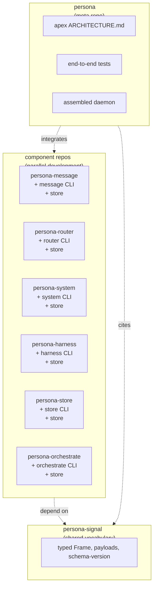
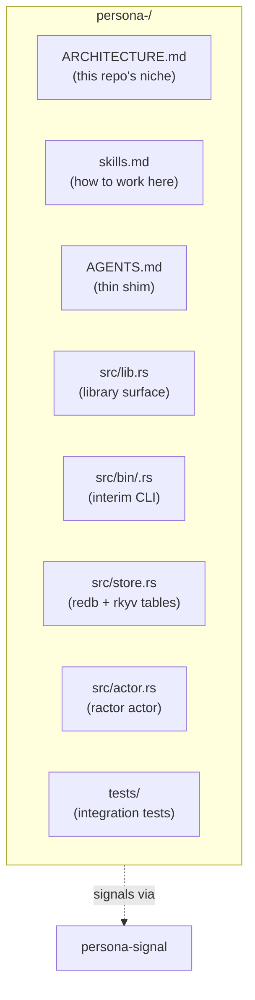
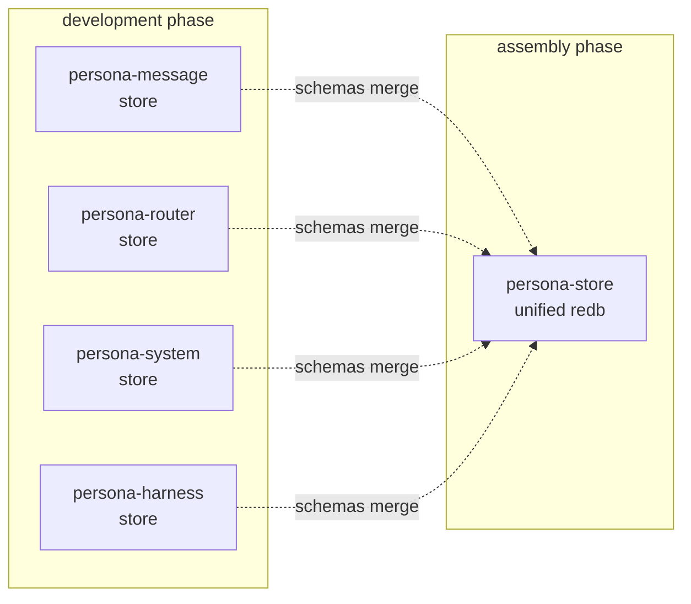
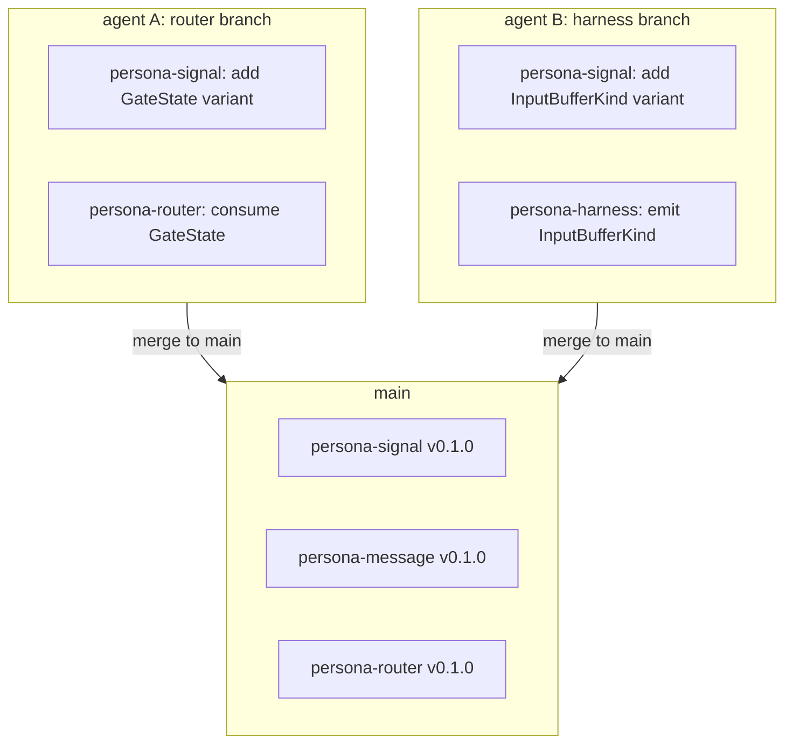
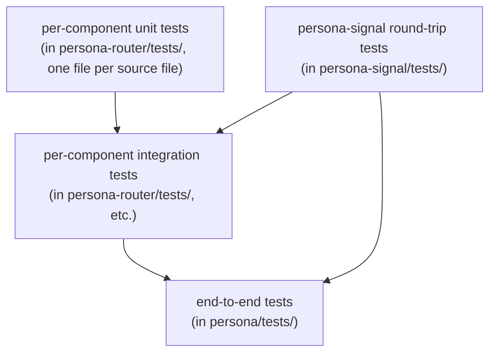
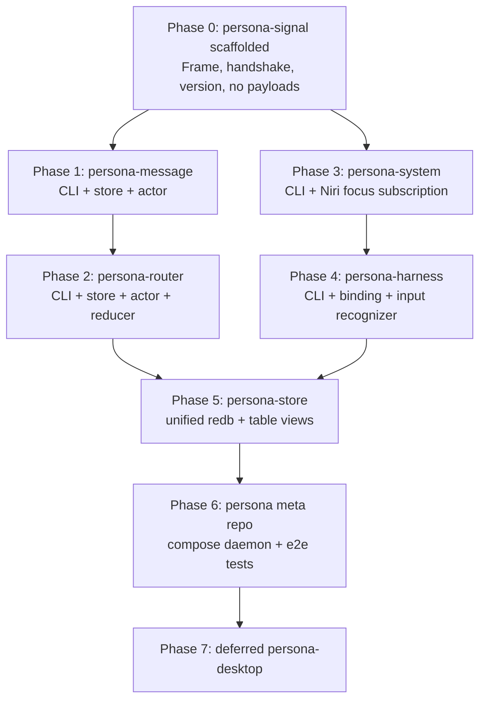
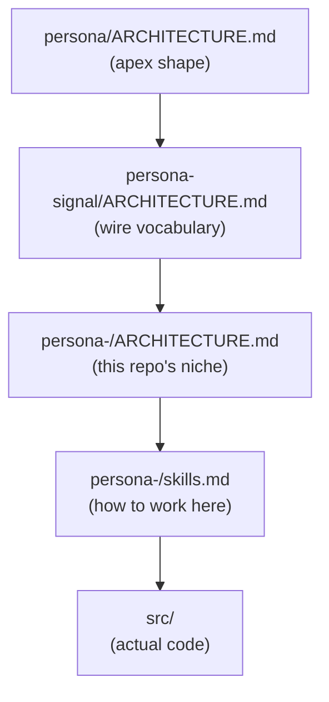

# Persona — parallel development architecture

Status: proposal
Author: Claude (designer)

How to develop the Persona components in parallel, keep each
component useful as a standalone tool along the way, and assemble
the whole into a daemon in the meta `persona` repo. The aim:
every component is testable on its own from day one, the meta
repo is where the final daemon is composed, and the path from
isolated tools to assembled daemon is incremental rather than
cliff-shaped.

This report sits on top of operator's
`~/primary/reports/operator/9-persona-message-router-architecture.md`
(component shapes, runtime topology) and designer's
`~/primary/reports/designer/18-persona-contract-repo-design.md`
(`persona-signal` as the shared wire vocabulary). It addresses
the *development process* across those components, not the
end-state architecture.

The pattern follows the criome/sema model: per-repo niches with
their own `ARCHITECTURE.md`; one meta repo (`persona`) holding
the apex architecture and end-to-end tests; one shared contract
crate (`persona-signal`) carrying the wire types every
component speaks.

---

## 0 · TL;DR



Three commitments make this work:

1. **Each component repo carries its own `ARCHITECTURE.md`,
   own CLI, own store, own tests.** Useful in isolation. A
   second agent picking up the repo can use the component
   without standing up the whole daemon.
2. **`persona-signal` is the shared wire vocabulary.** All
   components signal each other through `persona-signal`'s
   typed `Frame`. Schema agreement = signal-version agreement.
3. **`persona` is the meta repo** — apex `ARCHITECTURE.md`,
   end-to-end tests, the assembled daemon binary. Components
   are cargo dependencies (or git-pinned inputs) here; the
   meta repo doesn't *own* component source.

---

## 1 · The component pattern

Each component repo follows the same internal shape during
development:



What every component repo carries:

- **`ARCHITECTURE.md`** — this repo's role in the Persona
  ecosystem; what it owns; what it doesn't; code map;
  invariants. Per
  `~/primary/skills/architecture-editor.md`.
- **`skills.md`** — what an agent needs to know to work
  productively in this repo.
- **`AGENTS.md`** — thin shim per
  `~/primary/lore/AGENTS.md`'s convention; names the role.
- **A library crate** (the `lib.rs`) exposing the actor and
  its types. This is what `persona` imports.
- **An interim CLI binary** (`src/bin/<component>.rs`) that
  exercises the component in isolation. The CLI takes a NOTA
  request on argv (or stdin), calls the actor methods, prints
  a NOTA reply.
- **A local store** (`src/store.rs`) — redb tables of rkyv
  values that this component owns *during development*. When
  the meta daemon assembles, the store-owner role moves to
  `persona-store`; the component's tables migrate.
- **Tests** that exercise the actor and the CLI without
  needing the daemon stood up.

The library + binary split lets the same code be used two
ways: as a typed Rust dependency from `persona` (library), and
as a standalone tool from a shell or another agent (binary).

---

## 2 · Per-component CLIs

Every component ships with a CLI under `src/bin/`. The CLI is
the agent-facing entry point for that component during
development.

| Component | CLI | What it does |
|---|---|---|
| `persona-message` | `message` | Submit a message to the router; print the typed reply. Today: NOTA in, NOTA out, talks to a local socket. |
| `persona-router` | `router` | Step the router reducer manually; inspect pending deliveries; replay events. |
| `persona-system` | `system` | Subscribe to focus / window / input events for one target; print them as NOTA. |
| `persona-harness` | `harness` | Bind a harness target; observe input-buffer state; render a delivery to the harness terminal. |
| `persona-store` | `store` | Read/write typed records to the redb tables; show transitions; verify schema version. |
| `persona-orchestrate` | `orchestrate` | Workspace coordination — claim/release scopes, list locks, query BEADS. (The Rust successor to `tools/orchestrate`, per designer report 14.) |

These CLIs are not throwaway. They are the **typed development
surface** for each component:

- **Useful in isolation.** An agent working on the router
  doesn't need the whole daemon to exercise their changes.
- **Drives unit-level testing.** The CLI's request/reply
  round-trip is itself a tested boundary; the integration
  tests can call the CLI binary in subprocess.
- **Survives into the assembled daemon.** Most CLIs become
  thin shells over a socket call to the running daemon. The
  same NOTA-in/NOTA-out shape is preserved; only the
  transport changes.
- **Same boundary discipline.** NOTA on argv/stdin (humans
  read), `persona-signal` on the wire to other components
  (machines read).

Per
`~/primary/reports/designer/18-persona-contract-repo-design.md`,
NOTA appears at exactly two boundary points: CLI input and the
pre-harness component's output projection. Inside each
component, the value is typed Rust; on the wire between
components, the form is `persona-signal` rkyv frames.

---

## 3 · Store strategy — per-component during dev, unified at assembly

The destination, per operator report 9 §"Database ownership":
`persona-store` is the single redb owner inside the running
daemon. Cross-plane writes go through it; transactions are
sequenced; schema is unified.

The development path lets each component's store live in its
own repo while the component is being shaped:



During development:

- Each component repo defines its own redb tables and rkyv
  records for its piece of state.
- The CLI binary opens the repo's local store at a known
  path (e.g. `~/.local/state/persona-<component>/store.redb`).
- The library crate exposes a `Store` type — table
  definitions + read/write methods — that the binary uses and
  that `persona-store` will eventually consume.
- Tests use a tempdir for the store; the CLI accepts a
  `--store-path` for explicit paths.

At assembly:

- `persona-store` opens *one* redb file containing every
  component's tables.
- Each component's `Store` type becomes a *table view*
  presented by `persona-store` — the component still asks for
  `MessageStore`-shaped operations, but the underlying redb
  handle and transaction owner is `persona-store`.
- The schema-version known-slot record (per
  `~/primary/skills/rust-discipline.md` §"Schema discipline")
  is at the unified store's apex, checked at boot.

What this gives:

- **Each component's tables stay defined in that
  component's repo.** Schema authority for a component lives
  with the component.
- **The unified store is composed**, not authored from
  scratch. `persona-store`'s code mostly imports the table
  definitions from each component crate.
- **A component remains testable in isolation** even after
  the unified store exists. Its tests open a tempdir-backed
  store; the unified daemon opens the unified store. Same
  table definitions, two backings.

---

## 4 · Branching workflow for schema evolution

Multiple agents working on different components will land
schema changes in parallel. The contract crate
(`persona-signal`) is the synchronisation surface; component
stores follow the contract.



The discipline:

- **Schema changes land in `persona-signal` first.** A new
  variant in a closed enum is a coordinated change; pin the
  contract version in every consumer's `Cargo.toml`.
- **Each component branch pins the contract version.** Agent
  A's router branch uses `persona-signal = "0.1.1-alpha"`;
  agent B's harness branch uses a different alpha.
  Components don't see each other's in-flight schema until
  merge.
- **Merge into main bumps the contract version.** When agent
  A merges, `persona-signal` goes to `0.1.1`; agent B rebases
  and updates their pin; their own variant is now `0.1.2`.
  Closed enums; no `Unknown`; coordinated.
- **The version-skew guard catches drift at boot.** A
  component compiled against `persona-signal 0.1.0` won't
  start against a daemon running `0.1.2`; the schema-version
  record fails the check.

This works without a custom branching protocol. Standard
git/jj branching plus contract-crate version pinning gives the
discipline. The orchestrate workspace tool tracks who's
working on what (per
`~/primary/protocols/orchestration.md`); the contract repo
gives the merge surface.

If parallel store-schema work becomes a load-bearing pain
point, the `persona-orchestrate` Rust component (per designer
report 14) can grow scope to include schema-merge coordination
— but not before the pain shows up.

---

## 5 · Testing pyramid

Each component owns its own unit + integration tests. The meta
`persona` repo owns end-to-end tests.



| Layer | Where | What it tests |
|---|---|---|
| Contract round-trip | `persona-signal/tests/` | Every `Frame` body variant encodes and decodes; bytecheck rejects malformed bytes; schema-version guard logic. |
| Unit (per type) | `persona-<component>/tests/<type>.rs` | The actor's reducer; the store's read/write methods; the CLI's NOTA parser. |
| Integration (per component) | `persona-<component>/tests/` | The component as a whole — actor lifecycle, store + actor + CLI together; fake event sources. |
| End-to-end | `persona/tests/` | Multi-component flows. The router + harness + system + store assembled into a tiny daemon; a real test harness sends messages and verifies delivery. |

The pyramid lets development stay fast: the inner layers run
without standing up the daemon. End-to-end tests are slow and
exercise the assembled topology; they live in `persona` and
run in CI, not on every component edit.

The `persona` repo's end-to-end tests are also the
**verification that components compose correctly**. If the
router merges with the harness and an unexpected interaction
appears, the end-to-end test catches it before any user does.

---

## 6 · Development phases



Phase commitments:

- **Phase 0 is enabling.** `persona-signal` is the
  prerequisite for every component's wire boundary. Land it
  before anything else.
- **Phases 1–4 are independent.** message, router, system,
  harness can be developed in parallel by different agents
  once the contract scaffold exists. Each one has a CLI, a
  store, tests; each one is useful in isolation.
- **Phase 5 unifies the store.** The component stores merge
  into one redb owner. The component crates retain their
  table-definition authority; `persona-store` composes them.
- **Phase 6 assembles.** `persona` imports every component
  crate, stands up the actor tree, runs end-to-end tests.
  The meta `ARCHITECTURE.md` lives here.
- **Phase 7 is deferred.** Per operator report 9
  §"What is retired", `persona-desktop` waits until the
  router can deliver safely.

What is **not** sequential:

- **Refactors after a phase lands.** A phase ending doesn't
  freeze its repo. New variants in `persona-signal`, new
  CLIs in component repos, new tables — all welcome later.
- **`ARCHITECTURE.md` updates.** Each phase's architecture
  doc gets refined as the implementation reveals shape. The
  doc is a current-shape document; lag is the smell.

---

## 7 · Where each architecture document lives

```
persona/                                  ← meta repo
├── ARCHITECTURE.md                       ← apex; the whole ecosystem
├── tests/                                ← end-to-end tests
└── (imports every component as a dep)

persona-signal/
├── ARCHITECTURE.md                       ← the wire vocabulary

persona-message/
├── ARCHITECTURE.md                       ← message handling niche
├── skills.md                             ← how to work here
├── src/lib.rs
└── src/bin/message.rs

persona-router/
├── ARCHITECTURE.md                       ← delivery reducer niche
├── skills.md
└── (similar)

persona-system/
├── ARCHITECTURE.md                       ← OS/window/input niche
└── (similar)

persona-harness/
├── ARCHITECTURE.md                       ← harness binding + recognizer niche
└── (similar)

persona-store/
├── ARCHITECTURE.md                       ← unified store + transactions niche
└── (similar)

persona-orchestrate/
├── ARCHITECTURE.md                       ← workspace coordination niche
└── (similar)
```

The apex `persona/ARCHITECTURE.md` describes:

- The runtime topology (which processes exist; what speaks
  to what).
- The wire vocabulary (`persona-signal` as the typed
  contract).
- Cross-component invariants (transaction ownership, store
  ownership, schema-version discipline).
- The named clusters and their boundaries.

The per-repo `ARCHITECTURE.md` describes:

- This repo's role inside the Persona ecosystem.
- The major types this repo owns.
- The contracts at this repo's boundaries (what it imports
  from `persona-signal`; what it exposes).
- The repo's code map.
- Invariants specific to this repo.

Per `~/primary/skills/architecture-editor.md`, the meta and
per-repo split avoids ecosystem-wide architecture growing into
a single huge file and avoids per-repo files repeating
ecosystem-wide context.

---

## 8 · How an agent picks up cold

The reading order for a new agent joining a component repo:



Apex first (the whole ecosystem); contract crate second (the
wire); the repo's own architecture; the repo's skills; then
the code. This ordering is enforced not by a tool, but by the
documents themselves — each layer cites the next layer down,
so an agent that follows references arrives in the right
order.

This is `~/primary/ESSENCE.md` §"Documentation layers" applied
to Persona's repo set.

---

## 9 · What this means for operator report 9

Operator's report 9 lists 8 implementation steps. The framing
above shifts those steps:

- **Step 0** (added by designer report 18): scaffold
  `persona-signal`. Apex of the dependency tree.
- **Steps 1–4** become **parallel-eligible.** message, router,
  system, harness can advance in parallel once `persona-signal`
  is scaffolded.
- **Step 5** (redb storage) becomes **`persona-store`
  consolidation** — unified redb file, table views composed
  from each component's table definitions.
- **Step 6** (Niri focus source) is part of phase 3
  (`persona-system`).
- **Step 7** (input-buffer fixtures) is part of phase 4
  (`persona-harness`).
- **Step 8** (live test) becomes **phase 6 in `persona`** —
  the meta repo's end-to-end test harness.

Operator report 9's substance is preserved; the development
shape is the rearrangement.

---

## 10 · Decisions for the user

| Decision | Recommendation |
|---|---|
| Per-component CLI binary in each repo | Yes — `src/bin/<component>.rs`; useful in isolation; survives into the assembled daemon as a thin shell |
| Per-component store during development | Yes — local redb at `~/.local/state/persona-<component>/store.redb`; tests use tempdirs |
| Unified store at assembly | Yes — `persona-store` opens one redb; component crates contribute table definitions |
| Branching workflow for schema | Standard git/jj branching + contract-crate version pinning. No custom protocol unless pain emerges. |
| Apex `ARCHITECTURE.md` location | `persona/ARCHITECTURE.md` |
| Per-repo `ARCHITECTURE.md` mandatory? | Yes — every Persona component repo carries one (per `~/primary/skills/architecture-editor.md`) |
| When to start the meta `persona` repo | After phase 0 (`persona-signal` scaffolded) and phase 1 (`persona-message`); even an empty meta repo with the apex `ARCHITECTURE.md` is useful for orienting agents |

---

## 11 · See also

- `~/primary/reports/operator/9-persona-message-router-architecture.md`
  — the component shapes and runtime topology this report
  develops in parallel against.
- `~/primary/reports/designer/17-persona-router-architecture-audit.md`
  — audit of report 9; finding §1 (rename to `persona-store`)
  is referenced here.
- `~/primary/reports/designer/18-persona-contract-repo-design.md`
  — `persona-signal` as the shared wire vocabulary; this
  report's phase 0 starts there.
- `~/primary/reports/designer/14-persona-orchestrate-design.md`
  — the workspace orchestration component (different from the
  intra-daemon database owner); both ship as Persona-family
  crates.
- `~/primary/reports/designer/4-persona-messaging-design.md`
  — destination architecture; this report develops the path
  to it.
- `~/primary/skills/architecture-editor.md` — how to write
  and maintain the per-repo and apex architecture documents.
- `~/primary/skills/contract-repo.md` — the contract-repo
  pattern; signals between components.
- `~/primary/skills/rust-discipline.md` §"redb + rkyv —
  durable state and binary wire" — the rules each component's
  store and wire follow.
- `~/primary/ESSENCE.md` §"Rules find their level" — where
  each kind of rule lives.
- `~/primary/repos/criome/ARCHITECTURE.md` — canonical worked
  example of a meta-repo's apex architecture.

---

*End report.*
