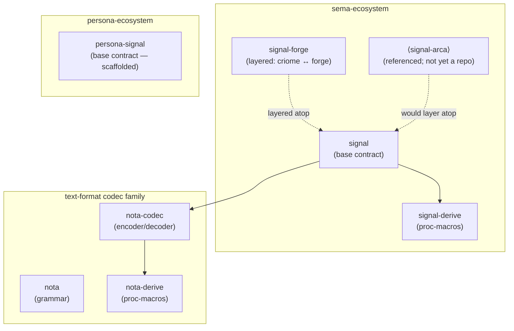

# Contract repo survey

Status: complete
Author: Claude (designer)

Census of contract repos in the workspace today, gaps relative to the
known-coming work, and concrete recommendations for the persona-signal
type surface (which is operator's territory and currently claimed; the
recommendations here become a bead for whoever picks it up).

---

## Existing contract repos



| Repo | Role | Status |
|---|---|---|
| `signal` | sema-ecosystem base contract — `Frame`, handshake, auth, request/reply enums, sema record kinds | **alive, exercised** (35 round-trip tests) |
| `signal-derive` | proc-macros for signal record kinds (`NotaRecord`, `Schema`, `NexusPattern`) | **alive** |
| `signal-forge` | layered effect crate: criome → forge wire (Build, Deploy, store-entry ops) | **alive** |
| `signal-arca` | referenced in `signal/ARCHITECTURE.md` as the writers ↔ arca-daemon leg | **NOT yet a repo** — gap |
| `nota` | the text grammar | **alive** |
| `nota-codec` | text codec (encoder/decoder, derive surface) | **alive** |
| `nota-derive` | proc-macros for nota records | **alive** |
| `persona-signal` | Persona base contract — `Frame`, handshake, message/router/system payloads | **scaffolded** (operator just landed; substance present, discipline gaps below) |

Two observations:

1. **Signal-arca is named in signal's docs but has no repo today.** Either
   the writers ↔ arca-daemon leg uses `signal` directly (without a
   layered crate) or the layered crate is implicit-pending. Worth
   confirming with the user; if the intent is a layered crate, the
   gap is real.
2. **No persona-derive yet.** Signal has `signal-derive` for proc-macros
   that produce the `NotaRecord` / `Schema` / `NexusPattern` derives.
   Persona's contract today uses only stock rkyv derives — no
   project-specific proc-macros. That's fine for now; if Persona
   develops its own derive needs (e.g. `PersonaPattern` for queryable
   records), a `persona-derive` repo would be the right home.

---

## Do we need more contract repos?

Three near-term candidates, each with a trigger:

| Candidate | Trigger | Recommended action |
|---|---|---|
| `signal-arca` | The writers ↔ arca-daemon leg becomes a real wire (today: arca-daemon may use signal directly; check) | Confirm intent with user; create when the writers leg lands |
| `persona-derive` | Persona records start needing project-specific proc-macros (`PersonaPattern`, custom `Schema` shape) | Defer — premature today |
| `signal-network` | Cross-machine signaling lands as a real protocol | Already tracked: bead `primary-uea` (P3) |

For the **persona** ecosystem specifically, the question is whether
the layered-effect-crate pattern triggers today:

- **`persona-signal-niri`**: layered atop `persona-signal`, narrow audience
  (`persona-system`'s Niri backend + `persona-router`). Per designer
  report 18 §"Layered effect crates": defer until a second `persona-system`
  backend exists. **No, not yet.**
- **`persona-signal-wezterm`**: layered atop `persona-signal`, narrow audience
  (`persona-wezterm` + `persona-harness`). Defer until a second harness
  adapter exists. **No, not yet.**

So today: one Persona contract repo (`persona-signal`), with the door
open for layered crates as the matrix fills in.

---

## State of `persona-signal`'s type surface

Operator's scaffold lands the right shape: 12 `.rs` files covering
auth / delivery / error / frame / harness / message / reply / request /
store / system / version / lib. `Frame::encode` /
`encode_length_prefixed` / `decode` / `decode_length_prefixed` work
end-to-end; two round-trip tests pass; `cargo check` is clean.

The substance is there. The discipline gaps below are about typing
strength and missing record kinds — the kind of work a careful pass
through the file set tightens.

### Discipline gaps (rust-discipline + signal pattern)

These are where the current scaffold doesn't yet match signal's
typing discipline. Each one is a concrete, mechanical fix.

#### 1 — Wrapper newtypes have `pub` fields

| Type | Current shape | Should be |
|---|---|---|
| `MessageId { pub value: String }` | struct with pub field | tuple newtype `MessageId(String)` with private inner; constructors via `mint()` / `try_from(&str)`; reader via `as_str()` |
| `StoreTransitionId { pub value: String }` | same | same shape |
| `MessageBody { pub text: String }` | same | same shape |
| `SystemSubscriptionAccepted { pub subscription_id: String }` | string field | `SubscriptionId` newtype |

The signal reference (`signal/src/slot.rs`) shows the pattern: tuple
newtype with private inner, `Slot::from(value)` constructor,
`slot.value()` reader. Per `~/primary/ESSENCE.md` §"Behavior lives on
types": *"a wrapper newtype's wrapped field is private."*

#### 2 — Stringly-typed identity

Strings used as identity for harness targets, components, paths, etc.
should be typed newtypes:

| Field appearing as `String` | Recommended newtype |
|---|---|
| `target: String` (DeliverNow, DeferredDelivery, RejectedDelivery, Delivered, InputBufferState variants, SystemObservation) | `HarnessTarget(String)` |
| `recipient: String` (DeliverMessage, MessageAddress) | `HarnessTarget` (same as target — recipient is a target) |
| `sender: String` (MessageAddress) | `ComponentId(String)` |
| `subscriber: String` (SubscribeSystem) | `ComponentId` |
| `name: String` (HarnessBinding) | `HarnessName(String)` |
| `socket: String` (HarnessEndpoint::PseudoTerminal) | `WirePath(Vec<u8>)` per rust-discipline §"rkyv on the wire" — `PathBuf` doesn't archive deterministically |
| `executable: String` (LocalProcessProof) | `WirePath` |
| `component: String` (HandshakeRequest) | `ComponentId` |
| `token_id: String` (CapabilityProof) | `CapabilityTokenId([u8; 32])` — capability tokens are bytes, not strings |

Suggested file: `src/identity.rs` (mirrors signal's `identity.rs`).

#### 3 — Stringly-typed reasons (closed-enum candidates)

| Current | Should be |
|---|---|
| `Rejected { pub reason: String }` | `Rejected { pub reason: RejectionReason }` (closed enum) |
| `RejectedDelivery { pub reason: String }` | `RejectedDelivery { pub reason: DeliveryRejectionReason }` |
| `StoreRejected { pub reason: String }` | `StoreRejected { pub reason: StoreRejectionReason }` |

The reasons aren't unbounded; each rejection class has a finite set
that consumers want to pattern-match on. Per
`~/primary/ESSENCE.md` §"Beauty is the criterion":
*"Stringly-typed dispatch — `match name.as_str()` over cases that
should be a closed enum."*

A stub `Other(String)` variant inside the enum is a smell; if a real
case exists today, give it its own variant.

#### 4 — Boolean-as-outcome

```rust
pub struct HandshakeReply {
    pub accepted: bool,
    pub version: ProtocolVersion,
}
```

A boolean carrying a multi-state outcome is the exact diagnostic
reading from `~/primary/ESSENCE.md` §"Beauty is the criterion":
*"A boolean parameter at a call site (`frob(x, true)`)."* This wants
a closed enum:

```rust
pub enum HandshakeReply {
    Accepted { version: ProtocolVersion },
    Rejected { reason: HandshakeRejectionReason, version: ProtocolVersion },
}

pub enum HandshakeRejectionReason {
    UnsupportedMajor { ours: u16, theirs: u16 },
    UnsupportedMinor { ours: u16, theirs: u16 },
    UnknownComponent,
    AuthRequired,
    AuthInvalid,
}
```

#### 5 — Missing record kinds (per operator report 9)

Operator report 9 §"System abstraction" names four system events:

| Event | In persona-signal today? |
|---|---|
| `FocusChanged(target, focused)` | ✓ as `FocusChanged(FocusState)` |
| `WindowClosed(target)` | ✗ missing |
| `InputBufferChanged(target, state)` | ✓ as `InputBufferChanged(InputBufferState)` |
| `DeadlineExpired(id)` | ✗ missing |

Plus `BindingLost(target)` from the harness side (per report 9
§"Window binding and races" + designer audit 17 §6) — also missing.

And a `DeadlineId(String)` newtype paired with the `DeadlineExpired`
event.

Suggested addition to `system.rs` and `harness.rs`:

```rust
// system.rs
pub enum SystemEvent {
    FocusChanged(FocusState),
    WindowClosed(HarnessTarget),
    InputBufferChanged(InputBufferState),
    DeadlineExpired(DeadlineId),
}

// harness.rs
pub struct BindingLost {
    pub target: HarnessTarget,
}
```

#### 6 — `SystemEvent::HarnessObservation` overlap

```rust
pub enum SystemEvent {
    FocusChanged(FocusState),
    InputBufferChanged(InputBufferState),
    HarnessObservation(SystemObservation),  // ← overlap
}

pub struct SystemObservation {
    pub target: String,
    pub focus: FocusState,         // ← already in FocusChanged
    pub input: InputBufferState,   // ← already in InputBufferChanged
}
```

A producer that pushes `FocusChanged` separately from
`InputBufferChanged` doesn't also push `HarnessObservation` — and
vice versa. The current shape lets both happen; the consumer can't
tell which is authoritative.

Recommendation: pick one shape per the design. Operator report 9
favours separate events (push individual deltas, not aggregated
snapshots), which matches push-not-pull §"Subscription contract"
(initial state on connect = one `FocusChanged` + one
`InputBufferChanged` immediately after subscribe; subsequent events
are deltas). Drop `HarnessObservation` from `SystemEvent`. Keep
`SystemObservation` as a value type if it's useful for store
projections, but not as an event variant.

#### 7 — `ID::new(value)` lacks the mint convention

`MessageId::new(value: impl Into<String>)` accepts any string. The
signal pattern (per `~/primary/ESSENCE.md` §"Don't hide typification
in strings") is:

> If the workspace uses prefix conventions, the convention lives in
> the type's constructor (`MessageId::mint()` produces a string
> starting with `m-`); no other code knows about the prefix.

Three constructors per ID type:

```rust
impl MessageId {
    /// Mint a fresh ID. The format (`m-<random-suffix>`) is owned
    /// by this constructor; no other code generates a MessageId.
    pub fn mint() -> Self { ... }

    /// Reconstruct from a string already known to be a valid
    /// MessageId — typically deserialised or read from a store.
    pub fn from_minted(s: impl Into<String>) -> Self { Self(s.into()) }

    /// Parse a string from an external source. Validates the
    /// prefix; returns Err if invalid.
    pub fn try_from_external(s: &str) -> Result<Self, ParseError> { ... }
}

impl AsRef<str> for MessageId {
    fn as_ref(&self) -> &str { &self.0 }
}
```

Same shape for `StoreTransitionId` (`t-`), `SubscriptionId` (`s-`),
`DeadlineId` (`d-`).

#### 8 — Missing round-trip tests

Today: `tests/frame.rs` (2 tests) and `tests/version.rs`. Signal has
35 round-trip tests covering every record kind.

Recommendation: one round-trip test per record kind, gated on `cargo
test`. The test set should fail if a new variant is added without a
test.

---

## What this becomes

The discipline gaps above are mechanical fixes — none requires a new
design decision; each follows from existing rules in the workspace.
Two paths forward:

1. **Operator picks them up** (natural fit — operator owns
   `persona-*` implementation). Bead `primary-tss` opened with the
   concrete checklist.
2. **Designer picks them up** when operator releases the claim, on
   the basis that they are skeleton-as-design type sketches per
   `~/primary/ESSENCE.md` §"Skeleton-as-design" — not implementation
   logic. The user's directive ("populate some data types for those
   contracts using the pattern of signal") puts this in either
   role's reach.

The bead lists the eight numbered gaps above with the suggested
file-level shape for each. Whoever picks it up has a concrete
checklist; the rules behind each gap live in the linked workspace
skills + ESSENCE sections.

---

## Recommendations for the user

| # | Recommendation |
|---|---|
| 1 | Confirm whether `signal-arca` should exist as a layered crate today or whether arca-daemon uses signal directly. If layered, open as a creation task. |
| 2 | Defer `persona-derive` — Persona contract types use stock rkyv derives today; create the proc-macro repo only when project-specific derives appear. |
| 3 | Defer `persona-signal-niri` and `persona-signal-wezterm` until a second backend / adapter exists, per designer report 18. |
| 4 | The bead `primary-tss` carries the persona-signal type-strengthening work. Operator-natural; designer can pick up under skeleton-as-design framing. |

---

## See also

- `~/primary/skills/contract-repo.md` — the workspace pattern.
- `~/primary/skills/rust-discipline.md` §"redb + rkyv — durable
  state and binary wire" — the rules each gap cites.
- `~/primary/repos/signal/ARCHITECTURE.md` — the canonical
  worked example; the discipline gaps benchmark against this.
- `~/primary/repos/signal/src/slot.rs` — the canonical worked
  example for ID-shaped newtypes.
- `~/primary/reports/designer/18-persona-contract-repo-design.md`
  — the persona-signal design this report audits the
  implementation against.
- `~/primary/reports/operator/9-persona-message-router-architecture.md`
  — the source of the missing system events.
- `~/primary/reports/designer/17-persona-router-architecture-audit.md`
  §6 — the missing `BindingLost` event.

---

*End report.*
