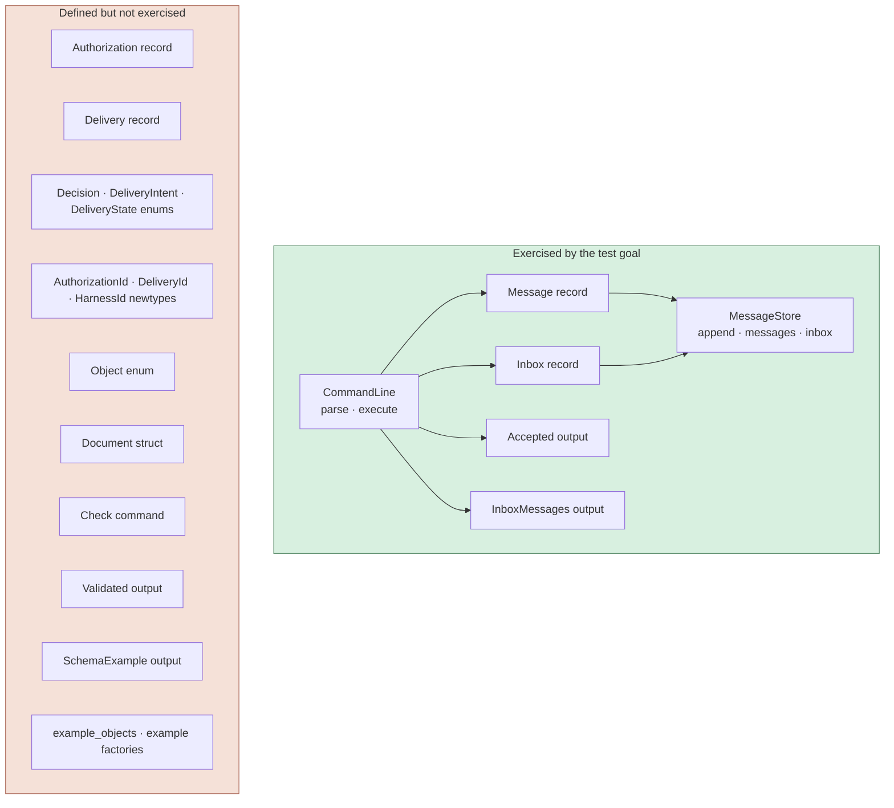
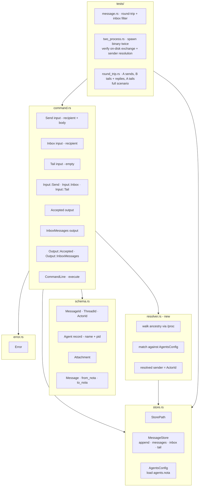

# persona-message — audit (skeptical, simpler-is-better)

Date: 2026-05-06
Author: Claude (designer)
Scope: `/git/github.com/LiGoldragon/persona-message` (initial commit
shape — no commits in the local checkout's git, but the source is
present and runnable). Goal of the prototype, per the user: *"see
messages being exchanged between harnesses; the messaging component
will be integrated into a reducer with the proper database and persona
later."*

---

## TL;DR

The shape is **right** — Nota records, NotaRecord-derived,
file-based append-only ledger, CLI as one Nota record in / one
Nota record out. The implementation faithfully follows the
design report.

The shape is **too big in some places, too small in others**.

**Too big:** roughly half the type surface is
destination-plumbing the prototype doesn't exercise.
`Authorization`, `Delivery`, three lifecycle enums, three
identifier newtypes, `Object`/`Document` wrapping,
`SchemaExample` output, a `Check` validate-only command, the
`::example()` factories on every record. None of it is run by
the message-exchange flow; it's there to *look like* the
eventual reducer shape. Contracts you don't drive lie.

**Too small:** three mechanics are missing that the *actual
round-trip test scenario* needs (see §"What the test scenario
actually requires"):

1. **Certain sender identity** without trusting the message's
   `from` claim — the binary must resolve who invoked it from
   the process tree, not from what the message says.
2. **An agents config file** mapping names to verifiable
   identifiers (PIDs, sessions, or cwds).
3. **A `Send` input shape** that the binary stamps with the
   resolved sender, plus a **`Tail` mode** so the receiving
   harness sees the message arrive while it's idle (Gas City's
   prompt-injection equivalent).

The existing tests are also all in-process (share a
`MessageStore` instance). A two-process round-trip test is
what would actually validate the prototype's reason for
existing.

---

## Current shape



**Live block** is the message-exchange path. **Dead block** is
type surface and code that has no runtime caller in the
prototype's stated test goal. (Authorization and Delivery
appear in `tests/message.rs::object_type_checks_authorization_and_delivery`
which type-checks them but doesn't *use* them — no auth gate
runs, no delivery state machine transitions.)

By line count, the dead block is roughly half the code in
`schema.rs` + much of `command.rs`'s output-side variants.

---

## Specific findings, ordered by impact

### 1. Authorization, Delivery, and the lifecycle enums are premature

The records exist, NotaRecord-derive cleanly, and round-trip
through Nota — but **no behavior reads them**. The store has no
authorization gate; the CLI doesn't propose deliveries; nothing
transitions `DeliveryState`. They're documented in the type
system without being lived in.

For the stated test goal — "see messages exchanged between
harnesses" — they don't earn their keep.

**Suggestion:** delete `Authorization`, `Delivery`, `Decision`,
`DeliveryIntent`, `DeliveryState`, `AuthorizationId`,
`DeliveryId`, and `HarnessId`. Reintroduce each one when the
behavior that drives it is being added. The first reintroduction
will likely be `Authorization` once the CLI grows an
`(Authorize delivery decision reason)` command and an actual
gate; the second will be `Delivery` once the store tracks
queued/delivered/observed transitions.

### 2. `Object` and `Document` are wrappers for nothing

`Object` is a sum of `Message` / `Authorization` / `Delivery`.
`Document` is `Vec<Object>`. Neither is consumed by the
message-exchange flow. They exist for `SchemaExample` (a
demo-mode output) and the type-checks test.

This is the same wrapper-enum-mixing-concerns pattern my
earlier persona audit flagged on the previous scaffold. If
the union has no dispatch site, drop the union.

**Suggestion:** delete `Object` and `Document`. If the
schema-example demo is worth keeping, just print the example
`Message` record (one line). Bring back a sum type when there's
a real per-variant dispatcher.

### 3. `Input::Check` is a dev tool dressed up as a Command

`Check` decodes a Nota record and re-encodes it without
storing it. It's a roundtrip-checker; useful while developing,
not a production command. It also bloats the dispatch surface
the harness fabric will eventually subsume.

**Suggestion:** drop `Check` from `Input`. If the validation
affordance is useful, expose it as a separate
`message validate <text>` mode or move it to
`#[cfg(test)]`-only test helpers.

### 4. `Output` has 4 variants; the path uses 2

`Output::{Accepted, InboxMessages}` cover send + read.
`Output::Validated` is `Check`'s output. `Output::SchemaExample`
is the no-args demo.

**Suggestion:** trim to `Output::{Accepted, InboxMessages}`.
Drop `Validated` and `SchemaExample`.

### 5. `::example()` factories on every record

Each record carries an `::example()` constructor for the demo
mode and the type-checks test. They're dev affordances that
expand the public surface.

**Suggestion:** move under `#[cfg(test)]` or into a
`tests/fixtures.rs` module. Public types shouldn't carry
example-data factories.

### 6. The no-args path is asymmetric and forks main()

`main.rs` checks `args_os().len() == 1` before reading
`PERSONA_MESSAGE_STORE`. With no args, it short-circuits to
`Output::schema_example()` and never opens the store. With
args, it requires the env var.

`CommandLine::execute` *also* short-circuits the no-args case
to `schema_example()`. So two places handle the no-args
behavior.

This is hidden control flow. The CLI's behavior depends on
arg count in two layers; one of them never reaches the store.

**Suggestion:** make the CLI uniform — if invoked with no
args, print a one-line usage hint and return non-zero. Don't
fork the path; don't have main re-implement what `execute`
already does.

### 7. `PERSONA_MESSAGE_STORE` mandatory env var is friction

For a naive test, requiring an env var to run the binary is
unnecessary friction. The README's example sets
`PERSONA_MESSAGE_STORE=.message` on every invocation.

**Suggestion:** default to a sensible path
(`./.persona-message/` or `$XDG_DATA_HOME/persona-message/`).
Allow `PERSONA_MESSAGE_STORE` as an override. The env var is
useful for tests that want a temp dir; the default is useful
for everything else.

### 8. The argument-joining inline-Nota path is awkward

`CommandLine::inline_nota_text` joins `args_os` with spaces.
The test exercises this by passing the Nota record split
across many `from_arguments` entries. This imitates shell
tokenization inside Rust, but the right way to test the
binary is `Command::new("message").arg("(Message m-1 …)")`.

The current shape works because the user always passes the
whole Nota record as one shell-quoted string from the shell
side; but the **test** doesn't exercise that path because it
uses `CommandLine::from_arguments` directly. The CLI's actual
shell-invoked behavior isn't tested.

**Suggestion:** drop the multi-arg join. Take exactly one
positional argument. Simpler `CommandLine` shape; failure
mode is clearer (`UnexpectedArgument` if more than one).

### 9. `expect_end` is the missing nota-codec primitive

It's defined in `schema.rs` and called by four `from_nota`
functions (`Message`, `Object`, `Document`, `Input`). My
earlier persona audit flagged this — it belongs in
`nota-codec` as `Decoder::expect_end()`. The duplication
continues across crates.

**Suggestion:** push `expect_end` into nota-codec proper.
Until then, accept the local helper but note the smell.

### 10. The tests don't cover the actual test goal

The stated goal is "see messages being exchanged between
harnesses." Three of the four tests are in-process (share a
`MessageStore` instance). The fourth uses
`CommandLine::from_arguments` directly — also in-process,
not actually invoking the binary.

**No test demonstrates two separate processes communicating
via the file store**, which is exactly what the prototype
exists to prove.

**Suggestion:** add `tests/two_process.rs`:

```rust
#[test]
fn two_processes_exchange_a_message() {
    let dir = tempfile::tempdir().unwrap();
    // Process A: send
    let send = Command::new(env!("CARGO_BIN_EXE_message"))
        .env("PERSONA_MESSAGE_STORE", dir.path())
        .arg(r#"(Message m-1 thread-1 operator designer "hello" [])"#)
        .output().unwrap();
    assert!(send.status.success());

    // Process B: read
    let read = Command::new(env!("CARGO_BIN_EXE_message"))
        .env("PERSONA_MESSAGE_STORE", dir.path())
        .arg("(Inbox designer)")
        .output().unwrap();
    let stdout = String::from_utf8(read.stdout).unwrap();
    assert!(stdout.contains("hello"));
}
```

That single test validates the prototype's whole reason for
existing.

---

## Smaller observations

- **`HarnessId` is defined but never appears anywhere except
  inside `Delivery::target`.** Will be needed once the harness
  registry exists; not now.
- **No timestamps on `Message`.** Acceptable for naive testing;
  worth adding when the durable shape lands.
- **Identifiers are user-supplied strings** (`MessageId::new("m-1")`).
  Fine for testing; the engine should mint them later.
- **No content-addressing yet.** Fine for testing.
- **`#[lints.rust]` has `unused = "warn"` and `dead_code = "warn"`.**
  Once the dead surface above is removed, those lints will
  catch its return.
- **`Cargo.toml` git-deps `nota-codec` from `branch = "main"`.**
  Matches the lore convention for fast-moving sibling deps.
  Correct.
- **The CLI binary name `message`** collides with the English
  noun in scripts (`if message ...`). Once persona-message
  lands inside the larger Persona daemon, the binary name will
  likely change. Not a blocker for the prototype.

---

## What the test scenario actually requires

The audit above said "trim the dead surface." Looking more
carefully into the prototype's actual purpose, three concrete
mechanics are missing — none of which are in the binary today.

The real test scenario is a **round-trip**:

1. Harness A invokes `message` to push a prompt-shaped message
   to harness B: *"hi, tell me you got this and reply back."*
2. Harness B is running but idle; the message arrives at B
   like a prompt being injected (Gas City did this via tmux
   `send-keys`; for the naive prototype, B's running `message`
   process notices the new entry and prints it to stdout).
3. Harness B invokes `message` to send a reply back to A.
4. Harness A's running `message` process notices the reply
   and prints it.

Three pieces are needed for that round-trip to work.

### 1. Certain sender identity (no trust in message claims)

The current input shape is `(Message m-1 thread-1 operator
designer "..." [])` — the *user* supplies the `from` field.
That's spoofable: any caller can write any `from`. The
constraint stated by the user is that the binary must know
**with certainty** which agent invoked it, without trusting
the message claim.

Two viable mechanisms on Linux:

- **Process-ancestry walk.** When `message` runs, it reads its
  own `getppid()`, then walks up `/proc/<pid>/status`'s `PPid:`
  field until it finds a PID listed in the agents config. The
  matching name is the authoritative sender. Spoof-resistant
  because the kernel owns the process tree.
- **Process-group / session ID.** Each harness runs in its
  own session (`setsid()`); the binary calls `getsid(0)` and
  looks up the SID in the agents config. Slightly less
  spoof-resistant than ancestry walk; simpler to implement.

**Don't** use environment variables alone (`PERSONA_ACTOR=...`)
for the certainty test — the harness can spawn a child with a
different env, breaking the certainty property. Env vars are
fine as a *convenience* fallback when the test setup
guarantees the harness doesn't re-export, but they don't
satisfy "certainty."

For the prototype, **ancestry walk** is the recommended shape.

### 2. An agents config file

The agents config maps names to identifiers the binary can
verify. Nota record:

```nota
;; agents.nota — written by the test setup at session start
(Agent operator 12345)
(Agent designer 12346)
```

Where `12345` is the harness's PID at session start. The test
setup spawns each harness, captures the PID, writes the file.
The binary reads agents.nota each invocation, walks ancestry,
picks the first match.

PID is fragile across restarts; for a longer-lived setup, swap
to session ID (`setsid()` once at harness start) or working
directory (`cwd()`). The prototype only needs PID stability
for the duration of one test session.

The `agents.nota` file lives next to `messages.nota.log` in
the store directory:

```
$PERSONA_MESSAGE_STORE/
  ├── agents.nota          ;; config — written at setup
  └── messages.nota.log    ;; ledger — append-only
```

### 3. The input-to-stored transformation

Today the user types the full `Message` record. Per the
"message gets transformed" instinct: the **input** should be
minimal, and the **stored/delivered** form should be complete.

Input form (what harness A types):

```nota
(Send designer "hi, tell me you got this and reply back")
```

What the binary does:

1. Resolves sender via ancestry walk + agents config →
   `operator`.
2. Mints a `MessageId` (timestamp-based: `m-<unix-secs>-<seq>`).
3. Defaults the thread name (`direct-operator-designer` or a
   timestamp-based id).
4. Writes the full record to the ledger:

```nota
(Message m-1714780800-1 direct-operator-designer operator designer "hi, tell me you got this and reply back" [])
```

The recipient sees the full record. They don't need to know
the sender separately — the message tells them who to reply
to. When B types `(Send operator "got it")`, the binary fills
in `from designer` with the same mechanism; the resulting
record goes to A.

### 4. A `Tail` mode for the running harness

The recipient needs to *receive* the message, not just be able
to query an inbox. The simplest naive mechanism is a long-lived
follower:

```sh
message '(Tail)'
```

This blocks. The binary resolves the caller via ancestry,
filters the log to messages addressed to that caller, prints
them as they appear, keeps following. Implementation: poll the
log file every 200 ms; when a new line lands and
`message.to == self`, print it. (Replace polling with a push
subscription once the workspace has one — for the naive test,
polling is fine.)

This is the "Gas City prompt injection" equivalent for the
prototype: the harness has a long-running process listening
on its inbox; new messages appear on the harness's terminal
while it's otherwise idle, like a prompt injection.

### Round-trip diagram

```mermaid
sequenceDiagram
    participant A as harness A<br/>(operator)
    participant TailA as A's `message (Tail)`
    participant FS as messages.nota.log
    participant TailB as B's `message (Tail)`
    participant B as harness B<br/>(designer)

    Note over A,B: setup writes agents.nota with both PIDs
    A->>TailA: spawn `message (Tail)`
    B->>TailB: spawn `message (Tail)`

    A->>FS: `message (Send designer "hi, reply please")`<br/>binary walks ancestry → from=operator
    Note over FS: appended<br/>(Message ... operator designer "hi" [])
    FS-->>TailB: poll sees new line; to=designer; print
    Note over B: harness sees message inline,<br/>like a prompt injection

    B->>FS: `message (Send operator "got it")`<br/>binary walks ancestry → from=designer
    Note over FS: appended<br/>(Message ... designer operator "got it" [])
    FS-->>TailA: poll sees new line; to=operator; print
    Note over A: harness sees the reply
```

Both halves of the round-trip use the same mechanism. Each
side's binary independently resolves its own identity. Neither
trusts the other's claim about who they are.

---

## Suggested simpler shape



Net: roughly **half the surface area, all of the test value**.
The `.rs` totals would drop from ~580 LoC to ~280 LoC; the
public type count drops from ~20 to ~8.

---

## Concrete change list

If the operator (or whoever picks this up) wants the one-pass
delete + add:

```
Delete from schema.rs:
- AuthorizationId · DeliveryId · HarnessId newtypes
- Decision · DeliveryIntent · DeliveryState enums
- Authorization record (struct + ::example)
- Delivery record (struct + ::example)
- Object enum
- Document record (struct + ::example)
- ::example() on Message and Attachment

Delete from command.rs:
- Check record · Input::Check variant
- Validated output record · Output::Validated variant
- SchemaExample output record · Output::SchemaExample variant
- multi-arg-joining inline-Nota path; take exactly one arg

Trim main.rs:
- the args_os().len() == 1 short-circuit; let CommandLine handle it
- Replace the no-args path with a usage one-liner

Add to schema.rs:
- Agent record (name: ActorId, pid: u32)
  ;; (Agent operator 12345) — written to agents.nota at session setup

Add to command.rs:
- Send input record (recipient: ActorId, body: String)
- Tail input (empty record)
- Input::Send and Input::Tail variants

Add resolver.rs:
- AgentsConfig::load(path) → Vec<Agent>
- resolve_sender(config) → Result<ActorId>:
    walk getppid() up via /proc/<pid>/status until a PID
    matches an Agent in config; return that agent's name.
- Error case: NoMatchingAncestor — exits with usage.

Update store.rs:
- MessageStore::tail(recipient) → blocking iterator (poll 200ms)
- AgentsConfig path: $PERSONA_MESSAGE_STORE/agents.nota

Update Input::execute:
- Send: resolve sender, mint MessageId/ThreadId, build Message,
  append, return Accepted.
- Tail: resolve self, loop printing matches forever.
- Inbox: unchanged (already takes a recipient parameter).

Add tests/two_process.rs:
- spawn binary twice; verify on-disk exchange + sender resolution.

Add tests/round_trip.rs:
- spawn two child processes simulating harnesses A and B,
  spawn `message (Tail)` for each, send from A, verify B's
  tail prints, send reply from B, verify A's tail prints.

Optional:
- default PERSONA_MESSAGE_STORE to ./.persona-message/
```

---

## What this proves once trimmed and reshaped

The full test goal — round-trip with certain sender identity
and prompt-injection-style delivery — is what the round-trip
diagram in §"What the test scenario actually requires" shows.
That diagram is the prototype's reason for existing. The
current shape proves much less than that, with much more code.

The trimmed-and-reshaped shape proves:

- A typed `(Send recipient "body")` input, signed by the
  binary on the way to the ledger, lands in the right inbox.
- Two independent processes can each invoke the binary, each
  resolving their own identity, each seeing the other's
  messages arrive in their tail.
- Sender identity is verified by the kernel's process tree,
  not by the message's claim.
- The eventual reducer-based shape can replace the file
  ledger without changing the wire records.

---

## Open questions

1. **Is the `Authorization`/`Delivery` shape worth keeping as a
   contract sketch even though it isn't exercised?** I'd argue
   no — *contracts you don't drive lie*. They look authoritative
   (NotaRecord-derived, round-tripped) but no behavior verifies
   them. Deferring them keeps the shape honest. Operator may
   disagree.
2. **Should the binary be renamed?** `message` is a generic
   English noun. `persona-message` works (matches the crate
   name). Up to you.
3. **Where does the `expect_end` helper actually go?** Push
   into nota-codec sooner rather than later — every Nota CLI
   we've seen this week reproduces it.
4. **Default store path or required env var?** I lean default.
   Operator chose required; the README example shows the
   friction.

---

## Closing

The prototype's good news is that the bones are correct: typed
Nota records, append-only ledger, CLI takes one record in /
prints one record out. The intervention I'd make is to *delete
the future plumbing* until the test goal moves past
"two harnesses can exchange messages." Right now the future
plumbing dilutes the demonstration — half the type surface
isn't part of the demonstration at all.

A trimmed prototype that adds one two-process test would be a
sharper artefact: it would prove the on-disk format works
across a process boundary, and it would carry less code that
agents (including future me) can mistake for working
authorization/delivery machinery.

---

## See also

- `~/primary/reports/designer/2026-05-06-persona-messaging-design.md` —
  the design report this prototype is implementing toward.
- `~/primary/reports/designer/2026-05-06-persona-audit.md` —
  earlier audit on the previous persona scaffold; the
  redundant-prefix and `*Record` suffix concerns are *fixed*
  here (good — `Message`, not `PersonaMessageRecord`).
- `lojix-cli/src/request.rs` — the canonical "Nota record IS
  the CLI surface" example. The persona-message CLI follows it
  faithfully.
- this workspace's `skills/rust-discipline.md`,
  `skills/abstractions.md` — the disciplines persona-message
  follows correctly.
