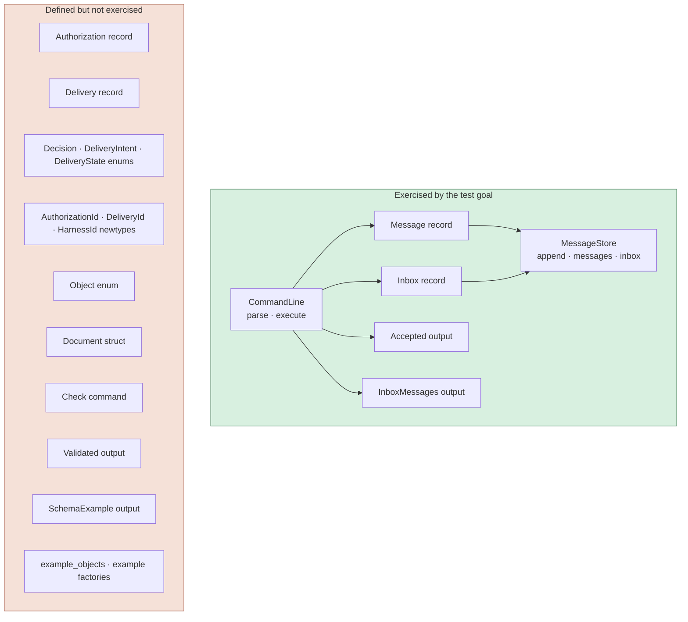
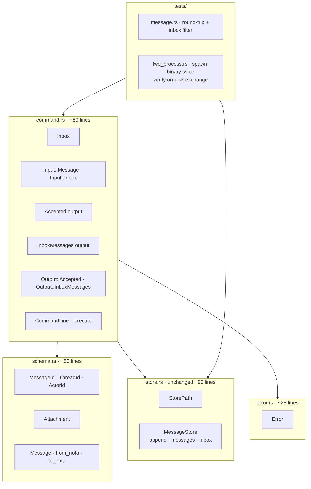
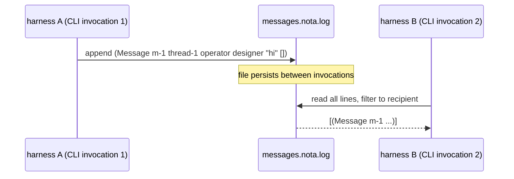

# persona-message — audit (skeptical, simpler-is-better)

Date: 2026-05-06
Author: Claude (designer)
Scope: `/git/github.com/LiGoldragon/persona-message` (initial commit
shape — no commits in the local checkout's git, but the source is
present and runnable). Goal of the prototype, per the user: *"see
messages being exchanged between harnesses; the messaging component
will be integrated into a reducer with the proper database and persona
later."*

---

## TL;DR

The shape is **right** — Nota records, NotaRecord-derived,
file-based append-only ledger, CLI as one Nota record in / one
Nota record out. The implementation faithfully follows the
design report.

The shape is **too big for the stated test goal**. Roughly
half the type surface is destination-plumbing the prototype
doesn't exercise: `Authorization`, `Delivery`, three lifecycle
enums, three identifier newtypes, `Object`/`Document` wrapping,
`SchemaExample` output, a `Check` validate-only command, and
the `::example()` factories on every record. None of it is run
by the message-exchange flow; it's there to *look like* the
eventual reducer shape.

The test goal is reachable with **just `Message` + `Inbox`**.
Everything else can land when it has behavior to drive (the
reducer's authorization gate, the delivery state machine).
Carrying the future shape now produces dead surface area that
agents will trust as if it were live.

There's also one missing test that would actually validate the
test goal: **a two-process integration test** that spawns the
`message` binary twice (once to send, once to read) and proves
the on-disk format crosses the process boundary. The existing
tests share a `MessageStore` in-memory.

---

## Current shape



**Live block** is the message-exchange path. **Dead block** is
type surface and code that has no runtime caller in the
prototype's stated test goal. (Authorization and Delivery
appear in `tests/message.rs::object_type_checks_authorization_and_delivery`
which type-checks them but doesn't *use* them — no auth gate
runs, no delivery state machine transitions.)

By line count, the dead block is roughly half the code in
`schema.rs` + much of `command.rs`'s output-side variants.

---

## Specific findings, ordered by impact

### 1. Authorization, Delivery, and the lifecycle enums are premature

The records exist, NotaRecord-derive cleanly, and round-trip
through Nota — but **no behavior reads them**. The store has no
authorization gate; the CLI doesn't propose deliveries; nothing
transitions `DeliveryState`. They're documented in the type
system without being lived in.

For the stated test goal — "see messages exchanged between
harnesses" — they don't earn their keep.

**Suggestion:** delete `Authorization`, `Delivery`, `Decision`,
`DeliveryIntent`, `DeliveryState`, `AuthorizationId`,
`DeliveryId`, and `HarnessId`. Reintroduce each one when the
behavior that drives it is being added. The first reintroduction
will likely be `Authorization` once the CLI grows an
`(Authorize delivery decision reason)` command and an actual
gate; the second will be `Delivery` once the store tracks
queued/delivered/observed transitions.

### 2. `Object` and `Document` are wrappers for nothing

`Object` is a sum of `Message` / `Authorization` / `Delivery`.
`Document` is `Vec<Object>`. Neither is consumed by the
message-exchange flow. They exist for `SchemaExample` (a
demo-mode output) and the type-checks test.

This is the same wrapper-enum-mixing-concerns pattern my
earlier persona audit flagged on the previous scaffold. If
the union has no dispatch site, drop the union.

**Suggestion:** delete `Object` and `Document`. If the
schema-example demo is worth keeping, just print the example
`Message` record (one line). Bring back a sum type when there's
a real per-variant dispatcher.

### 3. `Input::Check` is a dev tool dressed up as a Command

`Check` decodes a Nota record and re-encodes it without
storing it. It's a roundtrip-checker; useful while developing,
not a production command. It also bloats the dispatch surface
the harness fabric will eventually subsume.

**Suggestion:** drop `Check` from `Input`. If the validation
affordance is useful, expose it as a separate
`message validate <text>` mode or move it to
`#[cfg(test)]`-only test helpers.

### 4. `Output` has 4 variants; the path uses 2

`Output::{Accepted, InboxMessages}` cover send + read.
`Output::Validated` is `Check`'s output. `Output::SchemaExample`
is the no-args demo.

**Suggestion:** trim to `Output::{Accepted, InboxMessages}`.
Drop `Validated` and `SchemaExample`.

### 5. `::example()` factories on every record

Each record carries an `::example()` constructor for the demo
mode and the type-checks test. They're dev affordances that
expand the public surface.

**Suggestion:** move under `#[cfg(test)]` or into a
`tests/fixtures.rs` module. Public types shouldn't carry
example-data factories.

### 6. The no-args path is asymmetric and forks main()

`main.rs` checks `args_os().len() == 1` before reading
`PERSONA_MESSAGE_STORE`. With no args, it short-circuits to
`Output::schema_example()` and never opens the store. With
args, it requires the env var.

`CommandLine::execute` *also* short-circuits the no-args case
to `schema_example()`. So two places handle the no-args
behavior.

This is hidden control flow. The CLI's behavior depends on
arg count in two layers; one of them never reaches the store.

**Suggestion:** make the CLI uniform — if invoked with no
args, print a one-line usage hint and return non-zero. Don't
fork the path; don't have main re-implement what `execute`
already does.

### 7. `PERSONA_MESSAGE_STORE` mandatory env var is friction

For a naive test, requiring an env var to run the binary is
unnecessary friction. The README's example sets
`PERSONA_MESSAGE_STORE=.message` on every invocation.

**Suggestion:** default to a sensible path
(`./.persona-message/` or `$XDG_DATA_HOME/persona-message/`).
Allow `PERSONA_MESSAGE_STORE` as an override. The env var is
useful for tests that want a temp dir; the default is useful
for everything else.

### 8. The argument-joining inline-Nota path is awkward

`CommandLine::inline_nota_text` joins `args_os` with spaces.
The test exercises this by passing the Nota record split
across many `from_arguments` entries. This imitates shell
tokenization inside Rust, but the right way to test the
binary is `Command::new("message").arg("(Message m-1 …)")`.

The current shape works because the user always passes the
whole Nota record as one shell-quoted string from the shell
side; but the **test** doesn't exercise that path because it
uses `CommandLine::from_arguments` directly. The CLI's actual
shell-invoked behavior isn't tested.

**Suggestion:** drop the multi-arg join. Take exactly one
positional argument. Simpler `CommandLine` shape; failure
mode is clearer (`UnexpectedArgument` if more than one).

### 9. `expect_end` is the missing nota-codec primitive

It's defined in `schema.rs` and called by four `from_nota`
functions (`Message`, `Object`, `Document`, `Input`). My
earlier persona audit flagged this — it belongs in
`nota-codec` as `Decoder::expect_end()`. The duplication
continues across crates.

**Suggestion:** push `expect_end` into nota-codec proper.
Until then, accept the local helper but note the smell.

### 10. The tests don't cover the actual test goal

The stated goal is "see messages being exchanged between
harnesses." Three of the four tests are in-process (share a
`MessageStore` instance). The fourth uses
`CommandLine::from_arguments` directly — also in-process,
not actually invoking the binary.

**No test demonstrates two separate processes communicating
via the file store**, which is exactly what the prototype
exists to prove.

**Suggestion:** add `tests/two_process.rs`:

```rust
#[test]
fn two_processes_exchange_a_message() {
    let dir = tempfile::tempdir().unwrap();
    // Process A: send
    let send = Command::new(env!("CARGO_BIN_EXE_message"))
        .env("PERSONA_MESSAGE_STORE", dir.path())
        .arg(r#"(Message m-1 thread-1 operator designer "hello" [])"#)
        .output().unwrap();
    assert!(send.status.success());

    // Process B: read
    let read = Command::new(env!("CARGO_BIN_EXE_message"))
        .env("PERSONA_MESSAGE_STORE", dir.path())
        .arg("(Inbox designer)")
        .output().unwrap();
    let stdout = String::from_utf8(read.stdout).unwrap();
    assert!(stdout.contains("hello"));
}
```

That single test validates the prototype's whole reason for
existing.

---

## Smaller observations

- **`HarnessId` is defined but never appears anywhere except
  inside `Delivery::target`.** Will be needed once the harness
  registry exists; not now.
- **No timestamps on `Message`.** Acceptable for naive testing;
  worth adding when the durable shape lands.
- **Identifiers are user-supplied strings** (`MessageId::new("m-1")`).
  Fine for testing; the engine should mint them later.
- **No content-addressing yet.** Fine for testing.
- **`#[lints.rust]` has `unused = "warn"` and `dead_code = "warn"`.**
  Once the dead surface above is removed, those lints will
  catch its return.
- **`Cargo.toml` git-deps `nota-codec` from `branch = "main"`.**
  Matches the lore convention for fast-moving sibling deps.
  Correct.
- **The CLI binary name `message`** collides with the English
  noun in scripts (`if message ...`). Once persona-message
  lands inside the larger Persona daemon, the binary name will
  likely change. Not a blocker for the prototype.

---

## Suggested simpler shape



Net: roughly **half the surface area, all of the test value**.
The `.rs` totals would drop from ~580 LoC to ~280 LoC; the
public type count drops from ~20 to ~8.

---

## Concrete deletion list

If the operator (or whoever picks this up) wants a one-pass
shrink:

```
Delete from schema.rs:
- AuthorizationId · DeliveryId · HarnessId newtypes
- Decision · DeliveryIntent · DeliveryState enums
- Authorization record (struct + ::example)
- Delivery record (struct + ::example)
- Object enum
- Document record (struct + ::example)
- ::example() on Message and Attachment

Delete from command.rs:
- Check record
- Input::Check variant
- Validated output record
- SchemaExample output record
- Output::Validated and Output::SchemaExample variants

Trim main.rs:
- the args_os().len() == 1 short-circuit; let CommandLine handle it
- Replace the no-args path with a usage one-liner

Add tests/two_process.rs:
- spawn binary twice; verify on-disk exchange

Optional:
- default PERSONA_MESSAGE_STORE to ./.persona-message/
- drop the multi-arg-joining inline-Nota path; one arg only
```

---

## What this proves once trimmed



That diagram is the test goal. The simpler shape proves it
end-to-end with two processes; the current shape proves it
in-process and adds a lot of un-driven types around it.

---

## Open questions

1. **Is the `Authorization`/`Delivery` shape worth keeping as a
   contract sketch even though it isn't exercised?** I'd argue
   no — *contracts you don't drive lie*. They look authoritative
   (NotaRecord-derived, round-tripped) but no behavior verifies
   them. Deferring them keeps the shape honest. Operator may
   disagree.
2. **Should the binary be renamed?** `message` is a generic
   English noun. `persona-message` works (matches the crate
   name). Up to you.
3. **Where does the `expect_end` helper actually go?** Push
   into nota-codec sooner rather than later — every Nota CLI
   we've seen this week reproduces it.
4. **Default store path or required env var?** I lean default.
   Operator chose required; the README example shows the
   friction.

---

## Closing

The prototype's good news is that the bones are correct: typed
Nota records, append-only ledger, CLI takes one record in /
prints one record out. The intervention I'd make is to *delete
the future plumbing* until the test goal moves past
"two harnesses can exchange messages." Right now the future
plumbing dilutes the demonstration — half the type surface
isn't part of the demonstration at all.

A trimmed prototype that adds one two-process test would be a
sharper artefact: it would prove the on-disk format works
across a process boundary, and it would carry less code that
agents (including future me) can mistake for working
authorization/delivery machinery.

---

## See also

- `~/primary/reports/designer/2026-05-06-persona-messaging-design.md` —
  the design report this prototype is implementing toward.
- `~/primary/reports/designer/2026-05-06-persona-audit.md` —
  earlier audit on the previous persona scaffold; the
  redundant-prefix and `*Record` suffix concerns are *fixed*
  here (good — `Message`, not `PersonaMessageRecord`).
- `lojix-cli/src/request.rs` — the canonical "Nota record IS
  the CLI surface" example. The persona-message CLI follows it
  faithfully.
- this workspace's `skills/rust-discipline.md`,
  `skills/abstractions.md` — the disciplines persona-message
  follows correctly.
