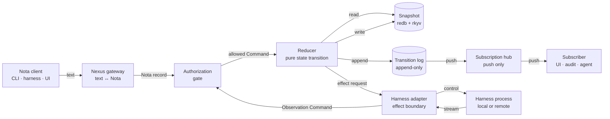
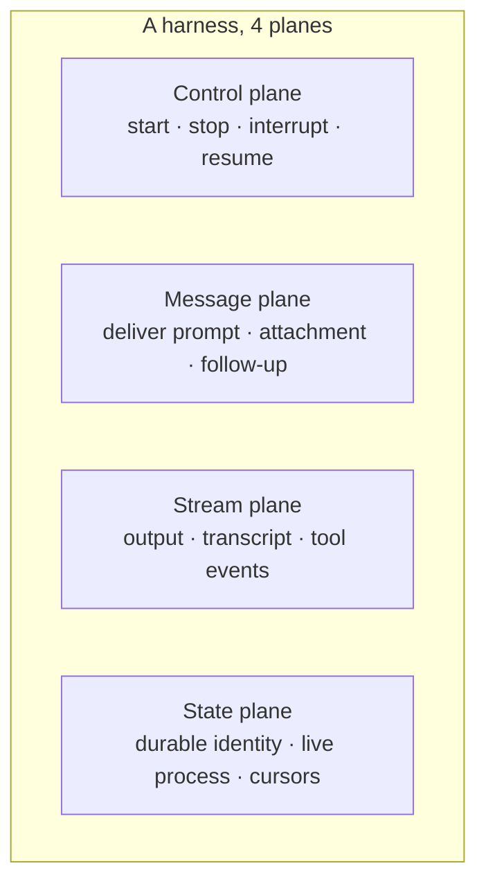
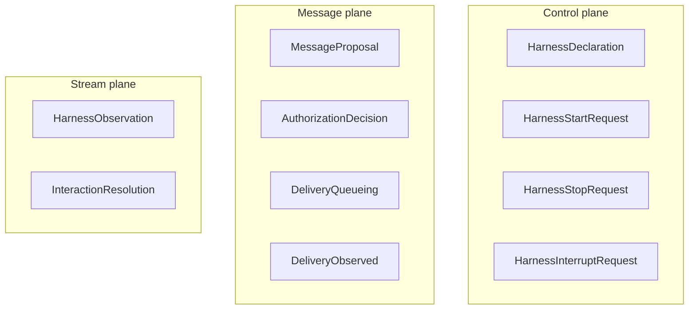
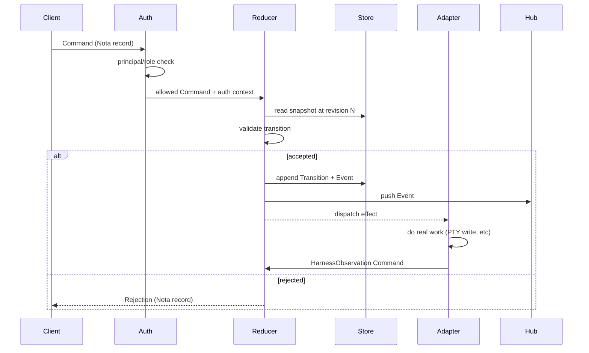
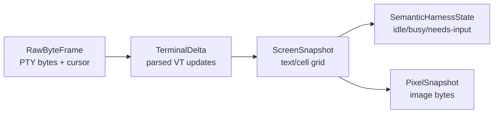
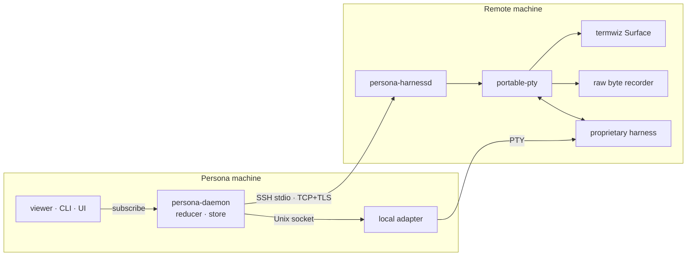
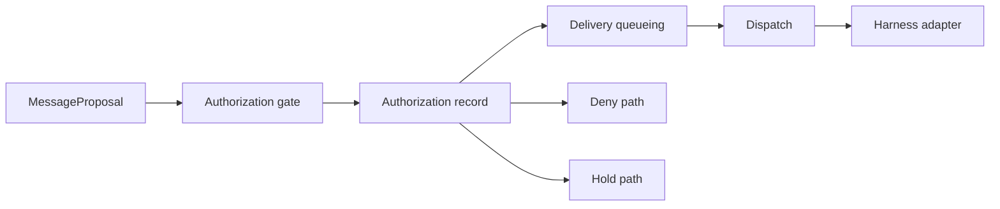
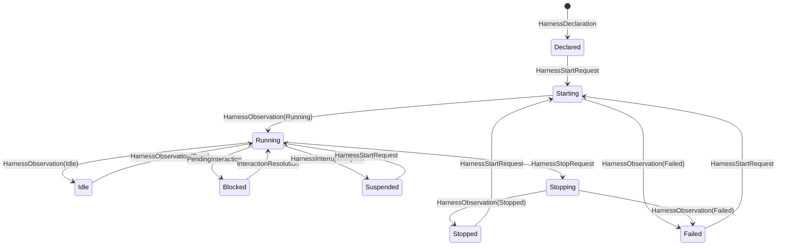
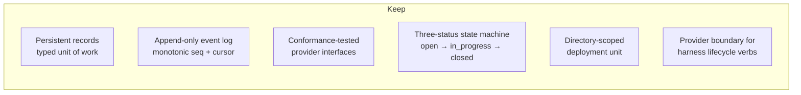
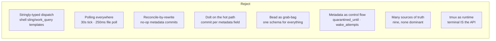

# Persona messaging design — typed records, one reducer, harness nodes

Date: 2026-05-06
Author: Claude (designer)

A high-level design for Persona's messaging layer: a typed,
positional, Nota-encoded message protocol over a single-reducer
state engine, with harness adapters as effect boundaries and a
push-subscription event log. This report draws together the
operator's three persona-domain reports
(`gas-city-harness-design`, `persona-core-state-machine`,
`terminal-harness-control-research`), the gas-city post-mortem,
and the canonical Nota example in `lojix-cli`. It records the
shape Persona should grow toward; it does not commit to specific
crate boundaries or wire bytes.

---

## 1. Executive summary

Persona is **a typed message fabric backed by a single reducer
that owns one canonical state**. Code-harness agents and human
clients enter through a Nota request boundary; transitions land
as durable typed records; effects fan out to harness adapters
that own only their local process state; observations re-enter
the reducer through the same protocol. Subscribers are pushed
events from a monotonic log; nothing polls.

The model is **Criome-shape, specialized for AI-harness
orchestration**: a state engine with a single source of truth, a
typed wire format, push subscriptions, and effect dispatch to
dedicated executors. The harness layer adds a remote-first
posture — every harness identity is location-transparent
(`persona://<node>/harness/<id>`), so the same record shapes
work for local and cross-machine adapters.

This report names the records, the verbs, the dispatch shape,
the reducer's responsibilities, the harness adapter contract,
and the local↔remote topology. Concrete type sketches use Nota
syntax to show what the wire looks like.

---

## 2. The pattern in one picture



Three things to read off the picture:

1. **One reducer, one state.** Every change to Persona's truth
   goes through the reducer. There is no second store, no cache,
   no metadata bag that the reducer doesn't own. Adapters and
   subscribers read state; only the reducer writes.
2. **The boundary is typed at every step.** Text exists at the
   client edge and at the harness edge. Everything inside is
   Nota records with a fixed Rust schema. No string-tagged
   dispatch.
3. **Effects are subordinate.** The reducer decides what should
   happen; the adapter does it; the adapter reports back through
   the same protocol. There is no path where an adapter mutates
   Persona truth without a transition.

---

## 3. Theoretical framing

The model has been shipped many times under different names.
Naming the lineage explicitly so we can lift the right ideas:

**Erlang/OTP `gen_server`.** A process owns its state; messages
arrive on a typed mailbox; a `handle_call/3` callback computes
`{reply, Result, NewState}`; supervision trees handle failure.
Persona's reducer is the `gen_server`; harness actors are linked
children; the supervision tree decides restart-vs-shutdown when
an adapter fails. We've adopted ractor (Rust port of Erlang
patterns) for exactly this; ractor is the substrate.

**Akka actors / Cluster Sharding.** Each persistent actor has a
durable identity, replays events on restart, and processes
commands by validating them and emitting events. Persona's
durable Harness records, ordered transition log, and cursor-based
replay are this pattern. The "command vs event" split (a
*command* is a request that may be rejected; an *event* is the
fact that a state change happened) is the load-bearing
distinction this report assumes throughout.

**Datomic / Datascript.** State is the fold of an immutable
ordered transaction log. Queries operate on time-indexed values.
Snapshots are derivable; the log is the truth. Persona's
transition log is the canonical truth; the snapshot is a
materialized view.

**Redux / Elm reducer.** `(state, action) -> state'`. Pure
function, no I/O. Effects are described by the reducer's output
and dispatched outside the reducer. Persona's effects are typed
*effect requests* the reducer emits as part of its return value;
adapters interpret them.

**Smalltalk / object-oriented method dispatch.** Behavior lives
on the type that owns the data; the message is the protocol.
Verb-belongs-to-noun. Persona's adapter contract is methods on
typed harness handles; the message is a typed Nota record, not a
string-keyed bag.

**The synthesis.** Persona is **a Datomic-style log + an
OTP-style reducer + Akka-style typed commands + a Smalltalk-style
method-on-type adapter contract + Nota as the wire format**.
Every part has prior art; the contribution is putting them
together with strict perfect-specificity at every boundary.

This is the same shape as Criome (engine + canonical store +
typed wire + effect dispatch). Persona is **Criome's pattern
applied to AI-harness orchestration**, not a new architectural
genre.

---

## 4. What gas-city teaches

A focused audit (subagent, in-conversation) read gas-city's bd
architecture and produced a clean reading. The relevant
distillation:

**Note on scope.** BEADS itself is transitional in this
workspace — Persona's messaging fabric is what replaces it, not
a system that runs alongside it. The lessons below are about
*what shape we lift* into Persona, not about *what surface
Persona exposes to bd-the-tool*. There is no Persona-bd bridge
in the destination.

### What was right

- **Persistent typed-by-discriminator records** as the durable
  unit. `Bead{Type ∈ task, message, molecule, convoy}` is the
  germ of a typed-message protocol.
- **Append-only event log with monotonic sequence + cursor
  subscription**. The `events.Provider` interface
  (`Record/List/LatestSeq/Watch(after_seq)`) is the right shape,
  even if the underlying watcher polls.
- **Conformance-tested provider interfaces.** Both `beads.Store`
  and `events.Provider` have explicit conformance suites every
  implementation must pass.
- **Three-status state machine.** `open → in_progress → closed`.
  Small enough to reason about; the discipline of *not* adding
  states is worth carrying forward.
- **Directory-scoped deployment unit.** A "city" is a directory.
  A Persona instance is similarly a directory.

### What was wrong (the failure modes Persona must not inherit)

| Failure | Mechanism | Persona's reject |
|---|---|---|
| Stringly-typed dispatch | `gc.routed_to=coder` metadata key, shell-template `sling_query` / `work_query` | Typed sum-type messages with per-variant fields; dispatch is a Rust match, never a shell template. |
| Polling reconcilers | 30 s ticker + 250 ms file polling; each tick re-evaluates every agent | One reducer, push subscriptions; no periodic full reconcile. |
| Reconcile-by-rewrite | Controller writes `quarantined_until=` and `wake_attempts=0` even when nothing changed | Every state change has a typed input event; "I don't know" doesn't trigger a write. |
| Dolt on the hot path | `bd update --set-metadata` per tick = full Dolt commit | redb + rkyv in-process; Dolt-style versioning lives at a coarser scope (snapshots, not field-level updates). |
| Bead as grab-bag | One struct, one `Type` string, no per-type validation | One Rust enum per concept, sum variants with explicit fields, NotaRecord-derived. |
| Metadata as hidden control flow | `started_config_hash`, `wake_attempts`, etc. as bd metadata strings | Lifecycle state is a typed enum field on the Harness record. |
| Nine sources of truth | TOML config + session beads + provider state + tmux + Dolt + events.jsonl + cache + controller memory | One canonical store: the transition log. Snapshots and projections are derived. |
| tmux as runtime substrate | Sessions = tmux panes; observation = scraping the screen | Adapters own PTY directly; tmux becomes one possible client display, not the truth layer. |
| Shell-fork per write | Every routing decision is `sh -c` | In-process typed dispatch table; shell-out is a leaf adapter, not a control-flow path. |

### What gas-city didn't even attempt

These shapes are absent from gas-city and need to be designed
in from the start:

- **Typed message protocol.** Nota records as the wire; sum
  types in Rust; per-variant validation.
- **Network transport.** All gas-city is single-host. Persona's
  harness boundary must be location-transparent: same record
  shapes whether the harness is local or three SSH hops away.
- **Authorization gates.** Routing in gas-city is "any agent
  matching this label." Persona has an explicit `Authorization`
  record between message and delivery.
- **Reducer / pure-state-transition model.** Gas-city's
  controller mutates beads imperatively. Persona's transitions
  are computed by a pure function over `(state, command)`.
- **Schema-validated event payloads.** Gas-city event types are
  string constants with no runtime validation. Persona's events
  are typed records.
- **Idempotent / cause-tagged writes.** Every mutation in
  Persona names its cause (the command that produced it); no
  no-op rewrites.

---

## 5. The proposed shape

### 5.1 Persona daemon as state engine

A single long-running process per workspace directory. Owns:

- The redb store containing the current snapshot and the
  transition log.
- The reducer (pure function, no I/O).
- The supervision tree of harness adapters.
- The subscription hub.
- The Nota request listener (Unix socket; later TCP/SSH).

The daemon does not run model inference, spawn user-visible
processes, or speak text. Those are adapter or client
concerns.

### 5.2 The four planes of a harness

A harness is one running AI agent (a Claude Code session, a
Codex CLI session, etc.). Persona reasons about it across four
orthogonal planes — the operator's framing in
`gas-city-harness-design.md`, lifted intact:



Each plane has its own typed record set. **The four are not
collapsed**: a stopped harness still has a durable identity (state
plane) and a real inbox (message plane). Gas-city collapsed
control + state + observation through the tmux session; Persona
keeps them distinct.

### 5.3 The records (typed, positional, Nota-encoded)

Naming convention: bare nouns (no `Persona*` prefix; no
`*Record` suffix — see my earlier audit). Every record carries
its full shape; no companion `*Details` types; positional fields
in source-declaration order.

```
Harness        — a registered harness identity (durable)
Message        — a unit of inter-harness communication (durable)
Authorization  — a decision about a routing attempt (durable)
Delivery       — an attempt + result of putting a Message into a
                 Harness (durable)
Event          — a typed log entry pushed to subscribers
Transition     — the durable decision the reducer made for one Command
Snapshot       — the materialized view at a given Revision
Cursor         — a restart-safe position in an ordered source
Observation    — a fact the adapter reports about a Harness
Interaction    — a surfaced approval/question that blocks until resolved
```

Concrete Nota sketches (PascalCase head; positional fields):

```nota
;; A registered harness identity
(Harness
  h-2026-05-06-operator-1     ;; HarnessId (kebab-case-as-string)
  operator                    ;; PrincipalName
  Terminal                    ;; AdapterKind
  "claude"                    ;; the spawn command
  None                        ;; node id; None = local
  Running)                    ;; LifecycleState

;; A message
(Message
  m-2026-05-06-001            ;; MessageId
  designer                    ;; from PrincipalName
  operator                    ;; to PrincipalName
  "Sketch the harness fabric." ;; body
  []                          ;; attachments
  thread-harness-fabric)      ;; thread tag

;; An authorization decision
(Authorization
  a-2026-05-06-001            ;; AuthorizationId
  d-2026-05-06-001            ;; DeliveryId
  m-2026-05-06-001            ;; MessageId
  Allow                       ;; Decision
  "operator may send design work to designer")  ;; reason

;; A delivery attempt + result
(Delivery
  d-2026-05-06-001            ;; DeliveryId
  m-2026-05-06-001            ;; MessageId
  h-2026-05-06-operator-1     ;; target HarnessId
  SafeBoundary                ;; intent
  Queued)                     ;; state
```

The Rust schema lives in `persona/src/schema.rs` (the operator
already has the first scaffold — needs the rename pass per my
audit). The wire bytes are the `nota-codec` canonical form.
**Round-trip is total**: every record encodes to Nota and decodes
back without loss.

### 5.4 The verbs (Commands, typed sum)

A Command is the unit a client (CLI, harness, UI) submits. It
asks Persona to do one thing. The reducer either accepts (emits
a Transition + 0..n Effects) or rejects (returns a typed Error).

The full command set, mapped to which plane it operates on:



Each is a NotaRecord. Example:

```nota
;; Client submits this to declare a new harness
(HarnessDeclaration
  h-2026-05-06-designer-1     ;; HarnessId
  designer                    ;; PrincipalName
  Terminal                    ;; AdapterKind
  "claude")                   ;; spawn command

;; Client submits this to start it
(HarnessStartRequest
  h-2026-05-06-designer-1)    ;; HarnessId

;; A harness emits this when it wants to send a message
(MessageProposal
  m-2026-05-06-002            ;; MessageId (client-minted)
  designer                    ;; from
  operator                    ;; to
  "Reviewed; shipping it."
  []                          ;; attachments
  thread-harness-fabric)      ;; thread tag

;; The authorization gate's reply
(AuthorizationDecision
  a-2026-05-06-002            ;; AuthorizationId
  d-2026-05-06-002            ;; DeliveryId (gate-minted)
  m-2026-05-06-002
  Allow
  "designer to operator: thread member")
```

The dispatch sum:

```rust
pub enum Command {
    HarnessDeclaration(HarnessDeclaration),
    HarnessStartRequest(HarnessStartRequest),
    HarnessStopRequest(HarnessStopRequest),
    HarnessInterruptRequest(HarnessInterruptRequest),
    MessageProposal(MessageProposal),
    AuthorizationDecision(AuthorizationDecision),
    DeliveryQueueing(DeliveryQueueing),
    DeliveryObserved(DeliveryObserved),
    HarnessObservation(HarnessObservation),
    InteractionResolution(InteractionResolution),
}
```

Dispatch is a Rust `match`; the head identifier on the wire
selects the variant. **No string-tagged routing anywhere**; the
type system carries the meaning.

### 5.5 The reducer

A pure function:

```rust
fn reduce(state: &Snapshot, command: Command)
    -> Result<(Transition, Vec<Effect>), Rejection>
```

For each command, `reduce`:

1. **Validates** the command against the current snapshot —
   does the harness exist? is the principal authorized? is the
   transition legal in the current lifecycle state?
2. **Computes** the resulting snapshot delta and the
   transition record that captures the decision.
3. **Emits** zero or more effect requests describing what
   adapters should do as a consequence (start a process, deliver
   bytes to a PTY, send bytes back over a network transport).

The reducer **does no I/O.** Everything observable to the
outside world flows through the effects. This is what makes
the reducer testable in isolation, replayable from the log, and
deterministic over the same input sequence.



### 5.6 The harness adapter contract

An adapter owns one running harness and its local process state.
The adapter contract is the operator's already-named primitive
set, lifted intact from `terminal-harness-control-research.md`:

```rust
trait HarnessAdapter {
    fn spawn(&self, config: HarnessSpawnConfig) -> Result<HarnessId>;
    fn attach(&self, target: HarnessTarget) -> Result<HarnessId>;
    fn write_text(&self, id: &HarnessId, text: &str, mode: InputMode) -> Result<()>;
    fn write_keys(&self, id: &HarnessId, keys: KeySequence) -> Result<()>;
    fn resize(&self, id: &HarnessId, rows: u16, cols: u16, pixels: PixelSize) -> Result<()>;
    fn snapshot_text(&self, id: &HarnessId, region: Region) -> Result<ScreenText>;
    fn snapshot_cells(&self, id: &HarnessId, region: Region) -> Result<ScreenCells>;
    fn snapshot_pixels(&self, id: &HarnessId) -> Result<Image>;
    fn raw_since(&self, id: &HarnessId, cursor: StreamCursor) -> Result<ByteFrames>;
    fn status(&self, id: &HarnessId) -> Result<HarnessStatus>;
    fn observe(&self, id: &HarnessId) -> Result<HarnessObservation>;
    fn detach_viewer(&self, id: &HarnessId, viewer: ViewerId) -> Result<()>;
    fn terminate(&self, id: &HarnessId, policy: TerminationPolicy) -> Result<()>;
}
```

`InputMode ∈ { TypedKeys, BracketedPaste, RawBytes }`. Slash
commands enter as `TypedKeys`; conversation text as
`BracketedPaste`; control sequences as `RawBytes`.

**Observation is layered**, finest to richest:



Cheap layers always exist; richer layers are computed when
asked. The reducer cares mostly about `SemanticHarnessState`
plus typed `Interaction` extractions; the audit trail wants
`RawByteFrame`; the human viewer wants `ScreenSnapshot` or
`PixelSnapshot`.

### 5.7 The harness node — location transparency

A harness adapter may run **in-process** with the daemon (local
subprocess), or **out of process** as a separate `persona-harnessd`
on a remote machine. The Nota protocol is identical; only the
transport changes.



A `HarnessId` is location-transparent. The `Harness` record
carries an optional node identifier:

```nota
(Harness
  h-2026-05-06-prom-1
  operator
  Terminal
  "claude"
  prom                        ;; node name; None for local
  Running)
```

When the reducer dispatches an effect that names this harness,
the effect fans out over the right transport. The adapter's
side of the transport is responsible for re-encoding the
observation back to Nota and replying. **No hot-path state lives
on the network**; the transport is a tube for typed records.

### 5.8 Authorization

Routing in gas-city is "any agent that matches the label." That
is no authorization at all. Persona's path:



Every `MessageProposal` produces an `Authorization` record
before any delivery is attempted — `Allow`, `Deny`, or `Hold`
(needs human approval). The Authorization record is durable;
it is part of the transition log; it is auditable. The simplest
first version is principal-pair lookup
(`(designer, operator) → Allow`); later versions can use typed
capability tokens.

The key property: **an authorization decision is a record, not
a flag**. A denied message still leaves a real authorization
record, attached to a delivery that never happened.

### 5.9 Subscriptions — push only

```mermaid
sequenceDiagram
    participant Subscriber
    participant Hub
    participant Log

    Subscriber->>Hub: subscribe(after=cursor, filter=…)
    Hub->>Log: tail(after=cursor)
    loop forever
        Log-->>Hub: Event N
        Hub-->>Subscriber: Event N
    end
    Note over Subscriber: subscriber processes;<br/>cursor advances
    Subscriber->>Hub: cursor=N
```

Subscriptions are **push only**. The hub holds an in-memory tail
of recent events plus the cursor of each live subscriber; new
events fan out immediately. A subscriber that falls behind
catches up by reading from the durable log starting at its last
cursor. There is no "tick" anywhere in the system.

If a feature wants live updates and the subscription primitive
doesn't yet cover it, the feature waits. **Polling is never a
substitute.**

---

## 6. Why Nota for messages

Nota is positional, schema-typed, and deliberately minimal.
Three properties that matter for Persona:

**Positional records.** Every field is in source-declaration
order; no field names appear in the text. A message that omits
a field (other than tail-omitted optionals) is a parse error,
not a "default-filled" value. **Either the message is complete
or it doesn't exist** — no half-typed records sneaking through.

**Schemas are typed by the consumer.** The parser is
first-token-decidable, has no keywords beyond `true` / `false` /
`None`, and dispatches on the head identifier. New typed kinds
land as new Rust types with `#[derive(NotaRecord)]`; the parser
stays small. This matches the perfect-specificity discipline
exactly.

**Single canonical form for hashing.** The canonical form of a
record is byte-stable: field order is source-declaration order,
strings emit bare when eligible, no ceremony. The wire and the
content-addressed identity are the same bytes. Future
content-addressing of messages, transitions, and snapshots
becomes trivial.

The canonical example of "Nota as the entire CLI surface" lives
in `lojix-cli/src/request.rs`:

```rust
#[derive(Debug, Clone, PartialEq, Eq, NotaRecord)]
pub struct FullOs {
    pub cluster: ClusterName,
    pub node: NodeName,
    pub source: ProposalSource,
    pub criomos: FlakeRef,
    pub action: SystemAction,
    pub builder: Option<NodeName>,
    pub substituters: Option<Vec<NodeName>>,
}

pub enum LojixRequest {
    FullOs(FullOs),
    OsOnly(OsOnly),
    HomeOnly(HomeOnly),
}
```

A user runs `lojix-cli '(FullOs goldragon ouranos …)'`. The CLI
takes one argument: a Nota record. There are no flags, no
subcommands, no mode switches. Persona's CLI follows the same
shape — `persona '(MessageProposal m-… designer operator "…" [] thread-x)'`
— and so does the on-the-wire form for cross-machine harness
control.

The discipline this enforces: **anything new the user can ask
for lands as a typed positional field on the right record, never
as a flag or environment-variable dispatch path.** The Nota
record IS the operator's surface and the audit trail.

---

## 7. How Nexus fits

Nexus is the messaging superset of Nota: every valid Nota text
is valid Nexus, and Nexus reserves additional sigils
(`~ @ ! ? *`) and delimiter pairs (`(| |)`, `[| |]`, `{ }`,
`{| |}`) for pattern-matching, atomic batches, and shape
constraints. Nexus is **the request language** for
typed-record-dispatch engines.

Persona's relationship to Nexus:

- **Internal wire = Nota.** Daemon ↔ adapter, daemon ↔ harness
  node, transition log entries, snapshot bytes — all canonical
  Nota.
- **Operator-facing text = Nexus** when it gets richer than a
  single record. The CLI parses Nexus; if the input is plain
  Nota (a single command), it dispatches directly. If the
  operator wants to express *batches*, *patterns*, or *queries*
  over the state, those are Nexus constructs.
- **Mechanical translation.** Every Nexus construct has a
  one-to-one mapping to a typed Persona Command (or
  Command-batch). The CLI is a thin Nexus → Command translator;
  the daemon never sees Nexus directly.

This matches Criome's existing pattern: "text crosses only at
nexus's boundary; everything internal is signal/Nota." Persona
is the same engine shape with a harness-orchestration vocabulary
on top.

---

## 8. State topology

The harness lifecycle (one harness's view), distinct from the
core's coarse phase:



Notes:

- Every transition is the consequence of one Command. There is
  no transition "because the controller polled and decided."
- `Failed` is a state, not a hidden flag. Failures are
  observations, recovery is an explicit `HarnessStartRequest`.
- `Blocked` is the state when a `PendingInteraction` is
  outstanding (an approval, a question). Resolution is a real
  command; it isn't a side-effect of the harness reading from
  its terminal.

The reducer's job, given `(state, command)`, is to (a) check
the state-machine edge exists in the current state and (b)
compute the resulting state plus the necessary effects.
Illegal transitions (e.g. `HarnessStopRequest` on a `Stopped`
harness) return a typed Rejection without touching state.

---

## 9. Local vs remote — the harness node

Same drawing as §5.7, with attention to the protocol surface:

```
Persona daemon ↔ harness adapter:
    Unix socket     local same-machine
    SSH stdio       most remote machines, available everywhere
    Tailscale TCP   stable multi-machine labs
    mTLS TCP        production multi-tenant
    WebSocket+TLS   browser clients

Wire payload at every transport:
    length-prefixed Nota records, canonical form
```

The transport is interchangeable; the records aren't. The same
`HarnessObservation(h-prom-1, …)` record arrives at the reducer
whether the harness ran in-process or over three SSH hops.

The first prototype path (operator's recommendation in
`terminal-harness-control-research.md`):

1. Local Unix socket.
2. SSH stdio for remote.
3. Tailscale once we want the multi-machine lab.
4. WebSocket+TLS once we want browser viewers.

QUIC stays on the table for mobile-grade resume but isn't first-pass.

---

## 10. What we keep from gas-city, distilled



The verb inventory the operator distilled (start / stop /
interrupt / nudge / send keys / peek / pending interaction /
respond / wait for idle / last activity) is the right
primitive set; what changes is putting it behind a typed
adapter contract instead of a tmux-shaped runtime.Provider.

## 11. What we reject from gas-city, distilled



Each is named so the rule "don't reintroduce this" is
inspectable later.

---

## 12. Open questions

These are the design points the operator and I should converge
on before code lands beyond the schema scaffold:

1. **Is a harness a principal, an endpoint, or both?** Cleanest
   answer: a harness has *both* a stable identity and a
   (possibly absent) principal binding. The Authorization layer
   lives on principals; the Delivery layer lives on harness
   identities. This decouples "who said it" from "where it ran."
2. **One Persona repo or split contract+state+adapters+frontends?**
   Operator's current position (one repo, contract boundary in
   code, split later) reads right to me.
3. **First non-tmux runtime substrate.** I'd lean
   `portable-pty` + `termwiz` Surface from day one, as a
   Persona-owned harness node — the durable design, not a
   detour through WezTerm. The WezTerm path is a *second*
   adapter for the case where the visible terminal is already
   WezTerm. Operator's research lays out both options.
4. **Naming convention on Commands** — verb-form
   (`DeclareHarness`) or noun-form (`HarnessDeclaration`)?
   I lean noun-form (matches `lojix-cli`'s `FullOs`/`OsOnly`,
   matches my persona-audit's findings, matches
   verb-belongs-to-noun discipline). Operator's current scaffold
   uses verb-form. Worth one focused conversation.
5. **What replaces BEADS in the final shape?** **Persona does.**
   BEADS is transitional substrate — used now because we have it
   and it works for short tracked items, not because it's part
   of the destination. The persona messaging fabric subsumes the
   role: workspace coordination tasks become typed Persona
   Records (`Task` / `Coordination` / `Memory` kinds, naming
   TBD); the operator/designer-lock protocol becomes Persona
   records and a typed Authorization gate; agent-to-agent
   "mail" stops being beads with `Type="message"` and becomes
   the canonical `Message` + `Authorization` + `Delivery` flow
   from §5.3. The destination is **one fabric** — orchestration
   and coordination both speak Nota records over the same
   reducer.

   Implication for design: don't carve out a "BEADS adapter."
   Don't bridge persona to bd. Treat bd-tracked items today as
   convenience-only and design Persona's record set so it can
   absorb them when the time comes. The workspace itself
   eventually becomes an instance of Persona, with operator and
   designer as harness identities and the lock / task /
   memory shapes as typed records.
6. **First Authorization shape.** The minimum viable: a
   principal-pair table with `Allow`/`Deny`/`Hold` per
   `(from, to)`. Capability tokens, signed envelopes, and
   per-message policy can layer on later. Worth confirming the
   minimum is "explicit but tiny," not "principle-of-least-
   privilege from day one."
7. **Snapshot vs log-replay.** redb gives us a current snapshot
   cheap; the log gives us replayability. The reducer should
   write both, but recovery on restart should replay the log
   over an empty snapshot, not trust the snapshot blindly. This
   matters if a snapshot ever drifts from the log.
8. **Where does `nota-codec`'s `expect_end()` live?** My persona
   audit flagged that the manual end-of-input check is
   duplicated between `Request::from_nota` and
   `Document::from_nota` — that's a missing nota-codec
   primitive. Worth fixing in nota-codec, not papering over in
   Persona.

---

## 13. Closing

The shape Persona is reaching toward is a small, well-named one
that the field has shipped many times: typed commands, one
reducer, a durable transition log, push subscriptions, effect
dispatch to dedicated executors, location-transparent adapters
behind a typed contract. Nota gives us the wire format; Nexus
gives us the request language; ractor gives us the actor
substrate; redb + rkyv gives us the durable store; the harness
node gives us the network boundary.

What this design report commits to is the **shape**, not the
**code**. The operator's persona scaffold is the right starting
sketch; the rename pass from my earlier audit fixes the local
naming; the records and Commands here name the typed seam this
fabric should grow into. The first milestone the operator
proposed in `gas-city-harness-design.md` is still right:

> 1. A Persona directory can declare two harnesses.
> 2. A message can be appended from one harness to another.
> 3. The message has an authorization decision.
> 4. The recipient can receive it if live.
> 5. Every transition is pushed to a subscriber.
> 6. The same transitions can be read back from durable state.

Hit that, and the rest of the design here has somewhere to
land.

---

## See also

- operator's `persona/reports/2026-05-06-gas-city-harness-design.md`
- operator's `persona/reports/2026-05-06-persona-core-state-machine.md`
- operator's `~/primary/reports/operator/2026-05-06-persona-core-state-pass.md`
- operator's `~/primary/reports/operator/2026-05-06-terminal-harness-control-research.md`
- this designer's `~/primary/reports/designer/2026-05-06-persona-audit.md`
- `~/primary/reports/2026-05-06-gas-city-fiasco.md`
- nota's `README.md` — grammar spec
- `lojix-cli/src/request.rs` — canonical "Nota as the CLI surface" example
- this workspace's `skills/abstractions.md`,
  `skills/rust-discipline.md`,
  `skills/push-not-pull.md`,
  `skills/micro-components.md`
- criome's `ARCHITECTURE.md` — the parent pattern Persona is a
  specialization of
