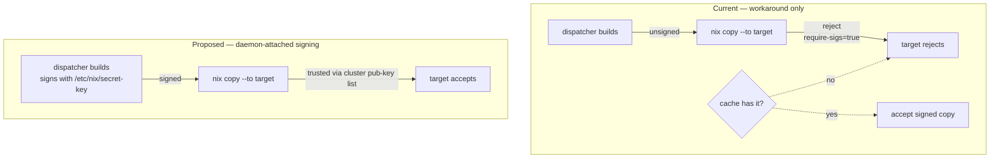
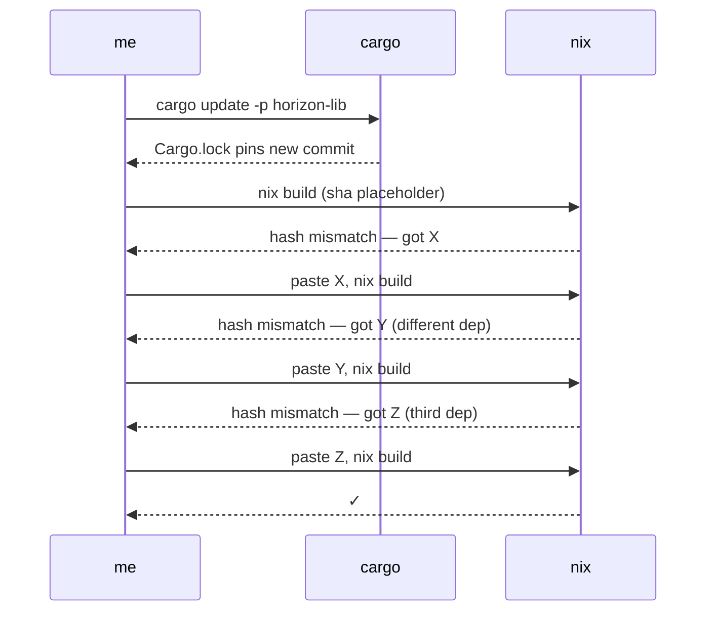
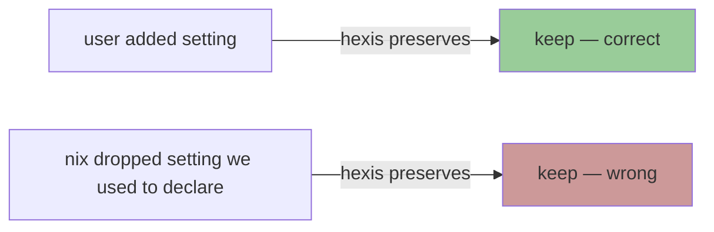
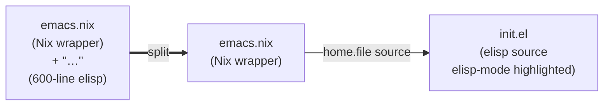
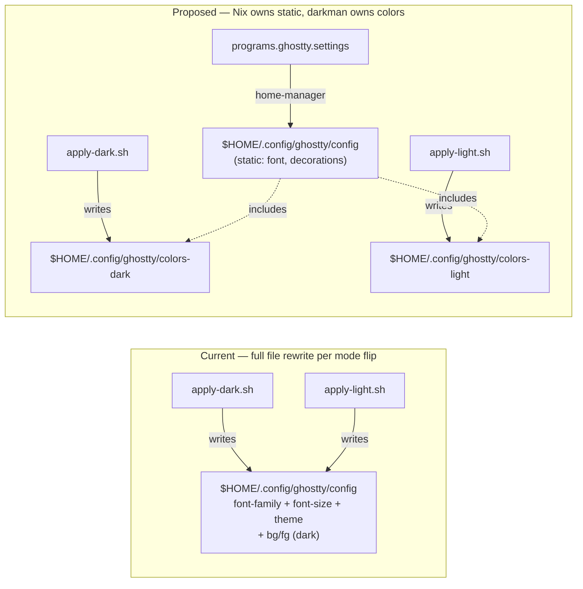
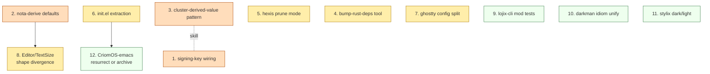

# Cluster-config & home-profile audit — bad patterns and elegance gaps

Date: 2026-05-07
Author: Claude (designer)

The user asked for an audit of recent shipped work — bad patterns
and anything we could do more elegantly — across CriomOS. This
report finds twelve items in three severity tiers and proposes
the shape each could move toward.

---

## TL;DR

**Severity high** — three findings:

1. `nix.settings.secret-key-files` still unwired in CriomOS;
   `builder = None` deploys remain blocked on a workaround.
2. `nota-derive` doesn't honor `#[serde(default)]` for
   `NotaRecord` fields, so trailing optionals must be wrapped
   `Option<T>` even when `T: Default` exists. Cost a wasted
   commit on `TextSize` this session and is going to keep
   biting on every schema extension.
3. The cluster has *no* shared module-arg path for cross-cutting
   user-derived values. `text-scale.nix` (this session) is the
   first of its kind, but the pattern wasn't promoted; the next
   cross-cutting value will likely re-duplicate.

**Severity medium** — five findings:

4. `lojix-cli/flake.nix` `outputHashes` bumping needs three
   build-then-paste round-trips per cargo-deps update. We did
   this twice this session.
5. `home.activation.mergeVscodiumSettings` (hexis-managed) leaves
   *orphan* keys in `settings.json` when we drop them from
   `declared`. Manual `jq del` was needed for `editor.fontSize`.
6. `modules/home/profiles/med/emacs.nix` carries a ~600-line
   elisp config inline as a Nix multi-line string. Stale-prone,
   un-lintable, escape-fragile.
7. `programs.ghostty` uses `enable = true;` only — its config
   file is generated by a `cat > $HOME/.config/ghostty/config`
   heredoc inside the darkman activation script. The static
   parts (font-family, decorations, font-size) get rewritten
   every dark/light switch.
8. The `Editor` and `TextSize` schemas on `UserProposal` happen
   to share the same `Option<T>` shape — but for *different*
   reasons (editor needs sentinel for smart-default vs.
   parser-default, text_size for NotaRecord parser). The
   coincidence reads as an idiom; the underlying cause should
   be separated.

**Severity low / carry-forward** — four findings:

9. `lojix-cli/src/deploy.rs` has a `#[cfg(test)] mod tests`
   block followed by impls that fail clippy
   `items_after_test_module`. The repo's own `AGENTS.md` says
   "Tests live under `tests/`, not `#[cfg(test)]` blocks" —
   the rule and the file disagree.
10. WezTerm's appearance hook routes dark/light through
    `wezterm.gui.get_appearance()` (portal → dconf → darkman).
    Emacs reads `$XDG_STATE_HOME/darkman/current-mode`
    directly. The cluster has two different "ask darkman what
    mode we're in" idioms.
11. Stylix targets are uniformly off (9 disabled) because
    darkman owns runtime switching. Stylix runs anyway, just
    contributes nothing for those apps. The cost is a configured
    abstraction that's intentionally inert.
12. `CriomOS-emacs` is an empty scaffold; the Emacs port landed
    in `CriomOS-home`. The repo exists, has `ARCHITECTURE.md`
    and `AGENTS.md`, but no `homeModules.default` content. The
    operator/designer ecosystem has a lifeless repo on the index.

---

## 1. Per-node Nix signing keys still unwired (high)

**Where**: `CriomOS/modules/nixos/nix.nix`, no
`nix.settings.secret-key-files` setting on non-cache nodes.

**Symptom**: `lojix-cli '… Switch None)'` builds locally on the
dispatcher (`build.rs:361` — `BuildLocation::Dispatcher`),
produces `ultimate`-trusted unsigned paths, then fails at the
target's signature check on `nix copy --to`.

The session-landed workaround (`copy.rs` always passes
`--substitute-on-destination`) only saves us when *the cluster
cache has the closure*. For dispatcher-built paths the cache is
empty, the substitution misses, and the unsigned ssh-ng path
still gets refused.

**Current vs. proposed flow:**



**Fix shape**: extend the `nix.nix` module to declare
`nix.settings.secret-key-files = [ "/etc/nix/secret-key" ]`
unconditionally (the file is created out-of-band per the
generation procedure documented in
`primary/skills/system-specialist.md`). When the file is absent
nix-daemon warns but doesn't fail; when present, every locally
built closure gets signed with the node's key.

**Trigger**: any future `builder = None` deploy fails. Not
hypothetical — this is the original bug that started the
session. We resolved the *immediate* problem; the *latent*
fragility persists.

---

## 2. NotaRecord doesn't auto-default non-Option fields (high)

**Where**: `nota-derive` (the `NotaRecord` proc-macro). The
session ran into this when adding `pub text_size: TextSize`
with a `Default` impl — the parser still demanded the field be
present in old datoms.

**Cost**: one wasted commit (`1079367b`) plus a follow-up
(`13c40ace`). The fix was to wrap as `Option<TextSize>` and
`unwrap_or_default()` in the projection — but now the schema
visually claims "this is optional / the user may not have one"
when in reality every projected User always has a `TextSize`.

**Conceptual mismatch:**

| Field declaration         | What schema reads as            | What field actually is          |
|---------------------------|---------------------------------|---------------------------------|
| `pub text_size: TextSize` | "always present"                | (unparseable on old datoms)     |
| `pub text_size: Option<TextSize>` | "user may not have one" | "always present, parser-defaulted" |
| `pub text_size: TextSize` *with `#[serde(default)]` honored* | "always present, defaulted on miss" | matches declaration |

The middle row — what we landed — is *truthful at parse time*
but *misleading at type level*. Future readers will think
`Option<TextSize>` means "the user has the option to skip
this preference." That isn't what it means; it's an artifact
of the parser.

**Fix shape**: extend `nota-derive` to honor
`#[serde(default)]` (or a sister `#[nota(default)]`) on
non-Option fields whose type implements `Default`. Then we can
write the schema as it should read.

**Why high severity**: every future `UserProposal` /
`NodeProposal` extension will hit this. It's a recurring tax
on schema growth.

---

## 3. No promoted pattern for cross-cutting user-derived values (high)

**Where**: `modules/home/text-scale.nix` (this session) is the
first time the cluster expressed "compute a value from `user`,
expose it as a module arg, consume from many places."

**Why high**: The next cross-cutting value won't have a
discoverable pattern to follow. Likely candidates already
visible:

- per-user shell prompt theme
- per-user keybinding base (Colemak vs Qwerty drives many keymaps)
- per-user color-scheme preference once stylix is a real
  consumer

Without a documented pattern, each of these will get rediscovered
inline four-or-five times before being centralized — exactly
what `text-scale.nix` cleaned up after the fact.

**Fix shape**: a short skill — `skills/cluster-derived-value.md`
or a section in `system-specialist.md` — that says "compute in
a module that does only `_module.args.<name> = …`, import early
from `modules/home/default.nix`, every consumer takes `<name>`
in its argument list." Three sentences and a `text-scale.nix`
pointer.

---

## 4. lojix-cli outputHashes bumping ritual (medium)

**Where**: `lojix-cli/flake.nix:30-40` — three git deps
(`horizon-lib`, `nota-codec`, `nota-derive`), each pinned by a
`sha256` that crane's `vendorCargoDeps` checks at build time.

**Symptom**: the workflow per cargo-deps bump is



We did this twice this session (Editor enum, TextSize). It's
mechanical, error-prone, and has no concept of "I just want to
update *all* the LiGoldragon git deps to latest."

**Fix shape — option A** (low scope, high payoff): a
`tools/bump-rust-deps` shell script in lojix-cli that:
- runs `cargo update` for the requested git dep,
- reads each new commit from `Cargo.lock`,
- runs `nix-prefetch-git` against each URL to compute the
  expected sha256,
- patches `flake.nix` `outputHashes` in place.

**Fix shape — option B** (large scope): replace `git+` deps
with `path = "../sibling"` for in-workspace dev, plus published
crates.io versions for tagged releases. Drops the
`outputHashes` block entirely. Conflicts with the
micro-components rule of "no cross-crate `path = "../sibling"`
in a manifest" — so option A.

---

## 5. hexis leaves orphan keys in managed JSON (medium)

**Where**: `modules/home/vscodium/vscodium/default.nix:189` —
`home.activation.mergeVscodiumSettings = inputs.hexis.lib.mkManagedConfig {…}`.

**Symptom**: when we dropped `editor.fontSize` from
`nixSettings` this session (in favor of `window.zoomLevel`
alone), the existing key in `~/.config/VSCodium/User/settings.json`
*survived*. We had to `jq del` it manually.

**The hexis comment** at line 184:

> `declared keys win where they speak, user drift survives at any pointer declared doesn't mention`

That's *correct for un-tracked drift* — if the user added a
setting hexis doesn't know about, hexis preserves it. But it
*conflates* two cases:



There's no way for hexis to tell apart "we never declared this"
from "we *un*declared this." Both look the same to a stateful
merge with no history.

**Fix shape — option A**: hexis remembers (in a side-channel
state file) which keys it has *ever* declared; on next merge,
keys present-in-state-but-absent-from-declared get null'd out.
Per-pointer history, RFC 7396-shaped.

**Fix shape — option B**: hexis grows a `prune = true` mode
that sets the file from declared *strictly* — same as
home-manager's `xdg.configFile` would do. Loses the user-drift
preservation but is unambiguous.

**Recommendation**: option A — preserves hexis's distinguishing
property (user drift survives) while closing the orphan hole.

---

## 6. Inline elisp as Nix multi-line string (medium)

**Where**: `modules/home/profiles/med/emacs.nix:120-540` —
the `initEl = ''…''` block.

**Why ugly**: ~600 lines of elisp embedded in a Nix multi-line
string. Concrete consequences:

- `${...}` requires `''${...}` escaping for elisp template
  literals (e.g. `${title}` in org-roam capture). Each
  occurrence is a re-learnable trap.
- No elisp syntax highlighting, no `M-x flycheck`, no
  `M-x byte-compile-file` to catch typos.
- The Nix module file's reason-for-existence is the elisp
  text; the surrounding Nix is a thin wrapper that grew an
  in-flight 600-line elisp foreign body.

**Fix shape**:



Concretely:

```text
modules/home/profiles/med/emacs/
├── default.nix       Nix wrapper, package list, daemon config
└── init.el           (lifted from inline; lintable, highlighted)
```

`home.file.".emacs.d/init.el".source = ./init.el;` instead of
`.text = ''…''`.

**One trade-off**: any per-user values that were Nix-interpolated
into the elisp (none today — we don't substitute anything from
`user.*` into the init.el) would need to switch to a runtime
mechanism (read a JSON file, env-var). Today, no such
substitution exists in this init.el, so the move is pure win.

---

## 7. Ghostty config rewritten on every dark/light switch (medium)

**Where**: `modules/home/base.nix:158-168` — inside
`mkApplyScript`, the entire Ghostty config (font-family,
font-size, decorations, theme, background, foreground) is
re-written via `cat > $HOME/.config/ghostty/config <<'GHOSTTY'`.

**Why ugly**: only `background` and `foreground` change between
dark and light. The other five lines are static. They get
rewritten anyway because the heredoc owns the whole file.



**Fix shape**: Ghostty supports `config-file = path` includes.
Static config goes in home-manager `programs.ghostty.settings`;
darkman writes only the small `colors-dark` / `colors-light`
overlay file plus a symlink for the active mode. Smaller blast
radius per dark/light flip.

**Severity rationale**: the current shape works but has been
biting us — when font-size now flows from `textScale.fontPt`,
darkman regenerates the whole ghostty config including the
font-size line on every theme flip. If a future bug
mis-templates `${toString fontPt}` in just the dark script and
not the light one, dark mode renders at the wrong size and we
chase the discrepancy across two scripts.

---

## 8. `Editor` and `TextSize` share a shape for different reasons (medium)

**Where**: `horizon-rs/lib/src/proposal.rs:158-167`.

```text
pub editor:    Option<Editor>      // None → smart-default by is_code_dev
pub text_size: Option<TextSize>    // None → unwrap_or_default = Medium (parser limitation)
```

The visual symmetry suggests "these two fields work the same
way." They don't:

| field      | `None` semantically means                 | Why `Option<>`?              |
|------------|-------------------------------------------|------------------------------|
| `editor`   | "use my role's smart default"             | sentinel for missing input   |
| `text_size`| "the parser couldn't read this datom"     | parser limitation (finding 2)|

If finding 2 (`NotaRecord` honoring defaults) lands, `text_size`
loses its `Option<>`. `editor` keeps it because the sentinel is
load-bearing. The shapes will diverge — which is the right
state. The current symmetry hides that.

**Fix shape**: deferred until finding 2 lands. Note in the field
docs that `text_size`'s `Option` is a parser artifact, not a
semantic optionality — so a future refactor knows to remove it.

---

## 9. `lojix-cli/src/deploy.rs` items-after-test-module (low / carryforward)

**Where**: `lojix-cli/src/deploy.rs:375` — `#[cfg(test)] mod tests`
block, followed by impls (`impl Actor for DeployCoordinator` at
line 607).

**The clippy lint** `items_after_test_module` flags this. The
repo's own `AGENTS.md` says:

> Tests live under `tests/`, not `#[cfg(test)]` blocks.

So both clippy *and* the repo's own contract say to move the
tests out. We didn't, this session, because it was out of scope
for the deploy work. The tax: every PR going forward must
either fix this or run clippy with the lint silenced.

**Fix shape**: extract the in-file `mod tests` to
`tests/deploy.rs` per the AGENTS.md convention. ~50 lines moved.
Probably a 30-minute task.

---

## 10. Two idioms for "what mode is darkman in?" (low)

**Where**:
- WezTerm: `modules/home/profiles/min/default.nix:431-436` —
  `wezterm.gui.get_appearance()` (portal → dconf → darkman).
- Emacs: `modules/home/profiles/med/emacs.nix` (lifted init.el)
  — reads `$XDG_STATE_HOME/darkman/current-mode` directly.

**Why ugly**: cluster has two answers to the same question.
Neither is wrong, but a future reader has to learn both.

**Fix shape — defer**. Both work; consolidating is
nice-to-have, not load-bearing. Note as a known inconsistency.

---

## 11. Stylix targets uniformly disabled (low)

**Where**: `modules/home/base.nix:272-288` — nine targets with
`enable = false`.

**Why it's there**: darkman owns runtime mode-switching;
stylix is build-time only. With `autoEnable = true` and these
targets *enabled*, stylix would write static color configs that
conflict with darkman's per-mode rewriting.

**The cost**: stylix is configured (palette, fonts, sizes) and
contributes only to apps whose targets remain on (currently:
fzf via the runtime `terminalInitHook`, and potentially future
non-darkman-aware apps). The font-size integration this session
made stylix more useful — but the disabled-targets pattern
remains a "we configure something we mostly don't use."

**Fix shape — defer**. The cleaner path is to teach stylix
about the dark/light split (so it generates *both* configs and
darkman flips a symlink). That's a stylix-upstream change, not
a CriomOS-home one. Note as a known imbalance.

---

## 12. CriomOS-emacs is an empty scaffold (low / process)

**Where**: `/git/github.com/LiGoldragon/CriomOS-emacs`.

**Status**: has `ARCHITECTURE.md`, `AGENTS.md`,
`packages/mkEmacs/` (legacy, broken eval), `modules/home/default.nix`
(empty skeleton). Last touched 2026-05-01. Has a flake that
fails `nix flake show` because of an `aski-mode` argument
miss.

**Why low-but-worth-noting**: the Emacs port this session went
into `CriomOS-home/modules/home/profiles/med/emacs.nix` per the
user's choice ("do you want to just move all the Emacs code
into CriomOS home?"). That choice was sound (no separate flake
needed for the small port), but it left CriomOS-emacs as a
dead repo on the index — `RECENT-REPOSITORIES.md` still lists
it.

**Fix shape — pick one**:

| Option | What | When |
|---|---|---|
| A. Archive | move to `criomos-archive` style — `archive/` prefix or repo-rename | Now |
| B. Repurpose | reuse for the Emacs *package* derivation if Emacs grows | When Emacs is big enough to deserve its own flake |
| C. Resurrect | finish the original split: lift the inline emacs.nix into CriomOS-emacs.homeModules.default | If `init.el` extraction (finding 6) makes the split natural |

**Recommendation**: defer until finding 6 (init.el extraction)
lands. If at that point the resulting `modules/home/profiles/med/emacs/`
dir feels self-contained, lift it into CriomOS-emacs (option C).
Otherwise option A.

---

## Suggested ordering

If we tackle these in priority order, the dependency graph is:



**Suggested first slice** (one session, high payoff):

1. Finding 1: wire `nix.settings.secret-key-files` in
   CriomOS — closes the original-symptom hole that motivated
   the `--substitute-on-destination` workaround.
2. Finding 6: extract the inline init.el. Three-file diff,
   no semantic change, makes the elisp lintable.
3. Finding 4: write `tools/bump-rust-deps`. Saves time on
   every subsequent horizon-rs change.

Findings 2 and 5 are upstream changes (nota-derive, hexis) and
deserve their own dedicated sessions.

---

## Out-of-scope (noted, not pursued)

- VSCodium's stale extension keybindings (claude-code uses
  `cmd+` not `ctrl+` on Linux — known mismatch, low impact).
- The three `~/.config/VSCodium/User/settings.json.{backup,bak,bak2}`
  files left from earlier hand-edits. Manual cleanup,
  non-recurring.
- Codium Ctrl+Shift+P / Ctrl+F still broken (deferred —
  needs the user to close Codium for the state-reset
  diagnostic).
- `tiger` and `balboa` Nix signing keys not generated (both
  hosts offline).

---

*End of audit.*
