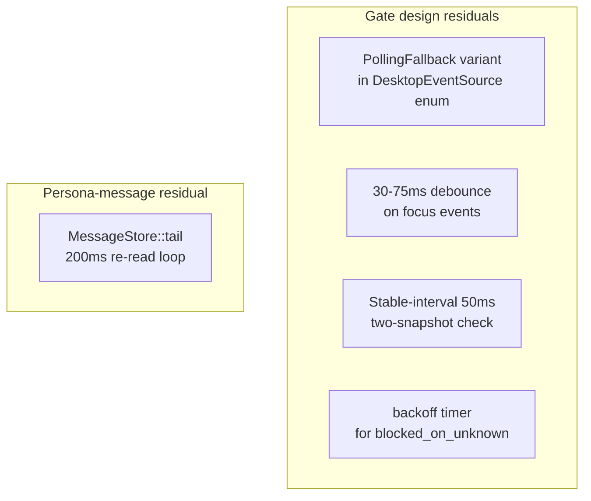
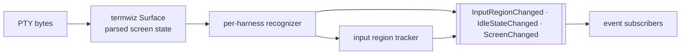
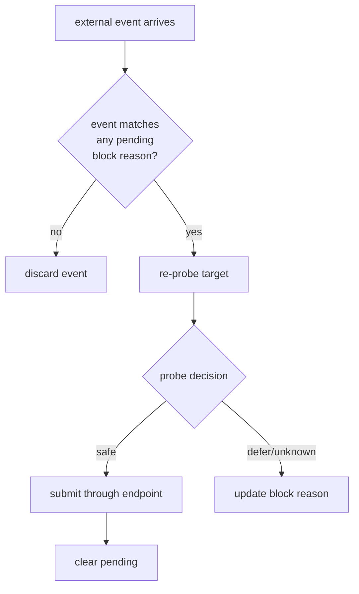
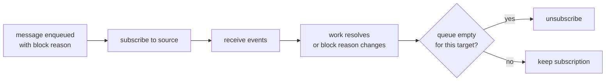
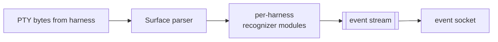
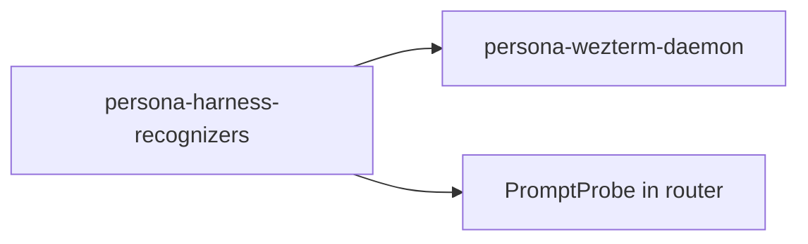
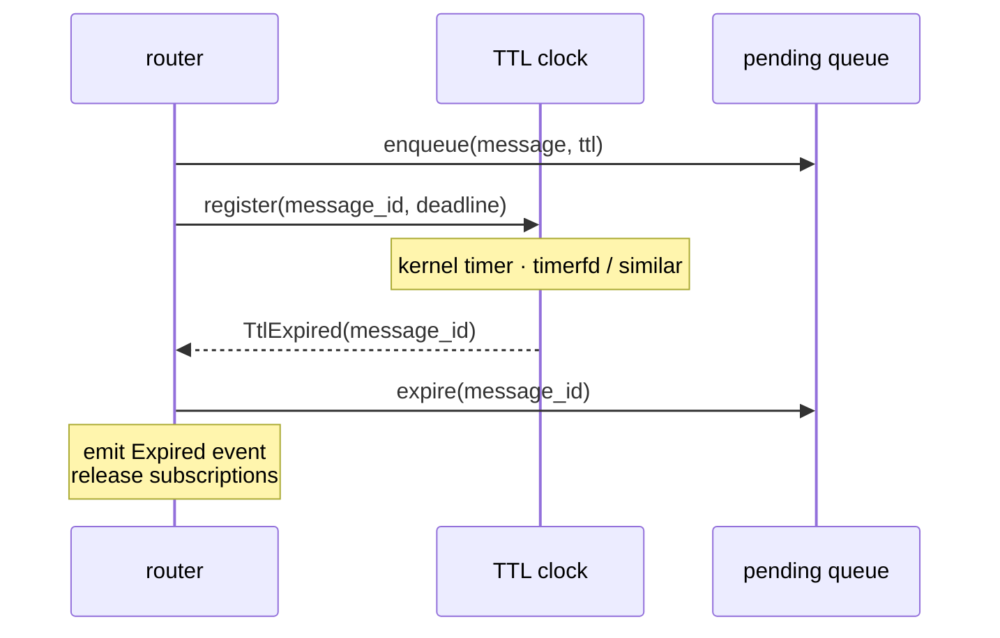
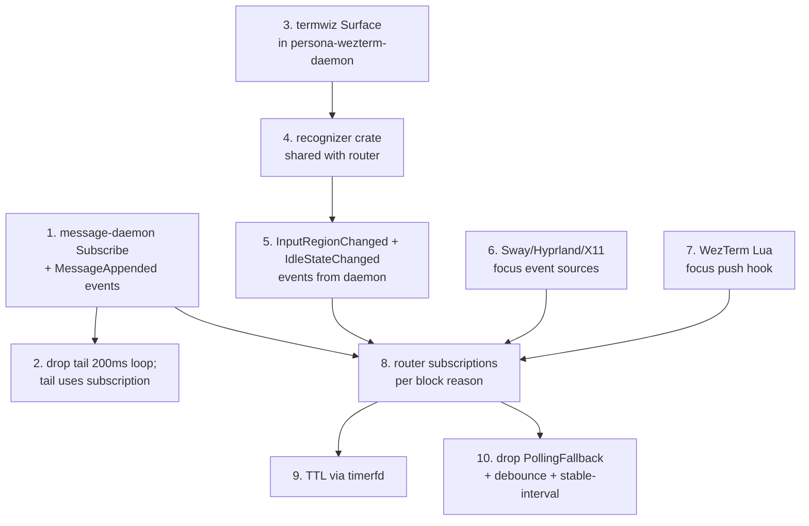
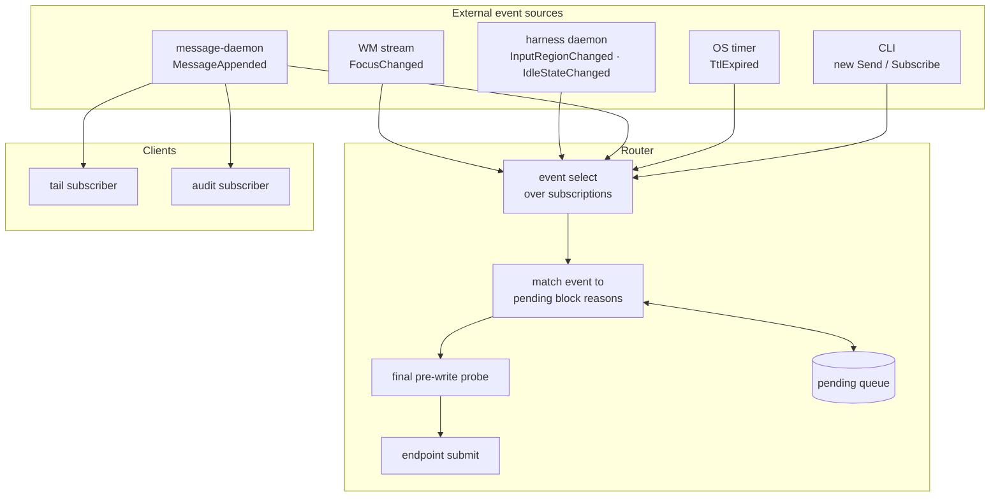

# No-polling delivery design

Date: 2026-05-07
Author: Claude (designer)

A design for Persona's message-delivery substrate that
contains **no polling anywhere**. Builds directly on the
operator's
`reports/operator/2026-05-07-prompt-empty-delivery-gate-design.md`
and the audit
`reports/designer/2026-05-07-persona-message-state-and-gate-audit.md`,
both of which surfaced four polling-shaped residuals in the
gate design plus one inside `persona-message` itself.

The principle is `skills/push-not-pull.md` taken literally:
*polling is wrong, always*; producers expose subscription
primitives; consumers subscribe; if the producer cannot yet
push, the dependent feature **defers** rather than falls
back to polling. Applied strictly, the principle reshapes
the gate, the router, the harness daemon, and the message
store — and forces an honest accounting of which features
the system can't deliver until the missing push primitives
are built.

---

## 1. The principle, taken literally

Push-not-pull is unambiguous:

> Polling is wrong. Always.
>
> If the producer cannot yet push (the subscription
> primitive isn't built), the consumer **defers its
> real-time feature** rather than fall back to polling. A
> poll "for now" never gets removed.

The operative rule for the no-polling delivery design:

> **The router never wakes itself up.** Every wake is caused
> by an external event. If no event source can wake the
> router for a particular pending message, that message
> stays pending — possibly forever, until either a push
> primitive is built or the user discharges it.

This is uncomfortable. It means real messages can stay
queued indefinitely if the system genuinely lacks the push
primitive to wake them. The discomfort is the point: it
forces the system to build the missing primitive rather
than paper over the gap with a poll.

---

## 2. Where polling currently hides — five residuals

Four residuals in the operator's gate design (already
flagged in §2.3 of the state-and-gate audit), plus one
inside `persona-message` itself:



### 2.1 `PollingFallback` as a `DesktopEventSource` variant

```text
DesktopEventSource =
  WezTermEventSource
  X11EventSource
  SwayEventSource
  HyprlandEventSource
  PollingFallback        ← polling
```

The intent is "if no compositor stream, read pane state on a
clock until something changes." That's polling. The clean
answer is *don't deliver* through focus-gated paths when no
push source exists. Drop the variant.

### 2.2 30-75ms debounce on focus events

```text
focus event
  -> wait 30-75ms             ← polling (waiting for stable state)
  -> collect current state
  -> run full gate
```

The wait is polling-shaped. The clean answer: act on every
event; if a transient flip of focus produces a wrong gate
decision, the next event corrects it. The cancellation rule
(focus changes between observation and write → cancel)
already handles transient flips.

### 2.3 Stable-interval 50ms two-snapshot check

```text
observe   -> sleep 50ms -> observe again -> submit
```

Acknowledged as a workaround for the missing
`InputRegionChanged` push event. Per push-not-pull's deferral
rule, the right answer until the push primitive exists:
**don't deliver** through the terminal-injection path for
non-empty-prompt cases. Build the push primitive in the
harness daemon.

### 2.4 backoff timer for `blocked_on_unknown`

```text
blocked_on_unknown -> last-resort backoff timer
```

If the gate doesn't know the state, retrying on a clock
won't help — the unknown is unknown. The clean answer: stay
queued; rely on a real event source to resolve the unknown.
If no source exists, the message stays.

### 2.5 `MessageStore::tail()` 200ms re-read loop

Inside `persona-message/src/store.rs` today:

```text
loop {
    re-read entire file
    print new messages
    sleep(200ms)
}
```

This is the direct polling that push-not-pull rejects in
its canonical form: a UI/consumer sweeps the producer for
changes. The clean answer: the message daemon broadcasts new
messages on a Unix socket; tail clients connect once and
receive a stream. The existing `message-daemon` already has
the Unix-socket plumbing; extending it to support a
subscribe operation is the natural fit.

---

## 3. The push primitives required

Each block reason resolves through exactly one push
primitive. The table below names the primitive, the
producer that owns it, and the consumer that subscribes.

| Block reason | Push primitive | Producer | Consumer |
|---|---|---|---|
| `blocked_on_focus` | `FocusChanged { target, focused: false }` | compositor (sway/hyprland/x11) or WezTerm Lua hook | router |
| `blocked_on_non_empty_prompt` | `InputRegionChanged { target, occupied: false }` | harness daemon (parsed screen state) | router |
| `blocked_on_busy` | `IdleStateChanged { target, idle: true }` | harness daemon (parsed screen state) | router |
| `blocked_on_unknown` | (no primitive — stay queued) | n/a | n/a |
| `inbox/tail subscription` | `MessageAppended { message }` | message daemon (broadcast on append) | tail client |

If the push primitive doesn't exist for a particular
harness/system combination, that block reason can't be
resolved; messages with that block reason stay queued.

### 3.1 What each primitive needs to ship

**`FocusChanged`** — sources are already push-capable:

- **Sway**: `swaymsg -t subscribe '["window"]'` produces a
  stream that includes focus events.
- **Hyprland**: `hyprctl events` produces a stream
  (`activewindow` events fire on focus change).
- **X11**: `xprop -spy` on the root window's
  `_NET_ACTIVE_WINDOW` property; or libx11 event loop.
- **WezTerm**: Lua `window-focus-changed` event hook in
  user config, pushing to a Unix socket the router watches.

The `DesktopEventSource` enum becomes:

```text
DesktopEventSource =
  Sway(SwaySubscription)
  Hyprland(HyprlandSubscription)
  X11(X11Subscription)
  WezTerm(WezTermLuaSubscription)
```

No `PollingFallback`. If a system has none of the above,
focus-gated delivery is unavailable on that system; the
harness must be marked `headless` or `exclusive-agent-owned`
to deliver.

**`InputRegionChanged`** — needs `persona-wezterm-daemon` to
grow a parsed screen state.

The daemon today records raw PTY bytes and rebroadcasts
them. To produce typed events, it parses bytes into a
screen model:



The recognizer is closed: `Harness ∈ { Pi, Claude, Codex }`,
each variant carrying methods for "where is the input
region in this harness's UI" and "what tokens mark
busy/idle." The operator's report already names this enum
(lines 307–319 of the gate design).

The daemon emits one event when the input region transitions
from occupied to empty (or vice versa); router consumers
subscribed to a target receive it; the gate re-probes only
on receiving a relevant event.

**`IdleStateChanged`** — same machinery as
`InputRegionChanged`, watching busy/idle markers instead of
input-region characters.

**`MessageAppended`** — `message-daemon` extends to support
a subscription operation:

```mermaid
sequenceDiagram
    participant Client as message client
    participant Daemon as message-daemon
    participant Log as messages.nota.log

    Client->>Daemon: Subscribe(recipient, since_cursor)
    Daemon->>Log: read since cursor
    Log-->>Daemon: existing tail
    Daemon-->>Client: tail records
    Note over Daemon: subscriber registered
    Daemon->>Log: append (on a Send command)
    Daemon-->>Client: MessageAppended record
    Note over Client: long-lived subscription;<br/>no polling
```

Replaces the current `MessageStore::tail()` 200ms loop. The
client connects once; the daemon pushes new messages as they
land.

---

## 4. The router's wake graph — every wake is external



The graph has no edges from "timer" to anything. The router
sleeps in a select over its event sources; every wake is
caused by an external event:

- A new pending delivery arrives (push from a `Send` command).
- A focus event arrives (push from a compositor source).
- A screen event arrives (push from the harness daemon).
- A subscription teardown (push from a process exit / endpoint
  closed).
- A TTL deadline arrives (push from the OS timer; see §7).

When no events are arriving, the router is idle. It does not
periodically wake to "check on things."

### 4.1 Subscription lifecycle is itself event-driven

The router subscribes only when it has work that depends on
the subscription:



This keeps desktop and daemon integrations quiet. The
router doesn't hold open subscriptions when no message is
pending on them.

---

## 5. What waits and what doesn't

### 5.1 Indefinite deferral when push primitives are missing

If a harness's system has none of (Sway, Hyprland, X11,
WezTerm-Lua) — focus-gated delivery is unavailable. Messages
with `blocked_on_focus` for that harness stay pending until
the user installs a compatible compositor or marks the
harness `headless`/`exclusive-agent-owned`.

If the harness daemon doesn't emit `InputRegionChanged` for
a particular harness — gated terminal delivery for that
harness is unavailable. Messages with
`blocked_on_non_empty_prompt` stay pending until the daemon
ships the recognizer for that harness.

If the harness daemon doesn't emit `IdleStateChanged` —
busy-blocked messages stay pending similarly.

### 5.2 Indefinite deferral is mitigated by TTL — see §7

Without TTL, the queue grows unboundedly. The TTL clock is
the **single acceptable timer carve-out** (§7).

### 5.3 Eligible deliveries proceed immediately

When all push primitives the message needs are available
and they fire, the router probes once and delivers. There's
no "wait for confirmation events" pattern; the cancellation
discipline (final check before submit) handles transient
race windows.

### 5.4 Synchronous-from-the-CLI's-POV

A `Send` command from a sender harness still returns
immediately. The CLI's response is one of:

```nota
(Accepted message delivered)
(Accepted message queued blocked_on_focus)
(Accepted message queued blocked_on_non_empty_prompt)
(Accepted message queued blocked_on_unknown)
```

The sender doesn't wait for the receiver. The router
handles eventual delivery (or eventual deferral / expiry).

---

## 6. Per-component growth required

The no-polling design redistributes work across components.
What each component grows:

### 6.1 `persona-wezterm-daemon`

**Adds:** parsed screen state via `termwiz::surface::Surface`
or equivalent VT parser; per-harness recognizer modules
(input-region detector, idle/busy detector); event
broadcasting on a Unix socket.

**Surface:**



**Why the daemon owns this:** the daemon is the only
component that already sees every byte the harness emits.
Parsing the screen there gives every consumer (router,
viewers, audit) the same view.

### 6.2 `persona-message`

**Adds:** subscription support to `message-daemon`. New
`Subscribe` command that holds the connection open and
broadcasts `MessageAppended` records as they land.

**Removes:** the `MessageStore::tail()` 200ms loop becomes
a thin wrapper that connects to the daemon and prints
streamed records.

### 6.3 `persona-router` (the future repo)

**Adds:** the wake graph (§4); subscription lifecycle
management; pending-delivery store; TTL clock subscription;
typed block-reason → subscription mapping.

**Doesn't add:** any timer-based "check on things" loop.
The router has *one* timer-shaped subscription — the OS-level
TTL clock (§7) — and that's it.

### 6.4 `persona-harness-recognizers` (proposed crate)

The per-harness recognizers (input-region detection, idle
markers, prompt-line extraction) live in a single crate
shared between `persona-wezterm-daemon` (uses them on the
parsed screen) and the `PromptProbe` (uses them on the
ad-hoc snapshot).



One crate, one capability per `skills/micro-components.md`.
Per-harness modules inside (no string dispatch on harness
name; closed enum with per-variant methods).

---

## 7. The one acceptable timer — TTL

A purely event-driven router has one bounded honesty
problem: the queue can grow without bound if push primitives
are missing for some block reasons. The fix is a TTL on
each pending delivery.

A TTL is a clock-driven event:



The TTL is the **single acceptable timer-shaped thing in
the system** because:

1. **It's event-driven by the OS.** The kernel pushes
   `timerfd` reads when the deadline arrives; the router
   doesn't poll the clock. The router subscribes to a
   timerfd just like any other event source.
2. **It's bounded-by-purpose.** TTL is for memory bounds,
   not state-change detection. Per
   `skills/push-not-pull.md`'s reachability-probe carve-out:
   *"the contract is 'are you alive,' not 'what changed.'"*
   TTL's contract is "wake me at this deadline," not "tell
   me what changed."
3. **It's named explicitly.** The carve-out has one
   instance, in one place. It doesn't sprawl into "let me
   add another timer for X."

The TTL deadline is a per-message field. Default: 24h.
Configurable per-actor in `actors.nota`. Once expired:

- The message moves to an `Expired` state in the durable
  log.
- An `Expired { message_id, reason: TtlReached }` event is
  pushed to subscribers (audit logs, the sender if the
  sender subscribed).
- The router unsubscribes from any block-reason
  subscriptions held only for this message.

This means the queue cannot grow unbounded: every message
either delivers, expires, or is manually discharged.

### 7.1 Why this carve-out is honest

The two carve-outs `skills/push-not-pull.md` already names:

- Reachability probes (transport-layer "are you alive").
- Backpressure-aware pacing (consumer drains its own buffer
  at its own rate).

TTL is a third narrow carve-out: **deadline-driven memory
bounds.** It belongs alongside the existing two — a
narrowly-scoped pattern that looks polling-shaped but isn't,
because:

- It doesn't sweep state for changes.
- The OS pushes the wake (timerfd is a real subscription).
- The contract is bounded ("expire after X"), not unbounded
  ("check periodically forever").

Worth naming this in the workspace's
`skills/push-not-pull.md` so future agents have explicit
guidance.

---

## 8. Implementation order

Each new push primitive unblocks a specific class of
delivery. A clean order:



The first deliverable (`Subscribe` + `MessageAppended`)
removes the 200ms `tail()` loop — the most visible
polling — without touching any other component. It's a
clean independent commit.

The screen-state parser (3) is the gating addition for
input-region and idle events. Once it lands, recognizers
(4) move into their own crate, and events (5) flow.

The compositor sources (6, 7) are independent of 3–5; can
land in parallel.

The router subscriptions (8) wire all of the above
together. TTL (9) and the cleanup of the polling residuals
(10) close the loop.

---

## 9. Test plan — verify no polling

Tests that prove the absence of polling are easier than
they look. Polling shows up as wake-when-nothing-changed:

### 9.1 Idle-process check

Run the router with no pending deliveries; observe:

- `strace -c` should show zero or near-zero syscalls per
  second.
- `cat /proc/<router-pid>/status` should report low context
  switch counts over a 60-second window.

A polling router shows steady syscall traffic. An
event-driven router goes silent.

### 9.2 Pending-no-source check

Run the router with a pending delivery whose push
primitive is missing (e.g., on a system with no compositor
stream). Verify:

- The router stays idle (low syscall traffic).
- The message stays pending after 5 minutes.
- `strace` does NOT show any periodic wake-up.

This confirms the "indefinite deferral" rule.

### 9.3 Event-driven wake check

Send the router a focus-changed event. Verify:

- The router wakes once.
- The router runs the gate once.
- The router goes back to idle.

The wake count should match the event count exactly.

### 9.4 TTL-expiration check

Enqueue a message with a 5-second TTL on a system without
the relevant push primitive. Verify:

- After 5 seconds, the message moves to `Expired`.
- The router wakes once (the TTL push), processes the
  expiry, returns to idle.

### 9.5 The polling-trap test

Add a deliberate wake-up source that never fires; verify
the system doesn't hang or busy-wait. The select should
remain blocked.

---

## 10. What the system can't do (until primitives land)

Stating the deferred capabilities explicitly so they're
visible:

1. **Focus-gated delivery on systems with no
   compositor-event source** — until the operator's machine
   adds Sway/Hyprland/X11 or the user enables a WezTerm Lua
   hook, focus-gated messages stay queued.
2. **Empty-prompt-gated delivery on harnesses without a
   recognizer in `persona-harness-recognizers`** — until
   that harness's recognizer ships, prompt-empty-gated
   messages stay queued.
3. **Idle-state-gated delivery on harnesses without an
   idle marker recognizer** — same.
4. **Real-time inbox tailing on machines that can't reach
   the message daemon** — the new tail requires the daemon's
   subscription socket; without daemon access, the message
   feature is unavailable. (The CLI can fail-with-message
   rather than fall back to polling.)

Each of these is a feature the no-polling design **chooses
not to ship until the primitive exists.** Per push-not-pull:
this is the discipline; the discomfort is the diagnostic.

---

## 11. Related design decisions deferred

Items the design touches but doesn't decide. Worth a
focused conversation:

1. **Termwiz vs vte for the Surface parser.** termwiz is a
   WezTerm-adjacent crate the workspace already depends on
   (persona-wezterm-daemon currently uses portable-pty +
   crossterm). vte is the standard alternative. Operator
   should choose based on the screen-model API needed.
2. **Per-recipient subscription isolation.** Should
   `Subscribe(recipient)` deliver only that recipient's
   messages, or should it deliver everything and let the
   client filter? Per `skills/abstractions.md`, the daemon
   knowing the filter is sharper — but it pushes per-actor
   filtering into the daemon's typed surface.
3. **Event-source ordering on multi-source systems.** A
   machine running both X11 and a WezTerm Lua hook gets
   two `FocusChanged` events for the same physical change.
   The router should de-duplicate; the de-dup key is
   `(target, focused, generation)` where generation is a
   per-source monotonic counter. Worth naming the strategy
   before parallel sources land.
4. **Subscription handle lifetime.** When the router
   unsubscribes from an event source because no work
   depends on it, the subscription handle is dropped. If
   the underlying socket has buffered events between drop
   and the next subscribe, those events are lost. For
   focus events, that's fine — the next subscribe re-checks
   current state. For other events (e.g., a queued message
   we forgot about), the router needs a "current state"
   probe at subscribe time. Worth designing the
   re-subscribe protocol.

---

## 12. The one rule that makes this work

The system has one rule that, if held, keeps polling out:

> **Every wake is caused by an event from outside the
> router. The router never wakes itself.**

Four corollaries follow:

1. No `sleep(N)` in the router's main loop.
2. No `interval` timers anywhere (TTL via timerfd is
   external — the OS wakes us; same for any future
   deadline-driven event).
3. No "retry every K seconds" — retries fire on the
   block-reason's matching event.
4. The CLI's perception of state (`message inbox`,
   `message tail`, etc.) flows through subscriptions, not
   re-reads.

If any of these four is violated, the system is polling
again. The test plan in §9 catches them.

---

## 13. Summary diagram



The router has no edges to "wake on a clock." Every arrow
into the router originates from an external producer.

---

## 14. Recommendations

In priority order:

1. **Land the `Subscribe` + `MessageAppended` extension to
   `message-daemon`.** Replaces the 200ms `tail()` loop —
   the most visible polling — with no design dependencies.
   Independent commit; high leverage.
2. **Update `skills/push-not-pull.md`** with the TTL
   carve-out as a third named pattern alongside reachability
   probes and backpressure-aware pacing. One paragraph; high
   leverage for future agents.
3. **Add a sentence to the gate report** stating the
   no-polling alternative for each of the four residuals,
   pointing at this report.
4. **Build the `persona-wezterm-daemon` parsed screen
   state** when persona-router work begins. Termwiz Surface
   or vte; operator's choice.
5. **Extract `persona-harness-recognizers` as a separate
   crate** when the second harness's recognizer is needed.
6. **Drop `PollingFallback` from the gate report's
   `DesktopEventSource` enum.** Replace with an explicit
   "focus-unobservable" mode for systems without a
   compositor stream.

(1) and (2) are landable today by the operator with no
prerequisites. (3) is a one-paragraph edit to the operator's
gate report. (4)–(6) lock the no-polling shape into the
implementation as it grows.

---

## 15. See also

- `reports/operator/2026-05-07-prompt-empty-delivery-gate-design.md`
  — the gate design this report extends.
- `reports/designer/2026-05-07-persona-message-state-and-gate-audit.md`
  — the audit that surfaced the four polling residuals.
- `reports/designer/2026-05-06-persona-messaging-design.md`
  — the full reducer-based fabric design; this report's
  router is a stepping stone toward that design's reducer.
- `~/primary/skills/push-not-pull.md` — the rule this
  design takes literally; needs the TTL carve-out paragraph
  per recommendation 2.
- `~/primary/skills/micro-components.md` — the rule that
  motivates the `persona-router` and
  `persona-harness-recognizers` repo splits.
- `~/primary/skills/rust-discipline.md` §"Don't hide
  typification in strings" — the rule the typed
  `EndpointKind`, `DeliveryPolicy`, `HarnessKind`,
  `BlockReason`, `DesktopEventSource` enums all satisfy.
- `persona-wezterm`'s `ARCHITECTURE.md` — the harness
  daemon's current shape, which this report extends with
  parsed screen state.
- `persona-message`'s `skills.md` — the contract crate's
  own discipline.

---

*End report.*
