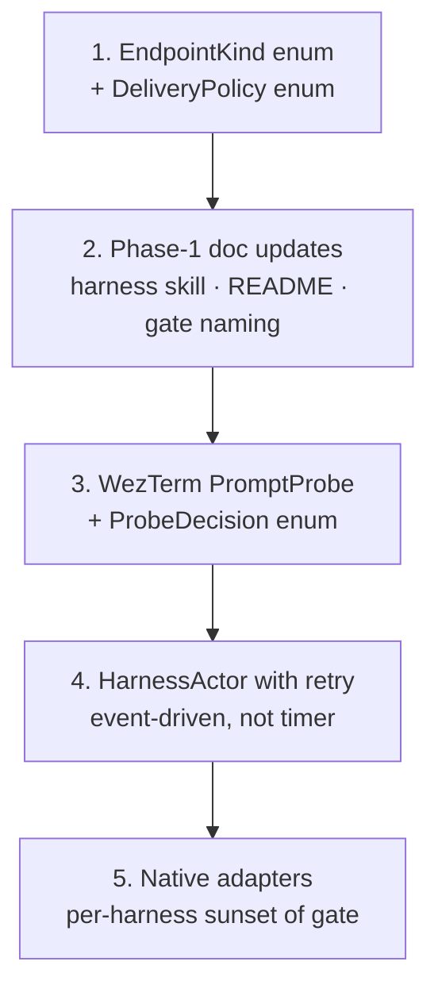

# Persona-message current state + gate design audit

Date: 2026-05-07
Author: Claude (designer)

A read of the persona-message + persona-wezterm code as it
stands on 2026-05-07, plus an audit of the operator's report
`reports/operator/2026-05-07-prompt-empty-delivery-gate-design.md`.
The audit confirms the gate's framing as a *guarded fallback
transport*, names two structural concerns to fix before the
gate lands as code, and surfaces several smaller drift items
already inside the message crate.

---

## 1. Where we are

Persona-message has reached *naive round-trip working between
real interactive harnesses*. As of the operator's
`2026-05-06-persona-message-real-harness-test-plan.md`:

- `nix run .#test-actual-codex-to-claude` passes.
- `nix run .#test-actual-claude-to-codex` passes.
- `nix run .#test-basic` passes.

The first end-to-end live test is green. The crate now has:

- `schema.rs` — `Actor`, `Message`, `MessageId` (typed
  3-character base32 short hash with `m-` prefix +
  `MessageIdKind` enum + `MessageIdView` parser),
  `EndpointTransport`, `EndpointKind`, `Attachment`,
  `ThreadId`, `ActorId`, `expect_end()` helper.
- `command.rs` — `Send`, `Inbox`, `Tail`, `Input` enum,
  `Output` enum (`Accepted`, `InboxMessages`), `CommandLine`
  argument decoder.
- `store.rs` — `MessageStore` with `actors()`,
  `resolve_sender()`, `append()`, `deliver()`, `messages()`,
  `inbox()`, `tail()`. `Actor::deliver` dispatches by
  `endpoint.kind.as_str()`.
- `daemon.rs` — Unix-socket daemon (`message-daemon` binary)
  that lets the `message` CLI bypass per-call store work.
  Frame protocol is rkyv length-prefixed.
- `resolver.rs` — `ProcessAncestry` walking
  `/proc/<pid>/status` `PPid:` lines + `ActorIndex` lookup.

Twenty-five scripts in `scripts/` cover setup/teardown for
visible/headless WezTerm, Codex, Claude, and Pi harnesses;
test entry points; debug commands. Stateful work is named per
`skills/autonomous-agent.md`'s "stateful test command becomes a
named script" rule — clean.

Sender identity is stamped by the binary via process
ancestry, not trusted from model text. The discipline is
preserved.

The trigger for the gate report: a live Pi test exposed
**human typing + injected message bytes splicing into one
prompt line.**

---

## 2. Audit of the gate design

`reports/operator/2026-05-07-prompt-empty-delivery-gate-design.md`
is a substantive design document — ~430 lines of prose +
Mermaid diagrams. It names the problem, names the solution,
gives a phased plan, and acknowledges the limits.

### What the report gets right

- **Frames the gate as a guarded fallback, not a messaging
  layer.** The first sentence after "Why this exists" already
  separates "messaging" from "delivery on a hostile
  transport." This framing is correct and load-bearing — it
  prevents the gate from spreading into the message records.
- **Names `UnsafeTerminalSubmit` deliberately ugly.** The
  ugliness IS the diagnostic — readers see immediately that
  this is the path you don't want to take. Per
  `skills/beauty.md` §"What ugliness signals", this is using
  ugliness *as a positive marker* for danger. Correct
  application of the criterion.
- **Typed `ProbeDecision` enum with `Unknown` mapped to
  unsafe.** `SafeToSubmit | Defer | Unknown` covers the space;
  the conservative default (Unknown ⇒ defer) is right.
- **Names the visible-focused-pane rule.** "A visible focused
  harness is human-owned. Persona must not write to its
  stdin." Single sentence, load-bearing, correct.
- **Acknowledges the race can't be eliminated.** The
  observation that there is always a window between the probe
  and the write is honest. The mitigations (50ms stable
  interval, never-on-focused, never-on-shared) are pragmatic.
- **Phased implementation plan.** Phase 1 makes the unsafe
  path explicit; Phase 2 adds the probe; Phase 3 wires the
  gate; Phase 4 adds optional WM focus probes; Phase 5 names
  the destination (native adapters).
- **Right destination.** Phase 5 names native adapters as the
  long-term path. The gate is transitional substrate, just
  like BEADS — *and the report should make that explicit
  parallel* (concern below).

### What the report should sharpen

I have **two structural concerns** and **four smaller ones**.

#### Structural concern 1 — the gate is transitional; name the sunset

The report ends with:

> Implement the gate, but treat it as a fallback with a
> warning label. The correct architecture remains native
> delivery or inbox polling.

That is the right framing, but it's stated once at the bottom.
The destination (native adapters in Phase 5) and the
transitional status of the gate (Phase 1–4 entirely) deserve
to be named **at the top** with an explicit sunset rule:

> **The gate retires per-harness as native adapters land.**
> When a Pi extension exists and is reachable, Pi's gate path
> is removed from the codebase. Same for Codex, Claude. The
> gate is *transitional substrate* on the same axis as BEADS —
> it exists because the destination isn't ready yet.

Without this rule stated up front, the gate calcifies. The
50ms-window heuristic, the per-harness recognizer table, the
WM focus plugins — every one of these accumulates maintenance
once landed. Giving the gate a sunset rule means each
component knows from birth when it should be removed.

This is the same pattern `~/primary/AGENTS.md` already applies
to BEADS:

> `.beads/` exists today for convenience. The destination is
> Persona's typed messaging fabric.

The gate deserves the same treatment in its own report:
*exists today for the harnesses without native adapters; the
destination is per-harness native adapters; sunset
incrementally as adapters land.*

#### Structural concern 2 — name the polling carve-out explicitly

The "two empty observations 50ms apart" pattern is polling.
`skills/push-not-pull.md` is unambiguous: *Polling is wrong.
Always.* The skill names two narrow shapes that look like
polling but aren't:

> **Reachability probes** with explicit transport-layer
> semantics — a monitoring agent that periodically checks
> "is service X reachable" is doing transport-layer
> reachability, not state-change detection.
>
> **Backpressure-aware pacing** where the consumer decides
> when it can accept the next push.

The gate's probe is closer to the first carve-out — it asks
"is this surface in a safe shape right now" rather than
"what changed." But the *two-observation stable-interval*
extension is closer to actual polling.

The report should:

1. **Name explicitly which carve-out applies.** The report's
   single probe is reachability-shaped; that's fine. The
   stable-interval pattern stretches the carve-out, and that
   stretch should be named.
2. **State that the stable-interval pattern is itself a
   workaround.** When WezTerm exposes a "input started" /
   "cursor moved" *event* (it might, via Lua hooks), the
   stable-interval pattern is replaced by a subscription. The
   stable-interval is what we ship today because we don't yet
   have the push primitive — same logic as the gate itself
   being transitional.
3. **State a sunset for the stable-interval check.** When a
   push primitive on the harness's input region is available,
   the stable-interval check retires.

Without these named, future maintainers will treat the
50ms-stable-interval as the answer rather than as one of two
workarounds layered on top of each other. Each workaround
deserves its own sunset.

#### Smaller concern A — `harness_kind` should be a typed enum

The report mentions `PromptProbe::decision(snapshot, harness_kind)`
without specifying the kind's type. The harness recognizer
table has columns for Pi, Claude, Codex. The report says:

> This table should move into per-harness adapters; the gate
> interface should not hard-code every product forever.

That's the right direction, but it implies the type:
`harness_kind` is a closed enum — `Harness ∈ { Pi, Claude,
Codex }` — with each variant carrying its own recognizer (a
trait impl, a method, whichever shape per-harness adapters
take). Per `skills/rust-discipline.md` §"Don't hide
typification in strings", the kind goes in the type system,
not in `match s.as_str()`.

The report doesn't violate this — it just leaves it implicit.
Worth saying out loud: *the harness kind is a closed enum;
each variant's recognizer is a method on that variant or on
its adapter type, not a string lookup.*

#### Smaller concern B — cancellation under the race window

The report's race-window mitigation includes:

> 4. If the user focuses the pane during the interval, cancel.

But cancellation isn't free here. The probe is read-only
(safe to abort), but the actual write is `wezterm cli
send-text`, which is a subprocess invocation. Once `Command`
is spawned, the bytes go into WezTerm's input stream; there
is no interruptible handle.

Three honest options:

1. **Make the focus check the *very last* step before the
   write**, with no work between observation and `send-text`.
   The window narrows to subprocess startup time (~milliseconds).
2. **Use Lua-side delivery via `wezterm cli spawn`** running
   a Lua script that itself reads pane state and writes input
   atomically, executing inside WezTerm's event loop. This
   removes the cross-process race entirely — but trades it for
   complexity in the Lua layer.
3. **Accept that "cancel" means "future deliveries; this
   one is in flight."** The retry actor (Phase 3's
   actor-owned retry loop) handles the corruption case by
   noticing the splice and... what? Sending an apology
   message? There's no clean recovery from a corrupted
   prompt.

The report says "cancel" but the mechanism is unspecified.
Worth naming which of (1) (2) (3) the implementation will
take. My lean: (1) for Phase 2; (2) as the Phase 4 "fix the
race entirely" addition.

#### Smaller concern C — the retry loop's wake trigger

Phase 3 says:

> Add a retry loop owned by the actor, not by the CLI process.

Good shape. The question: *what triggers the retry?* If
timer-based ("re-probe every 100ms"), that's polling again,
on a different surface. If event-driven (an actor receives a
"harness became idle" event from a screen subscription), it's
push.

The right answer per `skills/push-not-pull.md` is event-driven.
WezTerm's screen state changes can be observed (raw byte
stream from the daemon already; per the persona-wezterm
ARCHITECTURE.md, `output bytes + scrollback` flows from the
PTY daemon to viewers). The retry actor should subscribe to
that stream, parse for the "harness now idle" transition, and
*then* probe-and-deliver.

This may be Phase 4 or Phase 5 work, not Phase 3 — but the
report should at least *name the timer-vs-event question* so
the implementation doesn't default to a timer.

#### Smaller concern D — the harness skill needs an update

`persona-message/skills/persona-message-harness.md` currently
tells harnesses:

> Finish your response and stop. Later terminal input will
> wake you with an incoming message prompt.

Once the gate lands, this is no longer always true. A harness
sending a message can't expect immediate delivery to the
recipient; the message may be deferred for ages. A harness
*receiving* a message can't expect "the next time I'm idle,
unread mail injects" to hold — if the gate decides the pane is
focused, no injection happens.

Phase 1 of the operator's plan says:

> Teach agents that sending a message does not guarantee
> immediate terminal delivery.

Concrete: the harness skill needs a new section explaining
the deferred state. Something like:

> A `(Send …)` returns `(Accepted message delivered)`,
> `(Accepted message queued)`, or `(Accepted message
> deferred "<reason>")`. Treat these as final. Don't retry; the
> daemon's actor handles eventual delivery.

This change is a Phase 1 deliverable, not a separate concern,
but it's worth flagging because it crosses a skill-file
boundary that the report's task list doesn't mention.

---

## 3. Cross-cutting concerns inside persona-message

Items I noticed reading the code, separate from the gate
design.

### 3.1 `EndpointKind` is stringly-typed

```rust
pub struct EndpointKind(String);
```

…and the dispatch:

```rust
match endpoint.kind.as_str() {
    "human"        => Ok(false),
    "pty-socket"   => …,
    "wezterm-pane" => …,
    _              => Ok(false),
}
```

This is **exactly** the pattern `skills/rust-discipline.md`
§"Don't hide typification in strings" rejects:

> That's a closed enum with extra steps. Use one.

Replace with:

```rust
pub enum EndpointKind {
    Human,
    PtySocket,
    WezTermPane,
}
```

Two follow-on benefits:

- The `_ => Ok(false)` branch disappears. Today an unknown
  kind silently drops the message; with the enum, exhaustive
  matching makes the failure mode visible (the compiler
  forces every new kind to update the dispatch).
- The gate's "delivery_policy" notion becomes a typed enum
  too — `DeliveryPolicy ∈ { Native, GatedTerminal, Unsafe,
  HumanReadOnly }` instead of a string-tagged delivery_policy
  field.

This change is the right size for **Phase 1** of the
operator's plan ("make unsafe explicit"). It's a typed-rename
that lands cleanly in one commit.

### 3.2 `Tail` arm in `Input::execute` is dead

```rust
Self::Tail(_) => {
    let recipient = store.resolve_sender()?;
    let stdout = std::io::stdout();
    store.tail(&recipient, stdout.lock())?;
    unreachable!("tail returns only on error")
}
```

The real `Tail` path runs through `Input::run` (which
intercepts `Tail` before either daemon-routing or
`execute()`). The `execute` arm is unreachable in correct
code. This is a typification smell: `Tail` shouldn't be in
the same enum as `Send`/`Inbox` if its dispatch shape
differs.

Two cleaner shapes:

- **Two enums** — `RequestInput { Send, Inbox }` for things
  that produce an `Output`, and `StreamInput { Tail }` for
  things that take ownership of the stdout stream until
  killed.
- **`Output::Stream` variant** — `Tail` returns an `Output`
  whose contents are an iterator/stream, with the daemon
  handling the streaming endpoint differently.

The first is closer to perfect-specificity (the two shapes
are different enough that they don't share an enum); the
second keeps the surface uniform but pushes the difference
into the output side.

Not blocking. But worth fixing before more variants pile on.

### 3.3 `error.rs` uses `Agent` where `schema.rs` uses `Actor`

```rust
#[error("no actor in {path:?} matches this process ancestry")]
NoMatchingAgent { path: PathBuf },
```

The variant name and the message disagree. Probably leftover
from a rename (Agent → Actor). Quick fix:
`NoMatchingAgent` → `NoMatchingActor`.

### 3.4 Doc/live drift — `actors.nota` vs `agents.nota`

Code, README, and `skills.md` say `actors.nota`. Live test
artifacts in `.message/` use `agents.nota` with `(Agent …)`
records (without endpoint field). This is stale state from
pre-rename runs. Not a correctness issue — the next test run
writes `actors.nota` — but worth either:

- Adding `.message/agents.nota` (and `agents.nota.log`,
  similar) to `.gitignore` if it isn't already, OR
- Cleaning up local stale state next time tests are touched.

Lower priority; surfaced for completeness.

### 3.5 `Cargo.toml` has direct path deps

```toml
nota-codec      = { path = "../nota-codec" }
persona-wezterm = { path = "../persona-wezterm" }
```

`lore/rust/style.md` says:

> Do NOT use `path = "../sibling-crate"` directly in a
> `Cargo.toml` — that assumes a layout that a fresh clone
> won't reproduce. Let the flake populate the paths.

If the flake's `postUnpack` populates these symlinks (or the
dev shell does), this is fine — the Cargo.toml is OK to read
literally, the flake sets up the world to make it true. If
the flake doesn't, the published crate breaks for fresh
clones.

The `lore/rust/style.md` shape is the git-URL form:

```toml
nota-codec      = { git = "https://github.com/LiGoldragon/nota-codec.git", branch = "main" }
persona-wezterm = { git = "https://github.com/LiGoldragon/persona-wezterm.git", branch = "main" }
```

…with `cargoLock.outputHashes` in the flake. Worth checking
which path is actually load-bearing in this repo's flake.

### 3.6 `Attachment` field in `Message`

```rust
pub struct Message {
    …
    pub attachments: Vec<Attachment>,
}
```

Always emitted as `[]` today; never set; nothing reads it.
Per `skills.md`:

> Do not add destination records unless a test drives
> behavior through them.

Same principle for fields. Drop `attachments` until a test
drives it; add back when the first attachment-bearing test
lands.

This is the same trim discipline I recommended in the
2026-05-06 persona-message audit (deletion list:
`Authorization`, `Delivery`, lifecycle enums, `Object/Document`,
`Check`, `Validated`, `SchemaExample`, `::example()`). The
operator has narrowed the schema since — **good.** Trimming
`attachments` is the next step in that direction.

---

## 4. The shape of the next move

Putting (2) and (3) together, I see five pieces of work in a
sensible order:



The labels match operator's Phase 1–5 with one rearrangement:
the **typed-enum migration is Phase 1** (mechanical, single
commit), then doc updates, then probe, then actor, then
adapters.

---

## 5. Calling out what's good

To balance the above — the persona-message + persona-wezterm
substrate is in remarkably good shape:

- **Live-test green** as of 2026-05-07. The end-to-end
  bidirectional path works.
- **Sender identity is tool-stamped**, not model-claimed. The
  process-ancestry walk preserves the discipline I flagged in
  the 2026-05-06 persona-message-audit.
- **MessageId design is exemplary** — typed `MessageIdKind`
  enum, prefixed wire form for human readability, `MessageIdView`
  parser that reads the prefix into the closed enum. This is
  the rule "Don't hide typification in strings" applied
  perfectly: prefix on the wire is convenience; types in code
  carry the truth.
- **Schema has been narrowed.** No `Authorization`, no
  `Delivery`, no lifecycle enums in the prototype. Trim
  discipline followed.
- **Persona-wezterm separation is clean.** `persona-message`
  depends on `persona-wezterm`; `persona-wezterm` doesn't
  depend on `persona-message`. The terminal-transport
  capability is its own crate (per
  `skills/micro-components.md`) and the message contract is
  separately its own. **Right shape.**
- **`scripts/` discipline followed.** 25 named scripts;
  flake-exposed Nix entry points; no ad-hoc commands left
  unstable.
- **Operator's gate report follows lore/AGENTS.md design-report
  conventions.** Prose + Mermaid + tables; only structural
  code samples; phased plan; sources cited.

The substrate is at *demonstration threshold* — exactly the
point my prior session-handoff named:

> Once those tests run end-to-end with cross-harness prompt
> injection, the messaging fabric has crossed the
> demonstration threshold and the next layer (the durable
> reducer, content-addressed storage, the harness adapter
> library) becomes worth the effort.

The gate design is the bridge from "demonstration" to "first
production-shaped harness adapter." The shape is right; the
two structural concerns above are the two refinements that
keep the bridge from becoming permanent scaffolding.

---

## 6. Recommendations in priority order

1. **Add a sunset rule to the gate report.** State at the top
   of the report that the gate is per-harness transitional
   substrate; each gate path retires when that harness's
   native adapter lands. This is one paragraph; high leverage
   for keeping the gate from calcifying.
2. **Name the polling carve-out explicitly.** Add a paragraph
   distinguishing the reachability-probe pattern (one-shot
   read of pane state) from the stable-interval extension
   (which is itself a workaround). State the sunset for the
   stable-interval check too.
3. **Land the `EndpointKind` enum migration as Phase 1.** This
   is one commit, mechanical, removes a stringly-typed
   dispatch the workspace's discipline forbids. Pairs with
   adding the `DeliveryPolicy` enum the gate design needs
   anyway.
4. **Update `persona-message-harness.md`** to teach the
   harness about the three-state delivery outcomes (delivered
   /queued / deferred). Phase 1 deliverable.
5. **Specify the cancellation mechanism** under the race
   window. Pick (1)/(2)/(3) from §2's smaller concern B.
6. **Specify event-driven retry**, not timer-driven. Phase
   3/4 deliverable; flag now to prevent timer-default.
7. **Type the harness kind as a closed enum** with per-variant
   recognizer methods. Phase 2 deliverable.
8. **Trim the `attachments` field** from `Message` until a
   test drives it. Low-priority; small commit; consistent with
   the schema-narrowing already done.
9. **Rename `NoMatchingAgent` → `NoMatchingActor`.** One-line
   error.rs cleanup.
10. **Confirm or fix the path-dep flake handling** for
    `nota-codec` and `persona-wezterm`. Per
    `lore/rust/style.md`'s preference for git-URL deps with
    `cargoLock.outputHashes`.

(1) and (2) are doc-only; the operator can land them as a
report edit. (3) through (10) are code work; (3) and (4) are
the unblocking changes for the gate's Phase 1.

---

## 7. Open questions for the operator

A short list — not blocking; the design can proceed as-is,
these are points where my read might be misaligned with the
operator's intent.

1. **Is the WezTerm Lua-script delivery option (option 2 in
   §2's smaller concern B) on the table?** It would close the
   race entirely. Worth a focused look in Phase 4 if not.
2. **Per-harness adapters — separate crates or one
   `persona-harness-recognizers` module crate?** Per
   `skills/micro-components.md`, the default is one crate per
   capability. But three near-identical recognizer modules
   may not earn three crates yet. My lean: one crate with
   per-harness modules until a second non-recognizer
   capability lands per harness, then split.
3. **Native adapters — is Pi the right first target?** The
   operator's report names Pi first. If Pi's API surface is
   the most accessible, yes. If Codex/Claude have public
   protocols sooner, the order changes. Worth a brief
   research check before Phase 5.
4. **Should `delivery_policy` be a field on `EndpointTransport`
   or on the per-message `Send` request?** The report puts it
   on the endpoint (per-actor configuration). That's right
   for now; named here only because the alternative
   (per-message override) might want to exist later.

---

## 8. See also

- `reports/operator/2026-05-07-prompt-empty-delivery-gate-design.md`
  — the audit target.
- `reports/operator/2026-05-06-persona-message-real-harness-test-plan.md`
  — the test infrastructure the gate plugs into.
- `reports/operator/2026-05-06-persona-message-plane-design.md`
  — the message-plane background.
- `reports/designer/2026-05-06-persona-message-audit.md` —
  the prior persona-message audit; trim discipline lineage.
- `reports/designer/2026-05-06-persona-messaging-design.md`
  — the full reducer-based fabric design; the gate is one
  endpoint adapter inside that design.
- `reports/designer/2026-05-07-real-harness-test-architecture.md`
  — the test-architecture parallel-read.
- `~/primary/skills/rust-discipline.md` §"Don't hide
  typification in strings" — the rule the `EndpointKind`
  string violates.
- `~/primary/skills/push-not-pull.md` — the carve-out the
  probe lives inside.
- `~/primary/skills/beauty.md` — the criterion that names
  `UnsafeTerminalSubmit`'s ugliness as a feature.
- `persona-message`'s `skills.md` and `skills/persona-message-harness.md`
  — the repo skill + harness skill that need the Phase-1
  doc update.
- `persona-wezterm`'s `ARCHITECTURE.md` — the transport
  layer the gate sits on top of.

---

*End report.*
