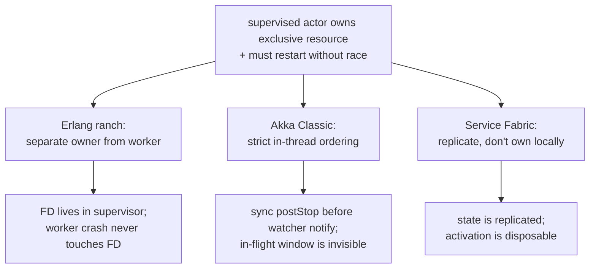
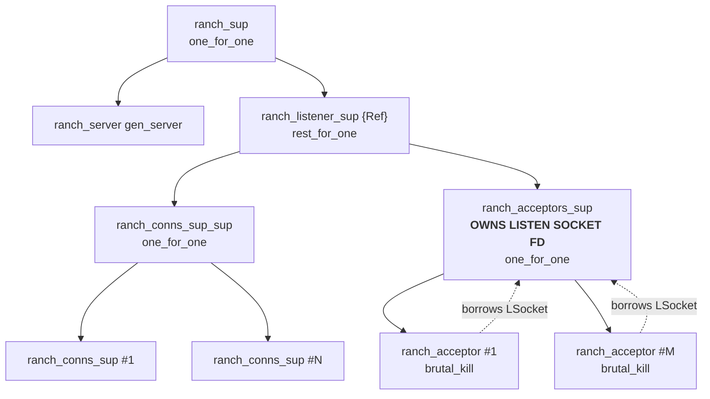
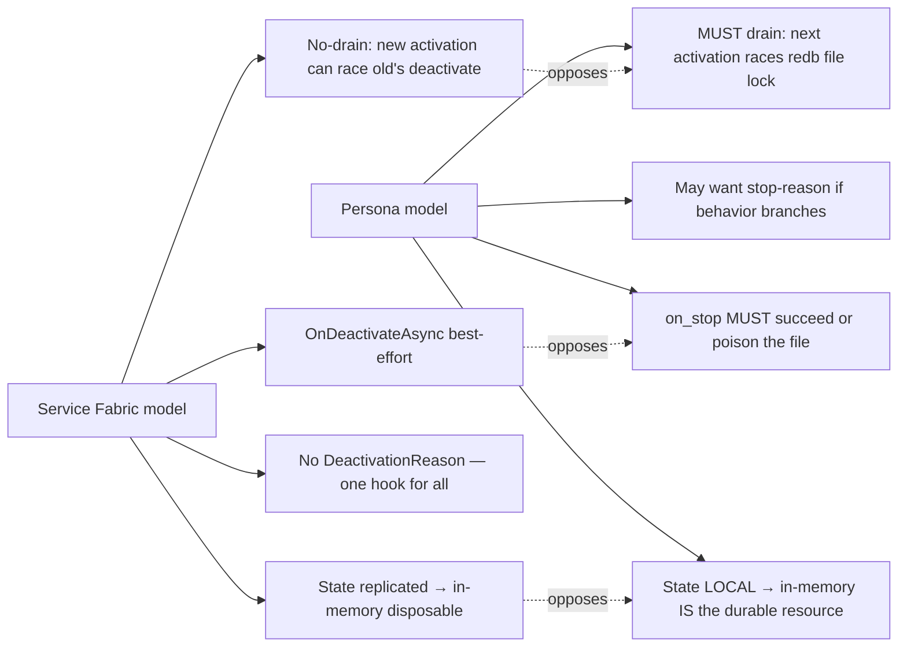
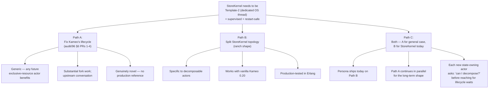

# 203 — Working-system reference for the kameo lifecycle redesign

Date: 2026-05-16
Role: designer
Scope: synthesis of three production actor-framework references
(Erlang's `ranch`+`cowboy`, Akka Classic, Microsoft Service
Fabric Reliable Actors) for the workspace's kameo-fork
lifecycle redesign discussed in
`reports/designer/202-kameo-push-only-lifecycle-audit-2026-05-16.md`,
`reports/operator/126`, and `reports/operator/128`.

## 0. The canonical reference model

**Actor termination is not one event.** It is an ordered
sequence of facts, each independently observable, each
publishable per-path:

```text
1. Admission stops
2. In-flight handler work ends
3. Children / resource holders are absent
4. Cleanup hook completes
5. Actor-owned state is absent — with reason:
   Dropped | NeverAllocated | Ejected
6. Registry entry is absent
7. Death / link signals are dispatched
   (awaited dispatch — not fire-and-forget)
8. Terminal result is visible
```

**The discipline statement**: Persona follows the Erlang/OTP
+ Akka **release-before-notify** discipline, but implements it
explicitly because Rust/Tokio does not provide it at the
runtime level. BEAM enforces step 5 before step 7 at the VM;
Akka enforces it via in-thread chained `try/finally` on the
JVM dispatcher. Rust has neither. The kameo fork's
contribution is making this discipline observable, fallible,
and path-aware — using the same release-before-notify ordering
as the production references, exposed via a publish channel
that production references chose to hide.

**The path-aware refinement** (DA): each path walks the steps
that *actually occurred* — startup-failure paths produce
`ActorStateAbsent(NeverAllocated)` truthfully, not by ordinal
implication.

The remainder of this report documents the three production
references that justify this discipline and proposes a
recommended adoption path for Persona.

## 0.5. TL;DR — three battle-tested actor frameworks

**Three actor frameworks solve "supervised actor + exclusive
resource + restart without race" — each by a *different*
technique:**


| Framework | Production scale | Technique | Domain |
|---|---|---|---|
| Erlang `ranch`+`cowboy` | WhatsApp, RabbitMQ, Heroku | **Ownership separation**: resource lives in a long-lived supervisor; cheap workers are restartable | TCP listeners, FDs, language-runtime-managed resources |
| Akka Classic | LinkedIn, Walmart, Lightbend customers | **Strict in-thread teardown ordering** + sync `postStop` before watcher notify; hide the in-flight window deliberately | JVM with GC, pooled DB connections, `AutoCloseable` |
| Service Fabric Reliable Actors | Azure SQL DB, Cosmos DB, Skype, Cortana | **Push exclusivity into the replication layer**; "don't use this pattern for exclusive local resources" (explicit) | Cloud cluster, replicated stateful actors |



**Recommendation for Persona:**

- **Adopt the ranch shape for `StoreKernel`** — split into
  `KernelHandleOwner` (owns `Arc<Database>`, never restarts) +
  `TxnWorker` pool (freely restartable, never owns the handle).
  This is the production-tested answer for our exact failure
  mode (exclusive local resource + supervised restart).
- **Continue the kameo-lifecycle redesign (`reports/designer/202`)
  as the long-term shape**, but recognize it is solving a
  problem *no production framework directly tackles* —
  observable in-flight teardown in a system with async cleanup
  and no GC.
- **Borrow individual elements from each reference**: Akka's
  `finishTerminate` ordering chain (verified gold standard);
  Service Fabric's `OnActivate`/`OnDeactivate` API minimalism
  (no stop-reason enum if the actor doesn't branch on it);
  ranch's `rest_for_one` strategy + supervisor-as-resource-owner
  topology.

The kameo fork's `ActorStateAbsent(Dropped|NeverAllocated|Ejected)`
shape is *novel* — no surveyed framework publishes this. That's
not a red flag; it's because Rust's combination of (async I/O +
sync `Drop` + no GC) is genuinely new ground for actor
runtimes. The audit's design is right; we should also adopt the
ranch topology pattern *in addition*, because each closes a
different failure mode.

## 1. Erlang `ranch` + `cowboy` — the structural-avoidance reference

Ranch is the canonical Erlang TCP server library used by
production Erlang systems (cowboy is built on it, and cowboy
runs WhatsApp, RabbitMQ, Heroku's Erlang apps). It explicitly
solves the *same* problem we have, just for TCP ports instead
of redb file locks.

### 1.1 The load-bearing trick: the actor does not own the resource

The acceptor (`ranch_acceptor.erl:21-25`) is a plain `spawn_link`
worker — *not* a `gen_server`, *not* a supervisor — with
`shutdown => brutal_kill`. It takes `LSocket` as a constructor
parameter; it never calls `listen()`. Its hot loop is
`Transport:accept(LSocket, infinity)` forever.

The *listening socket FD* is owned by `ranch_acceptors_sup`
itself — the supervisor process. `start_listen_sockets/4`
(line 72) calls `gen_tcp:listen/2`, which creates a port
whose controlling process is the calling process (the
supervisor). The acceptor child specs reference the port via
`LSocket`, but they're just borrowing it.



### 1.2 What this gets ranch — and why it matters

| Failure | What happens | Resource state |
|---|---|---|
| One acceptor crashes | Supervisor restarts that one acceptor, passes the *same* `LSocket` | **Port never released**, no rebind |
| All acceptors crash in a window | Supervisor's restart intensity (`1 + ceil(log2(N))` per 5s) escalates to itself | Port released by BEAM when supervisor exits |
| `ranch_acceptors_sup` itself crashes | Parent `ranch_listener_sup` restarts it; BEAM had already closed the port on supervisor exit | New supervisor calls `listen()` fresh — no concurrent listener |

The win: **the resource lifetime is bound to a process that does
not restart on routine failures.** The cheap workers absorb
crashes; the resource owner is structurally insulated.

### 1.3 Direct mapping to our `StoreKernel`

| Ranch | Persona |
|---|---|
| Listening socket FD | redb `Database` handle (exclusive file lock) |
| `Transport:listen/1` | `Database::open` (the racy / expensive call) |
| `ranch_acceptors_sup` (FD owner, almost never restarts) | new `KernelHandleOwner` actor that owns `Arc<Database>` |
| `ranch_acceptor` (cheap, `brutal_kill`) | `TxnWorker` pool that asks owner for transactions |
| `LSocket` passed by value into acceptor child spec | `Arc<Database>` cloned into worker spawn |
| `controlling_process` handoff per connection | per-request `db.begin_write()` returning a transaction |
| `rest_for_one` order (`conns_sup_sup` first, `acceptors_sup` second) | parent supervisor: `KernelHandleOwner` first, `TxnWorkerPool` second; rest_for_one so worker death never restarts owner |

**redb specifically supports this shape.** `Database` is
`Send + Sync` — `Arc<Database>` is freely shareable across
workers. `WriteTransaction` is `Send` but not `Sync` (one
writer at a time, which we want); `ReadTransaction` allows
concurrent snapshot reads. The workers can serialize writes
naturally via their mailbox discipline.

### 1.4 What ranch does NOT solve

- **No cross-process inheritance of the resource.** Ranch
  survives only because BEAM lets the supervisor process keep
  the FD across its own internal restarts (via process-dictionary).
  Rust has no analogue. If we ever need *cross-process* hot
  restart (the daemon process itself restarts), the supervisor
  must close the redb file and the new daemon must reopen.
- **No generic "exclusive resource" abstraction.** Ranch is
  bespoke to TCP. The *pattern* reuses, but every new
  exclusive-resource type needs its own bespoke
  owner+workers split. Worth documenting as a workspace
  skill (`skills/exclusive-resource-actor.md`).
- **No drain protocol for the resource itself.** Ranch
  drains connections; the listening socket close is instant.
  `Database::drop` is instant but in-flight transactions
  must be flushed first. The pattern is the same as ranch's
  connection-drain, just applied to write transactions.

### 1.5 Source citations

- `ranch_acceptor.erl:21-25` — acceptor spawn, takes `LSocket` as parameter
- `ranch_acceptors_sup.erl:30-46` — supervisor calls `listen()` and caches socket
- `ranch_acceptors_sup.erl:72` — `start_listen_sockets/4`
- `ranch_listener_sup.erl:48` — `rest_for_one` strategy
- `ranch_conns_sup.erl:340-360` — graceful drain on shutdown
- `ranch.erl:421-450` — runtime mutation never touches the FD
- GitHub: `https://github.com/ninenines/ranch`

## 2. Akka Classic — the strict-in-thread-ordering reference

Akka's solution is **strictly-ordered in-thread teardown**.
The `FaultHandling.scala::finishTerminate` method is the
canonical sequence; it has been production-deployed since
~2010 on the JVM under LinkedIn, Walmart, Hootsuite, and
Lightbend's customers.

### 2.1 The smoking-gun source comment

Verbatim from
`akka-actor/src/main/scala/akka/actor/dungeon/FaultHandling.scala`:

```scala
/* The following order is crucial for things to work properly. Only
   change this if you're very confident and lucky. Please note that if
   a parent is also a watcher then ChildTerminated and Terminated must
   be processed in this specific order. */
private def finishTerminate(): Unit = {
  val a = actor
  try if (a ne null) a.aroundPostStop()                    // 1. release resource
  catch handleNonFatalOrInterruptedException { e => ... }
  finally try stopFunctionRefs()                           // 2. drop function-ref children
  finally try dispatcher.detach(this)                      // 3. unhook mailbox
  finally try parent.sendSystemMessage(
    DeathWatchNotification(self, existenceConfirmed = true,
                           addressTerminated = false))     // 4. tell parent
  finally try tellWatchersWeDied()                         // 5. tell watchers
  finally try unwatchWatchedActors(a)                      // 6. cancel our watches
  finally clearActorFields(a, recreate = false)            // 7. null instance for GC
}
```

The whole body is a chained `try / finally try / finally try`.
Every step must run even if a prior step throws; every step
runs in this exact sequence.

```mermaid
sequenceDiagram
    participant Cell as ActorCell (dying)
    participant Actor as user actor instance
    participant Disp as Dispatcher
    participant Parent as parent (supervisor)
    participant W as watchers
    Cell->>Actor: 1. aroundPostStop() — release resource
    Cell->>Cell: 2. stopFunctionRefs()
    Cell->>Disp: 3. dispatcher.detach(this) — mailbox unhooked
    Cell->>Parent: 4. sendSystemMessage(DeathWatchNotification)
    Cell->>W: 5. tellWatchersWeDied() — DWN to each watcher
    Cell->>Cell: 6. unwatchWatchedActors(a)
    Cell->>Cell: 7. clearActorFields(a)
```

### 2.2 The cross-thread guarantee

`tellWatchersWeDied()` uses `sendSystemMessage(DWN)` — enqueues
onto each watcher's system-message queue. JVM mailbox
`systemEnqueue` happens-before `systemDequeue` gives the
cross-thread ordering guarantee. **By the time any watcher's
`receive(Terminated)` runs on any thread, step 1 has already
returned on the dying actor's dispatcher thread.**

### 2.3 What Akka deliberately did NOT do

Akka **chose not to** expose `Stopping` as an observable signal.
From `akka-meta#21` (Akka Typed lifecycle redesign issue):

> Akka Typed's actor-lifecycle issue deliberately reduced
> signals to `PreRestart` / `PostStop` / `Terminated` /
> `ChildFailed`. A `Stopping` signal would re-introduce the
> kind of "I am dying but not dead" state the redesign tried
> to eliminate.

`ActorCell.terminating` (internal flag) is the in-flight
teardown state the kameo branch wants to surface — Akka hides
it. The reasoning:

1. Users build fragile code around observable intermediate
   states.
2. Sync `postStop` + GC + `AutoCloseable` makes the window
   small enough to be invisible.
3. `CoordinatedShutdown` (a separate user-driven phase
   system) covers the cross-cutting cleanup case.

### 2.4 Where Akka's choice doesn't apply to Rust

| Akka's assumption | Why it weakens in Rust |
|---|---|
| Sync `postStop` makes the window invisibly small | Async `on_stop().await` makes the window arbitrarily large — must be observable |
| GC + `AutoCloseable` cover most cleanup | No GC; `Drop` runs synchronously at function exit, no implicit cleanup |
| `JVM AutoCloseable` as a backstop for forgetting to close in `postStop` | No equivalent backstop; explicit release in `on_stop` is mandatory |
| User actors typically hold *pooled* DB connections | Persona actors typically hold *exclusive* resources (redb, sockets) |

**Akka's source-level ordering is the gold standard**; we
should mirror the seven-step `finishTerminate` chain shape
verbatim in our Rust runtime. **Akka's "hide the in-flight
window" choice doesn't translate**; Rust's async cleanup
inherently exposes the window, and Persona's exclusive-resource
case needs the observation surface that Akka deliberately
omitted.

### 2.5 Direct contributions to our design

- **The strict ordering chain** is the right runtime shape.
  Translated to Rust:
  ```rust
  async fn finish_terminate(self) -> ActorTerminalOutcome {
      // 1. await user's on_stop (release async resources)
      self.actor.on_stop(self.weak_ref.clone(), reason.clone()).await?;
      // 2. drop async children
      // 3. close mailbox
      // 4. await parent.send_death_watch_notification(...)
      // 5. await tell_watchers_we_died()  // truthful dispatch, not fire-and-forget
      // 6. cancel our watches
      // function exit: Drop runs, releasing actor struct
  }
  ```
- **JVM-monitor-style happens-before for cross-task notify**.
  Rust's mpsc channels give the same property: `send()`
  happens-before `recv()`. Our `LinkSignalsDispatched` fact
  must be marked *after* the channel send returns, not before.
- **The "order is crucial" comment block** translates verbatim.
  Document this in our public `Actor` trait rustdoc — Akka
  regrets only documenting it in source comments.

### 2.6 Source citations

- `akka/akka` main branch:
  `akka-actor/src/main/scala/akka/actor/dungeon/FaultHandling.scala`
- `DeathWatch.scala` — `tellWatchersWeDied` with
  remote-before-local rule
- `Mailbox.scala` — `cleanUp` to dead letters comment "essential
  for DeathWatch"
- `akka-meta#21` — Typed lifecycle redesign that chose to *not*
  expose `Stopping`
- Community pain points: `akka/akka-core#28695`, `#25795`,
  `#28144`, `akka/akka#30201`, `#30071`, `akkadotnet/akka.net#2291`

## 3. Service Fabric Reliable Actors — the replicated-state reference (and what it teaches us NOT to do)

Service Fabric is Microsoft's enterprise stateful-actor
framework. Production-deployed since ~2015 by Azure SQL DB,
Cosmos DB, Skype for Business, Cortana, Power BI. It's *the*
reference for "stateful actor with at-most-one activation
across a cluster."

### 3.1 The crucial inference: SF's model is hostile to exclusive local resources

The SF docs do not include a primary quote saying "exclusive
file locks and port bindings are explicitly listed as actor
anti-patterns." That framing in the original draft was an
inference, not a citation. **Per `reports/designer-assistant/96`
§1.4, this should be marked as inference.**

What the [Reliable Actors Overview](https://learn.microsoft.com/en-us/azure/service-fabric/service-fabric-reliable-actors-introduction)
("When to use Reliable Actors") *does* say is that actor object
lifetime is virtual (state outlives the object), that actors
should not block callers with unpredictable I/O, and that
deactivation may not run on node failure. The combination
implies — but does not state — that exclusive local resources
are unsafe to model as actors.

**SF achieves the at-most-one-activation guarantee by pushing
exclusivity into the replication layer**, not by holding it in
the actor:

- State is replicated across ≥3 replicas via Reliable
  Collections.
- The Failover Manager's reconfiguration protocol guarantees
  one primary replica per partition.
- The in-memory actor instance is *disposable* — `OnDeactivateAsync`
  is best-effort; if the node dies, the next primary replays
  state from replicated storage.

### 3.2 What does NOT translate to our case



**The "no-drain" semantics are particularly informative.** SF's
`ActorManager` atomically `TryRemove`s the actor from
`activeActors` *before* calling `OnDeactivateAsync`. Any
inbound call during the window goes through `GetOrCreateActor`
and starts a *fresh* activation **concurrent with the old's
deactivation**:

```csharp
if (activeActor.Value.GcHandler.TryCollect()) {
    if (this.activeActors.TryRemove(activeActor.Key, out var deactivatedActor)) {
        // ...later: await this.DeactivateActorAsync(removedActor);
    }
}
```

This works in SF *because* the in-memory actor cannot hold
exclusive state — state lives in the State Manager (replicated).
For Persona this pattern is **catastrophic**: a fresh activation
would race the old actor's `Drop` for the redb file lock.

### 3.3 What DOES translate

- **API shape: `OnActivateAsync` / `OnDeactivateAsync` as a
  two-named pair.** SF documents `OnDeactivateAsync` as
  "release in-memory references, unregister timers" — no
  state mutation. The pair is minimal and clean.
- **No `DeactivationReason` enum.** SF chose ONE hook with no
  parameter. Their reasoning: "the actor's response is
  identical" across idle GC, primary failover, host close,
  partition move. If our actors' cleanup logic *doesn't* branch
  on stop reason, **don't add the enum**. Once consumers branch
  on variants, removing them is painful. (Operator/128's
  `ActorTerminalReason::{Stopped, Killed, Panicked, CleanupFailed,
  StartupFailed}` should be justified: does a redb actor
  *genuinely* compact on graceful stop but not on panic? If not,
  collapse.)
- **`ActorMethodContext { CallType, MethodName }` for pre/post
  hooks.** A clean pattern for cross-cutting logging/metrics/
  tracing context. Mirror in kameo's
  `OnPreActorMethodAsync`/`OnPostActorMethodAsync` equivalents.
- **The atomic "remove from registry, then call deactivate"
  pattern.** Our supervisor registry must `TryRemove` the
  actor's name *before* the actor's `on_stop` runs — closes the
  window where a peer can look up the dying actor and try to use
  it. (This refines audit §2.1: deregister BEFORE state release,
  not after.)

### 3.4 The single deepest lesson from SF

> **The framework that has run "stateful actors with
> at-most-one activation" at production scale for a decade
> explicitly says: don't use this pattern for exclusive local
> resources.**

This is humbling. SF achieves their guarantees by *avoiding*
the problem at the application layer. The Kameo branch is
taking on a problem SF deliberately excluded. **No production
reference exists for our exact shape** — Akka comes close but
relies on JVM-specific properties; ranch solves it by
structural avoidance.

Implications:

1. The kameo `ActorStateAbsent(Dropped|NeverAllocated|Ejected)`
   shape is *genuinely novel*. That's not a red flag — it's
   because Rust+local+exclusive is genuinely new ground for
   actor runtimes. But it means we're at the frontier, with no
   "just do what X did" reference.
2. **Where possible, we should prefer the ranch shape and avoid
   the problem.** Persona's `StoreKernel` is the textbook case
   for ownership separation. If we adopt the ranch topology, we
   don't *need* the lifecycle redesign for the StoreKernel case
   — we'd need it only for actors where decomposition genuinely
   doesn't work.
3. **The lifecycle redesign is still valuable** for the general
   case (an actor with internal-state-that-IS-the-durable-thing
   — e.g., a domain reducer maintaining an in-memory index that
   can't trivially decompose). But it should be informed by SF's
   minimalism: don't grow the API surface without a real
   behavioral need.

### 3.5 Source citations

- [Service Fabric Reliable Actors Overview](https://learn.microsoft.com/en-us/azure/service-fabric/service-fabric-reliable-actors-introduction)
- [Service Fabric Reliable Actors Lifecycle](https://learn.microsoft.com/en-us/azure/service-fabric/service-fabric-reliable-actors-lifecycle)
- [ActorBase API](https://learn.microsoft.com/en-us/dotnet/api/microsoft.servicefabric.actors.runtime.actorbase)
- [Reconfiguration in Service Fabric](https://learn.microsoft.com/en-us/azure/service-fabric/service-fabric-concepts-reconfiguration)
- `microsoft/service-fabric-dotnet` `src/Actors/Runtime/ActorManager.cs`
- Issues: `microsoft/service-fabric-services-and-actors-dotnet#205`, `#64`

## 4. The fork in the road — three legitimate paths forward

> **Supersession note (added by /204):** The "Path C — both,
> with `KernelHandleOwner + TxnWorker pool over Arc<Database>`"
> framing in this section is **superseded** by:
>
> - `reports/designer-assistant/96-kameo-lifecycle-independent-pov-2026-05-16.md`
>   §2 — single-owner storage topology (no pool), because
>   `sema-engine`'s `Engine` is single-owner by design and a
>   `TxnWorker` pool either serializes through one writer
>   (defeating the pool) or bypasses the engine's commit-log
>   ordering (breaking correctness).
> - `reports/designer/204-kameo-lifecycle-canonical-design-2026-05-16.md`
>   — the framework-side recommendation (12-fact public stream)
>   is superseded by the Akka-contract-translated-to-Rust
>   design.
>
> The Path-C *split* (apply ranch's ownership-separation
> discipline AND continue framework repair) is correct. The
> granularity is **single owner + restartable phase actors**,
> not **owner + worker pool**.

Each reference embodies a different philosophy. None is
strictly better; each is right for its context.



### Path A — fix Kameo's lifecycle (audit/96's recommendation)

The path-aware `ActorLifecycleFact` model with
`ActorStateAbsent(Dropped|NeverAllocated|Ejected)`, truthful
`LinkSignalsDispatched`, fallible
`wait_for_lifecycle_target -> Result<_, LifecycleWaitError>`.
Staged as four PRs (audit §6).

**Why it's worth doing:** generic solution that benefits any
future state-owning actor that can't decompose. Closes the bug
class entirely at the framework layer.

**What it costs:** substantial fork work, upstream conversation,
solving a problem no production framework directly tackles.

### Path B — split `StoreKernel` topology (ranch shape)

Restructure `StoreKernel` into two actors:

- `KernelHandleOwner` (`.spawn()`, owns `Arc<Database>`, never
  restarts under normal failure modes — like
  `ranch_acceptors_sup`)
- `TxnWorker` pool (`.spawn()`-spawned children of a separate
  supervisor, freely restartable — like `ranch_acceptor`)
- Parent `StoreSupervisor` with rest_for_one strategy

**Why it's worth doing:** production-tested in Erlang; works
with vanilla Kameo 0.20 today; unblocks the Template-2
migration without waiting for the fork.

**What it costs:** API change to `StoreKernel`'s consumers
(they now talk to the worker pool, not the kernel directly);
every new exclusive-resource type needs its own owner+workers
split.

### Path C — both, in sequence

1. **Ship Path B now** for `StoreKernel`. Document the pattern
   as `skills/exclusive-resource-actor.md`. Other Persona
   components (terminal, harness, network listeners) adopt it
   as they need exclusive resources.
2. **Continue Path A** in parallel for the long-term framework
   shape. Each PR is independently valuable (PR #1 is a one-line
   bug fix; PR #2 is correctness; PR #3 is the design
   contribution).
3. **For each new state-owning actor**, ask first: *"Can I
   decompose this into owner + workers?"* If yes, ranch shape.
   If no, the Path-A lifecycle waits are available.

### My recommendation

**Path C.** The ranch evidence is unambiguous: production
systems that need this guarantee solve it by *structurally
avoiding* the problem. The kameo fork is taking on a problem
SF explicitly excludes — that's fine and even valuable for
Persona's frontier — but the conservative move is to apply the
production-tested pattern where it fits *and* build the
framework-level solution for cases where it doesn't.

## 5. Recommended `skills/exclusive-resource-actor.md` outline

If we adopt Path C, a new workspace skill captures the ranch
pattern. Rough outline:

```text
# Skill — exclusive-resource actor pattern

## The problem
An actor needs to own a non-shareable resource (file lock,
TCP port, exclusive DB handle) and must survive restarts of
its work-doing siblings without releasing-and-reacquiring the
resource (which would race).

## The shape — owner separation
- ResourceOwner actor: long-lived, holds Arc<Resource>,
  RestartPolicy::Never (or near-never)
- WorkerPool: short-lived, restartable workers that call
  owner.borrow_resource() per task
- Parent supervisor with rest_for_one: owner comes up first,
  workers follow; on worker death, owner is untouched

## When this works
- Resource is Send + Sync and can be Arc'd
- Per-request use of the resource is short-lived (borrow,
  do work, release)
- Workers can be torn down and rebuilt without state loss

## When this doesn't work
- Actor's mutable state IS the durable thing (no decomposition
  available)
- Resource use requires holding it across many requests
  (the actor is the resource user, not the resource owner)

## Workspace examples
- (TODO when StoreKernel migrates) persona-mind StoreKernel:
  KernelHandleOwner + TxnWorkerPool
- Possible future: persona-terminal TerminalSessionOwner +
  ConnectionWorkerPool for control.sock

## Prior art
- Erlang's ranch: ranch_acceptors_sup owns LSocket,
  ranch_acceptor workers borrow it via process arguments
- (similar pattern in cowboy, gun, other ninenines libraries)
```

The skill belongs in PR after StoreKernel migration lands, so
it's grounded in a worked example.

## 6. Concrete next steps

If you accept Path C:

1. **operator** files a design report for the `StoreKernel`
   topology split (`KernelHandleOwner` + `TxnWorker`). The
   redesign is implementable today against Kameo 0.20.
2. **designer-assistant** drafts
   `skills/exclusive-resource-actor.md` after the StoreKernel
   PR lands.
3. **operator** ships PRs #1 and #2 to upstream Kameo (clean
   bug-fix candidates, low controversy).
4. **operator + designer** lands PR #3 (the path-aware
   `ActorLifecycleFact` redesign) on the fork. Upstream this
   is a larger conversation; the fork pin is acceptable
   indefinitely.
5. **designer** updates `skills/kameo.md` Template-2 section
   to remove the deferral comment once `StoreKernel` migrates
   (note: with the ranch shape, the Template-2 deferral may
   *not need* to be lifted — `KernelHandleOwner` can stay on
   `.spawn()` because workers handle the churn).

## 7. Honest closing assessment

The audit (`reports/designer/202`) recommended a
substantial framework redesign. This research adds nuance: the
redesign is *correct for the general case* but is solving a
problem no production framework directly solves. Production
frameworks either avoid the problem (ranch), use language
features we don't have (Akka's sync postStop + GC), or
externalize state (Service Fabric).

The kameo fork is at the frontier of "Rust async actor runtime
with exclusive local state." We should:

- Keep advancing the framework-level redesign (Path A) because
  it's the right long-term shape for Rust+async+exclusive-state.
- Apply the production-tested ownership-separation pattern
  (Path B) wherever we can — starting with `StoreKernel`.
- Borrow specific elements from each reference: Akka's
  `finishTerminate` ordering, ranch's `rest_for_one` topology,
  Service Fabric's API minimalism on stop hooks.

The synthesis: **the kameo fork doesn't replace what production
systems do; it *adds* a capability they don't expose**, justified
by Rust's specific constraints. Don't oversell that capability
(it's not a substitute for ownership separation where the latter
applies), and don't undersell it (it's the right shape for cases
where decomposition isn't possible).

## 8. Sources

### Working systems studied

- **Erlang ranch + cowboy**:
  - `https://github.com/ninenines/ranch`
  - `https://github.com/ninenines/cowboy`
- **Akka Classic**:
  - `https://github.com/akka/akka` (main branch source)
  - `https://doc.akka.io/libraries/akka-core/current/`
  - `akka-meta#21` (Typed lifecycle redesign discussion)
- **Microsoft Service Fabric Reliable Actors**:
  - `https://learn.microsoft.com/en-us/azure/service-fabric/`
  - `https://github.com/microsoft/service-fabric-dotnet`
  - `https://github.com/microsoft/service-fabric-services-and-actors-dotnet`

### Workspace context

- `reports/designer/202-kameo-push-only-lifecycle-audit-2026-05-16.md`
  — the audit this synthesis informs
- `reports/operator/126-kameo-push-only-lifecycle-branch-review.md`
  — operator's original branch review
- `reports/operator/128-response-to-da-96-kameo-lifecycle-audit.md`
  — operator's response to the audit
- `persona-mind/src/actors/store/mod.rs:285-320`
  — the live consumer (StoreKernel Template-2 deferral)
- `skills/kameo.md` §"Blocking-plane templates"
  — Template 2 (dedicated OS thread) where ranch pattern would unlock
