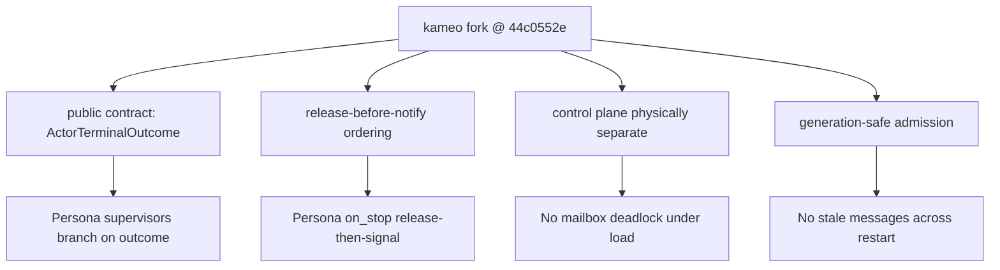

# 206 — Audit of operator/131 Kameo control-plane work

Date: 2026-05-16
Role: designer
Scope: audit of `reports/operator/131-kameo-control-plane-lifecycle-work.md`
and kameo branch `kameo-push-only-lifecycle` commit `44c0552e`
(`actor: split lifecycle control mailbox`) against /204 §6.5.1
+ §6.5.2 + DA/98 §1.1 + §1.2.

## 0. Verdict

**Both HIGH-severity gaps from DA/98 are closed.** Implementation
matches /204 §2 invariant 2 and §6.5.2 spec faithfully. The
control-lane split is real (two physical channels), the
generation guard is correctly placed on all four send paths,
and the receiver's `tokio::select! { biased; ... }` gives
control unambiguous priority.

| /204 spec response | /131 implementation | Verdict |
|---|---|---|
| §2 inv. 2: physical channel separation | `MailboxSenderInner::Bounded { messages: mpsc::Sender, control: mpsc::UnboundedSender }` + `Unbounded` variant | ✓ Match |
| §6.5.1: control plane processed independently of user handler | `tokio::select! { biased; signal = control.recv() => ..., queued = messages.recv() => ... }` | ✓ Match |
| §6.5.2: admission close atomic with capacity acquisition | Generation guard: capture → `reserve().await` → re-check generation → commit | ✓ Match |
| §6.5.2: stale messages cannot cross restart | `accept_queued_message` filters by generation; receiver drops silently | ✓ Match |
| §6.5.2: alternative — generation tokens | Adopted (the third option from /204 was acquire-and-recheck; operator went with the stronger generation-token form) | ✓ Match |

The implementation is, on its load-bearing surface, correct.

**Critical caveat:** the StoreKernel migration is **still not
unblocked.** Operator/131 does not add a test for the supervised
`spawn_in_thread` case. The `persona-mind/src/actors/store/mod.rs:295-307`
deferral comment cannot be removed until that specific test is
written and passes. This was already flagged in `/205` §3.2 and
remains open.

## 1. What I verified in code

### 1.1 Two physical mailbox lanes — confirmed

`src/mailbox.rs:35-115` (the `bounded()` and `unbounded()`
constructors):

```rust
let (tx, rx) = mpsc::channel(buffer);
let (control_tx, control_rx) = mpsc::unbounded_channel();
let admission_open = Arc::new(AtomicBool::new(true));
let message_generation = Arc::new(AtomicU64::new(0));
(MailboxSender { inner: Bounded { messages: tx, control: control_tx }, ... },
 MailboxReceiver { inner: Bounded { messages: rx, control: control_rx }, ... })
```

**Critical observation:** the control lane is `UnboundedSender`
**even when the user requested a bounded mailbox**. This is the
right design — control signals never block on capacity, regardless
of user-mailbox sizing. The user's `bounded(64)` only sizes the
user lane.

### 1.2 Biased receiver — confirmed

`src/mailbox.rs:838-870`:

```rust
pub async fn recv(&mut self) -> Option<Signal<A>> {
    let message_generation = self.message_generation.clone();
    loop {
        let signal = match &mut self.inner {
            MailboxReceiverInner::Bounded { messages, control } => {
                tokio::select! {
                    biased;
                    signal = control.recv() => match signal {
                        Some(signal) => Some(signal),
                        None => messages.recv().await.and_then(...),
                    },
                    queued = messages.recv() => queued.and_then(...),
                }
            }
            ...
        };
        ...
    }
}
```

`biased` makes `select!` check arms in source order. Control is
first. When both lanes have ready messages, control wins. This
is the right semantic for lifecycle signals.

### 1.3 Generation guard — confirmed on all four send paths

`src/mailbox.rs:217-265` (`send`), `src/mailbox.rs:283-326`
(`try_send`), `src/mailbox.rs:343-405` (`send_timeout`), plus
`blocking_send`. Pattern is consistent:

```rust
let generation = self.current_message_generation();
if !self.accepts_message_generation(generation) {
    return Err(...);
}
let permit = match messages.reserve().await {
    Ok(permit) => permit,
    Err(_) => return Err(...),
};
if !self.accepts_message_generation(generation) {
    return Err(...);
}
permit.send(self.queued_message(generation, signal));
```

The double-check is essential: first check rejects sends that
arrive after admission closed; second check rejects sends that
captured an old generation, parked on capacity, then released
their permit when the generation moved on.

`stop_message_admission` at `src/mailbox.rs:655-658`:

```rust
pub(crate) fn stop_message_admission(&self) {
    self.admission_open.store(false, Ordering::Release);
    self.message_generation.fetch_add(1, Ordering::AcqRel);
}
```

Both atomic ops together; `Release` + `AcqRel` ordering gives the
right cross-thread visibility for senders parked on capacity.

### 1.4 Receiver-side stale-message drop — confirmed

`src/mailbox.rs:821-830`:

```rust
fn accept_queued_message(
    message_generation: &AtomicU64,
    queued: QueuedMessage<A>,
) -> Option<Signal<A>> {
    if queued.generation == message_generation.load(Ordering::Acquire) {
        Some(queued.signal)
    } else {
        None
    }
}
```

Stale messages get dequeued (freeing capacity) but return `None`,
so the receiver loop's `if let Some(signal) = ... { return signal; }`
skips them silently. No metric increments for dropped messages —
`record_received_signal` is only called for `Some`.

### 1.5 Restart admission-reopen — confirmed

`src/supervision.rs:701`: `mailbox_tx.open_message_admission();` is
called by the supervisor on restart. This flips
`admission_open` back to true but **does not reset generation** —
the generation counter keeps climbing monotonically. This is the
correct shape: every restart cycle uses a fresh generation,
guaranteeing any straggler sends from a prior generation cannot
reach the new actor instance.

## 2. What is NOT closed by operator/131

### 2.1 (BLOCKER for StoreKernel) Supervised `spawn_in_thread` test still missing

Operator/131 has 8 lifecycle tests:

| # | Test | Source |
|---|---|---|
| 1 | `wait_for_shutdown_returns_after_cleanup_drop_and_notifications` | /130 |
| 2 | `message_admission_stops_before_cleanup_finishes` | /130 |
| 3 | `link_signal_delivers_terminal_outcome_to_actor_hook` | /130 |
| 4 | `control_signals_do_not_wait_for_bounded_user_mailbox_capacity` | **/131** |
| 5 | `pending_bounded_user_send_cannot_cross_closed_admission` | **/131** |
| 6 | `startup_failure_returns_never_allocated_outcome` | /130 |
| 7 | `stop_error_returns_cleanup_failed_outcome` | /130 |
| 8 | `supervisor_restart_waits_for_terminal_outcome_before_replacement_start` | /130 |

Test #8 is the only supervised-restart resource-release witness.
Reading `tests/lifecycle_phases.rs:773-820`, that test spawns the
child via `.spawn().await` — **regular Tokio task**, not
`.spawn_in_thread()`.

The original Persona-blocking bug class is specifically about
supervised `spawn_in_thread`: Kameo signals "child closed" the
moment `notify_links` drops `mailbox_rx`, **before** the actor's
`Self` value is dropped on the dedicated OS thread. The fix
(release-before-notify + state-released witness) should work for
both `.spawn()` and `.spawn_in_thread()`, but until the
`.spawn_in_thread()` case is *falsifiably tested*, the StoreKernel
deferral cannot be safely lifted.

**Required follow-up test** (designer-specified shape):

```rust
#[tokio::test(flavor = "multi_thread", worker_threads = 2)]
async fn supervised_spawn_in_thread_releases_resource_before_supervisor_restart() {
    // Set up: parent supervisor + child that owns TcpListener (or
    // any RAII-OS-resource) AND is supervised via spawn_in_thread.
    //
    // Drive: child enters its message loop, then panics or receives Stop.
    //
    // Prove:
    //   1. Parent's on_link_died receives ActorTerminalOutcome
    //      with state == Dropped.
    //   2. At the moment on_link_died receives that outcome, the
    //      resource is genuinely freed (rebind succeeds).
    //   3. Parent's restart spawns a fresh child that successfully
    //      acquires the same resource on its first attempt.
}
```

This is the Persona-side blocker. Until it passes,
`persona-mind/src/actors/store/mod.rs:295-307` stays as-is.

### 2.2 Other deferrals operator explicitly flagged

Operator/131 §8 lists what's intentionally not in this pass:

| Deferral | Source spec | Severity |
|---|---|---|
| Internal lifecycle facts for test introspection | /204 §2.5 | LOW (test-side feature) |
| `run_to_state_ejection` enum-shaped API | DA/99 §1.1, /204 §1.1 | MEDIUM (no consumer yet) |
| `Killed`/`Brutal` semantic split | /204 §1.1, DA/99 §1.3 | LOW (consistent with current Kameo) |
| `get_shutdown_result()` visibility-boundary test | DA/98 §1.3 | MEDIUM |
| Registry `mark_unfindable` / `release_slot` split | /204 §3.4 | LOW (R1 already closed by admission-stop ordering) |

These are reasonable deferrals. None block StoreKernel migration
*if* the spawn_in_thread test (§2.1) also lands.

### 2.3 `is_alive()` deprecation discipline (DA/98 §1.4) — not addressed

`is_alive()` is still present as a compat alias for
`is_accepting_messages()`. The silent semantic shift (from
"mailbox closed at terminal" → "admission stopped at start of
shutdown") still risks bugs in any caller that hasn't migrated.

**Recommendation:** add `#[deprecated]` to `is_alive()` in a
follow-up pass:

```rust
#[deprecated(
    since = "0.21",
    note = "Compatibility alias for is_accepting_messages(); use is_terminated() for terminal state. \
            Silent semantic shift — see operator/130 + designer/205."
)]
pub fn is_alive(&self) -> bool { self.is_accepting_messages() }
```

This nudges Persona's migration without forcing it.

## 3. Subtle observations

### 3.1 Stronger queue-semantics than the docs claim

Operator/131 §5 corrects the `stop_gracefully` doc from "after
processing all messages currently in its mailbox" to "after the
current in-flight message completes." That's correct as far as
it goes, but the actual behavior is even stronger.

When `Stop` arrives at the receiver:
1. `biased` select picks `Stop` even if user messages are also
   ready.
2. The actor's runtime processes `Stop` → calls
   `stop_message_admission()` → admission_open=false,
   generation++.
3. Receiver continues recv loop; pulls any queued user messages
   off the user lane; `accept_queued_message` filters them by
   generation; they're dropped silently.

So the actual semantic is: **any user message queued before
`Stop` but not yet being-processed is dropped**, not just
"messages sent after admission closes." This is *stronger* than
the doc text "after the current in-flight message completes."

The discrepancy isn't a bug — the stronger semantic is arguably
the right one (Stop should win definitively, not weakly). But
the docs should match. **Recommendation:** update
`stop_gracefully` rustdoc to:

```text
Signals the actor to stop. The current in-flight message
completes; any messages queued before or after the stop signal
will not be processed.
```

### 3.2 Generation-counter monotonicity — clean design

`open_message_admission()` flips the flag but **does not reset**
the generation. This is the right choice — straggler sends from
*any* past generation can never match the current one. If
generation were reset to 0 on restart, a pending send captured at
"generation 0 in prior life" could land in the new generation 0.
The monotonic counter prevents this entirely.

The counter is `u64`. Wraparound after 2^64 restarts is not a
concern.

### 3.3 Starvation analysis — none in realistic traffic

`biased` select gives control unconditional priority. In theory
this can starve the user lane. In practice:
- Control signals are terminal/lifecycle events: `Stop`,
  `StartupFinished`, `LinkDied`, `SupervisorRestart`.
- These are NOT continuous traffic — each fires at most a few
  times in the actor's lifetime.
- User messages are the high-traffic load.

So the high-traffic side is the one losing priority — which is
exactly what we want (lifecycle work always wins over normal
work). No realistic starvation scenario.

### 3.4 Capacity occupied by stale messages is reclaimed lazily

When admission closes mid-shutdown, any user messages already
in the bounded queue stay there until the receiver runs them
through `accept_queued_message` (which returns `None` and drops
them). Until that happens, those slots are unavailable.

For supervised restart this is fine: the parent waits for child
terminal before spawning the replacement, and child terminal
fires after the receiver has drained. By the time the new
generation starts, capacity is empty.

If a restart somehow re-opened admission BEFORE the receiver
drained (which doesn't happen in normal Kameo flows), new
senders could block on stale capacity. Not a concern in
current paths.

### 3.5 The remaining test holes operator/131 identified are real

Operator/131 §8 lists tests not added — particularly
`get_shutdown_result()` visibility boundary. The race window is
small (between `shutdown_result.set(...)` and
`lifecycle.set_terminal_outcome(outcome)` in spawn.rs), but
real. A follow-up should add:

```rust
#[tokio::test]
async fn get_shutdown_result_is_none_until_terminal_outcome_published() {
    // Use slow on_stop to widen the window observably.
    // Until is_terminated() returns true, get_shutdown_result()
    // must also return None.
}
```

The fix per /204 §6.5.4: either delay `shutdown_result.set` to
*after* `lifecycle.set_terminal_outcome`, or gate
`get_shutdown_result()` behind an `is_terminated()` check.

## 4. Implications for Persona

### 4.1 The StoreKernel migration is no longer fork-blocker-bound

Per /205 §3.1, the prior pass had two HIGH gaps that blocked
safe Persona adoption. Both are now closed. **Persona can pin
to operator/131's commit `44c0552e` for new component work
that depends on Kameo lifecycle correctness** — with the
caveat that the `.spawn_in_thread()` specific test (§2.1)
isn't yet a green witness.

For StoreKernel specifically (the original motivating case),
two options:

1. **Path B (recommended, per DA/96 §5.2):** ship the
   single-owner topology against vanilla Kameo 0.20 today.
   `KernelHandleOwner` + store-phase-actor pattern doesn't
   need the kameo fork at all.
2. **Path A on the fork:** wait for the
   `spawn_in_thread`-supervised test, then move StoreKernel
   to `.spawn_in_thread()` on the fork. Slightly later but
   more idiomatic.

Path B remains the production-correct move per /205 §0. The
fork's lifecycle fix is now the right *general* solution; the
single-owner topology is the right *specific* solution for
StoreKernel.

### 4.2 Persona's migration checklist (/205 §4) is still valid

Nothing in /131 changes the migration checklist. The two HIGH
gaps were operational risks; their resolution removes the
"wait for next pass" recommendation. Otherwise unchanged:

- Migrate `is_alive()` callers
- Add `outcome` parameter to `on_link_died` impls
- Adopt outcome-branching supervisor pattern
- Write per-component resource-release witnesses
- Update ARCHs that reference stale phase terms

### 4.3 The compounded effect

After /130 + /131:



Four invariants the kameo fork now provides:
1. Terminal outcome carries path-aware information.
2. Release happens before notification dispatch.
3. Lifecycle dispatch does not compete with user-mailbox capacity.
4. Generation guard prevents straggler message delivery across
   restarts.

Together these are sufficient for production use of
state-owning actors *that follow the single-owner discipline*
(Path B). For actors that genuinely cannot decompose
(framework-internal supervised state), the fork is also
sufficient *once* §2.1's spawn_in_thread test is added.

## 5. Recommended next operator pass

In priority order:

1. **(BLOCKER for StoreKernel Path A)** Add the supervised
   `spawn_in_thread` resource-release witness test per §2.1.
   This is small (one test, ~50 lines) and unlocks the
   destination shape for redb-backed actors.

2. **(SEMANTIC HYGIENE)** Update `stop_gracefully` rustdoc per
   §3.1 to match actual behavior (queued-before-stop messages
   are dropped, not processed).

3. **(MIGRATION HYGIENE)** Add `#[deprecated]` attribute to
   `is_alive()` with note per §2.3. Doesn't break any callers;
   just nudges migration.

4. **(MEDIUM)** Add `get_shutdown_result()` visibility-boundary
   test per §3.5, and choose between the two fix options in
   /204 §6.5.4.

5. **(WHEN A CONSUMER NEEDS IT)** `run_to_state_ejection` with
   the enum-shaped return per /204 §1.1. No consumer in the
   workspace today; can wait.

6. **(WHEN BRUTAL SHUTDOWN IS DESIGNED)** `Shutdown::Brutal`
   variant + `kill()` semantic split per /204 §1.1 + DA/99
   §1.3. Tied to the OTP-shape shutdown-timeout work; also
   no consumer today.

Items 1-3 are small and should land together in the next pass.
Items 4-6 can stage.

## 7. Follow-up findings from DA/102

DA performed a parallel audit at
`reports/designer-assistant/102-audit-operator-131-kameo-control-plane.md`,
ran the lifecycle test suite locally (`8 passed, 0 failed`),
and independently confirmed this report's main conclusions
(control lane is physically real, generation guard correctly
placed, both DA/98 HIGH gaps closed). DA surfaced three
findings I missed:

### 7.1 (MEDIUM) `blocking_recv()` does not mirror async control-lane wake semantics

Per DA/102 §F2: the async `recv()` correctly uses
`tokio::select! { biased; ... }` for control-priority. But
`MailboxReceiver::blocking_recv()` is implemented as:

1. `control.try_recv()` — non-blocking peek
2. If empty: block on `messages.blocking_recv()`

**Failure mode:** if a control signal arrives *after* the
`try_recv()` returned Empty, while no ordinary user message
arrives, the caller is parked on the user-message lane and
will not see the control signal until a user message also
arrives.

**Scope:** the standard actor loop uses async `recv()`, so the
internal runtime is safe — including `spawn_in_thread` (which
uses `Handle::block_on(async_recv)`). The risk is the *public*
`MailboxReceiver::blocking_recv()` primitive: any consumer who
builds a manual blocking loop on a `MailboxReceiver` directly
will have this race.

**Required test:**

```rust
#[tokio::test(flavor = "multi_thread", worker_threads = 2)]
async fn blocking_recv_sees_late_control_signals_without_user_traffic() {
    // Spawn a thread that calls blocking_recv() on a MailboxReceiver
    // with an empty user lane.
    // Send a control signal from the test thread.
    // The blocking thread must wake and observe the control signal
    // within a bounded timeout.
}
```

**Fix options:**
- Rewrite `blocking_recv()` to wake on either lane (use
  `Handle::current().block_on(async_recv())` or a dual-channel
  blocking primitive); OR
- Document `blocking_recv()` as ordinary-message-only and
  explicitly NOT a lifecycle-control primitive; consumers
  who need both lanes use async `recv()`.

### 7.2 (MEDIUM) Queued `ask` discard needs explicit witness

Per DA/102 §F3: §3.1 of this report flagged that queued
ordinary messages are dropped on stop (stronger than docs
claim). The current tests verify this for `tell`-style work
(via the counter). They do *not* verify what happens to
queued `ask` messages — the caller awaits a reply whose
oneshot sender gets dropped when the queued message is
discarded.

Based on `AskRequest`'s design, the caller should observe
`SendError::ActorStopped` once the oneshot is dropped. This
is correct behavior but is undocumented and untested. It is
also a *subtle public semantic*: "send succeeded, reply
failed because stop overtook queued work" is a valid state
consumers need to know about.

**Required test:**

```rust
#[tokio::test]
async fn queued_ask_returns_actor_stopped_when_stop_overtakes_queued_work() {
    // Spawn actor with bounded(1) and a long-running handler.
    // ask() a queued message; capture the pending reply future.
    // stop_gracefully() on the actor (control lane).
    // Release the handler; the actor terminates.
    // Await the pending reply — must be Err(SendError::ActorStopped).
}
```

This should land alongside §5 item 2 (stop_gracefully doc
precision) — the doc text and the test go together.

### 7.3 (LOW-MEDIUM) Public mailbox helper docs need split-lane cleanup

Per DA/102 §F5: `MailboxSender::closed()`, `is_closed()`,
`capacity()`, `strong_count()`, `weak_count()` were written
for a single-channel mailbox. In the split-lane implementation,
they all report the **ordinary message lane only**, not the
control lane.

This is probably the right public shape — user-facing senders
send ordinary messages, so `capacity()` reporting the user
lane is what users mean — but the docs don't say so.
Consumers may mistakenly assume:
- `closed()` means both lanes closed (it means user lane closed)
- `capacity()` says anything about lifecycle traffic (it doesn't)

**Recommended action:** doc-only pass adding "Reports
ordinary-message lane state. Control/lifecycle traffic uses
a separate unbounded lane and is not covered by this method"
to each of the affected methods.

### 7.4 Consolidated next-pass list (replaces §5)

Combining my §5 with DA/102's recommendations, in priority
order:

| # | Item | Source | Priority |
|---|---|---|---|
| 1 | Supervised `spawn_in_thread` exclusive-resource restart test | §2.1 + DA/102 §F1 | **BLOCKER** for StoreKernel Path A |
| 2 | `stop_gracefully` rustdoc precision + queued-`ask` discard test | §3.1 + §7.2 + DA/102 §F3, §F4 | HIGH (semantic documentation correctness) |
| 3 | `blocking_recv()` control-lane wake test + fix-or-document | §7.1 + DA/102 §F2 | MEDIUM (public API correctness) |
| 4 | Public mailbox helper docs split-lane cleanup | §7.3 + DA/102 §F5 | LOW-MEDIUM (doc-only) |
| 5 | `#[deprecated]` attribute on `is_alive()` | §2.3 + DA/102 §F7 | LOW (migration hygiene) |
| 6 | `get_shutdown_result()` visibility-boundary test + gate-or-deprecate | §3.5 + DA/102 §F6 | LOW-MEDIUM |
| 7 | `run_to_state_ejection` enum-shaped API | /204 §1.1 | DEFERRED (no consumer) |
| 8 | `Shutdown::Brutal` variant + `kill()` semantic split | /204 §1.1 | DEFERRED (no consumer) |

Items 1-2 are blockers for safe StoreKernel migration. Items
3-6 can stage. Items 7-8 are documented but await a real
consumer.

## 8. Sources

- `reports/operator/131-kameo-control-plane-lifecycle-work.md`
- `reports/operator/130-kameo-terminal-lifecycle-implementation.md`
- `reports/designer/204-kameo-lifecycle-canonical-design-2026-05-16.md`
  §2 invariant 2, §6.5.1, §6.5.2
- `reports/designer/205-kameo-lifecycle-migration-impact-2026-05-16.md`
  §3.2 supervised spawn_in_thread test still missing
- `reports/designer-assistant/98-review-operator-130-kameo-lifecycle-implementation.md`
  §1.1, §1.2, §1.3, §1.4, §1.5
- `reports/designer-assistant/99-review-current-designer-204-kameo-lifecycle.md`
- `reports/designer-assistant/96-kameo-lifecycle-independent-pov-2026-05-16.md`
  §5.2 — single-owner topology + close-confirm test
- kameo branch `kameo-push-only-lifecycle` commits `1329a646`
  and `44c0552e`
- kameo source at `44c0552e`:
  `src/mailbox.rs:35-115` (constructors), `:217-265` (send),
  `:283-326` (try_send), `:343-405` (send_timeout), `:655-658`
  (stop_message_admission), `:821-830` (accept_queued_message),
  `:838-870` (recv with biased select)
- `src/supervision.rs:701` — restart `open_message_admission`
- `tests/lifecycle_phases.rs:582-738` (the two new /131 tests),
  `:773-820` (supervised restart test using `.spawn()` only)
- `persona-mind/src/actors/store/mod.rs:295-307` — the live
  consumer whose deferral remains
