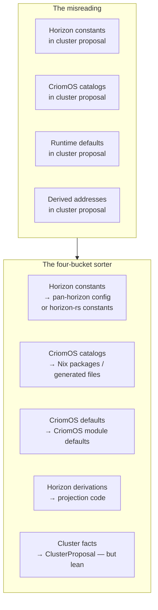

# 207 — horizon-rs boundary audit and lean-down plan

*Designer report responding to the user's 2026-05-17 instruction. Two
inputs frame this: (1) the three peer reports
`reports/system-assistant/18`, `reports/system-assistant/19`,
`reports/system-specialist/133` plus the audit chain back through
`reports/system-specialist/119` and `reports/system-specialist/132`;
(2) a direct read of the code on
`~/wt/github.com/LiGoldragon/horizon-rs/horizon-leaner-shape/` and the
authored datom at
`~/wt/github.com/LiGoldragon/goldragon/horizon-re-engineering/datom.nota`.
The user's framing: agents misread "derive this data into horizon"
as "put it all into cluster data", and `horizon-rs` is now carrying
roughly twice the schema it should.*

> **Status (2026-05-17):** Designer canonical. Names the
> misreading, audits where it landed, prescribes which records leave
> horizon-rs entirely, which collapse, and which stay. Pairs with
> `reports/designer/208-pan-horizon-configuration-brainstorm-2026-05-17.md`,
> which sketches the new input surface (separate from per-cluster
> datom) that some of the leaving records should land on.

## 0 · TL;DR

Two boundary violations are running through every authored value
in `goldragon/datom.nota` and through every "policy" record added
to `proposal/*.rs` in the `horizon-re-engineering` arc:

1. **Horizon facts smuggled as cluster facts.** Values that are
   constant across *every* cluster of this horizon (`"criome"`,
   `"criome.net"`, `tailnet.<cluster>.<internal>`, the router
   SSID, the LAN CIDR shape) are authored per cluster. Cluster
   owners can't meaningfully change them; the per-cluster shape
   is decoration.
2. **CriomOS implementation surfaced as cluster data.** Provider
   catalogs (NordVPN server list, the entire `llm.json` model
   inventory), runtime defaults (AI serving config, DHCP pool
   shape, lease TTL, resolver upstream choices), and derived
   addresses (LAN gateway, dnsmasq listens) are all authored
   per cluster. The cluster owner is now also authoring the
   operating system.

The misreading sits inside the Rust schema as much as inside the
authored datom. Every new "policy" record added in the
`horizon-re-engineering` arc (`LanNetwork`, `ResolverPolicy`,
`AiProvider` with full `AiModel` catalog, `NordvpnProfile` with full
server catalog, `TailnetConfig` with `base_domain`, `RouterInterfaces`
with `Ssid`) reads its doc comment as *"replaces the literals
scattered across CriomOS"* — and the agents took that to mean
*"move the literals into the proposal record"*. The right reading
is *"give the projection the typed shape it needs to **derive** the
values that used to be literals."* That distinction is the entire
report.

Current size: `lib/src/` is **3708 lines** across 30 files. The
boundary-correct shape (§4 below) is **~1500–1700 lines**, under
half. The lean-down deletes whole files (`vpn.rs`, the model-catalog
half of `ai.rs`), collapses others (`network.rs`, `services.rs`,
`router.rs`), and prunes the newtype zoo in `name.rs` / `address.rs`
that exists to validate values that won't be authored anymore.

## 1 · The misreading, traced

The instruction to "derive this data into horizon" had **two**
sound readings and one wrong reading. The agents implemented the
wrong one.

### 1.1 Sound reading A — projection code derives the value

The CriomOS-side literal `10.18.0.0/24` exists because the LAN
subnet has to come from *somewhere*. The right shape: horizon-rs's
projection code computes the subnet from cluster + router identity
(hashing a versioned namespace, picking a `/24` out of a pool the
operator reserves at horizon level) and emits it on the projected
`view::Cluster.lan` or `view::Node.lan_gateway`. Cluster authors
*nothing* about LAN addressing; CriomOS modules read the projected
fields and configure dnsmasq.

The same shape works for the tailnet base domain (`<cluster>.<internal>`),
the router SSID (`<cluster>.<internal>`), per-node DNS names
(`<node>.<cluster>.<internal>`), and the DHCP pool (derived from
the LAN prefix). All of these are *derived* facts. The data
"comes into horizon" as **typed projection code**, not as **typed
authored fields**.

### 1.2 Sound reading B — horizon-level constants

Some values aren't derived from cluster identity — they're
horizon-wide constants. `"criome"` is the internal DNS suffix for
*every* cluster in this operator's horizon. `"criome.net"` is the
public DNS suffix for *every* cluster. These are constants of the
horizon (the operator's deployment of CriomOS), not facts about
any particular cluster.

Their right home is either (a) hard-coded in horizon-rs as a
`HorizonPolicy::CRIOME` constant if the operator never wants to vary
them, or (b) authored in a **pan-horizon configuration file**
that sits alongside per-cluster datoms. The brainstorm in `/208`
works the second option.

### 1.3 The wrong reading — surface every value on `ClusterProposal`

What actually happened: each round of the `horizon-re-engineering`
arc (steps 1–12 in `reports/system-specialist/119`) added a new
field to `ClusterProposal` for whichever CriomOS literal was being
purged. The doc comments are explicit about it:

> `proposal/network.rs:5`: *"Replaces the `10.18.0.0/24` /
> `10.18.0.1` / Cloudflare/Quad9 style literals scattered across
> CriomOS networking modules."*
>
> `proposal/ai.rs:3`: *"Replaces the per-consumer scan that
> derives the inference endpoint from `node.typeIs.largeAiRouter`
> plus the `serverPort` + `models[]` literals in
> `CriomOS-lib/data/largeAI/llm.json`."*
>
> `proposal/vpn.rs:3`: *"Replaces the per-CriomOS
> `data/config/nordvpn/servers-lock.json` file (DNS, client config,
> server catalog with name/hostname/endpoint/publicKey/country/city)."*

"Replaces X" was read as "carry the same shape as X, in a typed
record, on the cluster proposal." The result is that
`goldragon/datom.nota` now carries 6 NordVPN server entries (lines
433–468), 9 AI models with HuggingFace URLs and SHA256s (lines
312–401), an AI serving config with a llama.cpp GPU override
string (line 412), a DNS resolver list (lines 287–290), a LAN
CIDR with DHCP pool and lease TTL (lines 275–279), a tailnet base
domain (line 299), a router SSID (line 120 in `RouterInterfaces`),
plus the two top-level domain suffixes (lines 476, 481). The
cluster owner is authoring the operating system, the package
catalog, and the implementation runtime, with a tiny island of
actual cluster identity surrounded by it.

## 2 · The boundary rule, named

A value belongs in `ClusterProposal` only when the answer to all
three questions is yes:

1. **Variability.** Would another cluster owner using this same
   Horizon author a *different* value here?
2. **Authority.** Is this a fact the cluster operator owns —
   not the horizon operator, not the OS, not a provider?
3. **Non-derivable.** Does the projection genuinely need to be
   *told* this, rather than computing it from already-authored
   data?

A "no" on any of these means the value belongs somewhere else.
The exit ramps:

| Failed question | Right home |
|---|---|
| Not variable across clusters | Pan-horizon config (`/208`) or horizon-rs constant |
| Variable per cluster but not the cluster owner's authority | CriomOS module default or generated catalog |
| Derivable from other authored data | Horizon-rs projection code |

This rule belongs on the ARCH and on the skills file. §5 below
makes that edit explicit.

## 3 · Per-record audit

Every field currently on `ClusterProposal` and every record under
`proposal/*.rs`, with the rule applied. Codes:

- **CL** — cluster fact, keep on `ClusterProposal`.
- **HC** — horizon constant; move to pan-horizon config or
  horizon-rs constant module.
- **HD** — horizon-derived; remove from authored shape, compute
  in projection code, emit on `view::*`.
- **OS-D** — CriomOS implementation default; remove from horizon
  entirely, move to a CriomOS module default.
- **OS-C** — CriomOS catalog / generated data; remove from
  horizon entirely, move to a CriomOS Nix package or generated
  catalog file.

| Field on `ClusterProposal` | Verdict | Why |
|---|---|---|
| `nodes: BTreeMap<NodeName, NodeProposal>` | **CL** | Per-cluster inventory. |
| `users: BTreeMap<UserName, UserProposal>` | **CL** | Per-cluster identity. |
| `domains: BTreeMap<DomainName, DomainProposal>` | **CL** if used | Currently empty `[]` in goldragon — verify it's load-bearing before retaining. |
| `trust: ClusterTrust` | **CL** | Per-cluster trust matrix. |
| `secret_bindings: Vec<ClusterSecretBinding>` | **CL** | Per-cluster secret-backend resolution. Currently empty on goldragon (binding consumers haven't landed) — keep the slot, scope it to what the cluster genuinely owns. |
| `lan: Option<LanNetwork>` | **HD** | CIDR/gateway/DHCP pool/lease TTL all derive from cluster+router identity + horizon LAN pool + CriomOS defaults. See §4.3. |
| `resolver: Option<ResolverPolicy>` | mixed | `upstreams`/`fallbacks` are **OS-D** (CriomOS resolver-provider choice, same for every cluster). `listens` is **HD** (loopback + projected LAN gateway). |
| `tailnet: Option<TailnetConfig>` | mixed | The presence flag is **CL** (does this cluster run a tailnet controller?). The `base_domain` is **HD** (`tailnet.<cluster>.<internal>`). The `tls` field is **CL** (cluster-owned trust material). |
| `ai_providers: Vec<AiProvider>` | mixed | Provider *selection* (`{ name, serving_node, profile }`) is **CL**. `serving_config` runtime defaults are **OS-D**. `models[]` catalog is **OS-C**. `protocol`/`port`/`base_path` are **OS-D** (one CriomOS local-AI shape, same across clusters). |
| `vpn_profiles: Vec<VpnProfile>` | mixed | Provider *selection* with preferences and credentials is **CL**. DNS / client / server catalog are **OS-D** + **OS-C**. |
| `domain: ClusterDomain` | **HC** | `"criome"` is constant across every cluster in this horizon. |
| `public_domain: PublicDomain` | **HC** | `"criome.net"` ditto. |

Records *under* the cluster, applying the same rule:

| Record | Verdict | Notes |
|---|---|---|
| `NodeProposal.{species, size, trust, machine, io, pub_keys, capabilities, services, placement, ip}` | **CL** | All genuine per-node facts. |
| `NodeProposal.services.tailnet_controller: Option<TailnetControllerRole>` | **CL** with collapse | The variant currently carries `{ port }` only (good). The earlier shape had `{ port, base_domain }` — base_domain has already been pulled up to `cluster.tailnet`. Pulling it further out to **HD** finishes the move. |
| `RouterInterfaces.{wan, wlan, wlan_band, wlan_channel, wlan_standard, wpa3_sae_password}` | **CL** | Per-router hardware + secret reference. |
| `RouterInterfaces.country: IsoCountryCode` | **CL** | Regulatory / location fact; varies per router site. |
| `RouterInterfaces.ssid: Ssid` | **HD** | Derives as `<cluster>.<internal-suffix>`. Field + newtype + validation all leave horizon-rs. |
| `UserProposal.*` | **CL** | All genuine per-user facts. |
| `Machine.*`, `Io.*`, `NodePlacement.*`, `NodePubKeys.*`, `YggPubKeyEntry.*` | **CL** | Hardware, filesystem, placement, key material. |
| `AiProvider { name, serving_node, protocol, port, base_path, models, api_key, serving_config }` | **shed** | Collapse to `AiProviderSelection { name, serving_node, profile_ref, credentials_ref }`. Protocol/port/base-path/models/serving_config all leave. |
| `AiModel`, `AiModelServing`, `AiModelShard`, `AiModelMultiShard`, `AiModelFetchurl`, `AiServingConfig`, `AiServingFitMode` | **OS-C** + **OS-D** | Move to a CriomOS Nix package (model catalog) and CriomOS module defaults (serving config). |
| `NordvpnProfile { dns, client, servers, credentials }` | **shed** | Collapse to `VpnProviderSelection { provider, favored_locations, credentials_ref }`. Server catalog and DNS / client defaults all leave. |
| `NordvpnServer`, `VpnDns`, `VpnClient`, `VpnIpAddress`, `VpnClientAddress`, `VpnCountryCode`, `NordvpnServerName`, `WireguardPubKey` (only used inside the catalog) | **OS-C** | Move to a CriomOS catalog package — operator's regen tool emits this, Nix consumes it. |
| `LanNetwork`, `DhcpPool`, `LeasePolicy`, `LanCidr` | **HD** + **OS-D** | LAN identity derives; lease TTL is a CriomOS default. The whole `network.rs` file (119 lines) leaves. |
| `ResolverPolicy { upstreams, fallbacks, listens }` | **OS-D** + **HD** | Upstreams / fallbacks are CriomOS defaults; listens are derived. Whole record leaves. |
| `TailnetConfig { base_domain, tls }` | shrink to `ClusterTailnet { tls }` | base_domain becomes derived. Presence becomes a `bool` or remains an `Option<ClusterTailnet>` carrying only `tls`. |
| `ClusterSecretBinding`, `SecretReference`, `SecretBackend`, `SecretName`, `SecretPurpose` | **CL** | Per-cluster secret-backend resolution. Shape stays. |

The single most load-bearing finding: **the entire `AiModel` /
`NordvpnServer` catalog hierarchies leave horizon-rs.** Those two
moves alone drop ~400 lines of schema, ~200 lines of test fixture,
and the bulk of the type weight on `goldragon/datom.nota`.

## 4 · Lean-down plan — file by file

Numbers are current LOC in `lib/src/`.

### 4.1 Whole files retired

| File | LOC | Reason |
|---|---|---|
| `proposal/vpn.rs` | 217 | NordVPN catalog moves to a CriomOS package; `VpnProviderSelection` collapses to a handful of lines inside `proposal/cluster.rs` or a tiny `proposal/vpn_selection.rs`. |
| `proposal/network.rs` | 119 | LAN derivation moves to projection code (a `lan` module under `view/`). Resolver moves to CriomOS defaults. `LanCidr` / `DhcpPool` / `LeasePolicy` newtypes retire alongside (or move to projection-internal types). |

Estimated retirement: **~330 lines** outright; the projection-side
LAN derivation adds back maybe 60 lines, net **~270 lines**.

### 4.2 Files that collapse significantly

| File | Current LOC | After | Why |
|---|---|---|---|
| `proposal/ai.rs` | 248 | ~50 | Strip `AiModel`, `AiModelServing`, `AiModelShard`, `AiModelMultiShard`, `AiModelFetchurl`, `AiServingConfig`, `AiServingFitMode`. Keep `AiProviderName`, `AiProviderSelection { name, serving_node, profile_ref, credentials_ref }`. Move `AiProtocol` enum to CriomOS-side if only it cares. |
| `proposal/router.rs` | 127 | ~70 | Drop `Ssid` newtype + validation (no SSID is authored anymore). Drop `ssid` field from `RouterInterfaces`. Keep `IsoCountryCode` (regulatory). Keep `wlan_band` / `wlan_channel` / `wlan_standard` enums. |
| `proposal/services.rs` | 119 | ~70 | Collapse `TailnetConfig` to `ClusterTailnet { tls }` or drop it for a `bool`. Drop `base_domain` field and the comment apparatus around it. |
| `proposal/cluster.rs` | 330 | ~160 | Drop `lan`, `resolver`, `ai_providers`, `vpn_profiles`, `domain`, `public_domain` fields. Replace with `vpn_selections: Vec<VpnProviderSelection>` and `ai_providers: Vec<AiProviderSelection>`. Tailnet may stay (depending on §4 above). The projection function drops the corresponding clone-and-pass calls; tailnet validation simplifies. |
| `lib/src/name.rs` | 250 | ~190 | Drop `ClusterDomain`, `PublicDomain` (they're now horizon constants, not authored newtypes). `CriomeDomainName` may retire if the projected `Node.criome_domain_name` is the only consumer (composition lives in the projector, not the newtype). |
| `lib/src/pub_key.rs` | 189 | ~140 | `WireguardPubKey` only earned its place to validate NordVPN server pubkeys. If `proposal/vpn.rs` leaves, `WireguardPubKey` retires (or moves to a CriomOS-side package alongside the catalog). |
| `lib/src/address.rs` | 242 | ~190 | `IpAddress`'s only authored consumers are `LanNetwork.gateway`, `ResolverPolicy.{upstreams, fallbacks, listens}`, and `DhcpPool.{start, end}`. All four go. `IpAddress` may still be useful inside projection code; if not, it retires too. `Interface` stays (`RouterInterfaces.wan/wlan`). |

Estimated collapse: **~600 lines removed**.

### 4.3 What moves to projection code (new, but small)

A new module — call it `view/derived.rs` or fold into
`view/cluster.rs` and `view/node.rs` — owns:

- `derive_lan_prefix(seed, cluster, router) -> IpNet` — hash a
  versioned namespace + cluster + router name into a `/24`
  from a horizon-level LAN pool. Pool comes from `/208`.
- `derive_lan_gateway(prefix) -> IpAddress` — first usable host.
- `derive_dhcp_pool(prefix, policy) -> (IpAddress, IpAddress)` —
  policy from horizon constants (e.g. `.100..=.240`).
- `derive_internal_dns_suffix() -> &'static str` — returns
  `HorizonConstants::INTERNAL_DOMAIN` or pulls from pan-horizon
  config.
- `derive_node_domain(node, cluster) -> String` —
  `<node>.<cluster>.<internal>`.
- `derive_tailnet_base_domain(cluster) -> String` —
  `tailnet.<cluster>.<internal>`.
- `derive_router_ssid(cluster) -> Ssid` — `<cluster>.<internal>`
  (the `Ssid` validation moves *here* if it still earns a place;
  otherwise the projector emits a plain `String`).
- `derive_resolver_listens(lan_gateway) -> Vec<IpAddress>` —
  `[::1, 127.0.0.1, lan_gateway]`.

Estimated add: **~120 lines**.

### 4.4 Test fixtures shrink in sympathy

`lib/tests/horizon.rs` and `lib/tests/proposal.rs` carry inline
NOTA fixtures for clusters with full AI provider trees, full VPN
catalogs, full LAN policy, etc. When the schema shrinks, the
fixtures shrink:

| Test file | Current LOC | Estimated after |
|---|---|---|
| `lib/tests/horizon.rs` | 387 | ~230 |
| `lib/tests/proposal.rs` | 185 | ~140 |
| `lib/tests/user.rs` | 292 | unchanged (per-user is `CL`) |
| New: `lib/tests/derived.rs` | — | ~80 (LAN derivation, SSID derivation, node-domain composition) |

Estimated test delta: **~–230, +80 → ~–150 lines**.

### 4.5 Net total

| Category | Δ LOC |
|---|---|
| Whole files retired | −330 |
| Files collapsing | −600 |
| New derivation module | +120 |
| Test fixtures | −150 |
| **Net** | **−960** |

3708 − 960 ≈ **2750 lines**. That's a 26 % cut, not yet "less
than half" (≤1854 ≈ 50 %). To close the gap, two further passes
are possible — but they're separate from the boundary correction
and need the user's read before landing:

1. **Newtype zoo audit.** `lib/src/name.rs` (250 LOC), `pub_key.rs`
   (189), `address.rs` (242), `species.rs` (155), `magnitude.rs`
   (67), `disk.rs` (81) carry a lot of `impl TryFrom<String>` +
   `impl AsRef<str>` + `impl Display` repetition. A
   `string_newtype!` / `transparent_newtype!` macro family could
   compress each newtype from ~25 lines to ~5. Mechanical cut of
   **~400 lines** if applied throughout.
2. **`view::Node` inline derivation surface.** `view/node.rs` is
   301 lines, much of it boilerplate for the seven derived
   booleans + the viewpoint-fill pattern. A more aggressive
   refactor (per `reports/designer-assistant/101` §6 "What
   stays" → the deferred `Derived` sub-record option) could shave
   **~100 lines**.

With both, 2750 − 500 ≈ **2250**, closer to half. To genuinely
go under half, the schema would also need to lose surface I
*haven't* found a clean home for yet — likely some of `Magnitude`
+ `AtLeast` if a thinner ladder fits, or pulling `Disk` /
`SwapDevice` into a CriomOS-side hardware-config record. Those
are out of scope for this report; flagging the question for the
user.

## 5 · ARCH and skill edits — preventing the next misread

The misreading happened because the existing ARCH and skills don't
name the boundary. The fix: add it explicitly to both surfaces.

### 5.1 `horizon-rs/ARCHITECTURE.md` (both branches)

Add a section at the top of the ARCH, right after the opening
paragraph and before "Status":

> ## What goes in a `ClusterProposal` — the boundary rule
>
> A value belongs in `ClusterProposal` only when **all three**
> answers are yes:
>
> 1. Would another cluster owner author a different value?
> 2. Is the cluster owner the authority on this value (not the
>    horizon operator, not CriomOS, not a provider)?
> 3. Is the value non-derivable from already-authored data?
>
> A "no" on any of these means the value lives somewhere else:
>
> - **Pan-horizon config** (analogous to `datom.nota` but for
>   the operator's whole horizon — top-level domains, LAN pool,
>   reserved subdomain labels). One file per horizon, alongside
>   per-cluster datoms.
> - **Horizon projection code** (in `lib/src/view/`). Derives
>   node domain names, tailnet base domain, LAN prefix, SSID,
>   resolver listens — anything the projection can compute from
>   cluster + horizon facts.
> - **CriomOS module defaults** (in CriomOS Nix). DNS resolver
>   upstreams, DHCP pool shape, AI serving runtime, VPN provider
>   implementation, lease TTLs.
> - **CriomOS catalog packages** (in CriomOS Nix as a regenerable
>   package). The NordVPN server catalog, the AI model catalog
>   (URLs, hashes, descriptors).
>
> The doc-comment phrase "*Replaces the literals scattered across
> CriomOS*" on a new proposal record is a smell. It usually means
> the literals were a CriomOS implementation choice and belong in
> CriomOS, not on the cluster authoring surface. Move the
> *projection* into horizon; leave the *defaults* in CriomOS.

§5.2 below makes the same edit on the workspace skill.

### 5.2 `horizon-rs/skills.md` (both branches)

Add a section after "Field-add discipline" and before "Magnitude
is the size-and-trust ladder":

> ## The four-bucket sorter
>
> Every value the projection needs lives in exactly one of four
> places. Before adding a field to `ClusterProposal` or
> `NodeProposal`, name which bucket the value is in:
>
> | Bucket | Lives in | Examples |
> |---|---|---|
> | Cluster fact | `ClusterProposal` / `NodeProposal` | node names, trust, hardware, secret references, provider selections, regulatory country |
> | Horizon constant | pan-horizon config or `lib/src/horizon_constants.rs` | internal/public DNS suffix, LAN address pool, reserved subdomain labels |
> | Horizon derivation | `lib/src/view/` projection code | node domain, tailnet base domain, LAN prefix, SSID, resolver listen addresses |
> | CriomOS-side | CriomOS Nix (module default or catalog package) | resolver upstream list, AI runtime config, AI model catalog, NordVPN server catalog, DHCP pool shape, lease TTL |
>
> If the value fits more than one bucket, the value is composite
> — split it. Example: an "AI provider" is a cluster *selection*
> (`{ name, node, profile_ref }`) **plus** a CriomOS-side
> *implementation* (the protocol, port, base path, models, serving
> config). The selection authors per cluster; the implementation
> doesn't.
>
> **Smell — moving literals.** When the work is "purge a
> CriomOS-side literal", the *projection* moves to horizon, the
> *literal* moves to CriomOS defaults or a CriomOS package. The
> shape of "add a `ClusterProposal` field that carries the literal"
> is almost always wrong: it makes the cluster owner author the
> operating system.

### 5.3 Files to touch

| File | Action |
|---|---|
| `~/wt/github.com/LiGoldragon/horizon-rs/horizon-leaner-shape/ARCHITECTURE.md` | Add §5.1 text near top (after the opening paragraph). |
| `~/wt/github.com/LiGoldragon/horizon-rs/horizon-leaner-shape/skills.md` | Add §5.2 text after "Field-add discipline". |
| `/git/github.com/LiGoldragon/horizon-rs/ARCHITECTURE.md` (main) | Currently 40 stale lines. Replace with the leaner-shape ARCH + §5.1 — the leaner-shape ARCH is what eventually lands here anyway. |
| `/git/github.com/LiGoldragon/horizon-rs/skills.md` (main) | Mirror §5.2 edit. |
| `~/wt/github.com/LiGoldragon/horizon-rs/horizon-re-engineering/ARCHITECTURE.md` | Lower priority — the branch is being superseded. Annotate only. |

The designer (this report) drafts the ARCH text; the actual edits
land in a follow-up designer commit immediately after this report
goes in. See §7 below.

## 6 · Interaction with the pan-horizon config (`/208`)

Some of the values flagged **HC** in §3 need to land *somewhere*
that the projection can read them. Two options:

- **(a) Hard-code in horizon-rs.** `lib/src/horizon_constants.rs`
  carries `pub const INTERNAL_DOMAIN: &str = "criome";` and
  `pub const PUBLIC_DOMAIN: &str = "criome.net";` etc. Simple;
  changing them is a Rust commit + downstream pin bump.
- **(b) Authored input — pan-horizon config file.** A new NOTA
  file (e.g. `goldragon/horizon.nota`, separate from `datom.nota`)
  carries these as authored values; horizon-rs reads it as a
  second input alongside the cluster proposal.

`/208` works (b) — it's the user's brainstorm direction. The
report sketches what the file would contain, where it lives, and
what's still uncertain. From this report's perspective, either
(a) or (b) closes the **HC** gap; the lean-down works the same
either way. If (b) lands, the field count on `ClusterProposal`
drops further; if (a) lands, two `pub const` entries in
horizon-rs absorb the load.

## 7 · Pickup order

1. **This report lands** (designer/207) — designer canon for the
   boundary.
2. **Pan-horizon config report** (designer/208) — sketch the
   second input surface.
3. **ARCH + skill edits** — designer commits to both
   horizon-leaner-shape and horizon-rs main, per §5.3.
4. **System-specialist Phase F (leaner-shape branch)** —
   *exit-only* changes: drop `lan`, `resolver`, `domain`,
   `public_domain`, `tailnet.base_domain`, `ssid`, `ai_providers`
   model catalog, `vpn_profiles` server catalog from
   `ClusterProposal`. Move corresponding text out of
   `goldragon/datom.nota`. Add minimal projection-side derivations.
   Whole files (`vpn.rs`, `network.rs`) retire.
5. **CriomOS pickup** — CriomOS modules grow defaults for the
   shed values (resolver upstreams, DHCP pool, lease TTL, AI
   runtime). Move NordVPN catalog into a CriomOS Nix package.
   Move AI model catalog into a CriomOS Nix package.
6. **Pan-horizon config wiring** (only if `/208` is approved) —
   add the second input file path to `horizon-cli`, thread the
   constants into projection.

Step 4 is system-specialist's lane. The cut is mechanical once
the boundary is named (this report) and the destination defaults
are agreed (CriomOS sweep). Step 5 is CriomOS work for
system-specialist; step 6 is horizon-rs work for
system-specialist with operator coordination.

## 8 · Open questions for the user

### Q1 — Pan-horizon config: file, or just hard-coded?

`/208` works the case for an authored file. If you'd rather hard-code
the constants in horizon-rs (`HorizonConstants::INTERNAL_DOMAIN`), say
so before the file format is sketched in detail. Defaulting to
the authored-file shape because it composes cleanly if other
horizon-wide values surface later.

### Q2 — Aggressive newtype-zoo cut (§4.5 secondary pass)

To get under half (≤1854 lines), the boundary correction alone
isn't enough. A `string_newtype!` macro family in horizon-rs
would mechanically cut ~400 more lines. Worth landing alongside
the boundary work, or defer? My read: defer — it's a refactor on
top of a refactor, and the boundary work is the load-bearing
correction. Cuts to ~2700 LOC are already a 26 % drop and a
qualitatively much smaller schema.

### Q3 — `IpAddress` newtype — keep, or retire?

After the LAN/resolver records leave, `IpAddress` has no
authored consumer left in `proposal/*.rs`. It may still earn its
place inside projection code if derived addresses want
validation. If you want the cut tighter, `IpAddress` retires and
the projection uses `std::net::IpAddr`. My read: keep if
projection uses it; the type-level discipline is cheap.

### Q4 — `Disk` / `SwapDevice` — cluster or CriomOS?

These look like genuine cluster facts (per-node filesystem
layout) but they have a CriomOS-feel — installer/imager concerns.
If you've been thinking about pushing `Io { keyboard, bootloader,
filesystems, swap_devices }` into a separate "hardware install"
surface, this is the moment to name it. My read: keep on
`NodeProposal` — these *are* per-cluster, per-node, non-derivable
facts.

### Q5 — Replace main-branch ARCH wholesale, or annotate?

The main-branch ARCH is 40 lines and stale (points at retired
`docs/DESIGN.md`, names `lojix-cli` instead of `lojix-daemon`).
The leaner-shape ARCH is 298 lines and current. Options:

- (a) Replace main-branch ARCH with the leaner-shape ARCH today
  (carries the §5.1 boundary text from this report).
- (b) Wait for the leaner-shape branch to merge to main, then it
  lands naturally.

My read: (a). The main-branch ARCH is actively misleading any
reader who lands there today (e.g. wider workspace agents).
Replacing it with the current ARCH + boundary discipline costs
one commit and removes the misleading version.

## 9 · See also

- `reports/system-assistant/19-horizon-constants-not-cluster-data-2026-05-17.md`
  — names the smell category for `domain` / `public_domain` /
  `tailnet.base_domain`. This report extends the audit to every
  field and prescribes the lean-down.
- `reports/system-assistant/18-horizon-leaner-shape-downstream-pickup-2026-05-17.md`
  — the operator-side pickup punch list for Phase A–E. The Phase
  F work in §7 above extends that punch list.
- `reports/system-specialist/133-goldragon-cluster-data-constant-boundary-audit.md`
  — the deep audit of `goldragon/datom.nota` by category. This
  report inherits the four-bucket sorter from /133 and applies
  it back to the Rust schema.
- `reports/system-specialist/132-horizon-domain-constants-not-cluster-data.md`
  — the prescribed fix for the domain/public_domain pair.
- `reports/system-specialist/119-horizon-data-needed-to-purge-criomos-literals.md`
  — the step list that drove the `horizon-re-engineering` arc.
  Steps 4, 6, 7, 8, 11 are the ones whose products this report
  audits as boundary-misplaced.
- `reports/designer-assistant/101-horizon-rs-overbuild-audit-2026-05-16.md`
  — the audit driving `horizon-leaner-shape`. The "what stays"
  /6 split is consistent with this report; this report goes
  further by naming the *cluster-data* category as the load-bearing
  misreading rather than the *view-shadow* category.
- `reports/designer/208-pan-horizon-configuration-brainstorm-2026-05-17.md`
  — sibling report sketching the pan-horizon authored input
  surface.
- `~/wt/github.com/LiGoldragon/horizon-rs/horizon-leaner-shape/`
  — current working branch.
- `~/wt/github.com/LiGoldragon/goldragon/horizon-re-engineering/datom.nota`
  — the authored cluster proposal carrying every value audited
  above.
- `~/primary/ESSENCE.md` §"Perfect specificity at boundaries" —
  upstream of this report's boundary rule.

*End report 207.*
