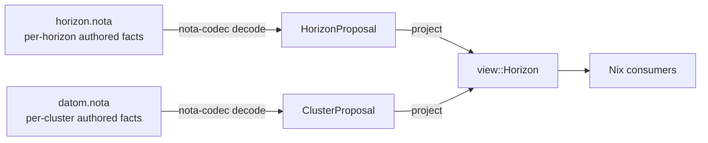

# 208 — Pan-horizon configuration: brainstorm for a second authored input

*Designer brainstorm, paired with `reports/designer/207-horizon-boundary-audit-and-lean-down-plan-2026-05-17.md`.
/207 audited what's wrongly authored on the cluster surface;
this report sketches the **pan-horizon authored input** that
some of the dislodged values should land on. The shape is
the user's idea — "it takes a sort of global configuration that
gives it what the top-level domains are. And maybe some other
things that I can't think of that you can imagine." This
report works it.*

> **Status (2026-05-17):** Designer brainstorm — not yet
> canonical. Lays out the case for a second authored input,
> names the candidates that belong on it, distinguishes those
> from "hard-code in horizon-rs" and "leave in CriomOS"
> alternatives, sketches a worked NOTA shape, and flags open
> questions. Awaiting the user's read before any
> implementation step.

## 0 · TL;DR

A horizon (the operator's deployment of CriomOS) currently has
**one authored input**: the per-cluster `datom.nota`. Some
values are constant across every cluster in a horizon but
authored by the operator (not baked into CriomOS, not derivable):

- the internal DNS suffix (`criome`)
- the public DNS suffix (`criome.net`)
- the IP-address pool the horizon may carve clusters out of
- reserved subdomain labels (`tailnet`, eventually `git`, `mail`, …)
- the horizon-wide signing-key baseline (?)

Today these live in `goldragon/datom.nota` because nowhere else
exists for them. The clean shape is a **second authored input**
— `horizon.nota`, sibling of `datom.nota` — read by horizon-rs
alongside each cluster proposal. The pan-horizon facts go there
once; cluster datoms stop carrying them; horizon-rs's projection
reads both inputs to compute the final view.



The alternative — hard-coding the constants in horizon-rs — also
works for today's shape (LiGoldragon is the only horizon). The
authored-file shape earns its place if (a) more horizons are
plausible, even hypothetically; (b) the operator wants to vary
constants without a Rust change + downstream pin bump; (c)
operator-level facts grow past the two-or-three-constant threshold.

This report doesn't pick — that's the user's call. It works the
shape, names the contents, identifies the boundary against
horizon-rs constants and against CriomOS defaults.

## 1 · The case for a second authored input

### 1.1 Today's two surfaces

The horizon currently has exactly two authored inputs:

- **`goldragon/datom.nota`** — the cluster's proposal. Per-cluster
  facts (nodes, users, trust, selections).
- **The horizon-rs source code** — the schema, the projection,
  some hard-coded constants (the `Magnitude` ladder definition,
  the `NodeSpecies` enum, the `BehavesAs` composition rules).

The gap: there's no surface that carries facts the operator owns
about the *whole horizon*. Today those facts either get
smuggled into cluster data (the misreading audited in /207) or
hard-coded in Rust (`if cluster.domain == "criome"` style — not
present yet but the path of least resistance once `domain` retires
as a per-cluster field).

### 1.2 Three plausible homes for an operator-owned constant

Take `"criome"` as the running example. Three places it could live:

| Home | What it looks like | Cost |
|---|---|---|
| (A) Hard-coded in horizon-rs | `pub const INTERNAL_DOMAIN: &str = "criome";` in `lib/src/horizon_constants.rs` | Cheap. Changing it is a Rust commit + pin bump in every downstream. Single-horizon assumption hard-baked. |
| (B) Authored on a pan-horizon input | `(HorizonProposal (Domains (DomainSuffixes "criome" "criome.net")) …)` in `goldragon/horizon.nota` | Mid-cost. New decode path in horizon-rs; one file to maintain per horizon. Changing it is a NOTA edit (no Rust change). Multi-horizon-ready. |
| (C) Smuggled in cluster data | `(ClusterProposal … "criome" "criome.net")` in every `datom.nota` | Looks cheap; actually expensive (audited in /207). Operator must remember to author the constant per cluster, and the type system can't enforce uniformity. The status quo until this round of cleanup. |

(C) is what's being unwound. The choice is (A) vs (B). Both are
honest; the brainstorm below works (B) so the shape is concrete
if the user picks it. If the user picks (A), the
`horizon_constants.rs` shape is straightforward and the rest of
this report's content turns into Rust constants.

### 1.3 Why (B) is plausible

Three signals that an authored pan-horizon file is the load-bearing
shape:

1. **The operator already authors a NOTA file per cluster.** A
   second NOTA file at the horizon level is a small uplift in
   tooling — same codec, same record-discipline, same review
   discipline. The mental model is consistent.
2. **The set of horizon-wide facts is plural, not singular.**
   §3 below enumerates at least 5 strong candidates, plus
   another 5–8 maybe-candidates. Two `pub const` lines is
   manageable in Rust; ten-plus is not.
3. **Multi-horizon is at least imaginable.** Today there's one
   horizon (LiGoldragon's CriomOS deployment with goldragon as
   the only cluster). The user has mentioned non-LiGoldragon
   deployments hypothetically; a second horizon is "another
   operator runs CriomOS for themselves" — same Rust crate,
   different domains, different LAN pool. If that ever
   materialises, an authored file forks cleanly per operator;
   hard-coded constants don't.

The argument against (B) is "you don't ship multi-tenant CriomOS
and you're not planning to" — fair. The argument for (B) is
"file shape generalises (A) at low cost and makes the boundary
explicit." This report leans (B) but doesn't decide.

## 2 · Existing precedents in the workspace

For shape reference, the workspace already runs two-input
projections in nearby places:

- **`signal-core` channel macros** consume both per-component
  vocabulary (`signal-persona-*` contracts) AND the cross-cutting
  Signal kernel; the projection (the codec) reads both surfaces.
- **`persona` Nix flake** consumes both per-cluster `datom.nota`
  AND CriomOS module defaults; the flake-input pipeline
  composes them.
- **`nota`'s grammar** consumes both per-document type vocabulary
  AND the universal NOTA primitives; the parser reads both.

A horizon-level input file fits the same shape pattern: two
authored layers (horizon + cluster) feeding one typed projection.

## 3 · Candidates for the pan-horizon input

For each candidate: what it is, why it's a horizon fact (not a
cluster fact, not a CriomOS default), and whether it's strong
(definitely belongs) / plausible (worth discussing) / weak
(probably stays elsewhere).

### 3.1 Strong candidates

#### Internal DNS suffix
- **Value today:** `"criome"`
- **Why horizon:** constant across every cluster of this horizon;
  defines the operator's namespace.
- **Used by:** `<node>.<cluster>.<internal>`, `<service>.<cluster>.<internal>`
  (router SSID, tailnet base domain).

#### Public DNS suffix
- **Value today:** `"criome.net"`
- **Why horizon:** constant across every cluster; defines the
  operator's external-facing namespace.
- **Used by:** `<user>@<cluster>.<public>`, matrix IDs, public
  cert SANs.

#### LAN address pool
- **Value today:** implicit (`10.18.0.0/24` per cluster, but
  actually one cluster in this horizon).
- **Why horizon:** the operator picks one RFC1918 supernet
  (`10.18.0.0/16` or `10.0.0.0/8`) and horizon-rs derives
  per-cluster `/24`s from it via hashing. The pool is operator
  policy (which RFC1918 space they reserve) not cluster choice.
- **Used by:** LAN derivation per `/207 §4.3`.

#### Reserved subdomain labels
- **Value today:** implicit (`"tailnet"` is hard-coded in
  `goldragon/datom.nota` as `tailnet.<cluster>.<internal>`).
- **Why horizon:** the set of well-known cluster services
  (tailnet, git, mail, vault, …) and their reserved DNS labels
  is an operator convention. Horizon-rs needs to know "this
  label means a tailnet controller endpoint" to derive correct
  domain names.
- **Used by:** the projection for tailnet base domain, future
  service-base-domain derivations.

#### Horizon name (the operator's identity)
- **Value today:** implicit (the operator is LiGoldragon).
- **Why horizon:** when projections reference "this horizon",
  there's no current name for it. Useful for: telemetry,
  attestation, multi-horizon disambiguation in records that
  travel between horizons (Criome attestations,
  cross-cluster-trust if it ever lands).
- **Used by:** future Criome attestation envelopes, telemetry
  routing.

### 3.2 Plausible candidates

#### Wireguard / Tailscale base prefixes
- **Value today:** clusters carry `5::3/128`-style addresses on
  individual nodes; the prefix is implicit.
- **Why horizon:** the operator probably wants the same IPv6
  ULA / Yggdrasil prefix family across all their clusters.
- **Counter:** if every cluster has its own prefix policy,
  this is per-cluster after all. User read needed.

#### Horizon-wide signing-key baseline
- **Value today:** each `NodeProposal` carries SSH/Nix/WG
  pubkeys; cluster aggregates `trusted_build_pub_keys`. There's
  no horizon-wide "these keys are trusted across every cluster
  in this horizon".
- **Why horizon:** if the operator runs a build farm that's
  shared across clusters, that farm's keys are horizon facts.
- **Counter:** today the trust composition is per-cluster
  (`view::Cluster.trusted_build_pub_keys`). May not earn its
  place at horizon level until cross-cluster operations exist.

#### Default trust ladder definition
- **Value today:** baked in `lib/src/magnitude.rs` (`None < Min
  < Med < Large < Max`).
- **Why horizon:** the operator picks the granularity of their
  trust scale; another horizon might want three points or
  seven.
- **Counter:** changing the ladder is a deep refactor; it
  affects every consumer's switch-on-Magnitude code. Probably
  stays in Rust unless multi-horizon becomes a real driver.

#### Reserved IP space for tailnet / VPN
- **Value today:** clusters carry NordVPN client addresses
  (`10.5.0.2/32`) and tailnet uses Tailscale's CGNAT space
  implicitly.
- **Why horizon:** if multiple clusters in a horizon needed
  non-conflicting VPN client allocations, the horizon would
  carve out per-cluster ranges from a pool.
- **Counter:** NordVPN is per-cluster routing, not horizon
  topology. Skip unless multi-cluster mesh becomes real.

#### Operator-wide trust roots (PKI / Criome)
- **Value today:** none — `ClusterTrust` is per-cluster.
- **Why horizon:** if the operator maintains a horizon root CA
  (for tailnet TLS, for Criome signing), the cert + key
  identity belongs at horizon level.
- **Counter:** today the cluster carries optional `tls` trust
  material on `TailnetConfig`. May elevate to horizon level
  later; not load-bearing now.

### 3.3 Weak candidates (almost certainly stay elsewhere)

#### DNS resolver upstream choice (Cloudflare / Quad9)
- **Stays where:** CriomOS module default. The operator's
  choice of "Cloudflare + Quad9 for upstreams" is a CriomOS
  default that could be overridden per horizon if they
  preferred different resolvers, but it's a runtime/policy
  choice — not a horizon identity fact.

#### DHCP pool shape (`100..240`)
- **Stays where:** CriomOS module default. Implementation
  policy.

#### AI model catalog (URLs, hashes)
- **Stays where:** CriomOS Nix package. Implementation /
  inventory.

#### NordVPN server catalog
- **Stays where:** CriomOS Nix package generated by an
  operator regen tool. Inventory.

#### Lease TTLs, runtime tuning constants
- **Stays where:** CriomOS module defaults.

The pattern across §3.3: these are all *implementation* choices
the operator makes once and rarely changes. They live in CriomOS
because CriomOS owns runtime + implementation; horizon owns
identity + composition. The horizon-rs/CriomOS boundary is the
right one for them.

## 4 · Shape sketch

A worked NOTA example so the shape is concrete.

### 4.1 `goldragon/horizon.nota`

```
;; horizon.nota — pan-horizon authored input for the
;; LiGoldragon horizon. Read by horizon-rs alongside
;; per-cluster datom.nota files.

(HorizonProposal
  ;; ─── operator identity ──────────────────────────────────
  LiGoldragon

  ;; ─── domain suffixes ────────────────────────────────────
  (DomainSuffixes
    "criome"      ;; internal DNS suffix; <node>.<cluster>.<internal>
    "criome.net") ;; public DNS suffix;  <user>@<cluster>.<public>

  ;; ─── LAN supernet the horizon carves clusters out of ────
  (LanPool
    "10.18.0.0/16"  ;; supernet
    24              ;; per-cluster prefix length
    "criome-lan-v1") ;; hashing namespace (versioned)

  ;; ─── reserved subdomain labels ──────────────────────────
  ;; The set of well-known cluster-service slugs. The
  ;; projection composes <slug>.<cluster>.<internal>; cluster
  ;; data names which slugs this cluster runs.
  (ReservedSubdomains
    [tailnet vault git mail])

  ;; ─── horizon-wide trusted keys (placeholder) ────────────
  ;; If/when cross-cluster build trust earns its place. Empty
  ;; until then.
  [])
```

Five top-level fields, four populated today. The fifth
(`HorizonTrustedKeys`) earns its place if/when cross-cluster
operations land.

### 4.2 Schema sketch in `horizon-rs`

```rust
// lib/src/horizon_proposal.rs
#[derive(Debug, Clone, Serialize, Deserialize, NotaRecord)]
#[serde(rename_all = "camelCase")]
pub struct HorizonProposal {
    pub operator: OperatorName,
    pub domain_suffixes: DomainSuffixes,
    pub lan_pool: LanPool,
    pub reserved_subdomains: Vec<ReservedSubdomainLabel>,
    #[serde(default)]
    pub trusted_keys: Vec<HorizonTrustedKey>,
}

#[derive(Debug, Clone, Serialize, Deserialize, NotaRecord)]
#[serde(rename_all = "camelCase")]
pub struct DomainSuffixes {
    pub internal: InternalDomainSuffix,
    pub public:   PublicDomainSuffix,
}

#[derive(Debug, Clone, Serialize, Deserialize, NotaRecord)]
#[serde(rename_all = "camelCase")]
pub struct LanPool {
    pub supernet: LanCidr,
    pub per_cluster_prefix_length: u8,
    pub hash_namespace: String,
}
```

Validation lives in the newtypes (`InternalDomainSuffix` checks
non-empty + DNS-label shape; `LanCidr` already exists; etc.).

### 4.3 Projection wiring

`ClusterProposal::project` grows a horizon argument:

```rust
pub fn project(
    &self,
    horizon: &HorizonProposal,
    viewpoint: &Viewpoint,
) -> Result<view::Horizon> { … }
```

`horizon-cli` reads both inputs:

```sh
horizon project \
  --horizon ~/git/.../goldragon/horizon.nota \
  --cluster ~/git/.../goldragon/datom.nota \
  --node prometheus
```

The Rust constants approach (alternative A from §1.2) doesn't
need this wiring; `ClusterProposal::project(&viewpoint)` keeps
its current signature and reads the constants module directly.

## 5 · What this report doesn't sketch

Three things deliberately left open — needed before any
implementation step, but not yet decided:

1. **Where the file lives.** Options:
   (a) In each operator's cluster-config repo (`goldragon/horizon.nota`)
   alongside `datom.nota`.
   (b) In a dedicated `<operator>-horizon` repo, separate from
   the cluster repo. Worth considering if cluster repos start
   carrying secrets that the horizon config shouldn't see.
   (c) In horizon-rs itself as a default committed file with
   per-operator overrides. Less honest — the constants would
   look like horizon-rs facts, not operator facts.
   Probably (a) for today; revisit if (b) earns its place.
2. **Versioning shape.** Does `HorizonProposal` carry a schema
   version field? Probably not (positional NOTA tail-add
   discipline handles forward compat the same way it does for
   `ClusterProposal`).
3. **Discovery / convention.** How does `horizon-cli` find the
   horizon.nota when given a `--cluster` path? Convention
   (`./horizon.nota` in the parent directory) vs explicit
   `--horizon` flag. Probably both — convention for the common
   case, flag for overrides.

## 6 · Implementation pointer

If the user picks the file shape:

1. **Designer** drafts `HorizonProposal` schema in horizon-rs
   ARCH + skills (extends the §5 edits already prescribed in
   `/207 §5`).
2. **System-specialist** adds `lib/src/horizon_proposal.rs`,
   modifies `ClusterProposal::project` to take a horizon, wires
   `horizon-cli` to read both files. Tests with a real
   `goldragon/horizon.nota` fixture.
3. **System-specialist** writes `goldragon/horizon.nota` with
   the values currently smuggled in `datom.nota`.
4. **System-specialist** in the same Phase F retires those
   smuggled values from `datom.nota` (per `/207 §7` step 4).
5. **Downstream**: `lojix-daemon` and the CriomOS flake input
   pick up the new signature; one cargo update + flake-lock
   bump per consumer.

If the user picks the Rust constants shape:

1. **Designer** drafts the `horizon_constants` module name +
   contents in horizon-rs ARCH + skills (smaller edit).
2. **System-specialist** adds `lib/src/horizon_constants.rs`
   with the two `pub const` entries, threads them through
   projection, retires the corresponding fields from
   `ClusterProposal`.

Either path is straightforward once the boundary work in /207
has landed; this report's job is to put the file-shape option
on the table so the choice is informed.

## 7 · Questions for the user

### Q1 — File or constants?

The load-bearing choice. Brainstorm leans file; constants are
also fine. Pick before /207 Phase F lands.

### Q2 — `LanPool` — earn its place today, or defer?

If you author `(LanPool "10.18.0.0/16" 24 "criome-lan-v1")`
today, horizon-rs's projection can derive per-cluster CIDRs
correctly even though there's only one cluster. The first
write is harmless; deferring it leaves the LAN derivation
hard-coded to `10.18.0.0/24` for `goldragon` and surfaces
multi-cluster as a future schema change.

### Q3 — `ReservedSubdomains` — useful today?

Today the only reserved slug in use is `tailnet`. If you
expect to add `git`, `mail`, `vault` etc. as horizon-known
services that the projection composes domain names for,
authoring the list now keeps the projection consistent. If
you don't, the field stays empty and the projection
hard-codes `"tailnet"`.

### Q4 — `OperatorName` — load-bearing or decorative?

If projections never refer to "this horizon's name", the
field is decoration. If Criome attestations / telemetry /
multi-horizon disambiguation surfaces in the next year, the
field becomes load-bearing. My read: include it as a record
header even if unused — cheap to author, cheap to drop later
if it never finds a consumer.

### Q5 — Anything else?

This report's §3 enumerates candidates I could imagine. The
user's prompt invited additions ("maybe some other things
that I can't think of that you can imagine"). What's *not* in
§3 that you've been thinking about?

## 8 · See also

- `reports/designer/207-horizon-boundary-audit-and-lean-down-plan-2026-05-17.md`
  — sibling report on the cluster-data boundary correction.
  /208 is the destination for the **HC** bucket from /207 §3.
- `reports/system-assistant/19-horizon-constants-not-cluster-data-2026-05-17.md`
  — names the horizon-constant smell category. This report
  works one resolution shape (an authored pan-horizon input).
- `reports/system-specialist/133-goldragon-cluster-data-constant-boundary-audit.md`
  — the audit identifying the values that need to leave
  cluster data. This report is one home for several of them.
- `~/wt/github.com/LiGoldragon/horizon-rs/horizon-leaner-shape/`
  — current working branch. Implementation of either option
  in §6 lands here.
- `~/primary/ESSENCE.md` §"Perfect specificity at boundaries"
  — upstream of the boundary discipline that motivates the
  separation.

*End report 208.*
