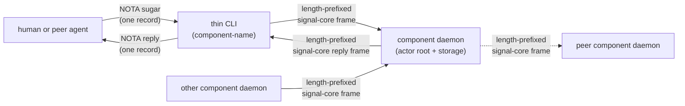

# 209 — Component triad: daemon + CLI + signal-* contract — audit and skill-gap finding

Date: 2026-05-17
Role: designer
Status: audit + finding (no implementation changes; pending user direction
on where the meta-skill lives before any skill edits land)

---

## 0 · TL;DR

The workspace already builds most stateful components as a **triad**: one
long-lived **daemon** that speaks only `signal-core` enveloped traffic, one
thin **CLI** that translates NOTA-sugar into a typed `signal-*` request
frame and prints the reply, and one **`signal-*` contract crate** that owns
the typed wire vocabulary plus the per-variant `SignalVerb` mapping. Each
CLI has exactly one peer: its own daemon. Each daemon's *external surface*
is exclusively signal-core frames.

This pattern is correct, in daily use, and already concretely realized in
`persona-message`, `persona-mind`, `persona-router`, `persona-introspect`,
`criome`, `lojix` (new), and (with documented split) `persona-terminal`.

**The skill-gap is that this triad is nowhere named as a workspace
discipline.** It is restated, in fragments, in every component's
`ARCHITECTURE.md` (and missed in some), and it has to be inferred from
`skills/contract-repo.md` + `skills/micro-components.md` +
`skills/actor-systems.md` together. The "CLI has exactly one peer" rule
is implicit, the "daemon speaks only signal-core externally" rule is
implicit, and the "eventually-obsolete bridge" framing is implicit.

The verb question — *"is every message an Assert?"* — is answered no.
`signal-core` is closed at six roots (`Assert | Mutate | Retract | Match
| Subscribe | Validate`). Even narrow-scope contracts use four or five of
them in one channel (`signal-lojix` uses five today). The CLI's NOTA
surface stays *verb-free* because per-variant verb mapping is the
contract crate's job (via `signal_channel!`). The user's intuition that
"the CLI doesn't always need to say it's an Assert" matches what the
workspace already implements — but the broader claim "messages are
always Asserts" is wrong; even within `persona-message`, `Send` is
`Assert` and `Inbox` is `Match`.

The most important user-attention items live in §9. Read those first.

---

## 1 · The triad — what it actually is



Three load-bearing invariants:

1. **The CLI has exactly one peer — its own daemon.** No CLI is a
   multiplexer; no CLI directly opens another component's database, socket,
   or in-memory state. The CLI is a *text adapter* for one specific
   daemon's contract.

2. **The daemon's external surface is exclusively `signal-core` frames.**
   No `serde_json` socket; no NOTA-on-the-wire; no parallel control
   protocol. NOTA exists at three named projection edges (CLI argv/stdin,
   daemon ↔ harness terminal, audit-log dumps — per
   `skills/contract-repo.md` §"How NOTA fits") but never as the
   inter-component wire.

3. **The verb is declared per-variant in the contract crate, not typed by
   the user.** Each `signal_channel!` request enum variant carries one of
   the six `SignalVerb` roots; the user's NOTA-sugar omits the verb
   keyword because the contract resolves it from the payload type.

The triad is filesystem-enforced at the **repo** level: one daemon + CLI
in `<component>` (typically one Cargo crate with two `[[bin]]` entries),
one contract in `signal-<component>`. The contract crate carries no
runtime, no actors, no `tokio` (per `skills/contract-repo.md`).

### Why the daemon, not the CLI, owns state

A CLI invocation is a short-lived process. It cannot:
- supervise actors,
- own a `redb` handle across requests,
- subscribe to a push event stream,
- hold a slot cursor that increments across operations.

A daemon does all four. The CLI exists because *humans and early agents
need a text bridge into the typed wire*; once peer components speak
Signal directly (which they already do — the introspect daemon queries
the router daemon over `signal-persona-router`), the CLI is no longer
load-bearing for that path. Per `lojix/ARCHITECTURE.md` §"CLI/daemon
boundary": *"Until agents can speak binary Signal directly, the CLI
exists only to translate human/agent text into daemon Signal and daemon
Signal back into text."* This is the eventually-obsolete framing the
user invoked.

---

## 2 · The verb question — is everything an Assert?

No. The closed `SignalVerb` set is six roots (per
`signal-core/src/verb.rs`):

| Verb | When | Read/Write |
|---|---|---|
| `Assert` | append a new typed fact/event/row | write |
| `Mutate` | transition a record at stable identity | write |
| `Retract` | tombstone/remove a typed fact | write |
| `Match` | one-shot pattern/range/key query | read |
| `Subscribe` | initial state + commit-deltas (push) | read+stream |
| `Validate` | dry-run an operation without commit | dry-run |

A CLI's per-variant verb mapping is *contract-crate property*, declared
in the `signal_channel!` macro. The user does not type the verb because
the contract resolves it from the payload type. Two concrete examples:

### 2.1 · `signal-persona-message` — two verbs in one ingress

```
MessageSubmission        -> Assert   ;; `message '(Send designer "hi")'`
StampedMessageSubmission -> Assert   ;; daemon → router internal forward
InboxQuery               -> Match    ;; `message '(Inbox)'`
```

Even within the narrowest "messages" component, the CLI surface has both
write (`Send` → Assert) and read (`Inbox` → Match) variants. The user's
intuition that "messages are always Asserts" holds only for the
outbound-composition subset.

### 2.2 · `signal-lojix` — five verbs in one channel

```rust
signal_channel! {
    channel Lojix {
        request Request {
            Assert    DeploymentSubmission(DeploymentSubmission),
            Mutate    CacheRetentionRequest(CacheRetentionRequest),
            Match     GenerationQuery(GenerationQuery),
            Subscribe DeploymentObservationSubscription(...) opens DeploymentObservationStream,
            Subscribe CacheRetentionObservationSubscription(...) opens CacheRetentionObservationStream,
            Retract   DeploymentObservationRetraction(...),
            Retract   CacheRetentionObservationRetraction(...),
        }
        // ...
    }
}
```

Five of the six verbs (everything except `Validate`) appear in *one*
contract for *one* component. The `lojix` CLI accepts (per
`lojix/ARCHITECTURE.md` C6): *"one Nota request read from argv position
1+ or stdin"*. The user types `(DeploymentSubmission ...)` or
`(GenerationQuery ...)` and the contract knows the verb.

### 2.3 · A richer hypothetical message CLI — verbs you'd see

If `signal-persona-message` grew the full surface a real messaging
component eventually needs, expect:

| Sugar | Underlying payload | Verb |
|---|---|---|
| `(Send recipient body)` | `MessageSubmission` | `Assert` |
| `(Reply to-slot body)` | `MessageSubmission` + `InReplyTo` | `Assert` |
| `(Forward to-slot recipient)` | `MessageSubmission` + `Forwards` | `Assert` |
| `(Inbox)` / `(Inbox by-sender ...)` | `InboxQuery` | `Match` |
| `(Search ...)` | `MessageSearch` | `Match` |
| `(Watch)` | `InboxSubscription` | `Subscribe` |
| `(Recall slot)` | `MessageRecall` | `Retract` |
| `(Validate (Send ...))` (preflight) | wraps another payload | `Validate` |

So the answer to *"would Reply / Forward / Edit / Recall be other
verbs?"* is mostly **no — they're Asserts** (replies and forwards are
new messages with relations to the originals, not transitions of the
originals). But `Recall` is a `Retract`, `Watch` is a `Subscribe`, and
`Search` is a `Match`. Even narrow messaging spans four verbs.

### 2.4 · `Mutate` vs event-sourcing — the open tension

Persona-mind explicitly forbids in-place edits of typed records
(`persona-mind/ARCHITECTURE.md` §9: *"Typed `Thought` and `Relation`
records are immutable; correction is modeled as a new record plus a
relation such as `Supersedes`"*). Under that discipline, *application-
level* writes are nearly always Assert — never Mutate. `Mutate` then
becomes a **kernel-level** primitive (slot rebinding, schema version
updates) that domain contracts rarely use directly.

`signal-lojix` uses `Mutate` for `CacheRetentionRequest` — pin/unpin/
retire of generation IDs. That's mutating *retention policy state* keyed
by `GenerationId`, not mutating the generation itself. It fits the
"transition at stable identity" definition.

Open question (§9 Q4): is `Mutate` a legitimate application-level verb
in this workspace, or should it migrate to a kernel-only primitive over
time?

---

## 3 · Component-by-component audit

Every active Persona / criome / lojix / horizon component and how it
sits relative to the triad. Sourced from each repo's
`ARCHITECTURE.md` (no live code reading — see §7 for what wasn't
verified).

| Component | Daemon binary | CLI binary | Contract crate | Triad fit | Notes |
|---|---|---|---|---|---|
| `persona-message` | `persona-message-daemon` | `message` | `signal-persona-message` | ✅ | Two ingress sockets (`message.sock` owner, `message-ingress/<inst>.sock` per-component). Same `MessageRequest` enum on both. Verbs: `Send→Assert`, `Inbox→Match`. |
| `persona-mind` | (in `mind` binary as `--daemon`) | `mind` | `signal-persona-mind` | ✅ | The canonical worked example for "command-line mind." Many verbs across role-claim/activity/work-graph/subscription requests. |
| `persona-router` | (binary in `src/main.rs`) | (CLI client also `main.rs`) | `signal-persona-router` (+ consumes `signal-persona-message`) | ✅ | Two-socket daemon: `router.sock` (mode 0600, internal Signal traffic only) accepts `signal-persona-message` from `persona-message` and observation queries. CLI sends one NOTA, prints one NOTA. |
| `persona-introspect` | `persona-introspect-daemon` | `introspect` | `signal-persona-introspect` | ✅ | The introspect *daemon* is a Signal-frame **client** of peer daemons (router, terminal, manager). The introspect *CLI* still talks only to the introspect daemon — the multi-peer fan-out is daemon-side. |
| `persona-terminal` | `persona-terminal-daemon` + `persona-terminal-supervisor` | `persona-terminal-signal`, `persona-terminal-send`, `persona-terminal-view`, `persona-terminal-sessions`, `persona-terminal-resolve` | `signal-persona-terminal` | ⚠️ documented exception | Control plane (Signal) follows the triad. Data plane (raw viewer bytes over `data.sock`) is intentionally outside the triad — `terminal-cell` handles it. Multiple CLIs per discipline; see §4. |
| `persona-harness` | `persona-harness-daemon` | (no human-typed CLI) | `signal-persona-harness` | ⚠️ no CLI | The "input" to harness is the wrapped AI harness itself (Codex, Claude, Pi, Fixture). No `harness` text CLI exists or seems planned. The daemon answers `MessageDelivery` from router and exposes `HarnessStatusQuery` / transcript subscriptions over Signal. |
| `criome` | (Kameo runtime in `src/main.rs`) | `criome` | `signal-criome` | ✅ | One NOTA in, one NOTA out at CLI. Contract has 9 request variants (Sign/VerifyAttestation/RegisterIdentity/Revoke/Lookup/AttestArchive/AttestChannelGrant/AttestAuthorization/SubscribeIdentityUpdates). ⚠️ ARCH doesn't yet show the per-variant `SignalVerb` mapping table — gap §7. |
| `lojix` (new, `horizon-leaner-shape`) | `lojix-daemon` | `lojix` | `signal-lojix` | ✅ | The cleanest exemplar. C24 explicitly: *"the CLI still has exactly one peer."* Five verbs declared in one channel. |
| `horizon-rs` | none | `horizon-cli` | none | ❌ projection library | Pure cluster-proposal projection library + ad-hoc CLI. No daemon, no Signal contract, no durable state. The downstream `lojix-daemon` *uses* `horizon-rs` as a library. See §4 — legitimate non-triad pattern for stateless projections. |
| `sema-engine` | none | none | none | ❌ library | Library only. Used by `persona-mind`, `lojix-daemon`, `persona-introspect`. |
| `sema` | none | none | none | ❌ kernel | Library only. Sub-kernel of `sema-engine`. |
| `signal-core` | none | none | itself | ❌ kernel | Library only. Wire kernel for every triad. |
| `terminal-cell` | `terminal-cell-daemon`-shape | (CLI helpers exist, control-plane only) | (internal) | ⚠️ primitive | Lower than the Persona-component layer. Owned by `persona-terminal`. |

### Pattern fit summary

- **Clean triad** (7): `persona-message`, `persona-mind`, `persona-router`,
  `persona-introspect`, `criome`, `lojix`, and `signal-lojix`'s consumer.
- **Documented exception** (1): `persona-terminal` (control plane in the
  triad; data plane separate).
- **CLI-less** (1): `persona-harness` (the "user input" surface is the AI
  harness; no human-typed CLI).
- **Pure libraries** (4): `signal-core`, `sema`, `sema-engine`,
  `horizon-rs` — no daemon, no triad.
- **Primitive consumed by a triad** (1): `terminal-cell`.

---

## 4 · Pattern variations — what's legitimate, what's a smell

### 4.1 · Pure libraries don't need a daemon

`signal-core`, `sema`, `sema-engine`, and `horizon-rs` are *stateless
projection / kernel libraries*. They have:
- no durable state to own across calls,
- no actor system to supervise,
- no subscribers to push events to,
- no boundary that crosses a process.

A daemon for any of these would be ceremony with no payload. They are
*consumed by* daemons (e.g. `persona-mind` uses `sema-engine`,
`lojix-daemon` uses `horizon-rs`). The triad does not apply.

The `horizon-cli` exists for *ad-hoc projection testing*, not as a CLI
in the triad sense — it reads stdin, runs the library, prints output,
exits.

### 4.2 · Data-plane / control-plane split — `persona-terminal`

Terminal byte transport has a hot path (raw bytes, kilobytes per
keystroke if pasted) that **cannot afford Signal framing per frame**.
The `persona-terminal` ARCH documents this carefully: control plane goes
through the triad (typed `signal-persona-terminal` frames over
`control.sock`); data plane goes viewer ↔ `terminal-cell` data.sock`
directly as raw bytes.

This is a legitimate exception. The generalized rule (which the meta-
skill should state): *when a component has a high-bandwidth data path
that cannot afford Signal framing, the data plane lives outside the
triad as a named exception. The control plane still follows the triad.*

This rule fits potential future components (video, audio, file streams)
without inviting drift on every component.

### 4.3 · Multiple CLIs per component — `persona-terminal`'s five

`persona-terminal` ships **five CLI binaries** (`-signal`, `-send`,
`-view`, `-sessions`, `-resolve`) plus two daemons. Some are
control-plane Signal clients (`-signal`, `-sessions`, `-resolve`); two
are data-plane attachers (`-view`, `-send`).

This is partly the data/control split (4.2) and partly an ergonomic
split — different verbs need different argv shapes. Worth surfacing as
§9 Q2: should the discipline be **one CLI per daemon** (which would
collapse `-sessions`, `-resolve`, `-signal` into one), or is the
multiple-CLI shape legitimate when each CLI is single-purpose?

The default position from the rest of the workspace points to **one
CLI per daemon, single-NOTA-in / single-NOTA-out**: `message`, `mind`,
`introspect`, `criome`, `lojix` all hold this shape, and the
single-CLI ergonomic is part of why "one NOTA in, one NOTA out"
generalizes cleanly.

### 4.4 · No human CLI — `persona-harness`

`persona-harness` has no human-typed CLI binary because the "input"
to a harness IS the AI harness itself (Codex, Claude, etc.) typing
through its terminal. The Signal contract is consumed by
`persona-router` (delivery) and `persona-introspect` (observation),
not by a human at a shell.

Worth confirming as §9 Q5: this is an intentional pattern variant
("the harness's role-mate is the wrapped agent, not a human"), or a
gap (a `harness` debugging CLI should exist for testing readiness
queries, transcript subscriptions, etc., even if production agents
never use it).

### 4.5 · Daemon-as-peer-client — `persona-introspect`

The introspect *daemon* opens client connections to **other components'
daemons** (`RouterClient`, `TerminalClient`, `ManagerClient`) over
those daemons' contracts. This is not a violation of "CLI talks only
to its daemon" — the introspect **CLI** still talks only to the
introspect daemon. The fan-out is daemon-side.

This is the right shape and worth stating as a corollary rule: *a
daemon may be a Signal client of any number of peer daemons (subject
to those daemons' contracts); a CLI may not.* The CLI's "one peer
only" constraint preserves the bridge framing — the CLI is a thin
text adapter for ONE daemon, not a workspace-wide multiplexer.

### 4.6 · CLI emits NOTA sugar; contract crate emits canonical typed
records

`message '(Send designer "hi")'` is sugar for what the daemon parses
as a `MessageSubmission { recipient: MessageRecipient("designer"),
body: MessageBody("hi") }` payload of an Assert operation. The CLI's
NOTA codec resolves `(Send ...)` → `MessageSubmission { ... }` via
the contract crate's typed parse (per `signal-persona-message`'s
`signal_channel!` declaration and `NotaDecode` derives).

The CLI can *also* desugar richer sugar — `(Reply 47 "thanks")`
could produce a `MessageSubmission` with `body: "thanks"`,
`recipient` resolved from the inbox slot 47, and an `InReplyTo(47)`
field. The desugaring lives in the CLI's text projection layer; the
typed signal request the daemon sees is the canonical fuller form.

The contract crate's job: **the typed canonical form + the verb
mapping**. The CLI's job: **NOTA sugar that desugars to the canonical
form**.

---

## 5 · Skill-gap finding

The triad pattern is **load-bearing workspace architecture**, but
nowhere in `skills/` is it named as such. The pattern has to be
reconstructed from three skills plus the ESSENCE that don't
individually carry it:

- `skills/contract-repo.md` covers the *wire side* (Signal as the
  database-operation language, frame mechanics, verb spine) and
  briefly tabulates the boundary surfaces (CLI ↔ daemon via NOTA on
  argv/stdin), but is scoped to *what's in a contract crate* — not
  to *the component shape that consumes one*.
- `skills/micro-components.md` covers *one capability, one crate, one
  repo* and the LLM-context-window argument — but never names the
  daemon + CLI + contract triad as the workspace's preferred shape
  for *stateful* capabilities.
- `skills/actor-systems.md` covers *runtime roots are actors* and
  the supervisor topology a daemon needs — but treats the daemon as
  a single artifact, not as one corner of a triad.
- `orchestrate/AGENTS.md` describes the "Command-line mind target"
  for `persona-mind` specifically, but that section reads as a
  per-component plan, not as the universal contract every
  component follows.

### Symptoms of the gap

1. **Every component's `ARCHITECTURE.md` restates the invariants in
   slightly different words.** "The CLI accepts exactly one NOTA
   input record and prints exactly one NOTA reply record" appears
   verbatim or near-verbatim in `persona-message`, `persona-mind`,
   `persona-router`, `criome`, `lojix`. This is the duplication
   ESSENCE §"Efficiency of instruction" warns against — find the
   canonical home, trim the others.

2. **The "CLI talks only to its daemon" rule is never named.** It is
   *practiced* in every component but stated as a discipline nowhere.
   `lojix/ARCHITECTURE.md` C24 comes closest: *"The CLI still has
   exactly one peer."* That's a one-component statement; it should be
   a workspace-wide one.

3. **The "daemon speaks only signal-core externally" rule is also
   implicit.** It's enforced via tests in some components
   (`persona-message`'s `message-frame-codec-rejects-mismatched-signal-verb`
   constraint, etc.) but never stated as a universal rule.

4. **The eventually-obsolete-bridge framing is missing.** Without it,
   future agents may treat the CLI as durable surface and grow rich
   CLI-side logic. The framing — *the CLI is a translator that
   retires when peer agents speak Signal directly* — keeps CLI-side
   logic minimal.

5. **`signal-criome`'s contract has no documented `signal_verb()`
   mapping table.** Other contracts (`signal-persona-message`,
   `signal-lojix`) do. Without the meta-skill, this is the kind of
   uniform discipline that drifts repo-by-repo.

### Where the meta-skill should live

Three options, in order of my preference:

1. **A new workspace skill `skills/component-triad.md`** (or
   `skills/cli-daemon-contract.md`) holding the load-bearing
   discipline in one place. Each component's `ARCHITECTURE.md`
   then cites it once and only states component-specific carve-
   outs.

2. **A substantial new section in `skills/micro-components.md`**
   titled *"Stateful components are triads"* — keeps file count down
   but blurs the scope (micro-components is currently scope-neutral;
   adding the triad pattern makes it Persona-shaped, even though the
   rule generalizes).

3. **A new repository** for the meta-architecture pattern (per the
   user's "maybe this deserves its own repository" prompt). Probably
   **overkill**: a workspace skill is the right level (per ESSENCE
   §"Rules find their level" — *"In this workspace"* → workspace
   skill, not its own repo). A repo earns its place when there's
   *something to compile / test* there; a discipline statement that
   no compiler reads is a skill, not a repo.

My recommendation is (1). User-decision §9 Q1 confirms the choice
before any skill lands.

### What the meta-skill should say (sketch)

If approved, the new skill would cover:

- **The shape.** Daemon (long-lived, actor-rooted, owns `*.redb`) +
  thin CLI (one NOTA in, one NOTA out, exactly one peer: the daemon)
  + `signal-*` contract crate (typed records, `signal_channel!`
  declaration, per-variant `SignalVerb` mapping). Mermaid diagram of
  the boundaries.

- **Three load-bearing invariants** (named verbatim, each with a
  witness-test shape):
  - I1: the CLI has exactly one Signal peer.
  - I2: the daemon's external surface is exclusively `signal-core`
    frames (NOTA never on the wire between components).
  - I3: every per-channel request variant declares its `SignalVerb`
    in the `signal_channel!` macro; the CLI's NOTA sugar omits the
    verb because the contract resolves it.

- **The verb question, answered once.** Six roots; not all messages
  are Asserts; the per-variant mapping is contract-crate property.
  Cross-reference to `signal-core/ARCHITECTURE.md` and
  `skills/contract-repo.md` §"Signal is the database language".

- **The CLI is a bridge that eventually obsoletes.** Once peer
  daemons / agents speak Signal directly, the CLI is a debug /
  bootstrap / human-edge convenience. Keep CLI-side logic thin
  accordingly.

- **Named carve-outs** (with conditions, not blanket allowances):
  - Pure libraries don't need a daemon.
  - Data-plane bytes that can't afford framing live outside the
    triad as a named exception; the control plane still follows it.
  - Daemons may be peer-clients of any number of other daemons;
    CLIs may not.

- **Witness tests** (per `skills/architectural-truth-tests.md`):
  - `<component>-cli-accepts-one-nota-record-and-prints-one-nota-reply`
  - `<component>-cli-has-exactly-one-signal-peer`
  - `<component>-daemon-rejects-non-signal-traffic-on-its-socket`
  - `<component>-signal-verb-mapping-covers-every-request-variant`

- **Cross-references** to: `skills/contract-repo.md`,
  `skills/micro-components.md`, `skills/actor-systems.md`,
  `skills/push-not-pull.md`, `signal-core/ARCHITECTURE.md`.

---

## 6 · What this audit also surfaced (smaller findings)

- **`signal-criome` per-variant verb mapping is undocumented in the
  current ARCH** (criome §4 lists request variants but no
  Variant→Verb table). Drift risk; one of the witness tests above
  would catch it.

- **`persona-router`'s CLI binary** is structurally a "one NOTA in,
  one NOTA out" client but is named inconsistently with the
  single-word convention used by `message`, `mind`, `introspect`,
  `criome`, `lojix`. The router CLI appears to share `main.rs` with
  the daemon. Worth a binary-naming sweep (§9 Q3).

- **`persona-mind` CLI naming.** The daemon and CLI both live in the
  same binary (`mind --daemon` vs `mind '(...)'`). This is one
  legitimate pattern but distinct from `lojix`'s "one crate, two
  binaries: `lojix-daemon` + `lojix`" pattern. The meta-skill should
  name *both* patterns and when to choose which.

- **Coordination note.** `orchestrate/system-specialist.lock`
  currently shows: *"align CLI daemon horizon boundary"* on
  `horizon-rs/horizon-leaner-shape/ARCHITECTURE.md`,
  `lojix/horizon-leaner-shape/ARCHITECTURE.md`, and
  `signal-lojix/horizon-leaner-shape/ARCHITECTURE.md`. System-
  specialist is doing the *implementation-side* alignment for the
  same pattern this report names as workspace-wide. The two arcs are
  complementary: SS aligns the lojix triad against current code; this
  report names the discipline so the same alignment becomes a
  workspace constraint, not a one-arc cleanup.

---

## 7 · What this audit did NOT investigate

Honest scope limits, so the user can decide whether to extend the
audit before approving the skill:

1. **Per-variant `signal_verb()` mappings in source.** I read each
   contract crate's `ARCHITECTURE.md` and (for `signal-core`) its
   `request.rs`. I did **not** read each `signal-persona-*` /
   `signal-criome` crate's actual `lib.rs` to verify the
   `signal_channel!` declarations match the ARCH narrative. The
   meta-skill landing should be followed by a one-pass audit per
   contract crate to confirm.

2. **The horizon-leaner-shape lojix code itself.** I read
   `lojix/horizon-leaner-shape/ARCHITECTURE.md` and
   `signal-lojix/horizon-leaner-shape/ARCHITECTURE.md` (read-only —
   `system-specialist` has those ARCH files under their lock). I did
   not read the Rust source under either worktree. The ARCH text is
   the closest-to-truth I worked from.

3. **`persona-terminal` byte-tag CLI protocol on `control.sock`.**
   The ARCH says control.sock carries "the byte-tag CLI protocol and
   Signal frames" — implying there's a non-Signal byte-tag protocol
   on the control socket *as well as* Signal frames. That's a
   potential I2 (daemon external surface exclusively Signal)
   violation. I didn't dig into what the byte-tag protocol is or
   whether it should migrate to Signal frames.

4. **`forge`, `arca`, `chronos`, `chroma`, `prism`.** All listed
   in `RECENT-REPOSITORIES.md` or `protocols/active-repositories.md`
   as adjacent or future work. I did not audit them. The meta-skill
   should be drafted with these in mind without overcommitting to
   their specific shapes.

5. **`terminal-cell`'s own daemon/CLI shape.** I read
   `persona-terminal`'s description of it but not
   `terminal-cell/ARCHITECTURE.md` itself.

6. **The actual deferral status of the horizon-rs CLI in the
   lean rewrite.** The new `lojix-daemon` uses `horizon-rs` as a
   library; the existing `horizon-cli` is mostly stranded. Worth
   flagging whether the lean rewrite retires `horizon-cli` as part
   of cutover.

---

## 8 · What I'm not clear about

Questions that bear on the design but aren't decisive enough for me
to answer without the user:

- Q-A: How literal was the "this might deserve its own repository"
  prompt? If the meta-skill is the right substance but a workspace
  skill is the right level (my read), there is no repo to make.
  Want to confirm.

- Q-B: Whether `Mutate` is genuinely application-level or whether the
  event-sourcing discipline (`Supersedes` relations, append-only
  events) reduces application-level Mutate to near-zero use. The
  honest answer affects how prominent `Mutate` should be in the
  meta-skill's verb table.

- Q-C: Whether `persona-terminal`'s five-CLI shape and `persona-
  harness`'s no-CLI shape are documented exceptions or hidden gaps.
  Either answer is fine, but the meta-skill should state which.

- Q-D: Whether the CLI binary naming convention is **"single noun =
  component"** (`message`, `mind`, `introspect`, `criome`, `lojix`)
  or whether legacy compound names (`persona-terminal-signal`,
  `persona-terminal-send`) are also legitimate. The single-noun shape
  is cleaner; the meta-skill could state it as the default with a
  carve-out for components that legitimately need multiple CLIs.

---

## 9 · Questions for the user (the most important ones)

These are the questions whose answers shape both the meta-skill draft
and any follow-up audit. Order is roughly "most blocking" first.

### Q1 — Where does the meta-skill live?

Three candidates: a new `skills/component-triad.md` (workspace
skill), a new section in `skills/micro-components.md`, or a new
repository.

**My recommendation:** new workspace skill (`skills/component-triad.md`
or similar name). Reason: the discipline applies workspace-wide; a
section in micro-components blurs scope; a new repository has nothing
to compile so it earns no boundary by `skills/micro-components.md`'s
own rule.

### Q2 — Is "one CLI per daemon" a discipline, or is multi-CLI legitimate?

`persona-terminal` has five CLIs against two daemons. The single-CLI
pattern (`message`, `mind`, `introspect`, `criome`, `lojix`) is the
canonical shape elsewhere. The meta-skill needs to say *one of these*:
(a) one CLI per daemon, multi-CLI is a smell to flatten; (b) one CLI
per daemon as default, with named carve-outs (e.g., dataplane
attachers in `persona-terminal`); (c) multi-CLI is fine.

**My recommendation:** (b) — one CLI per daemon as the default, with
carve-outs limited to (i) data-plane attachers that don't speak
Signal at all, and (ii) read-only inspection CLIs that exist
temporarily until the single CLI grows the corresponding subcommand.
This keeps the discipline taut without forcing `persona-terminal` to
rename in this pass.

### Q3 — `Mutate` at the application level vs kernel-only?

Given persona-mind's event-sourcing discipline (immutable `Thought` /
`Relation`, correction via `Supersedes`), is application-level
`Mutate` a legitimate verb or should it be reserved for kernel
infrastructure? `signal-lojix` uses `Mutate` for `CacheRetentionRequest`
(pin/unpin/retire of generation IDs) — that's transitioning a state
record at stable identity; fits the verb's definition.

**My read:** legitimate at the application level when the noun being
transitioned is **state** (retention policy, schema version,
subscription parameters) rather than **observed fact** (a thought, a
message, an event). The meta-skill could name the distinction
explicitly.

### Q4 — Does `persona-harness` get a debugging CLI?

It has none today. Without one, there's no out-of-band way to
manually query a harness daemon for status, transcript subscriptions,
etc. — every interaction comes from router (delivery) or introspect
(observation).

**My read:** a thin `harness` CLI would be useful for the same reasons
every other component has one (bootstrap, debug, early use). Worth
filing as a follow-up; not urgent.

### Q5 — Is the CLI's verb-free NOTA-sugar confirmed as workspace
direction?

The existing examples already do this: the user types `(Send ...)` or
`(Inbox)`, not `(Assert (Send ...))` or `(Match (Inbox))`. Each
variant's verb is declared in the `signal_channel!` macro. Confirm
this is *the* discipline (vs. some future where CLI users type the
verb explicitly).

**My read:** yes, verb-free CLI sugar is the right direction — the
verb is fully determined by the payload type, so requiring the user
to type it is ceremony. The contract crate carries the mapping; the
CLI hides it. Confirm.

### Q6 — Is the audit's scope (§7) the right depth, or should I
extend it before drafting the meta-skill?

I read every active component's ARCH but did not read every
contract crate's source nor every component's tests. If you want the
meta-skill grounded in code-level verification before it lands, this
should be a follow-up audit (designer-assistant lane is a natural
fit). If the ARCH-level audit is enough to justify drafting, I can
proceed.

**My read:** the ARCH-level audit is enough to draft. The deeper
audit becomes useful once the meta-skill exists and we want to file
component-by-component witnesses against it.

---

## 10 · See also

- `~/primary/ESSENCE.md` §"Micro-components" (the one-capability-one-
  crate-one-repo rule the triad applies on top of).
- `~/primary/skills/contract-repo.md` §"Signal is the database
  language" (the verb spine; the source of truth for the six roots).
- `~/primary/skills/contract-repo.md` §"How NOTA fits" (the boundary
  table for where NOTA rendering happens).
- `~/primary/skills/micro-components.md` (the file-system-enforced
  per-capability boundary).
- `~/primary/skills/actor-systems.md` §"Runtime roots are actors"
  (the daemon's actor-root shape).
- `~/primary/skills/push-not-pull.md` (subscriptions, not polling).
- `~/primary/orchestrate/AGENTS.md` §"Command-line mind target"
  (the per-component sketch that should generalize via the meta-
  skill).
- `~/primary/protocols/active-repositories.md` (the inventory the
  audit walked).
- `/git/github.com/LiGoldragon/signal-core/ARCHITECTURE.md` (the
  wire kernel that every triad's contract sits on).
- `/git/github.com/LiGoldragon/signal-lojix/ARCHITECTURE.md` (the
  cleanest contract example, with all five verbs declared).
- `/git/github.com/LiGoldragon/persona-message/ARCHITECTURE.md` (the
  first-stack worked example).
- `/git/github.com/LiGoldragon/persona-mind/ARCHITECTURE.md` (the
  "command-line mind" worked example).
- This report's coordination: `orchestrate/system-specialist.lock`
  currently shows SS aligning the same pattern on the horizon-leaner-
  shape `lojix` / `signal-lojix` / `horizon-rs` ARCH files. Designer
  has not edited those files in this pass.
