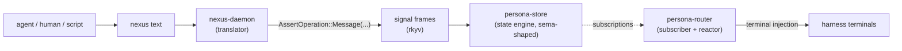
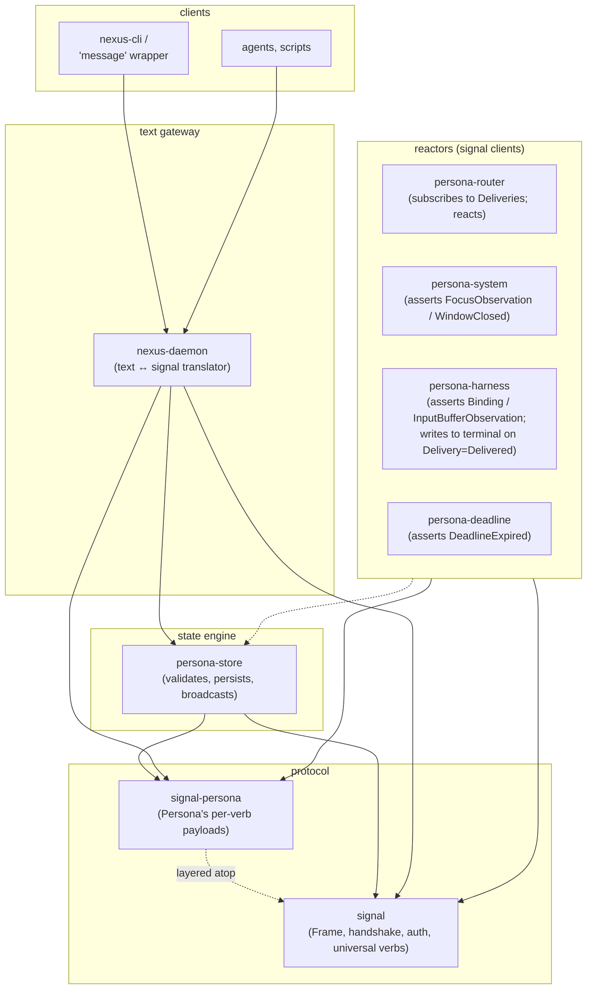
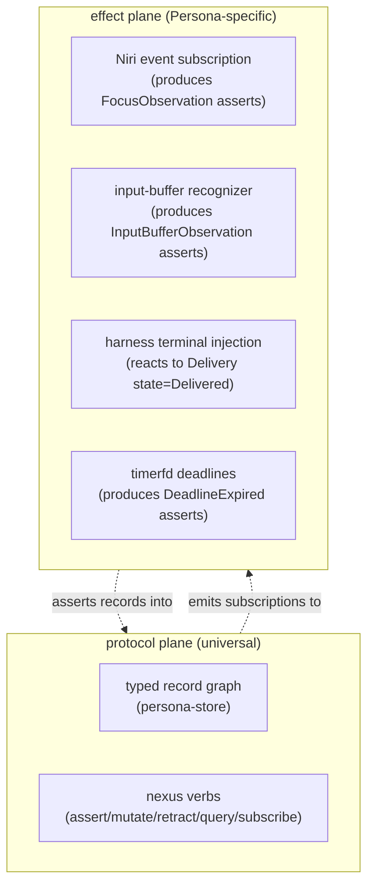
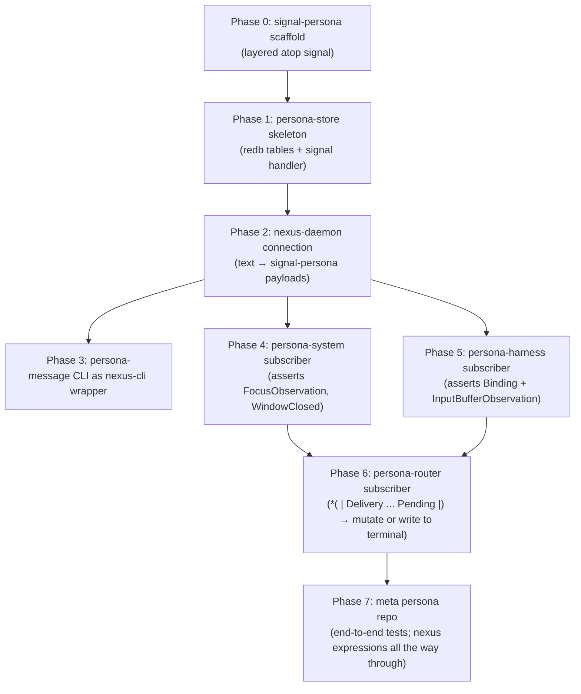

# Persona on nexus — dropping the invented protocol

Status: proposal
Author: Claude (designer)

This report drops the Persona-specific message protocol I proposed
in earlier reports and re-roots Persona on **nexus + signal**, the
protocol stack already running for the sema-ecosystem. The user's
direction was specific: read nexus deeply enough to understand its
spirit, then check whether Persona can use it before continuing to
invent.

The conclusion: **yes, completely.** Persona's "verbs" — Send,
Deliver, Defer, Discharge, Subscribe, etc. — are not actually new
verbs. They are patterns of *assert / mutate / retract / query /
subscribe* against a record graph. nexus already provides the
universal shape for that. Persona's contribution is the **set of
typed record kinds** (Message, Delivery, Binding, FocusObservation,
…), not new wire protocol.

This shrinks the surface area Persona has to invent by an order
of magnitude and aligns with the explicit destination: convergence
with criome.

---

## 0 · TL;DR



Three commitments:

1. **Persona uses nexus as its message protocol.** No
   Persona-specific verbs. The verbs are nexus's: assert /
   mutate / retract / validate / query / subscribe /
   atomic-batch.
2. **`signal-persona` owns *record kinds*, not verbs.** It is a
   layered effect crate atop signal that carries
   `PersonaAssert` / `PersonaMutate` / `PersonaRetract` /
   `PersonaQuery` / `PersonaRecords` per-verb payloads filled
   with Persona's record kinds (Message, Delivery, Binding, …).
   It re-uses signal's Frame, handshake, and auth.
3. **`persona-store` is sema-shaped for Persona's domain.** It
   validates, persists in redb + rkyv, and broadcasts
   subscriptions. Same actor pattern as criome, scoped to
   Persona's records.

---

## 1 · The spirit of nexus, and why it matters here

Nexus is unusual. It is not a config format, not a query DSL, not
a message protocol *separate from* a data format. It is **all of
those at once, unified by perfect specificity**.

Concretely:

- The same grammar speaks data, queries, mutations, retracts,
  validations, subscriptions, and replies.
- A typed record `(Message alice bob hi)` is a value AND
  an assert — the *position* of the expression (top-level on a
  connection) is what makes it a verb.
- A pattern `(| Message @sender @recipient @body |)` is a
  query AND a partial schema — both in one form.
- A reply is a record. `(Ok)` is a record. `(Diagnostic …)`
  is a record. Subscription emissions are records carrying the
  request-side sigil that produced them. The wire is fully
  symmetrical.
- Field names live in the schema, not in the text. Position
  determines field identity. The parser is tiny; the ontology
  grows by adding typed kinds and variants, not by adding
  parser rules.
- Bind names in patterns **must** equal the schema field name
  at that position. The pattern's IR carries no name payload —
  position is the binding identity, and the text is a literal
  reading of that identity.

The closest analogues in conventional programming are
S-expressions (Lisp) and Datalog/Prolog query languages — but
neither unifies data, query, edit, and subscription into a single
positional grammar that derives directly from a typed Rust
schema. Nexus's **"one text construct, one typed value"** rule —
the perfect-specificity invariant at the text↔signal boundary —
is its load-bearing originality. The daemon never instantiates
a generic record and figures out its kind later; it parses text
directly into the precise typed payload of the verb the text
expresses.

The mechanical-translation rule (every nexus text construct has
exactly one signal form, and vice versa) means: a system that
adopts nexus does so for **its record kinds**, not for a wire
protocol that has to be designed verb-by-verb. Adding new kinds
is the central activity; the wire protocol is settled.

This is the spirit. Persona's domain, modelled honestly, is a
record graph: messages, deliveries, harness bindings, system
observations, deadlines. The verbs the router needs are the
universal verbs. Persona doesn't need a custom protocol; it
needs typed records.

---

## 2 · What I invented (and why it was invention)

Reports 18, 19, and 20 proposed a Persona-specific protocol.
Here's what I invented and what each invention misses:

| Invention | What it was | Why it was invention |
|---|---|---|
| Persona-specific verbs | `Send`, `Deliver`, `Defer`, `Discharge`, `Subscribe` enum variants in a `PersonaRequest` enum | These are *not* verbs at the protocol level; they are *state transitions on Delivery records*. `Send` = assert a Message; `Deliver` = assert a Delivery; `Defer` = mutate Delivery state; `Discharge` = retract Delivery. The universal verbs handle them. |
| A custom CLI argv format | `message '(Send target=pi body=...)'` | This wasn't even valid nota — nota records are positional, no `field=value`. The right form was always `(Message alice pi "...")` — straight nexus. |
| `signal-persona` owning Frame + handshake + auth | The base contract repo with envelope and verb enum | These belong upstream in `signal`. `signal-persona` is *layered* atop `signal`; it owns Persona's per-verb typed payloads (kinds), not the envelope. |
| A custom Persona protocol-version + handshake | `PERSONA_PROTOCOL_VERSION` constant | signal already has `SIGNAL_PROTOCOL_VERSION` and handshake. Persona inherits both via the layered crate. |
| Per-component subscription verbs | Custom `Subscribe` request types for each event source (focus, input-buffer, deadline) | nexus's `*(| pat |)` is the universal subscribe. Persona doesn't need per-source subscribe verbs; it patterns over the relevant record kind. |
| The closed `BlockReason` enum at the request layer | "Why was this blocked?" carried as a verb-level concern | `BlockReason` belongs on the `Delivery` record (a field of the record's state); the protocol just observes records. |

The unifying mistake: **I treated Persona's domain as if it
needed its own message protocol when it needed typed records on
the existing protocol.**

---

## 3 · The mapping — Persona's domain as a nexus record graph

Re-cast Persona's verbs as patterns over a record graph:

| Original "verb" | Nexus expression | Meaning |
|---|---|---|
| `Send` a message | `(Message alice bob "send me status")` | Assert a Message record. The store assigns a slot. |
| `Deliver` (router decides to push) | `(Delivery 100 bob Pending)` | Assert a Delivery for Message slot 100, target bob, state Pending. |
| `Defer` (gate blocks) | `~(Delivery @slot @target (Deferred HumanFocus))` after a `(\| pat \|)` match | Mutate the Delivery's state field. |
| `Discharge` (manual resolution) | `!(Delivery slot)` | Retract the Delivery. |
| `Expire` (TTL fires) | `~(Delivery @slot @target Expired)` | Mutate to Expired. |
| Subscribe to focus changes | `*(\| FocusObservation @target |)` | Stream FocusObservation records as they're asserted. |
| Subscribe to pending deliveries for target bob | `*(\| Delivery @messageSlot bob Pending |)` | Stream Pending deliveries to bob. |
| Query unresolved deliveries | `(\| Delivery @messageSlot @target @state |)` | Sequence of all matching Delivery records. |
| Atomic delivery (rare; e.g. transactional message + binding update) | `[\| (Delivery 100 bob Pending) ~(Binding bob @endpoint) \|]` | Atomic batch. |

Every Persona-side operation lands as one of nexus's seven
universal verbs over Persona's record kinds. The router's state
machine is a *subscription* over Delivery patterns, not a custom
protocol.

---

## 4 · Persona's record kinds (what `signal-persona` owns)

The kinds Persona's record graph requires:

| Record | Fields | Notes |
|---|---|---|
| `Message` | `sender: ComponentId, recipient: HarnessTarget, body: String` | The message itself. Identity via slot, assigned at assert. |
| `Delivery` | `messageSlot: Slot<Message>, target: HarnessTarget, state: DeliveryState` | The router's state-machine record. Mutated by router as gates clear or block. |
| `DeliveryState` enum | `Pending \| Delivered \| Deferred(BlockReason) \| Expired` | Closed enum on the Delivery record. |
| `BlockReason` enum | `HumanFocus \| NonEmptyInput \| BindingLost \| Unknown` | Closed enum carried on Deferred. |
| `Binding` | `target: HarnessTarget, endpoint: HarnessEndpoint` | Harness identity → endpoint. Mutated when binding moves; retracted on `BindingLost`. |
| `HarnessEndpoint` enum | `PseudoTerminal(WirePath) \| WezTermPane(PaneId) \| External(WirePath)` | Closed enum. |
| `FocusObservation` | `target: HarnessTarget, focused: bool` | Asserted by `persona-system` whenever Niri pushes a focus event. |
| `InputBufferObservation` | `target: HarnessTarget, state: InputBufferState` | Asserted by `persona-harness` recognizer. |
| `InputBufferState` enum | `Empty \| Occupied \| Unknown` | Per the operator report 9 §"Input-buffer definition". |
| `WindowClosed` | `target: HarnessTarget` | Asserted by `persona-system` on window-close event. The router sees this and retracts the Binding. |
| `Deadline` | `id: DeadlineId, deliverySlot: Slot<Delivery>, expiresAt: Timestamp` | Created when a Delivery is asserted; retracted when delivered or expired. |
| `DeadlineExpired` | `id: DeadlineId` | Asserted by the deadline actor when timerfd fires. |

For each record kind, a paired `*Query` type via `NexusPattern`
(per the signal-derive convention).

`signal-persona` owns: these record kinds + the per-verb payload
enums (`PersonaAssert::Message(Message) | Delivery(Delivery) |
…`, etc.). It does NOT own Frame, handshake, auth — those are
signal's, re-used.

---

## 5 · Component shape under nexus



Component roles:

- **`persona-store`** — sema-shaped: validates record kinds, holds
  redb tables of rkyv-archived values, broadcasts subscription
  events. Same shape as criome. Owns the database. The single
  database owner per operator report 9 §"Database ownership".
- **`persona-router`** — a signal client. Subscribes to
  `*(| Delivery @msg @target Pending |)`. On each Pending delivery,
  consults bindings + observations, decides to deliver or
  mutate to Deferred. Writes to harness endpoint when state is
  Delivered (Persona-side effect, not a nexus verb).
- **`persona-system`** — a signal client. Holds the Niri event
  stream subscription. Asserts FocusObservation / WindowClosed
  records as Niri pushes events.
- **`persona-harness`** — a signal client. Owns the
  per-harness recognizer; asserts InputBufferObservation
  records. Owns the binding lifecycle; mutates / retracts
  Binding records.
- **`persona-deadline`** — a signal client. Holds timerfd
  deadlines; asserts DeadlineExpired when they fire. (Could be
  inlined in `persona-store` if the deadline scheduling becomes
  load-bearing for transaction ordering.)
- **`nexus-daemon`** — the text translator. Same code as the
  sema-ecosystem nexus daemon, configured to point at
  persona-store (or one nexus-daemon per state engine; or a
  routing nexus-daemon when the convergence happens).

Components communicate via signal frames; signal-persona supplies
the typed per-verb payloads. The Frame envelope and handshake are
signal's. Nexus is the *human-facing* surface only.

---

## 6 · Concrete examples

### Sending a message from a CLI

```sh
message '(Message alice bob "send me status")'
```

The `message` CLI is a thin wrapper around nexus-cli pointed at
persona-store. It submits the assert; persona-store validates,
assigns a slot, replies `(Ok)`.

A second assert lands the Delivery (could be the router doing
this in response to a subscription, or could be the same client
batched):

```sh
message '(Delivery 100 bob Pending)'
```

Or both atomically:

```sh
message '[| (Message alice bob "send me status") (Delivery 100 bob Pending) |]'
```

### Asserting can be refused — refusal is part of the protocol

An assertion is a request that the system *accept* a record into
the graph. The system replies at the same position with either
`(Ok)` or `(Diagnostic …)`:

```sh
message '(Message alice unknown-target "anyone home?")'
;; reply at the same position:
;; (Diagnostic Refused (BindingNotFound unknown-target))
```

There is no separate `Reject` verb. Refusal is the protocol's
built-in negative reply to an assert. The reasons are typed —
`Diagnostic` carries level, code, site, and suggestions per
signal's `Diagnostic` shape — so a client pattern-matches on
the refusal cause instead of parsing strings.

This is what makes the assertion model right for agent-to-agent
messaging: the agent *requests* that the message be sent; the
system either accepts the request (slot assigned, subscribers
notified) or refuses with a typed reason (no binding, auth
denied, body invalid, atomic-batch conflict, …). The agent
reads the reply at the same connection position and reacts.

### The router's subscription loop

Pseudocode for the router (no Persona-specific verbs needed):

```rust
// signal client; nexus-side equivalent for illustration:
//   *(| Delivery @msgSlot @target Pending |)
// arrives as PersonaAssert::Delivery events with state==Pending.

let sub = store.subscribe(PersonaQuery::Delivery(DeliveryQuery {
    messageSlot: PatternField::Bind,
    target: PatternField::Bind,
    state: PatternField::Match(DeliveryState::Pending),
}));

while let Some(event) = sub.next().await {
    let delivery: Delivery = event.record;
    let binding: Option<Binding> = store.get_binding(&delivery.target).await?;
    let focus = store.last_focus_observation(&delivery.target).await?;
    let input = store.last_input_observation(&delivery.target).await?;

    let next_state = decide(binding, focus, input);
    match next_state {
        Decision::Deliver => {
            // Persona-side effect: write to terminal.
            binding.endpoint.write(message.body).await?;
            store.mutate(PersonaMutate::Delivery {
                slot: delivery.slot,
                new: Delivery { state: DeliveryState::Delivered, ..delivery },
                expected_rev: delivery.revision,
            }).await?;
        }
        Decision::Defer(reason) => {
            store.mutate(PersonaMutate::Delivery {
                slot: delivery.slot,
                new: Delivery {
                    state: DeliveryState::Deferred(reason),
                    ..delivery
                },
                expected_rev: delivery.revision,
            }).await?;
        }
    }
}
```

The router's *logic* is the gate decision; the *protocol* is
universal verbs over typed records.

### A human inspecting state

```sh
;; All pending deliveries to bob
nexus '(| Delivery @msgSlot bob Pending |)'

;; Stream focus changes for the responder harness
nexus '*(| FocusObservation responder @focused |)'

;; All bindings
nexus '(| Binding @target @endpoint |)'

;; Discharge a stuck delivery manually
nexus '!(Delivery 247)'
```

No `message discharge <id>`. No bespoke CLI subcommands per
operation. The grammar handles every interaction.

### A Persona-system asserting Niri events

When Niri pushes a focus event, persona-system asserts:

```rust
store.assert(PersonaAssert::FocusObservation(FocusObservation {
    target: HarnessTarget::from("responder"),
    focused: true,
})).await?;
```

The router's `*(| Delivery ... Deferred(HumanFocus) |)` subscribers
see the change and re-evaluate. No custom event protocol; the
record graph IS the event surface.

---

## 7 · `signal-persona`'s reduced scope

Per signal-forge as the reference (`~/primary/repos/signal-forge/ARCHITECTURE.md`):

> *Owns: The verbs criome sends to forge (and the matching
> replies). Capability-token shape used on this leg
> (criome-signed). Does not own: The Frame envelope, handshake,
> or auth primitives — those live in signal and this crate
> re-uses them. The front-end-visible verbs (`Assert`, `Query`,
> `BuildRequest`, `Subscribe`, ...) — those live in signal.*

`signal-persona` follows the same pattern:

```rust
// signal-persona/src/lib.rs

// re-exports from signal:
pub use signal::{Frame, FrameBody, Request, Reply, AuthProof, ...};

// Persona's record kinds:
pub mod message;        // Message + MessageQuery
pub mod delivery;       // Delivery, DeliveryState, BlockReason + DeliveryQuery
pub mod binding;        // Binding, HarnessEndpoint + BindingQuery
pub mod observation;    // FocusObservation, InputBufferObservation, ...
pub mod deadline;       // Deadline, DeadlineExpired + queries

// Per-verb payloads (extending signal's verb enum surface):
pub enum PersonaAssert {
    Message(Message),
    Delivery(Delivery),
    Binding(Binding),
    FocusObservation(FocusObservation),
    InputBufferObservation(InputBufferObservation),
    WindowClosed(WindowClosed),
    Deadline(Deadline),
    DeadlineExpired(DeadlineExpired),
}

pub enum PersonaMutate {
    Delivery { slot: Slot<Delivery>, new: Delivery, expected_rev: Revision },
    Binding  { slot: Slot<Binding>,  new: Binding,  expected_rev: Revision },
    // FocusObservation et al. are typically asserted, not mutated
}

pub enum PersonaRetract {
    Delivery(Slot<Delivery>),
    Binding(Slot<Binding>),
    Deadline(Slot<Deadline>),
}

pub enum PersonaQuery {
    Message(MessageQuery),
    Delivery(DeliveryQuery),
    Binding(BindingQuery),
    FocusObservation(FocusObservationQuery),
    // ...
}

pub enum PersonaRecords {
    Message(Vec<Message>),
    Delivery(Vec<Delivery>),
    Binding(Vec<Binding>),
    // ...
}
```

The current `persona-signal` scaffold (per report 20 §"State of
persona-signal's type surface") owns Frame / handshake / Request /
Reply / verb-as-Send-Deliver-Defer. This is the wrong shape for a
layered effect crate. The bead `primary-tss` (type-strengthening)
should be redirected: instead of sharpening the inventted protocol,
**rebase signal-persona on signal** and shrink to the per-verb
payloads above.

---

## 8 · `persona-store` as a sema-shaped state engine

`persona-store` is the sema for Persona's record kinds. It runs
nothing else (per criome's *"runs nothing — receives signal,
validates, writes to sema, forwards typed verbs"*). It exposes:

- **Assert / Mutate / Retract** — validates + writes + emits
  subscription events.
- **Query** — read against the redb store; replies with the
  typed `PersonaRecords` payload.
- **Subscribe** — registers a long-lived pattern subscription;
  emits events as records change.
- **AtomicBatch** — all-or-nothing edit transactions.
- **Validate** — dry-run.

Internally:

- redb tables, one per record kind (Messages, Deliveries,
  Bindings, FocusObservations, InputBufferObservations,
  Deadlines).
- rkyv-archived values per
  `~/primary/skills/rust-discipline.md` §"redb + rkyv".
- Subscriptions tracked per connection; deltas fan out from the
  reducer.
- Schema-version known-slot record at the apex.
- The single transaction owner.

**The router, system observer, harness binder, and deadline
actor are all signal clients of persona-store.** They do not
open the redb directly. This is operator report 9 §"Database
ownership" via the nexus protocol.

---

## 9 · The two planes

Persona has two planes that must not be conflated:



**Protocol plane** — universal nexus verbs over the typed record
graph. Same shape as criome+sema. No Persona-specific protocol.

**Effect plane** — Persona-specific I/O: subscribing to Niri,
parsing harness screens, writing to terminals, scheduling
timerfd deadlines. These operate *outside* the protocol; their
job is to translate between the outside world and record
asserts/observations.

This separation is what makes Persona implementable on nexus
without inventing protocol surface. The effect plane is what
operator report 9's components actually do; the protocol plane
is shared with the sema-ecosystem.

---

## 10 · Migration from earlier reports

What stays, what changes, what's superseded:

### Operator report 9 (`~/primary/reports/operator/9-persona-message-router-architecture.md`)

| Section | Status |
|---|---|
| §"Current shape" + component repo split (persona-message, persona-router, persona-system, persona-harness, persona-store, persona-orchestrate, persona-wezterm, persona) | **stays** — the components and their roles are right |
| §"Database ownership" + persona-store as the single DB owner | **stays** — exactly the sema/criome shape |
| §"The router's job" + state machine | **rewritten** — the state machine is *patterns over Delivery records*, not a custom verb protocol |
| §"Safe delivery gate" + two-predicate gate | **stays** — gate logic is unchanged; what changes is how it's expressed |
| §"Input-buffer definition" + closed-enum recognizers | **stays** — these become the InputBufferObservation record's state field |
| §"System abstraction" + Niri event surface | **rewritten** — events become record asserts (FocusObservation, WindowClosed) instead of a per-event verb |
| §"Window binding and races" + BindingLost | **stays in spirit** — `WindowClosed` record asserted by persona-system; router subscribes and retracts the Binding |
| §"Actor ownership" | **stays** — actors are unchanged; their *interface* is now signal/nexus, not custom verbs |
| §"Implementation order" | **rewritten** — see §11 below |
| §"Tests to land" | **adapts** — every test becomes a nexus expression instead of a custom-API call |

### Designer report 19 (`~/primary/reports/designer/19-persona-parallel-development.md`)

**Largely stays.** The per-component repos, per-component CLIs,
per-component stores, meta `persona` repo with apex
ARCHITECTURE.md, testing pyramid, branching workflow — all
still right.

What changes:
- The "per-component CLI" mostly becomes a thin wrapper around
  nexus-cli. `message` is `nexus-cli` with a fixed endpoint and
  a slight ergonomic shim.
- Each component's "interim store" becomes a record-kind subset
  of the eventual unified persona-store.

---

## 11 · Implementation order under nexus



Phase 0 is the smallest possible signal-persona — Message kind
+ PersonaAssert::Message variant + a round-trip test against
signal's Frame. Each subsequent phase adds record kinds and the
component that produces / consumes them.

Compared to my report 19's 7 phases: the same shape, much less
to build. Phases 1–4 of report 19 collapse into one
phase per component because every component is a thin
signal-client over persona-store, not a self-contained protocol.

---

## 12 · Decisions for the user

| Decision | Recommendation |
|---|---|
| Adopt nexus as Persona's message protocol | **Yes** — Persona's verbs are nexus's universal verbs over Persona's record kinds |
| Rebase `signal-persona` on `signal` (drop the Frame/handshake duplication) | **Yes** — the layered-effect-crate shape per signal-forge |
| Rewrite `persona-store` as sema-shaped (validate / persist / broadcast subscriptions) | **Yes** — it was already converging toward this |
| Per-component CLIs become nexus-cli wrappers | **Yes** — drop the bespoke CLI grammar |
| Operator report 9 + designer reports 18 / 19 / 20 status | This report supersedes the protocol-shape sections of 18, the verb-shape sections of 9, and the verb-related gaps in 20. Reports 19's parallel-development shape and 9's component split stay. |
| Bead `primary-tss` (signal-persona type strengthening) | **Pivot** — the larger move is rebasing on signal; the typed-identity work (HarnessTarget, ComponentId, etc.) becomes record-kind work in signal-persona |
| One nexus-daemon for criome+persona, or one per state engine | **One per state engine for now**, converging when criome and persona-store merge |
| When to merge persona-store into criome | Long-term destination per ESSENCE; not a near-term forcing function |

---

## 13 · What this means for the discipline

Two skill-level updates suggest themselves (worth confirming with the user before landing):

- **`~/primary/skills/contract-repo.md`** — the §"Naming" hierarchy could note that `signal-<consumer>` layered crates **own per-verb payloads + record kinds, not the envelope or universal verbs** (already implicit but worth being explicit). The signal-forge / signal-arca / signal-persona pattern is the worked example.
- **A new skill or addition** — possibly `~/primary/skills/nexus.md` or a section in contract-repo: when a project's protocol surface fits nexus's universal verbs over a record graph, **use nexus** instead of inventing. The check: can the protocol's "verbs" be expressed as patterns of assert / mutate / retract / query / subscribe over typed records? If yes, the project's contract is record kinds, not protocol.

Both are deferred until the user confirms the nexus-shaped Persona direction lands.

---

## 14 · See also

- `~/primary/repos/nexus/ARCHITECTURE.md` — the daemon shape
  this report routes Persona through.
- `~/primary/repos/nexus/spec/grammar.md` — the canonical nexus
  grammar; load-bearing for understanding the universal verbs.
- `~/primary/repos/nota/README.md` — the parser kernel under
  nexus.
- `~/primary/repos/signal/ARCHITECTURE.md` — the wire that
  carries nexus's typed payloads.
- `~/primary/repos/signal-forge/ARCHITECTURE.md` — the
  layered-effect-crate worked example; signal-persona follows
  the same shape.
- `~/primary/repos/criome/ARCHITECTURE.md` — the sema-shaped
  state engine; persona-store mirrors this for Persona's
  record kinds.
- `~/primary/reports/operator/9-persona-message-router-architecture.md`
  — operator's component shape, mostly preserved; the verb
  shapes are rewritten.
- `~/primary/reports/designer/19-persona-parallel-development.md`
  — parallel development shape preserved; CLI shape adapts.
- `~/primary/skills/contract-repo.md` — the workspace pattern
  for shared rkyv contract crates.
- `~/primary/skills/rust-discipline.md` §"redb + rkyv" — the
  storage discipline persona-store inherits from sema/criome.
- `~/primary/ESSENCE.md` §"Perfect specificity at boundaries"
  — the principle nexus encodes; this report's premise.

---

*End report.*
