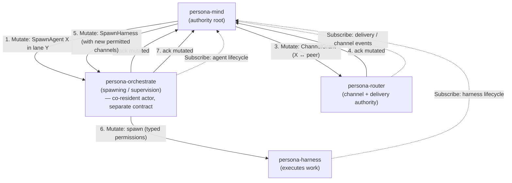

# 210 — Component triad: decisions, `Mutate` authority semantics, and orchestrate context

Date: 2026-05-17
Role: designer
Status: decisions landed + new authority-direction framing landed across
4 skills and 3 ARCH files. Q2 (persona-terminal CLI count)
investigation deferred to follow-up.

---

## 0 · TL;DR

User decisions on /209's three questions are settled and landed:

- **Q1 (skill location).** New `skills/component-triad.md` lives in
  the workspace skills directory. Kept short to maximize reading.
  Surfaced via a new "Skill importance" table at the top of
  `AGENTS.md` (tier 1: read this if you read nothing else).
  Cross-referenced from `skills/micro-components.md` and
  `skills/contract-repo.md`.
- **Q3 (Mutate semantics).** `Mutate` is **the authority verb** —
  top-down, *"change this; I do not care what you think"*. The
  issuer holds *possibly-mutated* state until the subordinate
  confirms; on the typed reply it transitions to *now-mutated* and
  may then issue the next downstream order. This is how Persona
  maintains correctness top-down. The framing is now canonical in
  `signal-core/ARCHITECTURE.md`, `skills/contract-repo.md`,
  `skills/component-triad.md`, `persona-mind/ARCHITECTURE.md`
  (§6.6, new), and `persona-router/ARCHITECTURE.md` (§2.5, new).
- **Q2 (persona-terminal CLI count).** Investigated. The repo ships
  **nine binaries** — two daemons, five control-plane Signal CLIs
  (`-capture`, `-type`, `-sessions`, `-resolve`, `-signal`), two
  data-plane attachers (`-view`, `-send`). The five control-plane
  CLIs should collapse to one `terminal` CLI with subcommands per
  the triad discipline; the two data-plane attachers are a
  legitimate exception (per `skills/component-triad.md` §"Named
  carve-outs"). Remedy deferred to a follow-up implementation
  report — flagged at §4 below.

New context surfaced during this pass:

- **`persona-orchestrate` is in design.** Second-designer-assistant's
  report 4 (2026-05-17) recommends a new component for orchestration
  *machinery* — spawning, supervision, scheduling, escalation,
  agent lifecycle — distinct from the orchestration *records* mind
  already owns. The Mutate authority chain in this report runs
  through it: `mind → orchestrate → router/harness`. Bead
  `primary-699g` (role:designer) tracks the contract-design work.

---

## 1 · What landed in this pass

Files claimed in `designer.lock` and edited. All edits are surgical —
the goal is *naming* the discipline that already exists in practice,
not rewriting any working code or shape.

| File | Change |
|---|---|
| `skills/component-triad.md` | **NEW.** ~200 lines. Names the triad shape, the three invariants, the six verbs (with authority direction), named carve-outs, witness tests, and the canonical mind → orchestrate → router authority-chain worked example. |
| `AGENTS.md` | Added "Skill importance" section between "Required reading" and "Nix store search is forbidden." Tiered table; component-triad is tier 1 — "if you can read only one skill, read that one." Explicit cross-cutting skill ranking, not duplicating per-role lists. |
| `skills/micro-components.md` | Added new step 4 to the "How" sequence: *"If the new capability is stateful, default to the triad shape."* Added cross-ref to component-triad in §"See also". |
| `skills/contract-repo.md` | Verb table extended with an **authority direction** column. `Mutate` row carries the authority-order semantics inline ("change this; I do not care what you think"; possibly-mutated → now-mutated on confirmation). Brief paragraph after the table names the worked Persona case and points at the triad skill. |
| `signal-core/ARCHITECTURE.md` | Paragraph added after the verb-order block naming the authority direction for each verb (Mutate/Retract top-down; Subscribe up-tree; Assert/Match/Validate direction-free). Cross-ref to the triad skill. |
| `persona-mind/ARCHITECTURE.md` | New §6.6 "Authority direction — `Mutate` flows down-tree": per-verb inbound/outbound table for mind; ChoreographyAdjudicator's `ChannelGrant`/`ChannelExtend`/`ChannelRetract` named as outbound `Mutate`/`Retract` orders; orchestrate component's place in the extended chain. |
| `persona-router/ARCHITECTURE.md` | New §2.5 "Authority direction — channel grants are inbound `Mutate` orders": names the router's discipline on receipt (obey, then confirm; hold possibly-mutated state until commit); distinguishes inbound Mutate (channel changes) from inbound Assert (message ingress). |

No code changes — these are all design-surface (skills, ARCH, agent
instructions). Operator-lane code work that the new discipline implies
(updating `signal-core/src/verb.rs` doc comments on the variants;
auditing each contract crate's `signal_channel!` for verb correctness)
is listed under §6 (Follow-ups).

---

## 2 · The Mutate authority chain — the corrected model

Persona's correctness is maintained **top-down via Mutate chains**.
The shape, in one sentence: *higher authority observes lower
components up-tree (via push subscriptions), decides, and issues
Mutate orders down-tree; each subordinate obeys and confirms; the
issuer transitions its own state from possibly-mutated to now-mutated
on the confirmation and only then advances to the next downstream
order*.

At each step:

- **The issuer holds possibly-mutated state.** Mind, at step 1, knows
  it has *ordered* the spawn but doesn't yet know it has *happened*.
  It does not consider the spawn fact until the typed confirmation
  arrives (step 2). Acting on possibly-mutated state would create a
  drift bug — mind would think the agent exists before orchestrate
  has actually spawned it.
- **The subordinate obeys and confirms.** Orchestrate does not
  adjudicate "should I spawn X?" — that authority lives in mind. It
  obeys the order, commits the effect, replies with the typed
  confirmation. (Failure modes: the subordinate may reply with a
  typed `Rejected` reason — that is a *typed failure*, not the
  subordinate's policy decision, and is bounded by the contract.)
- **Confirmation gates the next step.** Mind cannot issue step 3
  (install the channel grant) until step 2 (spawn confirmed)
  returns — otherwise it would install a channel for an agent that
  doesn't exist. The Mutate chain is what makes the *next* step
  safe.
- **Subscriptions flow the other direction.** Mind subscribes to
  orchestrate's `AgentLifecycle`, router's delivery / channel
  events, and harness's lifecycle — observation up-tree, authority
  down-tree.

This is why **`Mutate` is the authority verb** and `Assert` is not.
Assert is for *facts that entered the system from somewhere*: a
sensor observation, a user-typed message, a new event. The receiver
of an Assert records it without ordering anyone to do anything. Mutate
is for *orders issued downward from an authority root*: install this
channel, spawn this agent, retract this delegation. The verbs are
different because the *protocols* are different — for Assert, the
issuer has no authority over the receiver; for Mutate, the
authority-and-obedience relationship is the contract.

---

## 3 · Where `persona-orchestrate` fits

Second-designer-assistant's report 4 (the latest direction on this
component) recommends a new component for orchestration **machinery** —
spawning, supervision, scheduling, escalation, agent lifecycle —
distinct from the orchestration **records** that `persona-mind` already
owns. The deployment recommendation is co-resident actor tree in
mind's process initially; peel-apart later if needed (Nomad-flavored
simplicity).

Reading their report 4 alongside the user's Mutate-authority framing,
the picture sharpens:

- **`signal-persona-orchestrate`** (new contract) carries the typed
  vocabulary for *spawning / supervision / scheduling / escalation*.
  Examples from report 4: `SpawnAgent`, `AcquireScope`, `ReleaseScope`,
  `SuperviseAgent`, `EscalateBlockedWork`, with replies `AgentSpawned`,
  `ScopeAcquired`, `ScopeRejected`, `SupervisionAck`, `EscalationAck`,
  and emitted events `AgentLifecycle`, `ScopeContested`, `WorkReady`,
  `Escalation`.
- **Most of these are `Mutate`.** `SpawnAgent` orders the spawn.
  `AcquireScope` orders the conflict-resolution-then-claim flow.
  `SuperviseAgent` orders a restart policy registration. The
  read-shaped ones (`Escalation` consumption, `WorkReady` events,
  `AgentLifecycle` observation) are `Subscribe`. The query for
  current orchestration state is `Match`.
- **The authority chain extends through orchestrate.** Mind issues a
  `Mutate (SpawnAgent X)` to orchestrate; orchestrate executes (which
  may itself involve issuing `Mutate` orders down to harness for
  spawn and to router for channel grants); each subordinate confirms;
  orchestrate confirms back to mind; mind transitions its state and
  may issue the next order in its choreography.

When the persona-orchestrate contract is designed (bead `primary-699g`,
role:designer), the new framework gives the designer a sharp lens:
each request variant's `SignalVerb` should reflect whether it's an
order (`Mutate`/`Retract`), a fact-append (`Assert`), a one-shot read
(`Match`), or a stream (`Subscribe`). The `signal_channel!` macro
declares the verb per variant; the witness tests
(`<component>-signal-verb-mapping-covers-every-request-variant`) keep
the mapping honest.

The `(mind → orchestrate → router → harness)` chain in §2 is now the
canonical worked example in `skills/component-triad.md` §"Authority
chain — worked example". The triad skill is upstream of the
persona-orchestrate contract design — read it before designing the
contract.

---

## 4 · Q2 — `persona-terminal`'s nine binaries (deferred to follow-up)

The `/209` audit quoted "five CLIs"; that came from reading the ARCH's
code map. The actual `Cargo.toml` ships **nine binaries**:

| Binary | Plane | Conformance to triad |
|---|---|---|
| `persona-terminal-daemon` | — (daemon) | ✅ PTY-owning daemon |
| `persona-terminal-supervisor` | — (daemon) | ✅ Registry frontend daemon |
| `persona-terminal-view` | data | ✅ legitimate exception (data-plane attacher; raw bytes) |
| `persona-terminal-send` | data | ✅ legitimate exception (data-plane raw input sender) |
| `persona-terminal-capture` | control (Signal) | ❌ should be a subcommand of one CLI |
| `persona-terminal-type` | control (Signal) | ❌ should be a subcommand of one CLI |
| `persona-terminal-sessions` | control (Signal, read-only) | ❌ should be a subcommand of one CLI |
| `persona-terminal-resolve` | control (Signal, read-only) | ❌ should be a subcommand of one CLI |
| `persona-terminal-signal` | control (Signal) | ❌ should be the one CLI |

The user's hypothesis was right: there's no good architectural reason
to have **five separate Signal-control-plane CLI binaries** for one
component. The triad discipline says one CLI per daemon. Each of
`capture`, `type`, `sessions`, `resolve`, `signal` is a single-purpose
binary; they all open the same component's contract socket; they all
parse a request and print a reply. The natural shape is one CLI —
`terminal` — that accepts any `signal-persona-terminal` request as
NOTA on argv/stdin and prints the typed NOTA reply. The five behaviors
become NOTA payload variants the user types, exactly as `message`
distinguishes `Send` from `Inbox` today.

The two **data-plane attachers** (`view`, `send`) stay separate
binaries — they don't speak Signal, they attach to the data socket
for raw bytes, and the triad's §"Named carve-outs" specifically
permits this for high-bandwidth byte paths. The two daemons stay as
they are; whether `persona-terminal-supervisor` and
`persona-terminal-daemon` should merge is a separate architectural
question (the supervisor is a registry frontend that forwards to many
PTY-owning daemons; this looks legitimate but I haven't audited it
deeply).

**Remedy proposal** (for the user to schedule):

1. Collapse `capture`, `type`, `sessions`, `resolve`, `signal` into
   one `persona-terminal` binary (or just `terminal`) that accepts
   one NOTA `signal-persona-terminal` request and prints the typed
   NOTA reply.
2. Retire the five superseded binaries.
3. Keep `view` and `send` (data-plane attachers, named exception).
4. File the witness test
   `persona-terminal-cli-has-exactly-one-signal-peer` (currently
   trivially-true for the five separate ones; meaningful once
   collapsed).

I have **not** done this in this pass — it's an implementation arc
that belongs in an operator-lane or system-specialist-lane bead. The
right next step is a designer-assistant or operator audit report
naming the consolidation plan + Nix flake updates. I'd file a bead
under `role:operator` or `role:designer-assistant` depending on
whether the user wants design or implementation first.

---

## 5 · Where we're going — the architecture as a whole

The pieces now name themselves:

- **The triad** is the universal shape for every stateful component
  (`skills/component-triad.md`).
- **`signal-core`** is the wire kernel; six closed verb roots
  encoding both *what kind of operation* and *which authority
  direction*.
- **`Mutate`** is the authority verb. Persona's correctness flows
  top-down via Mutate chains; each subordinate obeys and confirms;
  the issuer advances on confirmation.
- **`Subscribe`** is the observation verb. Push, not poll. Authority
  observes up-tree before issuing orders down-tree.
- **`Assert`** is the new-fact verb. No authority chain — just *a
  typed fact entered the system*.
- **The CLI is a bridge**, not a destination. It exists to translate
  human/agent NOTA-sugar into typed Signal until peers can speak
  Signal directly. Eventually obsolete.

As new components land, they fit:

- **`persona-orchestrate`** (bead `primary-699g`) sits in the
  authority chain between mind and the runtime components
  (router/harness/future executors).
- **Raw-LLM-API executor** (mentioned in second-designer-assistant
  report 4) lands as a sibling of `persona-harness` under
  orchestrate's spawn authority — `orchestrate → Mutate (Spawn …
  RawLlm) → raw-llm-executor`.
- **Future components** (auth policy engine, audit, schedulers)
  similarly slot in by their position in the authority chain (who
  observes them; who orders them) and the named triad shape.

Each new component's ARCH should **cite the triad skill** and only
state component-specific carve-outs — not restate the universal
invariants. The duplication that exists today across the active
component ARCHs (per /209) should be cleaned up incrementally as
those ARCHs are next touched; not as a blanket sweep.

---

## 6 · Follow-ups (open work)

Filed informally here; convert to beads as the user prioritizes.

| Follow-up | Lane | Why |
|---|---|---|
| Update `signal-core/src/verb.rs` doc comments on each `SignalVerb` variant to reflect the authority direction (per the new ARCH paragraph) | operator | Designer drafts the shape (done in ARCH); operator owns the Rust source per `skills/designer.md`. |
| `signal-criome` per-variant verb mapping — verify in source + document in `signal-criome/ARCHITECTURE.md` | designer-assistant or operator | Gap surfaced in /209 §6; the triad now names the witness test that catches this. |
| `persona-terminal` CLI consolidation (5 control-plane CLIs → 1) | operator | Per §4 above. |
| Audit each existing contract crate's `signal_channel!` for verb correctness against the new framing (especially: anything currently mapped `Assert` whose semantics are actually "order the receiver to change something" should be `Mutate`) | designer-assistant | The reframing of Mutate as authority order means some existing classifications may need adjustment. Most likely candidates: anything in `signal-persona-mind` that mind ISSUES (channel grants, future spawn orders) vs anything mind RECEIVES (role claims, activity submissions). |
| `persona-orchestrate` contract design (bead `primary-699g`) | designer | The triad skill is now upstream of this; ready to consume. |
| Component ARCH duplication cleanup — let each new ARCH touch cite the triad skill and trim restated invariants | per-lane as ARCHs are touched | No blanket sweep; opportunistic during normal work. |

---

## 7 · Coordination

`orchestrate/system-specialist.lock` was idle at the start of this
pass (the SS work on horizon-leaner-shape ARCH alignment had been
released). The lojix/signal-lojix worktree work continues independently
and is now a **witness of the triad** — `signal-lojix` already
declares five SignalVerb mappings inside one channel, and
`lojix-daemon` + `lojix` CLI is the cleanest exemplar of the triad
shape.

`second-designer-assistant`'s work on `persona-orchestrate` (reports
1-4 in their lane subdirectory; latest is report 4) continues as the
next major design surface. The triad + Mutate authority framing
landed in this pass are inputs to that design. Their report 4
recommends a co-resident-actor deployment shape; this report doesn't
contradict that.

`designer.lock` releases after this report and the commit push land.

---

## 8 · See also

- `~/primary/ESSENCE.md` (intent; upstream of everything below).
- `~/primary/AGENTS.md` §"Skill importance" (the new tier table
  surfaces the triad skill at tier 1).
- `~/primary/skills/component-triad.md` (the new skill this report
  motivated).
- `~/primary/skills/contract-repo.md` §"Signal is the database
  language" + verb table (now with authority-direction column).
- `~/primary/skills/micro-components.md` §"How" step 4 + §"See
  also" (cross-ref to triad).
- `~/primary/skills/push-not-pull.md` (the observation half of the
  authority chain).
- `~/primary/skills/architectural-truth-tests.md` (the witness-test
  shape every triad invariant takes).
- `/git/github.com/LiGoldragon/signal-core/ARCHITECTURE.md`
  (authority-direction paragraph; the wire kernel).
- `/git/github.com/LiGoldragon/persona-mind/ARCHITECTURE.md` §6.6
  ("Authority direction — `Mutate` flows down-tree").
- `/git/github.com/LiGoldragon/persona-router/ARCHITECTURE.md` §2.5
  ("Authority direction — channel grants are inbound `Mutate`
  orders").
- `~/primary/reports/designer/209-component-triad-daemon-cli-contract-2026-05-17.md`
  (the audit that this report's decisions resolve).
- `~/primary/reports/second-designer-assistant/4-persona-orchestrate-control-plane-2026-05-17.md`
  (the orchestrate component recommendation that this report's
  Mutate framing slots into).
- `~/primary/protocols/active-repositories.md` §"Replacement Stack"
  (the active multi-repo arc — horizon-leaner-shape — that the lojix
  triad lives on).
- Bead `primary-699g` (role:designer) — design
  `signal-persona-orchestrate` contract + `persona-orchestrate`
  component (the natural next surface).
- Bead `primary-68cb` (role:operator) — Rust port of
  `tools/orchestrate` as thin `signal-persona-mind` client (a
  parallel arc; sec-DA report 4 narrows its scope).
