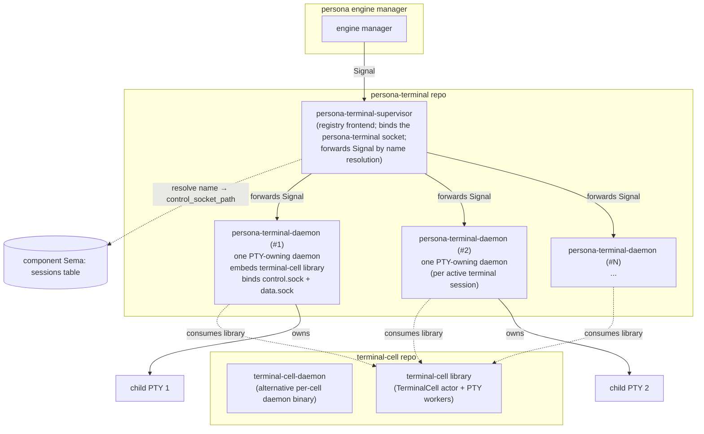
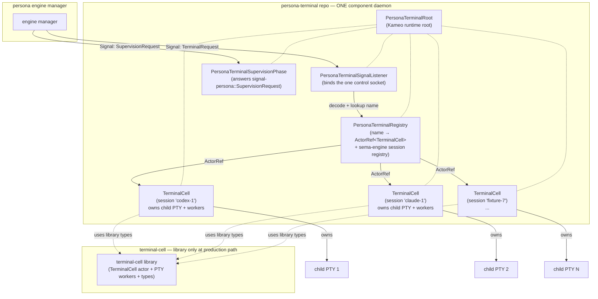
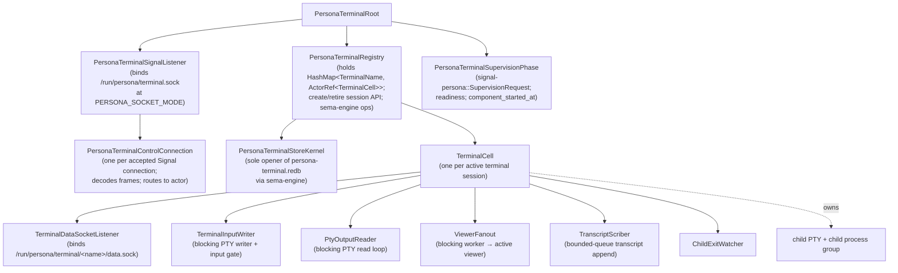

# 211 — `persona-terminal` consolidation: one daemon, internal actors, library-only `terminal-cell`

Date: 2026-05-17
Role: designer
Status: focused follow-up to `/210 §4`. Shape draft, not implementation.

---

## 0 · TL;DR

`persona-terminal` is the workspace's loudest triad violation. It ships
**ten binaries** today, including **two production daemon binaries** —
plus a third daemon binary in the upstream `terminal-cell` repo that's
embedded as a library by one of them. The intended shape is **one
daemon for the whole component** that holds many Kameo `TerminalCell`
actors (one per active terminal session), supervised under one root,
backed by one `sema-engine` database, fronted by one
`signal-persona-terminal` control socket. The per-session
`persona-terminal-daemon` shape and the registry-frontend
`persona-terminal-supervisor` shape both retire; their function moves
into the one component daemon.

The CLI surface collapses from six control-plane Signal CLIs to one
`persona-terminal` CLI (one NOTA in, one NOTA out — the universal
shape) plus one or two data-plane attachers (`view`, possibly
absorbing `send`). Total binary count: **10 → 3**.

`terminal-cell` becomes a **library only** at the production Persona
path — its `TerminalCell` actor and PTY worker types are consumed
in-process by `persona-terminal-daemon`'s actor tree, not spawned as
a sibling process. The `terminal-cell-daemon` binary stays in the
upstream repo for isolated testing of the PTY primitive, but is not
on the production path.

This report names the actor topology, the sema-engine registry shape,
the per-terminal data-socket lifecycle, the contract changes the
consolidation requires (the existing
`signal-persona-terminal::TerminalRequest` enum has no
`CreateSession` variant — session creation today is OS-level process
spawn, which goes away), the migration sequence, and the witness
tests that prove the consolidated shape is in place and the old shape
cannot regress.

The user's attention items live in §11 inline.

---

## 1 · Why this report exists

Per `~/primary/reports/designer/210-component-triad-decisions-and-mutate-authority-2026-05-17.md`
§4 (after the user's correction): the workspace's universal component
triad (one daemon + one CLI + one `signal-*` contract) demands one
daemon per *component*, not one daemon per piece of state the
component manages. A terminal session is per-component-state, not a
component. Treating each session as its own daemon required a
registry-frontend daemon to find them, multiplied the binary count,
and dispersed the actor supervision tree across processes that should
have been one actor tree.

`/210 §4` named the consolidation direction but left the *shape* to a
follow-up. This is that follow-up.

The report is **shape draft only**. No implementation has landed; no
Cargo.toml change is in this commit. The deliverable is:
- a target actor topology readable enough for operator to implement,
- the sema-engine registry the daemon owns,
- the signal-persona-terminal contract changes the consolidation
  requires,
- the migration sequence (and what breaks vs stays compatible for
  current consumers),
- the witness tests that pin the consolidated shape,
- the open questions that should be answered before operator picks
  the work up.

---

## 2 · Today vs target

### 2.1 · Today — three layers of daemon



Today's binaries (10 in `persona-terminal/Cargo.toml`):

| Binary | Role today | Plane |
|---|---|---|
| `persona-terminal-daemon` | one process per terminal session, owns one PTY | daemon |
| `persona-terminal-supervisor` | engine-facing registry frontend; resolves names from component Sema; forwards Signal frames to per-session daemons | daemon |
| `persona-terminal-view` | viewer attaches to a terminal's `data.sock` (raw bytes) | data |
| `persona-terminal-send` | raw input sender on `data.sock` | data |
| `persona-terminal-capture` | captures transcript bytes (Signal client) | control |
| `persona-terminal-type` | injects programmatic input (Signal client) | control |
| `persona-terminal-sessions` | read-only session inspection (Signal client) | control |
| `persona-terminal-resolve` | name → control socket path resolver | control |
| `persona-terminal-signal` | generic Signal request client | control |
| `persona-terminal-validate-capture` | capture-validator helper | control |

Plus the upstream `terminal-cell-daemon` binary, which the
per-session `persona-terminal-daemon` embeds as a **library** (not as
a child process) — but the binary exists and is used in
`terminal-cell`'s own witnesses, so the public surface today is
three daemon binaries across two repos.

### 2.2 · Target — one daemon, many internal actors



Target binaries (3):

| Binary | Plane | Role |
|---|---|---|
| `persona-terminal-daemon` | daemon | The one component daemon. Binds the Signal control socket, owns the sema-engine registry, supervises N TerminalCell actors. |
| `persona-terminal` | control | The one CLI. One NOTA `signal-persona-terminal` request in, one NOTA reply out. Subsumes `capture`, `type`, `sessions`, `resolve`, `signal`, `validate-capture`. |
| `persona-terminal-view` | data | Data-plane viewer attacher (raw bytes). May absorb `send` as an interactive attach mode. |

---

## 3 · Consolidated daemon — actor topology



### Actors

| Actor | Owns | Failure policy |
|---|---|---|
| `PersonaTerminalRoot` | the runtime root; child ActorRefs (listener, registry, supervision phase, all TerminalCells); shutdown sequencing | restart never (root) |
| `PersonaTerminalSignalListener` | the persona-terminal control socket bind; accept loop | restart permanent (rebinds via socket release-before-notify) |
| `PersonaTerminalControlConnection` | one per accepted client connection; decodes Signal frames; performs name lookup; forwards typed requests; renders replies | restart never (per-connection transient) |
| `PersonaTerminalRegistry` | the canonical `HashMap<TerminalName, ActorRef<TerminalCell>>`; `CreateSession`/`RetireSession` mailbox API; sema-engine session-table ops | restart permanent (state durable in sema-engine) |
| `PersonaTerminalStoreKernel` | the sole `persona-terminal.redb` opener via sema-engine; supervised OS thread per `skills/kameo.md` §"Blocking-plane templates" Template 2 | exclusive-resource-actor shape per `skills/actor-systems.md` §"Release before notify" |
| `PersonaTerminalSupervisionPhase` | the canonical `signal-persona::SupervisionRequest` answer surface; cached `ComponentHealth` pushed from `PersonaTerminalRegistry` | restart permanent |
| `TerminalCell` | one child process group, one PTY master, the transcript log, the viewer attachment, prompt-pattern + input-gate state, per-session worker lifecycle, per-session data socket | restart never by default — child PTY is exclusive resource, supersedes via new session |
| `TerminalDataSocketListener` | the per-session data socket bind; accept loop for raw-byte viewer attach | restart permanent within the parent TerminalCell |
| `TerminalInputWriter` / `PtyOutputReader` / `ViewerFanout` / `TranscriptScriber` / `ChildExitWatcher` | blocking-plane workers from `terminal-cell` library; report `TerminalWorkerLifecycle` events to the parent `TerminalCell` actor | per `terminal-cell/ARCHITECTURE.md` §3.8 |

The actor tree is **what `terminal-cell` already proves works** —
the topology inside `TerminalCell` is unchanged from
`terminal-cell/ARCHITECTURE.md` §1.4 "Workers and the actor mailbox".
What's new is *where* `TerminalCell` lives: it moves up one level
from a per-process owner to a per-actor child of
`PersonaTerminalRoot`.

### Signal frame routing

`PersonaTerminalControlConnection`'s handler shape:

```
on incoming Signal frame:
    decode → TerminalRequest payload
    match payload:
        TerminalConnection { name, ... }       → registry.send(ForwardTo { name, request })
        TerminalInput { name, ... }            → registry.send(ForwardTo { name, request })
        TerminalResize { name, ... }           → registry.send(ForwardTo { name, request })
        ...  (every per-terminal request)
        CreateSession { name, command, ... }   → registry.send(CreateSession { ... })
        RetireSession { name }                 → registry.send(RetireSession { name })
        ListSessions {}                        → registry.send(ListSessions {})
        ResolveSession { name }                → registry.send(ResolveSession { name })
    await typed reply
    encode + send on connection
```

`PersonaTerminalRegistry`'s `ForwardTo { name, request }` resolves
`name` via its in-memory `HashMap`, finds the `ActorRef<TerminalCell>`,
forwards the typed request to that actor's mailbox via Kameo `ask`,
returns the typed reply to the connection. If the name doesn't
resolve, the registry returns a typed
`TerminalRequestUnimplemented(TerminalNotFound { name })` (or a new
reason variant for unknown name).

Cross-terminal coordination requests (`ListSessions`,
`ResolveSession`, future broadcast) are mailbox-local to the
registry; no fan-out across processes.

---

## 4 · Sema-engine registry shape

The component daemon owns `persona-terminal.redb` through `sema-engine`.
The schema is the existing `TerminalTables` plus one canonical
`sessions` table that names the active-session set.

| Table | Key | Value | Purpose |
|---|---|---|---|
| `sessions` | `TerminalName` | `SessionRegistration { name, data_socket_path, child_pid, command, environment, created_at, lifecycle_state }` | canonical name → session-state map; restored on daemon restart |
| `session_health` | `TerminalName` | `SessionHealth { generation, ready_at, last_observation_at }` | existing — readiness for engine manager |
| `viewer_attachments` | `TerminalName` | `ViewerAttachment { active_viewer_pid, attached_at, generation }` | existing — current attached viewer |
| `prompt_patterns` | `(TerminalName, PromptPatternId)` | `PromptPattern { kind, bytes, registered_at }` | existing — per-session patterns |
| `input_gate_log` | `(TerminalName, slot)` | `GateEvent { event, lease, prompt_state, observed_at }` | existing — gate acquire/release history |
| `delivery_attempts` | `slot` | `DeliveryAttempt { target_name, frame, attempted_at, outcome }` | existing — Signal frame forwarding audit |
| `terminal_events` | `slot` | `TerminalEventRecord { target_name, event, observed_at }` | existing — typed events observed |
| `session_archive` | `slot` | `SessionArchive { name, retired_at, exit_status }` | existing — retired sessions |

The `sessions` table is new and canonical. On daemon startup, the
registry actor reads `sessions`, restores in-memory
`HashMap<TerminalName, …>` entries marked *recovering*, then either
re-adopts existing children (via `/proc/<pid>` + `pidfd_open`) or
emits typed `SessionRetiredAtRestart` events for sessions whose
children are gone. The re-adoption mechanism is the open question Q1
in §11; the safe default for the first cut is *retire all on
restart* and document it.

The other tables stay as `persona-terminal` already declares them
(via `signal-persona-terminal`'s introspection records); they don't
need reshaping for the consolidation.

---

## 5 · Per-terminal data-socket lifecycle

Per-session data sockets stay (raw bytes can't afford Signal framing
per `terminal-cell/ARCHITECTURE.md` §3.2 "Data-plane latency"). The
ownership moves into the daemon:

### Directory layout

```
${XDG_RUNTIME_DIR}/persona-terminal/
├── control.sock                       (the one Signal control socket;
│                                       mode PERSONA_SOCKET_MODE)
├── supervision.sock                   (signal-persona::SupervisionRequest;
│                                       mode 0600)
└── sessions/
    ├── codex-1/
    │   └── data.sock                  (mode 0600; bound by the
    │                                   TerminalCell actor on CreateSession)
    ├── claude-1/
    │   └── data.sock
    └── fixture-7/
        └── data.sock
```

### Bind / unbind sequence

- **Session created** (`CreateSession { name, command }`):
  1. `PersonaTerminalRegistry` mints a slot, commits a
     `SessionRegistration` row to sema-engine.
  2. Registry spawns a new `TerminalCell` actor under
     `PersonaTerminalRoot` with the session config.
  3. `TerminalCell::on_start` mkdir's `sessions/<name>/`,
     binds `data.sock` at mode 0600, starts its
     `TerminalDataSocketListener` actor + PTY workers.
  4. Registry updates the row's `data_socket_path` field with the
     bound path, replies with typed `SessionCreated { name,
     data_socket_path }`.

- **Session retired** (`RetireSession { name }` or worker-reported
  child exit):
  1. Registry sends `Shutdown` to the named `TerminalCell` actor.
  2. `TerminalCell::on_stop` (per `skills/actor-systems.md`
     §"Release before notify") unbinds the data socket, removes
     `sessions/<name>/`, drops child PTY and process group.
  3. Actor terminates; registry awaits the terminal outcome,
     commits `SessionArchive { name, retired_at, exit_status }`,
     removes the in-memory entry, replies with typed
     `SessionRetired { name, exit_status }`.

- **Daemon shutdown** (SIGTERM):
  1. `PersonaTerminalSignalListener` stops admission first.
  2. `PersonaTerminalRoot` drains pending control work, then
     stops `PersonaTerminalRegistry`.
  3. Registry stops every `TerminalCell` child; each releases
     its data socket and child resources before terminal-notify.
  4. `PersonaTerminalStoreKernel` releases `persona-terminal.redb`
     last (exclusive-resource discipline).

### Viewer attach flow

```mermaid
sequenceDiagram
    participant viewer as persona-terminal-view
    participant cli as persona-terminal CLI
    participant daemon as persona-terminal-daemon
    participant cell as TerminalCell (one)

    viewer ->> cli: (ResolveSession "codex-1")
    cli ->> daemon: Signal Match { ResolveSession { name: "codex-1" } }
    daemon ->> cell: (via registry name lookup)
    daemon -->> cli: Signal Reply { SessionResolved { data_socket_path } }
    cli -->> viewer: prints the path
    viewer ->> cell: connect to data_socket_path; raw bytes
    Note over viewer,cell: data plane bypasses actor mailbox<br/>(terminal-cell ARCH §3.2)
```

---

## 6 · `signal-persona-terminal` contract changes

The current contract (per `signal-persona-terminal/src/lib.rs` §line
910-922) covers *per-existing-terminal* operations:

| Request | Verb | Per-terminal |
|---|---|---|
| `TerminalConnection` | Assert | yes |
| `TerminalInput` | Assert | yes |
| `TerminalResize` | Mutate | yes |
| `TerminalDetachment` | Retract | yes |
| `TerminalCapture` | Match | yes |
| `RegisterPromptPattern` | Assert | yes |
| `UnregisterPromptPattern` | Retract | yes |
| `ListPromptPatterns` | Match | yes |
| `AcquireInputGate` | Assert | yes |
| `ReleaseInputGate` | Retract | yes |
| `WriteInjection` | Assert | yes |
| `SubscribeTerminalWorkerLifecycle` | Subscribe | yes |
| `TerminalWorkerLifecycleRetraction` | Retract | yes |

**There is no `CreateSession` variant.** Today, sessions are created
by spawning a new `persona-terminal-daemon` process at the OS level
(`exec persona-terminal-daemon --name <X> --command <…>`). In the
consolidated shape, OS spawn is no longer the session-creation
primitive — Signal request to the existing daemon is. The contract
needs four new variants:

| Variant | Verb | Reason |
|---|---|---|
| `CreateSession { name, command, environment, working_directory }` | Mutate (top-down order to install a new session in the daemon's registry) | session creation moves from OS spawn to Signal request |
| `RetireSession { name }` | Retract | symmetric to create; tombstones the session in registry + commits archive |
| `ListSessions {}` | Match | replaces `persona-terminal-sessions` binary |
| `ResolveSession { name }` | Match | replaces `persona-terminal-resolve` binary; returns the typed `data_socket_path` |

`CreateSession` is `Mutate` (not `Assert`) per the authority-direction
framing in `/210`: it's an order to the daemon to install a new
named session in its registry — top-down authority, "create this
session, I don't care what you think," issuer holds
*possibly-created* until the typed `SessionCreated` reply confirms.
The created session is a new typed entity in the registry, but the
verb on the issuance side names *the order to create*, not the
appearance of a new fact.

### Open question on `CreateSession`

`Assert` vs `Mutate` for session creation is a judgment call. The
authority-direction framing says: when the issuer is *ordering* the
recipient to change state at a stable name, it's `Mutate`. When the
issuer is *appending a new fact* with no authority dimension, it's
`Assert`. Session creation is closer to the first — the persona
engine manager (or the user via CLI) is ordering the terminal
daemon to bring up a session at a specific name. The name is the
stable identity; the daemon must (or must refuse with a typed
reason) commit the registration.

Q5 in §11 leaves room for the user / contract-design-lane to
prefer `Assert` if the architectural intent is different. The
preference here is `Mutate`, consistent with `/210 §2`.

### Existing `signal-persona-terminal` operations don't change

The 13 existing request variants stay as they are. The router's
`HarnessDelivery` plane and the harness's terminal-adapter library
both speak `signal-persona-terminal`; the consolidation is
**wire-compatible** for those consumers — they just dial a
different daemon (the single one) and the daemon resolves the
target terminal by name internally.

---

## 7 · `terminal-cell` becomes library-only at the Persona path

Today, `terminal-cell` ships:
- a Rust library with `TerminalCell`, `TerminalTranscript`,
  `TerminalInputWriter`, `ViewerFanout`, `TranscriptScriber`, etc.
- a `terminal-cell-daemon` binary that's the per-cell daemon
  process.
- a constellation of CLI clients (`terminal-cell-send`, `-capture`,
  `-wait`, `-exit`, `-resize`, `-view`, etc.) that dial the
  per-cell daemon.

After consolidation, the production Persona path consumes
`terminal-cell` **as a library only**. The daemon binary and CLI
constellation in `terminal-cell` stay in that repo as
*isolated-testing affordances* for the PTY primitive (handy for
developing the library without standing up the full
persona-terminal daemon), but they are not on any production
Persona surface.

The `terminal-cell/ARCHITECTURE.md` should gain a marker at the top
making this explicit:

> **Production consumption.** In production Persona, `terminal-cell`
> is consumed as a library by `persona-terminal-daemon`'s actor
> tree. The `terminal-cell-daemon` binary in this repo is a
> standalone test harness for the PTY primitive only; no Persona
> component runs it as a sibling process.

That ARCH edit is a small follow-up (system-specialist's lane or
designer-assistant), not part of this report's surface.

---

## 8 · Binary count — concrete mapping

| Today (10) | Future role | Action |
|---|---|---|
| `persona-terminal-daemon` | the one component daemon | reshape: not per-session anymore; binds the one control socket; supervises N TerminalCell actors |
| `persona-terminal-supervisor` | (none) | **retire** — the registry-frontend function moves into `PersonaTerminalRegistry` actor in the daemon |
| `persona-terminal-view` | data-plane viewer attacher | keep; reshape to look up `data_socket_path` via the daemon's `ResolveSession` rather than reading sema directly |
| `persona-terminal-send` | data-plane raw input sender | keep or merge into `-view` as interactive mode |
| `persona-terminal-capture` | (subsumed) | retire; functionality available via `persona-terminal '(TerminalCapture …)'` |
| `persona-terminal-type` | (subsumed) | retire; available via `persona-terminal '(TerminalInput …)'` + `'(WriteInjection …)'` |
| `persona-terminal-sessions` | (subsumed) | retire; available via `persona-terminal '(ListSessions)'` |
| `persona-terminal-resolve` | (subsumed) | retire; available via `persona-terminal '(ResolveSession …)'` |
| `persona-terminal-signal` | (subsumed) | retire; becomes the canonical `persona-terminal` CLI itself |
| `persona-terminal-validate-capture` | (subsumed) | retire; becomes a witness test, not a production binary |

The single CLI (`persona-terminal`) accepts one NOTA
`signal-persona-terminal::TerminalRequest` on argv/stdin and prints
the typed NOTA `TerminalReply`. Same shape as `message`, `mind`,
`introspect`, `criome`, `lojix` — the universal pattern from
`skills/component-triad.md`.

---

## 9 · Migration sequence

Each step is a separate commit; the witness tests added in lockstep
keep regression closed.

1. **Contract additions land first** (`signal-persona-terminal`).
   Add `CreateSession`, `RetireSession`, `ListSessions`,
   `ResolveSession` request variants + paired reply variants +
   per-variant `SignalVerb` mapping + round-trip tests. Contract
   bump is a coordinated upgrade — but no consumer reads these
   variants yet, so it's strictly additive.
2. **New `PersonaTerminalRegistry` actor + `CreateSession` /
   `RetireSession` handlers land in `persona-terminal`** behind a
   feature flag. The existing `persona-terminal-supervisor` keeps
   running; the new code is exercised only by new tests.
3. **`persona-terminal-daemon` reshape** — the per-session daemon
   binary becomes the one component daemon. Its `main` no longer
   takes `--name <X>` to bind a per-session control socket; it
   binds the persona-terminal control socket (`PERSONA_SOCKET_PATH`)
   and waits for `CreateSession` requests. Per-session state lives
   in spawned `TerminalCell` actors.
4. **Witness scripts under `persona-terminal/scripts/` migrate** —
   instead of `exec persona-terminal-daemon --name X`, they send
   `(CreateSession "X" …)` via the one daemon. The fixture cells
   (`agent-terminal-fixture`, `output-flood-fixture`) are
   addressable by name through the daemon.
5. **Retire `persona-terminal-supervisor`** — its function is in
   the new daemon. The `signal-persona-terminal` wire surface is
   unchanged; existing consumers (router/harness/introspect/CLI)
   keep dialing the same socket path (the engine manager points
   them at the consolidated daemon).
6. **Collapse control-plane CLIs** — `capture`, `type`, `sessions`,
   `resolve`, `signal`, `validate-capture` all retire. The single
   `persona-terminal` CLI accepts any NOTA
   `signal-persona-terminal` request. Each retirement is its own
   small commit so a regression is bisectable.
7. **`persona-terminal-view` reshape** — looks up data socket path
   via the daemon's `ResolveSession` request rather than reading
   sema directly. Optionally absorb `persona-terminal-send`.
8. **`terminal-cell` ARCH note** — mark `terminal-cell-daemon`
   as test-only at the production Persona path. (No code change in
   `terminal-cell`; just narrative.)

The migration is internally re-architectural for `persona-terminal`,
but **wire-compatible for downstream consumers**
(router/harness/introspect): their `signal-persona-terminal`
contract usage stays the same. The only consumer that sees a
breaking change is whoever was directly invoking
`exec persona-terminal-daemon --name <X>` — currently the
component's own scripts; possibly some operator workflows.

---

## 10 · Witness tests

Per `skills/architectural-truth-tests.md` and the universal triad
tests in `skills/component-triad.md` §"The witness tests every
triad ships":

| Test | Proves |
|---|---|
| `persona-terminal-cargo-toml-ships-exactly-three-binaries` | source scan; the consolidation actually landed |
| `persona-terminal-component-has-exactly-one-daemon-binary` | source scan; the supervisor binary is gone |
| `persona-terminal-cli-has-exactly-one-signal-peer` | runtime; the CLI cannot multiplex across daemons |
| `persona-terminal-daemon-binds-exactly-one-signal-control-socket` | runtime; not one per session |
| `persona-terminal-daemon-supervises-one-terminal-cell-actor-per-session` | topology test; N sessions → N child actors |
| `persona-terminal-session-state-survives-daemon-restart` | sema-engine durability; `sessions` table read on startup |
| `persona-terminal-data-socket-bound-after-create-session-reply` | runtime; viewer can attach immediately after the typed reply |
| `persona-terminal-data-socket-unbound-after-retire-session-reply` | runtime; no stale sockets after retire |
| `persona-terminal-data-plane-bytes-still-bypass-actor-mailbox` | latency preservation; terminal-cell §3.2 discipline intact |
| `persona-terminal-create-session-uses-mutate-verb` | contract; verb mapping check |
| `persona-terminal-cannot-create-session-by-os-spawn` | source scan; no remaining `exec persona-terminal-daemon --name` in scripts |
| `persona-terminal-terminal-cell-daemon-is-not-a-persona-runtime-dependency` | Cargo dependency graph scan; `terminal-cell` is consumed as library only |

---

## 11 · Open questions for the user

Before the operator picks this up, three are blocking and three are
not:

### Blocking

**Q1 — Daemon-restart session continuity.** When the daemon
restarts, should existing child PTYs survive (re-adopt via
`/proc/<pid>` + `pidfd_open`; transcript continuation) or die with
the daemon (clean slate; record exit cause in `session_archive`)?
Re-adoption is technically possible on Linux with `pidfd` but
non-trivial; clean slate is simpler and faithful to today's
"daemon-owns-PTY" shape. My recommendation: **clean slate for the
first cut, document explicitly, file a follow-up for pidfd re-adopt
if/when it matters**. The change is internal — a future
re-adoption-enabled daemon doesn't break the contract.

**Q2 — `terminal-cell-daemon` binary status.** Should the
`terminal-cell-daemon` binary stay in the upstream repo (as a
standalone testing affordance for the PTY primitive), be retired
entirely (terminal-cell ships only as a library), or split into a
separate `terminal-cell-test-daemon` to make the test-only status
explicit? My recommendation: **keep as standalone testing
affordance, add the ARCH marker (per §7) making "not on the
production Persona path" explicit**. Retiring it loses a useful
isolation-testing tool; renaming it is ceremony without payoff.

**Q3 — Where does `persona-terminal-validate-capture` go?** It's a
helper today, possibly a fixture-driver. If its job is "validate a
captured transcript against an expected pattern," it belongs as a
witness test in `persona-terminal/tests/` (cargo test fixture), not
as a production binary. If it's used in operator workflows as a
build-time check, it could become a Nix `check` derivation. My
recommendation: **convert to test/check, not binary**. I haven't
audited its current callers; the user or designer-assistant should
confirm.

### Non-blocking

**Q4 — Should `persona-terminal-view` absorb `persona-terminal-send`?**
`view` is bidirectional (read + write keystrokes), `send` is
write-only. Two binaries reflect two ergonomics: interactive viewer
vs scripted-input sender. Either keep both or absorb (`view --send-only`
or `view --no-render`). Preference: **keep both for now; consolidate
when one becomes redundant in practice.**

**Q5 — `CreateSession` as `Mutate` vs `Assert`?** The
authority-direction framing (per `/210 §2`) prefers `Mutate` for
"order the daemon to install a new session at this name." If the
user's reading of the framing differs — e.g., "session creation is
asserting that a new typed session exists, not ordering the daemon
to change" — the contract should reflect the user's reading.
Preference: **`Mutate`**.

**Q6 — Should the consolidated daemon ALSO bind a separate
supervision socket** (mode 0600, per the existing
`signal-persona::SupervisionRequest` pattern), or fold supervision
traffic onto the main control socket? Today's persona-terminal
supervisor binds two listeners; consolidating to one socket is
simpler if the engine manager is comfortable using the same
endpoint for both supervision and content. Preference: **two
sockets**, matching every other Persona triad daemon
(`mind.sock` + `mind-supervision.sock`-shaped pattern); minor
operational uniformity wins over single-socket simplicity.

---

## 12 · Coordination

This report does not write any operator-lane code, contract-crate
code, or persona-terminal source. The actual implementation arc is
operator's lane (likely a bead `persona-terminal-consolidation`
under `role:operator` or `role:operator-assistant`, blocked on this
report landing). The contract additions are
designer-assistant-lane work (the `signal-persona-terminal` enum
additions are typed-contract design, not implementation).

Filing beads:

- **`role:designer` (or designer-assistant)**: `signal-persona-terminal`
  contract additions — `CreateSession`, `RetireSession`,
  `ListSessions`, `ResolveSession` request/reply variants with
  per-variant `SignalVerb` mapping and round-trip tests. Small
  scope; lands ahead of operator work.
- **`role:operator`**: `persona-terminal` consolidation —
  reshape the daemon, retire the supervisor binary, collapse CLIs,
  update witness scripts. The big implementation arc.
- **`role:system-specialist`**: `terminal-cell` ARCH note marking
  the daemon binary as test-only at the production Persona path
  (small).

`/210 §4`'s "remedy proposal" section is now superseded by this
report. The user's earlier Q2 question is answered: yes, one
daemon; no, no daemon per terminal; the daemon does the six things
in §3.

`orchestrate/system-specialist.lock` and other locks are idle as of
the start of this report; no coordination collisions.

---

## 13 · See also

- `~/primary/ESSENCE.md` (intent; upstream of everything).
- `~/primary/skills/component-triad.md` (the universal shape this
  consolidation realizes).
- `~/primary/skills/contract-repo.md` §"Signal is the database
  language" (the verb spine; `CreateSession` as Mutate).
- `~/primary/skills/actor-systems.md` §"Release before notify"
  (the per-TerminalCell shutdown discipline).
- `~/primary/skills/kameo.md` §"Blocking-plane templates"
  (Template 2 for `PersonaTerminalStoreKernel`).
- `~/primary/skills/architectural-truth-tests.md` (witness
  discipline for §10).
- `~/primary/skills/push-not-pull.md` (subscription discipline
  for `SubscribeTerminalWorkerLifecycle` and future cross-session
  subscriptions).
- `~/primary/reports/designer/209-component-triad-daemon-cli-contract-2026-05-17.md`
  (the audit that surfaced the persona-terminal violation).
- `~/primary/reports/designer/210-component-triad-decisions-and-mutate-authority-2026-05-17.md`
  §4 (the corrected position this report implements).
- `/git/github.com/LiGoldragon/persona-terminal/ARCHITECTURE.md`
  (the current shape this report supersedes).
- `/git/github.com/LiGoldragon/terminal-cell/ARCHITECTURE.md`
  (the library whose `TerminalCell` actor moves up one level).
- `/git/github.com/LiGoldragon/signal-persona-terminal/src/lib.rs`
  (the contract that grows four new request variants).
- `/git/github.com/LiGoldragon/persona-mind/ARCHITECTURE.md` §6.6
  (the authority-direction frame Mutate-CreateSession lives in).
