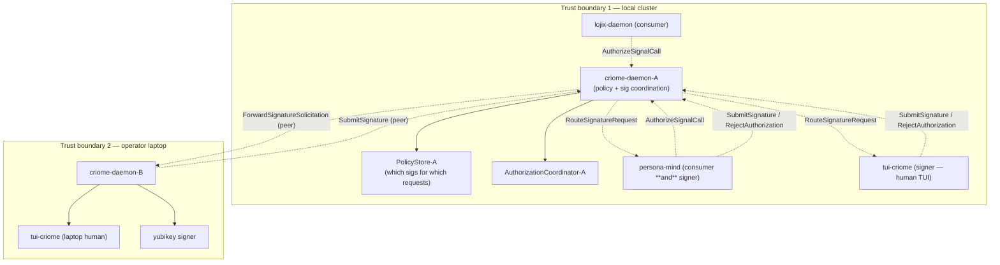

# 212 — Criome permission model (clarified) and operator-assistant/148 audit

Date: 2026-05-17
Role: designer
Scope: `signal-criome`, `criome`, `tui-criome`, future criome peers and
their OwnerSignal surfaces.
Responds to: `reports/operator-assistant/148-criome-signature-authorization-decisions-2026-05-17.md`
("op-148"), supersedes the chat-only audit that preceded this report.

---

## 0 · TL;DR

User clarified that the apparent contradiction my prior audit flagged
between system-assistant/21 §0 ("criome holds the permission data —
which key/quorum has which permission") and op-148 ("permission comes
from signatures, not internal permission slots or ACL rows") **was a
misread on my part**. Both clauses are simultaneously true and
complementary:

- **Criome holds policy.** Specifically, the data that says *which
  signers / which quorum are required for which content-addressed
  requests*.
- **Permission is constituted by [policy + signatures over the exact
  request digest].** A request becomes "authorized" when the
  signatures criome's policy demands have been collected and verified
  over the canonical request digest.

The full model the user described is **richer than either source
captured alone** and adds load-bearing primitives the current ARCH
files do not yet name:

1. **Many criome daemons, one per trust boundary.** Not a singleton
   substrate; every new trust boundary spawns its own criome.
2. **Two-worlds client split.** *Signers* (decide and sign / refuse).
   *Consumers* ("dumb clients") that just ask "is this allowed?" and
   trust the answer; they never touch cryptography.
3. **Outright-refuse policy.** A criome may refuse a request before
   escalating to signing; no signature collection happens.
4. **Escalation-to-signing as a first-class state transition.**
5. **Parallel multi-signer solicitation.** TUI-to-human and
   mind-to-LLM can be solicited concurrently; quorum aggregates the
   replies.
6. **persona-mind as a meta-signer.** It is one signer that may
   internally route the question to LLM agents or human surfaces
   before deciding its own signature.
7. **Cross-criome peer routing.** A criome that needs a signature
   from a key held in a peer trust boundary forwards the
   solicitation.

This invalidates my prior audit's #1 finding ("unflagged contradiction
with SYS/21"). The remaining audit items still stand — and several
sharpen, because the clarified model makes the unfilled gaps
load-bearing rather than optional.

---

## 1 · The clarified Criome permission model

### 1.1 Topology

The flow that matters: a consumer asks "is this allowed?"; criome
consults policy; criome either refuses outright, or solicits signatures
from the signers policy names (locally and via peers); criome
aggregates; criome replies to the consumer with a yes/no.

### 1.2 One criome per trust boundary

A criome daemon is **per trust boundary**, not per machine. Two
processes on the same host running under different trust envelopes
each address their own criome. New trust boundaries — a new cluster,
a new project tenant, an operator's personal device pool, an HSM
vault, a guest agent sandbox — each get their own criome daemon.

There is no upper bound on the number of criome daemons in a
deployment. The substrate is *replicable*; the contract is
*identical* per instance.

**Architectural consequence.** Criome's "trust scope" is configured
per-instance — its root keypair, its identity registry, its policy
records, its peer-routing table. Two criome daemons are different
authorities; an `AuthorizationGrant` issued by one is meaningful
only to consumers that trust that criome.

### 1.3 Single-object content-addressed permissions

Every permission is *for a specific content-addressed object* — a
canonical `signal-lojix` request digest, a content hash, an audit
verdict over an exact prompt. A grant for object A cannot authorize
object B. This is the negative-witness the criome ARCH §8 already
states; the clarified model reaffirms it as the primitive that makes
everything else hang together.

### 1.4 Permission = policy + signatures

The simultaneous-truth that resolves the apparent contradiction:

| Surface | What it says | Why it's true |
|---|---|---|
| Criome holds the policy | The store maps *kinds of requests* (or specific request digests) to *required signers / quorums*. | Without this, "which signatures count" has no answer; criome has nothing to route solicitations against. |
| Permission comes from signatures | The `AuthorizationGrant` envelope's authority is the collected signatures over the exact request digest. | The policy alone doesn't grant; only the signatures policy demands, applied over the exact request, do. |

The mental shape: **policy says who; signatures fulfill.** Neither
half is the whole permission. Op-148 captured the second half and
implicitly assumed the first; SYS/21 captured the first half and
implicitly assumed the second. The clarified model names both.

### 1.5 Two-worlds client split

Criome serves two categorically different kinds of clients:

| World | What they do | Crypto-aware? | Examples |
|---|---|---|---|
| **Signers** | Decide whether to sign a presented request; produce a `SubmitSignature` or `RejectAuthorization`. Hold keys and policy-decision capability. | Yes — they hold private keys and sign canonical digests. | `tui-criome` (human-mediated), `persona-mind` (LLM/agent/UI-mediated), peer criome daemons, future yubikeys / HSMs / gpg-agents. |
| **Consumers** | Ask "is this allowed?"; receive yes/no. Trust the local criome's verdict. | No — they never see signatures, never verify cryptography. | `lojix-daemon` asking criome before executing a deploy effect; any local component subscribing to a permission decision. |

A single component can occupy both roles (`persona-mind` is both a
consumer and a signer). But the contract surfaces it speaks to/from
criome are different: as consumer it uses `AuthorizeSignalCall` +
`ObserveAuthorization`; as signer it uses `RouteSignatureRequest`
(inbound) + `SubmitSignature` / `RejectAuthorization` (outbound).

**Architectural consequence.** The signal-criome contract already
contains both worlds' verbs, but does not name the split. The two
worlds have different lifecycles, different trust assumptions, and
different audit needs. They likely deserve different OwnerSignal
treatment (see §3.7).

### 1.6 Outright-refuse policy

When a request arrives at criome, the policy may state that the
request is **refused outright** — no signature collection escalates.
This is a closed policy decision distinct from "signatures said no."

The current `CriomeReply` set is:
`AuthorizationPending | AuthorizationGranted | AuthorizationDenied |
AuthorizationExpired | AuthorizationUnavailable`. The clarified model
needs `AuthorizationDenied` to disambiguate:

- **Refused by policy** (criome's own policy record rejects this
  kind of request from this kind of caller for this kind of object).
- **Refused by signers** (signatures collected, threshold-for-deny
  reached).

These have very different audit semantics and different operator
follow-ups. A unified `AuthorizationDenied` flattens them.

### 1.7 Escalation-to-signing

The state-machine concept: a request *enters* criome and either
short-circuits to refuse, or *escalates to signing*, opening the
solicitation-and-collection phase. Escalation is a first-class
transition, not an internal detail. Consumers that subscribe to
`ObserveAuthorization` should be able to see the distinction —
"refused without signing" vs "signing in progress."

### 1.8 Parallel multi-signer solicitation

When policy demands N signatures (or M-of-N), criome solicits all
candidate signers concurrently. Each solicited signer makes its own
independent decision and replies. Criome aggregates until the
quorum-for-yes or quorum-for-no threshold is met, then replies to
the consumer.

The temporal shape: a TUI prompt to a human can be in flight at the
same time as an LLM-judgment routed through persona-mind, at the
same time as a yubikey tap on the operator's laptop. The ordering
is non-deterministic; the aggregation is the policy's threshold
logic.

### 1.9 persona-mind as a meta-signer

`persona-mind` is more than a key-holder. As a signer, it may:

1. Apply its own decisional logic (deciding directly whether to
   sign for some classes of requests, without external escalation).
2. Forward the question to an LLM agent with typed parameters and
   constraints: *"give me yes/no on this with these rules."* The
   LLM's reply flows back through the router to mind; mind then
   signs or rejects.
3. Present the question to a human via persona's UI surface (which
   may be `tui-criome` itself, or another persona-terminal-mediated
   surface).

This makes persona-mind a **meta-signer**: one signature-producing
client whose internal logic may engage further chains (LLMs, humans)
before producing the signature.

**Architectural consequence.** persona-mind's signing capability is
not currently surfaced in `signal-persona-mind`. Either:

- `signal-persona-mind` gains a sign/refuse surface, and persona-mind
  is the criome-side signer; or
- persona-mind speaks `signal-criome` as a client (the current
  shape implied by op-148), with the meta-signing logic internal to
  mind.

The second is simpler and aligns with the existing contract
boundaries. The first deserves consideration once the meta-signing
logic stabilises.

### 1.10 Cross-criome peer routing

When criome-A needs a signature from a key registered in
trust-boundary B (and B has its own criome-B), A forwards the
solicitation to B. B routes locally, collects the signature, returns
it. A treats B as a signer in this context.

This requires a new request family (provisionally
`ForwardSignatureSolicitation`) on the signal-criome wire — already
named in SYS/21 §5.3, not yet in the contract. The clarified model
makes this load-bearing rather than optional.

---

## 2 · What this changes about operator-assistant/148

| op-148 finding | Status after clarification |
|---|---|
| "Criome is not an ACL or permission-slot daemon." | **Partially wrong as worded.** Criome IS a policy holder; "permission slot" was the user's earlier shorthand for the same thing. The corrected statement: criome holds *policy* (which signers needed for which content-addressed requests), not *standalone permission grants* (which would bypass signature verification). |
| "Criome's permission comes from signatures." | **True but incomplete.** Signatures fulfill criome's policy; without policy, signatures don't authorize anything. |
| "signal-criome does not model daemon-owned permission slots, local ACL grants, or an in-band proof gate." | **Misleading as a positive statement.** signal-criome **must** model a policy concept (deferred or first-class) or callers cannot understand how criome knows which signatures count. The current contract leaves this implicit, which is acceptable as a staging shape but should be named. |
| "Pending authorization is first-class state, observed via push." | Confirmed. |
| "tui-criome is a separate stateful component with its own Sema database." | Confirmed. Triad shape still undefined (§3.6). |
| "tui-criome stores request history, signing decisions, signing-client keypairs." | Confirmed. |
| "Signing-client private key custody belongs to the signing client, not the daemon." | Confirmed. |
| "Authorization subject is the exact canonical Signal request digest." | Confirmed. |
| "Publish via public GitHub repositories." | Confirmed; risk discussion in §3.9. |

The two ARCH files (criome at `6eae462` "record tui criome
authorization model", signal-criome at `0027279` "record signature
authorization model") record the **signatures-as-permission** half
correctly but elide the **policy** half. They need a follow-up pass
naming the full model.

---

## 3 · What still needs work

### 3.1 Policy schema in criome's owned state

`criome/ARCHITECTURE.md` §2 ("Owned") lists `authorization_requests`,
`signature_solicitations`, `submitted_signatures`. **It does not list
a `policy` table** — the thing that says "for this kind of request,
these signers are required."

SYS/21 §5.1 named this gap and proposed a `Permission { action_pattern,
required_keys: KeySet | Quorum { threshold, eligible_keys } }` shape.
Op-148 dropped the question. The clarified model says the policy must
exist; the schema is still open.

**Open design surface.** A new designer report should specify:

- The `Permission` record shape (or whatever name fits).
- The granularity of `action_pattern` — exact-digest, request-kind,
  caller-class, wildcard, hybrid.
- The closed `RequiredSignatures` enum — single-key, n-of-m quorum,
  weighted thresholds, hybrid.
- The bootstrap path — how does criome's first policy land?
  ClaviFaber-provisioned bootstrap policy signed by root? Per-cluster
  initialisation by Developer identity?
- The policy-mutation path — how is policy itself authorized? This
  is recursive; the policy that authorizes policy mutations is
  probably anchored at criome's root key plus a designated
  policy-admin identity set.

### 3.2 Two-worlds split is not in the contract yet

`signal-criome` currently exposes both signer and consumer verbs on
one channel. The split needs at minimum:

- A typed `ClientRole` distinction surfaced somewhere (subscription
  contract, OwnerSignal scoping, or peer-credential expectation).
- A clear statement in the criome ARCH that the same daemon serves
  two categorically different client kinds, and that
  ordinary-vs-OwnerSignal carves them apart at the socket level.

### 3.3 Outright-refuse vs signature-denial distinction

`AuthorizationDenied` (one variant today) flattens two semantically
different outcomes (§1.6). The fix: either

- Split into `AuthorizationRefused { reason: PolicyRefusalReason }`
  + `AuthorizationDenied { signatures: ... }`, or
- Carry a closed `AuthorizationDecisionPath { Refused | SignedAndDenied }`
  field inside the single `AuthorizationDenied` reply.

The first is cleaner; the second is less churn.

### 3.4 Quorum threshold representation in AuthorizationGrant

`AuthorizationGrant` carries "scope, signature result, signatures."
The *threshold* that the signatures satisfied (e.g. "3-of-5
m-of-n quorum, weights X/Y/Z") is not explicit on the wire. Consumers
that want to audit *why this grant is valid* need the threshold
recorded alongside the signatures.

### 3.5 Cross-criome peer routing

`ForwardSignatureSolicitation` is named in SYS/21 §5.3, absent from
op-148, and load-bearing under the clarified model (§1.10). The
signal-criome contract needs the request family + the per-variant
verb mapping + the canonical NOTA example + round-trip test.

### 3.6 tui-criome triad shape

`skills/component-triad.md` (tier 1) is canonical for every stateful
component. tui-criome's shape is still ambiguous:

- Is there a `tui-criome-daemon` (long-lived, owns the sema-engine
  state, the TUI is one of its clients)?
- Is there a `tui-criome` thin-CLI binary for scripted
  `SubmitSignature` / `RejectAuthorization`?
- Or is tui-criome a single-process TUI application with embedded
  state (no daemon, no CLI)?

The user's clarification said tui-criome owns "its own Sema
database" (read: sema-engine state) — that strongly suggests
daemon. But the triad has no carve-out for "TUI is its own
architectural shape." A fresh designer report (under bead
`primary-izze`) should specify:

1. Whether tui-criome is a triad daemon, a single-process TUI, or a
   named carve-out.
2. The actor topology (signing-key custody actor, request-history
   actor, TUI-renderer actor, signature-decision actor).
3. The component-local sema-engine tables (signed-history,
   refused-history, keypair-registry, signer-decision-policy).
4. The socket / surface shape (does the TUI itself bind to the
   daemon's local socket, or is the daemon embedded?).

### 3.7 OwnerSignal surface for criome

`reports/designer-assistant/116-permission-scoped-signal-contracts-and-sockets-2026-05-17.md`
(DA/116) made OwnerSignal contracts a first-class permission
boundary; second-DA/6 extended this with mutable lane registry. The
clarified criome model needs the same treatment:

| Surface | Likely contents |
|---|---|
| Ordinary `signal-criome` | Consumer `AuthorizeSignalCall` / `ObserveAuthorization` / `VerifyAuthorization`. Signer `RouteSignatureRequest` (inbound) / `SubmitSignature` / `RejectAuthorization`. `LookupIdentity` / `SubscribeIdentityUpdates`. |
| `owner-signal-criome` | Policy mutation (`RegisterPolicy`, `RetractPolicy`, `UpdatePolicy`). Identity mutation (`RegisterIdentity`, `RevokeIdentity` — currently on the ordinary surface; should likely move). Root-key operations (rotation, attestation). Peer-routing-table mutation. |
| `observe-signal-criome` (if needed) | Privileged read-only of policy + identity state for audit consumers. |

The current placement of `RegisterIdentity` / `RevokeIdentity` on the
ordinary surface predates the OwnerSignal discipline. It probably
shouldn't stay there; new-identity registration is exactly the kind
of owner-class operation OwnerSignal is for.

### 3.8 Verb-mapping audit per designer/210 §6

The new Mutate-authority framing (designer/210 — "Mutate is the
authority verb; subordinate obeys and confirms") was not applied
to signal-criome's routed-authorization vocabulary in op-148. My
provisional read: every routed-authorization variant is correctly
`Assert` because criome is not a top-down authority root for its
signers; the signers' decisions ARE the authority. But this should
be a deliberate audit, not a defaulted assumption. The audit lives
in designer/210 §6's existing follow-up list and should be picked
up alongside the contract revisions above.

### 3.9 Public-publication-vs-unresolved-schema risk

Both contract repos are public. Per `ESSENCE.md` §"Backward
compatibility is not a constraint", the *one* place compat becomes
real is "explicitly declared boundaries — published APIs under
semantic versioning, wire contracts pinned by version, schemas
externally consumed by systems we don't control."

The clarified model demands additions to signal-criome:
`ForwardSignatureSolicitation`, policy-record types, quorum-threshold
fields on `AuthorizationGrant`, possibly OwnerSignal-surface fission.
Each is a breaking change for external consumers.

This is tolerable for an early-stage public contract but should be
named: *"the contract surface is published; near-term additions
(policy schema, peer routing, OwnerSignal split) are breaking
changes; external consumers should expect schema churn until the
v1 closure."* A `signal-criome/README.md` line to that effect is
the lightest fix.

### 3.10 No mermaid diagram in op-148

Discipline marker per `lore/AGENTS.md` §"Design reports as visuals".
The flow op-148 describes is exactly the kind of multi-party
temporal protocol that wants a sequence diagram. (This report
supplies one for the clarified topology in §1.1.)

### 3.11 Lane crossing — op-148 did architecture-lane work

`reports/operator-assistant/148` records architecture decisions and
edits two ARCH files. Per `skills/designer.md` §"Owned area" and
§"Working with operator", per-repo `ARCHITECTURE.md` is designer's
shape to draft; operator owns the implementation. Substantive ARCH
edits in operator's repos go through designer review.

Op-148 collapsed *capturing user decisions* + *drafting ARCH text*
+ *naming open implementation work* into one operator-assistant
report. Cleaner shape would have been: operator-assistant files an
*implementation-consequences* report after a designer report locks
the architecture. The work in op-148 was useful and the user clearly
drove the decisions in chat — but the design substance belongs in a
designer report (this one) and the ARCH edits belong to a designer
follow-through.

---

## 4 · Suggested next deliverables

The substance of this report points at four concrete next pieces of
work. None of them are mine to land directly — the contract design is
designer-lane work, the daemon implementation is operator-lane work,
the ARCH edits are designer-lane work in operator's repos through
review.

| Deliverable | Lane | Note |
|---|---|---|
| `signal-criome/ARCHITECTURE.md` §"Authorization model" rewrite naming the full policy + signatures model, the two-worlds split, outright-refuse vs sign-denied distinction, escalation-to-signing, quorum aggregation, cross-criome routing. | designer | Probably absorbed into the next signal-criome ARCH pass; this report is the staging ground. |
| `criome/ARCHITECTURE.md` §"Owned" + §"Topology" extending with the `policy` table, the refuse-vs-escalate path, the cross-criome peer-routing actor. | designer | Same pass. |
| Policy-schema design report — concrete `Permission` / `RequiredSignatures` shape, `action_pattern` granularity, bootstrap path, policy-mutation authorization. | designer | New report. Probably reuses ESSENCE.md §"Choosing a data format" + DA/116 §"Permission as shape" framing. |
| `tui-criome` triad-shape decision report (under bead `primary-izze`). | designer | New report. Names whether tui-criome is a triad daemon, single-process TUI, or named carve-out; specifies actors, tables, surfaces. |
| `owner-signal-criome` contract sketch — owner-class operations split out of `signal-criome`. | designer | New report, downstream of the policy-schema design. |

Beads to update or file:

- `primary-at7x` ("criome: add routed authorization contract and
  daemon skeleton") description should reference this report and
  flag that the policy-schema design must land before the daemon
  implementation can complete the routed-authorization path.
- `primary-izze` ("tui-criome: Sema-backed signing client and TUI")
  description should reference §3.6 of this report.
- A new bead for "design criome policy schema" — `role:designer`,
  blocking `primary-at7x`'s completion path.
- A new bead for "design owner-signal-criome surface" —
  `role:designer`, downstream of the policy-schema design.

---

## 5 · Discipline note — reporting

This report exists in part because my prior turn delivered the audit
as a chat-only response, violating `AGENTS.md` §"Reports are for
agents; chat is for the user" + `skills/reporting.md` §"When to
write a report vs answer in chat." The rule is canonical and
already cross-referenced in `AGENTS.md`; the failure was mine
(I had not read `skills/reporting.md` even though my role's
required-reading list in `skills/designer.md` names it).

To make the rule land during the *acquire-your-skills* opening
phase — when only a handful of files are read before substantive
work begins — a short pointer has been added to
`skills/designer.md` §"Working pattern" naming the discipline and
pointing at `skills/reporting.md` for the full rule.

The user named two further substantive reasons reports exist that
deserve being preserved alongside the canonical rule:

1. **Reports are passable objects** — when the user wants to share
   the work with another agent, they need a path, not a chat
   excerpt to copy-paste.
2. **Reports survive context loss** — the current agent's context
   may be compacted away, but the report persists on disk and can
   be re-read by the same agent in a future session or by any
   peer agent.

Both reasons are implicit in `skills/reporting.md` §"Why reports
exist at all"; the second deserves a clause that names *future
versions of yourself after context compaction* as part of the
"agents reading later" framing. That edit is small enough to
fold into the same commit; tracked as a §3 follow-up here.

---

## See also

- `reports/operator-assistant/148-criome-signature-authorization-decisions-2026-05-17.md`
  (op-148; the report this audits — captured user decisions and
  landed ARCH text for the signatures-derive-permission half of the
  model).
- `reports/system-assistant/21-criome-routed-authorization-and-thin-cli-shape-2026-05-17.md`
  §0 + §5.1 (SYS/21; original user decision text plus the
  policy-schema open question that this report carries forward).
- `reports/designer-assistant/116-permission-scoped-signal-contracts-and-sockets-2026-05-17.md`
  (DA/116; OwnerSignal contracts and per-component permission
  boundaries — the discipline the criome OwnerSignal surface should
  inherit from).
- `reports/second-designer-assistant/6-roles-as-config-owner-socket-mutable-2026-05-17.md`
  (lane registry mutable via owner-Mutate — the same shape the
  criome policy table follows).
- `reports/designer/210-component-triad-decisions-and-mutate-authority-2026-05-17.md`
  (designer/210; the Mutate-authority framing — §6 follow-up list
  names the signal-criome verb-mapping audit this report
  reaffirms).
- `~/primary/skills/component-triad.md` (tier 1; every stateful
  component is daemon + thin CLI + signal contract — the lens
  tui-criome's triad-shape decision applies).
- `~/primary/skills/reporting.md` §"When to write a report vs
  answer in chat" (the canonical home of the chat-vs-report
  discipline).
- `~/primary/ESSENCE.md` §"Today and eventually — different
  things, different names" (the scope discipline criome ARCH
  applies — today's narrow Spartan substrate vs the eventual
  Criome computing paradigm).
- `/git/github.com/LiGoldragon/signal-criome/ARCHITECTURE.md`
  §"Authorization model" (current; will receive the rewrite named
  in §4).
- `/git/github.com/LiGoldragon/criome/ARCHITECTURE.md`
  §"Authorization model" + §"Owned" (current; will receive the
  policy-table addition named in §4).
- Bead `primary-at7x` (criome: add routed authorization contract
  and daemon skeleton — blocked by policy-schema design per §4).
- Bead `primary-izze` (tui-criome: Sema-backed signing client and
  TUI — triad-shape decision in §3.6).
