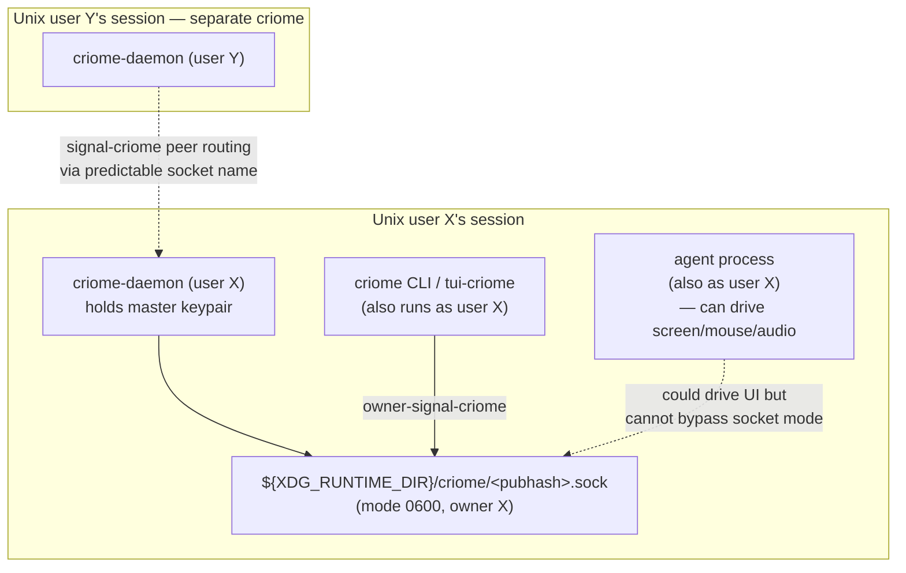

# 213 — Criome single-owner-as-Unix-user, master key, simple/complex policy, escalation flows

Date: 2026-05-17
Role: designer
Scope: `criome`, `signal-criome`, future `owner-signal-criome`,
deferred `tui-criome`.
Builds on: `reports/designer/212-criome-permission-model-and-op148-audit-2026-05-17.md`
(/212).
Companion ARCH edits in this commit: `criome/ARCHITECTURE.md`,
`signal-criome/ARCHITECTURE.md`, and `AGENTS.md` (report-discipline
stub move).

---

## 0 · TL;DR

User's follow-up clarification dissolves several of /212's
open items and adds load-bearing new substance that lands
directly in the criome ARCHITECTURE files. The headline moves:

- **A criome daemon has one owner: a Unix user.** Only that user
  can write to the daemon's socket. *Single-owner* is what gives
  the daemon its authority to sign — its master key acts on the
  user's behalf. The new `owner-signal-criome` contract is the
  surface between the user (and their CLI/TUI) and *their own*
  criome daemon.
- **Per-component Unix user is the real security boundary today.**
  In a world where any process running as user X can spawn an
  agent that drives the screen, mouse, keyboard, and audio of
  user X's session, GUI/process isolation no longer provides
  meaningful security separation. Only Unix-user filesystem
  permissions remain enforced. The criome ARCH now states this
  explicitly as its security model.
- **Master key as criome's identity.** Every criome daemon holds
  a master keypair as its core identity. The private half may be
  encrypted at rest; PIN/passphrase entry decrypts it in memory.
  Subkeys deferred to a future-possibility section.
- **Two policy classes:**
  - *Simple policy* — single-key self-owned. Criome holds the
    private key; only its own master-key signature is needed. The
    default and most common.
  - *Complex policy* — quorum. Needs criome's own signature **plus**
    signatures from peer criome daemons. Cross-criome routing
    solicits the additional signatures from named peers.
- **Two escalation kinds:**
  - *Escalation-to-sign* — criome's policy says "I will sign this,"
    so criome signs with its master key. The "approval to sign" is
    pre-baked into policy.
  - *Escalation-to-approve* — criome's policy says "ask my owner
    before I sign," so criome routes an approval request over
    owner-signal-criome to the owner's CLI/TUI client; the owner
    answers yes/no; criome then signs or denies.
- **tui-criome's triad shape resolved.** A criome daemon's owner
  client is `criome` (the one-shot CLI) and/or `tui-criome` (the
  long-running interactive variant). **Neither is a separate triad
  daemon.** Both are clients of the user's own `criome-daemon`, both
  speak `owner-signal-criome`. The TUI exists because escalation-to-
  approve needs a long-running client; the CLI cannot stay
  interactive across many escalations without becoming "dirty."
- **Predictable peer socket names.** Cross-criome routing finds peers
  by filesystem-predictable socket names: per Unix user, with a
  short hash of the daemon's master public key as the leaf component.
  Collision is inconvenient, not dangerous — signature verification
  still authoritative.
- **Policy schema (action-pattern granularity, weighted thresholds,
  etc.) is deferred to a "Future possibilities" section in
  criome/ARCHITECTURE.md.** Not immediate design work. The two
  policy classes above (simple/complex) are the immediate need.

The report-discipline stub I previously placed in
`skills/designer.md` is being moved to `AGENTS.md` in the same
commit — the rule applies to *all agents*, not designer-lane
specifically.

---

## 1 · The security model — Unix user is the boundary



The argument the criome ARCH now states:

> In a world of AI agents, a process running as Unix user X can
> spawn an agent that controls the entire user-X session —
> reading the screen, moving the mouse, listening to audio,
> typing keystrokes, observing window contents, recording the
> keyboard. The OS does not (and structurally cannot) prevent
> this within a single user's session. The illusion that "this
> sensitive operation runs in its own GUI process, so it's
> isolated" no longer holds. What *does* remain enforced is the
> kernel's Unix-user file permission model: a process running as
> user X cannot write a file (or socket) that user X does not
> have write permission on. **That is the security boundary
> criome adopts as its real one.** Owner-signal-criome's socket
> mode (0600, owned by the user) is what makes the owner
> relationship enforceable.

This is the design rationale for why owner-signal-criome's
authority anchor is the Unix user, not a higher-level abstraction.

### 1.1 What this is NOT a defence against

The model does not defend against:

- A compromised process running as the criome user. Once an
  attacker has the user's UID, they have everything criome can
  do. This is unavoidable in the stated threat model and
  acknowledged.
- Memory inspection by same-UID processes (`ptrace`,
  `/proc/<pid>/mem`, swap leaks, core dumps). Mitigated by daemon
  hardening (mlock keypages, disable core dumps, careful zeroing
  of decrypted material) — orthogonal to the transport choice.
- Cross-host attacks. The local-trust model covers
  within-user-within-host; cross-host peer routing crosses that
  boundary and needs additional wire crypto (§5.3 below).

### 1.2 Plaintext password over the local socket — evaluation

The user's reasoning was: *"if we're talking about a local socket
that only the user can write to, then I guess that sending a plain
text password to decrypt a key is not actually breaking the
security model."* Asked whether this is wrong.

**The reasoning is correct within the local trust boundary.** The
socket mode `0600` (owner X only) means any process that can write
to the socket already runs as user X. Such a process already has
all the same-UID memory-inspection capabilities listed above —
sending the password in cleartext over the socket adds no
attacker surface that didn't already exist.

The residual concerns are orthogonal to the transport:

1. **Memory zeroing.** The criome daemon must zero password bytes
   in memory after using them to decrypt the master key, and
   should `mlock` the decrypted key pages so they don't reach
   swap.
2. **Logging discipline.** Any code path that logs request
   payloads can leak the password. Standard discipline: do not
   log credential fields; ensure typed `Passphrase` newtype's
   `Debug`/`Display` are scrubbed.
3. **Core dump policy.** Disable core dumps for the criome
   daemon, or set `RLIMIT_CORE = 0`, so process death does not
   leak the master key.

**One important caveat: cross-host transport.** When criome-A on
host X needs a signature from criome-B on host Y (complex/quorum
policy with peers on other hosts), the peer-routing wire crosses
the Unix-user-on-one-host boundary. Plaintext over the network is
not inside the model and needs additional crypto — see §5.3.

---

## 2 · Master key and encryption at rest

A criome daemon's identity IS its master keypair. The clarifications:

| Property | Value |
|---|---|
| Generation | At first daemon startup, if no master key file exists. |
| Storage | Private half at a known path under the daemon's state dir; encrypted at rest using a passphrase the owner sets. |
| Decryption | On daemon startup (and on master-key re-bind), the owner sends the passphrase over owner-signal-criome; the daemon decrypts in memory. |
| Memory hardening | `mlock` decrypted key pages; zero plaintext password after decryption; disable core dumps. |
| Public half | Published as `criome.pub` at a known path; consumed by peer criome daemons and by consumers verifying criome-issued attestations. |
| Subkeys | Deferred to future-possibility — see criome ARCH §"Future possibilities". Subkeys would let criome create more specific permissions without revealing the master key. |

### 2.1 PIN/passphrase entry flow

```mermaid
sequenceDiagram
    participant Owner as Owner CLI/TUI (user X)
    participant Daemon as criome-daemon (user X)

    Note over Daemon: Cold start. Master key is encrypted on disk.
    Daemon-->>Owner: AwaitingPassphraseReply (subscribed)
    Owner->>Daemon: SubmitPassphrase{passphrase: PassphraseSecret}
    Note over Daemon: Decrypts master key in memory; mlock; zero plaintext.
    Daemon-->>Owner: MasterKeyUnlocked{public_key}
```

The wire types `SubmitPassphrase` and `MasterKeyUnlocked` are
sketched here; the contract pass on `owner-signal-criome` will
land the exact shape.

---

## 3 · Owner clients — CLI is the first; TUI is the long-running variant

The clarifications resolve /212 §3.6 (tui-criome triad shape):

- **`criome` CLI.** One-shot owner client. Speaks
  `owner-signal-criome`. The first owner client to build; sufficient
  for daemon startup, passphrase entry, configuration, and
  simple approval flows.
- **`tui-criome`.** Long-running interactive owner client. Speaks
  the same `owner-signal-criome` contract. Exists because
  escalation-to-approve flows need a client that stays connected
  to receive approval prompts (the daemon push-subscribes the TUI
  to pending approvals; the TUI presents and answers).

**Neither is a separate triad.** Both are clients of *the user's
own criome daemon*. The triad shape applies to the criome daemon
itself (daemon + CLI + contracts). tui-criome is an additional
client binary in the same repo (or a sibling repo if it grows
significant UI machinery), not a daemon of its own.

Open: whether `tui-criome` lives as a `[[bin]]` in the `criome`
repo or as a sibling `tui-criome` repo. The `[[bin]]` form is
simpler if the UI code stays small; a sibling repo is right if
the TUI grows ratatui-flavored state and event-loop machinery.
This is a non-load-bearing choice — defer to whoever picks up
the implementation. Bead `primary-izze` can be re-scoped or
closed as superseded.

### 3.1 What the CLI cannot do

A one-shot CLI cannot easily host escalation-to-approve flows
that span minutes-to-hours. It *could* run in a
"never-terminating, control-C to exit" mode that subscribes
indefinitely — but that is "dirty," per user direction: it
twists the CLI's one-shot shape into a long-running shape it
isn't designed for. The TUI exists to be the right shape for
long-running approval.

---

## 4 · Two policy classes — simple and complex

### 4.1 Simple policy — single-key self-owned

The most common case: criome's policy for a request kind says
*"I will sign this with my own master key."* Criome holds the
private key; the master signature alone satisfies authorization.

```text
Request arrives
  -> criome checks policy
  -> policy: SimpleSelfSigned
  -> criome's master-key signs the canonical request digest
  -> AuthorizationGrant returned
```

### 4.2 Complex policy — quorum across criome daemons

For requests above a certain trust threshold, policy demands a
quorum: criome's own signature plus signatures from N peer
criome daemons. Criome routes signature solicitations to the
named peers via `signal-criome`; peers route them through their
own owner approval flows; the aggregated signatures complete
the quorum.

```text
Request arrives
  -> criome checks policy
  -> policy: Quorum{ self_signs: true, peer_signers: [pk_B, pk_C], threshold: 2 }
  -> criome routes RouteSignatureRequest to peer B and peer C
  -> peers escalate to their owners (over their own owner-signal-criome)
  -> peers reply with SubmitSignature or RejectAuthorization
  -> criome aggregates; on threshold-met, signs with master key
  -> AuthorizationGrant returned with all required signatures
```

Either policy class may be paired with **escalation-to-approve**:
criome can require its owner to approve the use of its master key
even for simple policies, by routing a `RequestOwnerApproval`
event over owner-signal-criome before signing.

---

## 5 · Cross-criome peer routing — discovery and transport

### 5.1 Predictable socket names

Peer daemons find each other by predictable filesystem paths:

```text
<user-runtime-dir>/criome/<short-hash-of-master-pubkey>.sock
```

Where:

- `<user-runtime-dir>` is the peer's per-user runtime directory
  (typically `${XDG_RUNTIME_DIR}` = `/run/user/<uid>` on systemd
  hosts; resolved by the routing layer for the target user).
- `<short-hash-of-master-pubkey>` is a short hash (e.g., first
  8–16 hex chars) of the daemon's master public key. The hash is
  short enough to be ergonomic; collision-resistance comes from
  the actual signature verification, not the socket-name lookup.

**Collision is inconvenient, not dangerous.** If two daemons
hash to the same short form, the routing layer surfaces an
error and the operator (or the peer-routing table) names the
target by full pubkey or by another disambiguator. Even if a
collision routed the request to the wrong daemon, that daemon
cannot produce a valid signature for a key it does not hold —
verification at the requester would fail.

### 5.2 Peer-routing table

Each criome daemon's state owns a peer-routing table mapping
public keys to (host, user) pairs. When policy names a peer
signer by pubkey, criome looks up the (host, user) pair and
routes the solicitation to that peer's predictable socket
path.

The peer-routing table is mutated via owner-signal-criome
(`RegisterPeer`, `RetractPeer`); this is owner-class authority,
not ordinary signal-criome surface.

### 5.3 Cross-host transport — needs wire crypto

A cross-host criome-to-criome hop leaves the local Unix-user
trust boundary. `signal-core` frames between peers are NOT
encrypted by default. Options to close the gap:

| Option | Shape | Cost |
|---|---|---|
| TLS-wrapped signal-core | Each cross-host peer connection is a TLS socket. PKI rooted at criome master pubkeys (criome IS a PKI; criomes can issue certs for each other). | Standard but heavy; needs cert management. |
| Per-frame signed-and-encrypted envelope | Each cross-host signal-core frame is wrapped in a signed (and optionally encrypted) envelope. Simpler than TLS at this scale; uses primitives the system already has. | Designer pass needed to specify the envelope shape. |
| Inherent BLS-signed wire | Every cross-host frame is BLS-signed by sender's master key; receiver verifies before parsing. Encryption only when payload is sensitive (passphrase exchange should never cross hosts anyway). | Authenticity yes; confidentiality only for some payloads. |
| SSH tunneling | Cross-host criome traffic flows over SSH between criome users. Existing primitive; offloads crypto to SSH. | External dependency; adds ops burden. |

This is open design work. The criome ARCH names the gap; the
contract has not yet picked the option. Today's deployment is
single-host within one user's session, so the gap is not
blocking *today's* implementation — but it is blocking the
quorum-with-remote-peers feature.

---

## 6 · The two-worlds split — refined to three

/212 §1.5 named two worlds (signers and consumers). The
clarification refines into **three** kinds of clients, mapped to
two contracts:

| World | Speaks | What they do | Examples |
|---|---|---|---|
| **Owner** | `owner-signal-criome` | Configure the daemon, enter passphrase, register peers, approve escalations, mutate policy. Single per daemon, anchored at Unix user. | `criome` CLI, `tui-criome`. |
| **Peer signer** | `signal-criome` | Receive `RouteSignatureRequest` from another criome; produce or refuse a signature; cross-criome routing for quorum. | Another criome daemon (under another user or another host). |
| **Consumer** | `signal-criome` | Ask "is this allowed?"; receive yes/no. Trust the local criome's verdict; never touch cryptography. | `lojix-daemon` asking criome before a deploy effect. |

The contract split:

- `signal-criome` (ordinary) carries: peer-routing solicitations
  and submissions; consumer authorization requests, observations,
  and verifications; identity registration *for non-owner peers*;
  attestations.
- `owner-signal-criome` (new) carries: passphrase submission;
  master-key generation/rotation; peer-routing table mutation;
  policy mutation; escalation-to-approve prompts and replies.

This is sharper than /212's two-worlds framing and resolves the
question /212 §3.7 raised: **`RegisterIdentity` for the
daemon's own master key, peer registrations, and policy** are
owner-class operations and move to owner-signal-criome.
`RegisterIdentity` for *recording other identities the daemon
verifies signatures from* (e.g., a developer registering a new
host identity, with that registration signed by a developer
identity) stays on `signal-criome` as a peer/consumer
operation.

---

## 7 · Policy schema deferred to future-possibility

`/212 §3.1` opened the policy-schema question. User clarified:
the richer schema (action-pattern granularity, weighted
thresholds, per-request-kind eligibility) is a future
possibility, not immediate design work. The immediate need is
the two policy classes named in §4 above.

The criome ARCH gains a new "Future possibilities" section
naming:

- Action-pattern granularity (wildcards, request-kind matching,
  per-caller-class rules).
- Subkeys (criome creating sub-identities under its master key
  for more specific permissions without revealing the master).
- Quorum threshold expressions (weighted, n-of-m, m-of-n with
  veto, …).
- Richer policy mutation flows (multi-signed policy amendments).

These exist as future direction; today's criome implements
simple-self-signed and quorum-with-named-peers only.

---

## 8 · What lands in this commit

This report's substance is being staged into permanent docs in
the same commit:

### 8.1 `~/primary/AGENTS.md` §"Reports are for agents; chat is for the user"
- Add an opening sentence forcing `skills/reporting.md` to be
  read before substantive output of a session.
- Add the "context compaction + passable objects" rationale
  inline.

### 8.2 `~/primary/skills/designer.md` §"Working pattern"
- Remove the "Substantive output lives in a report" subsection
  added in /212's commit. The rule applies to all agents, not
  designer-lane; its proper home is AGENTS.md.

### 8.3 `/git/github.com/LiGoldragon/criome/ARCHITECTURE.md`
- New §"Security model — Unix-user as boundary."
- §"Authorization model" extended with the two policy classes
  and the two escalation kinds.
- §"Owned" extended with master keypair (encrypted at rest),
  peer-routing table, owner-signal socket.
- §"Trust model and key distribution" extended with passphrase
  flow, predictable peer socket naming.
- New §"Future possibilities" naming the deferred policy schema
  and subkeys.

### 8.4 `/git/github.com/LiGoldragon/signal-criome/ARCHITECTURE.md`
- §"Current authorization model" or new §"Contract scope"
  clarifying that `signal-criome` carries peer-routing and
  consumer surfaces; owner operations move to
  `owner-signal-criome`.
- §"Bootstrap convention" or new §"Peer discovery" naming the
  predictable peer socket names.
- §"Cross-host transport — open" naming the wire-crypto gap.

### 8.5 Not in this commit (next deliverables)

- `owner-signal-criome` contract crate — its own ARCH and
  `signal_channel!`. Separate designer report.
- Cross-host wire crypto choice — separate designer report.
- Operator implementation of master-key encryption-at-rest +
  passphrase flow — bead `primary-at7x` reframed (designer/213
  is the new shape it implements).

---

## 9 · Resolved or revised from /212

| /212 finding | Status |
|---|---|
| §3.1 Policy schema in criome's owned state | **Deferred to future-possibility in criome ARCH** (per user clarification). The two policy classes in §4 of this report are the immediate need. |
| §3.2 Two-worlds split not in contract | **Refined to three worlds (owner / peer / consumer) mapped to two contracts**. owner-signal-criome carries owner; signal-criome carries peer + consumer. |
| §3.3 Outright-refuse vs signature-denial distinction | **Still live.** The two escalation kinds (sign vs approve) make this sharper: a policy refusal is "no escalation needed, refused"; a sign-and-denied is "escalated to signing, signatures said no." The reply set still needs the disambiguation. Carry forward. |
| §3.4 Quorum threshold representation | **Still live.** The complex-policy case in §4.2 of this report makes this explicit — the threshold must travel with the grant. |
| §3.5 Cross-criome routing | **Substantively expanded** in §5 of this report — predictable socket naming, peer-routing table, cross-host transport gap. |
| §3.6 tui-criome triad shape | **Resolved.** tui-criome is an owner client, not a separate triad. CLI is the one-shot owner client; TUI is the long-running variant. |
| §3.7 owner-signal-criome surface | **Confirmed.** The user's clarification names owner-signal-criome as the single-owner surface anchored at Unix user. Next: contract sketch (separate report). |
| §3.8 Verb-mapping audit per designer/210 §6 | **Still live.** owner-signal-criome's verbs especially need the Mutate-authority lens — most owner-class operations *are* authority orders. |
| §3.9 Publication-vs-unresolved-schema risk | **Reduced** by the policy-schema deferral. The signal-criome contract is now more stable; owner operations were never in the published surface. |
| §3.10 No mermaid in op-148 | Closed — this report supplies them for the relevant flows. |
| §3.11 Lane crossing in op-148 | Closed — this report is in designer-lane and the ARCH edits go through designer authority. |

---

## 10 · Open items remaining after this report

1. **owner-signal-criome contract sketch** — request/reply
   vocabulary for passphrase submission, peer registration,
   policy mutation, escalation-to-approve prompts and replies.
   Separate designer report.
2. **Cross-host wire crypto choice** (§5.3 options). Separate
   designer report.
3. **Refuse-vs-deny reply disambiguation on signal-criome**
   (carry-forward from /212 §3.3).
4. **Quorum threshold representation on `AuthorizationGrant`**
   (carry-forward from /212 §3.4).
5. **`primary-izze` (tui-criome bead) re-scope.** No longer a
   separate triad — re-scope as "implement tui-criome as a
   long-running owner client" or close as superseded by the
   CLI being the first owner client.
6. **`primary-at7x` (criome routed-authorization daemon bead)
   reframe** — this report is the new shape; bead description
   should reference /213.

---

## 11 · Discipline correction — report-stub moved to AGENTS.md

The "Substantive output lives in a report" stub I added to
`skills/designer.md` §"Working pattern" in /212's commit was
mis-placed. The rule applies to every agent in every lane, not
designer-lane only. AGENTS.md is the right home (it is required
reading for every agent, and already carries the §"Reports are
for agents; chat is for the user" section that this stub
sharpens).

In this commit:

- `AGENTS.md` §"Reports are for agents; chat is for the user"
  gains a one-sentence opening that fires the
  `skills/reporting.md` read before substantive output.
- `skills/designer.md` §"Working pattern" loses the
  "Substantive output lives in a report" subsection (rolled
  back).
- `skills/reporting.md` retains the §2 sharpening (context
  compaction + passable objects rationale) from /212's commit.

---

## See also

- `~/primary/reports/designer/212-criome-permission-model-and-op148-audit-2026-05-17.md`
  (/212; the prior report this builds on — captured the
  policy+signatures clarification).
- `~/primary/reports/operator-assistant/148-criome-signature-authorization-decisions-2026-05-17.md`
  (op-148; the original capture this audit responds to).
- `~/primary/reports/system-assistant/21-criome-routed-authorization-and-thin-cli-shape-2026-05-17.md`
  (SYS/21; user's original answers on routed-authorization
  topology and caller shape).
- `~/primary/reports/designer-assistant/116-permission-scoped-signal-contracts-and-sockets-2026-05-17.md`
  (DA/116; OwnerSignal discipline — owner-signal-criome inherits
  the per-component Unix-user enforcement target named there).
- `~/primary/skills/component-triad.md` (tier 1; the triad
  applies to criome daemon; tui-criome is a client of that
  daemon, not a separate triad).
- `~/primary/skills/reporting.md` §"Why reports exist at all"
  (the canonical home of the chat-vs-report discipline that
  AGENTS.md now opens with).
- `/git/github.com/LiGoldragon/criome/ARCHITECTURE.md` (the
  destination ARCH this report's substance lands in).
- `/git/github.com/LiGoldragon/signal-criome/ARCHITECTURE.md`
  (the peer+consumer contract scope clarification lands here).
- Bead `primary-izze` (tui-criome — re-scope to "long-running
  owner client" or close as superseded).
- Bead `primary-at7x` (criome routed-authorization daemon —
  reframe per this report).
