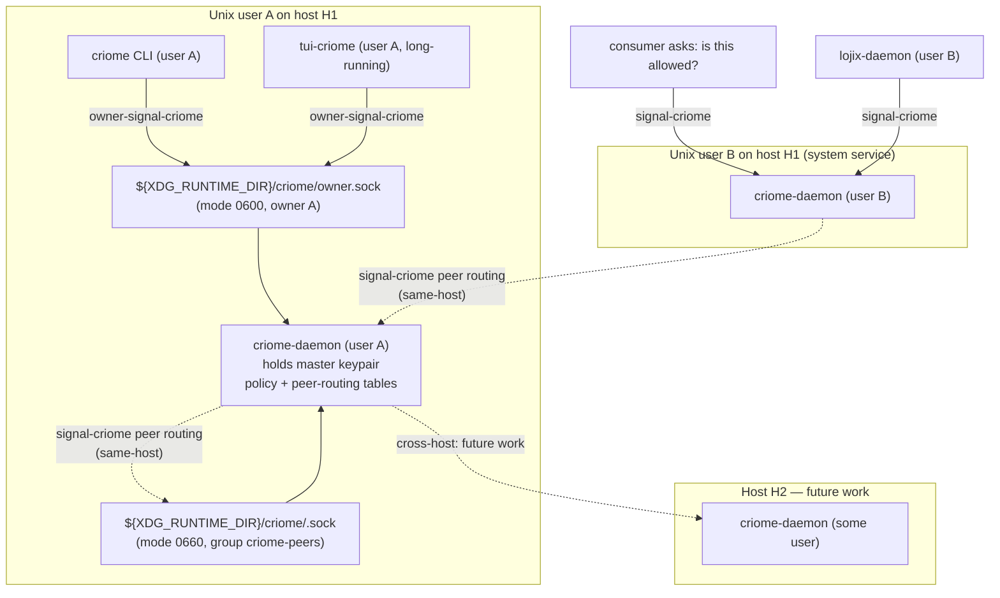

# 214 — Criome architecture record (consolidated)

Date: 2026-05-17
Role: designer
Scope: `criome`, `signal-criome`, future `owner-signal-criome`,
future `tui-criome` client.

Supersedes (deleted in this commit):

- `reports/designer/212-criome-permission-model-and-op148-audit-2026-05-17.md`
- `reports/designer/213-criome-owner-as-user-and-policy-classes-2026-05-17.md`

Reads alongside (other lanes' reports, left in place):

- `reports/system-assistant/22-audit-criome-routed-authorization-arc-2026-05-17.md`
  — parallel-lane cross-read audit surfacing additional open items
  this record carries forward in §11.
- `reports/system-specialist/141-lojix-criome-arca-implementation-synthesis-2026-05-17.md`
  — lojix-side synthesis; carries the `DeploymentArtifactSet`
  nine-digest shape and the *"no Nix effect before
  CriomeAuthorizationActor grant"* invariant.
- `reports/operator-assistant/148-criome-signature-authorization-decisions-2026-05-17.md`
  — earliest user-decisions capture; substance partly superseded by
  this record; left in place as historical.
- `reports/system-assistant/21-criome-routed-authorization-and-thin-cli-shape-2026-05-17.md`
  — original user direction on routed authorization + caller shape;
  partly superseded by this record.
- `reports/designer-assistant/116-permission-scoped-signal-contracts-and-sockets-2026-05-17.md`
  — OwnerSignal discipline that `owner-signal-criome` inherits.

The canonical statement of the architecture lives in:

- `/git/github.com/LiGoldragon/criome/ARCHITECTURE.md` at commit
  `4474bb8` (from /213's design pass).
- `/git/github.com/LiGoldragon/signal-criome/ARCHITECTURE.md` at
  commit `723e6c8` (from /213's design pass).

This report is the staging-and-audit record alongside those ARCHs.

---

## 0 · TL;DR

- **A criome daemon has one owner: a Unix user.** Only that user
  can write to the daemon's owner socket. *Single-owner* gives the
  daemon authority to sign with its master key.
- **Security model: Unix-user filesystem permission is the
  boundary.** In a world of AI agents, GUI / process isolation no
  longer provides meaningful security separation; what remains
  enforced is the kernel's user-file-permission model. The owner
  socket at mode `0600` is what makes the owner relationship
  enforceable.
- **Master keypair = the daemon's core identity.** Private half
  may be encrypted at rest; the owner submits the passphrase over
  `owner-signal-criome` at startup. Owner-session bytes are
  **encrypted on the wire** with an ECDH-derived symmetric session
  key so a different-UID attacker who manages to read the socket
  (TOCTOU on bind, symlink racing in the runtime dir, partial-frame
  protocol bug) still cannot recover passphrase or owner-class
  traffic.
- **Two contracts.** `signal-criome` carries the
  consumer-asking-criome and peer-criome-routing surfaces.
  `owner-signal-criome` (new contract, to land) carries the
  owner-Unix-user surface.
- **Two policy classes.** *Simple* — single-key self-owned
  (default). *Complex* — quorum across criome's own master plus
  named peer criome daemons.
- **Two escalation kinds.** *To sign* — policy is satisfied;
  criome signs autonomously. *To approve* — policy says
  *"ask my owner first"*; criome routes a prompt over
  owner-signal-criome.
- **Three client classes mapped to the two contracts.** Owner →
  owner-signal-criome. Peer-criome and consumer →
  signal-criome.
- **Peer discovery by predictable socket name.** Per-user
  runtime dir + short hash of the peer's master public key.
  Collision is *inconvenient* (routing layer disambiguates), not
  *dangerous* (signature verification is authoritative).
- **Cross-host network transport is future work.** Today's
  in-scope: single-host quorum (multiple Unix users on one
  host).
- **tui-criome and `criome` CLI are owner clients.** CLI is the
  one-shot variant; TUI is the long-running variant for
  escalation-to-approve flows. Neither is a separate triad
  daemon; both are clients of the user's own criome daemon over
  owner-signal-criome.
- **Many criome daemons per cluster.** One per Unix user; a
  cluster node that runs services as `lojix-system` AND hosts
  operator logins runs *multiple* criome daemons (one per
  participating user). Cross-criome routing is therefore
  two-axis: `(host, user)`.
- **Richer policy schema** (action-pattern granularity, weighted
  thresholds, subkeys) is deferred to `criome/ARCHITECTURE.md`
  §"Future possibilities".

---

## 1 · Topology



Authority flow: consumer asks; criome consults policy; criome
either refuses outright, or escalates to signing; signature
collection happens either autonomously (master-key self-sign) or
through escalation-to-approve to the owner (and/or peer
solicitations for quorum); criome aggregates and replies.

---

## 2 · Security model — Unix-user as the boundary

In a world of AI agents, **any process running as Unix user X can
spawn an agent that controls the entire user-X session** — reading
the screen, moving the mouse, listening to audio, typing
keystrokes, observing window contents. The OS does not (and
structurally cannot) prevent this within one user's session. The
illusion that *"this sensitive operation runs in its own GUI
process so it's isolated"* no longer holds.

What **does** remain enforced is the kernel's Unix-user file
permission model. A process running as user X cannot write a file
(or socket) that user X does not have write permission on. **That
is the boundary criome adopts.**

Owner-signal-criome's socket lives at mode `0600`, owned by the
daemon's Unix user. Only that user can write to it. Therefore
only that user can issue owner-class orders. Therefore the
daemon's authority to sign with its master key is anchored at the
Unix user.

### 2.1 Owner-session encryption with ECDH-derived session key

Owner-session bytes between owner client (CLI or TUI) and the
daemon are encrypted with a symmetric session key derived from an
ECDH handshake at the start of each connection. The shape:

```text
client                                   daemon
  |  --- ephemeral pubkey (ECDH) --->   |
  |  <--- ephemeral pubkey (ECDH) ---   |
  |     [HKDF-blake3(shared, salt)]     |   (both sides derive
  |                                     |    the same session key)
  |  --- AEAD-encrypted frames --->     |
  |  <--- AEAD-encrypted frames ---     |
```

Algorithms TBD by the `owner-signal-criome` contract pass:
candidates are Noise XX, or a hand-rolled X25519 + HKDF-blake3 +
ChaCha20-Poly1305 / AES-GCM AEAD. blake3 is already in criome's
dependency closure; X25519 and an AEAD primitive are the only new
dependencies. The handshake is a single round-trip.

Inside the encrypted session, the passphrase travels in cleartext.
Per the §2 boundary argument, *same-UID* processes can already
inspect the daemon's memory and would recover the master key
anyway; the encrypted session is defense-in-depth against
**different-UID** attackers who manage to read the socket's bytes
through:

- TOCTOU on the socket bind / runtime-dir permissions.
- Symlink-racing in the runtime dir before the daemon's
  `bind()` settles.
- A partial-frame protocol bug that allowed read access without
  full auth.

The hardening list is unchanged and still applies:

- `mlock` decrypted key pages so they don't reach swap.
- Zero passphrase bytes after use.
- Disable core dumps for the daemon (`RLIMIT_CORE = 0`).
- Log-discipline so passphrases never reach logs.

This decision resolves SYS/22 §4.5 (the
"plaintext-passphrase defense-in-depth" question). It commits the
owner-signal-criome contract to a session-encrypted shape from day
one; specific cipher choices land in that contract's design pass
(§11.8). The ARCH-prose absorption into `criome/ARCHITECTURE.md`
landed in op-149's commit `2b74697` (see §10.1).

### 2.2 What this model is NOT a defence against

- A compromised process running as the owner user. Once an
  attacker has the user's UID, they have everything criome can do.
  This is unavoidable in the stated threat model.
- Memory inspection by same-UID processes (`ptrace`,
  `/proc/<pid>/mem`, swap leaks, core dumps) — mitigated by the
  hardening list above, not by the boundary.
- Cross-host attacks. Cross-host transport is a separate concern
  and is future work (§9).

---

## 3 · Master key and encryption at rest

The criome daemon's identity IS its master keypair. Properties:

| Property | Value |
|---|---|
| Generation | At first daemon startup; if no master-key file exists, create one. |
| Storage | Private half at a known per-user path under the daemon's state dir; mode `0600`; encrypted at rest if the owner has set a passphrase. |
| Decryption | Owner submits passphrase over owner-signal-criome at startup, inside the ECDH-encrypted session (§2.1); daemon decrypts the master key in memory. |
| Memory hardening | `mlock` decrypted key pages; zero plaintext passphrase after use; disabled core dumps. |
| Public half | Published at a stable per-user well-known location; consumed by peer criome daemons and consumers verifying criome-issued attestations. |
| Subkeys | Deferred to `criome/ARCHITECTURE.md` §"Future possibilities". |

**Unattended-system-daemon bootstrap** — open. A `lojix-system`
user's criome on a cluster node cannot wait for a human at boot.
Lean v1: master key unencrypted at rest, filesystem-permission
protected; that matches the *"Unix-user file permission is the
boundary"* claim. v2: TPM-sealed passphrase with PCR-bound policy,
once TPM integration lands. Surfaced as §11.1.

---

## 4 · Owner clients — CLI (one-shot) and TUI (long-running)

The owner of a criome daemon (its single Unix user) speaks
`owner-signal-criome` through one of two clients:

- **`criome` CLI.** One-shot owner client. Sufficient for daemon
  startup (passphrase submission), configuration, peer
  registration, and simple approval flows. **Build first.**
- **`tui-criome`.** Long-running interactive owner client.
  Speaks the same `owner-signal-criome` contract. Stays connected
  to receive `RequestOwnerApproval` push events and answer them.
  Necessary for *escalation-to-approve* flows that span
  minutes-to-hours. **Build after the CLI proves the owner
  surface.**

Neither is a separate triad daemon. Both are clients of *the
user's own criome daemon*. The triad shape applies to the criome
daemon itself (daemon + CLI + contracts). Whether `tui-criome`
lives as a `[[bin]]` in the `criome` repo or as a sibling repo is
a non-load-bearing choice; defer to whoever implements it.

The CLI **cannot easily host long-running approval** without
turning into a never-terminating, control-C-to-exit shape that
violates its one-shot discipline. The TUI exists to be the right
shape for that case.

---

## 5 · Two policy classes — simple and complex

### 5.1 Simple — single-key self-owned

The most common case: criome's policy for a request kind says
*"I will sign this with my own master key."* No peer solicitation.

```text
Request arrives
  -> criome checks policy
  -> policy: SimpleSelfSigned
  -> criome's master signs the canonical request digest
  -> AuthorizationGrant returned
```

### 5.2 Complex — quorum across criome daemons

For requests above a trust threshold, policy demands criome's own
signature plus signatures from N named peer criome daemons.

```text
Request arrives
  -> criome checks policy
  -> policy: Quorum { self_signs: true, peers: [pk_B, pk_C], threshold: 2 }
  -> criome routes RouteSignatureRequest to peer B and peer C
  -> peers escalate to their own owners (over their own owner-signal-criome)
  -> peers reply with SubmitSignature or RejectAuthorization
  -> criome aggregates; on threshold-met, signs with master
  -> AuthorizationGrant returned with all signatures + the satisfied threshold spec
```

Either class may be paired with **escalation-to-approve** (§6).
Today the two classes plus the two escalation kinds are the
implementation surface. Action-pattern granularity, weighted
thresholds, m-of-n with veto, and richer schema are deferred to
the criome ARCH's "Future possibilities" section.

---

## 6 · Two escalation kinds — sign and approve

| Kind | What happens | Who responds |
|---|---|---|
| **Escalation-to-sign** | Policy says "I will sign this"; criome's master signs the canonical digest. | criome itself, autonomously. |
| **Escalation-to-approve** | Policy says "ask my owner before I use my master"; criome routes a `RequestOwnerApproval` push event over owner-signal-criome; owner answers yes/no via CLI or TUI; criome then signs or denies. | The owner Unix user (via CLI / TUI). |

The two are orthogonal to policy class: a simple policy may
require approval each time; a complex policy's *own* signature
may be auto-signed while peers each independently escalate to
their owners.

**Configurability of "always approve" vs "auto-sign"** — open.
SYS/22 Q7: per-policy-record boolean, scope-pattern predicate, or
part of the deferred richer schema. Surfaced as §11.5.

---

## 7 · Three client classes mapped to two contracts

| Class | Contract | What they do | Examples |
|---|---|---|---|
| **Owner** | `owner-signal-criome` | Configure the daemon, submit passphrase, register peers, mutate policy, answer approval prompts. One per daemon, anchored at Unix user. | `criome` CLI, `tui-criome`. |
| **Peer signer** | `signal-criome` | Receive `RouteSignatureRequest` from another criome; produce or refuse a signature; cross-criome routing for quorum. | Another criome daemon (under another user, today same-host; future cross-host). |
| **Consumer** | `signal-criome` | Ask *"is this allowed?"*; receive yes/no. Trust the local criome's verdict; never touch cryptography. | `lojix-daemon` asking before a deploy effect. |

The contract split:

- `signal-criome` carries peer-routing solicitations and
  submissions; consumer authorization requests, observations, and
  verifications; identity registration for non-owner peers;
  attestations.
- `owner-signal-criome` carries passphrase submission; master-key
  operations; peer-routing-table mutation; policy mutation;
  escalation-to-approve prompts and replies.

**Identity-registration placement** — open. The current
`signal-criome` carries `RegisterIdentity` (e.g., a Developer
registering a Host). Owner-class identity registration (the
daemon's own master) belongs on owner-signal-criome. Whether the
third-party variant stays on signal-criome or migrates is
unspecified. Surfaced as §11.4.

---

## 8 · Peer discovery — predictable socket names

Peer criome daemons (same host today, cross-host as future work)
find each other by predictable socket name:

```text
${PER_USER_RUNTIME_DIR}/criome/<short-hash-of-master-pubkey>.sock
```

`<short-hash-of-master-pubkey>` is a short hash (8–16 hex chars) of
the peer daemon's master public key. The hash is short for
ergonomics; signature verification at the requester is the
authoritative check. **Collision is inconvenient, not dangerous:**

- A short-hash collision triggers a disambiguation error at the
  routing layer; the operator (or the peer-routing-table entry)
  names the target by full public key, and the routing layer
  resolves through a fallback path (e.g., a long-hash form, or by
  reading the public key file at the socket's sibling path).
- A wrong-daemon dispatch cannot forge a signature for a key it
  does not hold; verification at the requester fails.

**Cross-user-same-host routing** — open. A `lojix-system` user
service that needs an operator signature cannot trivially traverse
the operator's per-user runtime directory by default. Candidates:
same-host TCP loopback with peer-credential authentication; a
persistent system-level routing socket. Surfaced as §11.2.

---

## 9 · Cross-host network transport — future work

Local Unix sockets do not cross hosts. Quorum policies that name
peers on other hosts require a wire-crypto layer; that layer is
**deferred**.

For reference (no choice made), candidate shapes are:

| Option | Shape |
|---|---|
| TLS-wrapped signal-core | Cross-host peer connections are TLS sockets. PKI rooted at criome master pubkeys (criome is intrinsically a PKI — see §13). |
| Per-frame BLS-signed envelope | Each cross-host frame is BLS-signed by sender's master; receiver verifies before parsing. Reuses the cryptographic primitive criome already requires. |
| SSH tunnelling | Cross-host traffic flows over SSH between criome users. Offloads crypto to SSH; adds dependency. |

Today's scope is **single-host quorum** (multiple Unix users on
one host). The peer-routing table can hold (host, user) pairs
without the host slot being filled until cross-host lands.

The choice belongs to a future designer report. Until then:
cross-host policy slots fail closed (`AuthorizationUnavailable`
with a typed reason naming the gap).

---

## 10 · Discipline notes

- `AGENTS.md` §"Reports are for agents; chat is for the user"
  carries the forcing-function opening (read `skills/reporting.md`
  before substantive output) — landed in /213's commit.
- `skills/reporting.md` §"Why reports exist at all" includes the
  context-compaction + passable-objects rationale — landed in
  /213's commit.

---

## 10.1 · Implementation state — op-149

`reports/operator-assistant/149-criome-designer-214-implementation-pass-2026-05-17.md`
records the first operator-assistant pass against this design.
Substance landed:

In `signal-criome` (commits `9dff026` *model authorization policy
satisfaction* + `bd98b9d` *document authorization policy evidence*):

- `RequiredSignatureThreshold(u16)` typed newtype.
- `AuthorizationPolicyClass` closed enum (Simple / Quorum).
- `AuthorizationPolicySatisfaction { policy_class, required_signature_threshold, ... }`
  — the satisfied-policy evidence that travels with grants.
- `AuthorizationGrant` carries `policy_satisfaction` plus the
  signers that satisfied it.
- `AuthorizationStatus::Signing` for in-flight signature work.
- `AuthorizationDenial { source: AuthorizationDenialSource, reason:
  AuthorizationDenialReason }` separating policy-refusal from
  signer-refusal.
- Round-trip witnesses for every new variant; absence-of-owner-
  class-operations witness.

In `criome` (commit `2b74697` *add routed authorization
coordinator skeleton*):

- `AuthorizationCoordinator` Kameo actor under `CriomeRoot`,
  routing the routed-authorization request variants.
- Sema tables for authorization request state, signature
  solicitations, submitted signatures.
- Owner socket bind path sets mode `0600`; witness test asserts
  this.
- ECDH/AEAD owner-session wording landed in
  `criome/ARCHITECTURE.md` and `criome/skills.md`; Nix check fails
  if the stale plaintext-passphrase wording is reintroduced. (This
  is the ARCH-prose absorption that §2.1 said was queued — now
  landed.)

This closes the architecture-side of §11.6 (decided +
ARCH-absorbed), §11.7 (denial-source split), and §11.8 (threshold
on grants). The remaining items below are either still open from
the design pass or new known-debt items op-149 surfaced.

---

## 11 · Open items

The architecture is settled enough for implementation to proceed
on the simple-policy + same-host paths. The items below are
either decisions awaiting user direction or design passes that
must precede later phases.

| Item | Source | What's open |
|---|---|---|
| 11.1 Unattended-system-daemon bootstrap | SYS/22 §5, Q4 | A `lojix-system` user's criome has no human at boot. Lean v1: unencrypted master key, filesystem-permission-protected. v2: TPM-sealed. Needs user direction before cluster-side criome ships. |
| 11.2 Cross-user-same-host routing | SYS/22 Q1 | The predictable-socket-name pattern breaks across Unix-user runtime dirs. Candidates: TCP loopback w/ peer auth, persistent system-level routing socket. Needs design pass. |
| 11.3 System criome's role | SYS/22 Q2 | Full participant vs machine identity only. Lean: full participant under operator-set policy. Needs confirmation. |
| 11.4 RegisterIdentity placement | This record §7 | Owner-class moves to owner-signal-criome; third-party variant stays on signal-criome by default; needs explicit decision. |
| 11.5 Escalation-to-approve configurability | SYS/22 Q7 | Per-policy boolean vs scope-pattern predicate vs part of deferred schema. |
| 11.6 Verifier policy vs originator policy | SYS/22 Q10 | When peer B verifies a `SignedObject` from peer A, does B check signers-acceptable-by-A's-policy or B's-policy? Likely: `SignedObject` carries the satisfied policy spec; B verifies signatures-valid AND spec-acceptable-by-B's-policy-for-this-action. Needs wire definition. |
| 11.7 SignedObject canonical bytes | SYS/141 Q3, SYS/22 Q5 | Which fields are inside the signed digest (request_id, target cluster/node, action, expiry, anti-replay nonce, issuing criome identity). Cross-lane (designer + system-specialist). |
| 11.8 owner-signal-criome contract sketch | This record | Request/reply vocabulary for passphrase submission, peer registration, policy mutation, escalation-to-approve prompts and replies. Plus the ECDH-handshake-then-AEAD-encrypted-session wire shape from §2.1 (cipher-suite choice — Noise XX vs hand-rolled X25519 + HKDF-blake3 + ChaCha20-Poly1305/AES-GCM — belongs to this design). Next designer report. |
| 11.9 Operator-offline-mid-quorum | SYS/22 Q12 | Pending-authorization state needs to track who is solicited but not yet responded so the operator on next login sees what awaits them. Spec gap in `ObserveAuthorization`. |
| 11.10 `ObserveAuthorization` push stream | op-149 known debt | The current `AuthorizationCoordinator` returns a snapshot only; no push deltas. This is a polling-shape gap per `ESSENCE.md` §"Polling is forbidden" — must land before consumers can subscribe operationally, and is the prerequisite for §11.9 (operator-offline visibility). |
| 11.11 Typed slot for authorization requests | op-149 known debt | Authorization request slots are currently derived from the digest string. Per `ESSENCE.md` §"Infrastructure mints identity": identity is the slot; the store mints, the agent receives in the reply. Replace with a `Slot<AuthorizationRequest>` allocator before authorization state becomes operationally important. |
| 11.12 Real signature verification in `VerifyAuthorization` | op-149 known debt | Currently checks digest equality only. Full BLS verification against the registered signers' public keys is required for the "permission comes from signatures" claim to hold. |
| 11.13 Master-key signing for simple-self-signed policy | op-149 known debt | The coordinator records pending state and stores solicitation/submission records but does not sign with criome's master key. The first signing path (simple-self-signed policy → `AuthorizationGrant` with master-key signature) is the most load-bearing next implementation slice. |
| 11.14 Replay-guard + expiry enforcement | op-149 known debt | `criome/ARCHITECTURE.md` §8 names replay protection and expiry as constraints; the coordinator skeleton does not yet enforce either. |

---

## 12 · Bead admin

- **`primary-izze`** ("tui-criome: Sema-backed signing client and
  TUI") — re-scope. New target: *"tui-criome: long-running owner
  client of own criome daemon over owner-signal-criome (no
  separate signing-client component)."* Old framing (separate
  signing client with its own Sema database for signing-client
  keypairs) is superseded.
- **`primary-at7x`** ("criome: add routed authorization contract
  and daemon skeleton") — in flight. Op-149's pass landed the
  contract types, the coordinator actor skeleton, the Sema state
  tables, socket-mode `0600` witness, and the ECDH/AEAD ARCH text
  (commits `9dff026`, `bd98b9d` on `signal-criome`; `2b74697` on
  `criome`). Bead remains open; the load-bearing remaining slices
  are §11.10 (push stream), §11.11 (typed slot), §11.12 (real
  signature verification), §11.13 (master-key signing), §11.14
  (replay-guard + expiry). Bead description should be refreshed
  to name those slices so the next operator-assistant pass picks
  up unambiguously.
- **New bead suggested**: *"design owner-signal-criome contract
  surface"* — `role:designer`, follows from §11.11.
- **New bead suggested**: *"design cross-user-same-host criome
  routing"* — `role:designer`, follows from §11.2.
- **New bead suggested**: *"decide unattended-system-criome
  bootstrap (v1)"* — `role:designer` or
  `role:system-specialist`, follows from §11.1.

---

## 13 · Architectural strength — criome IS a PKI

Worth surfacing as a load-bearing observation (per SYS/22 §7.4):

> ClaviFaber registers nodes → criome master keys anchor identity
> → the peer-routing table is the trust topology → the cluster
> has a CA hierarchy intrinsic to its substrate, without needing
> a separate CA component.

Implications worth carrying forward:

- The TLS option for cross-host transport (§9) is cheap *because*
  cert issuance is intrinsic.
- Cross-component trust uniformity: every component that needs to
  verify "is this signed by an authority I trust?" can resolve the
  question through criome's identity registry without an external
  PKI dependency.
- Future TLS termination for sensitive UIs can use criome-issued
  certs.

This is one of the most powerful features of the architecture and
deserves to remain visible as decisions accumulate.

---

## See also

- `~/primary/skills/component-triad.md` — every stateful component
  is daemon + thin CLI + signal contract. Criome fits; tui-criome
  is a client of that daemon, not a separate triad.
- `~/primary/skills/reporting.md` — the report-vs-chat discipline
  this record obeys.
- `~/primary/ESSENCE.md` §"Today and eventually — different things,
  different names" — the scope discipline criome ARCH applies
  (today's Spartan substrate vs eventual Sema-on-Sema Criome).
- `~/primary/AGENTS.md` §"Reports are for agents; chat is for the
  user" — the workspace's report-discipline (updated in /213's
  commit).
- `/git/github.com/LiGoldragon/criome/ARCHITECTURE.md` — canonical
  ARCH at commit `4474bb8`.
- `/git/github.com/LiGoldragon/signal-criome/ARCHITECTURE.md` —
  canonical ARCH at commit `723e6c8`.
- `reports/system-assistant/22-audit-criome-routed-authorization-arc-2026-05-17.md`
  — cross-lane audit; carries the §11 open items this record
  consolidates.
- `reports/system-specialist/141-lojix-criome-arca-implementation-synthesis-2026-05-17.md`
  — lojix-side synthesis; `DeploymentArtifactSet` nine-digest shape
  and the "no Nix effect before CriomeAuthorizationActor grant"
  invariant.
- `reports/operator-assistant/148-criome-signature-authorization-decisions-2026-05-17.md`
  — earliest user-decisions capture; partly superseded; left in
  place as historical.
- `reports/system-assistant/21-criome-routed-authorization-and-thin-cli-shape-2026-05-17.md`
  — original user direction; partly superseded.
- `reports/designer-assistant/116-permission-scoped-signal-contracts-and-sockets-2026-05-17.md`
  — OwnerSignal discipline.
- Bead `primary-izze` (tui-criome — re-scope).
- Bead `primary-at7x` (criome routed authorization — in flight in
  operator-assistant lane against /213's design).
