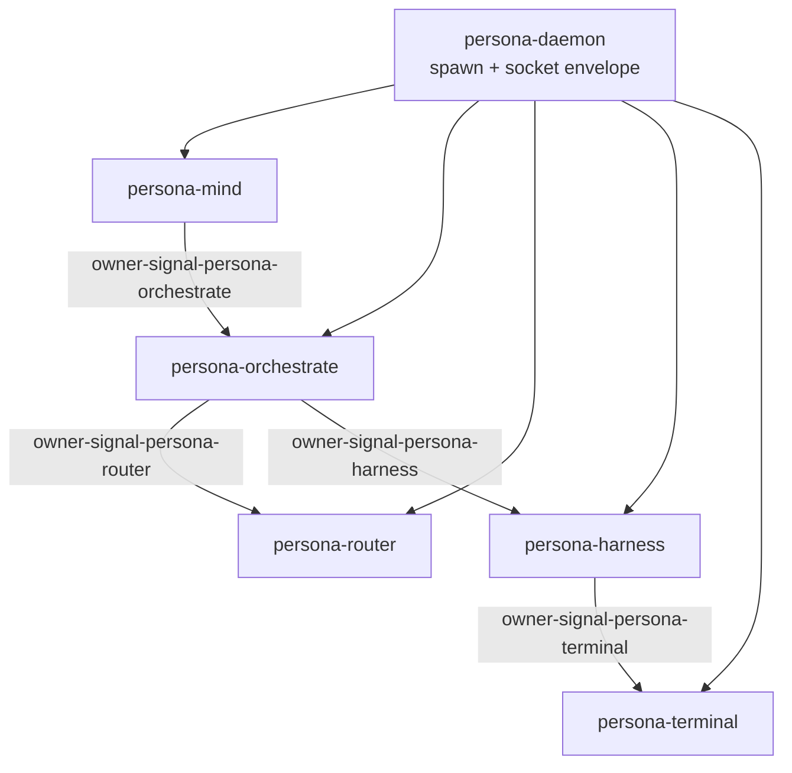

# 219 — Persona-orchestrate state (2026-05-18)

*Topic compendium for the persona-orchestrate component design arc.
Part of the 2026-05-18 workspace state-of-art series. Master index
lives in
`reports/designer/215-workspace-state-of-art-2026-05-18.md`.*

---

## 1 · State of art

The persona-orchestrate design crystallized over 2026-05-17 into a
near-complete contract architecture with a settled deployment shape
(**full triad daemon**) and a freshly-introduced **lane-registry-as-config**
direction that dissolves the RoleName contract gap.

**Settled.**

- persona-orchestrate is a real triad component (daemon + CLI + `signal-*` contract + sema-engine state). Not a wrapper around `tools/orchestrate`.
- `persona-mind` owns it (one inbound owner edge).
- Two contract surfaces required — `signal-persona-orchestrate` (ordinary) and `owner-signal-persona-orchestrate` (OwnerSignal); possibly a third `observe-signal-*`.
- First OwnerSignal chain ships end-to-end in the first pass (`orchestrate → router/harness`).
- CLI uses one actor per contract surface.
- Submissions (`Assert`) and orders (`Mutate`) are crisply distinguished.

**In flight.**

- Bead `primary-699g` (designer pickup): verb-mapping, identity newtypes, registry surface, startup reconciliation.
- `signal-persona-orchestrate` contract crate is unwritten (only sketched as a verb table in DA/115 §5 and DA/116 §8).

**Not started.**

- `persona-orchestrate` daemon (no repo; no Sema schema).
- Executor-management relation in `signal-persona-harness`.
- OS-enforced per-component Unix identities (deferred for prototype per operator/134).

---

## 2 · Load-bearing reports

| Path | Carries |
|---|---|
| `reports/second-designer-assistant/6-roles-as-config-owner-socket-mutable-2026-05-17.md` | Current canonical for registry-as-config direction; path-4 RoleName resolution; `LaneRegistry*` family sketch; five open questions. |
| `reports/designer-assistant/115-orchestrate-integration-architecture-2026-05-17.md` | Canonical for four-layer split (helper/mind/orchestrate/persona-daemon); the full mind→orchestrate→router/harness Mermaid; contract surface sketch (§5); spawn-pipeline sequence (§4.4); seven open questions. |
| `reports/designer-assistant/116-permission-scoped-signal-contracts-and-sockets-2026-05-17.md` | Canonical OwnerSignal; five settled A1-A5 answers in §13; candidate owner graph (§9); per-component contract-vs-socket discipline. |
| `reports/second-operator-assistant/1-rust-port-of-tools-orchestrate-2026-05-17.md` | Implementation report for the shipped Rust port; §3 contract-gap finding is seed of sec-DA/6 path 4. |
| `reports/operator/134-terminal-orchestrate-porting-decisions-2026-05-17.md` | User-approved decisions: `CreateSession=Mutate`; "communication socket" vs "supervision socket" naming; mind owns durable orchestration policy truth; orchestrate may issue downstream router grants; prototype skips real Unix permission enforcement. |
| `reports/designer/210-component-triad-decisions-and-mutate-authority-2026-05-17.md` | Mutate authority semantics; the `LaneRegistry*` Mutate family obeys this discipline. |

---

## 3 · Stale / superseded reports

Confirmed retired via jj history:

- `reports/second-designer-assistant/{1,2,3,4}` agglomerated into /5 (commit `03a9f94d`).
- `reports/second-designer-assistant/5-orchestrate-arc-state-and-intent-2026-05-17.md` deleted (commit `e77a8067`) — substance moved to DA/115 + DA/116 + operator/1.

On-disk and still authoritative: only second-DA/6. No other stale orchestrate-topic reports remain in the second-designer-assistant lane.

---

## 4 · Authority chain

Per DA/115 §0 (also DA/116 §9):

| Link | Runtime status |
|---|---|
| `persona-daemon → mind` (spawn + socket envelope) | **implemented** in current daemon stack |
| `mind → orchestrate` (`owner-signal-persona-orchestrate`) | **designed only**; contract not written; daemon not built |
| `orchestrate → router` (`owner-signal-persona-router`) | **designed only** |
| `orchestrate → harness` (`owner-signal-persona-harness`) | **designed only**; requires new executor-management relation that doesn't exist yet (DA/115 §4.5) |
| `harness → terminal` (`owner-signal-persona-terminal`) | **contract-only first slice**; `CreateSession`/`RetireSession` shipped in contract; daemon stubs `NotBuiltYet` (see /218) |
| `tools/orchestrate` (transitional Rust port) | **implemented** at `/home/li/primary/orchestrate-cli/` (commit `1730087a`, bead `primary-68cb` closed). Bypasses not-yet-built mind→orchestrate chain by writing lock files directly. |

---

## 5 · The five settled OwnerSignal answers (DA/116 §13)

1. **A1** — Per-component Unix users/groups first. Owner sockets are OS security boundaries; same-UID is unsafe author-only dev. First implementation targets per-component Unix users/groups with mode/group ACLs; inherited FDs are a future hardening path; runtime credential gates explicitly *not* the main design. (operator/134 approves same-UID for the prototype while keeping the architecture target.)
2. **A2** — Naming is `owner-signal-*`. Repos: `owner-signal-<component>`; Rust crates: `owner_signal_<component>`; concept: "OwnerSignal" in prose.
3. **A3** — Candidate owner graph good enough for now. `persona-daemon → mind`; `mind → orchestrate`; `orchestrate → router`; `orchestrate → harness`; `persona-terminal` ownership routed through `harness` or `orchestrate` later.
4. **A4** — Build OwnerSignal chain end-to-end in first pass. Create `owner-signal-persona-orchestrate`, `owner-signal-persona-router`, `owner-signal-persona-harness` so the chain is represented rather than only the first link.
5. **A5** — One actor per Signal contract surface. A daemon/CLI may bind to multiple sockets the OS permits, but each Signal contract gets its own actor that knows its socket path from typed configuration. No generic actor sends arbitrary frames to arbitrary sockets.

---

## 6 · RoleName gap — path 4

User direction in second-DA/6: **roles come from config at startup and are mutable via the owner-socket; they are records, not a runtime enum.** This **dissolves** the gap rather than resolving it.

Concrete implications for `signal_persona_mind::RoleName` (currently the closed 8-variant enum at `signal-persona-mind/src/lib.rs:81-90`):

- `RoleName` enum disappears from the contract surface.
- Replaced by `LaneIdentifier` newtype carrying an opaque-to-the-contract stable id (shape open — see Q1 below; weak recommendation is typed slot per `ESSENCE.md` §"Infrastructure mints identity").
- The *set* of valid identifiers becomes runtime registry state owned by `persona-orchestrate` (a `LaneRegistry` table in its sema-engine database).
- Contract change cascades to `RoleClaim`, `RoleRelease`, `RoleHandoff`, `RoleObservation`, `ActivitySubmission`.
- The `Lane` enum at `orchestrate-cli/src/lane.rs` (closed 11 variants) becomes a registry lookup.
- `owner-signal-persona-orchestrate` gets a new `LaneRegistry*` family: `RegisterLaneOrder` (Mutate), `RetractLaneOrder` (Retract), `UpdateLaneMetadataOrder` (Mutate), `LaneRegistrySnapshotQuery` (Match), `LaneRegistrySubscription` (Subscribe). The ordinary surface gets a read-only paired family.
- New lanes (`third-designer-assistant`, future raw-LLM-executor lanes, ad-hoc multi-agent collaboration lanes) land via owner-Mutate without recompiling any contract.

Bead `primary-jboc` (RoleName gap) should be reframed with path 4 added; sec-DA/6 recommends keeping it open and letting designer evaluate path 4 against paths 1-3 from operator-assistant/1 §3.

---

## 7 · Open questions

### From second-DA/6 §4 (registry-as-data direction)

1. **Q1** — What shape is `LaneIdentifier`? `(String)` (simplest, stringly-typed risk), `(LaneHash)` (aligns with ESSENCE versioning), or `(Slot<LaneRecord>)` (aligns with infrastructure-mints-identity; sec-DA's weak recommendation).
2. **Q2** — Startup reconciliation when `roles.nota` config diverges from persisted sema-engine `LaneRegistry`: config wins / state wins / owner adjudicates / append-only.
3. **Q3** — Beads label and `assistant-of` resolution under dynamic registration: can a runtime-registered lane be a main role (new beads label)? If `assistant-of` mutates, what happens to in-flight beads?
4. **Q4** — Permission boundary on the ordinary surface: if any caller can `LaneRegistrySubscription`, can it `ScopeAcquisitionSubmission` as any lane? Likely needs peer-credential ↔ lane-identity binding (composes with DA/116 §5 OS-enforcement).
5. **Q5** — Migration path staging: should the three stages (signal-persona-mind contract change → orchestrate-cli registry → persona-orchestrate live) get separate beads or sit under `primary-699g`'s expanded scope?

### From DA/115 §10 (orchestrate integration)

- Q1 (settled in op/134), Q2 (settled in op/134), Q3 ("agent" identity: lane vs agent-run vs holder vs work-item), Q4 (partially settled by DA/116), Q5 (settled: orchestrate has own database), Q6 (executor management in `signal-persona-harness` or generic `signal-persona-executor`?), Q7 (settled in op/134: `tools/orchestrate` remains transitional).

### From DA/115 §8 (contract drift, all open)

- §8.1 `ChannelGrant` Assert→Mutate verb mismatch.
- §8.2 `AcquireScope` split between submission (Assert) and order (Mutate).
- §8.4 Scope identity needs typed `Scope` enum, not raw lock-file strings.

### From second-DA/6 §6.2 (adjacent)

- Mutate transaction boundaries in the mind→orchestrate→router/harness chain (atomicity of multi-step spawn). Owned by `primary-699g`.
- Orchestrate-spawned runs: can they `ScopeAcquisitionSubmission` directly, or only act on mind's `AcquireScopeOrder`?

---

## 8 · Implementation state

| Surface | Status |
|---|---|
| `orchestrate-cli` Rust port | **shipped** at `/home/li/primary/orchestrate-cli/` (commit `1730087a`, bead `primary-68cb` closed). 40 tests passing; byte-for-byte parity with shell helper; thin `signal-persona-mind` client. `tools/orchestrate` is a four-line bash shim that exec's the release binary. Pending: Nix flake check wrapper. |
| `persona-orchestrate` daemon | **not started**. No repo, no daemon binary, no sema-engine schema. Bead `primary-699g` is the designer pickup. |
| `signal-persona-orchestrate` contract | **not written**. Sketched as verb table in DA/115 §5 + DA/116 §8.1. No crate. |
| `owner-signal-persona-orchestrate` contract | **not written**. Sketched in DA/116 §8.2 + extended in sec-DA/6 §3.2 with `LaneRegistry*`. |
| `owner-signal-persona-router` / `owner-signal-persona-harness` | **not written**. Required for end-to-end first-pass chain (A4 from DA/116 §13). |
| Executor-management relation in `signal-persona-harness` | **not written**. Blocks real `SpawnAgentOrder` (DA/115 §4.5, §8.3). |
| Per-component Unix identities | **deferred** for prototype per operator/134; architecture target retained. |

---

## 9 · Recommendations for context maintenance

When designer absorbs `primary-699g` into a definitive persona-orchestrate design report, these retirements apply (per sec-DA/6 §6's stated trigger and `skills/context-maintenance.md`):

- `reports/second-designer-assistant/6-roles-as-config-owner-socket-mutable-2026-05-17.md` — retires when designer absorbs §3 (RoleName path 4 → `LaneRegistry*` family) and §4 (five open questions).
- `reports/designer-assistant/115-orchestrate-integration-architecture-2026-05-17.md` — retires when designer absorbs §3 (four-layer split), §4 (relations + Mermaid spawn sequence), §5 (contract sketch), §8 (current drift).
- `reports/designer-assistant/116-permission-scoped-signal-contracts-and-sockets-2026-05-17.md` — likely promotes to a skill (`skills/owner-signal.md` or extends `skills/contract-repo.md`) since it generalizes beyond orchestrate; retires once the skill captures §1-§9 + the five A1-A5 settlements.
- `reports/second-operator-assistant/1-rust-port-of-tools-orchestrate-2026-05-17.md` — keep as implementation record for the closed bead; §1-§2 implementation record is durable provenance.
- `reports/operator/134-terminal-orchestrate-porting-decisions-2026-05-17.md` — keep; user-approved decisions are durable.
- `reports/designer/210-component-triad-decisions-and-mutate-authority-2026-05-17.md` — keep as canonical Mutate authority + triad shape.

**Holding pattern until designer pickup:** sec-DA/6 is the single live entry point for the registry-as-config direction; DA/115 + DA/116 + operator/134 are the live entry points for integration + OwnerSignal + decision context; second-OA/1 is the live implementation record. No duplication to clean up yet.

---

## See also

- `reports/designer/215-workspace-state-of-art-2026-05-18.md` — master.
- `reports/designer/218-persona-terminal-consolidation-state-2026-05-18.md` — `harness → terminal` link in the authority chain.
- `reports/designer/216-criome-routed-authorization-state-2026-05-18.md` — adjacent: OwnerSignal discipline.
