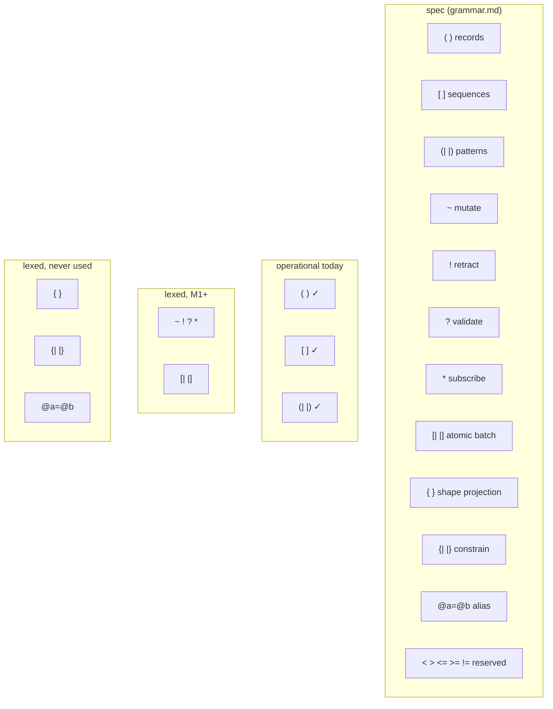
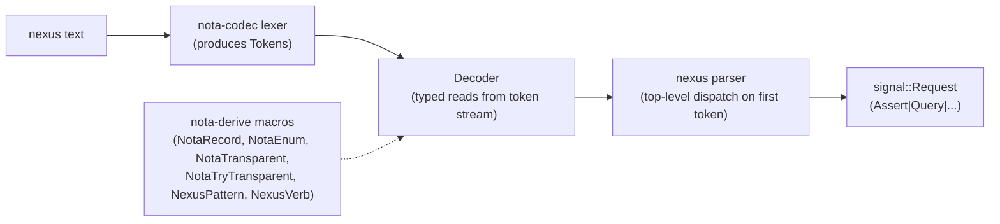
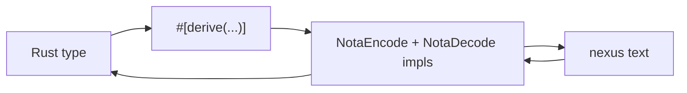

# Nexus — state of the language

Status: deep audit + recommendations
Author: Claude (designer)

A close read of nexus as it exists today: spec versus
implementation, every construct's necessity, alternatives I can
think of, and a recommended path. Written after reading
`nexus/spec/grammar.md`, `nota/README.md`, `nota-codec/src/`,
`nota-derive/src/`, the parser/renderer, and the signal types
that consume the derives.

The user's framing for this report: nexus may not be fully
operational, the code may not reflect what's right, and the
spec may have constructs that aren't earning their place.
Survey what's there, decide what's load-bearing, propose what
isn't right.

---

## 0 · TL;DR



Three findings drive the recommendations:

1. **The spec/implementation gap is wide.** M0 has Assert and
   Query working end-to-end. Mutate, Retract, Validate,
   Subscribe, AtomicBatch are lexed but all error with
   `VerbNotInM0Scope`. Shape `{ }` and Constrain `{| |}` are
   lexed but the parser never reaches them.
2. **The load-bearing design choices are sharp and right.**
   Verb-by-sigil-and-delimiter (no `Assert` keyword wrapping
   records); bind-name-must-equal-schema-field-name; no
   correlation IDs (position pairs replies); no keywords beyond
   `true`/`false`/`None`.
3. **A few constructs are speculative or in tension** with
   workspace discipline. Shape `{ }` and Constrain `{| |}` have
   no consumer yet; `@a=@b` aliasing has no implementation;
   the *no-initial-snapshot-on-subscribe* rule contradicts
   `~/primary/skills/push-not-pull.md` §"Subscription contract".

The recommendation isn't to redesign nexus. It's to (a) finish
the M0→M1 implementation surface for the verbs criome will
actually use, (b) defer Shape and Constrain until a real
consumer pulls them in, and (c) reconcile the
subscription-initial-state question with the workspace push-not-
pull rule.

---

## 1 · The spec inventory

The full surface, distilled from `nexus/spec/grammar.md` and
`nota/README.md`:

### From nota (the kernel)

| Construct | Form | Role |
|---|---|---|
| Record delimiter | `( … )` | Named composite value, positional fields |
| Sequence delimiter | `[ … ]` | Heterogeneous list |
| Inline string | `"…"` | String literal |
| Multiline string | `"""…"""` | Auto-dedented string |
| Line comment | `;; …` | Discarded by parser |
| Byte literal | `#a1b2…` | Raw bytes, lowercase hex, `#` prefix |
| Path separator | `:` | `Foo:Bar:Baz` nested name |
| Identifier classes | PascalCase / camelCase / kebab-case | Disjoint, parser dispatches by class |
| Bare-ident-as-string | `(Tag user)` ≡ `(Tag "user")` | When schema expects String |
| Optional sentinel | `None` | Absent value |
| Bool keywords | `true`, `false` | Reserved literal idents |

That's the kernel. Three identifier classes is the load-bearing
typological move: PascalCase = type/variant; camelCase =
field/instance; kebab-case = title/tag. The parser never needs
schema info to classify a token.

### Added by nexus (the messaging layer)

| Construct | Form | Role |
|---|---|---|
| Pattern delimiter | `(\| … \|)` | Match a record by shape |
| Atomic batch delimiter | `[\| … \|]` | All-or-nothing edit batch |
| Shape delimiter | `{ … }` | Projection / field selection |
| Constrain delimiter | `{\| … \|}` | Conjunction of patterns |
| Mutate sigil | `~` | Replace at slot |
| Retract sigil | `!` | Remove at slot |
| Validate sigil | `?` | Dry-run |
| Subscribe sigil | `*` | Continuous query |
| Bind sigil | `@` | Bind hole in pattern position |
| Bind alias separator | `=` | `@a=@b` non-linear unification |
| Reserved comparison | `<` `>` `<=` `>=` `!=` | Future predicate operators |

The total: **6 delimiter pairs**, **7 sigils**, **1 narrow-use
token**, **5 reserved tokens**. First-token-decidable at every
choice point; no interior scanning ever required.

---

## 2 · What's actually implemented



### Operational (M0)

The text path that round-trips end-to-end today:

```rust
// nexus/src/parser.rs:46
pub fn next_request(&mut self) -> Result<Option<Request>> {
    match self.decoder.peek_token()? {
        Some(Token::LParen)    => Request::Assert(AssertOperation::decode(...)),
        Some(Token::LParenPipe) => Request::Query(QueryOperation::decode(...)),
        Some(Token::Tilde)      => Err(VerbNotInM0Scope { verb: "Mutate" }),
        Some(Token::Bang)       => Err(VerbNotInM0Scope { verb: "Retract" }),
        Some(Token::Question)   => Err(VerbNotInM0Scope { verb: "Validate" }),
        Some(Token::Star)       => Err(VerbNotInM0Scope { verb: "Subscribe" }),
        Some(Token::LBracketPipe) => Err(VerbNotInM0Scope { verb: "AtomicBatch" }),
        ...
    }
}
```

| Verb | Status |
|---|---|
| Assert `(R …)` | ✓ Operational |
| Query `(\| pat \|)` | ✓ Operational |
| `(Ok)` reply | ✓ Operational |
| `(Diagnostic …)` reply | ✓ Operational |

### Lexed but not parsed (M1+)

The parser rejects them with a typed error. The lexer
recognises the sigil/delimiter:

| Verb | Surface | Status |
|---|---|---|
| Mutate `~(R …)` | `Token::Tilde` | M1+ |
| Retract `!(R …)` | `Token::Bang` | M1+ |
| Validate `?(R …)` | `Token::Question` | M1+ |
| Subscribe `*(\| pat \|)` | `Token::Star` | M2+ |
| Atomic batch `[\| ops \|]` | `Token::LBracketPipe` | M1+ |

### Lexed but parser never reaches them

| Construct | Surface | Status |
|---|---|---|
| Shape `{ … }` | `Token::LBrace` / `RBrace` | Never used |
| Constrain `{\| … \|}` | `Token::LBracePipe` / `RBracePipe` | Never used |
| Bind alias `@a=@b` | `Token::At` + `Token::Equals` + `Token::At` | Never tested |

### Reserved (rejected by lexer)

| Tokens | Behaviour |
|---|---|
| `<` `>` `<=` `>=` `!=` | Lexer returns `Error::ReservedComparisonToken` |
| `=` outside `@a=@b` | Lexed as `Token::Equals`, no parser path consumes it |

---

## 3 · How syntax becomes code (the derive surface)

The codec maps text to typed records via six derives in
`nota-derive`:



| Derive | Maps | Wire form |
|---|---|---|
| `NotaRecord` | A struct with named fields | `(StructName field0 field1 …)` positional |
| `NotaEnum` | A unit-variant enum | Bare PascalCase variant name |
| `NotaTransparent` | A primitive newtype `struct Slot(u64)` | The bare inner value: `42` |
| `NotaTryTransparent` | A validated newtype `struct SshKey(String)` | Inner with `try_new` validation |
| `NexusPattern` | A `*Query` struct of `PatternField<T>` | `(\| RecordName patField0 patField1 … \|)` |
| `NexusVerb` | A closed enum `enum AssertOperation { Node(Node), … }` | Dispatches on the inner record's head ident |

Two things to notice:

1. **The verb is not a token in the wire form.** `Request::Assert(AssertOperation::Node(node))`
   appears on the wire as `(Node …)`. The fact that it's an
   assert is encoded in the *position* (top-level on a
   connection) and the *delimiter* (`(` opens an assert by
   default). No `Assert` keyword.

2. **Patterns and queries are the same thing.** `QueryOperation`
   variants carry `*Query` types that derive `NexusPattern`. A
   query *is* a pattern at the top level; subscribe is the same
   pattern with `*` in front. The grammar elements compose; the
   IR is unified.

The derive layer is small and uniform. Every typed kind that
joins the protocol writes one derive line per role
(`NotaRecord` for the data, `NexusPattern` for its query). The
parser doesn't grow.

---

## 4 · Per-construct audit

Each construct gets the same five questions: spec, status,
necessity, cost of having, cost of dropping.

### Records `( )` and Sequences `[ ]`

- **Spec:** the kernel data shape. Records are named composite
  values; sequences are heterogeneous lists.
- **Status:** operational, fully tested.
- **Necessity:** load-bearing. The whole grammar's identity
  depends on records-as-data + records-as-verbs.
- **Cost of having:** zero — these are the kernel.
- **Cost of dropping:** language doesn't exist.

### Pattern `(| |)`

- **Spec:** match a record by shape; binds with `@`, wildcards
  with `_`, concrete values, mixed.
- **Status:** operational; `Decoder::expect_pattern_record_head`
  + `decode_pattern_field` + `PatternField<T>` all exist.
- **Necessity:** load-bearing. Without patterns, there's no
  query verb.
- **Cost of having:** one delimiter pair, one IR shape
  (`PatternField`), six lexer tokens.
- **Cost of dropping:** queries can only be "give me all
  records of kind X" — strictly less expressive.

### Mutate `~`, Retract `!`

- **Spec:** mutate replaces a record at a slot with optional
  CAS revision; retract removes a record at a slot.
- **Status:** lexed only. `MutateOperation` and
  `RetractOperation` exist as typed enums in signal/edit.rs;
  parser path returns `VerbNotInM0Scope`.
- **Necessity:** load-bearing for criome. Sema records change
  over time; CAS replacement is the protocol's coherence
  primitive. Without these verbs, criome is read-only.
- **Cost of having:** two sigils, two parser arms (uniform
  with Assert).
- **Cost of dropping:** criome can't fulfil its state-engine
  role. Drop is not an option.

**Recommendation:** prioritise M1 implementation. Both verbs
slot into the existing `next_request` dispatch with one extra
match arm each. The IR is already typed; what's missing is
parser glue.

### Validate `?`

- **Spec:** dry-run any verb; reply is the would-be outcome.
- **Status:** lexed only.
- **Necessity:** useful for clients composing dependent edits
  ("would this assert succeed before I commit?"), but not
  required for criome's MVP. Could be deferred to M2+ without
  breaking the system.
- **Cost of having:** one sigil; the validator pipeline runs
  but doesn't commit.
- **Cost of dropping:** clients have to commit-and-rollback or
  learn the validators' rules in their language.

**Recommendation:** keep in spec, defer implementation until
clients ask for it.

### Subscribe `*`

- **Spec:** open a continuous query; events stream until socket
  close. One subscription per connection.
- **Status:** lexed only.
- **Necessity:** load-bearing for any push-shaped consumer
  (the workspace forbids polling). criome's subscribers can't
  function without this.
- **Cost of having:** one sigil; per-connection state; event-
  emission machinery.
- **Cost of dropping:** consumers must poll, which the
  workspace forbids.

**Recommendation:** prioritise alongside M1; this is what makes
the protocol push-shaped.

### Atomic batch `[| |]`

- **Spec:** all-or-nothing edit batches; per-element outcomes
  in the reply.
- **Status:** rkyv-derives done in `signal::AtomicBatch`; the
  hand-written `NotaEncode`/`NotaDecode` is M1+.
- **Necessity:** useful for composite operations that must
  succeed together, but the **client-orchestrates rule** in
  grammar.md handles sequential dependent edits without
  atomicity. Atomic-batch is only essential when *concurrent*
  dependent edits matter.
- **Cost of having:** one delimiter pair; transaction-spanning
  validator pass; per-element reply alignment.
- **Cost of dropping:** clients can sequence edits but lose
  atomicity guarantees.

**Recommendation:** keep in spec; implement when a real
consumer needs atomicity.

### Shape `{ }`

- **Spec:** projection / field selection. `(| Point @h @v |) { @h }`
  returns just the horizontal field.
- **Status:** lexed (Tokens exist), parser never reaches it,
  no IR shape, no consumer.
- **Necessity:** zero today. Criome's queries return whole
  records. SQL learned that projection deserves first-class
  syntax, but that's because SQL's network cost makes
  whole-row reads expensive. Nexus over Unix-socket has
  negligible projection-vs-full-record cost.
- **Cost of having:** two tokens consuming `{` `}` syntactic
  space, plus an IR shape and parser path that don't exist.
- **Cost of dropping:** no current consumer loses anything.

**Recommendation:** **drop from spec for now**, or mark
explicitly as "reserved for future projection support; tokens
not yet syntactically valid." The current half-state (lexed
but unreachable) is the worst of both: agents reading the spec
think projection works; agents reading the code learn it
doesn't.

### Constrain `{| |}`

- **Spec:** conjunction of patterns; binds unify across the
  patterns inside.
- **Status:** lexed only. No IR shape, no parser path, no
  consumer.
- **Necessity:** zero today. Criome's MVP queries don't join
  multiple patterns. The syntactic alternative — defining a
  named record kind that combines fields — works for the
  same use case.
- **Cost of having:** two tokens, plus the IR shape if/when
  it's implemented (which will be non-trivial: bind-unification
  across patterns is a real algorithm).
- **Cost of dropping:** queries that genuinely need
  multi-pattern conjunctions need a named record instead.

**Recommendation:** **drop from spec for now**. If a real
consumer demands multi-pattern joins, the design conversation
can be informed by what the consumer actually needs, rather
than a speculative shape. The tokens stay reserved.

### Bind alias `@a=@b`

- **Spec:** non-linear pattern; pos 1 (schema name `left`) is
  bound as both `@left` and `@right`. Forces equality across
  patterns when both names are referenced.
- **Status:** spec-only. No parser implementation, no test, no
  consumer.
- **Necessity:** zero today. The bind-name-must-match-schema
  rule means without aliasing, you can't express "find Pairs
  where left equals right" without naming them differently
  per-position — but no consumer has hit that need.
- **Cost of having:** the `=` token (already lexed for this
  reason); a parser arm; a unification rule.
- **Cost of dropping:** non-linear patterns become impossible.
  But: this can be added later when a consumer needs it.

**Recommendation:** defer; mark `=` as "reserved for bind
alias" until alias semantics actually ship.

### Reserved `< > <= >= !=`

- **Spec:** future comparison operators in pattern positions.
  Design pending.
- **Status:** lexer rejects with a typed error.
- **Necessity:** unclear. The alternative is to express
  predicates as typed records: `(| Person @age (Adult @age) |)`
  where `Adult` is a schema-defined predicate. This trades
  syntactic operators for schema-level kinds.
- **Cost of having:** five tokens reserved.
- **Cost of dropping:** predicates land as schema kinds, not
  syntax. The schema grows; the parser stays small.

**Recommendation:** keep reserved (the lexer's rejection is
load-bearing — these tokens will mean something specific when
they ship). Treat the design conversation as "do we want
predicates-as-syntax or predicates-as-schema?" and reach
agreement before specifying the comparison-operator grammar.
The latter (predicates-as-schema) aligns with the project's
"the parser stays small; new typed kinds are the central
activity" ethos.

---

## 5 · The push-not-pull tension

`nexus/spec/grammar.md` §"Subscriptions":

> *There is **no initial snapshot** in the subscribe reply —
> issue a separate `(\| pat \|)` Query first if the client
> wants current state.*

`~/primary/skills/push-not-pull.md` §"Subscription contract":

> *Every push subscription emits the producer's current state
> when the consumer connects, then emits deltas after that.
> The consumer must not perform a separate "what is it now?"
> query or poll to seed itself.*

These conflict. The workspace rule says producers MUST emit
current state on subscribe; the nexus rule says they MUST NOT
(client orchestrates Query+Subscribe explicitly).

Two reconciliations:

**(a) Change the nexus rule.** Subscribe replies start with the
matching record set, then continue with deltas. The "issue a
separate Query first" instruction goes away. This is more in
line with workspace discipline — it removes a class of
"subscribed but never woke" bugs.

**(b) Carve out nexus from the workspace rule.** Add to
push-not-pull skill: "explicit Query-then-Subscribe is
acceptable when the protocol distinguishes them and the client
deliberately separates the two phases."

I lean toward (a). The push-not-pull rule's reasoning —
"a consumer can subscribe after a state already exists and then
wait forever for a change that never comes" — applies exactly
here. Forcing every subscribe-using client to remember the
Query-first pattern is the kind of footgun the workspace rule
is meant to eliminate.

The cost of (a): the subscribe verb's reply gets a small
preamble (current matching set) before deltas start. This is
almost free in implementation and removes a footgun.

**Recommendation:** the grammar spec changes; subscribes emit
the current matching set first, then deltas. Document the
preamble shape: an initial `Records` reply (per-kind sequence)
followed by streaming sigil-prefixed event records.

---

## 6 · Alternatives considered (and why each is wrong)

### "Use `(Assert (Node …))` instead of `(Node …)`"

Replace verb-by-position with explicit `Assert` keyword
wrapping every record.

**Why it's wrong:** the perfect-specificity invariant says one
text construct = one typed value. Wrapping `(Node …)` in
`(Assert …)` adds redundant wire bytes (the head ident
`Assert` carries no information the position doesn't already
carry) and reads worse. The whole point of bare-record-as-
assert is that data and verb collapse into one form when
context allows. nexus's choice is right.

### "Use correlation IDs instead of position"

Add a request ID to every Frame; replies carry the matching ID.

**Why it's wrong:** correlation IDs let multiple in-flight
requests on one connection without ordering. But: the
discipline of FIFO position is small; the cost of correlation
IDs is real (extra wire bytes, ID-allocation bookkeeping, ID-
expiry semantics). Nexus's choice — open multiple connections
for parallelism — is simpler and forces the parallel
architecture into the connection layer rather than encoding it
in every message. Right call.

### "Drop verb sigils; use `(Mutate (Node …))` etc."

A Lisp-style universal `(verb arg …)` form.

**Why it's wrong:** verb sigils are visual cues that read
naturally to humans (`~` for "mutate" mimics the
overwrite gesture; `!` for "retract" mimics negation; `*` for
"subscribe" mimics dereference). They also save bytes on the
wire. The trade-off (5 sigils for 5 verbs vs adding 5
keyword-records) clearly favours sigils. Right call.

### "Replace patterns with `Match` records"

`(Match Node @id @name)` instead of `(| Node @id @name |)`.

**Why it's wrong:** the `(| |)` delimiter is a strong visual
cue that this is a pattern, not data. Without the delimiter
distinction, every record could be either data or a pattern —
the parser would need a Match keyword OR a way to decide. The
delimiter is the cleanest disambiguator. Right call.

### "Allow bind names to be anything `@<whatever>`"

Drop the bind-name-must-match-schema-field rule.

**Why it's wrong:** then the IR has to carry the bind name,
not just position. The current rule lets the IR be name-free
(position carries identity); the text is a literal reading.
Allowing arbitrary bind names introduces an indirection that
the perfect-specificity rule rules out. The schema becomes the
source of truth for names — exactly right. The author can't
shadow schema names with private aliases.

### "Use schema records instead of comparison operators"

For `(| Person @age (@age < 21) |)`, use `(| Person @age (Minor @age) |)`
where `Minor` is a schema-defined predicate.

**Why it's possibly right.** This is the alternative I most
favour over reserving comparison operators. Predicates as
schema records:

- Keeps the parser small (no new operator tokens).
- Lets predicates be domain-typed (`Adult`, `Healthy`,
  `InRange(min, max)`) rather than syntactic.
- Predicates compose with existing pattern semantics.

The cost: schemas grow; the comparison "@age < 21" becomes
"author writes `Minor @age` and the schema defines what
`Minor` means." For a system whose central activity is adding
typed kinds, this is the right cost shape.

**Recommendation in §4:** treat the comparison-operator design
as open; consider predicates-as-schema before specifying syntax.

---

## 7 · Recommendations

### Implementation

| # | Recommendation | Priority |
|---|---|---|
| 1 | Land Mutate (`~`) and Retract (`!`) in the parser. M1 is overdue; criome can't be a state engine without these. | **P0** |
| 2 | Land Subscribe (`*`) — push-not-pull discipline depends on it. | **P0** |
| 3 | Land AtomicBatch (`[\| \|]`) when a consumer demands atomicity; not before. | P2 |
| 4 | Land Validate (`?`) when a client asks for dry-run; not before. | P2 |
| 5 | Reconcile no-initial-snapshot vs push-not-pull §"Subscription contract"; my recommendation: subscribe emits initial matching set then deltas. | **P1** |

### Spec hygiene

| # | Recommendation | Priority |
|---|---|---|
| 6 | Drop Shape `{ }` from the spec until a projection consumer needs it. Mark the tokens reserved. | **P1** |
| 7 | Drop Constrain `{\| \|}` from the spec until multi-pattern joins land. Mark the tokens reserved. | **P1** |
| 8 | Defer bind alias `@a=@b` until non-linear patterns have a real consumer. The `=` token stays reserved for it. | P2 |
| 9 | Decide the predicates question: comparison operators in syntax, or predicates as schema kinds? My lean: schema kinds. | P2 |

### Documentation hygiene

| # | Recommendation | Priority |
|---|---|---|
| 10 | The current spec presents Shape, Constrain, alias, and reserved comparisons as if they're operational; the implementation status table from §2 of this report should land in `nexus/spec/grammar.md` as a "current implementation status" appendix. | P1 |
| 11 | The mismatch between grammar.md's no-initial-snapshot and push-not-pull §"Subscription contract" should be resolved by editing both to agree (per recommendation #5). | P1 |

---

## 8 · What this means for Persona

Tying back to designer report 21 (Persona on nexus):

- **M0 nexus is enough for Phase 0–1 of Persona.** Assert and
  Query work; Persona's first pass can use them to land the
  Message + Delivery + Binding record kinds.
- **Mutate and Subscribe land before Persona's router can
  function.** The router's gate logic depends on subscribing
  to Pending deliveries and mutating Delivery state. M1+
  blockers are the same blockers for Persona.
- **Atomic batch is rare for Persona.** Most Persona
  operations are single-record; atomicity matters only for
  composite events like (assert Message + assert Delivery).
  Defer until a real concurrent edit class shows up.
- **Shape `{ }` is irrelevant for Persona.** Persona's
  consumers want whole records (Delivery state field IS the
  thing they care about). No projection use case.

The implementation order from designer report 21 stands; what
this report adds is the *prerequisite* of M1-on-nexus before
Persona's router can move past phase 1.

---

## 9 · See also

- `~/primary/repos/nexus/spec/grammar.md` — the canonical
  grammar this report audits.
- `~/primary/repos/nexus/ARCHITECTURE.md` — daemon shape.
- `~/primary/repos/nota/README.md` — the kernel under nexus.
- `~/primary/repos/nota-codec/src/lexer.rs` — tokens listed in
  §1.
- `~/primary/repos/nota-codec/src/decoder.rs` — pattern-field
  + record-bracketing methods derives call.
- `~/primary/repos/nota-derive/src/lib.rs` — the six derive
  macros described in §3.
- `~/primary/repos/signal/src/edit.rs` — `AssertOperation`,
  `MutateOperation`, `RetractOperation` examples.
- `~/primary/repos/signal/src/query.rs` — `QueryOperation`
  example.
- `~/primary/repos/nexus/src/parser.rs` — the M0 dispatch
  table this report's §2 transcribes.
- `~/primary/skills/push-not-pull.md` §"Subscription
  contract" — the rule §5 of this report says nexus should
  align with.
- `~/primary/reports/designer/21-persona-on-nexus.md` —
  Persona's adoption of nexus; this report identifies the
  M1+ prerequisites.

---

*End report.*
