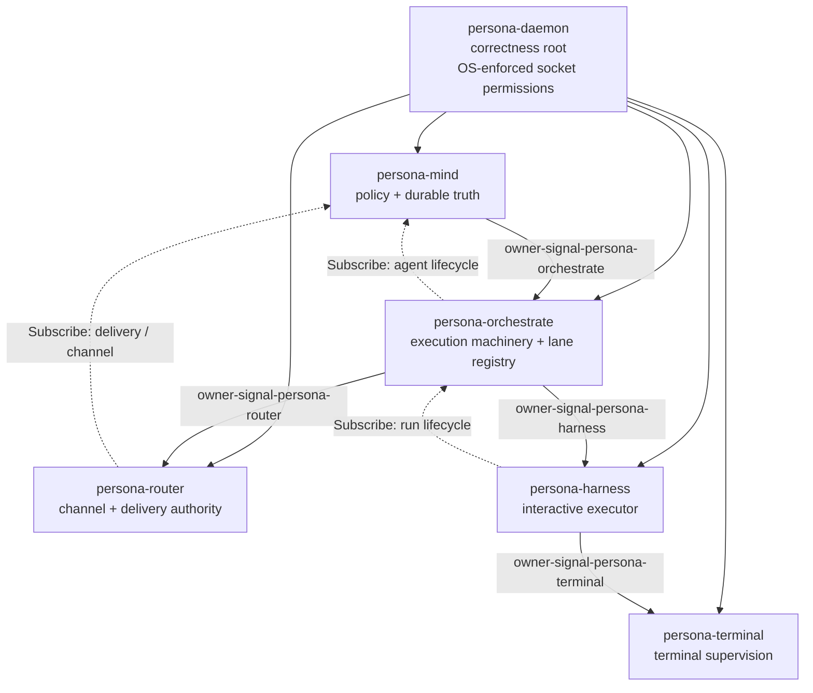

# 228 — Persona-orchestrate: recovered design

*Comprehensive inventory of every persona-orchestrate architectural
decision across the workspace. Absorbs `/226` (whose recommendation
to "fold into mind" was wrong) and `/227` (the audit that surfaced
the misplaced scaffold). Both supersede; delete in the same commit
this lands.*

*The principle that survives every source — confirmed by the user
explicitly when this audit landed: **`persona-mind` owns STATE
(work graph, memory, thoughts). `persona-orchestrate` owns MACHINERY
(role claims, activity log, spawn/supervise/schedule/escalate,
channel grants, executor lifecycle, lane registry).** The two
misplaced May commits hid this split.*

---

## 0 · TL;DR

`persona-orchestrate` is a real component with real design.
**The repo just doesn't exist.** Three days of work has been
accumulating across:

- The misplaced scaffold in `persona-mind` (commits `afe6786`,
  `de9b258`, `73d6c41`).
- The misplaced contract scaffold in `signal-persona-mind` (commit
  `121f8d9`) — the 21 round-trip-tested types that should have been
  `signal-persona-orchestrate`.
- Engine-side preparation already shipped: `signal-persona-auth
  0c09e641` (`ComponentName::Orchestrate`), `signal-persona
  cd57f48e` (`ComponentKind::Orchestrate`), `persona d9e9b5ff`
  (`mind-orchestrate` topology slot with Nix-tested spawn-envelope
  witnesses).
- 17 design reports across designer, designer-assistant,
  second-designer-assistant, operator, second-operator-assistant
  lanes.
- `orchestrate/ARCHITECTURE.md` — the most consolidated today-vs-
  eventual narrative.
- `persona/ARCHITECTURE.md` §0.8 + §1 Component Map.
- `persona-mind/ARCHITECTURE.md` §6.6.
- `orchestrate-cli` (the workspace's Rust port; closed bead
  `primary-68cb`) projecting `MindRequest` but writing lock files.
- Beads `primary-699g` (designer pickup), `primary-jboc` (RoleName
  gap), `primary-hrhz` (carve-out — filed today).

Action: operator picks up `primary-hrhz` and creates the repos +
carves out the misplaced scaffold + migrates the verbs. The user has
rejected `/226`'s "fold into mind" recommendation. The split is real.

---

## 1 · Decided architecture (most-stable first)

These decisions are settled in skills, ARCHITECTUREs, and reports.
The user has confirmed each.

1. **`persona-orchestrate` is a full triad component.** Daemon + thin
   CLI client + `signal-*` contract(s) + sema-engine state. Not a
   co-resident actor inside `persona-mind`. *Sources*: `reports/designer-assistant/115-...md` §7;
   `reports/operator/134-...md`; `reports/designer/210-...md` §3;
   `orchestrate/ARCHITECTURE.md` §0; `persona/ARCHITECTURE.md` §0.8.

2. **The Mutate authority chain runs through orchestrate.**
   `persona-mind → persona-orchestrate → persona-router /
   persona-harness`. Mind issues `SpawnAgentOrder` /
   `AcquireScopeOrder` / `EscalationOrder`; orchestrate executes —
   itself issuing downstream `Mutate` / `Retract` to router
   (channel grants) and harness (spawn / pause / resume / stop).
   *Sources*: `reports/designer/210-...md` §2;
   `persona-mind/ARCHITECTURE.md` §6.6;
   `orchestrate/ARCHITECTURE.md` §4;
   `skills/component-triad.md` §"Authority chain — worked example".

3. **One owner per component (the owner graph is a tree).**
   `persona-daemon → mind`; `mind → orchestrate`; `orchestrate →
   router`; `orchestrate → harness`; `harness → terminal`.
   *Sources*: `reports/designer-assistant/116-...md` §13 A3;
   `reports/designer-assistant/117-...md` Q2 (harness owns terminal);
   `reports/operator/135-...md`.

4. **Owner-only sockets are an OS security boundary, not a
   convention.** Per-component Unix users/groups are the first-pass
   enforcement. Same-UID prototype is unsafe author-only dev.
   *Sources*: `reports/designer-assistant/116-...md` §13 A1; affirmed
   in `reports/operator/134-...md`.

5. **`OwnerSignal` is the permission class.** Repo: `owner-signal-<component>`.
   Crate: `owner_signal_<component>`. Concept in prose: "OwnerSignal".
   *Source*: `reports/designer-assistant/116-...md` §13 A2.

6. **One actor per Signal contract surface.** The daemon binds one
   socket per contract; each socket has its own typed listener actor.
   No generic actor multiplexes contracts. *Source*:
   `reports/designer-assistant/116-...md` §13 A5; operator/135
   implements this for terminal.

7. **Build the OwnerSignal chain end-to-end in the first pass.**
   Create `owner-signal-persona-orchestrate` + `owner-signal-persona-router`
   + `owner-signal-persona-harness` together, not link-by-link.
   *Source*: `reports/designer-assistant/116-...md` §13 A4.

8. **`tools/orchestrate` is transitional.** The Rust port at
   `orchestrate-cli` (closed `primary-68cb` via commit `1730087a`) is
   the shell-helper-era projection. It writes lock files today;
   eventually routes through `persona-orchestrate`. *Sources*:
   `reports/operator/134-...md`; `orchestrate/ARCHITECTURE.md` §0+§3.

9. **Lane registry is data, not enum variants.** Lanes come from
   config at startup and are mutable at runtime via the
   `owner-signal-persona-orchestrate` `LaneRegistry*` family. The
   closed `RoleName` enum dissolves. *Source*:
   `reports/second-designer-assistant/6-...md` §2 path 4.

10. **Communication socket vs supervision socket** at the component
    boundary. *Source*: `reports/operator/134-...md` table; DA/117 §2.3.

11. **`CreateSession` is `Mutate`.** Order at a stable name, not a
    new fact. Same shape applies to all orchestrate orders.
    *Source*: shipped `owner-signal-persona-terminal` contract
    (operator/135 §1).

12. **Verb is not the permission boundary; request vocabulary is.**
    A non-owner socket doesn't know *owner-only variants*; it may
    still carry ordinary `Mutate` variants. *Source*: DA/117 §3.2
    correction.

13. **State split** (the split principle, restated):
    - **Mind owns**: work graph, thoughts, relations, decisions,
      memories, durable policy truth, channel-grant authority
      decisions.
    - **Orchestrate owns**: role claims, activity log, agent-run
      lifecycle, spawn plans, scope-acquisition workflow, executor
      capacity snapshots, scheduling state, escalation state, lane
      registry.
    *Sources*: `orchestrate/ARCHITECTURE.md` §5;
    `reports/designer-assistant/115-...md` §6.

14. **Submission vs Order is structural.** `Assert ScopeAcquisitionSubmission`
    (caller asks) is a different verb than `Mutate AcquireScopeOrder`
    (mind authoritatively orders). Mixing them was the largest
    contract-shape risk DA/115 flagged. *Source*:
    `reports/designer-assistant/115-...md` §4.1, §5.2, §8.2.

15. **No raw lock-file strings as scope identity.** Scope identity
    is a typed `Scope` enum: `Path`, `Task`, `ReportLane`,
    `Component`, `WorkGraph`. *Source*: DA/115 §8.4.

16. **Executor management currently missing from
    `signal-persona-harness`.** Has delivery/status/transcript
    variants but no spawn/start-run/pause/resume relation. Add to
    `signal-persona-harness` first; factor a generic
    `signal-persona-executor` only when raw-LLM executor exists.
    *Source*: DA/115 §2.3, §4.5, §8.3.

17. **`persona-daemon` is the engine manager, separate from
    orchestrate.** Persona-daemon owns engine/component process
    lifecycle, spawn envelopes, socket creation, OS permissions.
    Orchestrate orders agent runs *inside* already-running executor
    components. Two-level split. *Source*: DA/115 §4.3;
    `persona/ARCHITECTURE.md` §1.5; `orchestrate/ARCHITECTURE.md` §4.

---

## 2 · Component scope: what persona-orchestrate IS

**A triad daemon** with the five `skills/component-triad.md`
invariants:

1. CLI (`persona-orchestrate`) has exactly one Signal peer (its
   daemon's ordinary socket).
2. Daemon's external surface is exclusively `signal-core` frames.
3. Verb declared per-variant via `signal_channel!`.
4. Durable state in `persona-orchestrate.redb` via `sema-engine`.
5. Privileged authority on `owner-signal-persona-orchestrate`.

**Three contract surfaces** (eventual shape):

- `signal-persona-orchestrate` — ordinary, peer/CLI callers.
- `owner-signal-persona-orchestrate` — privileged, `persona-mind`
  only.
- (Optional later) `observe-signal-persona-orchestrate` — if
  `persona-introspect` needs a richer read surface.

**Actor tree (target topology)** per DA/119 §3 + component-triad:

- `PersonaOrchestrateRoot` (Kameo runtime root).
- `OrdinarySignalSocketActor` — binds `orchestrate.sock`; speaks
  `signal-persona-orchestrate`.
- `OwnerSignalSocketActor` — binds `orchestrate-owner.sock`; speaks
  `owner-signal-persona-orchestrate`; restricted by per-component
  Unix identity.
- `SupervisionPhase` — answers `signal-persona::SupervisionRequest`.
- `LaneRegistryActor` — owns lane-registry table operations.
- `AgentRunActor` — one per active agent run; supervises the
  spawn-pipeline state machine.
- `ScopeArbiter` — handles scope-acquisition workflow against mind.
- `ExecutorCapacityObserver` — subscribes to harness / raw-LLM
  capacity streams.
- `SemaEngineOwnerActor` — single-owner Engine handle for
  `persona-orchestrate.redb`.
- `OutboundChannelActor` — one per OwnerSignal client connection
  (orchestrate connects *out* to router and harness).

## 2.1 · What persona-orchestrate is NOT

- **Not the engine manager.** `persona-daemon` owns component
  process lifecycle; orchestrate orders agent runs *inside* already-
  running executors.
- **Not a duplicate of mind.** Distinct flows: (a) external
  submission → orchestrate asks mind to commit → mind replies →
  orchestrate sequences execution; (b) mind authority order →
  orchestrate executes → events back.
- **Not a multiplexer for terminal data sockets.** Interacts with
  terminal state only through harness/executor lifecycle and typed
  observations.
- **Not the same as `tools/orchestrate` or `orchestrator`.**
  `tools/orchestrate` is the transitional workspace helper.
  `LiGoldragon/orchestrator` is Criopolis cascade dispatcher —
  unrelated.
- **Not a wrapper around the shell helper.** It's a runtime Persona
  component. `tools/orchestrate` retires when orchestrate lands.

---

## 3 · Authority chain — canonical Mutate flow



Verbs at each link:

| Link | OwnerSignal contract | Direction | Key verbs |
|---|---|---|---|
| `mind → orchestrate` | `owner-signal-persona-orchestrate` (to write) | downstream | `Mutate SpawnAgentOrder`, `Mutate AcquireScopeOrder`, `Mutate StopAgentOrder`, `Mutate SetSchedulingPolicy`, `Mutate SetSupervisionPolicy`, `Mutate EscalationOrder`, `Mutate RegisterLaneOrder`, `Retract RetractLaneOrder`, `Mutate UpdateLaneMetadataOrder`, `Retract ReleaseScopeOrder` |
| `orchestrate → mind` | `signal-persona-mind` | upstream (facts) | `Assert RoleClaim`, `Retract RoleRelease`, `Mutate RoleHandoff`, `Assert ActivitySubmission`; mind subscribes lifecycle events the other way |
| `orchestrate → router` | `owner-signal-persona-router` (to write) | downstream | `Mutate ChannelGrant`, `Mutate ChannelExtend`, `Retract ChannelRetract` (currently `Assert` on `signal-persona-mind`; §8.1 drift) |
| `orchestrate → harness` | `owner-signal-persona-harness` (to write) | downstream | `Mutate StartAgentRun`, `Mutate StopAgentRun`, `Mutate PauseAgentRun`, `Mutate ResumeAgentRun`; `Subscribe ExecutorCapacityStream` |
| `harness → terminal` | `owner-signal-persona-terminal` (**shipped** `9753806f`) | downstream | `Mutate CreateSession`, `Retract RetireSession` |

Each step: **obey-then-confirm**. Issuer holds *possibly-mutated*
state until the typed reply arrives; on confirmation it transitions
to *now-mutated* and advances. Subscriptions flow opposite —
observers up-tree subscribe to producers down-tree.

---

## 4 · Contract surface (recovered)

### 4.1 · The misplaced `121f8d9` original `signal-persona-orchestrate`

The commit landed in `signal-persona-mind`; the canonical content was:

**Identity newtypes**: `RoleName` (5 variants — `Operator`,
`Designer`, `SystemSpecialist`, `Poet`, `Assistant`; **not the 8
currently in `signal-persona-mind`**), `ScopeReference { Path(WirePath),
Task(TaskToken) }`, `WirePath(String)`, `TaskToken(String)`,
`ScopeReason(String)`, `TimestampNanos(u64)`.

**Six request kinds**:
```
RoleClaim         { role, scopes[], reason }
RoleRelease       { role }
RoleHandoff       { from, to, scopes[], reason }
RoleObservation
ActivitySubmission { role, scope, reason }    (timestamp store-supplied)
ActivityQuery     { limit, filters[] }
```

**Eight reply kinds**:
```
ClaimAcceptance        { role, scopes[] }
ClaimRejection         { role, conflicts[] }
ReleaseAcknowledgment  { role, released_scopes[] }
HandoffAcceptance      { from, to, scopes[] }
HandoffRejection       { from, to, reason }
RoleSnapshot           { roles[], recent_activity[] }
ActivityAcknowledgment { slot }
ActivityList           { records[] }
```

21 round-trip witness tests in `tests/round_trip.rs`. No event /
stream surface in the original. **The entire surface currently
lives inside `signal-persona-mind::MindRequest`** (lines 1748-1813)
alongside the mind-state verbs. The `OrchestrateRequest` /
`OrchestrateReply` enum names were renamed to `MindRequest` /
`MindReply` during the repurpose.

### 4.2 · Ordinary surface — `signal-persona-orchestrate`

Per DA/115 §5, second-DA/6 §3.2, `orchestrate/ARCHITECTURE.md` §3:

| Family | Verb | Origin |
|---|---|---|
| `ScopeAcquisitionSubmission` | `Assert` | peer / CLI |
| `ScopeReleaseSubmission` | `Retract` | scope holder |
| `BlockedWorkReport` | `Assert` | executor / agent |
| `OwnRunObservation` | `Match` | peer / CLI |
| `OwnRunLifecycleSubscription` | `Subscribe` | peer / CLI |
| `SpawnPlanValidation` | `Validate` | mind / CLI dry-run |
| `LaneRegistryObservation` | `Match` | any peer |
| `LaneRegistrySubscription` | `Subscribe` | any observer |

### 4.3 · Owner surface — `owner-signal-persona-orchestrate`

Owner: `persona-mind`.

| Family | Verb |
|---|---|
| `SpawnAgentOrder` | `Mutate` |
| `StopAgentOrder` | `Mutate` or `Retract` (open) |
| `PauseAgentOrder` / `ResumeAgentOrder` | `Mutate` |
| `AcquireScopeOrder` | `Mutate` |
| `ReleaseScopeOrder` | `Retract` |
| `SetSchedulingPolicy` | `Mutate` |
| `SetSupervisionPolicy` | `Mutate` |
| `EscalationOrder` | `Mutate` |
| `RegisterLaneOrder` | `Mutate` |
| `RetractLaneOrder` | `Retract` |
| `UpdateLaneMetadataOrder` | `Mutate` |
| `LaneRegistrySnapshotQuery` | `Match` |
| `OwnerSnapshotQuery` | `Match` |
| `AgentLifecycleSubscription` | `Subscribe` |
| `ExecutorCapacitySubscription` | `Subscribe` |
| `ScopeEventSubscription` | `Subscribe` |

Reply families (DA/115 §5.3): `SpawnOrderAccepted` /
`SpawnOrderRejected` / `AgentRunStarted` / `AgentRunCompleted` /
`AgentRunFailed` / `ScopeAcquired` / `ScopeRejected` /
`ScopeReleased` / `SupervisionPolicyAccepted` / `OrchestrateSnapshot`
/ `LaneRegistrySnapshot` / `OrchestrateUnimplemented`.

Event streams (DA/115 §5.4):

- `AgentLifecycleStream` — Requested / Planned / Starting / Running /
  WaitingOnUser / Blocked / Completed / Failed / Stopping / Stopped
  / Cancelled.
- `ScopeEventStream` — Requested / Acquired / Contested / Released /
  Expired / Denied.
- `ExecutorCapacityStream` — Available / Saturated / Degraded /
  Unavailable / Recovered.
- `EscalationStream` — BlockedWorkEscalated / UserDecisionNeeded /
  AgentQuestionRaised.

### 4.4 · Identity newtypes

| Type | Meaning |
|---|---|
| `OrchestrationIdentifier` | Stable id for an orchestration decision/workflow. |
| `AgentRunIdentifier` | One concrete spawned/allocated agent run. |
| `ExecutorIdentifier` | One executor daemon/session endpoint. |
| `WorkIdentifier` | Pointer to a mind-owned work item. |
| `ScopeIdentifier` | Closed typed `Scope` enum (path / task / report-lane / component / work-graph). |
| `LaneIdentifier` | Replaces `RoleName`. Shape open: string vs hash vs typed `Slot<LaneRecord>` (recommendation: typed slot). |
| `SpawnPlanIdentifier` | Stable id for a validated plan before commit. |

### 4.5 · The `LaneRegistry-as-config` direction

Per second-DA/6 path 4: closed `RoleName` enum **disappears**.
`LaneIdentifier` becomes a newtype carrying an opaque-to-contract
stable id. The **set** of valid identifiers is runtime registry
state owned by orchestrate's sema-engine `LaneRegistry` table. New
lanes land via owner-`Mutate` without recompiling any contract.
This dissolves `primary-jboc`.

---

## 5 · Sema-engine state schema

`persona-orchestrate.redb` opened through `sema-engine`. Tables
compiled from second-DA/6 §3.3, DA/115 §6, DA/119 §4.6,
`orchestrate/ARCHITECTURE.md` §5:

| Table | Key | Value | Purpose |
|---|---|---|---|
| `lane_registry` | `LaneIdentifier` | `LaneRecord { identifier, name, assistant_of?, beads_label, metadata, created_at }` | The canonical lane set. |
| `lane_registry_next_slot` | (singleton) | `u64` | If LaneIdentifier is a typed slot. |
| `claims` | `LaneIdentifier` | `StoredClaim { lane, scope, reason, claimed_at }` | Active scope claims. *(Currently in persona-mind.redb.)* |
| `claim_archive` | `slot` | `ArchivedClaim` | Released-claim history. |
| `activities` | `u64` (slot) | `StoredActivity { slot, lane, scope, reason, stamped_at }` | Activity log. *(Currently in persona-mind.redb.)* |
| `activity_next_slot` | (singleton) | `u64` | *(Currently in persona-mind.redb.)* |
| `agent_runs` | `AgentRunIdentifier` | `AgentRunRecord { run_id, executor, work_item, permissions, lifecycle_state, started_at, ... }` | One row per allocated agent run. |
| `agent_run_archive` | `slot` | Archived agent-run records | History. |
| `spawn_plans` | `SpawnPlanIdentifier` | `SpawnPlan { plan_id, agent_run, dependencies, validation_state }` | Validate-then-commit. |
| `agent_executors` | `ExecutorIdentifier` | `ExecutorRegistration { ... }` | Known executors and capacity. |
| `scope_acquisitions` | `slot` | `ScopeAcquisitionRecord { lane, scope, status, requested_at, decided_at }` | In-flight workflows. |
| `channel_grants` | `ChannelGrantId` | `ChannelGrantRecord { run_id, channel, lifecycle }` | Audit of orchestrate's own Mutates downstream. |
| `supervision_policies` | `LaneIdentifier` or `AgentRunIdentifier` | `SupervisionPolicy { restart_strategy, drain_window, escalation_target }` | Per-lane or per-run policy. |
| `scheduling_policy` | (singleton) | `SchedulingPolicy { capacity_caps, backpressure_thresholds, priority_rules }` | Global. |
| `escalation_state` | `slot` | `EscalationRecord { source_run, reason, surfaced_at, resolved_at? }` | In-flight + history. |
| `commit_log` | (sema-engine built-in) | per-commit deltas | Push subscription substrate. |

**Migrates from persona-mind**: `claims`, `activities`,
`activity_next_slot` (in `persona-mind/src/tables.rs:24-32`) plus the
`StoredClaim` and `StoredActivity` struct definitions.

**Stays in persona-mind**: `memory_graph`, `thoughts`, `relations`,
`thought_subscriptions`, `relation_subscriptions`.

**Ambiguous** — `AdjudicationRequest` / `ChannelGrant` /
`ChannelExtend` / `ChannelRetract` / `AdjudicationDeny` /
`ChannelList`: orchestrate-shaped (it issues these to router); the
channel state itself lives in router. Currently
`MindRequestUnimplemented { NotInPrototypeScope }`. Carving these
out resolves the DA/115 §8.1 verb drift.

---

## 6 · OwnerSignal discipline

Full discipline in DA/116. Five settled A1-A5 answers (§13):

- **A1** — Owner sockets are an OS security boundary. Per-component
  Unix users/groups first-pass; inherited FDs later; runtime
  credential gates explicitly NOT the main design.
- **A2** — Naming: `owner-signal-<component>`; crate
  `owner_signal_<component>`; concept "OwnerSignal".
- **A3** — Candidate owner graph good enough for first pass:
  `persona-daemon → mind`; `mind → orchestrate`; `orchestrate →
  router`; `orchestrate → harness`; `harness → terminal` (settled in
  DA/117); `persona-message` owner deferred.
- **A4** — Build OwnerSignal chain end-to-end in first pass:
  create `owner-signal-persona-orchestrate` +
  `owner-signal-persona-router` + `owner-signal-persona-harness`
  together, not link-by-link.
- **A5** — One actor per Signal contract surface. Daemon may have
  access to all sockets its OS identity permits, but each contract
  surface gets its own actor that knows its socket path from typed
  configuration.

Witness tests (DA/116 §10):

- `<component>-owner-contract-contains-owner-only-variants`
- `<component>-ordinary-contract-cannot-express-owner-operations`
- `<component>-owner-socket-mode-matches-spawn-envelope`
- `<component>-ordinary-socket-rejects-owner-frame`
- `<component>-owner-socket-connectivity-is-os-enforced`
- `<component>-daemon-state-goes-through-sema-engine`
- `persona-daemon-owner-graph-has-at-most-one-owner-per-component`

---

## 7 · Open questions

### From second-DA/6 §4 (registry-as-config)

1. **`LaneIdentifier` shape** — `String` / hash / typed
   `Slot<LaneRecord>`. Recommendation: typed slot.
2. **Startup reconciliation** when config diverges from state —
   config wins / state wins / owner adjudicates / append-only.
3. **Beads label and `assistant-of`** under dynamic registration —
   can a runtime lane be a main role? If `assistant-of` mutates,
   what about claimed beads?
4. **Permission boundary on ordinary surface** — peer-credential ↔
   lane-identity binding for `ScopeAcquisitionSubmission`.
5. **Migration path staging** — three stages (signal-persona-mind
   contract change → orchestrate-cli registry → persona-orchestrate
   runtime). Separate beads or `primary-699g` umbrella?

### From DA/115 §10 (still open)

- **Q3** — Agent identity: lane vs agent-run vs holder vs
  work-item; typed distinction needed.
- **Q6** — Executor management in `signal-persona-harness` (start
  there) or generic `signal-persona-executor` (factor later when
  raw-LLM executor exists).

### From DA/115 §8 (contract drift)

- **§8.1** — `ChannelGrant` is `Assert`; should be `Mutate`.
- **§8.2** — `AcquireScope` split into `Assert ScopeAcquisitionSubmission`
  + `Mutate AcquireScopeOrder`.
- **§8.4** — `Scope` typed enum, not raw strings.

### From second-DA/6 §6.2 (cross-layer)

- **Mutate transaction boundaries** in `mind → orchestrate →
  router/harness` — atomicity of multi-step spawn.
- **Orchestrate-spawned run scope authority** — can a run
  `ScopeAcquisitionSubmission` directly, or only act on
  `AcquireScopeOrder` from mind?

### Surfaced while researching

- **`OrchestrateRequest` / `OrchestrateReply` naming** — revive the
  original enum names from `121f8d9`, or start with new names that
  carry the ordinary surface variants?
- **`orchestrate-cli` migration is two-step**: (a) point at mind
  (the slice `/226` named for the closed-bead `primary-68cb`
  follow-up); (b) point at orchestrate (when it exists). Separate
  beads or one?

---

## 8 · Migration map

### 8.1 · Records leaving `signal-persona-mind` for `signal-persona-orchestrate`

From `signal-persona-mind/src/lib.rs`:

- **Identity**: `RoleName` (replaced by `LaneIdentifier`);
  `ScopeReference { Path, Task }`; `WirePath`; `TaskToken`;
  `ScopeReason`; `TimestampNanos`.
- **Claim**: `RoleClaim`, `ClaimAcceptance`, `ClaimRejection`,
  `ScopeConflict`.
- **Release**: `RoleRelease`, `ReleaseAcknowledgment`.
- **Handoff**: `RoleHandoff`, `HandoffAcceptance`, `HandoffRejection`,
  `HandoffRejectionReason`.
- **Observation**: `RoleObservation`, `RoleSnapshot`, `RoleStatus`,
  `ClaimEntry`.
- **Activity**: `Activity`, `ActivitySubmission`,
  `ActivityAcknowledgment`, `ActivityQuery`, `ActivityFilter`,
  `ActivityList`.
- **Channel records** (orchestrate-shaped, currently misplaced):
  `AdjudicationRequest` / `AdjudicationRequestId`, `ChannelGrant`,
  `ChannelExtend`, `ChannelRetract`, `AdjudicationDeny`,
  `ChannelList` (likely migrates to `owner-signal-persona-router`).

### 8.2 · Records staying in `signal-persona-mind`

Thought/relation graph + memory work-graph verbs:

- `Thought`, `Relation`, `SubmitThought`, `SubmitRelation`,
  `QueryThoughts`, `QueryRelations`, `ThoughtFilter`,
  `RelationFilter`, `SubscribeThoughts`, `SubscribeRelations`,
  `SubscriptionId`, `SubscriptionRetraction`,
  `SubscriptionAccepted`, `SubscriptionRetracted`, subscription
  delta events.
- Mind work-graph: `Opening`, `OpeningReceipt`, `NoteSubmission`,
  `NoteReceipt`, `Link`, `LinkReceipt`, `StatusChange`,
  `StatusReceipt`, `AliasAssignment`, `AliasReceipt`, `Query`,
  `View`.
- Memories (when they land per typed-memory variant set):
  `Task`, `Bug`, `Feature`, `Epic`, `Decision`, `Migration`,
  `Discipline`, `Investigation`.

### 8.3 · Actors leaving `persona-mind` for `persona-orchestrate`

Per `persona-mind/src/actors/dispatch.rs:92-108`: the arms for
`RoleClaim` / `RoleRelease` / `RoleObservation` / `ActivitySubmission`
/ `ActivityQuery` / `RoleHandoff` migrate. The `domain.rs` handlers
(`apply_claim`, `read_claims`, `ApplyActivity`, `ReadActivity`)
move with them. `persona-mind/src/claim.rs` migrates entirely.

### 8.4 · Sema tables migrating

From `persona-mind/src/tables.rs:24-32`:

- `claims` → `persona-orchestrate.redb`
- `activities` → `persona-orchestrate.redb`
- `activity_next_slot` → `persona-orchestrate.redb`
- `StoredClaim` and `StoredActivity` struct definitions migrate.

### 8.5 · Tables staying in `persona-mind`

`memory_graph`, `thoughts`, `relations`, `thought_subscriptions`,
`relation_subscriptions`. `MIND_SCHEMA_VERSION` bumps to N+1.

### 8.6 · Cascade

Every consumer's `Cargo.toml` adds `signal-persona-orchestrate`
and/or `owner-signal-persona-orchestrate` git dep:

- `orchestrate-cli` (gets the new ordinary surface dep alongside
  existing `signal-persona-mind`).
- `persona-mind` loses the migrated handlers / tables / verbs.
- `persona/Cargo.toml` apex workspace adds new contract crates.
- `persona/ARCHITECTURE.md` §0.8 + §1 Component Map flips "Planned"
  → present-tense.
- `persona-mind/ARCHITECTURE.md` §6.6 stops forward-referencing.

---

## 9 · "When orchestrate lands" references that need to flip

Each location names orchestrate as future-tense. After the carve-out,
these flip to present-tense.

| Path | Line(s) | Context |
|---|---|---|
| `/git/.../persona/ARCHITECTURE.md` | 175-189 | §0.8 "Persona-orchestrate slot — planned" |
| `/git/.../persona/ARCHITECTURE.md` | 198-199 | §1 Component Map "Planned" rows |
| `/git/.../persona/ARCHITECTURE.md` | 213 | §1 "used by the orchestrate/harness/terminal authority chain" |
| `/git/.../persona/ARCHITECTURE.md` | 220-228 | Mermaid topology |
| `/git/.../persona/ARCHITECTURE.md` | 258-260 | Path conventions |
| `/git/.../persona/ARCHITECTURE.md` | 407-411 | §1.6.4 |
| `/git/.../persona/ARCHITECTURE.md` | 783, 1286 | "tools/orchestrate may remain as external cutover glue" |
| `/git/.../persona-mind/ARCHITECTURE.md` | 446, 455, 469-477 | §6 verb table, §6.6 "When persona-orchestrate lands…" + cites retired report |
| `/git/.../persona-router/ARCHITECTURE.md` | 212-214 | "when persona-orchestrate lands" + cites retired report |
| `/git/.../signal-persona-mind/ARCHITECTURE.md` | 11, 44 | "external tools/orchestrate cutover wrappers" |
| `/home/li/primary/AGENTS-extended.md` | 174 | "future persona-orchestrate daemon" |
| `/home/li/primary/skills/component-triad.md` | 85, 166, 224 | Mermaid + Mutate authority example |
| `/home/li/primary/skills/contract-repo.md` | 325 | Mutate-orders-to-orchestrate example |
| `/home/li/primary/orchestrate/ARCHITECTURE.md` | throughout | Today-vs-eventual sections — the most consolidated source |
| `/home/li/primary/orchestrate-cli/Cargo.toml` | 9 | "routes through persona-mind once that lands" |

Bead `primary-699g`, `primary-jboc`, and the new `primary-hrhz`
(filed today) all reference orchestrate.

---

## 10 · Bead trail

### `primary-699g` (P2, OPEN, type: feature, role:designer)

Design persona-orchestrate component + signal-persona-orchestrate
ordinary + OwnerSignal chain (orchestrate/router/harness). Created
2026-05-17.

Comments record:
- **2026-05-17 14:16** Engine-side preparation landed:
  `signal-persona-auth 0c09e641` (ComponentName::Orchestrate),
  `signal-persona cd57f48e` (ComponentKind::Orchestrate), `persona
  d9e9b5ff` (mind-orchestrate topology + Nix-tested spawn-envelope
  witnesses). Pending: actual `signal-persona-orchestrate` contract
  and `persona-orchestrate` runtime/CLI.
- **2026-05-17 15:49** Approved OwnerSignal/socket decisions in
  operator/134 + persona ARCHITECTURE.md. Communication socket vs
  supervision socket terminology; owner sockets accept Mutate;
  non-owner sockets typed-error; orchestrate may translate accepted
  owner Mutate into downstream Mutate orders; prototype skips final
  Unix permission enforcement.

### `primary-hrhz` (P1, OPEN, type: task, filed 2026-05-18)

The carve-out work — create the repos, extract scaffold from history,
migrate verbs + tables, update ARCH cross-references. References this
report (`/228`) as the canonical context dump.

### `primary-jboc` (P2, OPEN, type: bug, role:designer)

The `RoleName` closed-enum gap. Dissolves under second-DA/6 path 4
once the LaneRegistry surface ships on `owner-signal-persona-orchestrate`.

### `primary-68cb` (CLOSED via commit `1730087a`)

The shipped Rust port of `tools/orchestrate`. Implementation report:
`reports/second-operator-assistant/1-rust-port-of-tools-orchestrate-2026-05-17.md`.

---

## 11 · Currently misplaced

### 11.1 · In `signal-persona-mind` (commit `121f8d9`, 2026-05-09)

11 files, 993 lines. The intended `signal-persona-orchestrate`
contract surface (titled in the commit as such) landed inside
`signal-persona-mind`'s tree. Key files: `ARCHITECTURE.md` (156),
`src/lib.rs` (335, the canonical original contract; verbs survive
inside `signal-persona-mind::MindRequest`), `tests/round_trip.rs`
(309, the 21 witnesses). `OrchestrateRequest` / `OrchestrateReply`
enum names renamed to `MindRequest` / `MindReply` during repurpose.

### 11.2 · In `persona-mind` (commits `afe6786`, `de9b258`, `73d6c41`)

`afe6786` (2026-05-07): 16 files, 257 lines — the initial scaffold
for `persona-orchestrate`'s runtime (claim state, role enum, smoke
test). Now buried in persona-mind's git history; current files have
moved on.

`73d6c41` (2026-05-09): 76-line ARCH expansion describing the runtime
shape (library + bin `orchestrate`, `CLAIMS`/`ACTIVITIES`/`META`
sema tables, Nota-on-argv discipline, auto-Activity on
claim/release/handoff). **This is the most complete original
persona-orchestrate ARCH text and should seed the new repo's
ARCHITECTURE.md.**

### 11.3 · The lost referenced report

Both commits cite `reports/designer/93-persona-orchestrate-rust-rewrite-and-activity-log.md`.
**This report no longer exists** — retired in a context-maintenance
sweep. The substance survives in the commit messages + DA/115 + DA/116
+ second-DA/6 + this report.

---

## 12 · Recommendation for the carve-out

Execute `primary-hrhz` per its description. Specifically:

1. `gh repo create LiGoldragon/persona-orchestrate --public` and
   `gh repo create LiGoldragon/signal-persona-orchestrate --public`.
2. **Bootstrap the new repos from `skills/repository-creation.md`**
   rather than replaying history. The history-replay path is
   complex git surgery; bootstrap is cleaner. Reference `73d6c41`'s
   ARCH expansion when writing the new `persona-orchestrate/ARCHITECTURE.md`.
3. **Move the contract types** per §8.1 from `signal-persona-mind`
   to `signal-persona-orchestrate`. The `signal_channel!` in
   `signal-persona-orchestrate` declares a fresh `OrchestrateRequest`
   / `OrchestrateReply` enum carrying the migrated variants. The
   `signal_channel!` in `signal-persona-mind` drops those variants.
4. **Move the actor / table / dispatcher code** per §8.3-§8.4 from
   `persona-mind` to `persona-orchestrate`. Schema-version bump on
   both sides.
5. **Cascade updates** per §8.6.
6. **Flip the "when orchestrate lands" references** per §9 to
   present-tense once the repos exist and the contract compiles.
7. **Land `owner-signal-persona-orchestrate`** + `owner-signal-persona-router`
   + `owner-signal-persona-harness` in the same first-pass arc
   (per DA/116 A4).

`primary-jboc` closes as superseded by the LaneRegistry surface
in step 7.

The result: orchestrate exists as the triad daemon every report has
been describing.

---

## See also

- `/git/github.com/LiGoldragon/persona-mind/` commits `afe6786`,
  `de9b258`, `73d6c41` — the misplaced scaffold.
- `/git/github.com/LiGoldragon/signal-persona-mind/` commit
  `121f8d9` — the misplaced contract.
- `/git/github.com/LiGoldragon/persona/ARCHITECTURE.md` §0.8 — the
  "Planned" framing to flip.
- `/git/github.com/LiGoldragon/persona-mind/ARCHITECTURE.md` §6.6 —
  the "when orchestrate lands" framing to flip.
- `/home/li/primary/orchestrate/ARCHITECTURE.md` — the most
  consolidated today-vs-eventual narrative.
- `reports/designer-assistant/115-orchestrate-integration-architecture-2026-05-17.md` — canonical integration design.
- `reports/designer-assistant/116-permission-scoped-signal-contracts-and-sockets-2026-05-17.md` — OwnerSignal discipline.
- `reports/designer-assistant/117-review-operator-134-terminal-orchestrate-porting-decisions-2026-05-17.md` — harness-owns-terminal settlement.
- `reports/second-designer-assistant/6-roles-as-config-owner-socket-mutable-2026-05-17.md` — LaneRegistry-as-config direction.
- `reports/operator/134-terminal-orchestrate-porting-decisions-2026-05-17.md` — user-approved decisions.
- `reports/operator/135-owner-terminal-signal-surface-2026-05-17.md` — the harness→terminal first link shipped.
- `reports/second-operator-assistant/1-rust-port-of-tools-orchestrate-2026-05-17.md` — closed `primary-68cb`.
- Bead `primary-699g` — designer pickup.
- Bead `primary-hrhz` — carve-out task; references this report.
- Bead `primary-jboc` — RoleName gap; dissolves under path 4.
