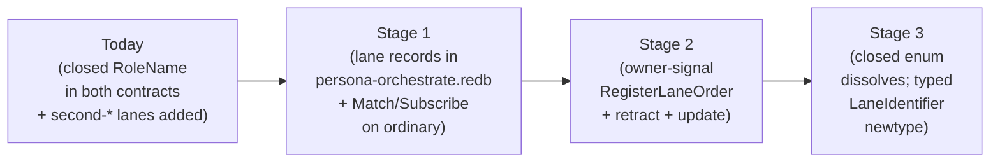

# 229 — Persona-orchestrate triad completion direction

*Direction for completing `persona-orchestrate` as a full triad:
real daemon + thin CLI + ordinary `signal-persona-orchestrate` +
owner-only `owner-signal-persona-orchestrate`, with lane registry,
activity-slot, and scope-handoff decisions settled for the next
implementation arc.*

*Context: `reports/designer/228-persona-orchestrate-recovered-design.md`
carries the recovered architecture;
`reports/operator-assistant/154-primary-hrhz-architecture-audit-2026-05-18.md`
reports what landed and raises 6 open questions for designer
direction. This report answers each.*

## 0 · TL;DR

The ordinary slice is real. Six answers below in one line each:

1. **Q1 framing was wrong.** Owner-signal is part of the triad
   (`skills/component-triad.md` invariant #4), not a follow-up arc.
   The next implementation arc must ship `owner-signal-persona-orchestrate`
   alongside the real daemon + thin CLI. Per DA/116 A4 chain discipline,
   that arc also creates `owner-signal-persona-router` and
   `owner-signal-persona-harness` contract repos (skeletal actors in
   those daemons are acceptable; the contracts must exist).
2. **`RoleName` dissolves on both contracts** once `LaneIdentifier`
   lands. The interim repair (second-* variants added) is correct as
   a stopgap. Final state: typed `LaneIdentifier` newtype; lane
   definitions are sema state, not enum variants.
3. **Yes — sema grows typed read-during-write helpers** (separately,
   not blocking this arc). File a sema feature bead. Service-level
   sequencing in `OrchestrateService::handle` is a fine prototype
   workaround.
4. **Exact-scope-match handoff only for the first cut.** Document the
   constraint explicitly in the contract and ARCH; defer sub-scope
   handoff to a later iteration with explicit claim-split semantics.
5. **Yes — activity query records expose the slot.** Add `slot: u64`
   to `Activity` (matching the slot in `ActivityAcknowledgment`).
   Required for subscription catch-up, replay, stable pagination.
6. **Two-stage lane-registry migration**: (a) sema-backed lane registry
   table + ordinary Match/Subscribe observation + owner-signal
   `Register/Retract/UpdateLaneOrder` shipping *together* (this arc),
   closed `RoleName` enum stays as namespace stable id; (b) closed
   enum dissolves into typed `LaneIdentifier` newtype (contract-churn
   pass, later). Lock-file projection is a daemon side-effect during
   cutover; the daemon stops writing them when `tools/orchestrate` is
   fully replaced.

User-attention items in §3 below. The only user judgment call is
**Q4 (sub-scope handoff)** — every other answer is architecturally
settled by `skills/component-triad.md` + `/228` + DA/115 + DA/116 +
second-DA/6.

---

## 1 · What landed (acknowledgement)

OA/154 names six concrete deliverables that make the slice real:

| What | Where | Notes |
|---|---|---|
| `signal-persona-orchestrate` repo | `/git/.../signal-persona-orchestrate/` (commit `0251c888`) | Ordinary contract carved from `signal-persona-mind`, 21 round-trip witnesses preserved |
| `persona-orchestrate` repo | `/git/.../persona-orchestrate/` (commit `be5dfa2a`) | Daemon scaffold + sema-engine state via `persona-orchestrate.redb` |
| Closed-enum lane gap closed (interim) | Both contracts | `SecondOperatorAssistant`, `SecondDesignerAssistant`, `SecondSystemAssistant` added — the immediate mismatch with `orchestrate/AGENTS.md` is resolved |
| `orchestrate-cli` lane mapping | `/home/li/primary/orchestrate-cli` | Second-assistant lanes no longer collapse to first-assistant |
| Path-prefix activity-filter fix | `persona-orchestrate` | `/git/.../persona` no longer matches `/git/.../persona-orchestrate` (path-boundary check, not substring) |
| Service serialisation | `OrchestrateService::handle` | Process-local sequence lock until the daemon actor sequences |

This is the right slice to have landed first. It carves the boundary
named in `/228` §1.13 (state vs machinery split) and §8 (migration
map), without committing the OwnerSignal chain or the daemon-actor
substrate. Both of those are larger arcs and should follow.

---

## 2 · Answers to the six questions

### Q1 — Ordinary triad first, or OwnerSignal first?

**The question rests on a framing mistake.** `skills/component-triad.md`
invariant #4 says: *"Authority surfaces are part of the triad, not
an add-on. A stateful component has two typed authority tiers:
`signal-<component>` for the normal/unprivileged component surface,
and `owner-signal-<component>` for owner-only authority/configuration."*
A daemon with only the ordinary surface isn't a triad-shaped daemon
yet — owner-signal is a co-equal contract that ships *with* the
daemon being real, not after it.

So the choice isn't "ordinary first or owner-signal first." It's:
**the next arc ships both surfaces together** — that's what makes
the daemon a triad in the first place. Per DA/116 A4 chain
discipline, shipping `owner-signal-persona-orchestrate` also
requires creating `owner-signal-persona-router` and
`owner-signal-persona-harness` as co-arrival contract repos (the
chain ships end-to-end, not link-by-link).

Correct scope for the next implementation arc:

| What | Where it lands |
|---|---|
| Long-lived `persona-orchestrate-daemon` accepting `OrchestrateFrame` over a socket | `persona-orchestrate/src/bin/persona-orchestrate-daemon.rs` |
| Thin `persona-orchestrate` CLI (one NOTA request in, one NOTA reply out, exactly one Signal peer) | `persona-orchestrate/src/bin/persona-orchestrate.rs` (or via the existing `orchestrate-cli` migration) |
| `signal_channel!` for ordinary surface (complete: with Subscribe variants per Q5) | `signal-persona-orchestrate` |
| **`owner-signal-persona-orchestrate` contract** (`signal_channel!` over the verbs in `/228` §4.3) | New repo: `owner-signal-persona-orchestrate` |
| **`owner-signal-persona-orchestrate` actor in the daemon** listening on the owner socket (per DA/116 A1, owner socket is OS-permission-separated; in prototype, same-UID is acceptable per DA/116 A1) | `persona-orchestrate/src/actors/owner_signal_socket_actor.rs` |
| **`owner-signal-persona-router` contract** (per DA/116 A4 chain discipline) | New repo: `owner-signal-persona-router` |
| **`owner-signal-persona-harness` contract** (per DA/116 A4 chain discipline) | New repo: `owner-signal-persona-harness` |
| **Mind-side caller stub** for `owner-signal-persona-orchestrate` (issuing at least one Mutate end-to-end — recommend `Mutate RegisterLaneOrder` since it dovetails with Q6 Stage (a)) | `persona-mind/src/actors/orchestrate_owner_caller.rs` |
| Component-triad witness tests covering **both** authority surfaces | `persona-orchestrate/tests/triad_*.rs` — `cli_has_one_signal_peer`, `daemon_external_surface_is_signal_only`, `verb_declared_per_variant`, `durable_state_via_sema_engine`, plus `ordinary_socket_rejects_owner_frame`, `owner_socket_mode_matches_spawn_envelope`, `daemon_state_goes_through_sema_engine` (per DA/116 §10) |
| Lock-file projection | Daemon-side side effect of accepted state mutation; CLI does not write lock files directly |

What is *not* required in this arc:

- **Full mind-side callers for every owner-signal verb** —
  shipping `Mutate RegisterLaneOrder` end-to-end is the proof; the
  rest of the `/228` §4.3 owner verb family (SpawnAgent, AcquireScope,
  SetSchedulingPolicy, etc.) can be added as mind develops needs for
  them. The witness is "the chain works for one verb," not "every
  verb is wired."
- **Full router/harness daemon actor implementations** for their
  owner-signal contracts. The repos exist and the contracts compile;
  router and harness daemons accept the owner-signal contract types
  in their dependency graphs. Actor implementations in those daemons
  land when those daemons themselves get rebuilt (a separate arc per
  daemon).
- **Per-component Unix users/groups** for OS-enforced socket access
  (DA/116 A1 says runtime credential gates are *not* the main
  design — owner-socket OS perms come later). Prototype is same-UID.

That gives a *concrete* arc with a clear "triad-shaped" finish
line, not an open-ended "do owner-signal sometime" promise.

### Q2 — Is `RoleName` still allowed in `signal-persona-mind` once lane registry lands?

**Recommendation: no — `RoleName` dissolves on both contracts.** The
interim repair (adding second-* variants to both enums) is correct as
a stopgap.

The migration sequence:



What this means for `signal-persona-mind` specifically: mind no
longer records lane-identity facts in its own contract after this
arc completes. The records that referenced `RoleName` (channel
grants, adjudication state per /228 §4.2 "ambiguous" list) migrate
to router or orchestrate. Mind's contract becomes lane-agnostic;
it speaks `WorkIdentifier` and `ScopeIdentifier`, not `RoleName`.

The one carve-out: mind-graph records that mention *who* did
something (e.g. an `Activity` historical reference inside a
`Decision`) carry `LaneIdentifier` opaque-to-mind. Mind does not
interpret it; orchestrate does.

### Q3 — Should sema grow typed read-during-write helpers?

**Recommendation: yes — file a sema feature bead. Not blocking for
this arc; OK with process-local sequencing as prototype.**

The architectural-truth witness the OA names is real: "conflict
detection + slot allocation in one typed write transaction." Today's
`sema::Table` exposes typed `get`/`iter` over read transactions and
typed `insert`/`remove` over write transactions, but not typed
read-during-write. The service-level lock in `OrchestrateService::handle`
is the workaround.

The destination: sema grows one or more of —

| Helper | Shape | Use |
|---|---|---|
| `Table::get_for_update(&txn, key)` | typed read inside write txn | Read-decide-write on a single key |
| `Table::iter_for_update(&txn)` | typed iter inside write txn | Scan-then-mint pattern (e.g., next slot, conflict scan) |
| `Engine::update<F>(F)` | closure over typed write txn | Whole-operation atomicity at the engine level |

Of the three, `Engine::update<F>` is the most general; `get_for_update`
is the lowest-friction. I'd recommend `Engine::update<F>` plus
`get_for_update` — the closure shape makes the atomicity boundary
explicit in caller code, while `get_for_update` covers the
read-then-decide-then-write idiom that doesn't always want a full
closure.

The bead's scope: design + implement in `sema`; consumers (this
crate first) migrate from service-level lock to typed helper after
sema ships.

For this arc: **keep the service-level lock**. Add an architectural-
truth test that documents the invariant ("conflict detection and
slot allocation happen under one logical transaction; sema typed
helpers would be the typed substrate, see sema bead [N]"). The
witness gives the test substrate to migrate to once sema lands.

### Q4 — Are sub-scope handoffs valid? *(user judgment call)*

**Recommendation: exact-scope-match only for the first cut. Defer
sub-scope handoff.** This is the only question in the audit that
requires the user's judgment; every other answer follows from
existing decisions.

Reasoning:

- Today's bash `tools/orchestrate` enforces exact-match (the
  lock-file line either matches or it doesn't).
- Sub-scope handoff introduces an implicit *claim-split* semantic
  that hasn't been designed:
  - If `operator` holds `/git/.../persona` and hands off
    `/git/.../persona/ARCHITECTURE.md`, does the operator retain
    `/git/.../persona` minus that file? That requires a typed
    representation of "claim with carve-out."
  - Or does the operator's claim shrink to no longer cover that
    file? That requires a typed representation of "claim covers
    a directory minus N paths."
  - Or does the handoff *error*? Then sub-scope handoff isn't a
    thing.
- The third option (error) is what today's helper does implicitly.
  Mirror it explicitly: the contract documents that handoff
  requires exact-scope-match; non-matching attempts return a
  typed `HandoffRejection::ScopeNotHeldExactly`.

If the user wants sub-scope handoff later, the design pass needs:
- A typed `ScopeShape` that can express "directory" vs "directory
  minus N paths" vs "single file."
- New verbs `HandoffSubScope` (split semantics named) and
  `ReclaimSubScope`.
- Updated `apply_claim` to track per-claim carve-outs.

That's a real design pass. Punt it.

### Q5 — Should activity query records expose the store slot?

**Recommendation: yes — add `slot: u64` to `Activity` (the record
shape returned by `ActivityList`).**

This is settled by `/228` §4.2: the ordinary surface includes
`Subscribe`-shaped variants for activity, scope events, lane
registry observations, and own-run lifecycle. Subscription catch-up
requires stable cursor identity. Today's `ActivityAcknowledgment`
carries the slot for the *just-appended* record, but the records
returned by `ActivityQuery` do not include the slot.

Concrete change:

| Record | Today | After |
|---|---|---|
| `ActivityAcknowledgment` | `{ slot }` | `{ slot }` (unchanged) |
| `Activity` (in `ActivityList`) | `{ role, scope, reason, stamped_at }` | `{ slot, role, scope, reason, stamped_at }` |

The slot is monotone within a sema table; it is the canonical
cursor. Once it's exposed, subscription catch-up becomes:

```
Subscribe ActivityStream { since_slot: Option<u64> }
```

…and the daemon returns all records with `slot > since_slot` plus
streams future ones.

### Q6 — First owner-signal lane-registry migration shape?

**Recommendation: two stages.** Stage (a) ships in the next arc (the
arc that makes the daemon triad-shaped per Q1); stage (b) is a
later contract-churn pass.

**Stage (a) — sema-backed registry + ordinary observation + owner-signal
mutation, all together** (next arc):

- Add the `lane_registry` table to `persona-orchestrate.redb` per
  `/228` §5.
- Bootstrap on first daemon boot from `orchestrate/roles.list`.
- Ordinary surface gets `LaneRegistrySnapshot` (Match) and
  `LaneRegistrySubscription` (Subscribe).
- **Owner surface gets `RegisterLaneOrder` / `RetractLaneOrder` /
  `UpdateLaneMetadataOrder` (Mutate / Retract / Mutate).** Per Q1,
  the owner surface ships with the triad; lane registry is the most
  natural Mutate to wire end-to-end first because it dovetails with
  this stage's table.
- The closed `RoleName` enum stays compilable as the namespace
  stable id — every value in `lane_registry` corresponds to a
  variant. Adding a runtime-only lane requires both the contract
  variant *and* a `RegisterLaneOrder` Mutate; the contract variant
  is the hold-out preventing pure-runtime lane addition until
  stage (b).

**Stage (b) — closed enum dissolves** (later):

- `LaneIdentifier` becomes a typed newtype carrying an opaque-to-
  contract stable id (per second-DA/6 §3.2 — recommended shape is
  typed `Slot<LaneRecord>`).
- The closed `RoleName` enum is removed.
- Every consumer of the contract migrates from enum-match to
  typed-newtype.
- After stage (b), `RegisterLaneOrder` can register *any* new
  identifier without contract recompile — the full registry-as-config
  destination.
- `primary-jboc` (the closed-enum gap bead) closes as superseded.

**Lock-file projection during cutover:** the daemon writes lock
files as a *side effect of accepted state mutation* — e.g., on
accepted `RoleClaim`, the daemon also writes
`orchestrate/<lane>.lock` lines. The CLI does not write lock files
directly. When `tools/orchestrate` is fully replaced (the bash
helper retires), the daemon stops writing lock files too. The
projection is one cutover-window subroutine, not a permanent
contract.

Why this order: stage (a) gives the witness ("the chain works for
RegisterLaneOrder end-to-end") needed for the triad-shaped daemon
without the contract-churn of dissolving `RoleName`; stage (b) is a
separable, cross-cutting contract pass that lands when the workspace
is ready to absorb the cascade (rename pass per `/224` §4.7 may want
to coordinate).

---

## 3 · User-attention items

These are the items the user must engage with for this work to
proceed coherently. Most are settled by existing design; one is a
genuine judgment call.

### A — Confirm the **full-triad-arc** scope

Per Q1 (and the `skills/component-triad.md` invariant #4 that
owner-signal is part of the triad): the next implementation arc
ships *both* authority surfaces as a single triad-shaped milestone.
Concretely: real `persona-orchestrate-daemon` + thin CLI + complete
ordinary surface (with Subscribe variants) + `owner-signal-persona-orchestrate`
contract + actor + at least one Mutate verb wired end-to-end from
mind-side caller (recommended: `Mutate RegisterLaneOrder`, dovetailing
with Q6 stage (a)) + the two co-arrival owner-signal contract repos
for router and harness (contracts only; actors in those daemons
deferred).

This arc is bigger than the OA's "ordinary first" framing budgeted
for. The question for the user: is shipping the full triad as one
arc the right scope, or does the user want a smaller intermediate
milestone (e.g., ordinary surface complete + ordinary Subscribe
variants + lane registry sema table + ordinary `LaneRegistrySnapshot`
— but NOT yet owner-signal-persona-orchestrate)?

The smaller-intermediate option violates the triad invariant in
the short term but lets the next user-visible improvement land
sooner. The bigger arc respects the invariant from day one. My
recommendation is the bigger arc because partial triads accumulate
debt that's expensive to pay later (mind-side callers, owner socket
actors, and the chain repos all need to land eventually; doing
them when the daemon is already real means re-touching the daemon).

**Confirm**: full-triad arc (recommended), or smaller-intermediate
milestone with a follow-up arc for owner-signal?

### B — **Q4 (sub-scope handoff) is a genuine user decision**

This is the only answer in the audit that requires user judgment.
Today's bash helper requires exact-scope-match for handoff. I
recommend mirroring that explicitly: the contract documents the
constraint, non-matching attempts return a typed
`HandoffRejection::ScopeNotHeldExactly`. Sub-scope handoff would
require a real design pass (typed `ScopeShape`, new verbs,
carve-out tracking).

**Confirm**: exact-scope-match only (recommended); or design a
sub-scope handoff pass now?

### C — Sema feature bead

Per Q3: file a sema bead for `Engine::update<F>` + `Table::get_for_update`
typed helpers. Service-level sequencing in `OrchestrateService::handle`
is the prototype workaround. The sema work is separable and doesn't
block this arc.

**Confirm**: file the sema bead, or fold the helpers in as part of
this arc's scope?

### D — `signal-persona-orchestrate` `src/lib.rs` references retired report `/93`

The new contract's doc-comment header still cites
`reports/designer/93-persona-orchestrate-rust-rewrite-and-activity-log.md`.
That report was retired in a context-maintenance sweep (per /228
§11.3). Permanent docs do not cite reports (per
`skills/skill-editor.md` §"Skills never reference reports", which
generalises to architecture and contract docs too).

**Action**: the operator-assistant updates the contract's doc-comment
to reference `/228` (the canonical context) and inlines the
load-bearing rule (the channel carries claim/release/handoff + role
observation + activity submission + activity query). One-line
follow-up; not blocking.

---

## 4 · Recommended next-pass shape

Concrete ordering for the next implementation arc — the whole arc
delivers a triad-shaped daemon. Ship in dependency order:

1. **Ordinary `Subscribe` variants** — `signal-persona-orchestrate`
   adds `Subscribe ActivityStream`, `Subscribe ClaimStream`,
   `Subscribe LaneRegistryStream` (plus round-trip witnesses).
   Closes OA gap §4.
2. **Activity slot exposed** — `Activity` record carries `slot:
   u64`. Round-trip witnesses updated. Closes Q5.
3. **Exact-scope-match handoff documented** — contract doc-comment
   + ARCH update; typed `HandoffRejection::ScopeNotHeldExactly`
   variant. Closes Q4 (recommended answer).
4. **Create `owner-signal-persona-orchestrate`** — new repo;
   `signal_channel!` declares the verbs in `/228` §4.3
   (`SpawnAgentOrder`, `AcquireScopeOrder`, …, `RegisterLaneOrder`,
   `RetractLaneOrder`, `UpdateLaneMetadataOrder`); round-trip
   witnesses; standard 14-file shape per
   `skills/repository-creation.md`.
5. **Create `owner-signal-persona-router` and
   `owner-signal-persona-harness`** — chain-discipline co-arrival
   per DA/116 A4; contracts only (the verb set for each per
   `/228` §3 "Authority chain — canonical Mutate flow"). Skeletal
   actors in router/harness daemons are acceptable for this arc;
   full implementation in those daemons is a future arc per
   component.
6. **`persona-orchestrate-daemon` made real** —
   - Long-lived process; binds ordinary socket + owner socket;
     speaks `OrchestrateFrame` on the first, owner frames on the
     second.
   - One actor per Signal contract surface (DA/116 A5).
   - Sema-engine state owned exclusively by daemon; CLI does not
     touch `persona-orchestrate.redb` directly.
   - Lock-file projection as daemon side effect on accepted state
     mutation.
   - Component-triad witness tests land — both authority surfaces
     covered: `cli_has_one_signal_peer`,
     `daemon_external_surface_is_signal_only`,
     `verb_declared_per_variant`, `durable_state_via_sema_engine`,
     `ordinary_socket_rejects_owner_frame`,
     `owner_socket_mode_matches_spawn_envelope`.
7. **Thin `persona-orchestrate` CLI** — one NOTA request in, one
   NOTA reply out, exactly one Signal peer (its daemon's ordinary
   socket). The `orchestrate-cli` helper migrates to invoke
   through this path rather than writing lock files directly.
8. **Lane registry table + ordinary observation + owner mutation
   together (Q6 stage (a))** —
   - `lane_registry` table in sema; bootstrap from
     `orchestrate/roles.list`.
   - Ordinary surface: `LaneRegistrySnapshot` + `LaneRegistrySubscription`.
   - Owner surface: `RegisterLaneOrder` / `RetractLaneOrder` /
     `UpdateLaneMetadataOrder`.
   - Closed `RoleName` enum stays as namespace stable id.
9. **Mind-side caller stub for `owner-signal-persona-orchestrate`** —
   `persona-mind` issues `Mutate RegisterLaneOrder` end-to-end as
   the witness for the authority chain working. Other owner verbs
   land as mind develops needs for them.
10. **`/228` §9 ARCH cross-reference flip pass** — every "when
    persona-orchestrate lands" reference in `persona/ARCHITECTURE.md`,
    `persona-mind/ARCHITECTURE.md`, `persona-router/ARCHITECTURE.md`,
    `signal-persona-mind/ARCHITECTURE.md`, and the workspace skills
    flips from future-tense to present-tense. Includes
    `persona-orchestrate/ARCHITECTURE.md` and the contract repos'
    own ARCH stating that the triad is complete.

Sema feature bead (Q3) is a separable arc — can land any time
without blocking this sequence. Q6 stage (b) (closed enum dissolves)
is a separate later contract-churn arc.

---

## 5 · Beads

| Bead | Status | What |
|---|---|---|
| `primary-hrhz` | OPEN, P1 | The carve-out work. This audit closes the first phase (ordinary slice carved). The next-pass items in §4 above continue under the same bead, or split per the user's preference. |
| `primary-699g` | OPEN, P2 | Design persona-orchestrate component. Update with /228 + this report as canonical context. |
| `primary-jboc` | OPEN, P2 | RoleName closed-enum gap. Stays open until Q6 Stage 3 dissolves the enum; the interim repair (second-* variants added) does *not* close it — the gap is structural, not lane-count. |
| **(new) sema-typed-read-during-write** | TO FILE, P2 | Per Q3: `Engine::update<F>` + `Table::get_for_update`. Designer-shaped, sema-owned. |

---

## See also

- `reports/designer/228-persona-orchestrate-recovered-design.md` — canonical
  context dump for orchestrate (state vs machinery split, contract surface,
  migration map, ARCH cross-references to flip).
- `reports/operator-assistant/154-primary-hrhz-architecture-audit-2026-05-18.md` —
  the audit this report answers.
- `reports/designer-assistant/115-orchestrate-integration-architecture-2026-05-17.md` —
  canonical integration design (Submission vs Order, typed Scope, executor
  management surface).
- `reports/designer-assistant/116-permission-scoped-signal-contracts-and-sockets-2026-05-17.md` —
  OwnerSignal discipline (A1-A5 settlements).
- `reports/second-designer-assistant/6-roles-as-config-owner-socket-mutable-2026-05-17.md` —
  LaneRegistry-as-config direction (path 4).
- `skills/component-triad.md` — the five triad invariants that the next-pass
  daemon + CLI work must witness.
- `skills/contract-repo.md` — `signal_channel!` discipline.
- `orchestrate/ARCHITECTURE.md` — today-vs-eventual narrative for the workspace
  orchestration boundary.
- `/git/.../persona-orchestrate/` (commit `be5dfa2a`) — daemon scaffold.
- `/git/.../signal-persona-orchestrate/` (commit `0251c888`) — ordinary contract.
