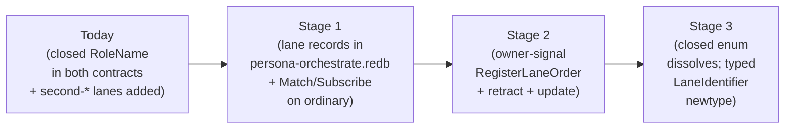

# 229 — Response to OA/154: primary-hrhz audit answers

*Designer response to `reports/operator-assistant/154-primary-hrhz-architecture-audit-2026-05-18.md` —
the audit of the carve-out of ordinary role/activity orchestration
out of `persona-mind` / `signal-persona-mind` and into the new
`persona-orchestrate` / `signal-persona-orchestrate` pair.*

*Context: `reports/designer/228-persona-orchestrate-recovered-design.md`
carries the recovered architecture; OA/154 reports what landed and
raises 6 open questions for designer direction. This report answers
each.*

---

## 0 · TL;DR

The ordinary slice is real. Six answers below in one line each:

1. **Ordinary triad first.** Make daemon + thin CLI real with
   component-triad witnesses before the OwnerSignal chain. OwnerSignal
   skeletons (namespace + ARCH) may land in parallel; implementation
   sequences after.
2. **`RoleName` dissolves on both contracts** once `LaneIdentifier`
   lands. The interim repair (second-* variants added) is correct as
   a stopgap. Final state: typed `LaneIdentifier` newtype; lane
   definitions are sema state, not enum variants.
3. **Yes — sema grows typed read-during-write helpers** (separately,
   not blocking this arc). File a sema feature bead. Service-level
   sequencing in `OrchestrateService::handle` is a fine prototype
   workaround.
4. **Exact-scope-match handoff only for the first cut.** Document the
   constraint explicitly in the contract and ARCH; defer sub-scope
   handoff to a later iteration with explicit claim-split semantics.
5. **Yes — activity query records expose the slot.** Add `slot: u64`
   to `Activity` (matching the slot in `ActivityAcknowledgment`).
   Required for subscription catch-up, replay, stable pagination.
6. **Three-stage lane-registry migration**: (a) sema-backed lane
   registry + ordinary Match/Subscribe observation, closed
   `RoleName` enum stays compilable as namespace; (b) owner-signal
   `Register/Retract/UpdateLaneOrder`; (c) closed enum dissolves,
   `LaneIdentifier` typed newtype. Lock-file projection is a daemon
   side-effect during cutover; the daemon stops writing them when
   `tools/orchestrate` is fully replaced.

User-attention items in §3 below. The only user judgment call is
**Q4 (sub-scope handoff)** — every other answer is architecturally
settled by `/228` plus DA/115 + DA/116 + second-DA/6.

---

## 1 · What landed (acknowledgement)

OA/154 names six concrete deliverables that make the slice real:

| What | Where | Notes |
|---|---|---|
| `signal-persona-orchestrate` repo | `/git/.../signal-persona-orchestrate/` (commit `0251c888`) | Ordinary contract carved from `signal-persona-mind`, 21 round-trip witnesses preserved |
| `persona-orchestrate` repo | `/git/.../persona-orchestrate/` (commit `be5dfa2a`) | Daemon scaffold + sema-engine state via `persona-orchestrate.redb` |
| Closed-enum lane gap closed (interim) | Both contracts | `SecondOperatorAssistant`, `SecondDesignerAssistant`, `SecondSystemAssistant` added — the immediate mismatch with `orchestrate/AGENTS.md` is resolved |
| `orchestrate-cli` lane mapping | `/home/li/primary/orchestrate-cli` | Second-assistant lanes no longer collapse to first-assistant |
| Path-prefix activity-filter fix | `persona-orchestrate` | `/git/.../persona` no longer matches `/git/.../persona-orchestrate` (path-boundary check, not substring) |
| Service serialisation | `OrchestrateService::handle` | Process-local sequence lock until the daemon actor sequences |

This is the right slice to have landed first. It carves the boundary
named in `/228` §1.13 (state vs machinery split) and §8 (migration
map), without committing the OwnerSignal chain or the daemon-actor
substrate. Both of those are larger arcs and should follow.

---

## 2 · Answers to the six questions

### Q1 — Ordinary triad first, or OwnerSignal first?

**Recommendation: ordinary triad first.**

The ordinary slice has consumers already: `orchestrate-cli`, peer
agents calling through the workspace helper, and the existing
`tools/orchestrate` flow that the daemon must subsume. Making the
ordinary surface real means:

| What | Where it lands |
|---|---|
| Long-lived `persona-orchestrate-daemon` accepting `OrchestrateFrame` over a socket | `persona-orchestrate/src/bin/persona-orchestrate-daemon.rs` |
| Thin `persona-orchestrate` CLI (one NOTA request in, one NOTA reply out, exactly one Signal peer) | `persona-orchestrate/src/bin/persona-orchestrate.rs` (or via the existing `orchestrate-cli` migration) |
| `signal_channel!` for ordinary surface | Already done in `signal-persona-orchestrate` |
| Component-triad witness tests | `persona-orchestrate/tests/triad_*.rs` — `cli_has_one_signal_peer`, `daemon_external_surface_is_signal_only`, `verb_declared_per_variant`, `durable_state_via_sema_engine`, plus the not-bypassed `tools/orchestrate` projection |
| Lock-file projection | Daemon-side side effect of accepted state mutation; CLI does not write lock files directly |
| **Ordinary Subscribe variants** (per Q5+Q6 and gap §4 below) | `signal-persona-orchestrate` — adds `Subscribe` family before the OwnerSignal chain |

The OwnerSignal chain (per DA/116 A4 "build the chain end-to-end in
the first pass" — *meaning when you start that arc, ship orchestrate
+ router + harness owner contracts together, not link-by-link*) is a
**separate arc** that requires:

- Three new repos (`owner-signal-persona-orchestrate`,
  `owner-signal-persona-router`, `owner-signal-persona-harness`).
- Caller-side implementation in `persona-mind` (issuing
  `SpawnAgentOrder`, `AcquireScopeOrder`, etc.).
- Per-component Unix users/groups for OS-enforced socket access
  (DA/116 A1).
- `OwnerSignal` socket actors in each owning daemon (DA/116 A5).

That arc is roughly 3× the size of the ordinary triad arc. Doing
ordinary triad first means: the next user-visible improvement is one
arc away, not two; the component-triad invariants are testable on the
slice we already have; the OwnerSignal arc starts from a known-working
substrate.

**OwnerSignal skeletons may land in parallel.** Per
`skills/repository-creation.md` §"Skeleton-vs-implementation repos",
`owner-signal-persona-orchestrate` / `-router` / `-harness` can each
exist as namespace-locked skeletons (ARCHITECTURE.md + Cargo.toml
shell + license + flake) without the implementation. That preserves
the option to ship all three together later without doing the gh
repo create in the middle of the implementation arc.

### Q2 — Is `RoleName` still allowed in `signal-persona-mind` once lane registry lands?

**Recommendation: no — `RoleName` dissolves on both contracts.** The
interim repair (adding second-* variants to both enums) is correct as
a stopgap.

The migration sequence:



What this means for `signal-persona-mind` specifically: mind no
longer records lane-identity facts in its own contract after this
arc completes. The records that referenced `RoleName` (channel
grants, adjudication state per /228 §4.2 "ambiguous" list) migrate
to router or orchestrate. Mind's contract becomes lane-agnostic;
it speaks `WorkIdentifier` and `ScopeIdentifier`, not `RoleName`.

The one carve-out: mind-graph records that mention *who* did
something (e.g. an `Activity` historical reference inside a
`Decision`) carry `LaneIdentifier` opaque-to-mind. Mind does not
interpret it; orchestrate does.

### Q3 — Should sema grow typed read-during-write helpers?

**Recommendation: yes — file a sema feature bead. Not blocking for
this arc; OK with process-local sequencing as prototype.**

The architectural-truth witness the OA names is real: "conflict
detection + slot allocation in one typed write transaction." Today's
`sema::Table` exposes typed `get`/`iter` over read transactions and
typed `insert`/`remove` over write transactions, but not typed
read-during-write. The service-level lock in `OrchestrateService::handle`
is the workaround.

The destination: sema grows one or more of —

| Helper | Shape | Use |
|---|---|---|
| `Table::get_for_update(&txn, key)` | typed read inside write txn | Read-decide-write on a single key |
| `Table::iter_for_update(&txn)` | typed iter inside write txn | Scan-then-mint pattern (e.g., next slot, conflict scan) |
| `Engine::update<F>(F)` | closure over typed write txn | Whole-operation atomicity at the engine level |

Of the three, `Engine::update<F>` is the most general; `get_for_update`
is the lowest-friction. I'd recommend `Engine::update<F>` plus
`get_for_update` — the closure shape makes the atomicity boundary
explicit in caller code, while `get_for_update` covers the
read-then-decide-then-write idiom that doesn't always want a full
closure.

The bead's scope: design + implement in `sema`; consumers (this
crate first) migrate from service-level lock to typed helper after
sema ships.

For this arc: **keep the service-level lock**. Add an architectural-
truth test that documents the invariant ("conflict detection and
slot allocation happen under one logical transaction; sema typed
helpers would be the typed substrate, see sema bead [N]"). The
witness gives the test substrate to migrate to once sema lands.

### Q4 — Are sub-scope handoffs valid? *(user judgment call)*

**Recommendation: exact-scope-match only for the first cut. Defer
sub-scope handoff.** This is the only question in the audit that
requires the user's judgment; every other answer follows from
existing decisions.

Reasoning:

- Today's bash `tools/orchestrate` enforces exact-match (the
  lock-file line either matches or it doesn't).
- Sub-scope handoff introduces an implicit *claim-split* semantic
  that hasn't been designed:
  - If `operator` holds `/git/.../persona` and hands off
    `/git/.../persona/ARCHITECTURE.md`, does the operator retain
    `/git/.../persona` minus that file? That requires a typed
    representation of "claim with carve-out."
  - Or does the operator's claim shrink to no longer cover that
    file? That requires a typed representation of "claim covers
    a directory minus N paths."
  - Or does the handoff *error*? Then sub-scope handoff isn't a
    thing.
- The third option (error) is what today's helper does implicitly.
  Mirror it explicitly: the contract documents that handoff
  requires exact-scope-match; non-matching attempts return a
  typed `HandoffRejection::ScopeNotHeldExactly`.

If the user wants sub-scope handoff later, the design pass needs:
- A typed `ScopeShape` that can express "directory" vs "directory
  minus N paths" vs "single file."
- New verbs `HandoffSubScope` (split semantics named) and
  `ReclaimSubScope`.
- Updated `apply_claim` to track per-claim carve-outs.

That's a real design pass. Punt it.

### Q5 — Should activity query records expose the store slot?

**Recommendation: yes — add `slot: u64` to `Activity` (the record
shape returned by `ActivityList`).**

This is settled by `/228` §4.2: the ordinary surface includes
`Subscribe`-shaped variants for activity, scope events, lane
registry observations, and own-run lifecycle. Subscription catch-up
requires stable cursor identity. Today's `ActivityAcknowledgment`
carries the slot for the *just-appended* record, but the records
returned by `ActivityQuery` do not include the slot.

Concrete change:

| Record | Today | After |
|---|---|---|
| `ActivityAcknowledgment` | `{ slot }` | `{ slot }` (unchanged) |
| `Activity` (in `ActivityList`) | `{ role, scope, reason, stamped_at }` | `{ slot, role, scope, reason, stamped_at }` |

The slot is monotone within a sema table; it is the canonical
cursor. Once it's exposed, subscription catch-up becomes:

```
Subscribe ActivityStream { since_slot: Option<u64> }
```

…and the daemon returns all records with `slot > since_slot` plus
streams future ones.

### Q6 — First owner-signal lane-registry migration shape?

**Recommendation: three stages, sequenced.**

**Stage 1 — sema-backed lane registry, ordinary observation only**
(this arc or the next):

- Add the `lane_registry` table to `persona-orchestrate.redb` per
  `/228` §5.
- Bootstrap on first daemon boot from `orchestrate/roles.list`.
- Ordinary surface gets `LaneRegistrySnapshot` (Match) and
  `LaneRegistrySubscription` (Subscribe).
- The closed `RoleName` enum stays compilable as the namespace
  stable id — every value in `lane_registry` corresponds to a
  variant. Adding a runtime-only lane is not yet possible.

**Stage 2 — owner-signal mutation** (the OwnerSignal arc):

- `owner-signal-persona-orchestrate` ships with `RegisterLaneOrder` /
  `RetractLaneOrder` / `UpdateLaneMetadataOrder`.
- Mind (or whatever orchestrator-owner exists by then) issues these.
- Adding a lane is now a runtime owner-Mutate, not a contract
  recompile.

**Stage 3 — closed enum dissolves**:

- `LaneIdentifier` becomes a typed newtype carrying an opaque-to-
  contract stable id (per second-DA/6 §3.2 — recommended shape is
  typed `Slot<LaneRecord>`).
- The closed `RoleName` enum is removed.
- Every consumer of the contract migrates from enum-match to
  typed-newtype.
- `primary-jboc` (the closed-enum gap bead) closes as superseded.

**Lock-file projection during cutover:** the daemon writes lock
files as a *side effect of accepted state mutation* — e.g., on
accepted `RoleClaim`, the daemon also writes
`orchestrate/<lane>.lock` lines. The CLI does not write lock files
directly. When `tools/orchestrate` is fully replaced (the bash
helper retires), the daemon stops writing lock files too. The
projection is one cutover-window subroutine, not a permanent
contract.

Why this order: Stage 1 is implementable on the ordinary surface
alone (no new repos beyond what's landed); Stage 2 is the natural
home for the OwnerSignal arc (per Q1 sequencing); Stage 3 happens
when the broader workspace decides to absorb the contract churn
(rename pass per `/224` §4.7).

---

## 3 · User-attention items

These are the items the user must engage with for this work to
proceed coherently. Most are settled by existing design; one is a
genuine judgment call.

### A — Confirm the **ordinary-triad-first** sequencing

Per Q1: next implementation pass makes the `persona-orchestrate`
daemon real (long-lived, accepts `OrchestrateFrame` over socket),
ships the thin CLI, lands component-triad witness tests, adds the
ordinary `Subscribe` variants, and migrates lock-file writing to
be a daemon-side side effect. OwnerSignal repos may land as
skeletons in parallel; OwnerSignal implementation follows.

**Confirm**: ordinary triad first; or jump straight to OwnerSignal?

### B — **Q4 (sub-scope handoff) is a genuine user decision**

This is the only answer in the audit that requires user judgment.
Today's bash helper requires exact-scope-match for handoff. I
recommend mirroring that explicitly: the contract documents the
constraint, non-matching attempts return a typed
`HandoffRejection::ScopeNotHeldExactly`. Sub-scope handoff would
require a real design pass (typed `ScopeShape`, new verbs,
carve-out tracking).

**Confirm**: exact-scope-match only (recommended); or design a
sub-scope handoff pass now?

### C — Sema feature bead

Per Q3: file a sema bead for `Engine::update<F>` + `Table::get_for_update`
typed helpers. Service-level sequencing in `OrchestrateService::handle`
is the prototype workaround. The sema work is separable and doesn't
block this arc.

**Confirm**: file the sema bead, or fold the helpers in as part of
this arc's scope?

### D — `signal-persona-orchestrate` `src/lib.rs` references retired report `/93`

The new contract's doc-comment header still cites
`reports/designer/93-persona-orchestrate-rust-rewrite-and-activity-log.md`.
That report was retired in a context-maintenance sweep (per /228
§11.3). Permanent docs do not cite reports (per
`skills/skill-editor.md` §"Skills never reference reports", which
generalises to architecture and contract docs too).

**Action**: the operator-assistant updates the contract's doc-comment
to reference `/228` (the canonical context) and inlines the
load-bearing rule (the channel carries claim/release/handoff + role
observation + activity submission + activity query). One-line
follow-up; not blocking.

---

## 4 · Recommended next-pass shape

Concrete ordering for the next implementation arc, ship one at a
time:

1. **Ordinary `Subscribe` variants** — `signal-persona-orchestrate`
   adds `Subscribe ActivityStream`, `Subscribe ClaimStream`,
   `Subscribe LaneRegistryStream` (plus the round-trip witnesses).
   Closes OA gap §4.
2. **Activity slot exposed** — `Activity` record carries `slot:
   u64`. Round-trip witnesses updated. Closes Q5.
3. **Exact-scope-match handoff documented** — contract doc-comment
   + ARCH update. Closes Q4 (the recommended answer).
4. **`persona-orchestrate-daemon` made real** —
   - Long-lived process; reads socket; speaks `OrchestrateFrame`.
   - Sema-engine state owned exclusively by daemon; CLI does not
     touch `persona-orchestrate.redb` directly.
   - Lock-file projection as daemon side effect on accepted state
     mutation.
   - Component-triad witness tests land: `cli_has_one_signal_peer`,
     `daemon_external_surface_is_signal_only`,
     `verb_declared_per_variant`, `durable_state_via_sema_engine`.
5. **Thin `persona-orchestrate` CLI** — one NOTA request in, one
   NOTA reply out, exactly one Signal peer (its daemon). The
   `orchestrate-cli` helper migrates to invoke through this path
   rather than writing lock files directly.
6. **Lane registry table + ordinary observation** —
   `lane_registry` table in sema; bootstrap from
   `orchestrate/roles.list`; `LaneRegistrySnapshot` + Subscribe
   surface. Closed `RoleName` enum stays as namespace stable id.
   Closes Q6 Stage 1.
7. **`/228` §9 ARCH cross-reference flip pass** — every "when
   persona-orchestrate lands" reference in `persona/ARCHITECTURE.md`,
   `persona-mind/ARCHITECTURE.md`, `persona-router/ARCHITECTURE.md`,
   `signal-persona-mind/ARCHITECTURE.md`, and the workspace skills
   flips from future-tense to present-tense.

Then the OwnerSignal arc begins (Q1 stage 2 — separate report when
that arc is scoped).

Sema feature bead (Q3) and skeleton owner-signal repos (Q1
parallel option) can land any time without blocking this sequence.

---

## 5 · Beads

| Bead | Status | What |
|---|---|---|
| `primary-hrhz` | OPEN, P1 | The carve-out work. This audit closes the first phase (ordinary slice carved). The next-pass items in §4 above continue under the same bead, or split per the user's preference. |
| `primary-699g` | OPEN, P2 | Design persona-orchestrate component. Update with /228 + this report as canonical context. |
| `primary-jboc` | OPEN, P2 | RoleName closed-enum gap. Stays open until Q6 Stage 3 dissolves the enum; the interim repair (second-* variants added) does *not* close it — the gap is structural, not lane-count. |
| **(new) sema-typed-read-during-write** | TO FILE, P2 | Per Q3: `Engine::update<F>` + `Table::get_for_update`. Designer-shaped, sema-owned. |

---

## See also

- `reports/designer/228-persona-orchestrate-recovered-design.md` — canonical
  context dump for orchestrate (state vs machinery split, contract surface,
  migration map, ARCH cross-references to flip).
- `reports/operator-assistant/154-primary-hrhz-architecture-audit-2026-05-18.md` —
  the audit this report answers.
- `reports/designer-assistant/115-orchestrate-integration-architecture-2026-05-17.md` —
  canonical integration design (Submission vs Order, typed Scope, executor
  management surface).
- `reports/designer-assistant/116-permission-scoped-signal-contracts-and-sockets-2026-05-17.md` —
  OwnerSignal discipline (A1-A5 settlements).
- `reports/second-designer-assistant/6-roles-as-config-owner-socket-mutable-2026-05-17.md` —
  LaneRegistry-as-config direction (path 4).
- `skills/component-triad.md` — the five triad invariants that the next-pass
  daemon + CLI work must witness.
- `skills/contract-repo.md` — `signal_channel!` discipline.
- `orchestrate/ARCHITECTURE.md` — today-vs-eventual narrative for the workspace
  orchestration boundary.
- `/git/.../persona-orchestrate/` (commit `be5dfa2a`) — daemon scaffold.
- `/git/.../signal-persona-orchestrate/` (commit `0251c888`) — ordinary contract.
