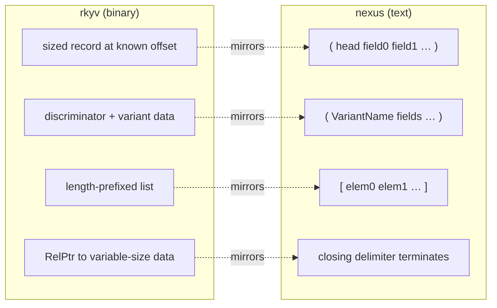
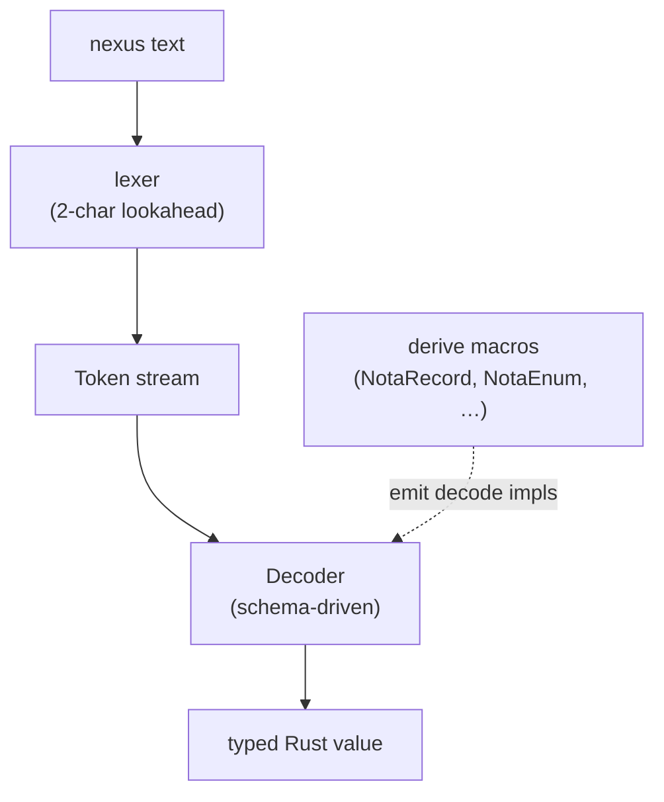
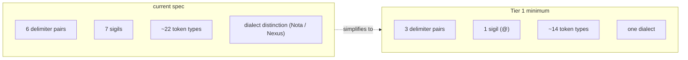

# Nexus — re-rooting on the structural minimum

Status: rewrite of report 22's framing
Author: Claude (designer)

The user caught me reading nexus as if it were a programming
language. I wrote *"`(| Point @h @v |) { @h }` returns just the
horizontal field"* in report 22 — but that's two top-level
expressions in nexus, not a composable query-with-projection.
Nexus has no expression composition: no operators, no function
calls, no nested verbs. Each top-level expression is one
self-contained typed record.

The user's framing for this report:

> Understand what nexus was trying to do for the criome (the
> greatest database language ever made — a structural base
> (delimiters) and everything else is an Enum).
>
> Implementation in datatypes for a fully-explicit positional
> text format that essentially mirrors the world of explicitly-
> typed binary formats like capnp and rkyv, but in text with a
> clever "lispy" approach. No deep lookahead — two characters
> for complex delimiters at most.

This report re-roots on first principles, drops every pattern I
imported from "real programming languages," and proposes the
structural minimum that still serves criome's full role.

---

## 0 · TL;DR

Nexus is a **typed text format**, not a language. It mirrors
capnp/rkyv in text:

- **rkyv (binary):** positional, sized, type tags via
  discriminator unions; size in compile-time layout.
- **nexus (text):** positional, delimiter-terminated, type
  tags via head identifiers; size implicit in the closing
  delimiter.

The structural base is delimiters. Everything else — verbs,
record kinds, pattern fields, diagnostic levels — is **an
enum**, dispatched by the schema, not by the parser.

The minimum to do this elegantly is **2 or 3 delimiter pairs**
(plus standard literals, comment marker, byte prefix), and the
parser needs **at most 2 characters of lookahead** to recognise
a delimiter open. After the delimiter, the schema drives.

Concrete recommendation: **3 delimiter pairs** (`( )`, `[ ]`,
`(| |)`), **2 in-position pattern markers** (`@`, `_`),
standard literals, comment, byte prefix. Drop all verb sigils,
all other piped delimiters, all comparison operators, and
bind aliasing. Lexer becomes ~13 token types (down from ~22).

---

## 1 · Where I went wrong in report 22

```nexus
(| Point @h @v |) { @h }
```

I read this as "query Points binding `h` and `v`, project just
`h`." That's wrong on two levels:

1. **Nexus has no projection operator.** `{ }` is *a delimiter
   pair*, not a postfix selector. There's no syntax that joins
   `(| ... |)` with `{ ... }` — they are independent top-level
   forms.
2. **`{ }` shape isn't even implemented.** It's lexed but the
   parser never reaches it. There's no IR shape for it. There's
   no consumer.

Two records, sitting next to each other in text — that's all
the grammar says. They could appear together in a stream of
edits or queries; they don't compose into one operation.

This was a symptom of a deeper category error: I imported
patterns from SQL (`SELECT ... WHERE ...`), GraphQL
(query-with-projection), Datalog (rule chains), Lisp (function
calls). Nexus is **none of those**. It is a *typed text format
mirroring rkyv*. Each top-level expression is one record;
sequences of records are independent.

The rest of report 22's content — the implementation gap, the
push-not-pull tension, the per-construct audit — stands. But
the underlying mental model needs the reset this report gives.

---

## 2 · The category nexus is in

Three text-format families, with one example each:

| Family | Representative | Defining feature |
|---|---|---|
| **General-purpose data formats** | JSON, YAML, TOML | Untyped key-value structure; consumers parse to types |
| **Programming languages** | Lisp, Datalog, SQL | Composable expressions; operators; function call |
| **Typed binary formats** | capnp, rkyv, protobuf | Schema-driven layout; positional fields; closed enum dispatch |

Nexus belongs in family 3, written in text. The text equivalent
of an rkyv archive: **schema-driven positional records, with
delimiters as the size-implicit terminator.**

What this rules out:

- **No expression composition.** A nexus expression doesn't
  combine with another nexus expression to form a third. Each
  top-level form is one record; the wire is a stream of
  records.
- **No operators.** No `+`, no `=` (other than the deferred
  bind-alias use), no comparisons. Operators imply
  expressions; nexus has only records.
- **No function calls.** A record `(Foo a b c)` is not "calling
  Foo with args a b c." It's the typed value `Foo { a, b, c }`.
- **No keywords beyond `true` / `false` / `None`.** The parser
  doesn't dispatch on words; it dispatches on token types.
- **No type inference.** The schema declares the type at every
  position. The parser reads the bytes the schema says are
  there.

What this commits to:

- **Position carries identity.** Field names live in the
  schema, not the text.
- **Head identifier carries variant.** Closed enum dispatch
  via the first PascalCase token after `(`.
- **Closing delimiter terminates value.** No length prefix
  needed; `)` ends a record, `]` ends a sequence.
- **Schema drives parsing.** The decoder is called with a
  type expectation; it reads the structural form, dispatches
  on the head identifier, recurses.

---

## 3 · How rkyv encodes types — and how text mirrors this



The structural elements have one-to-one parallels:

| rkyv element | nexus element | How size is encoded |
|---|---|---|
| `struct Point { f64, f64 }` (16 bytes, fixed) | `(Point 3.0 4.0)` | Schema says 2 fields; closing `)` confirms |
| `enum AssertOp { Node(Node), Edge(Edge) }` (1-byte tag + variant data) | `(Node "User")` or `(Edge 100 101 Flow)` | Head ident is the tag; schema dispatches |
| `Vec<Node>` (4-byte len + data) | `[(Node "a") (Node "b")]` | Closing `]` is the length |
| `String` (4-byte len + UTF-8 bytes) | `"hello"` or bare `hello` | Closing `"` or bare-ident boundary |

**Variable-size types in text don't need length prefixes
because closing delimiters mark the end.** The decoder reads
forward; when it sees `)`, the record is done; when it sees
`]`, the sequence is done. The schema told it how many fields
to expect; the closer is the proof the end was reached.

This is the answer to the user's question *"how do they
encapsulate different types which have different size?"* —
**delimiters are size markers**, and the schema knows the
*shape* (field types) so it knows what to read inside.

---

## 4 · Implementation in datatypes

### The Token enum (lexer output)

```rust
pub enum Token {
    // Structural delimiters — the only "syntax" the parser knows
    LParen, RParen,             // ( )
    LBracket, RBracket,         // [ ]

    // Optional pattern-distinguishing pair (Tier 1, see §6)
    LParenPipe, RParenPipe,     // (| |)

    // Identifiers — three lexical classes (PascalCase, camelCase, kebab-case)
    Ident(String),

    // Literals
    Int(i128),
    UInt(u128),
    Float(f64),
    Bool(bool),
    Str(String),
    Bytes(Vec<u8>),

    // In-position pattern markers (only valid inside (| |))
    At,                         // @
    // (Wildcard `_` is just an Ident — no special token needed)
}
```

That's **~14 token variants** for Tier 1. The lexer's job is
trivial: peek 1-2 bytes, emit the matching token. The lexer
rejects `<`, `>`, `<=`, `>=`, `!=` (reserved), and anything
not in this list.

### The Decoder is schema-driven

```rust
pub trait NotaDecode: Sized {
    fn decode(d: &mut Decoder) -> Result<Self>;
}
```

Every type implements `NotaDecode`. The implementation reads
the structural form it expects:

```rust
// For a record:
impl NotaDecode for Point {
    fn decode(d: &mut Decoder) -> Result<Self> {
        d.expect_record_head("Point")?;          // consumes `(Point`
        let horizontal = f64::decode(d)?;        // reads next token as f64
        let vertical = f64::decode(d)?;
        d.expect_record_end()?;                  // consumes `)`
        Ok(Self { horizontal, vertical })
    }
}

// For a closed enum:
impl NotaDecode for AssertOperation {
    fn decode(d: &mut Decoder) -> Result<Self> {
        d.expect_record_open()?;                 // consumes `(`
        match d.read_pascal_identifier()? {
            "Node" => {
                let inner = Node::decode_after_head(d)?;
                Ok(AssertOperation::Node(inner))
            }
            "Edge" => { /* ... */ }
            other => Err(Error::UnknownVariant(other)),
        }
    }
}

// For a sequence:
impl<T: NotaDecode> NotaDecode for Vec<T> {
    fn decode(d: &mut Decoder) -> Result<Self> {
        d.expect_seq_start()?;                   // consumes `[`
        let mut items = Vec::new();
        while !d.peek_is_seq_end()? {
            items.push(T::decode(d)?);
        }
        d.expect_seq_end()?;                     // consumes `]`
        Ok(items)
    }
}
```

The derive macros (`NotaRecord`, `NotaEnum`, `NexusVerb`,
`NotaTransparent`, `NexusPattern`) generate exactly this kind
of code. The parser layer (token stream) and the decoder layer
(schema-driven) are cleanly separated.

### The whole stack



The parser proper has **no schema knowledge**. It produces
tokens. The decoder has **no syntactic knowledge** beyond
"records open with `(` and close with `)`." The schema lives
in the typed values' impls of `NotaDecode`.

This is what the user means by *"a structural base (delimiters)
and everything else is an Enum."* The structural base is
trivial; the enums (variants) carry every interpretation.

---

## 5 · Auditing the spec under the structural-minimum lens

Now the per-construct audit re-runs with the question *"is
this part of the structural base, or could it be an enum
variant?"*

| Construct | Structural? | Could be enum? | Verdict |
|---|---|---|---|
| `( )` records | YES — universal typed composite | — | Keep |
| `[ ]` sequences | YES — universal list | — | Keep |
| `(\| \|)` patterns | Partial — could be record kind | Could be `(Pattern Foo …)` | Optional (see Tier 1 vs 0) |
| `[\| \|]` atomic batch | NO — it's just a sequence with mixed verbs | Could be `(AtomicBatch [op1 op2 …])` | **Drop** |
| `{ }` shape | NO — never implemented; no consumer | Could be `(Shape [field1 field2])` | **Drop** |
| `{\| \|}` constrain | NO — never implemented; no consumer | Could be `(Constrain [pat1 pat2])` | **Drop** |
| `~` mutate | NO — verb dispatcher | Could be `(Mutate (Node …))` | Tier 0: drop. Tier 1: keep. |
| `!` retract | NO — verb dispatcher | Could be `(Retract slot)` | Tier 0: drop. Tier 1: keep. |
| `?` validate | NO — verb dispatcher | Could be `(Validate (Node …))` | Tier 0: drop. Tier 1: keep. |
| `*` subscribe | NO — verb dispatcher | Could be `(Subscribe (\| Node @id \|))` | Tier 0: drop. Tier 1: keep. |
| `@` bind | Half — pattern-position marker | Could be `(Bind name)` record | Keep (load-bearing for ergonomics) |
| `_` wildcard | No (it's just an ident) | Already an Ident | Keep |
| `=` bind alias | NO — never implemented | Drop or keep reserved | **Drop** |
| `< > <= >= !=` | NO — predicates can be records | Use `(Adult @age)` style | **Drop** |

**Confirmed drops** (no design controversy):
- `{ }` shape — never used.
- `{| |}` constrain — never used.
- `[| |]` atomic batch — replaceable by `(AtomicBatch [...])`.
- `=` bind alias — never used.
- `< > <= >= !=` — replaceable by predicate records.

**Open question** (the design choice):
- Verb sigils `~ ! ? *` and the pattern delimiter `(| |)` —
  keep for ergonomics, or drop for uniformity?

---

## 6 · Two tiers — pick one

### Tier 0 — most uniform (everything is a record)

```nexus
;; Assert
(Assert (Node User))

;; Mutate
(Mutate (Node 100 "User updated"))

;; Retract
(Retract Node 100)

;; Query
(Query (Pattern Node (Bind name)))

;; Subscribe
(Subscribe (Pattern Node (Bind name)))

;; Validate (dry-run)
(Validate (Mutate (Node 100 "User updated")))

;; Atomic batch
(AtomicBatch [(Assert (Node a)) (Mutate (Node b 100)) (Retract Node c)])
```

**Tokens needed:** `(`, `)`, `[`, `]`, identifiers, literals.
**~10 token types.**

**Pros:**
- Maximum uniformity. Every concept is a record kind.
- Parser is the smallest possible.
- New verbs are new enum variants; no grammar change ever
  needed.
- Schema fully owns the interpretation.

**Cons:**
- Bulky for pattern-heavy queries:
  - `(Pattern Node (Bind name))` — 24 chars
  - `(| Node @name |)` — 16 chars
- Verbs are visually less distinct (`(Mutate …)` reads as data
  until you parse the head).

### Tier 1 — ergonomic minimum (patterns + bind sigil preserved)

```nexus
;; Assert (records at top of connection are asserts by convention,
;;        OR wrapped in (Assert …) — implementation choice)
(Node User)

;; Mutate
(Mutate (Node 100 "User updated"))

;; Retract
(Retract Node 100)

;; Query
(| Node @name |)

;; Subscribe — wrapped, because `*` is gone in this tier
(Subscribe (| Node @name |))

;; Validate
(Validate (Mutate (Node 100 "User updated")))

;; Atomic batch
(AtomicBatch [(Node a) (Mutate (Node b 100)) (Retract Node c)])
```

**Tokens needed:** `(`, `)`, `[`, `]`, `(|`, `|)`, `@`,
identifiers, literals. **~14 token types.**

**Pros:**
- Patterns visually distinct via `(| |)`.
- Bind position uses ergonomic `@name` instead of `(Bind name)`.
- Wildcard `_` is just an Ident; no extra token.
- Verbs are records, so the parser doesn't dispatch on them —
  the schema does.
- Strikes a balance: visual help where it counts (patterns),
  uniformity everywhere else.

**Cons:**
- One more delimiter pair (still 2-char lookahead).
- One more in-position sigil (`@`).
- Subscribe / Validate / Mutate / Retract are slightly bulkier
  than the current `*( | )` / `?( )` / `~( )` / `!( )` forms.

### My recommendation: Tier 1

The pattern delimiter and bind sigil are real ergonomic wins —
patterns are dense, and writing `(Pattern Node (Bind name))`
many times in a query session is friction. The cost (one
delimiter pair, one in-position sigil) is bounded.

The verb sigils, by contrast, are used once per top-level
expression. The savings (`~(Node ...)` vs `(Mutate (Node ...))`)
are smaller per use, and the cost (4 sigils plus their parser
arms) is real. The schema-driven `Mutate` / `Retract` / etc.
records are clearer to read for non-experts and need zero
parser changes when verbs are added.

The recommended grammar is shown in the Tier 1 examples above.

---

## 7 · Comparing Tier 1 to the current state



What goes from current → Tier 1:

| Current | Tier 1 |
|---|---|
| `~(Node ...)` mutate sigil | `(Mutate (Node ...))` record |
| `!(Node ...)` retract sigil | `(Retract Node ...)` record |
| `?(Node ...)` validate sigil | `(Validate (Node ...))` record |
| `*(\| ... \|)` subscribe sigil | `(Subscribe (\| ... \|))` record |
| `[\| op1 op2 \|]` atomic batch | `(AtomicBatch [op1 op2])` record |
| `{ ... }` shape | DROPPED (no consumer) |
| `{\| ... \|}` constrain | DROPPED (no consumer) |
| `@a=@b` bind alias | DROPPED (no consumer) |
| `< > <= >= !=` reserved | DROPPED (predicate records instead) |

What stays:
- `( )` records.
- `[ ]` sequences.
- `(| |)` patterns.
- `@` bind in pattern fields.
- `_` wildcard (as an Ident).
- All literals (Int / UInt / Float / Bool / Str / Bytes).
- `;;` line comments.
- `#hex…` byte literals.
- `:` path separator.

**One dialect.** Both nota and nexus collapse to the same
grammar — what was "nexus" becomes "nota plus the Pattern
delimiter and `@` marker." The dialect distinction goes away.
The Decoder no longer needs `nota()` vs `nexus()` constructors.

---

## 8 · Worked example: criome's full surface in Tier 1

```nexus
;; ── Asserts ────────────────────────────────────────
(Node User)
(Node "nexus daemon")
(Edge 100 101 Flow)

;; ── Mutates ────────────────────────────────────────
(Mutate (Node 100 "User updated"))
(Mutate (Edge 200 100 102 DependsOn))

;; ── Retracts ───────────────────────────────────────
(Retract Node 100)
(Retract Edge 200)

;; ── Queries ────────────────────────────────────────
(| Node @name |)
(| Edge 102 @to @kind |)
(| Edge @from @to DependsOn |)

;; ── Subscribes ─────────────────────────────────────
(Subscribe (| Node @name |))
(Subscribe (| Delivery @messageSlot bob Pending |))

;; ── Validate ───────────────────────────────────────
(Validate (Mutate (Node 100 "tentative")))

;; ── Atomic batch ───────────────────────────────────
(AtomicBatch [
  (Node alice)
  (Node bob)
  (Edge 100 101 Flow)
])

;; ── Replies (from criome) ──────────────────────────
(Ok)
(Diagnostic Error "E0042" "no binding for unknown-target")
[(Node "User") (Node "nexus daemon")]   ;; query result — records
```

Every operation criome needs is expressible in Tier 1. The
grammar is uniform; the schema does all the work; the parser
is small.

---

## 9 · How the Token enum looks under Tier 1

```rust
pub enum Token {
    // Structural delimiters
    LParen,         // (
    RParen,         // )
    LBracket,       // [
    RBracket,       // ]
    LParenPipe,     // (|
    RParenPipe,     // |)

    // In-position pattern marker
    At,             // @

    // Identifiers and literals
    Ident(String),
    Bool(bool),
    Int(i128),
    UInt(u128),
    Float(f64),
    Str(String),
    Bytes(Vec<u8>),

    // The path separator stays as a token because it appears
    // mid-identifier (e.g., Char:Upper:A); the lexer emits
    // it as a separate token.
    Colon,          // :
}
```

**14 variants.** The lexer's dispatch is straightforward:

```rust
match self.peek_byte() {
    Some(b'(') => match self.peek_byte_at(1) {
        Some(b'|') => emit LParenPipe (consume 2 bytes),
        _ => emit LParen (consume 1 byte),
    },
    Some(b')') => emit RParen,
    Some(b'[') => emit LBracket,
    Some(b']') => emit RBracket,
    Some(b'|') => match self.peek_byte_at(1) {
        Some(b')') => emit RParenPipe (consume 2 bytes),
        _ => Error: stray `|`,
    },
    Some(b'@') => emit At,
    Some(b':') => emit Colon,
    Some(b'#') => read bytes literal,
    Some(b'"') => read string,
    Some(b'-') | Some(b'0'..=b'9') => read number,
    Some(b';') if peek(1) == b';' => skip line comment,
    _ if is_ident_start(b) => read identifier (or true/false/None),
    _ => Error,
}
```

**Maximum 2-byte lookahead** at every decision point, exactly
matching the user's constraint. After the lexer, the schema
drives.

---

## 10 · What this means for criome and Persona

### For criome

The structural minimum still serves criome's full role
(§8 above shows every verb expressible). The implementation
work needed:

1. Land the M1+ verbs in the parser. Under Tier 1, this is
   trivial: the parser sees `(`, expects a `Request` enum
   variant, reads the head ident, dispatches. No new sigils,
   no new delimiters.
2. Drop the unused tokens (`{`, `}`, `{|`, `|}`, `[|`, `|]`,
   `~`, `!`, `?`, `*`, `=`) from the lexer.
3. Update `nexus/spec/grammar.md` to match.
4. Re-derive Request as `NotaRecord` (currently it's
   wire-only because of the sigil-mixed dispatch).

### For Persona

Per designer report 21, Persona uses nexus + signal-persona.
Under Tier 1:

- `(Message alice bob "send me status")` — assert.
- `(| Delivery @messageSlot bob Pending |)` — pattern (query).
- `(Subscribe (| Delivery @messageSlot bob Pending |))` —
  push-subscribe to pending deliveries.
- `(Mutate (Delivery 247 bob (Deferred HumanFocus)))` — gate
  defers a delivery.

Same domain, simpler grammar. Persona benefits from the
nexus simplification without changing its record-kind design.

---

## 11 · Recommendations

### Spec changes (definitive drops)

| Construct | Action |
|---|---|
| `{ }` shape | Drop from spec; un-reserve the tokens |
| `{\| \|}` constrain | Drop from spec; un-reserve the tokens |
| `[\| \|]` atomic batch | Drop; replace with `(AtomicBatch [...])` |
| `=` bind alias | Drop; un-reserve |
| `< > <= >= !=` reserved | Drop; un-reserve. Predicates land as schema records |

### Spec changes (verb sigils — Tier 1 recommendation)

| Construct | Action |
|---|---|
| `~` mutate sigil | Drop; replace with `(Mutate (Inner ...))` |
| `!` retract sigil | Drop; replace with `(Retract Kind slot)` |
| `?` validate sigil | Drop; replace with `(Validate (...))` |
| `*` subscribe sigil | Drop; replace with `(Subscribe (\| ... \|))` |

### Spec changes (kept for ergonomics)

| Construct | Reason |
|---|---|
| `(\| \|)` pattern delimiter | Visual distinction for queries |
| `@` bind marker | Ergonomic in pattern position |
| `_` wildcard (as Ident) | No new token; just a value |

### Implementation work

| Action | Priority |
|---|---|
| Update `nexus/spec/grammar.md` to Tier 1 form | P0 |
| Trim `Token` enum in `nota-codec/src/lexer.rs` | P0 |
| Drop dialect distinction in `Lexer` / `Decoder` / `Encoder` | P1 |
| Re-derive `Request` as `NotaRecord` (gain text round-trip) | P0 |
| Migrate signal's `MutateOperation` / `RetractOperation` parser arms (currently sigil-driven) | P1 |
| Update derives (`NexusVerb` may simplify or merge with `NotaEnum`) | P2 |

### Workspace skill updates

| Action | Where |
|---|---|
| `~/primary/skills/contract-repo.md` | Note that the contract repo's verb enum is a `NotaRecord` not a sigil-dispatch type |
| `~/primary/skills/push-not-pull.md` §"Subscription contract" | Reconcile with nexus subscribe semantics (per report 22 §5) |

---

## 12 · Closing — what nexus is, in one sentence

**Nexus is rkyv written in text: positional records dispatched
by head identifier, sequences terminated by closing delimiter,
with the schema doing all the typing the binary version
encodes in compile-time layout.**

Everything else is an enum.

---

## 13 · See also

- `~/primary/reports/designer/22-nexus-state-of-the-language.md`
  — the prior audit. This report supersedes its framing
  (nexus is not a programming language) but inherits its
  per-construct recommendations.
- `~/primary/reports/designer/21-persona-on-nexus.md` —
  Persona's adoption of nexus; Tier 1 is what Persona's
  examples should look like.
- `~/primary/repos/nexus/spec/grammar.md` — the spec to revise.
- `~/primary/repos/nota/README.md` — the kernel. Tier 1
  effectively merges nota and nexus into one grammar.
- `~/primary/repos/nota-codec/src/lexer.rs` — current Token
  enum. Tier 1 trims to the 14 variants in §9.
- `~/primary/repos/nota-codec/src/decoder.rs` — schema-driven
  decode methods. The shape is right; the dialect distinction
  goes away.
- `~/primary/repos/nota-derive/src/lib.rs` — six derives.
  Under Tier 1, `NexusVerb` may merge with `NotaEnum` (the
  distinction was about sigil-dispatch).
- `~/primary/repos/signal/src/edit.rs` — `AssertOperation` /
  `MutateOperation` / `RetractOperation`. Each is already a
  closed enum; only the wire-form story changes.
- `~/primary/skills/push-not-pull.md` §"Subscription
  contract" — the skill rule to reconcile with nexus subscribe.

---

*End report.*
