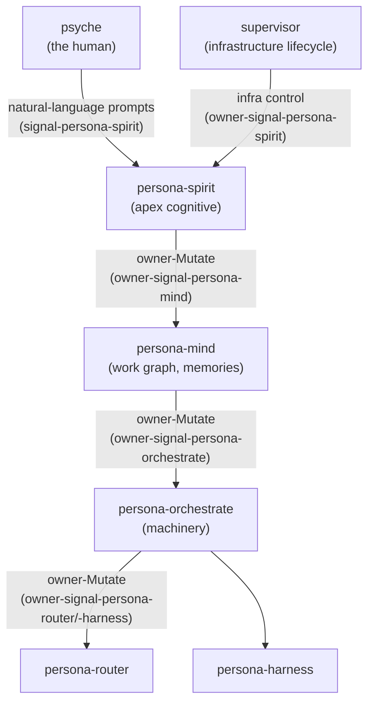

# 232 — persona-spirit: new component, psyche ↔ mind interface

*A new persona component sitting at the apex of the cognitive
authority chain. Spirit captures psyche intent in natural language,
parses it into typed records, and projects it into mind's memory
graph via owner-Mutate. Spawned last in the engine boot order;
designed per psyche illumination on 2026-05-19; operator picks up
implementation. The psyche has named this the most important
component of the persona system.*

## 0 · TL;DR

`persona-spirit` is a new triad component. It is the **interface
between `persona-mind` and the psyche** — the part of the persona
system that tracks the human, captures intent, and projects psyche
direction into mind's typed memory graph.

It is the **apex of the cognitive authority chain.** The supervisor
has higher permission only as infrastructure (process lifecycle); spirit
is the apex among thinking components. Spawned **last** in the persona
engine boot order — every component it depends on must be up first.

Operator picks up implementation per **`primary-ojxq`** (P1).
The psyche has named this the most important component of the
persona system.

Three repos to create:

- `persona-spirit/` — daemon + thin CLI + `bootstrap-policy.nota`
- `signal-persona-spirit/` — ordinary contract
- `owner-signal-persona-spirit/` — owner-only contract

Six open questions for the designer-operator pair settle below.

## 1 · Why this component exists

The psyche stated the illumination directly. From
`intent/persona.nota`:

- *"It is the interface between the persona mind and the psyche."*
- *"the apex, the most powerful part, notwithstanding the supervisor."*
- *"a sort of persona mind of its own, but it's specialized on the
  psyche, on keeping track of the psyche."*
- *"Persona is a meta AI system. … what drives humans, right, at the
  highest level is spirit. That's what animates us."*

The naming carries the architecture: spirit animates. A persona
without spirit is mechanism; with spirit, it has direction tied to a
real psyche. The scriptural framing (first breath gives life) and the
astrological framing (first breath gives the personality chart) both
emphasize that spirit is the principle that turns substrate into a
living system. `persona-spirit` plays that role for persona.

Functionally:

- The psyche speaks natural-language prompts. Spirit receives them.
- Spirit parses prompts into typed intent (the five-kind
  `Decision`/`Principle`/`Correction`/`Clarification`/`Constraint`
  vocabulary from `skills/intent-log.md`).
- Spirit forwards intent into mind's authority chain via owner-Mutate
  on `owner-signal-persona-mind`.
- Spirit tracks psyche presence/absence, recent intent history, and
  pending intent-clarification questions (per
  `skills/intent-clarification.md`).
- Long-term: spirit owns the canonical intent surface (today's
  filesystem `intent/<topic>.nota` files migrate into spirit's
  sema-engine state; spirit projects them back to disk during the
  cutover window for tool compatibility).

## 2 · Authority position

Spirit sits at the apex of the cognitive structure. The authority
graph after spirit lands:



Two implications for existing components:

- **`persona-mind` gains an owner.** Mind currently has no upstream
  cognitive authority; spirit becomes that authority. *Psyche
  confirmed 2026-05-19.* `owner-signal-persona-mind` gains variants
  for spirit-to-mind orders. The concrete relationship — what mind
  receives from spirit beyond intent-awareness — develops as the
  components flesh out. The psyche has stated the apex; the precise
  verb set is design work that follows implementation, not a
  blocker for it.
- **`owner-signal-persona-spirit`'s only legitimate caller is the
  supervisor.** Spirit has no cognitive owner; the supervisor uses
  its owner contract for process-lifecycle concerns only (start,
  stop, drain, reload bootstrap-policy).

## 3 · Component shape

Per `skills/component-triad.md` — the five invariants apply unchanged.

```
persona-spirit/
  src/lib.rs
  src/bin/persona-spirit-daemon.rs
  src/bin/persona-spirit.rs        thin CLI
  bootstrap-policy.nota
signal-persona-spirit/
  src/lib.rs                       signal_channel! ordinary surface
  tests/round_trip.rs
owner-signal-persona-spirit/
  src/lib.rs                       signal_channel! owner surface
  tests/round_trip.rs
```

Component-triad witness tests apply (all five invariants).

## 4 · Spirit's state

Per `skills/component-triad.md` invariant #5, state splits into
policy and working categories. Both live in `persona-spirit.redb` via
`sema-engine`.

**Policy state** (owner-Mutate from supervisor only; first-start
bootstrap from `bootstrap-policy.nota`):

The bootstrap is **the first intent — the root of spirit**.
*Psyche on 2026-05-19: "the seed file is the first intent, right?
The root of spirit. Something like do no harm. Well, maybe not, but
basic stuff about how to live properly."* The shape: foundational
right-knowledge / right-action principles in the spirit of the
Bhagavad Gita. A separate research arc (deferred — not blocking
implementation) will draft the actual content from the most
important sacred teachings.

Other policy state:
- Psyche identity markers
- Authority delegation policy (which downstream Mutates spirit is
  authorised to issue against which contracts)
- LLM-mediation policy (which model handles natural-language → typed-
  intent parsing)

**Working state** (peer-callable Asserts and owner-Mutate from
supervisor):

- Psyche presence log (active / absent transitions; last-active
  timestamp; current focus area)
- Intent history (the typed intent records spirit has captured;
  mirrors today's `intent/<topic>.nota` content)
- Pending clarification questions (intent-clarification requests
  spirit has surfaced to the psyche but not yet received an answer
  for)
- Forwarded-Mutate audit (record of every owner-Mutate spirit issued
  to mind, with the originating psyche statement)

## 5 · Wire surface (initial draft)

### `signal-persona-spirit` (ordinary, peer-callable)

| Variant | Verb | Direction |
|---|---|---|
| `PsycheStatement` | `Assert` | psyche → spirit (the CLI submits psyche prompts as one NOTA arg) |
| `PsycheStateObservation` | `Match` | peer queries spirit's view of psyche presence |
| `PsycheStateSubscription` | `Subscribe` | peer receives psyche-state transitions |
| `IntentRecordObservation` | `Match` | peer queries recorded intent |
| `IntentRecordSubscription` | `Subscribe` | peer receives intent as spirit captures it |
| `ClarificationQuestionPending` | `Match` | peer queries open clarification questions |

### `owner-signal-persona-spirit` (owner-only, supervisor-issued)

| Variant | Verb |
|---|---|
| `StartSpiritOrder` | `Mutate` |
| `DrainAndStopOrder` | `Mutate` |
| `ReloadBootstrapPolicyOrder` | `Mutate` |
| `RegisterPsycheIdentity` | `Mutate` |
| `RetirePsycheIdentity` | `Retract` |

The owner surface is small because spirit has no cognitive owner.
Most of spirit's authority flows *downward* (spirit issuing
owner-Mutate to mind), not upward into spirit.

## 6 · Spawn order

Spirit is the LAST component spawned in persona's boot sequence
because it depends on everything it commands:

1. supervisor (infrastructure)
2. mind
3. orchestrate
4. router
5. harness
6. terminal
7. message
8. introspect
9. (any other operational components)
10. **spirit** — last, after all targets are reachable

Spirit's startup work:
1. Open `persona-spirit.redb`. Bootstrap policy from
   `bootstrap-policy.nota` if first-start.
2. Connect to mind's owner socket (`owner-signal-persona-mind`).
3. Subscribe to mind's intent-relevant streams (psyche-state
   observations the mind serves, etc.).
4. Open spirit's own ordinary socket for psyche prompts.
5. Announce ready to the supervisor.

## 7 · Migration of today's intent layer

Today's `intent/<topic>.nota` + per-repo `INTENT.md` files are
filesystem-projected. The migration target:

| Surface | Today | After spirit lands |
|---|---|---|
| Intent recording | Agents write to `intent/<topic>.nota` directly | Spirit captures psyche prompts and records via its sema state; projects to disk during cutover for tool compatibility |
| Intent queries | Agents grep `intent/` | Agents query spirit's `IntentRecordObservation` / `IntentRecordSubscription` |
| Per-repo `INTENT.md` | Agents synthesise from `intent/` | Spirit synthesises and projects; agents read |
| Supersession | Agents edit files per `skills/intent-maintenance.md` | Spirit handles supersession via typed records; `Supersedes` relations in the work graph |

Until spirit ships, filesystem discipline is canonical
(`skills/intent-log.md`, `skills/intent-maintenance.md`,
`skills/repo-intent.md` are the truth). After spirit ships, those
skills get a "spirit-mediated mode" section; the filesystem becomes a
projection.

## 8 · Design points from the 2026-05-19 psyche conversation

What the psyche settled, what is still developing, and the new
design directions that came out of the absorption pass.

### Spirit owns mind — settled

The cognitive authority graph runs supervisor → spirit → mind →
orchestrate → router/harness/terminal. Mind takes orders from
spirit via `owner-signal-persona-mind`. The concrete verb set is
*"develops as it develops"* — mind gains intent-awareness from
spirit as a starting point; specifics flesh out as both components
build.

### LLM mediation is intrinsic — settled

Spirit is not exceptional: **no persona component works without
LLMs.** Spirit's natural-language parsing is an LLM call (which
classifier, which prompt, what context — implementation detail
that lands during operator pickup, not psyche-decision territory).

The agent–CLI flow:

1. Psyche speaks (speech-to-text → natural language reaches the
   agent).
2. Agent constructs a NOTA `PsycheStatement` record from the
   transcribed prompt.
3. Agent invokes `persona-spirit '(PsycheStatement … )'`.
4. Spirit's daemon parses, classifies, records typed intent into
   sema state, and forwards owner-Mutates downstream as needed.

**There is no separate psyche-facing wrapper tool.** Earlier draft
mentioned one; that framing was wrong. Agents are already the
LLM-mediation layer between speech-to-text and typed records. The
spirit CLI is a normal triad CLI taking one NOTA argument; agents
construct that argument from whatever input shape they received.
Humans don't write code or invoke CLIs directly in this workspace.

### Query surface: summary-first — settled

`IntentRecordObservation` and `IntentRecordSubscription` default
to returning the **summary only** for each record. Verbatim, context,
and timestamp are available **on demand** via richer match variants
(e.g. `IntentRecordObservation { mode: WithVerbatim }` or a
separate `IntentRecordVerbatimObservation`).

*Psyche on 2026-05-19: "any agent reading [the intent file] is
going to get a lot of noise … most of the time just the summary is
enough."* The verbatim+context+timestamp triad is for verification
and provenance, not for routine querying. Spirit's wire surface
defaults to the cheap shape; expensive provenance is requested
explicitly.

### Intent lifecycle: more than just supersession — new direction

Today's `skills/intent-maintenance.md` treats supersession as
binary (the prior is overridden or it isn't). The psyche surfaced
a richer model:

- **Negation.** A prior intent is fully invalidated by a new
  statement. Negated entries are candidates for archival and
  eventual garbage-collection — archived first (slow storage is
  cheap), deleted only after a retention window.
- **Certainty lowering.** A new statement partially contradicts a
  prior. The prior stays but its certainty drops (`Maximum` →
  `Medium`, `Medium` → `Minimum`) without full negation.
- **Escalation on partial contradiction.** When the agent isn't
  sure whether the new statement negates, lowers, or co-exists
  with the prior — the contradiction is too tangled — spirit
  escalates. To the psyche directly, or to a review agent that
  takes in more context and decides.

This extends the `Certainty` enum and/or introduces a lifecycle-
state field on intent records:

| Possible enum extension | Meaning |
|---|---|
| `Maximum` / `Medium` / `Minimum` | Active intent at the stated confidence |
| `Negated` | Explicit psyche negation; archived; GC-eligible after retention |
| `Lowered` *(or implicit via Medium/Minimum demotion)* | Partial supersession; prior loses confidence |

Implementation note: the negation/lowering/escalation transitions
are *psyche-mediated*. Agents detect contradictions and surface;
spirit (or a guardian sub-actor in spirit) chooses among the three
responses. This is the "spirit guardian" the psyche mentioned —
the gatekeeper that judges what new intent does to old intent.

Spirit guardian as a sub-component lives in spirit's actor tree;
not a separate triad.

### Components in raw form first — settled

*Psyche on 2026-05-19: "we can use the components in the raw form
like they don't have to be talking to each other right away. We
can let the agents just use the components individually."*

Spirit ships first as a standalone CLI + daemon + sema state.
Agents call its CLI directly to record intent — same shape as
today's filesystem edits, just type-checked. Spirit-to-mind
integration (the owner-Mutate forwarding) comes after the raw
component is working. No pre-coordinated integration ceremony.

This applies to every component: ship in raw form first; wire
together as use cases demand.

### What's NOT in scope to ask the psyche

The earlier draft of this report asked about cutover sequencing
(Q6: spirit-ships-empty → mirrors-filesystem → agents-query-spirit
→ canonical-writer → filesystem-retires). *Psyche on 2026-05-19:
"You're asking stuff that doesn't matter. … Stop talking to me
like you're some kind of bureaucrat … I'm just creating. I'm an
artist. I don't give a fuck about timelines."*

Cutover sequencing, implementation order, ETAs — these are agent
work. The designer-operator pair plans internally; the psyche is
not the right audience for timeline ceremony. The intent layer
migration happens when it happens, in whatever order makes sense
on the implementation side.

### What's still developing

The concrete shape of spirit-to-mind communication. Spirit will
issue owner-Mutates to mind; mind will gain intent-awareness as a
result. The exact verb set and record shapes — psyche-on-2026-05-19:
*"that's as clear as I can get right now. We'll have to develop
and flesh it out as it develops."* This is healthy openness, not a
blocker; the operator can ship the raw spirit triad and the mind-
side integration follows.

## 9 · Bead handoff

Bead `primary-ojxq` (P1) filed against operator. Implementation
breakdown (operator may refine; psyche has said *"raw form first;
integration follows"*):

1. Create `signal-persona-spirit/` skeleton (gh repo + Cargo + flake +
   ARCH skeleton).
2. Create `owner-signal-persona-spirit/` skeleton.
3. Create `persona-spirit/` skeleton with daemon + CLI bin entries.
4. Draft contract types per §5 — `signal-persona-spirit` ordinary
   (PsycheStatement / PsycheStateObservation / IntentRecordObservation
   variants including the summary-first default; verbatim-on-demand
   variants); `owner-signal-persona-spirit` (lifecycle Mutates from
   supervisor only).
5. Implement spirit daemon's actor tree:
   - `PersonaSpiritRoot` (Kameo root)
   - `OrdinarySignalSocketActor` (psyche prompts in)
   - `OwnerSignalSocketActor` (supervisor lifecycle)
   - `SemaEngineOwnerActor` (typed sema-engine state)
   - `MindOwnerCallerActor` (spirit's outbound client of
     `owner-signal-persona-mind`)
   - `IntentClassifierActor` (NLP layer per Q3)
   - `PsycheStateActor` (presence/absence tracking)
7. Wire `persona-spirit-daemon` into the spawn order (last).
8. Component-triad witness tests for the new triad.
9. `bootstrap-policy.nota` shape — minimal first, expanded in a
   later research arc (the psyche has named the destination —
   sacred teachings / Bhagavad-Gita-flavored right-knowledge,
   right-action principles — but the research itself is deferred).

## 10 · References

- `intent/persona.nota` — the verbatim psyche statements driving this
  design.
- `skills/component-triad.md` — universal triad invariants this
  component follows.
- `skills/intent-log.md` — current intent-recording discipline; the
  surface spirit will eventually own.
- `skills/intent-clarification.md` — when to ask the psyche; spirit
  becomes the daemon that captures the answers.
- `skills/repo-intent.md` — per-repo `INTENT.md`; spirit becomes the
  synthesiser eventually.
- `reports/designer/228-persona-orchestrate-recovered-design.md` —
  the prior major component design report; same shape as this one.
- `~/wt/.../persona-mind/ARCHITECTURE.md` (or `/git/.../persona-mind/`) —
  needs flip to mind-is-owned-by-spirit if Q1 lands yes.
