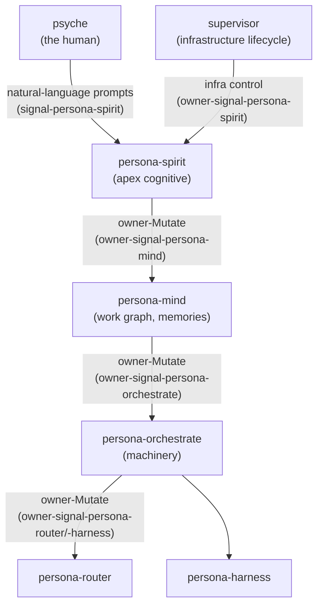

# 232 — persona-spirit: new component, psyche ↔ mind interface

*A new persona component sitting at the apex of the cognitive
authority chain. Spirit captures psyche intent in natural language,
parses it into typed records, and projects it into mind's memory
graph via owner-Mutate. Spawned last in the engine boot order;
designed per psyche illumination on 2026-05-19; operator picks up
implementation. The psyche has named this the most important
component of the persona system.*

## 0 · TL;DR

`persona-spirit` is a new triad component. It is the **interface
between `persona-mind` and the psyche** — the part of the persona
system that tracks the human, captures intent, and projects psyche
direction into mind's typed memory graph.

It is the **apex of the cognitive authority chain.** The supervisor
has higher permission only as infrastructure (process lifecycle); spirit
is the apex among thinking components. Spawned **last** in the persona
engine boot order — every component it depends on must be up first.

Operator picks up implementation per **`primary-ojxq`** (P1).
The psyche has named this the most important component of the
persona system.

Three repos to create:

- `persona-spirit/` — daemon + thin CLI + `bootstrap-policy.nota`
- `signal-persona-spirit/` — ordinary contract
- `owner-signal-persona-spirit/` — owner-only contract

Six open questions for the designer-operator pair settle below.

## 1 · Why this component exists

The psyche stated the illumination directly. From
`intent/persona.nota`:

- *"It is the interface between the persona mind and the psyche."*
- *"the apex, the most powerful part, notwithstanding the supervisor."*
- *"a sort of persona mind of its own, but it's specialized on the
  psyche, on keeping track of the psyche."*
- *"Persona is a meta AI system. … what drives humans, right, at the
  highest level is spirit. That's what animates us."*

The naming carries the architecture: spirit animates. A persona
without spirit is mechanism; with spirit, it has direction tied to a
real psyche. The scriptural framing (first breath gives life) and the
astrological framing (first breath gives the personality chart) both
emphasize that spirit is the principle that turns substrate into a
living system. `persona-spirit` plays that role for persona.

Functionally:

- The psyche speaks natural-language prompts. Spirit receives them.
- Spirit parses prompts into typed intent (the five-kind
  `Decision`/`Principle`/`Correction`/`Clarification`/`Constraint`
  vocabulary from `skills/intent-log.md`).
- Spirit forwards intent into mind's authority chain via owner-Mutate
  on `owner-signal-persona-mind`.
- Spirit tracks psyche presence/absence, recent intent history, and
  pending intent-clarification questions (per
  `skills/intent-clarification.md`).
- Long-term: spirit owns the canonical intent surface (today's
  filesystem `intent/<topic>.nota` files migrate into spirit's
  sema-engine state; spirit projects them back to disk during the
  cutover window for tool compatibility).

## 2 · Authority position

Spirit sits at the apex of the cognitive structure. The authority
graph after spirit lands:



Two implications for existing components:

- **`persona-mind` gains an owner.** Mind currently has no upstream
  cognitive authority; spirit becomes that authority. `owner-signal-persona-mind`
  may need new variants for spirit-to-mind orders (intent records
  arriving, psyche-state transitions, work-graph priority hints).
- **`owner-signal-persona-spirit`'s only legitimate caller is the
  supervisor.** Spirit has no cognitive owner; the supervisor uses
  its owner contract for process-lifecycle concerns only (start,
  stop, drain, reload bootstrap-policy).

## 3 · Component shape

Per `skills/component-triad.md` — the five invariants apply unchanged.

```
persona-spirit/
  src/lib.rs
  src/bin/persona-spirit-daemon.rs
  src/bin/persona-spirit.rs        thin CLI
  bootstrap-policy.nota
signal-persona-spirit/
  src/lib.rs                       signal_channel! ordinary surface
  tests/round_trip.rs
owner-signal-persona-spirit/
  src/lib.rs                       signal_channel! owner surface
  tests/round_trip.rs
```

Component-triad witness tests apply (all five invariants).

## 4 · Spirit's state

Per `skills/component-triad.md` invariant #5, state splits into
policy and working categories. Both live in `persona-spirit.redb` via
`sema-engine`.

**Policy state** (owner-Mutate from supervisor only; first-start
bootstrap from `bootstrap-policy.nota`):

- Psyche identity markers (name? Communication preferences? Default
  certainty when phrasing is ambiguous? — see Q2 below)
- Authority delegation policy (which downstream Mutates spirit is
  authorized to issue, against which contracts)
- Natural-language parsing policy (which models/configs translate
  psyche prompts into typed intent — see Q5 below)

**Working state** (peer-callable Asserts and owner-Mutate from
supervisor):

- Psyche presence log (active / absent transitions; last-active
  timestamp; current focus area)
- Intent history (the typed intent records spirit has captured;
  mirrors today's `intent/<topic>.nota` content)
- Pending clarification questions (intent-clarification requests
  spirit has surfaced to the psyche but not yet received an answer
  for)
- Forwarded-Mutate audit (record of every owner-Mutate spirit issued
  to mind, with the originating psyche statement)

## 5 · Wire surface (initial draft)

### `signal-persona-spirit` (ordinary, peer-callable)

| Variant | Verb | Direction |
|---|---|---|
| `PsycheStatement` | `Assert` | psyche → spirit (the CLI submits psyche prompts as one NOTA arg) |
| `PsycheStateObservation` | `Match` | peer queries spirit's view of psyche presence |
| `PsycheStateSubscription` | `Subscribe` | peer receives psyche-state transitions |
| `IntentRecordObservation` | `Match` | peer queries recorded intent |
| `IntentRecordSubscription` | `Subscribe` | peer receives intent as spirit captures it |
| `ClarificationQuestionPending` | `Match` | peer queries open clarification questions |

### `owner-signal-persona-spirit` (owner-only, supervisor-issued)

| Variant | Verb |
|---|---|
| `StartSpiritOrder` | `Mutate` |
| `DrainAndStopOrder` | `Mutate` |
| `ReloadBootstrapPolicyOrder` | `Mutate` |
| `RegisterPsycheIdentity` | `Mutate` |
| `RetirePsycheIdentity` | `Retract` |

The owner surface is small because spirit has no cognitive owner.
Most of spirit's authority flows *downward* (spirit issuing
owner-Mutate to mind), not upward into spirit.

## 6 · Spawn order

Spirit is the LAST component spawned in persona's boot sequence
because it depends on everything it commands:

1. supervisor (infrastructure)
2. mind
3. orchestrate
4. router
5. harness
6. terminal
7. message
8. introspect
9. (any other operational components)
10. **spirit** — last, after all targets are reachable

Spirit's startup work:
1. Open `persona-spirit.redb`. Bootstrap policy from
   `bootstrap-policy.nota` if first-start.
2. Connect to mind's owner socket (`owner-signal-persona-mind`).
3. Subscribe to mind's intent-relevant streams (psyche-state
   observations the mind serves, etc.).
4. Open spirit's own ordinary socket for psyche prompts.
5. Announce ready to the supervisor.

## 7 · Migration of today's intent layer

Today's `intent/<topic>.nota` + per-repo `INTENT.md` files are
filesystem-projected. The migration target:

| Surface | Today | After spirit lands |
|---|---|---|
| Intent recording | Agents write to `intent/<topic>.nota` directly | Spirit captures psyche prompts and records via its sema state; projects to disk during cutover for tool compatibility |
| Intent queries | Agents grep `intent/` | Agents query spirit's `IntentRecordObservation` / `IntentRecordSubscription` |
| Per-repo `INTENT.md` | Agents synthesise from `intent/` | Spirit synthesises and projects; agents read |
| Supersession | Agents edit files per `skills/intent-maintenance.md` | Spirit handles supersession via typed records; `Supersedes` relations in the work graph |

Until spirit ships, filesystem discipline is canonical
(`skills/intent-log.md`, `skills/intent-maintenance.md`,
`skills/repo-intent.md` are the truth). After spirit ships, those
skills get a "spirit-mediated mode" section; the filesystem becomes a
projection.

## 8 · Open questions for the designer-operator pair

Six questions need settlement before or during implementation.

### Q1 — Does spirit own mind via `owner-signal-persona-mind`?

The implication of "spirit is the apex" is that spirit issues
owner-Mutates to mind. Today, `owner-signal-persona-mind` exists in
contract form but has no cognitive caller (the supervisor calls it
only for lifecycle Mutates). Spirit becomes the cognitive caller.

**Confirm**: spirit owns mind in the authority graph; yes/no.

### Q2 — What's in `bootstrap-policy.nota` for spirit?

First-start bootstrap needs:

- Psyche identity markers — name? Default certainty heuristics?
  Communication-style preferences?
- Authority delegation policy — which contracts spirit is authorised
  to issue Mutates against (mind, eventually others)?
- NLP / parsing policy — see Q5.

**Confirm**: shape of the bootstrap declaration.

### Q3 — Sub-topic NLP / classification

Spirit needs to parse a natural-language psyche prompt into:

- The intent kind (`Decision`/`Principle`/`Correction`/etc.).
- The topic (which `intent/<topic>.nota` file the entry lands in).
- The certainty (`Maximum`/`Medium`/`Minimum`).
- The summary, quote, and context.

This is non-trivial NLP. Options:

1. **Sub-agent.** Spirit invokes a fine-tuned classifier (a small
   LLM call) and records the result.
2. **Rule-based.** Spirit uses fixed pattern rules (the certainty
   vocabulary in `skills/intent-log.md` is already this shape).
3. **Hybrid.** Rules first; LLM for ambiguous cases.

**Confirm**: which path; how the model/classifier is selected and
configured.

### Q4 — Spirit-to-mind verb set

What does spirit Mutate on `owner-signal-persona-mind`? At minimum:

- `Mutate IntentArrived` — a new psyche intent should land in mind's
  memory graph.
- `Mutate PsychePresent` / `Mutate PsycheAbsent` — psyche-state
  transitions.
- `Mutate PsycheFocus` — current area of attention (drives mind's
  prioritisation).

**Confirm**: the verb set; the record shapes.

### Q5 — CLI shape

Per `skills/component-triad.md` invariant — the CLI takes one
NOTA argument. For spirit specifically, the human author uses
natural language, not NOTA. Resolution:

The CLI accepts one of:
- A NOTA `PsycheStatement` record carrying the prompt
- A path to a NOTA file
- A path to a signal-encoded file

A psyche-facing wrapper (a separate tool, NOT the spirit CLI itself)
takes the human's plain text, wraps it in a `PsycheStatement` record,
and invokes the spirit CLI. The wrapper lives outside the triad —
it's a UX adapter, not a persona component.

**Confirm**: this two-layer shape; the wrapper's name and location.

### Q6 — Cutover sequence

The intent layer migration (§7) is itself an arc:

1. Spirit ships with empty intent store; filesystem `intent/` is
   still canonical.
2. Spirit starts mirroring filesystem entries into its sema store.
3. Agents start querying spirit instead of grep; filesystem becomes
   read-only.
4. Spirit becomes canonical writer; filesystem is projection.
5. Filesystem retires; spirit is the only intent surface.

**Confirm**: this sequencing, or a different cutover plan.

## 9 · Bead handoff

A new bead is filed for operator pickup. Implementation work
breakdown (operator may refine):

1. Create `signal-persona-spirit/` skeleton (gh repo + Cargo + flake +
   ARCH skeleton).
2. Create `owner-signal-persona-spirit/` skeleton.
3. Create `persona-spirit/` skeleton with daemon + CLI bin entries.
4. Settle Q1 (spirit owns mind?) with the designer; flip mind's
   ARCH if yes.
5. Draft contract types per §5 (signal-persona-spirit ordinary +
   owner-signal-persona-spirit).
6. Implement spirit daemon's actor tree:
   - `PersonaSpiritRoot` (Kameo root)
   - `OrdinarySignalSocketActor` (psyche prompts in)
   - `OwnerSignalSocketActor` (supervisor lifecycle)
   - `SemaEngineOwnerActor` (typed sema-engine state)
   - `MindOwnerCallerActor` (spirit's outbound client of
     `owner-signal-persona-mind`)
   - `IntentClassifierActor` (NLP layer per Q3)
   - `PsycheStateActor` (presence/absence tracking)
7. Wire `persona-spirit-daemon` into the spawn order (last).
8. Component-triad witness tests for the new triad.
9. Bootstrap-policy.nota shape per Q2.

## 10 · References

- `intent/persona.nota` — the verbatim psyche statements driving this
  design.
- `skills/component-triad.md` — universal triad invariants this
  component follows.
- `skills/intent-log.md` — current intent-recording discipline; the
  surface spirit will eventually own.
- `skills/intent-clarification.md` — when to ask the psyche; spirit
  becomes the daemon that captures the answers.
- `skills/repo-intent.md` — per-repo `INTENT.md`; spirit becomes the
  synthesiser eventually.
- `reports/designer/228-persona-orchestrate-recovered-design.md` —
  the prior major component design report; same shape as this one.
- `~/wt/.../persona-mind/ARCHITECTURE.md` (or `/git/.../persona-mind/`) —
  needs flip to mind-is-owned-by-spirit if Q1 lands yes.
