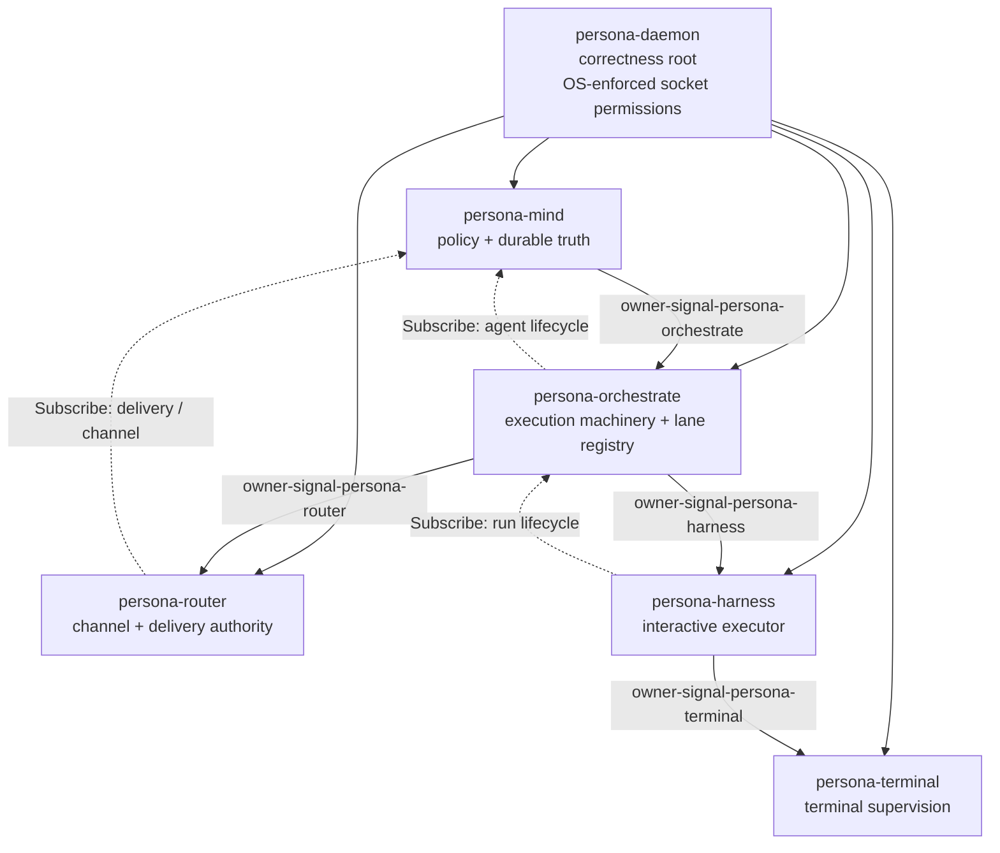

# 233 — persona-orchestrate operator handoff

*Single canonical operator-handoff for persona-orchestrate, amalgamating
the recovered-design context (was /228) and the response to the OA/154
audit (was /229). Both predecessors retire in the same commit; this is
the live operator-pickup surface.*

## 0 · TL;DR

`persona-orchestrate` is a real triad component, partially shipped:

- `signal-persona-orchestrate` (commit `0251c888`) — ordinary contract carved out of `signal-persona-mind` with 21 round-trip witnesses preserved.
- `persona-orchestrate` (commit `be5dfa2a`) — daemon scaffold + sema-engine state via `persona-orchestrate.redb`.
- `orchestrate-cli` — second-assistant lanes mapped; path-prefix activity-filter fixed.
- Closed-enum lane gap addressed in interim (second-* variants added to both contract enums).

What's missing: the daemon is not yet long-lived over a socket; thin CLI absent; component-triad witness tests absent; `Subscribe` variants absent; `owner-signal-persona-orchestrate` and the chain co-arrival contracts absent; lane registry as sema state not implemented; lock-file projection still inverted.

**Next implementation arc ships the full triad** (signal + owner-signal authority surfaces together, per `skills/component-triad.md` invariant #4 — owner-signal is part of the triad, not a follow-up). Bead `primary-hrhz` covers it. Six prior open questions answered or absorbed; this report carries the live direction.

## 1 · The state-vs-machinery split (load-bearing)

`persona-mind` owns STATE — work graph, memory, thoughts, durable policy truth, channel-grant authority decisions. `persona-orchestrate` owns MACHINERY — role claims, activity log, agent-run lifecycle, spawn plans, scope-acquisition workflow, executor capacity snapshots, scheduling state, escalation state, lane registry.

Psyche-stated 2026-05-18; recorded in `intent/persona.nota`. This split underwrites every design decision below.

## 2 · Decided architecture

Settled in skills, ARCHITECTUREs, and prior reports — psyche has confirmed each:

1. **persona-orchestrate is a full triad component** (daemon + thin CLI + signal-* + owner-signal-*). Not folded into mind.
2. **Mutate authority chain runs through orchestrate.** `persona-mind → persona-orchestrate → persona-router / persona-harness`. Mind issues `SpawnAgentOrder` / `AcquireScopeOrder` / `EscalationOrder`; orchestrate executes — itself issuing downstream `Mutate` / `Retract` to router (channel grants) and harness (spawn / pause / resume / stop).
3. **One owner per component** (the owner graph is a tree). `persona-daemon → mind → orchestrate → router/harness`; `harness → terminal`.
4. **Owner-only sockets are an OS security boundary**, not a convention. Per-component Unix users/groups for first-pass enforcement; same-UID prototype is unsafe author-only dev.
5. **`OwnerSignal` is the permission class.** Repo: `owner-signal-<component>`. Crate: `owner_signal_<component>`.
6. **One actor per Signal contract surface.** Daemon binds one socket per contract; each has its own typed listener actor.
7. **Build the OwnerSignal chain end-to-end in the first pass.** `owner-signal-persona-orchestrate` + `owner-signal-persona-router` + `owner-signal-persona-harness` ship together, not link by link.
8. **`tools/orchestrate` is transitional.** The Rust port at `orchestrate-cli` writes lock files today; eventually routes through `persona-orchestrate`.
9. **Lane registry is data, not enum variants.** Lanes come from config at startup and are mutable at runtime via the `owner-signal-persona-orchestrate` `LaneRegistry*` family. The closed `RoleName` enum eventually dissolves.
10. **Communication socket vs supervision socket** at the component boundary.
11. **`CreateSession` is `Mutate`.** Owner-Mutates target stable names, not new facts. Same shape applies to all orchestrate orders.
12. **Verb is not the permission boundary; request vocabulary is.** A non-owner socket doesn't know owner-only variants; it may still carry ordinary `Mutate` variants on its own surface.
13. **State split** — mind owns state, orchestrate owns machinery (per §1).
14. **Submission vs Order is structural.** `Assert ScopeAcquisitionSubmission` (caller asks) is a different verb than `Mutate AcquireScopeOrder` (mind authoritatively orders).
15. **No raw lock-file strings as scope identity.** Scope identity is a typed `Scope` enum: `Path`, `Task`, `ReportLane`, `Component`, `WorkGraph`.
16. **Executor management** currently missing from `signal-persona-harness`. Add to `signal-persona-harness` first; factor a generic `signal-persona-executor` only when raw-LLM executor exists.
17. **`persona-daemon` is the engine manager, separate from orchestrate.** Persona-daemon owns engine/component process lifecycle; orchestrate orders agent runs *inside* already-running executor components.

## 3 · Component shape

```
persona-orchestrate/                       runtime
  src/lib.rs                              component library
  src/bin/persona-orchestrate-daemon.rs   long-lived daemon
  src/bin/persona-orchestrate.rs          thin CLI
  bootstrap-policy.nota                   first-start policy
signal-persona-orchestrate/                ordinary wire vocabulary  (shipped — 0251c888)
owner-signal-persona-orchestrate/          owner-only authority/configuration  (TBD)
```

Per `skills/component-triad.md` five invariants apply unchanged. Witness tests apply (the five-invariant list).

## 4 · Authority chain



(After persona-spirit lands per /232, spirit owns mind, becoming the apex of this chain. Out of scope for this report.)

Verbs at each link:

| Link | OwnerSignal contract | Direction | Key verbs |
|---|---|---|---|
| `mind → orchestrate` | `owner-signal-persona-orchestrate` | downstream | `Mutate SpawnAgentOrder`, `Mutate AcquireScopeOrder`, `Mutate StopAgentOrder`, `Mutate SetSchedulingPolicy`, `Mutate SetSupervisionPolicy`, `Mutate EscalationOrder`, `Mutate RegisterLaneOrder`, `Retract RetractLaneOrder`, `Mutate UpdateLaneMetadataOrder`, `Retract ReleaseScopeOrder` |
| `orchestrate → mind` | `signal-persona-mind` | upstream (facts) | `Assert RoleClaim`, `Retract RoleRelease`, `Mutate RoleHandoff`, `Assert ActivitySubmission` |
| `orchestrate → router` | `owner-signal-persona-router` (TBD) | downstream | `Mutate ChannelGrant`, `Mutate ChannelExtend`, `Retract ChannelRetract` |
| `orchestrate → harness` | `owner-signal-persona-harness` (TBD) | downstream | `Mutate StartAgentRun`, `Mutate StopAgentRun`, `Mutate PauseAgentRun`, `Mutate ResumeAgentRun`; `Subscribe ExecutorCapacityStream` |
| `harness → terminal` | `owner-signal-persona-terminal` (shipped `9753806f`) | downstream | `Mutate CreateSession`, `Retract RetireSession` |

## 5 · Contract surface

### Ordinary — `signal-persona-orchestrate`

| Family | Verb | Origin |
|---|---|---|
| `ScopeAcquisitionSubmission` | `Assert` | peer / CLI |
| `ScopeReleaseSubmission` | `Retract` | scope holder |
| `BlockedWorkReport` | `Assert` | executor / agent |
| `OwnRunObservation` | `Match` | peer / CLI |
| `OwnRunLifecycleSubscription` | `Subscribe` | peer / CLI |
| `SpawnPlanValidation` | `Validate` | mind / CLI dry-run |
| `LaneRegistryObservation` | `Match` | any peer |
| `LaneRegistrySubscription` | `Subscribe` | any observer |
| `ActivityStream` | `Subscribe` | any observer (gap §8.1) |
| `ClaimStream` | `Subscribe` | any observer (gap §8.1) |

### Owner — `owner-signal-persona-orchestrate` (to create)

| Family | Verb |
|---|---|
| `SpawnAgentOrder` | `Mutate` |
| `StopAgentOrder` | `Retract` |
| `PauseAgentOrder` / `ResumeAgentOrder` | `Mutate` |
| `AcquireScopeOrder` | `Mutate` |
| `ReleaseScopeOrder` | `Retract` |
| `SetSchedulingPolicy` | `Mutate` |
| `SetSupervisionPolicy` | `Mutate` |
| `EscalationOrder` | `Mutate` |
| `RegisterLaneOrder` | `Mutate` |
| `RetractLaneOrder` | `Retract` |
| `UpdateLaneMetadataOrder` | `Mutate` |
| `LaneRegistrySnapshotQuery` | `Match` |
| `OwnerSnapshotQuery` | `Match` |
| `AgentLifecycleSubscription` | `Subscribe` |
| `ExecutorCapacitySubscription` | `Subscribe` |
| `ScopeEventSubscription` | `Subscribe` |

Reply families: `SpawnOrderAccepted` / `SpawnOrderRejected` / `AgentRunStarted` / `AgentRunCompleted` / `AgentRunFailed` / `ScopeAcquired` / `ScopeRejected` / `ScopeReleased` / `SupervisionPolicyAccepted` / `OrchestrateSnapshot` / `LaneRegistrySnapshot` / `OrchestrateUnimplemented`.

Event streams: `AgentLifecycleStream` (Requested / Planned / Starting / Running / WaitingOnUser / Blocked / Completed / Failed / Stopping / Stopped / Cancelled); `ScopeEventStream` (Requested / Acquired / Contested / Released / Expired / Denied); `ExecutorCapacityStream` (Available / Saturated / Degraded / Unavailable / Recovered); `EscalationStream` (BlockedWorkEscalated / UserDecisionNeeded / AgentQuestionRaised).

## 6 · Sema-engine state schema

`persona-orchestrate.redb` opened through `sema-engine`. Two state categories per `skills/component-triad.md` invariant #5: **policy state** (owner-Mutate only; bootstrapped from `bootstrap-policy.nota`) and **working state** (peer-callable per contract; never bootstraps).

| Table | Key | Value | Category | Status |
|---|---|---|---|---|
| `lane_registry` | `LaneIdentifier` | `LaneRecord { identifier, name, assistant_of?, beads_label, metadata, created_at }` | policy | to add |
| `scheduling_policy` | (singleton) | `SchedulingPolicy { capacity_caps, backpressure_thresholds, priority_rules }` | policy | to add |
| `supervision_policies` | `LaneIdentifier` or `AgentRunIdentifier` | `SupervisionPolicy { restart_strategy, drain_window, escalation_target }` | policy | to add |
| `claims` | `LaneIdentifier` | `StoredClaim { lane, scope, reason, claimed_at }` | working | migrated from persona-mind ✓ |
| `claim_archive` | `slot` | `ArchivedClaim` | working | ✓ |
| `activities` | `u64` (slot) | `StoredActivity { slot, lane, scope, reason, stamped_at }` | working | migrated from persona-mind ✓ |
| `activity_next_slot` | (singleton) | `u64` | working | ✓ |
| `agent_runs` | `AgentRunIdentifier` | `AgentRunRecord { ... }` | working | to add |
| `agent_run_archive` | `slot` | Archived agent-run records | working | to add |
| `spawn_plans` | `SpawnPlanIdentifier` | `SpawnPlan { plan_id, agent_run, dependencies, validation_state }` | working | to add |
| `agent_executors` | `ExecutorIdentifier` | `ExecutorRegistration { ... }` | working | to add |
| `scope_acquisitions` | `slot` | `ScopeAcquisitionRecord { ... }` | working | to add |
| `channel_grants` | `ChannelGrantId` | `ChannelGrantRecord { run_id, channel, lifecycle }` | working | to add |
| `escalation_state` | `slot` | `EscalationRecord { source_run, reason, surfaced_at, resolved_at? }` | working | to add |
| `commit_log` | (sema-engine built-in) | per-commit deltas | working | ✓ |

## 7 · Decided answers to the OA/154 questions

(Originally /229's six-Q section, condensed.)

- **Ordinary triad vs OwnerSignal first?** False dichotomy. Per `skills/component-triad.md` invariant #4, owner-signal is part of the triad. The next implementation arc ships *both* authority surfaces together. Per DA/116 A4, that arc also creates `owner-signal-persona-router` and `owner-signal-persona-harness` contract repos (skeletons in those daemons are acceptable; the contracts must exist).
- **`RoleName` survives in `signal-persona-mind`?** No — eventually dissolves on both contracts. The interim second-* variant repair is correct stopgap. Final state: typed `LaneIdentifier` newtype; lane definitions are sema state, not enum variants.
- **Sema typed read-during-write helpers?** Yes — file as a separate sema bead. Service-level sequencing in `OrchestrateService::handle` is a fine prototype workaround.
- **Sub-scope handoff valid?** No. Psyche-settled 2026-05-19: *"if an agent claims a directory, then everything in that directory is claimed. … If you want to claim only certain files in a subdirectory, you have to claim them explicitly. We can't do like this minus this."* Contract gets typed `HandoffRejection::ScopeNotHeldExactly`.
- **Activity slot exposed in query records?** Yes. Add `slot: u64` to `Activity` (matching the slot in `ActivityAcknowledgment`). Required for subscription catch-up.
- **First lane-registry migration shape?** Two stages. Stage (a) — sema-backed registry + ordinary Match/Subscribe + owner-signal `Register/Retract/UpdateLaneOrder` ship together. Stage (b, later) — closed `RoleName` enum dissolves into typed `LaneIdentifier`.

## 8 · Architectural gaps as of session-end 2026-05-19

What still needs operator work, beyond the carve-out:

1. **Triad incomplete.** Daemon is scaffold; no long-lived process accepts `OrchestrateFrame` over a socket; no thin CLI; component-triad witness tests not written.
2. **OwnerSignal chain absent.** `owner-signal-persona-orchestrate`, `owner-signal-persona-router`, `owner-signal-persona-harness` repos don't exist.
3. **Lane registry not implemented.** Closed `RoleName` enum is contract identity today; sema `lane_registry` table doesn't exist.
4. **Push-not-poll violated.** Ordinary contract has Match + queries; no Subscribe variants for activity, claim, or lane-registry events.
5. **Atomicity through sema is non-typed.** Service-level lock workaround for what should be typed read-during-write at the sema layer. Separate sema bead.
6. **Lock-file compatibility inverted.** `tools/orchestrate` / `orchestrate-cli` writes lock files as live surface; destination is daemon-as-truth, lock-files-as-projection-during-cutover.
7. **Handoff semantics implicit.** Add `HandoffRejection::ScopeNotHeldExactly` typed variant.
8. **`Activity` missing `slot`.** Add `slot: u64` field.
9. **Mind-side caller for owner-signal-persona-orchestrate doesn't exist.** Seed recommendation: `Mutate RegisterLaneOrder`.
10. **ARCH cross-references** in `persona/`, `persona-mind/`, `persona-router/`, `signal-persona-mind/` all have "when persona-orchestrate lands" future-tense paragraphs that flip to present-tense once shipped.
11. **`ChannelGrant` is `Assert`; should be `Mutate`.** Contract-drift item.
12. **Contract doc-comment cites retired report `/93`.** `signal-persona-orchestrate/src/lib.rs` header references a long-retired report; point at this report (`/233`) and inline the load-bearing rule.

## 9 · Recommended next-arc shape

Concrete ordering for the next implementation arc. Single arc; ships the whole triad.

1. **Ordinary `Subscribe` variants** — `signal-persona-orchestrate` adds `Subscribe ActivityStream`, `Subscribe ClaimStream`, `Subscribe LaneRegistryStream` (plus round-trip witnesses).
2. **Activity slot exposed** — `Activity` record carries `slot: u64`. Round-trip witnesses updated.
3. **Exact-scope-match handoff documented** — contract doc-comment + ARCH update; typed `HandoffRejection::ScopeNotHeldExactly` variant.
4. **Create `owner-signal-persona-orchestrate`** — new repo; `signal_channel!` declares the verbs in §5; round-trip witnesses; standard 14-file shape per `skills/repository-creation.md`.
5. **Create `owner-signal-persona-router` and `owner-signal-persona-harness`** — chain-discipline co-arrival; contracts only (skeleton actors in router/harness daemons are acceptable).
6. **`persona-orchestrate-daemon` made real** — long-lived process; binds ordinary socket + owner socket; one actor per Signal contract surface; sema-engine state owned exclusively by daemon; lock-file projection as daemon side effect on accepted state mutation. Component-triad witness tests land — both authority surfaces covered.
7. **Thin `persona-orchestrate` CLI** — one NOTA request in, one NOTA reply out, exactly one Signal peer (its daemon's ordinary socket).
8. **Lane registry table + ordinary observation + owner mutation together** — `lane_registry` table in sema; bootstrap from `orchestrate/roles.list`; ordinary `LaneRegistrySnapshot` + `LaneRegistrySubscription`; owner `RegisterLaneOrder` / `RetractLaneOrder` / `UpdateLaneMetadataOrder`. Closed `RoleName` enum stays as namespace stable id for this arc.
9. **Mind-side caller stub for `owner-signal-persona-orchestrate`** — `persona-mind` issues `Mutate RegisterLaneOrder` end-to-end as the witness for the authority chain working.
10. **ARCH cross-reference flip pass** — every "when persona-orchestrate lands" reference in `persona/ARCHITECTURE.md`, `persona-mind/ARCHITECTURE.md`, `persona-router/ARCHITECTURE.md`, `signal-persona-mind/ARCHITECTURE.md`, and the workspace skills flips from future-tense to present-tense.

## 10 · Beads

| Bead | Status | What |
|---|---|---|
| `primary-hrhz` | OPEN, P1 | The carve-out work. Phase 1 (ordinary slice carve) done; phase 2 is this report's §9 ordering. |
| `primary-699g` | OPEN, P2 | Design persona-orchestrate component + signal-persona-orchestrate ordinary + OwnerSignal chain. References this report. |
| `primary-jboc` | OPEN, P2 | RoleName closed-enum gap. Stays open until §7 stage (b) dissolves the enum. |
| `primary-ojxq` | OPEN, P1 | persona-spirit triad (separate component; orchestrate's apex once spirit ships per /232). |

A new sema feature bead for `Engine::update<F>` + `Table::get_for_update` typed helpers is recommended (designer-shaped, sema-owned); see §8 gap #5.

## 11 · References

- `skills/component-triad.md` — universal triad invariants this component follows.
- `skills/contract-repo.md` — `signal_channel!` discipline.
- `orchestrate/AGENTS.md` — workspace orchestration boundary today vs eventual.
- `intent/persona.nota` — psyche-stated decisions on orchestrate (state-vs-machinery split; persona-orchestrate is a real component; etc.).
- `intent/component-shape.nota` — psyche-stated triad invariants (single-NOTA-argument, no-permission-signal-tier, owner-signal-is-part-of-triad, policy-vs-working-state, sub-scope-handoff-forbidden).
- `reports/operator-assistant/154-primary-hrhz-architecture-audit-2026-05-18.md` — the audit this report answers.
- `reports/designer-assistant/115-orchestrate-integration-architecture-2026-05-17.md` — canonical integration design (Submission vs Order, typed Scope, executor management surface).
- `reports/designer-assistant/116-permission-scoped-signal-contracts-and-sockets-2026-05-17.md` — OwnerSignal A1-A5 settlements.
- `reports/second-designer-assistant/6-roles-as-config-owner-socket-mutable-2026-05-17.md` — LaneRegistry-as-config direction.
- `/git/.../persona-orchestrate/` (commit `be5dfa2a`) — daemon scaffold.
- `/git/.../signal-persona-orchestrate/` (commit `0251c888`) — ordinary contract.

Predecessors: this report supersedes `reports/designer/228-persona-orchestrate-recovered-design.md` and `reports/designer/229-persona-orchestrate-triad-completion-direction.md`. Both deleted in the same commit as this report's first landing.
