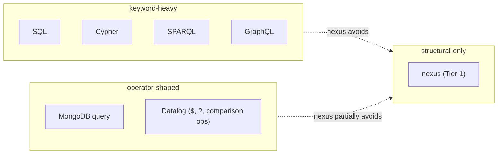

# Nexus among database languages — a comparative survey

Status: comparative research
Author: Claude (designer)

The user asked me to compare nexus against actual database
languages instead of dropping drive-by mentions of SQL,
Datalog, and GraphQL into reports 22 and 23. This is that
work.

Six languages, surveyed against eight dimensions: grammar
surface, verb mechanism, pattern shape, schema posture,
projection, predicates, subscriptions, identity/binding rules.
For each, what nexus does differently, what nexus does *the
same*, and what nexus could honestly borrow without breaking
its structural-base + everything-else-is-Enum principles.

The languages: **SQL**, **Datalog (Datomic flavour)**,
**Cypher (Neo4j)**, **SPARQL**, **GraphQL**, **MongoDB query
language**. SQL and Datalog because they're the canonical
families. Cypher because graph-pattern syntax is the closest
analogue to nexus's pattern delimiter. SPARQL because triple
patterns are an interesting alternative to record patterns.
GraphQL because schema-driven typed queries are right next
door. MongoDB because object-shaped queries are the
unstructured-typed end of the spectrum.

---

## 0 · TL;DR



Three things nexus does that **no surveyed peer does fully**:

1. **No reserved keywords beyond literals** (`true` / `false` /
   `None`). SQL has dozens; Datomic Datalog has `:find` /
   `:where` / `:in`; Cypher has `MATCH` / `WHERE` / `RETURN`;
   SPARQL has `SELECT` / `WHERE` / `FILTER`; GraphQL has
   `query` / `mutation` / `subscription`; MongoDB uses `$gt` /
   `$or` / `$in` etc. as operator-string keys.
2. **Bind names must equal schema field names.** Every other
   surveyed language allows arbitrary variable / alias names
   (Cypher `(a:Person)` binds to alias `a`; Datalog
   `[?person :age ?age]` binds to `?person`; SPARQL
   `?subject`). Nexus's strict rule eliminates the IR's
   bind-name field and ties the text directly to the schema.
3. **Records are positional, not field-keyed.** Every
   surveyed peer uses field-keyed access: SQL `column_name`,
   Cypher `node.property`, Datalog `attribute keyword`,
   SPARQL predicate IRIs, GraphQL field selectors, MongoDB
   field paths. Nexus's positional records (`(Point 3.0 4.0)`,
   no `horizontal:` / `vertical:` keys) is the rkyv-in-text
   choice.

Three things nexus **dodges** that the peers spend grammar on:

1. **Projection (SELECT clause).** SQL, Cypher, SPARQL,
   GraphQL all have first-class projection: pick which fields
   come back. Nexus returns whole records; this is the
   `{ }` shape that report 22 recommended dropping.
2. **Comparison operators as syntax** (`<`, `>`, `=`, `>=`).
   SQL, Cypher, SPARQL, Datalog, MongoDB all have them.
   Nexus reserves them but defers; report 22 recommends
   replacing with predicate-record kinds (`(Adult @age)`).
3. **Variable-style aliases.** Cypher's `(a:Person)`, Datalog's
   `?e`, SPARQL's `?subject`, GraphQL's `$var` — all let the
   author name a binding distinctly from the schema. Nexus
   doesn't.

Three things nexus **doesn't have** that some peers have for
good reason:

1. **Joins / multi-pattern conjunction with bind unification.**
   Datalog and Cypher support multi-pattern queries where
   shared binds enforce equality across patterns. Nexus's
   `{| |}` constrain attempted this but was never implemented;
   report 22 dropped it.
2. **Aggregation operators** (count, sum, group-by). SQL,
   Cypher, SPARQL all support these. Nexus is M0+ and these
   are deferred indefinitely.
3. **Cardinality / pagination control on results.** SQL
   `LIMIT/OFFSET`; Cypher `LIMIT/SKIP`; GraphQL `first/after`.
   Nexus has nothing — query returns all matches.

These are real gaps, not "irrelevant for criome." The
recommendation at end of this report is what to do about each.

---

## 1 · Comparison grid

| Dimension | SQL | Datalog (Datomic) | Cypher | SPARQL | GraphQL | MongoDB | nexus (Tier 1) |
|---|---|---|---|---|---|---|---|
| Reserved keywords | ~80–200 (varies) | ~10 (`:find` `:where` `:in` `:keys` etc.) | ~30 (MATCH WHERE RETURN CREATE …) | ~20 (SELECT WHERE FILTER OPTIONAL …) | ~5 (`query` `mutation` `subscription` `fragment` `on`) | 0 lexical, ~50 `$`-prefixed operator keys | 3 literal idents (`true` `false` `None`) |
| Lookahead | Multi-token, shift-reduce | Single-token (S-expr) | Multi-token | Multi-token | Single-token | N/A (JSON) | 2-byte max |
| Verb mechanism | Top-level keyword | Top-level form (`:find` etc.) | Top-level keyword (MATCH/CREATE) | Top-level keyword (SELECT/INSERT/CONSTRUCT) | Top-level keyword (`query`/`mutation`) | API method (`find`/`update`) | Sigil prefix (current) or record wrapper (Tier 1) |
| Identity in record | Field name | Attribute keyword | Property name | Predicate IRI | Field name | Field name | Position |
| Pattern shape | WHERE predicates | Triple-pattern `[?e attr value]` | Path pattern `(node)-[edge]->(node)` | Triple pattern `?s ?p ?o` | Field selection `{field}` | Object pattern | Record pattern `(\| Kind @field … \|)` |
| Bind/variable | column alias `AS` | `?logical-var` | local alias `(a:Type)` | `?variable` | `$variable` | N/A | `@schema-field-name` |
| Bind naming rule | Author-named | Author-named | Author-named | Author-named | Author-named | N/A | **Schema-named** |
| Projection | SELECT | `:find` | RETURN | SELECT | Field selection | Projection arg | None (returns whole records) |
| Subscriptions | Vendor-specific (LISTEN, CDC) | tx-report queue | APOC triggers | None standard | First-class `subscription` | Change streams | First-class (proposed `*` or `(Subscribe …)`) |
| Wire form | Text + JDBC binary | EDN (S-expr) text + Datomic binary | Bolt protocol (binary) + text | Text | Text | BSON (binary) + JSON | rkyv (binary) + nexus text |

The dimensions that matter most for the *language design*:
**identity in record**, **bind naming rule**, and **lookahead**.
Nexus's choices on these three define what makes it different.

---

## 2 · SQL

```sql
SELECT name, age
FROM person
WHERE age > 21
ORDER BY name
LIMIT 10;
```

**Surface.** Reserved keywords drive everything: `SELECT`,
`FROM`, `WHERE`, `JOIN`, `GROUP BY`, `ORDER BY`, `HAVING`,
`LIMIT`, `OFFSET`, `INSERT`, `UPDATE`, `DELETE`, `CREATE`,
`ALTER`, `DROP`, `BEGIN`, `COMMIT`, plus type names (`INT`,
`VARCHAR`, etc.) and operators (`AND`, `OR`, `NOT`, `IN`,
`LIKE`, `BETWEEN`, …). The grammar requires multi-token
lookahead in places (e.g., distinguishing `LEFT OUTER JOIN`
from `LEFT JOIN` from `LEFT(string, n)`).

**Identity.** Field names. `SELECT name` — the column header
identifies. `WHERE age > 21` — `age` is the column.

**Pattern.** Predicates over rows. `WHERE` clause is a boolean
expression; rows passing the expression are returned.

**Projection.** First-class via `SELECT col1, col2`. The
projection list is what the query returns.

**Subscriptions.** Not in standard SQL. Vendors add LISTEN/
NOTIFY (Postgres), change-data-capture (Debezium, Kafka
Connect), or triggers, but these are out-of-band.

**What nexus does the same:** committed to a typed wire (each
column has a type at the schema layer); supports queries.

**What nexus does differently:** position vs field-name (huge);
no keywords (huge); no projection (currently); no operators
(deferred); subscriptions are first-class.

**What nexus could borrow:** projection. SQL learned that
returning whole rows is wasteful when the consumer only wants
two columns. Nexus's text+binary symmetry makes the same
argument less load-bearing locally (the bytes are cheap), but
on a network the projection pressure returns. Worth
revisiting: the dropped `{ }` shape might be defensible after
all when networking gets real.

---

## 3 · Datalog — Datomic flavour

```clojure
[:find ?name ?age
 :in $ ?min-age
 :where
 [?e :person/name ?name]
 [?e :person/age ?age]
 [(> ?age ?min-age)]]
```

**Surface.** Built on Clojure's S-expressions: `[`, `]`, `(`,
`)`, `:keyword`, `?logic-var`, literals. The "keywords" that
matter are `:find`, `:in`, `:where`, `:keys`, `:with` — clause
markers, not reserved words at the lexer level (they're just
keyword tokens).

**Identity.** Attribute keywords (`:person/name`,
`:person/age`). The schema's namespace+name identifies.

**Pattern.** Triple patterns: `[entity attribute value]`. The
entity is usually a logic variable; the attribute is a
keyword; the value is a literal or another logic variable.

**Bind/variable.** `?name`, `?e`, `?age`. Author-named, scoped
to the query. Sharing a name across patterns enforces
unification (this is *the* Datalog magic — `?e` in two patterns
means the same entity).

**Projection.** `:find` clause names which logic variables
appear in the result. `[:find ?name ?age]` returns pairs.

**Predicates.** Built-in functions in pattern position:
`[(> ?age 21)]`. Custom predicates are functions.

**Subscriptions.** Datomic offers a transaction report queue
(`d/tx-report-queue`); applications poll or push from this.
Not language-level.

**What nexus does the same:** record-shaped patterns (similar
to Datalog tuple patterns); structural delimiters; closed
schema.

**What nexus does differently:** position vs attribute-keyword
identity (smaller field names per record but tighter coupling
to source order); no logic-variable unification across patterns
(Datalog's killer feature); no `:find` projection; bind names
fixed to schema.

**What nexus is missing:** **multi-pattern conjunction with
bind unification.** This is the part of Datalog that's
genuinely irreplaceable. `[?e :person/age ?age] [?e :person/name ?name]`
gives you `(age, name)` pairs by unifying `?e` across the two
patterns. Nexus's dropped `{| |}` constrain was attempting
this. The cleaner answer: bind unification only works if
binds can outlive a single pattern. Nexus's
"binds-tied-to-schema-position" rule makes cross-pattern
unification awkward.

**Open question for nexus:** if cross-pattern unification is
needed, how does it land? A `Constrain` record kind that
carries a list of patterns plus a unification map? Or a more
substantial change?

---

## 4 · Cypher (Neo4j)

```cypher
MATCH (a:Person {name: 'Alice'})-[:KNOWS]->(b:Person)
WHERE b.age > 21
RETURN b.name, b.age
ORDER BY b.name
LIMIT 10
```

**Surface.** Keyword-driven (~30 reserved) plus three
delimiter pairs:
- `( )` for nodes
- `[ ]` for relationships (notice — different role than nexus)
- `{ }` for property maps (different again)

Plus arrow tokens `-->`, `-[…]->`, `<-[…]-` for relationship
direction. Plus `:Type` for labels.

**Identity.** Property name (`a.name`, `b.age`).

**Pattern.** Path pattern. `(a:Person)-[:KNOWS]->(b:Person)`
is "a is a Person, related by KNOWS, to b who is a Person."
Nodes and relationships are first-class; the language is
graph-shaped at the syntax level.

**Bind/variable.** Local aliases — `(a:Person)` makes `a`
refer to whatever node matched at this position. Property
access via `a.name`.

**Projection.** `RETURN a.name, a.age`. First-class.

**Predicates.** `WHERE` clause with operators and functions
(`=`, `<>`, `>=`, `STARTS WITH`, `IN`, etc.).

**Subscriptions.** APOC triggers and event listeners — not
core Cypher.

**What nexus does the same:** patterns are first-class; the
pattern delimiter `(| |)` is the closest syntactic analogue to
Cypher's `(node)`.

**What nexus does differently:** records vs graph nodes-and-
relationships (Cypher commits to graph; nexus is record-
neutral and could model graphs OR docs OR ...); no projection;
no aliases (binds = schema field names); no traversal arrows.

**What's noteworthy about Cypher:** the **three different
delimiter roles** are a strong commitment — `()` for nodes,
`[]` for relationships, `{}` for properties. Each role is
distinct. Nexus's `()`/`[]`/`(| |)` is structurally less
specialized but more universal: same `()` is data record OR
verb wrapper depending on context.

**What nexus could borrow:** the *visual ergonomics* of
relationship arrows. If nexus added a graph-flavoured layer
(via record kinds, not new syntax), it could express
`(KnowsEdge alice bob)` records, but a graph-shaped query
would need either constrain-style multi-pattern OR a dedicated
graph-pattern record. The Cypher `(a:Person)-[:KNOWS]->(b:Person)`
density isn't free — it's bought by committing to a
graph-only worldview.

---

## 5 · SPARQL

```sparql
PREFIX foaf: <http://xmlns.com/foaf/0.1/>
SELECT ?name ?age
WHERE {
  ?person a foaf:Person .
  ?person foaf:name ?name .
  ?person foaf:age ?age .
  FILTER(?age > 21)
}
ORDER BY ?name
```

**Surface.** Keyword-driven (`SELECT`, `WHERE`, `FILTER`,
`OPTIONAL`, `UNION`, `MINUS`, `BIND`, `VALUES`, `GRAPH`,
`PREFIX`, `BASE`, `CONSTRUCT`, `DESCRIBE`, `ASK`). Triple
syntax `subject predicate object .` with `?` for variables.
Curly braces `{ }` for graph patterns.

**Identity.** Predicate IRI (URI). Everything is a triple
`(subject, predicate, object)`. Resources are URIs;
properties are URIs; values are literals or URIs.

**Pattern.** Triple patterns. `?person foaf:name ?name`
matches all triples with subject `?person`, predicate
`foaf:name`, and binds the object to `?name`.

**Bind/variable.** `?variable`. Like Datalog, sharing a name
across patterns enforces unification. Like Datalog, scoped
to the query.

**Projection.** `SELECT ?var1 ?var2`. First-class.

**Predicates.** `FILTER(expr)`. Many built-in functions,
arithmetic, string ops.

**Subscriptions.** Not standard. Some triple stores offer
update notifications; not in language.

**What nexus does the same:** structural pattern matching;
typed schema (predicates are typed in RDF schema or OWL).

**What nexus does differently:** record-shaped vs
triple-shaped (this is *the* difference — RDF flattens
everything to (s, p, o) triples; nexus models composite
records); positional vs URI-keyed; no aliases; no projection;
no FILTER.

**What's interesting in SPARQL:** **triples as universal
form** is the inverse of nexus's *records as universal form*.
Both work. The trade: SPARQL's flattening makes everything
one shape (a triple), so the parser is even smaller. The cost:
multi-attribute records require multiple triples; the wire is
verbose. Nexus's records-as-composite is the higher-density
choice for typed-domain modeling.

---

## 6 · GraphQL

```graphql
query GetUser($id: ID!) {
  user(id: $id) {
    name
    age
    friends(first: 10) {
      name
    }
  }
}
```

**Surface.** Keyword-light (`query`, `mutation`,
`subscription`, `fragment`, `on`, `null`, `true`, `false`).
Field selection via `{ field1 field2 }`. Arguments via
`field(arg: value)`. Variables via `$name`. Type system
declared in SDL (Schema Definition Language, separate file).

**Identity.** Field name. `user`, `name`, `friends`.

**Pattern.** Field selection on a typed schema. The query is
a tree of selections; the response mirrors the shape.

**Bind/variable.** `$variable` — query parameters, declared
in the operation header.

**Projection.** First-class — the entire query IS a
projection. Selection sets `{ name age }` are nested
projections.

**Predicates.** Not in language. Filtering is done via
field arguments (e.g., `users(role: ADMIN)`); the schema
defines what arguments are valid.

**Subscriptions.** First-class. `subscription { ... }` opens
a long-lived stream over the same wire (typically WebSocket).

**What nexus does the same:** schema-driven; typed; supports
subscriptions.

**What nexus does differently:** positional vs field-keyed
(huge); no projection (huge); no nested selection sets;
predicates as schema records vs no predicates.

**What's interesting in GraphQL:** **the response mirrors the
query shape.** A query `{ user { name age } }` produces a
response of the same nested structure with values filled in.
Nexus's responses are typed records (full Node / Edge /
whatever) — there's no shape-mirroring because nexus has no
projection. If projection lands in nexus, the response shape
question reopens.

**What nexus could borrow:** the **subscription handshake
shape** — GraphQL subscriptions emit an initial value followed
by deltas, which is the workspace push-not-pull rule (per
report 22 §5). Nexus's current grammar.md says no initial
snapshot; that should change to GraphQL-style.

---

## 7 · MongoDB query language

```javascript
db.users.find(
  { age: { $gt: 21 }, name: { $in: ["Alice", "Bob"] } },
  { name: 1, age: 1, _id: 0 }
)
```

**Surface.** Object-shaped queries (BSON / JSON). No grammar
in the textual sense — the query IS a structured object.
"Operators" are field-key strings prefixed with `$`: `$gt`,
`$lt`, `$in`, `$or`, `$and`, `$exists`, `$regex`, etc.

**Identity.** Field name (`age`, `name`).

**Pattern.** Object pattern. The query object's shape matches
documents. Operator-keyed sub-objects express predicates
(`{ $gt: 21 }` means "greater than 21").

**Bind/variable.** N/A. MongoDB queries don't bind; they
match-and-project.

**Projection.** Second argument: `{ name: 1, age: 1 }` —
"include name and age." First-class.

**Predicates.** `$`-prefixed operator keys.

**Subscriptions.** Change streams (server-side), polled or
streamed via the driver. Reasonably first-class.

**What nexus does the same:** schema awareness (more recent
MongoDB has typed schemas); subscriptions as first-class.

**What nexus does differently:** structural delimiters vs
JSON-shaped (nexus is text with grammar; MongoDB is data
treated as a query); positional vs field-keyed; closed
predicate set vs open `$op` keys.

**What's interesting in MongoDB:** the **query-IS-the-data**
shape. The same JSON shape you'd insert is the shape you query
with. Nexus has the same property at the structural level
(records-data and pattern-records share the `( … )` shape) —
the difference is nexus uses positional fields and a separate
pattern delimiter, while MongoDB uses field-keyed fields with
operator-marker sub-objects.

---

## 8 · Where nexus is genuinely novel

After surveying these six, the parts of nexus that I cannot
find a precedent for in the surveyed languages:

### A. Bind-name-equals-schema-field-name

No surveyed peer enforces this. Cypher, Datalog, SPARQL all
let the author pick variable names. GraphQL has variables
but they're operation-scoped, not pattern-scoped.

The nexus rule: `(| Point @horizontal @vertical |)` — the bind
name MUST be `horizontal` and `vertical`. The author cannot
write `@h` or `@x`.

**Why this is genuinely novel:** every other language pays
the cost of an aliasing layer (the IR carries variable names;
the validator maps text-name to schema-name). Nexus pays
zero IR cost: position carries identity; bind names are a
literal echo. The trade is real and asymmetric in nexus's
favour for IR simplicity.

### B. No reserved keywords in the parser

Datomic Datalog has `:find`, `:where`, `:in`, `:keys`. Cypher
has MATCH, WHERE, RETURN. SPARQL has SELECT, WHERE, FILTER.
GraphQL has `query`, `mutation`, `subscription`. SQL has 80+.
MongoDB has `$gt`/`$lt`/etc. as operator-string keys (not
parser keywords but functionally similar).

Nexus has 3: `true`, `false`, `None` (and these are *literal*
keywords, not control-flow ones).

**Why this is genuinely novel:** every keyword-driven peer
makes adding new clause types a parser change. Nexus makes
adding new verbs a *schema* change (new variant in the
Request enum, no parser involvement). The "parser stays
small; new typed kinds are the central activity" ethos is
unique among the surveyed.

### C. Records-as-positional-typed-composites

Closest parallel: Cypher's `(a:Person {name: 'Alice'})` —
but Cypher uses a property-map `{name: 'Alice'}` for fields,
not positional. Closest *positional* parallel: Lisp /
Clojure's `(map :keyword 1 :keyword 2)` — also keyed.

The pure positional record `(Point 3.0 4.0)` with field
identity from schema position is a deliberate choice that
mirrors capnp / rkyv / FlatBuffers — but those are binary
formats. Doing it in text, with the schema doing the heavy
lifting, is the nexus signature.

**Why this is genuinely novel:** the surveyed text-format
peers all key fields by name. Nexus's choice to *not* key
fields makes the wire denser and the schema strictness
unavoidable. This is the load-bearing trade.

### D. The piped delimiter as "same shape, different mode"

Cypher uses `()` and `[]` for *different things* (nodes vs
relationships). Nexus uses `( )` and `(| |)` for the *same
thing in different modes* (data record vs pattern). This is a
modal-delimiter design — the structure is identical;
delimiters select interpretation.

I haven't seen this exact shape in surveyed languages. SPARQL's
`{ }` graph-pattern is a delimiter mode-shift, but the
contents are still triples (different shape from non-pattern
triples).

**Why this is genuinely novel:** lets pattern records share
the visual structure of data records. Reading `(Point @h @v)`
is reading the same Point shape with bind markers in field
positions. The mental model carries.

---

## 9 · Where nexus borrows (whether explicitly or accidentally)

| Feature | Borrowed from | Notes |
|---|---|---|
| S-expression-style delimiters | Lisp, Clojure, EDN | The `( head args )` shape with PascalCase head ident |
| Typed schema in a separate layer | rkyv, capnp, protobuf, GraphQL | Schema is the source of truth; wire is positional |
| Subscriptions as a verb | GraphQL, MongoDB change streams | First-class push channel |
| Logic-variable-style binds (the `@` sigil) | Datalog `?var`, SPARQL `?var` | Different naming rule but same syntactic role |
| Closed enum dispatch by head identifier | Algebraic data types (Haskell, Rust) | The `NexusVerb` derive expresses this |
| Pattern records as queries | Cypher's `(a:Person)`, MongoDB's object query | The "data shape IS the query shape" principle |
| Positional field access | rkyv, capnp, FlatBuffers | Wire density |

These borrowings are not bad — they're the right shoulders to
stand on. The combination is what makes nexus its own thing.

---

## 10 · Where nexus has gaps that peers fill

| Gap | Filled by | What it costs nexus to ignore |
|---|---|---|
| Multi-pattern conjunction with cross-pattern bind unification | Datalog, Cypher, SPARQL | Multi-record queries need either Constrain (which was dropped) or per-record fetches in the client (extra round trips) |
| Projection (return only some fields) | SQL, Cypher, SPARQL, GraphQL | Wire bandwidth on large records, especially over network |
| Predicates as part of the query | SQL `WHERE`, Datalog `[(> ...)]`, Cypher `WHERE`, SPARQL `FILTER`, MongoDB `$gt` | Filtering happens client-side; server returns more than needed |
| Aggregations (count / sum / group) | SQL, Cypher, SPARQL | Aggregation happens client-side; full record sets cross the wire |
| Cardinality control (LIMIT) | SQL `LIMIT`, Cypher `LIMIT`, GraphQL `first/after` | Unbounded result sets; client must close subscription manually |
| Arbitrary aliases (project a value as another name) | SQL `AS`, Cypher property aliasing, GraphQL field aliases | Schema names propagate verbatim to the consumer; no rename layer |
| Initial-state-on-subscribe | GraphQL subscriptions | Subscribe-then-wait-forever footgun (per push-not-pull skill) |

The first three (multi-pattern joins, projection, predicates)
are real gaps that the previous reports underweighted. The
recommendations follow.

---

## 11 · What this changes about earlier reports

### Report 22 (state of the language)

- The **drop {} shape** recommendation is correct given no
  current consumer, but **projection is a real gap** that
  every keyword peer has. When projection lands, `{ }` (or
  some equivalent) likely returns. Don't treat the drop as
  permanent.
- The **drop {| |} constrain** recommendation is partially
  wrong. Multi-pattern conjunction with bind unification IS
  what Datalog and Cypher excel at; it's a real capability.
  The current `{| |}` shape may not be right, but the
  *capability* matters. A different design (perhaps
  `(Constrain [pat1 pat2 …])` as a record kind, with bind
  unification rules in the validator) keeps the capability
  while removing the speculative delimiter.
- The **defer comparison operators** recommendation is
  still right — predicates as schema records is the
  consistent shape — but predicate language as a whole needs
  more concrete design. SQL/Cypher/SPARQL all need it.
- The **initial-state-on-subscribe** recommendation is
  reinforced by GraphQL's subscription model, which already
  does this.

### Report 23 (structural minimum)

- The Tier 1 trim is solid for criome's M0 needs.
- The **bind-name-equals-schema-field-name** rule is now
  named as genuinely novel, not just a quirk; the report
  should keep it as a load-bearing principle.
- The **records-as-positional-typed-composites** choice is
  also novel; the comparison to capnp/rkyv stands but should
  acknowledge it's the inverse of *every text peer surveyed*.
- The structural minimum may need to leave room for
  **multi-pattern joins** as a future record-kind, not as a
  parser feature. `(Constrain [pat1 pat2])` is a record;
  the parser doesn't change; the validator handles
  unification.

---

## 12 · Recommendations — concrete

| # | Recommendation | Status |
|---|---|---|
| 1 | Keep "no keywords" as the load-bearing differentiator. This is what keeps the parser tiny and lets schema be the central activity. | Confirmed |
| 2 | Keep "bind-name-equals-schema-field-name." Genuinely novel; eliminates IR alias bookkeeping. | Confirmed |
| 3 | Keep records-as-positional. The cost is real (schema strictness) but the win is real (wire density, parser simplicity). | Confirmed |
| 4 | Re-open the projection question. Drop `{ }` for now per report 22, but track it as a known gap that returns when networking matters. | **Updated** |
| 5 | Re-open the multi-pattern-conjunction question. Drop `{\| \|}` per report 22, but design a record-kind replacement (`(Constrain [...])`) before the gap blocks a real consumer. | **Updated** |
| 6 | Adopt GraphQL's initial-state-on-subscribe shape. This reinforces the push-not-pull workspace rule and removes the subscribe-and-wait-forever footgun. | **Updated** |
| 7 | Predicate operators stay deferred — predicates as schema records (`(Adult @age)`) keep the parser small and let domain semantics live in typed kinds. But: a sketch of how predicate records compose is needed before this scales. | Confirmed |
| 8 | Aggregation and cardinality control are post-M2 work. Acknowledge as gaps; don't design around them yet. | Acknowledged |

---

## 13 · See also

- `~/primary/reports/designer/22-nexus-state-of-the-language.md`
  — implementation gap audit. This report updates it.
- `~/primary/reports/designer/23-nexus-structural-minimum.md`
  — structural minimum. This report adds the comparative
  context.
- `~/primary/repos/nexus/spec/grammar.md` — what's being
  compared.
- `~/primary/skills/push-not-pull.md` §"Subscription
  contract" — reinforced by GraphQL's initial-state-on-
  subscribe shape.

---

*End report.*
